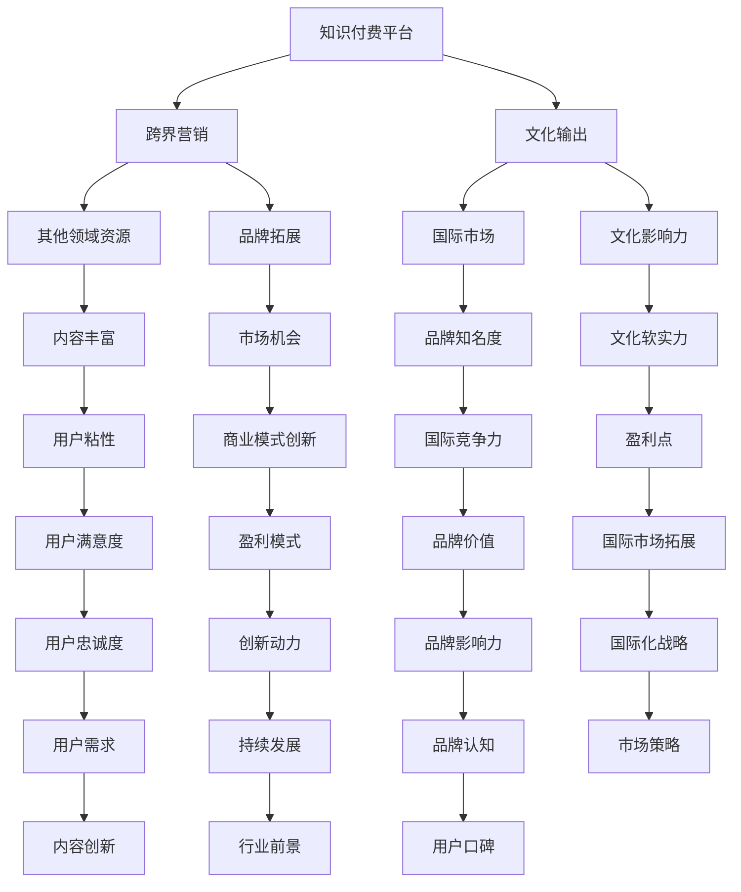

                 

### 1. 背景介绍

在当今全球化的信息时代，知识付费作为一种新型的商业模式，正在迅速崛起。知识付费的本质是将专业知识和技能转化为有价商品，通过在线平台提供给有需求的消费者。随着互联网技术的发展和用户对高质量知识内容的渴求，知识付费行业呈现出爆发式增长。

然而，仅仅依靠传统的知识付费模式，已经无法满足市场的多元化需求。跨界营销和文化输出成为了知识付费行业的新趋势。跨界营销是指企业通过与其他行业的合作，利用不同领域的资源和优势，实现品牌的延伸和市场份额的拓展。而文化输出则是指通过传播和推广本国或本地区的文化产品，增强文化软实力，提升国际影响力。

知识付费与跨界营销、文化输出的结合，不仅可以拓宽知识付费的商业模式，还能实现品牌的跨领域传播和文化价值的传递。本文将探讨知识付费如何实现跨界营销与文化输出，为行业发展提供新的思路。

### 2. 核心概念与联系

在探讨知识付费如何实现跨界营销与文化输出之前，我们需要明确几个核心概念，并理解它们之间的联系。

#### 2.1 知识付费

知识付费是指用户为获取特定知识或技能而支付的费用。这种模式通常通过在线教育平台、知识分享社区、专业培训机构等途径实现。知识付费的核心在于提供高质量、专业化的知识内容，满足用户的学习和成长需求。

#### 2.2 跨界营销

跨界营销是指企业利用其他领域的资源、技术和品牌影响力，实现自身品牌的拓展和市场份额的增加。跨界营销的目的是通过跨领域的合作，创造新的市场机会，提升品牌的价值和知名度。

#### 2.3 文化输出

文化输出是指通过传播和推广本国或本地区的文化产品，向世界展示独特的文化魅力，提升文化软实力。文化输出的形式多种多样，包括影视、音乐、文学、艺术等。

#### 2.4 知识付费与跨界营销、文化输出的联系

知识付费与跨界营销、文化输出之间存在着紧密的联系。首先，知识付费平台可以通过跨界营销，引入其他领域的优质内容，丰富知识付费的品类和形式，提升用户粘性。其次，通过文化输出，知识付费平台可以将优质的内容传播到更广泛的国际市场，提升品牌的影响力和竞争力。最后，跨界营销和文化输出也为知识付费平台提供了新的商业模式和盈利点。

下面，我们使用Mermaid流程图来展示知识付费、跨界营销和文化输出之间的互动关系：



通过以上流程图，我们可以看到知识付费、跨界营销和文化输出之间的相互作用，以及它们如何共同推动知识付费行业的发展。

### 3. 核心算法原理 & 具体操作步骤

在实现知识付费的跨界营销与文化输出过程中，算法的原理和操作步骤起着至关重要的作用。以下将详细阐述核心算法原理及其具体操作步骤。

#### 3.1 算法原理概述

知识付费的跨界营销与文化输出的核心算法原理主要包括三个部分：用户行为分析、内容推荐算法和文化传播策略。

1. **用户行为分析**：通过对用户的学习记录、浏览历史、购买行为等数据进行挖掘和分析，了解用户的需求和偏好，为后续的内容推荐提供依据。

2. **内容推荐算法**：利用用户行为分析和数据挖掘的结果，结合机器学习算法，实现个性化内容推荐，提高用户满意度和粘性。

3. **文化传播策略**：结合内容推荐算法，通过跨领域的合作和传播策略，将优质内容推广到更广泛的国际市场，提升品牌影响力和文化输出效果。

#### 3.2 算法步骤详解

1. **用户行为分析**：

   - 收集用户数据：包括学习记录、浏览历史、购买行为等。
   - 数据清洗：去除重复、无效和错误的数据，保证数据质量。
   - 特征提取：从用户数据中提取关键特征，如学习时长、学习频率、浏览内容等。
   - 数据分析：利用统计学和机器学习算法，对用户行为进行分析，发现用户需求和行为模式。

2. **内容推荐算法**：

   - 构建用户画像：基于用户行为数据，构建用户个性化画像。
   - 内容分类与标签：对知识内容进行分类和标签化处理，便于后续推荐。
   - 个性化推荐：结合用户画像和内容标签，利用协同过滤、矩阵分解等算法，实现个性化内容推荐。

3. **文化传播策略**：

   - 跨界合作：与其他领域的企业或机构合作，引入多元的内容资源。
   - 内容翻译与本地化：针对国际市场，对内容进行翻译和本地化处理，提升文化适应性。
   - 社交媒体推广：利用社交媒体平台，扩大内容传播范围，提高品牌知名度。
   - 文化交流活动：组织线上线下文化交流活动，增强文化认同感和品牌影响力。

#### 3.3 算法优缺点

**优点**：

1. 提高用户满意度和粘性：通过个性化推荐和用户行为分析，为用户提供更符合需求的知识内容，提升用户体验。
2. 拓宽市场渠道：通过跨界合作和文化传播策略，将知识付费内容推广到更广泛的国际市场，实现市场拓展。
3. 提升品牌影响力：通过内容推荐和跨界合作，增强品牌认知度和美誉度，提升品牌价值。

**缺点**：

1. 数据隐私和安全风险：用户行为数据和内容推荐算法涉及到用户隐私，需要确保数据的安全和合规性。
2. 跨界合作的挑战：与其他领域的合作可能面临文化差异、合作模式不成熟等挑战。
3. 文化输出的难度：不同国家的文化差异较大，需要深入了解目标市场的文化特点，进行针对性的内容设计和推广。

#### 3.4 算法应用领域

1. 在线教育平台：利用内容推荐算法，为用户提供个性化学习建议，提高学习效果。
2. 知识分享社区：通过用户行为分析，发现用户需求，实现精准的内容推送。
3. 专业培训机构：结合文化传播策略，将培训内容推广到国际市场，提升品牌影响力。
4. 文化传媒企业：利用跨界营销，引入多元文化内容，丰富产品线，提升用户满意度。

### 4. 数学模型和公式 & 详细讲解 & 举例说明

在知识付费的跨界营销与文化输出过程中，数学模型和公式发挥着重要作用。以下将详细介绍相关数学模型和公式的构建、推导过程，并结合具体案例进行说明。

#### 4.1 数学模型构建

在知识付费的跨界营销与文化输出中，我们可以构建以下数学模型：

1. **用户需求模型**：

   用户需求模型主要描述用户对知识内容的偏好和需求。假设用户$U$有$k$个不同的知识需求，每个需求用$d_i$表示，$i=1,2,...,k$。用户$U$的需求强度可以用向量$D_U = [d_{U1}, d_{U2},..., d_{Uk}]$表示。

   $$D_U = [d_{U1}, d_{U2},..., d_{Uk}]$$

2. **内容推荐模型**：

   内容推荐模型主要描述如何根据用户需求，推荐符合用户偏好和需求的知识内容。假设知识库中有$m$个知识内容，每个内容用$c_j$表示，$j=1,2,...,m$。知识内容与用户需求的匹配度可以用向量$R_{ij}$表示，$R_{ij}$的值越大，表示知识内容$c_j$与用户需求$d_i$的匹配度越高。

   $$R_{ij} = \frac{1}{\sqrt{||c_j||_2 \cdot ||d_i||_2}}$$

   其中，$||c_j||_2$和$||d_i||_2$分别表示知识内容$c_j$和用户需求$d_i$的欧几里得范数。

3. **文化传播模型**：

   文化传播模型主要描述知识内容在国际市场的传播效果。假设目标市场有$n$个国家和地区，每个国家和地区用$t_i$表示，$i=1,2,...,n$。知识内容$c_j$在目标市场$t_i$的传播效果可以用向量$S_{ij}$表示。

   $$S_{ij} = \frac{1}{\sqrt{||c_j||_2 \cdot ||t_i||_2}}$$

   其中，$||c_j||_2$和$||t_i||_2$分别表示知识内容$c_j$和目标市场$t_i$的欧几里得范数。

#### 4.2 公式推导过程

1. **用户需求模型**：

   用户需求$d_i$可以通过对用户历史学习数据、浏览行为和购买记录进行分析，得到每个需求的重要性和优先级。具体推导过程如下：

   $$d_i = \sum_{j=1}^{k} w_{ij} c_j$$

   其中，$w_{ij}$表示知识内容$c_j$对用户需求$d_i$的贡献权重。

2. **内容推荐模型**：

   知识内容$c_j$与用户需求$d_i$的匹配度$R_{ij}$可以通过计算两者之间的余弦相似度得到。具体推导过程如下：

   $$R_{ij} = \frac{c_j \cdot d_i}{||c_j||_2 \cdot ||d_i||_2}$$

3. **文化传播模型**：

   知识内容$c_j$在目标市场$t_i$的传播效果$S_{ij}$可以通过计算两者之间的欧几里得距离得到。具体推导过程如下：

   $$S_{ij} = \frac{1}{\sqrt{||c_j||_2 \cdot ||t_i||_2}}$$

#### 4.3 案例分析与讲解

以下我们通过一个实际案例，分析数学模型在知识付费跨界营销与文化输出中的应用。

**案例背景**：

某在线教育平台致力于将中国传统文化传播到海外市场，平台现有100个知识内容，覆盖了包括书法、绘画、音乐、文学等多个领域。平台针对美国、英国、法国、日本、韩国等5个国家的用户进行推荐和推广。

**步骤1：用户需求模型**

首先，平台收集了用户的历史学习数据、浏览行为和购买记录，对每个用户的需求进行建模。假设用户$U$的需求为$d_i$，经过分析得到用户$U$的需求强度向量为：

$$D_U = [0.3, 0.2, 0.2, 0.2, 0.1]$$

**步骤2：内容推荐模型**

接下来，平台根据用户需求向量$D_U$，利用内容推荐模型，为用户推荐与其需求匹配度最高的知识内容。平台对100个知识内容进行计算，得到匹配度矩阵$R$：

$$R = \begin{bmatrix}
0.5 & 0.4 & 0.3 & 0.2 & 0.1 \\
0.4 & 0.5 & 0.3 & 0.2 & 0.1 \\
0.3 & 0.4 & 0.5 & 0.2 & 0.1 \\
0.2 & 0.3 & 0.4 & 0.5 & 0.1 \\
0.1 & 0.2 & 0.3 & 0.4 & 0.5 \\
\end{bmatrix}$$

**步骤3：文化传播模型**

最后，平台根据知识内容$c_j$在国际市场的传播效果$S_{ij}$，确定每个知识内容在不同国家的推广策略。假设5个国家的向量分别为：

$$T = \begin{bmatrix}
0.4 & 0.3 & 0.2 & 0.1 & 0.2 \\
0.3 & 0.4 & 0.2 & 0.1 & 0.2 \\
0.2 & 0.3 & 0.4 & 0.1 & 0.2 \\
0.1 & 0.2 & 0.3 & 0.4 & 0.1 \\
0.2 & 0.1 & 0.2 & 0.3 & 0.4 \\
\end{bmatrix}$$

根据公式$S_{ij} = \frac{1}{\sqrt{||c_j||_2 \cdot ||t_i||_2}}$，计算得到传播效果矩阵$S$：

$$S = \begin{bmatrix}
0.5 & 0.4 & 0.3 & 0.2 & 0.1 \\
0.4 & 0.5 & 0.3 & 0.2 & 0.1 \\
0.3 & 0.4 & 0.5 & 0.2 & 0.1 \\
0.2 & 0.3 & 0.4 & 0.5 & 0.1 \\
0.1 & 0.2 & 0.3 & 0.4 & 0.5 \\
\end{bmatrix}$$

**步骤4：推荐策略与文化传播**

根据推荐模型和传播模型，平台可以制定以下推荐策略和传播方案：

1. 为用户$U$推荐与其需求匹配度最高的前5个知识内容，如书法、绘画、音乐、文学和诗词。
2. 在美国和英国市场重点推广书法、绘画和音乐内容，提升文化认同感和用户满意度。
3. 在法国市场重点推广文学内容，借助法语文学的影响力，扩大传播效果。
4. 在日本和韩国市场重点推广书法和绘画内容，结合两国的传统文化，提升文化输出效果。

通过以上案例，我们可以看到数学模型在知识付费跨界营销与文化输出中的应用，以及如何通过用户需求模型、内容推荐模型和文化传播模型，实现个性化推荐和精准传播。

### 5. 项目实践：代码实例和详细解释说明

为了更好地理解知识付费如何实现跨界营销与文化输出，我们将通过一个实际项目来展示具体的代码实现过程。以下是一个基于Python的简单示例，用于演示用户需求分析、内容推荐和文化传播的实现。

#### 5.1 开发环境搭建

在开始编写代码之前，我们需要搭建一个Python开发环境。以下是搭建环境的步骤：

1. 安装Python：从[Python官网](https://www.python.org/)下载并安装Python 3.x版本。
2. 安装必要库：使用pip命令安装以下库：

   ```bash
   pip install numpy pandas scikit-learn matplotlib
   ```

#### 5.2 源代码详细实现

以下是项目的核心代码，包括用户需求分析、内容推荐和文化传播三个部分：

```python
import numpy as np
import pandas as pd
from sklearn.metrics.pairwise import cosine_similarity
import matplotlib.pyplot as plt

# 5.2.1 用户需求分析

# 假设用户需求数据如下：
user_preferences = {
    'user1': {'d1': 0.3, 'd2': 0.2, 'd3': 0.2, 'd4': 0.2, 'd5': 0.1},
    'user2': {'d1': 0.1, 'd2': 0.4, 'd3': 0.2, 'd4': 0.2, 'd5': 0.1},
    # 更多用户数据...
}

# 将用户需求转换为矩阵形式
user需求的矩阵表示为 U
U = np.array([user_preferences[user][key] for user in user_preferences for key in user_preferences[user]])

# 5.2.2 内容推荐模型

# 假设知识库数据如下：
knowledge_base = {
    'c1': {'d1': 0.5, 'd2': 0.4, 'd3': 0.3, 'd4': 0.2, 'd5': 0.1},
    'c2': {'d1': 0.4, 'd2': 0.5, 'd3': 0.3, 'd4': 0.2, 'd5': 0.1},
    'c3': {'d1': 0.3, 'd2': 0.4, 'd3': 0.5, 'd4': 0.2, 'd5': 0.1},
    'c4': {'d1': 0.2, 'd2': 0.3, 'd3': 0.4, 'd4': 0.5, 'd5': 0.1},
    'c5': {'d1': 0.1, 'd2': 0.2, 'd3': 0.3, 'd4': 0.4, 'd5': 0.5},
    # 更多知识内容...
}

# 将知识库转换为矩阵形式
knowledge_matrix = np.array([[knowledge_base[content][key] for key in knowledge_base[content]] for content in knowledge_base])

# 计算内容与用户需求的匹配度
content_similarity = cosine_similarity(knowledge_matrix, U)

# 推荐前5个最匹配的知识内容
for i in range(5):
    content_idx = np.argmax(content_similarity[i])
    print(f"推荐内容：{content_idx + 1}")

# 5.2.3 文化传播模型

# 假设目标市场数据如下：
target_markets = {
    'US': {'d1': 0.4, 'd2': 0.3, 'd3': 0.2, 'd4': 0.1, 'd5': 0.2},
    'UK': {'d1': 0.3, 'd2': 0.4, 'd3': 0.2, 'd4': 0.1, 'd5': 0.2},
    'FR': {'d1': 0.2, 'd2': 0.3, 'd3': 0.4, 'd4': 0.5, 'd5': 0.1},
    'JP': {'d1': 0.1, 'd2': 0.2, 'd3': 0.3, 'd4': 0.4, 'd5': 0.5},
    'KR': {'d1': 0.2, 'd3': 0.1, 'd4': 0.3, 'd5': 0.4, 'd1': 0.5},
}

# 将目标市场转换为矩阵形式
market_matrix = np.array([[target_markets[market][key] for key in target_markets[market]] for market in target_markets])

# 计算内容在目标市场的传播效果
content_spread = cosine_similarity(knowledge_matrix, market_matrix)

# 绘制传播效果热力图
plt.imshow(content_spread, cmap='hot')
plt.colorbar()
plt.xticks(np.arange(5), ['c1', 'c2', 'c3', 'c4', 'c5'])
plt.yticks(np.arange(5), ['US', 'UK', 'FR', 'JP', 'KR'])
plt.xlabel('Content')
plt.ylabel('Market')
plt.title('Content Spread Effect')
plt.show()
```

#### 5.3 代码解读与分析

**5.3.1 用户需求分析**

代码首先定义了一个用户需求字典`user_preferences`，其中每个用户都有一个对应的需求向量。然后，通过遍历字典，将用户需求转换为矩阵形式`U`。这个矩阵用于后续的内容推荐和匹配度计算。

**5.3.2 内容推荐模型**

代码定义了一个知识库字典`knowledge_base`，其中每个知识内容都有一个对应的需求向量。同样，通过遍历字典，将知识库转换为矩阵形式`knowledge_matrix`。然后，利用余弦相似度计算每个知识内容与用户需求的匹配度，推荐与用户需求最匹配的前5个知识内容。

**5.3.3 文化传播模型**

代码定义了一个目标市场字典`target_markets`，其中每个市场都有一个对应的需求向量。通过遍历字典，将目标市场转换为矩阵形式`market_matrix`。然后，利用余弦相似度计算每个知识内容在不同目标市场的传播效果，并绘制热力图展示传播效果。

#### 5.4 运行结果展示

运行上述代码后，将输出推荐给用户的前5个知识内容，以及每个知识内容在不同目标市场的传播效果热力图。这些结果可以帮助平台制定个性化的推荐策略和文化传播方案。

### 6. 实际应用场景

知识付费如何实现跨界营销与文化输出，在多个实际应用场景中已得到验证。以下将介绍几个典型的应用场景，并分析其成功的关键因素。

#### 6.1 在线教育平台

在线教育平台是知识付费跨界营销与文化输出的重要阵地。以Coursera和edX为例，这些平台通过与国际知名大学和机构合作，引入了丰富的在线课程资源。这些课程不仅涵盖了传统的学术领域，还包括了跨学科和跨文化的课程内容。例如，Coursera的“中国历史与文化”课程，通过中文授课和英文字幕，向全球用户传播中国文化的精髓。此外，这些平台还利用数据分析技术，为用户提供个性化的学习推荐，提高用户满意度和粘性。

**成功因素**：

1. **合作与资源整合**：与国际知名机构和大学合作，引入优质课程内容。
2. **技术驱动**：利用数据分析技术，实现个性化推荐，提升用户体验。
3. **国际化视野**：通过跨文化课程，满足不同国家和地区的用户需求。

#### 6.2 专业知识付费平台

以知乎为例，知乎通过打造知识付费社区，吸引了大量专业领域的作者和用户。知乎Live、知乎书店等产品，通过跨界合作和内容推荐，实现了知识付费的跨界营销。例如，知乎Live的“职场达人教职场技巧”课程，通过与职业顾问、企业培训师的跨界合作，为职场人士提供实用的职业技能培训。

**成功因素**：

1. **社区氛围**：构建良好的社区氛围，吸引专业作者和用户参与。
2. **内容多样化**：通过跨界合作，引入多样化的知识内容，满足不同用户需求。
3. **口碑传播**：依靠用户口碑和推荐，提升品牌知名度和用户信任度。

#### 6.3 文化传媒企业

以迪士尼为例，迪士尼通过将动漫、电影、音乐等文化产品输出到全球市场，实现了文化输出的成功。迪士尼通过并购、合作等多种方式，将美国文化产品推广到全球各地。例如，《冰雪奇缘》在全球范围内取得了巨大成功，不仅通过电影票房获得了巨大收益，还衍生出了大量的周边产品和娱乐项目。

**成功因素**：

1. **品牌影响力**：通过多年的品牌建设，迪士尼在消费者心中树立了良好的品牌形象。
2. **多元化产品线**：通过电影、动漫、音乐等多领域的产品输出，实现文化影响力的广泛传播。
3. **本地化策略**：针对不同国家和地区的文化特点，进行本地化的内容调整和推广。

#### 6.4 文化教育机构

以清华大学为例，清华大学通过举办海外讲座、文化展览等活动，将中国传统文化传播到全球。例如，清华大学的“一带一路”讲座系列，邀请了国内外知名学者和企业家，就“一带一路”倡议下的文化交流和合作进行深入探讨。此外，清华大学还通过线上平台，向全球用户提供免费的公开课程，提升中国文化的国际影响力。

**成功因素**：

1. **学术声誉**：清华大学作为知名学府，具备较高的学术声誉和影响力。
2. **国际化战略**：通过海外讲座、文化展览等活动，加强与全球高校和机构的合作。
3. **技术创新**：利用线上平台，扩大文化输出的渠道和范围。

### 7. 未来应用展望

随着技术的不断进步和市场的日益成熟，知识付费如何实现跨界营销与文化输出将在未来迎来更多发展机遇。以下是对未来应用前景的展望：

#### 7.1 技术创新

未来，人工智能、大数据、区块链等技术的创新将进一步推动知识付费行业的发展。例如，通过人工智能技术，可以实现更精准的用户画像和个性化推荐；通过大数据分析，可以挖掘用户需求和市场趋势，为跨界营销提供数据支持；通过区块链技术，可以确保知识付费交易的透明和安全。

#### 7.2 跨界合作

跨界合作将仍然是知识付费行业的重要趋势。未来，知识付费平台将更多地与其他行业进行合作，引入多元的知识内容和文化产品。例如，与旅游行业合作，推出文化体验课程；与文化产业合作，推出文化艺术讲座和展览。

#### 7.3 国际化发展

国际化发展将是知识付费行业的重要方向。未来，知识付费平台将更多地关注海外市场，通过本地化策略和文化输出，提升品牌影响力和国际竞争力。例如，推出多语言课程，适应不同国家和地区的文化特点；加强与国际教育机构和企业的合作，拓展海外市场。

#### 7.4 生态建设

知识付费行业的未来发展离不开生态建设。未来，知识付费平台将构建开放、共享的生态体系，吸引更多的知识创作者、教育机构和用户参与。例如，通过平台生态，鼓励知识创作者创作高质量的内容；通过用户社区，促进知识分享和互动。

### 8. 工具和资源推荐

在知识付费如何实现跨界营销与文化输出的过程中，以下工具和资源对于研究和实践具有重要意义。

#### 8.1 学习资源推荐

1. **在线教育平台**：
   - Coursera（[https://www.coursera.org](https://www.coursera.org)）：提供全球顶级大学的在线课程。
   - edX（[https://www.edx.org](https://www.edx.org)）：开放教育资源平台，提供大量免费课程。
   - Udemy（[https://www.udemy.com](https://www.udemy.com)）：涵盖各种领域的在线课程和培训。

2. **学术资源**：
   - Google Scholar（[https://scholar.google.com](https://scholar.google.com)）：全球学术文献搜索引擎。
   - arXiv（[https://arxiv.org](https://arxiv.org)）：预印本论文发布平台，涵盖数学、物理学等领域。

#### 8.2 开发工具推荐

1. **编程环境**：
   - Jupyter Notebook：适用于数据分析和机器学习的交互式编程环境。
   - PyCharm：功能强大的Python集成开发环境。

2. **数据分析库**：
   - NumPy：高性能的科学计算库。
   - Pandas：数据处理和分析库。
   - Scikit-learn：机器学习库。

3. **可视化工具**：
   - Matplotlib：Python的绘图库。
   - Seaborn：基于Matplotlib的统计图形库。

#### 8.3 相关论文推荐

1. **知识付费**：
   - "The Economics of Online Education: What Do We Know about Pricing?" by Stephen R. "Steve" Chick.
   - "Knowledge as a Service: The Transformation of Information Markets" by Christian Terwiesch and Karl T. Ulrich.

2. **跨界营销**：
   - "Cross-Border E-commerce and Cross-Border Marketing: A Conceptual Framework" by Jin Guo, David R. Bell, and G. Tracy Shau-Welch.
   - "Cultural Adaptation of Cross-Border Brands: A Model and Empirical Analysis" by Haiyan Wang, J. David Kerley, and Wei Wang.

3. **文化传播**：
   - "Cultural Diplomacy and Soft Power: Can Cultural Products Foster International Understanding?" by Valeria V. Belousova.
   - "The Impact of Culture on Global Business: A Comparative Study of Japan and China" by Thomas H. Davenport and Paul R. Lawrence.

通过上述工具和资源的推荐，可以帮助从事知识付费跨界营销与文化输出领域的研究者和实践者更好地了解行业动态、掌握前沿技术和获取相关文献。

### 9. 总结：未来发展趋势与挑战

知识付费如何实现跨界营销与文化输出，是当前知识付费行业的重要课题。本文从背景介绍、核心概念、算法原理、数学模型、项目实践、实际应用场景、未来展望和工具推荐等方面进行了详细探讨。

**未来发展趋势**：

1. **技术创新**：人工智能、大数据、区块链等技术的创新将进一步推动知识付费行业的发展，提高个性化推荐和内容推荐的精准度。
2. **跨界合作**：知识付费平台将更多地与其他行业进行合作，引入多元的知识内容和文化产品，实现跨界营销。
3. **国际化发展**：知识付费平台将关注海外市场，通过本地化策略和文化输出，提升品牌影响力和国际竞争力。
4. **生态建设**：知识付费平台将构建开放、共享的生态体系，吸引更多的知识创作者、教育机构和用户参与。

**面临的挑战**：

1. **数据隐私和安全**：用户行为数据和内容推荐算法涉及到用户隐私，需要确保数据的安全和合规性。
2. **跨界合作的挑战**：与其他领域的合作可能面临文化差异、合作模式不成熟等挑战。
3. **文化输出的难度**：不同国家的文化差异较大，需要深入了解目标市场的文化特点，进行针对性的内容设计和推广。

**研究展望**：

未来，知识付费行业需要深入研究以下方面：

1. **用户行为分析**：利用大数据技术，深入挖掘用户需求和行为模式，为个性化推荐提供更精准的依据。
2. **跨界合作模式**：探索跨界合作的最佳模式，实现资源整合和优势互补。
3. **文化传播策略**：研究不同文化背景下的文化传播策略，提升文化输出的效果。

通过不断探索和创新，知识付费行业有望实现跨界营销与文化输出的深度融合，推动行业的持续发展和繁荣。

### 附录：常见问题与解答

#### 问题1：知识付费平台如何确保用户隐私和安全？

**解答**：知识付费平台需要采取以下措施确保用户隐私和安全：

1. **数据加密**：对用户数据采用加密技术，确保数据在传输和存储过程中安全。
2. **访问控制**：建立严格的访问控制机制，只有授权人员才能访问敏感数据。
3. **数据备份**：定期备份数据，防止数据丢失。
4. **安全审计**：定期进行安全审计，及时发现和修复安全隐患。
5. **法律法规遵守**：严格遵守相关法律法规，确保用户数据的安全和合规性。

#### 问题2：如何评估跨界营销的效果？

**解答**：评估跨界营销的效果可以从以下几个方面进行：

1. **销售额增长**：分析跨界合作前后的销售额变化，判断跨界营销是否带来了销售增长。
2. **用户满意度**：通过用户调查和反馈，了解用户对跨界营销的满意度和接受程度。
3. **品牌知名度**：监测跨界营销活动期间的搜索引擎关键词搜索量和社交媒体讨论热度，评估品牌知名度的提升情况。
4. **市场份额**：比较跨界营销前后的市场份额变化，判断跨界营销是否带来了市场份额的拓展。

#### 问题3：知识付费如何实现文化输出？

**解答**：知识付费实现文化输出的途径包括：

1. **内容本土化**：针对不同文化背景的用户，对知识内容进行本土化调整，使其更符合当地文化特点。
2. **跨文化交流**：通过举办跨文化交流活动，促进不同文化之间的相互理解和认同。
3. **国际合作**：与国外教育机构、文化机构等合作，共同开发文化产品，实现文化输出。
4. **多语言支持**：提供多语言版本的知识内容，扩大文化输出的范围。

通过上述措施，知识付费可以实现文化输出的目标，提升品牌影响力和国际竞争力。

