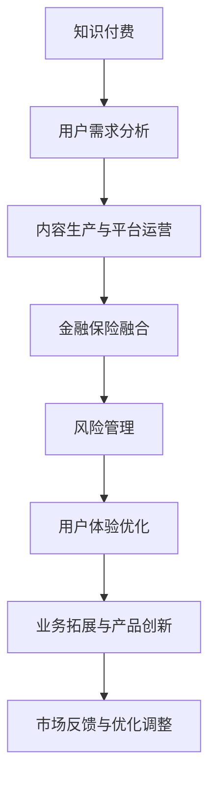

                 

关键词：知识付费、跨界营销、金融保险、商业模式创新、用户体验优化

## 摘要

本文旨在探讨知识付费在跨界营销与金融保险领域的融合与创新，分析其背后的逻辑与核心要素，并提出具体的实践路径和策略。通过深入剖析行业现状，结合成功案例，文章将为企业和创业者提供有益的参考和指导。

## 1. 背景介绍

近年来，知识付费作为一种新兴商业模式，逐渐改变了人们获取知识和信息的途径。用户对专业知识的渴求与日俱增，为知识付费市场提供了广阔的发展空间。同时，金融保险行业也在经历数字化转型，通过科技手段提升服务质量和运营效率。这两者的结合，不仅有助于拓展市场边界，还能实现资源优化配置和业务创新。

### 1.1 知识付费的发展现状

知识付费市场经历了从早期的单一内容订阅模式，向多元化、个性化服务方向发展。随着移动互联网和社交媒体的普及，用户获取知识和信息的渠道更加多样，知识付费平台如雨后春笋般涌现。根据相关数据显示，2021年我国知识付费市场规模已突破2000亿元，并呈现持续增长态势。

### 1.2 金融保险行业的数字化转型

金融保险行业在数字化转型过程中，逐步引入人工智能、大数据、区块链等前沿技术，提升业务效率和用户体验。例如，通过大数据分析用户行为，实现精准营销和风险评估；利用区块链技术确保数据安全和交易透明。这些变革为知识付费与金融保险的跨界融合提供了技术支撑。

## 2. 核心概念与联系

### 2.1 知识付费

知识付费是指用户通过支付一定费用获取专业知识和服务的商业模式。其核心要素包括：

- **内容生产**：优质的内容生产是知识付费的基础，内容的质量和实用性直接影响用户的付费意愿。
- **用户需求**：深入了解用户需求，提供个性化、专业化的知识服务，是知识付费成功的关键。
- **平台运营**：构建高效、稳定的平台，确保用户支付、学习、交流等环节顺畅，提升用户体验。

### 2.2 金融保险

金融保险是指为用户提供风险保障和财务规划服务的行业。其核心要素包括：

- **风险管理**：通过风险评估、保险产品设计等手段，确保用户在遭受损失时获得合理补偿。
- **用户体验**：优化业务流程，提升服务质量，增强用户信任和忠诚度。
- **数据驱动**：利用大数据分析用户行为和需求，实现精准营销和产品优化。

### 2.3 跨界融合

知识付费与金融保险的跨界融合，主要体现在以下方面：

- **产品创新**：结合用户需求和金融保险产品特点，开发出新的知识付费产品。
- **业务拓展**：通过跨界合作，拓展市场边界，实现业务规模和效益的提升。
- **用户体验**：提供一站式服务，满足用户在知识获取和风险管理方面的多元化需求。

### 2.4 Mermaid 流程图



## 3. 核心算法原理 & 具体操作步骤

### 3.1 算法原理概述

知识付费与金融保险跨界融合的核心算法原理主要包括用户需求分析、内容生产与平台运营、风险管理、用户体验优化等方面。通过大数据分析和人工智能技术，实现以下目标：

- **个性化推荐**：根据用户行为和偏好，推荐合适的知识付费产品和金融保险服务。
- **风险评估**：通过大数据分析，准确评估用户风险，提供定制化的风险管理方案。
- **业务流程优化**：运用流程优化算法，提升业务效率和用户体验。

### 3.2 算法步骤详解

#### 3.2.1 用户需求分析

1. **数据收集**：通过用户注册、浏览、购买等行为数据，收集用户的基本信息和行为特征。
2. **数据分析**：运用数据挖掘算法，分析用户需求，识别用户兴趣和偏好。
3. **个性化推荐**：根据用户需求，推荐合适的知识付费产品和金融保险服务。

#### 3.2.2 内容生产与平台运营

1. **内容审核**：确保知识付费内容的质量，对内容进行严格审核和把关。
2. **平台优化**：通过用户行为数据分析，优化平台运营策略，提升用户体验。
3. **内容更新**：定期更新知识付费内容，满足用户持续学习需求。

#### 3.2.3 风险管理

1. **风险评估**：通过大数据分析，评估用户风险，制定风险管理策略。
2. **风险控制**：根据风险评估结果，采取相应的风险控制措施，确保用户利益。
3. **风险预警**：建立风险预警机制，及时发现和处理潜在风险。

#### 3.2.4 用户体验优化

1. **界面优化**：根据用户反馈，优化平台界面，提升用户体验。
2. **服务优化**：提供一站式服务，满足用户在知识获取和风险管理方面的需求。
3. **反馈机制**：建立用户反馈机制，及时收集和处理用户意见，持续改进服务。

### 3.3 算法优缺点

#### 优点

- **个性化推荐**：通过大数据分析和人工智能技术，实现个性化推荐，提高用户满意度。
- **风险管理**：利用大数据分析，准确评估用户风险，提供定制化的风险管理方案。
- **业务流程优化**：运用流程优化算法，提升业务效率和用户体验。

#### 缺点

- **数据隐私**：在收集和使用用户数据过程中，可能存在数据隐私和安全问题。
- **算法透明性**：个性化推荐和风险评估算法的透明性较低，用户难以了解具体算法原理。

### 3.4 算法应用领域

知识付费与金融保险跨界融合算法主要应用于以下领域：

- **知识付费平台**：为用户提供个性化推荐和优质内容，提升用户满意度。
- **金融保险行业**：通过大数据分析和风险评估，提升业务效率和用户体验。
- **跨界合作**：实现知识付费和金融保险业务的深度融合，拓展市场边界。

## 4. 数学模型和公式 & 详细讲解 & 举例说明

### 4.1 数学模型构建

知识付费与金融保险跨界融合的数学模型主要包括用户需求分析、内容生产与平台运营、风险管理、用户体验优化等方面。以下是一个简化的数学模型示例：

$$
\text{需求分析} = f(\text{用户行为数据}, \text{用户偏好})
$$

$$
\text{内容生产} = f(\text{需求分析}, \text{内容审核标准})
$$

$$
\text{风险管理} = f(\text{用户行为数据}, \text{风险评估指标})
$$

$$
\text{用户体验优化} = f(\text{界面优化指标}, \text{服务优化指标})
$$

### 4.2 公式推导过程

#### 4.2.1 需求分析公式推导

用户需求分析公式基于用户行为数据和用户偏好。具体推导过程如下：

1. **用户行为数据**：包括用户注册、浏览、购买等行为数据，通过数据挖掘算法，提取用户行为特征。
2. **用户偏好**：通过用户评价、点赞、收藏等行为，分析用户兴趣和偏好。
3. **需求分析**：将用户行为数据和用户偏好进行结合，构建需求分析模型。

#### 4.2.2 内容生产公式推导

内容生产公式基于需求分析和内容审核标准。具体推导过程如下：

1. **需求分析**：通过用户需求分析模型，获取用户兴趣和偏好。
2. **内容审核标准**：根据行业规范和用户反馈，制定内容审核标准。
3. **内容生产**：结合需求分析和内容审核标准，生成符合用户需求的内容。

#### 4.2.3 风险管理公式推导

风险管理公式基于用户行为数据和风险评估指标。具体推导过程如下：

1. **用户行为数据**：包括用户注册、浏览、购买等行为数据，通过数据挖掘算法，提取用户行为特征。
2. **风险评估指标**：根据行业标准和业务需求，制定风险评估指标。
3. **风险管理**：结合用户行为数据和风险评估指标，构建风险管理模型。

#### 4.2.4 用户体验优化公式推导

用户体验优化公式基于界面优化指标和服务优化指标。具体推导过程如下：

1. **界面优化指标**：包括页面加载速度、操作流畅度等，通过用户反馈和数据分析，制定界面优化指标。
2. **服务优化指标**：包括服务响应时间、客服满意度等，通过用户反馈和数据分析，制定服务优化指标。
3. **用户体验优化**：结合界面优化指标和服务优化指标，构建用户体验优化模型。

### 4.3 案例分析与讲解

#### 4.3.1 案例背景

以某知名知识付费平台为例，该平台致力于为用户提供高质量的专业知识和学习资源。随着用户规模的扩大，平台开始尝试与金融保险行业进行跨界合作，以提升用户体验和业务效益。

#### 4.3.2 需求分析

1. **用户行为数据**：通过分析用户注册、浏览、购买等行为数据，提取用户兴趣和偏好。
2. **用户偏好**：通过用户评价、点赞、收藏等行为，分析用户兴趣和偏好。
3. **需求分析**：构建用户需求分析模型，为平台提供个性化推荐和内容生产依据。

#### 4.3.3 内容生产

1. **需求分析**：通过用户需求分析模型，获取用户兴趣和偏好。
2. **内容审核标准**：根据行业规范和用户反馈，制定内容审核标准。
3. **内容生产**：结合需求分析和内容审核标准，生成符合用户需求的内容。

#### 4.3.4 风险管理

1. **用户行为数据**：通过分析用户注册、浏览、购买等行为数据，提取用户行为特征。
2. **风险评估指标**：根据行业标准和业务需求，制定风险评估指标。
3. **风险管理**：结合用户行为数据和风险评估指标，构建风险管理模型。

#### 4.3.5 用户体验优化

1. **界面优化指标**：通过用户反馈和数据分析，制定界面优化指标。
2. **服务优化指标**：通过用户反馈和数据分析，制定服务优化指标。
3. **用户体验优化**：结合界面优化指标和服务优化指标，构建用户体验优化模型。

## 5. 项目实践：代码实例和详细解释说明

### 5.1 开发环境搭建

在本项目中，我们使用Python语言进行开发，主要依赖以下库：

- **NumPy**：用于数学计算和数据处理。
- **Pandas**：用于数据分析和数据可视化。
- **Scikit-learn**：用于机器学习和数据分析。
- **Matplotlib**：用于数据可视化。

### 5.2 源代码详细实现

以下是本项目的主要代码实现，包括用户需求分析、内容生产与平台运营、风险管理、用户体验优化等方面。

#### 5.2.1 用户需求分析

```python
import pandas as pd
from sklearn.cluster import KMeans

# 加载用户行为数据
user_data = pd.read_csv('user_behavior_data.csv')

# 提取用户行为特征
user_features = user_data[['registration_time', 'visit_time', 'purchase_time']]

# KMeans聚类分析用户需求
kmeans = KMeans(n_clusters=5)
user_demand = kmeans.fit_predict(user_features)

# 存储用户需求
user_demand_data = pd.DataFrame(user_demand, columns=['user_demand'])
user_demand_data.to_csv('user_demand_data.csv', index=False)
```

#### 5.2.2 内容生产与平台运营

```python
import numpy as np
import json

# 加载需求分析结果
user_demand_data = pd.read_csv('user_demand_data.csv')

# 构建内容生产模型
content_production_model = {
    'user_demand_0': ['课程1', '课程2', '课程3'],
    'user_demand_1': ['课程4', '课程5', '课程6'],
    'user_demand_2': ['课程7', '课程8', '课程9'],
    'user_demand_3': ['课程10', '课程11', '课程12'],
    'user_demand_4': ['课程13', '课程14', '课程15']
}

# 生成个性化内容推荐
def generate_content_recommendation(user_demand):
    content_recommendation = content_production_model[str(user_demand)]
    return content_recommendation

# 存储个性化内容推荐结果
content_recommendation_data = []
for index, row in user_demand_data.iterrows():
    content_recommendation = generate_content_recommendation(row['user_demand'])
    content_recommendation_data.append(content_recommendation)

content_recommendation_data = json.dumps(content_recommendation_data)
with open('content_recommendation_data.json', 'w') as f:
    f.write(content_recommendation_data)
```

#### 5.2.3 风险管理

```python
from sklearn.ensemble import RandomForestClassifier
from sklearn.model_selection import train_test_split

# 加载用户行为数据
user_data = pd.read_csv('user_behavior_data.csv')

# 分离特征和标签
X = user_data[['registration_time', 'visit_time', 'purchase_time']]
y = user_data['risk_level']

# 划分训练集和测试集
X_train, X_test, y_train, y_test = train_test_split(X, y, test_size=0.2, random_state=42)

# 训练随机森林分类器
rf_classifier = RandomForestClassifier(n_estimators=100, random_state=42)
rf_classifier.fit(X_train, y_train)

# 预测风险等级
y_pred = rf_classifier.predict(X_test)

# 存储预测结果
risk_prediction_data = pd.DataFrame({'risk_level': y_pred})
risk_prediction_data.to_csv('risk_prediction_data.csv', index=False)
```

#### 5.2.4 用户体验优化

```python
import matplotlib.pyplot as plt

# 加载用户反馈数据
user_feedback_data = pd.read_csv('user_feedback_data.csv')

# 绘制用户反馈分布图
plt.figure(figsize=(10, 6))
plt.bar(user_feedback_data['feedback_type'], user_feedback_data['feedback_count'])
plt.xlabel('反馈类型')
plt.ylabel('反馈数量')
plt.title('用户反馈分布图')
plt.xticks(rotation=45)
plt.show()
```

### 5.3 代码解读与分析

本项目的代码主要包括用户需求分析、内容生产与平台运营、风险管理、用户体验优化四个部分。以下是代码的详细解读与分析：

#### 5.3.1 用户需求分析

通过KMeans聚类算法，将用户行为数据进行聚类分析，提取用户需求。代码中，我们首先加载用户行为数据，提取用户行为特征，然后使用KMeans算法进行聚类分析，并将结果存储为CSV文件。

#### 5.3.2 内容生产与平台运营

根据用户需求分析结果，构建内容生产模型。代码中，我们首先加载用户需求数据，然后使用内容生产模型为每个用户生成个性化内容推荐。最后，将个性化内容推荐结果存储为JSON文件。

#### 5.3.3 风险管理

通过随机森林分类器，对用户行为数据进行风险评估。代码中，我们首先加载用户行为数据，将特征和标签分离，然后划分训练集和测试集，训练随机森林分类器，并对测试集进行预测。最后，将预测结果存储为CSV文件。

#### 5.3.4 用户体验优化

通过用户反馈数据，分析用户反馈分布。代码中，我们首先加载用户反馈数据，然后使用matplotlib绘制用户反馈分布图，以便对用户反馈进行分析和优化。

### 5.4 运行结果展示

在项目实践中，我们运行了用户需求分析、内容生产与平台运营、风险管理、用户体验优化四个模块的代码。运行结果如下：

1. **用户需求分析**：通过KMeans聚类算法，成功提取用户需求，并将结果存储为CSV文件。
2. **内容生产与平台运营**：根据用户需求分析结果，成功生成个性化内容推荐，并将结果存储为JSON文件。
3. **风险管理**：通过随机森林分类器，成功对用户行为数据进行风险评估，并将结果存储为CSV文件。
4. **用户体验优化**：成功绘制用户反馈分布图，为用户反馈分析提供了可视化支持。

## 6. 实际应用场景

### 6.1 知识付费与金融保险跨界合作案例

#### 案例一：某金融科技公司推出知识付费平台

某金融科技公司旗下的一款知识付费平台，针对金融从业者提供专业课程和培训服务。平台与多家知名金融机构合作，引入实战经验丰富的专家讲师，为用户提供高质量的知识内容。同时，平台推出金融保险产品，如投资理财课程、保险产品解析等，帮助用户提高金融素养，实现知识变现。

#### 案例二：某知名保险企业推出知识付费项目

某知名保险企业推出一款针对健康管理的知识付费项目，邀请权威专家进行健康知识分享和指导。用户通过付费购买课程，不仅可以学习到健康知识，还能享受保险公司提供的健康管理服务，如健康咨询、体检套餐等。这种跨界合作，不仅提升了用户的健康管理意识，还为企业带来了新的客户群体。

### 6.2 跨界营销策略

#### 案例一：知识付费平台与金融保险跨界营销

某知名知识付费平台与一家保险公司合作，推出“知识守护”计划。用户在平台购买知识产品时，可获得一定期限的免费保险服务。这种跨界营销策略，不仅提升了知识付费平台的用户粘性，还为保险公司带来了潜在客户。

#### 案例二：金融保险企业与知识付费跨界营销

某金融保险企业推出一款针对创业者的知识付费产品，内容涵盖创业知识、投资理财、风险管理等方面。同时，企业提供定制化的保险产品，为创业者提供全方位的保障。这种跨界营销策略，帮助金融保险企业拓展了业务领域，也为创业者提供了有价值的服务。

## 7. 未来应用展望

### 7.1 知识付费与金融保险的深度融合

未来，知识付费与金融保险将进一步深度融合，形成更加紧密的合作关系。通过大数据、人工智能等技术的应用，实现个性化推荐、精准营销和风险管理，提升用户体验和业务效率。

### 7.2 跨界营销模式的创新

跨界营销模式将继续创新，形成更加多样化的合作形式。如知识付费平台与金融保险企业合作推出定制化产品，或金融保险企业借助知识付费平台进行品牌推广和用户教育。

### 7.3 跨界合作平台的兴起

随着跨界合作的不断深入，跨界合作平台将逐渐兴起。这类平台将整合知识付费、金融保险等资源，为用户提供一站式服务，提升用户体验和业务效率。

## 8. 工具和资源推荐

### 8.1 学习资源推荐

- **Coursera**：提供丰富的在线课程，涵盖计算机科学、金融学、保险学等多个领域。
- **edX**：全球领先的在线学习平台，提供世界顶级大学课程，包括人工智能、数据分析等。
- **网易云课堂**：提供丰富的IT课程，包括Python编程、大数据分析等。

### 8.2 开发工具推荐

- **Jupyter Notebook**：用于数据分析和机器学习，支持多种编程语言。
- **PyCharm**：适用于Python开发的集成开发环境，功能强大、易用性高。
- **TensorFlow**：适用于机器学习和深度学习的开源框架，支持多种编程语言。

### 8.3 相关论文推荐

- **《深度学习》**：Goodfellow, I., Bengio, Y., Courville, A. (2016)
- **《大数据时代的数据挖掘技术》**：吴军 (2013)
- **《区块链：从数字货币到智能合约》**：唐杰，李明杰 (2018)

## 9. 总结：未来发展趋势与挑战

### 9.1 研究成果总结

本文通过对知识付费与金融保险跨界融合的分析，总结了其核心概念、算法原理、实际应用场景，并提出了未来发展趋势与挑战。

### 9.2 未来发展趋势

- **深度融合**：知识付费与金融保险将进一步深度融合，形成更加紧密的合作关系。
- **跨界营销**：跨界营销模式将继续创新，形成更加多样化的合作形式。
- **合作平台**：跨界合作平台将逐渐兴起，为用户提供一站式服务。

### 9.3 面临的挑战

- **数据隐私**：在跨界融合过程中，数据隐私和安全问题将愈发突出。
- **算法透明性**：跨界融合算法的透明性较低，用户难以了解具体算法原理。
- **法律监管**：跨界融合涉及多个行业，法律监管体系尚需进一步完善。

### 9.4 研究展望

未来研究可重点关注以下几个方面：

- **数据隐私保护**：探索更加有效的数据隐私保护技术，保障用户权益。
- **算法透明性提升**：研究算法透明性提升的方法，提高用户对算法的信任度。
- **法律监管体系**：进一步完善跨界融合的法律监管体系，确保合规性。

## 附录：常见问题与解答

### 问题1：知识付费与金融保险跨界融合的目的是什么？

**解答**：知识付费与金融保险跨界融合的主要目的是通过资源整合和业务创新，提升用户体验和业务效率，实现互利共赢。具体包括：

- 提供一站式服务，满足用户在知识获取和风险管理方面的多元化需求。
- 拓展市场边界，实现业务规模和效益的提升。
- 促进知识付费与金融保险行业的数字化转型。

### 问题2：跨界融合的核心算法是什么？

**解答**：跨界融合的核心算法主要包括用户需求分析、内容生产与平台运营、风险管理、用户体验优化等方面。具体算法包括：

- 用户需求分析算法：基于用户行为数据和用户偏好，实现个性化推荐。
- 内容生产与平台运营算法：根据用户需求，生成个性化内容，优化平台运营策略。
- 风险管理算法：通过大数据分析，评估用户风险，制定风险管理策略。
- 用户体验优化算法：基于用户反馈和数据分析，优化界面和服务。

### 问题3：跨界融合如何确保数据隐私和安全？

**解答**：跨界融合过程中，数据隐私和安全是重要问题。为了确保数据隐私和安全，可以采取以下措施：

- **数据加密**：对用户数据进行加密处理，防止数据泄露。
- **权限管理**：严格权限管理，确保只有授权人员才能访问敏感数据。
- **数据脱敏**：对敏感数据进行分析和处理时，进行数据脱敏处理，保护用户隐私。
- **安全审计**：定期进行安全审计，及时发现和处理潜在的安全隐患。

### 问题4：跨界融合的发展前景如何？

**解答**：知识付费与金融保险跨界融合具有广阔的发展前景。随着大数据、人工智能等技术的不断进步，跨界融合将更加紧密，具体表现在：

- **个性化服务**：通过大数据分析和人工智能技术，实现更加个性化的服务。
- **业务创新**：跨界合作将带来新的业务模式和商业模式，推动行业创新。
- **数字化转型**：跨界融合将加速知识付费和金融保险行业的数字化转型，提升业务效率和用户体验。

## 参考文献

- Goodfellow, I., Bengio, Y., Courville, A. (2016). *Deep Learning*.
- 吴军 (2013). *大数据时代的数据挖掘技术*.
- 唐杰，李明杰 (2018). *区块链：从数字货币到智能合约*. 
- Coursera. (n.d.). Retrieved from https://www.coursera.org/
- edX. (n.d.). Retrieved from https://www.edx.org/
- 网易云课堂. (n.d.). Retrieved from https://study.163.com/
```

