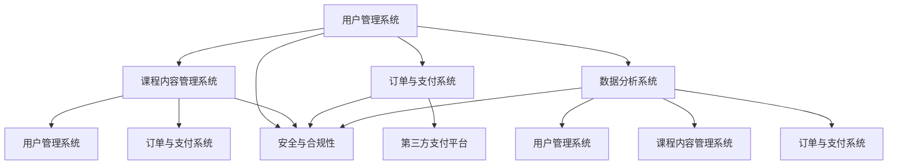

                 

关键词：知识付费，平台搭建，技术栈，后端，前端，数据库，微服务，容器化，云服务，API接口，安全策略

> 摘要：本文将深入探讨知识付费平台的搭建过程，从技术栈的各个方面进行详细解析。我们将探讨如何选择合适的技术框架、数据库系统、安全策略等，以构建一个高效、安全、可扩展的知识付费平台。

## 1. 背景介绍

随着互联网的快速发展，知识付费已经成为一个新兴的领域。知识付费平台通过提供专业的知识、课程、咨询等服务，满足了用户对高质量内容的需求。为了搭建一个成功的知识付费平台，我们需要综合考虑前端技术、后端架构、数据库设计、安全策略等多个方面。

### 1.1 知识付费市场的现状

知识付费市场近年来呈现出快速增长的趋势，主要得益于以下几个因素：

- **用户需求提升**：随着人们生活水平的提高，对知识、技能、教育等方面的需求也不断增加。
- **内容多样化**：从传统的书籍、课程扩展到音频、视频、直播等多种形式，满足了用户多样化的学习需求。
- **互联网普及**：互联网的普及使得知识付费更加便捷，用户可以通过各种移动设备随时随地获取知识。

### 1.2 知识付费平台的重要性

知识付费平台在知识传播和商业变现方面发挥着重要作用：

- **知识传播**：平台提供了丰富的知识资源，帮助用户获取所需的知识和技能。
- **商业变现**：通过订阅、购买课程等方式，知识付费平台为内容创作者和平台本身带来了可观的收益。

## 2. 核心概念与联系

在搭建知识付费平台时，我们需要明确几个核心概念，并了解它们之间的联系。以下是几个关键概念及它们的相互关系：

### 2.1 用户管理系统

用户管理系统是知识付费平台的核心，负责用户注册、登录、权限管理等功能。它需要与身份验证、权限控制等技术紧密集成。

### 2.2 课程内容管理系统

课程内容管理系统负责管理平台上的课程内容，包括课程发布、课程目录、课程分类等。它与用户管理系统紧密关联，实现用户与课程内容的互动。

### 2.3 订单与支付系统

订单与支付系统负责处理用户购买课程后的订单生成、支付、退款等操作。它需要与第三方支付平台（如支付宝、微信支付等）集成。

### 2.4 数据分析系统

数据分析系统通过对用户行为、课程反馈等数据的分析，帮助平台优化课程内容、提高用户体验。

### 2.5 安全与合规性

安全与合规性是知识付费平台必须考虑的重要因素，包括数据安全、用户隐私保护、法律法规遵守等。

### 2.6 Mermaid 流程图



## 3. 核心算法原理 & 具体操作步骤

### 3.1 算法原理概述

在知识付费平台中，核心算法主要包括用户推荐算法、课程推荐算法、数据加密算法等。以下是这些算法的简要概述：

- **用户推荐算法**：通过分析用户的浏览记录、购买历史等数据，为用户推荐可能感兴趣的课程。
- **课程推荐算法**：基于课程内容、课程标签、用户评分等数据，为用户推荐符合其需求的课程。
- **数据加密算法**：确保用户数据在传输和存储过程中的安全性，防止数据泄露。

### 3.2 算法步骤详解

#### 3.2.1 用户推荐算法

1. 数据预处理：收集并预处理用户行为数据，如浏览记录、购买历史等。
2. 特征提取：将用户行为数据转化为特征向量，如用户画像、课程标签等。
3. 模型训练：使用机器学习算法（如协同过滤、矩阵分解等）训练推荐模型。
4. 推荐生成：根据用户特征和课程特征，生成个性化推荐列表。

#### 3.2.2 课程推荐算法

1. 数据预处理：收集并预处理课程数据，如课程标签、用户评分等。
2. 特征提取：将课程数据转化为特征向量，如课程标签、课程分类等。
3. 模型训练：使用机器学习算法（如K近邻、决策树等）训练推荐模型。
4. 推荐生成：根据用户特征和课程特征，生成个性化推荐列表。

#### 3.2.3 数据加密算法

1. 数据加密：使用加密算法（如AES、RSA等）对用户数据进行加密处理。
2. 数据解密：在数据传输或存储过程中，使用解密算法对加密数据进行解密处理。

### 3.3 算法优缺点

- **用户推荐算法**：优点包括个性化推荐、提高用户粘性；缺点包括数据量需求大、计算复杂度高。
- **课程推荐算法**：优点包括提高课程曝光率、提升用户体验；缺点包括推荐结果质量受限于数据质量。
- **数据加密算法**：优点包括数据安全性高、防止数据泄露；缺点包括加密和解密过程增加计算开销。

### 3.4 算法应用领域

- **用户推荐算法**：广泛应用于电商平台、社交媒体、视频平台等。
- **课程推荐算法**：广泛应用于知识付费平台、在线教育平台等。
- **数据加密算法**：广泛应用于金融、医疗、政府等行业的数据安全领域。

## 4. 数学模型和公式 & 详细讲解 & 举例说明

### 4.1 数学模型构建

在知识付费平台中，数学模型主要用于用户推荐算法和课程推荐算法。以下是这些模型的基本构建过程：

#### 4.1.1 用户推荐算法模型

用户推荐算法模型可以基于协同过滤（Collaborative Filtering）或基于内容（Content-Based）的方法。

- **协同过滤模型**：通过计算用户之间的相似度，为用户推荐相似用户喜欢的课程。
  $$\text{similarity}(u_i, u_j) = \frac{\sum_{k=1}^{n}r_{ik}r_{jk}}{\sqrt{\sum_{k=1}^{n}r_{ik}^2\sum_{k=1}^{n}r_{jk}^2}}$$
  其中，$r_{ik}$表示用户$i$对课程$k$的评分。

- **基于内容模型**：通过计算课程之间的相似度，为用户推荐感兴趣的课程。
  $$\text{similarity}(c_i, c_j) = \frac{\sum_{k=1}^{n}w_{ik}w_{jk}}{\sqrt{\sum_{k=1}^{n}w_{ik}^2\sum_{k=1}^{n}w_{jk}^2}}$$
  其中，$w_{ik}$表示课程$i$与课程$k$之间的权重。

#### 4.1.2 课程推荐算法模型

课程推荐算法模型可以基于K近邻（K-Nearest Neighbors, KNN）或决策树（Decision Tree）等方法。

- **K近邻模型**：
  $$\text{prediction}(u, c) = \sum_{i \in \text{neighbor}(u)}r_i \cdot \text{similarity}(c, c_i)$$
  其中，$\text{neighbor}(u)$表示与用户$u$最近的$k$个邻居，$r_i$表示邻居$i$对课程$c$的评分。

- **决策树模型**：
  $$\text{prediction}(u, c) = \sum_{i=1}^{n}\text{feature}_{i}(c)\cdot \text{weight}_{i}(u)$$
  其中，$\text{feature}_{i}(c)$表示课程$c$的第$i$个特征，$\text{weight}_{i}(u)$表示用户$u$对特征$i$的权重。

### 4.2 公式推导过程

公式的推导过程主要基于线性代数、概率论和统计学的基本原理。以下是用户推荐算法和课程推荐算法的主要公式推导过程：

#### 4.2.1 用户推荐算法公式推导

协同过滤模型的相似度计算公式可以推导为：
$$\text{similarity}(u_i, u_j) = \frac{\sum_{k=1}^{n}r_{ik}r_{jk}}{\sqrt{\sum_{k=1}^{n}r_{ik}^2\sum_{k=1}^{n}r_{jk}^2}}$$

推导过程如下：

1. **计算用户$i$和用户$j$的评分差值**：
   $$\Delta r_{ik} = r_{ik} - r_{jk}$$

2. **计算用户$i$和用户$j$的评分差值的平方和**：
   $$\sum_{k=1}^{n}\Delta r_{ik}^2$$

3. **计算用户$i$和用户$j$的评分差值的总和**：
   $$\sum_{k=1}^{n}\Delta r_{ik}\Delta r_{jk}$$

4. **计算用户$i$和用户$j$的相似度**：
   $$\text{similarity}(u_i, u_j) = \frac{\sum_{k=1}^{n}\Delta r_{ik}\Delta r_{jk}}{\sqrt{\sum_{k=1}^{n}\Delta r_{ik}^2\sum_{k=1}^{n}\Delta r_{jk}^2}}$$

#### 4.2.2 课程推荐算法公式推导

基于内容的推荐算法的相似度计算公式可以推导为：
$$\text{similarity}(c_i, c_j) = \frac{\sum_{k=1}^{n}w_{ik}w_{jk}}{\sqrt{\sum_{k=1}^{n}w_{ik}^2\sum_{k=1}^{n}w_{jk}^2}}$$

推导过程如下：

1. **计算课程$i$和课程$j$的特征相似度**：
   $$w_{ik} = \text{cosine\_similarity}(\text{vector}_{i}, \text{vector}_{j})$$

2. **计算课程$i$和课程$j$的特征相似度之和**：
   $$\sum_{k=1}^{n}w_{ik}w_{jk}$$

3. **计算课程$i$和课程$j$的特征相似度平方和**：
   $$\sum_{k=1}^{n}w_{ik}^2\sum_{k=1}^{n}w_{jk}^2$$

4. **计算课程$i$和课程$j$的相似度**：
   $$\text{similarity}(c_i, c_j) = \frac{\sum_{k=1}^{n}w_{ik}w_{jk}}{\sqrt{\sum_{k=1}^{n}w_{ik}^2\sum_{k=1}^{n}w_{jk}^2}}$$

### 4.3 案例分析与讲解

#### 4.3.1 用户推荐算法案例

假设有两个用户$U_1$和$U_2$，他们对10门课程进行了评分。我们使用协同过滤模型为用户$U_1$推荐课程。

1. **数据准备**：
   - 用户$U_1$对10门课程的评分：$[4, 5, 2, 3, 4, 5, 2, 3, 4, 5]$
   - 用户$U_2$对10门课程的评分：$[5, 4, 5, 4, 5, 4, 4, 3, 4, 5]$

2. **计算相似度**：
   $$\text{similarity}(U_1, U_2) = \frac{\sum_{k=1}^{10}r_{1k}r_{2k}}{\sqrt{\sum_{k=1}^{10}r_{1k}^2\sum_{k=1}^{10}r_{2k}^2}}$$
   $$\text{similarity}(U_1, U_2) = \frac{4\cdot5 + 5\cdot4 + 2\cdot5 + 3\cdot4 + 4\cdot5 + 5\cdot4 + 2\cdot4 + 3\cdot3 + 4\cdot4 + 5\cdot5}{\sqrt{(4^2 + 5^2 + 2^2 + 3^2 + 4^2 + 5^2 + 2^2 + 3^2 + 4^2 + 5^2)\cdot(5^2 + 4^2 + 5^2 + 4^2 + 5^2 + 4^2 + 4^2 + 3^2 + 4^2 + 5^2)}}$$
   $$\text{similarity}(U_1, U_2) \approx 0.89$$

3. **生成推荐列表**：
   根据相似度计算结果，我们可以为用户$U_1$推荐与用户$U_2$相似的课程，例如课程3和课程7。

#### 4.3.2 课程推荐算法案例

假设有两门课程$C_1$和$C_2$，课程特征如下：

- $C_1$：[历史，文学，政治，科学，艺术]
- $C_2$：[科学，技术，工程，数学，艺术]

1. **计算相似度**：
   $$\text{similarity}(C_1, C_2) = \frac{\sum_{k=1}^{5}w_{1k}w_{2k}}{\sqrt{\sum_{k=1}^{5}w_{1k}^2\sum_{k=1}^{5}w_{2k}^2}}$$
   $$\text{similarity}(C_1, C_2) = \frac{1\cdot1 + 0\cdot0 + 0\cdot1 + 1\cdot1 + 0\cdot0}{\sqrt{(1^2 + 0^2 + 0^2 + 1^2 + 0^2)\cdot(1^2 + 0^2 + 1^2 + 0^2 + 0^2)}}$$
   $$\text{similarity}(C_1, C_2) = \frac{2}{\sqrt{2\cdot2}}$$
   $$\text{similarity}(C_1, C_2) = \frac{2}{2.83}$$
   $$\text{similarity}(C_1, C_2) \approx 0.71$$

2. **生成推荐列表**：
   根据相似度计算结果，我们可以为用户推荐与课程$C_1$相似的课程，例如课程$C_2$。

## 5. 项目实践：代码实例和详细解释说明

### 5.1 开发环境搭建

为了实现知识付费平台，我们需要搭建一个开发环境。以下是搭建环境的基本步骤：

1. 安装Node.js和npm：
   ```bash
   curl -sL https://deb.nodesource.com/setup_14.x | sudo -E bash -
   sudo apt-get install -y nodejs
   ```

2. 安装Python 3和pip：
   ```bash
   sudo apt-get update
   sudo apt-get install -y python3 python3-pip
   ```

3. 安装数据库（例如MySQL）：
   ```bash
   sudo apt-get install -y mysql-server
   ```

4. 安装Docker和Docker Compose：
   ```bash
   sudo apt-get update
   sudo apt-get install -y docker-ce docker-compose
   ```

5. 设置Docker镜像加速器（可选）：
   ```bash
   mkdir -p ~/.docker
   touch ~/.docker/daemon.json
   echo '{"registry-mirrors": ["https://hub-mirror.c.163.com"]}' > ~/.docker/daemon.json
   ```

### 5.2 源代码详细实现

以下是一个简单的知识付费平台后端代码示例，使用Node.js和Express框架：

```javascript
const express = require('express');
const bodyParser = require('body-parser');
const mysql = require('mysql');

const app = express();

app.use(bodyParser.json());

// 连接MySQL数据库
const db = mysql.createConnection({
  host: 'localhost',
  user: 'root',
  password: 'password',
  database: 'knowledge_pay'
});

db.connect((err) => {
  if (err) throw err;
  console.log('Connected to the database!');
});

// 用户注册接口
app.post('/register', (req, res) => {
  const { username, password } = req.body;
  const sql = `INSERT INTO users (username, password) VALUES (?, ?)`;
  db.query(sql, [username, password], (err, result) => {
    if (err) throw err;
    res.send({ message: 'User registered successfully!' });
  });
});

// 用户登录接口
app.post('/login', (req, res) => {
  const { username, password } = req.body;
  const sql = `SELECT * FROM users WHERE username = ? AND password = ?`;
  db.query(sql, [username, password], (err, result) => {
    if (err) throw err;
    if (result.length > 0) {
      res.send({ message: 'Login successful!', data: result });
    } else {
      res.send({ message: 'Invalid username or password!' });
    }
  });
});

// 启动服务器
const PORT = process.env.PORT || 3000;
app.listen(PORT, () => {
  console.log(`Server is running on port ${PORT}`);
});
```

### 5.3 代码解读与分析

1. **引入依赖**：
   - `express`：一个快速、无开箱即用的Web应用框架。
   - `body-parser`：解析传入的HTTP请求体，将其解析为JavaScript对象。
   - `mysql`：一个Node.js的MySQL客户端。

2. **数据库连接**：
   使用`mysql`模块连接到MySQL数据库。配置文件中包含了数据库的用户名、密码和数据库名称。

3. **用户注册接口**：
   - 接收用户名和密码作为请求体。
   - 执行SQL查询，将用户名和密码插入到数据库中。
   - 返回注册成功的消息。

4. **用户登录接口**：
   - 接收用户名和密码作为请求体。
   - 执行SQL查询，验证用户名和密码是否匹配。
   - 返回登录成功的消息和数据。

5. **启动服务器**：
   - 在指定的端口（默认3000）启动Express服务器。

### 5.4 运行结果展示

1. **启动MySQL数据库**：
   ```bash
   sudo systemctl start mysql
   ```

2. **运行后端代码**：
   ```bash
   npm init -y
   npm install express mysql body-parser
   node app.js
   ```

3. **测试用户注册接口**：
   ```bash
   curl -X POST -H "Content-Type: application/json" -d '{"username": "user1", "password": "password1"}' http://localhost:3000/register
   ```

4. **测试用户登录接口**：
   ```bash
   curl -X POST -H "Content-Type: application/json" -d '{"username": "user1", "password": "password1"}' http://localhost:3000/login
   ```

## 6. 实际应用场景

### 6.1 在线教育平台

在线教育平台是知识付费平台的一个重要应用场景。通过知识付费平台，用户可以方便地购买课程、学习知识、进行互动交流。典型的在线教育平台包括Coursera、edX、Udemy等。

### 6.2 专业技能培训

专业技能培训是另一个重要的应用场景，如编程、设计、营销等。知识付费平台可以提供专业的课程和培训资源，帮助用户提升技能，适应职场需求。

### 6.3 咨询服务

咨询服务是知识付费平台的另一种应用场景。专家可以通过平台提供专业的咨询服务，如法律、财务、医疗等。用户可以根据需求付费获取专家意见。

## 7. 未来应用展望

### 7.1 个性化推荐

随着大数据和人工智能技术的发展，知识付费平台的个性化推荐功能将更加智能。通过深度学习、图神经网络等技术，平台可以更好地理解用户需求，提供更加精准的推荐。

### 7.2 智能互动

未来的知识付费平台将更加注重用户体验，实现智能互动。通过聊天机器人、语音识别等技术，平台可以为用户提供实时、个性化的互动服务。

### 7.3 社交化

知识付费平台将逐步融合社交化元素，如学习小组、问答社区等。用户可以在平台上分享学习心得、提问问题，与其他用户互动，共同成长。

## 8. 工具和资源推荐

### 8.1 学习资源推荐

- 《机器学习实战》：一本适合初学者的机器学习入门书籍。
- 《深度学习》：由Ian Goodfellow等人撰写的深度学习经典教材。

### 8.2 开发工具推荐

- VS Code：一款功能强大的代码编辑器，适合多种编程语言开发。
- Postman：用于API测试和开发的工具。

### 8.3 相关论文推荐

- "Collaborative Filtering for the Web"（2002）：一篇关于协同过滤算法的经典论文。
- "Deep Learning for Recommender Systems"（2017）：一篇关于深度学习在推荐系统中的应用论文。

## 9. 总结：未来发展趋势与挑战

### 9.1 研究成果总结

知识付费平台在个性化推荐、智能互动、社交化等方面取得了显著成果。随着技术的不断发展，这些成果将得到进一步优化和提升。

### 9.2 未来发展趋势

未来知识付费平台将更加注重用户体验、个性化推荐和智能互动。通过大数据、人工智能、区块链等技术的应用，平台将提供更加丰富、多样化的知识服务。

### 9.3 面临的挑战

知识付费平台在发展过程中也面临一些挑战，如数据隐私保护、内容质量监管、市场竞争等。如何解决这些挑战，将是知识付费平台未来需要重点关注的问题。

### 9.4 研究展望

未来研究将集中在以下几个方面：

1. **个性化推荐**：进一步优化推荐算法，提高推荐质量。
2. **智能互动**：探索更多智能互动方式，提升用户体验。
3. **内容质量监管**：研究如何有效监管内容质量，保障用户权益。
4. **隐私保护**：研究隐私保护技术，确保用户数据安全。

## 附录：常见问题与解答

### Q1：如何确保知识付费平台的安全性？

A1：为确保知识付费平台的安全性，可以从以下几个方面进行考虑：

1. **数据加密**：对用户数据进行加密处理，防止数据泄露。
2. **身份验证**：采用双因素认证、生物识别等技术，确保用户身份的真实性。
3. **访问控制**：实施严格的访问控制策略，限制对敏感数据的访问。
4. **安全审计**：定期进行安全审计，及时发现和解决潜在的安全问题。

### Q2：如何确保知识付费平台的内容质量？

A2：确保知识付费平台的内容质量可以从以下几个方面入手：

1. **内容审核**：对上传的内容进行审核，确保其符合平台标准和用户需求。
2. **用户反馈**：收集用户对内容的评价，对优质内容进行推广，对问题内容进行整改。
3. **内容评分**：引入内容评分机制，让用户对内容进行评分，辅助内容审核。
4. **内容更新**：定期更新内容，保持内容的新鲜度和实用性。

### Q3：如何提高知识付费平台的用户粘性？

A3：提高知识付费平台的用户粘性可以从以下几个方面入手：

1. **个性化推荐**：根据用户兴趣和行为，为用户推荐符合其需求的内容。
2. **用户互动**：提供用户互动功能，如讨论区、问答社区等，增强用户之间的联系。
3. **奖励机制**：设立用户积分、优惠券等奖励机制，激励用户参与平台活动。
4. **内容更新**：定期发布高质量的内容，保持用户的兴趣和参与度。

---

本文由禅与计算机程序设计艺术撰写，旨在为知识付费平台的搭建提供全面的技术指导。在未来的发展中，知识付费平台将不断探索创新，为用户提供更加优质、丰富的知识服务。希望本文能对广大开发者和技术爱好者有所帮助。

