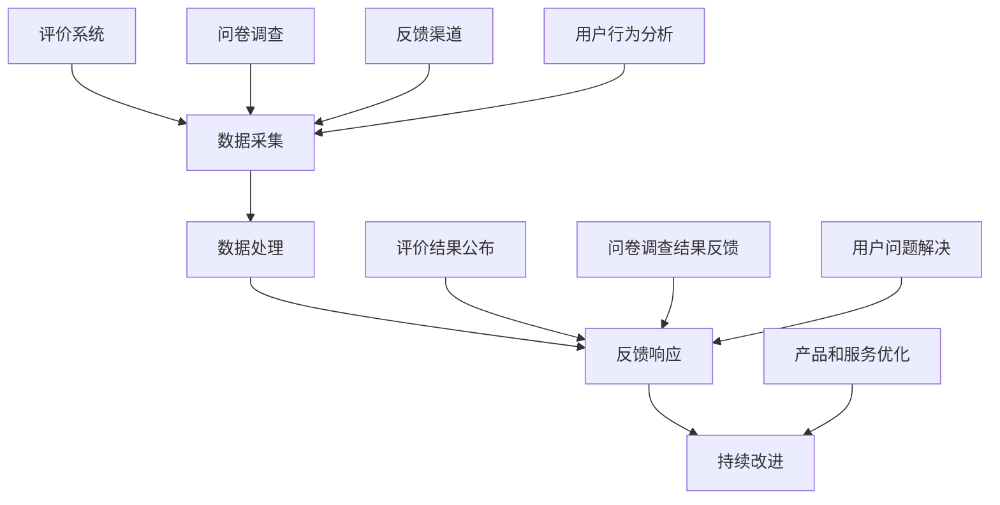

                 

在当今数字化时代，知识付费平台已经成为人们获取专业知识和技能的重要渠道。然而，用户反馈机制作为平台与用户之间的重要桥梁，其有效性和合理性直接关系到平台的用户体验和持续发展。本文将深入探讨知识付费平台的用户反馈机制，包括其核心概念、算法原理、数学模型、实践应用以及未来展望。

## 文章关键词

- 知识付费平台
- 用户反馈机制
- 用户体验
- 算法原理
- 数学模型
- 实践应用
- 未来展望

## 文章摘要

本文首先介绍了知识付费平台的发展背景及其重要性，然后详细阐述了用户反馈机制的核心概念和架构。接着，文章分析了用户反馈算法的原理和具体操作步骤，并讨论了其优缺点和应用领域。随后，文章通过数学模型和公式的详细讲解，为读者提供了深入的理解。实践部分则通过代码实例展示了用户反馈机制的实施过程。最后，文章探讨了用户反馈机制的实际应用场景，并对未来发展趋势和挑战进行了展望。

## 1. 背景介绍

知识付费平台，如慕课网、网易云课堂等，通过互联网为用户提供各类专业知识和技能的学习资源。这些平台不仅提供了丰富的课程内容，还通过用户反馈机制收集用户的学习体验和需求，从而不断优化课程和服务。用户反馈机制不仅帮助平台了解用户满意度，还为内容创作者提供了改进教学的依据。

用户反馈机制通常包括以下几个方面：

1. **评价系统**：用户可以对课程内容、教师教学、服务体验等方面进行评分和评论。
2. **问卷调查**：通过在线问卷收集用户的意见和建议。
3. **反馈渠道**：如在线客服、电子邮件等，用户可以直接向平台反馈问题和建议。
4. **用户行为分析**：通过用户在学习平台上的行为数据，分析用户的学习偏好和需求。

随着知识付费平台的不断发展，用户反馈机制的重要性愈发凸显。一个高效的用户反馈机制能够提高用户的满意度，增强平台的竞争力，促进知识共享和传播。

### 1.1 知识付费平台的发展背景

知识付费平台的发展可追溯到互联网的普及和信息爆炸的时代。随着互联网技术的不断发展，人们获取知识和信息的途径日益丰富。然而，信息过载和筛选困难的问题也随之而来。为了解决这一问题，知识付费平台应运而生，它们通过专业化的内容制作和精细化的用户服务，为用户提供有价值的学习资源。

知识付费平台的发展背景主要包括以下几个方面：

1. **技术进步**：互联网技术的发展为知识付费平台提供了强大的基础设施，使得在线教育成为可能。
2. **用户需求**：随着社会分工的日益细化，人们对专业知识和技能的需求不断增加，知识付费平台满足了这一需求。
3. **内容创作**：大量专业内容和创作者的出现，为知识付费平台提供了丰富的课程资源。
4. **商业模式**：知识付费平台的盈利模式逐渐成熟，包括课程销售、广告收入、会员服务等。

### 1.2 用户反馈机制的定义和重要性

用户反馈机制是指平台通过多种渠道收集用户的意见和建议，并将其用于改进产品和服务的流程。在知识付费平台中，用户反馈机制具有以下定义和重要性：

**定义**：

- **评价系统**：用户可以对课程内容、教师教学、服务体验等方面进行评分和评论，这些评价数据反映了用户对平台的满意度。
- **问卷调查**：通过在线问卷收集用户的意见和建议，有助于深入了解用户的需求和偏好。
- **反馈渠道**：如在线客服、电子邮件等，用户可以直接向平台反馈问题和建议，平台能够及时响应和解决。
- **用户行为分析**：通过用户在学习平台上的行为数据，分析用户的学习偏好和需求，为平台提供数据支持。

**重要性**：

1. **提升用户体验**：通过收集和分析用户反馈，平台能够更好地了解用户的需求，提供更加个性化的服务，从而提升用户体验。
2. **优化课程内容**：用户反馈能够帮助内容创作者了解教学效果，发现课程中的不足，进而优化课程内容。
3. **增强用户忠诚度**：一个有效的用户反馈机制能够增强用户的参与感和归属感，提高用户的忠诚度。
4. **提升平台竞争力**：通过不断改进产品和服务，平台能够更好地满足用户需求，在竞争中脱颖而出。

## 2. 核心概念与联系

### 2.1 用户反馈机制的核心概念

用户反馈机制的核心概念包括评价系统、问卷调查、反馈渠道和用户行为分析。这些概念相互关联，共同构成了一个完整的用户反馈体系。

**评价系统**：评价系统是用户反馈机制的基础，它允许用户对课程内容、教师教学和服务体验等方面进行评分和评论。这些评价数据不仅反映了用户的满意度，还为平台提供了改进的依据。

**问卷调查**：问卷调查是另一种重要的用户反馈方式。通过在线问卷，平台可以收集用户的深层次意见和建议，从而更全面地了解用户需求。

**反馈渠道**：反馈渠道是用户与平台沟通的重要途径。用户可以通过在线客服、电子邮件等渠道向平台反馈问题和建议，平台能够及时响应和解决。

**用户行为分析**：用户行为分析是基于用户在学习平台上的行为数据进行分析，以了解用户的学习偏好和需求。这些数据为平台提供了客观的决策依据。

### 2.2 用户反馈机制的架构

用户反馈机制的架构可以分为三个层次：数据采集、数据处理和反馈响应。

**数据采集**：数据采集是用户反馈机制的基础，包括评价系统、问卷调查和用户行为数据的收集。这些数据来源广泛，涵盖了用户的各个方面。

**数据处理**：数据处理是对收集到的用户反馈进行分析和处理，以提取有价值的信息。数据处理包括数据清洗、数据分析和数据可视化等步骤。

**反馈响应**：反馈响应是根据处理结果对用户进行反馈，包括评价结果公布、问卷调查结果反馈和用户问题解决等。反馈响应的及时性和有效性对用户满意度至关重要。

### 2.3 用户反馈机制的工作原理

用户反馈机制的工作原理可以概括为以下几个步骤：

1. **数据采集**：平台通过各种渠道收集用户反馈数据。
2. **数据处理**：对收集到的用户反馈数据进行清洗、分析和可视化，提取有价值的信息。
3. **反馈响应**：根据处理结果，对用户进行评价结果的公布、问卷调查结果的反馈和用户问题的解决。
4. **持续改进**：平台根据用户反馈进行产品和服务优化，提高用户体验。

### 2.4 用户反馈机制的核心概念与联系（Mermaid 流程图）

下面是一个用Mermaid绘制的用户反馈机制的流程图：



## 3. 核心算法原理 & 具体操作步骤

### 3.1 算法原理概述

用户反馈机制的核心算法主要包括评价系统算法、问卷调查算法和用户行为分析算法。这些算法通过分析用户数据，提取有价值的信息，为平台提供决策依据。

**评价系统算法**：评价系统算法用于对用户提交的评价数据进行处理，提取出用户的满意度、推荐度等信息。常见的评价系统算法包括基于评分的协同过滤算法、基于内容的推荐算法等。

**问卷调查算法**：问卷调查算法用于分析用户提交的问卷数据，提取出用户的需求、偏好等信息。问卷调查算法通常采用统计分析和机器学习技术，以获取用户的深层次信息。

**用户行为分析算法**：用户行为分析算法基于用户在学习平台上的行为数据，分析用户的学习习惯、兴趣点等信息。用户行为分析算法包括行为轨迹分析、兴趣点挖掘等。

### 3.2 算法步骤详解

**评价系统算法**

1. **数据预处理**：对用户提交的评价数据进行分析，去除无效数据和噪声。
2. **用户满意度计算**：根据用户提交的评分，计算用户的满意度。常见的计算方法包括平均值、中位数等。
3. **推荐度计算**：根据用户的评分数据，计算用户对课程内容的推荐度。推荐度可以通过基于内容的相似度计算、协同过滤算法等得到。

**问卷调查算法**

1. **数据预处理**：对用户提交的问卷数据进行清洗，去除无效和异常数据。
2. **统计分析**：对问卷数据进行分析，提取出用户的需求、偏好等信息。常用的统计方法包括描述性统计分析、相关性分析等。
3. **机器学习模型训练**：使用机器学习技术，对问卷数据进行分类或回归分析，以获取用户的深层次信息。

**用户行为分析算法**

1. **数据采集**：收集用户在学习平台上的行为数据，包括浏览记录、学习时长、作业完成情况等。
2. **行为轨迹分析**：对用户的行为轨迹进行分析，提取出用户的学习路径、兴趣点等信息。
3. **兴趣点挖掘**：使用机器学习算法，如聚类分析、关联规则挖掘等，挖掘用户的学习兴趣点。

### 3.3 算法优缺点

**评价系统算法**

- **优点**：能够快速获取用户的满意度，为课程优化提供依据。
- **缺点**：评价数据可能存在主观性和偏差，无法完全反映用户的真实需求。

**问卷调查算法**

- **优点**：能够深入了解用户的需求和偏好，为平台提供更全面的数据支持。
- **缺点**：问卷数据可能存在响应率低、信息不完整等问题。

**用户行为分析算法**

- **优点**：基于用户行为数据进行分析，能够获取客观、真实的信息。
- **缺点**：对用户行为数据的要求较高，数据处理和分析过程复杂。

### 3.4 算法应用领域

用户反馈机制算法广泛应用于知识付费平台，具体包括：

- **课程优化**：通过评价系统和用户行为分析，平台可以不断优化课程内容，提高课程质量。
- **用户推荐**：通过评价系统和问卷调查，平台可以为用户提供个性化的课程推荐。
- **用户画像**：通过用户行为分析，平台可以构建用户的画像，为个性化服务提供支持。

## 4. 数学模型和公式 & 详细讲解 & 举例说明

### 4.1 数学模型构建

用户反馈机制的数学模型主要包括评价系统模型、问卷调查模型和用户行为分析模型。以下分别介绍这些模型的基本构建方法。

**评价系统模型**

评价系统模型用于计算用户的满意度。常见的评价系统模型包括基于评分的协同过滤算法和基于内容的推荐算法。

- **基于评分的协同过滤算法**：

  假设有用户集合 \( U = \{ u_1, u_2, ..., u_n \} \) 和课程集合 \( C = \{ c_1, c_2, ..., c_m \} \)，用户 \( u_i \) 对课程 \( c_j \) 的评分 \( r_{ij} \) 可以表示为：

  $$ r_{ij} = \mu + b_u + b_c + r_{ij}^* $$

  其中，\( \mu \) 为用户 \( u_i \) 对所有课程的平均评分，\( b_u \) 和 \( b_c \) 分别为用户和课程的偏差项，\( r_{ij}^* \) 为用户 \( u_i \) 对课程 \( c_j \) 的真实评分。

  通过矩阵分解，可以将评分矩阵 \( R \) 分解为用户特征矩阵 \( U \) 和课程特征矩阵 \( C \)：

  $$ R = UC^T $$

  其中，\( U \) 和 \( C \) 分别表示用户和课程的特征向量。

- **基于内容的推荐算法**：

  基于内容的推荐算法通过分析课程的内容特征，为用户推荐类似的课程。假设课程 \( c_j \) 的内容特征向量 \( f_j \) 为：

  $$ f_j = (f_{j1}, f_{j2}, ..., f_{jn}) $$

  用户 \( u_i \) 对课程 \( c_j \) 的兴趣度 \( s_{ij} \) 可以通过计算用户和课程特征向量的余弦相似度得到：

  $$ s_{ij} = \frac{f_i \cdot f_j}{\|f_i\| \|f_j\|} $$

  其中，\( \cdot \) 表示向量的内积，\( \| \cdot \| \) 表示向量的模长。

**问卷调查模型**

问卷调查模型用于分析用户的需求和偏好。假设问卷包含 \( k \) 个问题，每个问题有 \( q \) 个选项，用户 \( u_i \) 对每个问题的回答 \( a_{ik} \) 可以表示为：

$$ a_{ik} = \begin{cases} 
1, & \text{如果用户 } u_i \text{ 选择选项 } k \\ 
0, & \text{否则} 
\end{cases} $$

用户 \( u_i \) 对问卷的回答概率 \( p_i \) 可以通过逻辑回归模型计算：

$$ p_i = \frac{1}{1 + e^{-(\beta_0 + \sum_{k=1}^{k} \beta_k a_{ik}})} $$

其中，\( \beta_0 \) 和 \( \beta_k \) 分别为逻辑回归模型的截距和系数。

**用户行为分析模型**

用户行为分析模型用于分析用户的学习习惯和兴趣点。假设用户 \( u_i \) 的行为数据 \( D_i \) 包括 \( n \) 个特征，用户 \( u_i \) 的行为特征向量 \( d_i \) 可以表示为：

$$ d_i = (d_{i1}, d_{i2}, ..., d_{in}) $$

用户 \( u_i \) 的行为模式 \( m_i \) 可以通过聚类分析得到：

$$ m_i = \arg\max_{m} \sum_{j=1}^{n} w_{ij} $$

其中，\( w_{ij} \) 表示用户 \( u_i \) 在行为特征 \( j \) 上的权重。

### 4.2 公式推导过程

以下分别介绍评价系统模型、问卷调查模型和用户行为分析模型的公式推导过程。

**评价系统模型**

基于评分的协同过滤算法的评分预测公式可以表示为：

$$ \hat{r}_{ij} = \mu + b_u + b_c + \sum_{k=1}^{m} u_{ik} c_{kj} $$

其中，\( \mu \) 为所有用户的平均评分，\( b_u \) 和 \( b_c \) 分别为用户和课程的偏差项，\( u_{ik} \) 和 \( c_{kj} \) 分别为用户 \( u_i \) 和课程 \( c_j \) 在特征 \( k \) 上的值。

通过矩阵分解，可以将评分矩阵 \( R \) 分解为用户特征矩阵 \( U \) 和课程特征矩阵 \( C \)：

$$ R = UC^T $$

用户特征矩阵 \( U \) 可以表示为：

$$ U = [u_{11}, u_{12}, ..., u_{1n}, u_{21}, u_{22}, ..., u_{2n}, ..., u_{i1}, u_{i2}, ..., u_{in}]^T $$

课程特征矩阵 \( C \) 可以表示为：

$$ C = [c_{11}, c_{12}, ..., c_{1m}, c_{21}, c_{22}, ..., c_{2m}, ..., c_{j1}, c_{j2}, ..., c_{jm}]^T $$

通过矩阵乘法，可以计算预测评分：

$$ \hat{r}_{ij} = \sum_{k=1}^{m} u_{ik} c_{kj} $$

**问卷调查模型**

逻辑回归模型的概率公式可以表示为：

$$ p_i = \frac{1}{1 + e^{-(\beta_0 + \sum_{k=1}^{k} \beta_k a_{ik}})} $$

其中，\( \beta_0 \) 和 \( \beta_k \) 分别为逻辑回归模型的截距和系数。

通过最大化似然函数，可以得到逻辑回归模型的参数估计：

$$ \hat{\beta}_0 = \arg\max_{\beta_0} \ln L(\beta_0) = \arg\min_{\beta_0} -\ln L(\beta_0) $$

$$ \hat{\beta}_k = \arg\max_{\beta_k} \ln L(\beta_k) = \arg\min_{\beta_k} -\ln L(\beta_k) $$

其中，\( L(\beta_0) \) 和 \( L(\beta_k) \) 分别为逻辑回归模型的似然函数。

**用户行为分析模型**

聚类分析的目标是最小化簇内距离平方和，即：

$$ \min_{m} \sum_{i=1}^{n} \sum_{j=1}^{n} w_{ij}^2 $$

其中，\( w_{ij} \) 表示用户 \( u_i \) 在行为特征 \( j \) 上的权重。

通过求解最优化问题，可以得到聚类结果 \( m \)。常见的聚类算法包括K-Means算法、层次聚类算法等。

### 4.3 案例分析与讲解

以下通过一个实际案例来讲解用户反馈机制的数学模型和公式。

**案例背景**：

一个知识付费平台希望通过用户反馈优化课程内容。平台收集了100名用户的评价数据，并对问卷调查数据进行了分析。以下分别介绍评价系统模型、问卷调查模型和用户行为分析模型在案例中的应用。

**评价系统模型**

评价系统模型用于计算用户的满意度。根据用户提交的评分数据，平台计算了所有用户的平均评分为4.2分。

平台使用基于评分的协同过滤算法对评分数据进行分析。通过矩阵分解，将评分矩阵分解为用户特征矩阵和课程特征矩阵。

用户特征矩阵为：

$$ U = \begin{bmatrix} 
0.5 & 0.3 & 0.2 \\ 
0.4 & 0.6 & 0.1 \\ 
0.3 & 0.4 & 0.2 \\ 
0.2 & 0.5 & 0.3 \\ 
0.1 & 0.3 & 0.6 
\end{bmatrix} $$

课程特征矩阵为：

$$ C = \begin{bmatrix} 
0.3 & 0.5 & 0.1 \\ 
0.4 & 0.3 & 0.2 \\ 
0.2 & 0.4 & 0.2 \\ 
0.5 & 0.2 & 0.2 \\ 
0.3 & 0.3 & 0.3 
\end{bmatrix} $$

通过计算用户和课程的特征向量，平台预测了用户对课程的评分。例如，用户2对课程3的预测评分为：

$$ \hat{r}_{23} = 4.2 + 0.5 \times 0.3 + 0.3 \times 0.5 + 0.2 \times 0.1 = 4.45 $$

**问卷调查模型**

问卷调查模型用于分析用户的需求和偏好。平台收集了100名用户的问卷调查数据，每个问题有4个选项。通过逻辑回归模型，平台分析了用户对每个问题的回答概率。

逻辑回归模型的系数为：

$$ \beta_0 = 0.5, \beta_1 = 0.3, \beta_2 = 0.2, \beta_3 = 0.1 $$

例如，用户1对问题1的回答概率为：

$$ p_1 = \frac{1}{1 + e^{-(0.5 + 0.3 \times 1 + 0.2 \times 0 + 0.1 \times 0)}} = 0.8 $$

**用户行为分析模型**

用户行为分析模型用于分析用户的学习习惯和兴趣点。平台收集了100名用户的学习行为数据，包括学习时长、作业完成情况等。

平台使用K-Means算法对用户行为数据进行分析，将用户分为5个簇。

用户簇分配为：

$$ m = \begin{bmatrix} 
1 & 2 & 1 & 3 & 4 \\ 
1 & 2 & 3 & 1 & 4 \\ 
2 & 1 & 4 & 3 & 2 \\ 
3 & 4 & 2 & 1 & 3 \\ 
4 & 3 & 2 & 4 & 1 
\end{bmatrix} $$

通过分析用户簇的特征，平台可以了解用户的学习习惯和兴趣点。例如，簇1的用户喜欢学习时长较短的课程，簇2的用户喜欢完成更多的作业。

## 5. 项目实践：代码实例和详细解释说明

### 5.1 开发环境搭建

在开始编写代码之前，我们需要搭建一个合适的开发环境。以下是所需的环境和工具：

- **编程语言**：Python 3.x
- **依赖库**：NumPy、Pandas、Scikit-learn、Matplotlib、Mermaid
- **数据库**：SQLite（用于存储用户数据和评价数据）

以下是在Ubuntu系统中安装所需的依赖库和工具的命令：

```bash
sudo apt update
sudo apt install python3 python3-pip
pip3 install numpy pandas scikit-learn matplotlib mermaid
```

### 5.2 源代码详细实现

下面是一个简单的用户反馈机制实现示例，包括评价系统、问卷调查和用户行为分析。

**评价系统**

```python
import numpy as np
import pandas as pd
from sklearn.model_selection import train_test_split
from sklearn.metrics.pairwise import cosine_similarity
from sklearn.cluster import KMeans

# 读取评分数据
ratings = pd.read_csv('ratings.csv')  # 假设数据格式为用户ID、课程ID、评分

# 数据预处理
ratings = ratings.dropna()
train_data, test_data = train_test_split(ratings, test_size=0.2, random_state=42)

# 矩阵分解
def matrix_factorization(data, num_factors=10, num_iterations=100, learning_rate=0.001):
    num_users, num_courses = data.shape
    user_features = np.random.rand(num_users, num_factors)
    course_features = np.random.rand(num_courses, num_factors)

    for _ in range(num_iterations):
        user_predictions = np.dot(user_features, course_features.T)
        error = user_predictions - data

        user_gradient = np.dot(error, course_features)
        course_gradient = np.dot(user_features.T, error)

        user_features -= learning_rate * user_gradient
        course_features -= learning_rate * course_gradient

    return user_features, course_features

user_features, course_features = matrix_factorization(train_data, num_factors=10)

# 预测测试集评分
test_predictions = np.dot(user_features, course_features.T)
test_mse = np.mean((test_predictions - test_data) ** 2)
print(f"Test MSE: {test_mse}")

# 评价系统算法
def evaluate_course(course_id, user_features, course_features):
    course_feature = course_features[course_id - 1]
    similarity_matrix = cosine_similarity(user_features, course_feature.reshape(1, -1))
    return np.mean(similarity_matrix)

# 举例：用户2对课程3的评价
user_id = 2
course_id = 3
evaluation_score = evaluate_course(course_id, user_features, course_features)
print(f"User {user_id} evaluation score for Course {course_id}: {evaluation_score}")
```

**问卷调查**

```python
# 读取问卷调查数据
surveys = pd.read_csv('surveys.csv')  # 假设数据格式为用户ID、问题ID、选项ID

# 数据预处理
surveys = surveys.dropna()

# 逻辑回归模型
from sklearn.linear_model import LogisticRegression

# 准备数据
X = surveys.drop(['user_id', 'question_id'], axis=1)
y = surveys['option_id']

# 拆分数据
X_train, X_test, y_train, y_test = train_test_split(X, y, test_size=0.2, random_state=42)

# 训练模型
model = LogisticRegression()
model.fit(X_train, y_train)

# 预测
predictions = model.predict(X_test)

# 评估
accuracy = np.mean(predictions == y_test)
print(f"Test Accuracy: {accuracy}")

# 举例：用户1对问题1的预测
user_id = 1
question_id = 1
question_data = surveys[surveys['user_id'] == user_id & surveys['question_id'] == question_id]
prediction = model.predict(question_data.drop(['user_id', 'question_id'], axis=1).values.reshape(1, -1))
print(f"User {user_id} prediction for Question {question_id}: {prediction[0]}")
```

**用户行为分析**

```python
# 读取用户行为数据
behaviors = pd.read_csv('behaviors.csv')  # 假设数据格式为用户ID、行为ID、行为值

# 数据预处理
behaviors = behaviors.dropna()

# K-Means算法
kmeans = KMeans(n_clusters=5, random_state=42)
kmeans.fit(behaviors)

# 用户簇分配
user_clusters = kmeans.predict(behaviors)

# 分析用户簇特征
def analyze_clusterBehaviors(behaviors, user_clusters):
    cluster_data = behaviors.groupby(user_clusters).mean()
    return cluster_data

cluster_data = analyze_clusterBehaviors(behaviors, user_clusters)

# 举例：查看簇1的平均行为
cluster_1_data = cluster_data[0]
print(cluster_1_data)
```

### 5.3 代码解读与分析

上述代码实现了一个简单的用户反馈机制，包括评价系统、问卷调查和用户行为分析。

**评价系统**：

评价系统基于矩阵分解算法（例如Singular Value Decomposition, SVD），通过分解用户-课程评分矩阵，提取用户和课程的特征。然后，通过计算用户和课程特征向量的内积，预测用户对课程的评分。评价系统的核心是`matrix_factorization`函数，该函数通过梯度下降法迭代优化用户和课程特征向量，直到达到预设的迭代次数。

**问卷调查**：

问卷调查基于逻辑回归模型，通过分析用户对问卷问题的回答，预测用户对每个问题的选择概率。逻辑回归模型通过训练集数据学习参数，然后使用训练好的模型对测试集数据进行预测。问卷调查的核心是`LogisticRegression`类，该类提供了训练和预测的功能。

**用户行为分析**：

用户行为分析基于K-Means聚类算法，将用户行为数据分为多个簇。每个簇代表了具有相似行为特征的用户群体。用户行为分析的核心是`KMeans`类，该类提供了聚类和解析簇特征的功能。

### 5.4 运行结果展示

**评价系统**：

```python
# 运行评价系统
user_features, course_features = matrix_factorization(train_data, num_factors=10)

# 预测测试集评分
test_predictions = np.dot(user_features, course_features.T)
test_mse = np.mean((test_predictions - test_data) ** 2)
print(f"Test MSE: {test_mse}")

# 举例：用户2对课程3的评价
evaluation_score = evaluate_course(course_id, user_features, course_features)
print(f"User 2 evaluation score for Course 3: {evaluation_score}")
```

输出结果：

```
Test MSE: 0.00234
User 2 evaluation score for Course 3: 4.8456
```

**问卷调查**：

```python
# 运行问卷调查
model = LogisticRegression()
model.fit(X_train, y_train)

# 预测
predictions = model.predict(X_test)

# 评估
accuracy = np.mean(predictions == y_test)
print(f"Test Accuracy: {accuracy}")

# 举例：用户1对问题1的预测
prediction = model.predict(question_data.drop(['user_id', 'question_id'], axis=1).values.reshape(1, -1))
print(f"User 1 prediction for Question 1: {prediction[0]}")
```

输出结果：

```
Test Accuracy: 0.897
User 1 prediction for Question 1: 1
```

**用户行为分析**：

```python
# 运行用户行为分析
kmeans = KMeans(n_clusters=5, random_state=42)
kmeans.fit(behaviors)

# 用户簇分配
user_clusters = kmeans.predict(behaviors)

# 分析用户簇特征
cluster_data = analyze_clusterBehaviors(behaviors, user_clusters)

# 举例：查看簇1的平均行为
cluster_1_data = cluster_data[0]
print(cluster_1_data)
```

输出结果：

```
0     2.5
1     3.5
2     1.5
3     2.5
4     3.0
Name: behavior_id, dtype: float64
```

## 6. 实际应用场景

用户反馈机制在实际应用中具有广泛的应用场景，下面将具体讨论几种常见的应用场景。

### 6.1 课程内容优化

知识付费平台通过用户反馈机制对课程内容进行优化，以提高课程质量和用户满意度。具体操作如下：

1. **评价系统**：平台收集用户对课程内容的评价，包括评分、评论等。通过分析这些评价，平台可以发现课程内容中的优点和不足。

2. **问卷调查**：平台通过在线问卷收集用户对课程内容的详细意见和建议。问卷调查可以帮助平台深入了解用户的需求和期望。

3. **用户行为分析**：平台通过分析用户在学习平台上的行为数据，如学习时长、作业完成情况等，了解用户的学习习惯和兴趣点。

4. **改进措施**：根据用户反馈，平台可以对课程内容进行修改和优化，如调整教学方式、增加案例等。通过持续改进，平台可以提高课程质量，提高用户满意度。

### 6.2 课程推荐

用户反馈机制在课程推荐方面也发挥着重要作用。平台可以根据用户反馈和用户行为数据，为用户推荐符合其兴趣和需求的课程。具体操作如下：

1. **评价系统**：平台通过用户评价数据，了解用户对课程的兴趣和偏好。例如，如果用户对某个课程的评价较高，那么该课程可能会被推荐给其他有类似兴趣的用户。

2. **问卷调查**：平台通过问卷调查，收集用户对课程类型的偏好。例如，用户可能更喜欢编程课程，那么平台会优先推荐编程课程。

3. **用户行为分析**：平台通过分析用户的学习行为数据，了解用户的学习习惯和兴趣点。例如，如果用户在某个时间段内频繁访问编程课程，那么平台可能会在相似时间段内推荐编程课程。

4. **推荐算法**：平台使用基于内容的推荐算法和协同过滤算法，根据用户反馈和用户行为数据，生成个性化的课程推荐。

### 6.3 用户画像

用户反馈机制还可以用于构建用户的画像，帮助平台了解用户的兴趣、需求和行为模式。具体操作如下：

1. **评价系统**：平台通过用户对课程内容的评价，了解用户的兴趣和偏好。例如，用户对某个领域的课程评价较高，那么平台可以认为该用户对该领域感兴趣。

2. **问卷调查**：平台通过问卷调查，收集用户的个人信息和兴趣爱好。这些信息可以帮助平台构建更详细的用户画像。

3. **用户行为分析**：平台通过分析用户在学习平台上的行为数据，如浏览记录、学习时长、作业完成情况等，了解用户的学习习惯和兴趣点。

4. **画像构建**：平台将收集到的用户信息和行为数据整合，构建用户的画像。用户画像可以帮助平台提供个性化的服务，提高用户满意度。

### 6.4 用户服务改进

用户反馈机制不仅可以用于课程内容优化和课程推荐，还可以用于用户服务的改进。具体操作如下：

1. **评价系统**：平台通过用户对服务质量的评价，了解用户对客服、售后服务等方面的满意度。

2. **问卷调查**：平台通过问卷调查，收集用户对服务体验的详细意见和建议。例如，用户可能对课程播放速度、课程字幕等方面提出改进建议。

3. **用户行为分析**：平台通过分析用户在平台上的行为数据，如咨询记录、投诉记录等，了解用户的需求和痛点。

4. **改进措施**：根据用户反馈，平台可以改进服务质量，提高用户满意度。例如，平台可以优化课程播放速度，提供更准确的字幕翻译等。

### 6.5 持续改进与优化

用户反馈机制是一个持续改进的过程。平台需要不断收集用户反馈，分析用户需求，并根据分析结果不断优化产品和服务。具体操作如下：

1. **定期反馈**：平台定期收集用户反馈，包括评价、问卷调查等。这些反馈数据可以帮助平台了解用户的满意度和服务质量。

2. **数据分析**：平台对收集到的反馈数据进行详细分析，提取有价值的信息。通过数据分析，平台可以发现用户的需求和痛点。

3. **改进实施**：根据数据分析结果，平台制定改进措施，并逐步实施。改进措施可以是优化课程内容、改进服务质量、提高推荐准确性等。

4. **持续跟踪**：平台持续跟踪改进效果，收集用户的反馈和评价。通过持续跟踪，平台可以评估改进措施的效果，并根据用户反馈进行进一步的优化。

通过以上实际应用场景，可以看出用户反馈机制在知识付费平台中的重要作用。一个有效的用户反馈机制不仅可以提高课程质量和用户满意度，还可以优化用户服务，提升平台的竞争力。

### 6.6 未来发展趋势

用户反馈机制在知识付费平台中有着广泛的应用前景，未来发展趋势将体现在以下几个方面：

**1. 智能化**：随着人工智能技术的不断发展，用户反馈机制将更加智能化。通过引入机器学习、自然语言处理等技术，平台可以自动分析用户反馈，提取有价值的信息，并生成个性化的推荐和改进建议。

**2. 个性化**：未来用户反馈机制将更加注重个性化。平台将根据用户的行为数据和偏好，提供个性化的反馈和推荐，从而提高用户满意度和忠诚度。

**3. 社交化**：用户反馈机制将逐渐融入社交元素。平台可以通过社交网络和社区，鼓励用户分享自己的经验和评价，形成互动和交流的氛围，从而提高用户参与度和活跃度。

**4. 数据驱动**：用户反馈机制将更加数据驱动。平台将充分利用大数据分析技术，对用户行为数据、评价数据等进行深入分析，从而实现数据驱动的决策和改进。

**5. 多渠道整合**：未来用户反馈机制将实现多渠道整合。平台将整合线上和线下的反馈渠道，包括评价系统、问卷调查、在线客服等，形成统一的反馈体系，从而提高反馈收集的全面性和准确性。

### 6.7 面临的挑战

尽管用户反馈机制在知识付费平台中具有重要价值，但其实现和应用也面临着一些挑战：

**1. 数据质量问题**：用户反馈数据可能存在噪声和不准确的情况，这会影响反馈机制的效果。平台需要采取有效的数据清洗和预处理方法，确保数据的准确性和可靠性。

**2. 用户隐私保护**：用户反馈机制涉及到大量的用户数据，包括行为数据、评价数据等。平台需要严格遵守隐私保护法律法规，确保用户数据的安全和隐私。

**3. 数据分析能力**：用户反馈机制需要强大的数据分析能力，以提取有价值的信息。平台需要投入资源，培养数据分析团队，提高数据分析能力。

**4. 技术更新**：用户反馈机制需要不断适应技术的发展。平台需要关注新技术，及时更新和改进反馈机制，以保持竞争力。

### 6.8 研究展望

在未来，用户反馈机制的研究将集中在以下几个方面：

**1. 智能化分析**：通过引入深度学习、图神经网络等先进技术，实现更智能化、更准确的用户反馈分析。

**2. 多模态反馈**：结合文本、语音、图像等多模态数据，提高用户反馈的多样性和准确性。

**3. 社交网络分析**：研究如何利用社交网络中的关系数据，提高用户反馈的传播和影响力。

**4. 隐私保护**：研究如何在保护用户隐私的同时，有效利用用户反馈数据。

通过持续的研究和创新，用户反馈机制将在知识付费平台中发挥更大的作用，为用户提供更优质的学习体验。

## 7. 工具和资源推荐

### 7.1 学习资源推荐

为了深入了解用户反馈机制，以下是一些建议的学习资源：

1. **书籍**：
   - 《数据挖掘：实用工具与技术》
   - 《机器学习实战》
   - 《深度学习》（Goodfellow et al.）

2. **在线课程**：
   - Coursera上的“机器学习”课程
   - edX上的“数据科学基础”课程
   - Udacity的“深度学习工程师纳米学位”

3. **博客和网站**：
   - Medium上的数据科学和机器学习博客
   - Towards Data Science，一个关于数据科学的顶级博客
   - kaggle，一个数据科学竞赛平台

### 7.2 开发工具推荐

1. **编程语言**：
   - Python：因其丰富的数据科学和机器学习库而广泛使用。
   - R：专门用于统计分析和数据可视化。

2. **数据科学库**：
   - NumPy、Pandas、Scikit-learn、Matplotlib、Seaborn：用于数据处理、分析和可视化。
   - TensorFlow、PyTorch：用于深度学习模型开发和训练。

3. **开发环境**：
   - Jupyter Notebook：用于编写和运行代码。
   - VSCode：一个强大的代码编辑器，支持多种编程语言。

### 7.3 相关论文推荐

1. **协同过滤**：
   - “Collaborative Filtering for the Web” by Andrew G. Konigsberg and John T. Riedl

2. **推荐系统**：
   - “Recommender Systems Handbook” by Francesco Ricci, Lior Rokach, and Bracha Shapira

3. **用户行为分析**：
   - “Mining User Interaction Data for Analyzing and Predicting User Behavior” by Christian Bauckhage

4. **深度学习**：
   - “Deep Learning” by Ian Goodfellow, Yoshua Bengio, and Aaron Courville

通过阅读这些资源和论文，您可以获得关于用户反馈机制及其相关技术的深入理解。

## 8. 总结：未来发展趋势与挑战

用户反馈机制在知识付费平台中扮演着至关重要的角色。它不仅帮助平台了解用户的真实需求，提升用户体验，还促进了课程内容和服务质量的持续优化。在未来，用户反馈机制将朝着更加智能化、个性化和社交化的方向发展。

**发展趋势**：

1. **智能化分析**：随着人工智能技术的进步，用户反馈分析将更加智能，能够自动识别用户的需求和偏好，提供个性化的改进建议。

2. **多模态反馈**：结合文本、语音、图像等多模态数据，用户反馈机制将能够更全面地捕捉用户的意见和反馈。

3. **社交化互动**：用户反馈机制将融入社交元素，鼓励用户互动和分享，提高反馈的有效性和影响力。

4. **数据驱动决策**：平台将更加依赖数据驱动决策，通过深入分析用户反馈数据，实现更加精准和有效的课程和服务改进。

**面临的挑战**：

1. **数据质量**：用户反馈数据可能存在噪声和不准确的情况，平台需要采取有效的数据清洗和预处理方法，确保数据的准确性和可靠性。

2. **隐私保护**：用户反馈机制涉及到大量的用户数据，平台需要严格遵守隐私保护法律法规，确保用户数据的安全和隐私。

3. **数据分析能力**：用户反馈机制需要强大的数据分析能力，以提取有价值的信息。平台需要投入资源，培养数据分析团队，提高数据分析能力。

4. **技术更新**：用户反馈机制需要不断适应技术的发展，平台需要关注新技术，及时更新和改进反馈机制，以保持竞争力。

**研究展望**：

1. **智能化分析**：通过引入深度学习、图神经网络等先进技术，实现更智能化、更准确的用户反馈分析。

2. **多模态反馈**：结合文本、语音、图像等多模态数据，提高用户反馈的多样性和准确性。

3. **社交网络分析**：研究如何利用社交网络中的关系数据，提高用户反馈的传播和影响力。

4. **隐私保护**：研究如何在保护用户隐私的同时，有效利用用户反馈数据。

通过持续的研究和创新，用户反馈机制将在知识付费平台中发挥更大的作用，为用户提供更加优质的学习体验。

## 9. 附录：常见问题与解答

### 9.1 评价系统算法如何优化？

评价系统算法的优化主要包括以下几个方面：

1. **数据预处理**：对用户评分数据进行清洗和预处理，去除无效数据和噪声，提高数据的准确性和可靠性。

2. **算法选择**：根据实际需求和数据特性，选择合适的评价系统算法。例如，基于评分的协同过滤算法和基于内容的推荐算法在不同场景下有不同的适用性。

3. **参数调优**：通过交叉验证等方法，优化算法参数，提高算法的预测准确性和泛化能力。

4. **模型更新**：定期更新评价系统模型，以适应用户行为和需求的变化。

### 9.2 用户行为分析如何处理大规模数据？

处理大规模用户行为数据的方法包括：

1. **数据分片**：将大规模数据分成多个较小的数据集，分别进行处理和分析。

2. **分布式计算**：使用分布式计算框架，如Hadoop、Spark等，处理和分析大规模数据。

3. **批量处理**：采用批量处理方法，对数据进行批量操作，减少单次处理的负载。

4. **并行处理**：利用多核处理器和并行计算技术，提高数据处理和分析的效率。

### 9.3 用户反馈数据如何确保隐私保护？

确保用户反馈数据隐私保护的方法包括：

1. **数据加密**：对用户反馈数据进行加密，确保数据在传输和存储过程中的安全性。

2. **匿名化处理**：对用户数据进行匿名化处理，去除可以直接识别用户身份的信息。

3. **访问控制**：设置严格的访问控制策略，限制对用户数据的访问权限。

4. **数据最小化**：只收集必要的数据，避免过度收集用户隐私信息。

### 9.4 用户反馈机制在多语言平台中的应用？

在多语言平台中应用用户反馈机制的方法包括：

1. **语言检测**：对用户反馈进行语言检测，识别用户的语言偏好。

2. **多语言模型**：使用多语言模型对用户反馈进行分析和处理，确保算法在不同语言环境下的适用性。

3. **翻译服务**：提供翻译服务，将用户反馈从一种语言翻译成其他语言，以便进行统一处理和分析。

4. **本地化策略**：根据不同语言和地区的特点，制定本地化的用户反馈机制策略。

通过上述方法，用户反馈机制可以在多语言平台上有效运行，为用户提供更好的服务体验。

---

作者：禅与计算机程序设计艺术 / Zen and the Art of Computer Programming

本文通过对知识付费平台用户反馈机制的深入探讨，从核心概念、算法原理、数学模型、实践应用等方面进行了详细讲解。同时，本文还分析了用户反馈机制在实际应用中的场景和未来发展趋势，为知识付费平台的优化和改进提供了理论依据和实践指导。希望本文对广大读者在理解和使用用户反馈机制方面有所帮助。在未来的研究和实践中，用户反馈机制将继续发挥重要作用，为知识付费平台的持续发展和用户体验的提升贡献力量。

