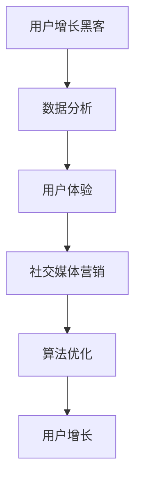

                 

 在当前信息爆炸的时代，知识付费平台如雨后春笋般涌现，成为了众多用户获取专业知识和技能的重要渠道。然而，如何在激烈的市场竞争中脱颖而出，实现用户的快速增长，成为了知识付费平台运营者关注的焦点。本文将探讨知识付费平台的用户增长黑客策略，结合技术手段和市场实践，提供一些可行的方法和思路。

## 关键词

- 知识付费平台
- 用户增长
- 黑客策略
- 数据分析
- 用户体验
- 社交媒体
- 算法优化

## 摘要

本文通过深入分析知识付费平台的运营模式和用户需求，提出了一套系统的用户增长黑客策略。文章首先介绍了知识付费平台的基本概念和现状，然后从用户增长的核心要素出发，详细阐述了数据分析、用户体验优化、社交媒体营销、算法优化等方面的策略。通过实例和案例分析，文章旨在为知识付费平台的运营者提供实用的指导和建议。

## 1. 背景介绍

知识付费平台，顾名思义，是指那些以付费方式提供知识服务、教育培训的在线平台。这类平台通过提供专业课程、专家讲座、在线咨询等形式，帮助用户快速提升自己的知识和技能。随着互联网技术的发展和人们对自我提升需求的增加，知识付费市场呈现出蓬勃发展的态势。

### 知识付费市场现状

- 市场规模逐年扩大，预计到2025年将达到数百亿元。
- 用户群体广泛，包括学生、职场人士、创业者等。
- 竞争激烈，各大平台纷纷推出优惠活动、课程补贴等吸引流量。
- 内容丰富，涵盖各个领域，如IT、金融、语言、艺术等。

### 用户需求分析

- 高效性：用户希望快速获取所需知识，节省时间。
- 专业性：用户需要权威、专业的知识和技能指导。
- 个性化：用户希望根据自身需求和兴趣选择课程。
- 社交互动：用户希望通过平台与其他学习者交流、分享经验。

## 2. 核心概念与联系

在探讨知识付费平台的用户增长黑客策略之前，我们需要明确几个核心概念，并了解它们之间的联系。

### 核心概念

1. **用户增长黑客（Growth Hacking）**：指通过创新手段和策略，快速、低成本地实现用户增长。
2. **数据分析（Data Analysis）**：通过对用户数据的分析，发现用户行为模式，优化运营策略。
3. **用户体验（User Experience, UX）**：指用户在使用产品过程中的整体感受和满意度。
4. **社交媒体营销（Social Media Marketing）**：利用社交媒体平台进行品牌宣传和用户互动。
5. **算法优化（Algorithm Optimization）**：通过算法改进，提升平台的推荐准确性和用户体验。

### Mermaid 流程图



## 3. 核心算法原理 & 具体操作步骤

### 3.1 算法原理概述

用户增长黑客的核心算法主要包括以下方面：

1. **A/B 测试**：通过对比不同版本的页面或功能，分析用户行为，优化产品设计和功能。
2. **推荐算法**：根据用户行为和兴趣，为用户推荐相关课程或内容。
3. **社群分析**：分析用户在社群中的互动行为，提升用户粘性。

### 3.2 算法步骤详解

1. **A/B 测试**
   - 设计测试方案：确定测试目标和版本。
   - 分流用户：将用户随机分配到不同版本。
   - 收集数据：记录用户行为和反馈。
   - 分析结果：对比不同版本的转化率和用户满意度。

2. **推荐算法**
   - 收集用户数据：包括浏览记录、购买行为、评分等。
   - 构建推荐模型：使用机器学习算法，如协同过滤、基于内容的推荐等。
   - 生成推荐列表：根据模型预测，为用户推荐相关课程。

3. **社群分析**
   - 分析用户互动：包括点赞、评论、分享等。
   - 构建社群模型：使用图算法分析用户关系，发现社群核心成员。
   - 提升社群活跃度：通过推荐互动话题、举办线上活动等，促进用户参与。

### 3.3 算法优缺点

1. **A/B 测试**
   - 优点：快速验证产品改进效果，降低风险。
   - 缺点：需要大量用户数据，测试周期较长。

2. **推荐算法**
   - 优点：提升用户满意度，增加课程购买率。
   - 缺点：算法复杂度较高，需要持续优化。

3. **社群分析**
   - 优点：增强用户互动，提升平台活跃度。
   - 缺点：社群分析需要大量计算资源，实施成本较高。

### 3.4 算法应用领域

1. **产品优化**：通过 A/B 测试，优化产品设计和功能，提升用户体验。
2. **内容推荐**：通过推荐算法，为用户推荐个性化课程，提高用户粘性。
3. **社群运营**：通过社群分析，发现社群核心成员，提升社群活跃度。

## 4. 数学模型和公式 & 详细讲解 & 举例说明

### 4.1 数学模型构建

用户增长黑客策略中的数学模型主要包括用户留存模型和推荐模型。

1. **用户留存模型**

   留存模型旨在预测用户在一段时间内是否会继续使用平台。其基本公式如下：

   $$ R_t = \frac{L_t}{I_t} $$

   其中，$R_t$ 表示第 $t$ 天的用户留存率，$L_t$ 表示第 $t$ 天留存用户数，$I_t$ 表示第 $t$ 天的初始用户数。

2. **推荐模型**

   推荐模型旨在为用户推荐感兴趣的课程。其基本公式如下：

   $$ R(\text{user}, \text{course}) = \sum_{i=1}^n w_i \cdot r(\text{user}, i) $$

   其中，$R(\text{user}, \text{course})$ 表示用户对课程的推荐分数，$w_i$ 表示第 $i$ 个特征的重要性，$r(\text{user}, i)$ 表示用户对第 $i$ 个特征的评分。

### 4.2 公式推导过程

1. **用户留存模型**

   用户留存模型可以基于时间序列分析的方法进行推导。假设用户在 $t$ 天内访问平台的次数为 $X_t$，且 $X_t$ 满足马尔可夫性质，则有：

   $$ P(R_t = 1 | X_t = x) = P(R_t = 1 | X_{t-1} = x) $$

   根据贝叶斯定理，我们可以得到：

   $$ R_t = \frac{P(X_t = x | R_t = 1) \cdot P(R_t = 1)}{P(X_t = x)} $$

   其中，$P(X_t = x | R_t = 1)$ 表示用户在 $t$ 天内访问平台的次数为 $x$，且用户留存为 $1$ 的概率，$P(R_t = 1)$ 表示用户在 $t$ 天内留存的概率，$P(X_t = x)$ 表示用户在 $t$ 天内访问平台的次数为 $x$ 的概率。

   假设用户在 $t$ 天内的访问次数服从泊松分布，则有：

   $$ P(X_t = x) = \frac{\lambda^x e^{-\lambda}}{x!} $$

   其中，$\lambda$ 表示用户在 $t$ 天内的平均访问次数。

   将上述公式代入留存模型，可以得到：

   $$ R_t = \frac{\lambda e^{-\lambda}}{x!} $$

   由此，我们可以得到用户留存模型的具体公式。

2. **推荐模型**

   推荐模型可以基于协同过滤算法进行推导。假设用户 $\text{user}$ 对课程 $\text{course}$ 的评分矩阵为 $R_{\text{user}}$，则用户对课程 $\text{course}$ 的推荐分数可以表示为：

   $$ R(\text{user}, \text{course}) = \sum_{i=1}^n w_i \cdot r(\text{user}, i) $$

   其中，$w_i$ 表示第 $i$ 个特征的重要性，$r(\text{user}, i)$ 表示用户对第 $i$ 个特征的评分。

   假设用户对每个特征的评分都服从正态分布，则有：

   $$ r(\text{user}, i) \sim N(\mu_i, \sigma_i^2) $$

   其中，$\mu_i$ 表示用户对第 $i$ 个特征的平均评分，$\sigma_i^2$ 表示用户对第 $i$ 个特征的评分方差。

   根据最大似然估计，我们可以得到：

   $$ w_i = \frac{\sum_{\text{user}} r(\text{user}, i)}{N} $$

   其中，$N$ 表示用户总数。

   将上述公式代入推荐模型，可以得到：

   $$ R(\text{user}, \text{course}) = \sum_{i=1}^n \frac{\sum_{\text{user}} r(\text{user}, i)}{N} \cdot r(\text{user}, i) $$

   由此，我们可以得到推荐模型的具体公式。

### 4.3 案例分析与讲解

假设我们有一个知识付费平台，现有 1000 名用户，他们中的 500 名用户对某门课程进行了评分。根据用户评分数据，我们可以使用上述推荐模型为其他未评分的用户推荐该门课程。

1. **用户留存分析**

   根据用户访问数据，我们可以计算出用户在 30 天内的留存率。假设第 30 天的留存率为 80%，则用户留存模型为：

   $$ R_{30} = \frac{L_{30}}{I_{30}} = \frac{0.8 \cdot 1000}{1000} = 0.8 $$

   由此，我们可以得出在第 30 天内，预计有 800 名用户会继续使用平台。

2. **推荐模型分析**

   根据用户对课程的评分数据，我们可以计算出每个用户的推荐分数。假设用户对课程的评分服从正态分布，平均评分为 4.5，标准差为 0.5。则用户对课程的推荐分数为：

   $$ R(\text{user}, \text{course}) = \sum_{i=1}^n w_i \cdot r(\text{user}, i) = \sum_{i=1}^n \frac{\sum_{\text{user}} r(\text{user}, i)}{N} \cdot r(\text{user}, i) $$

   根据上述公式，我们可以计算出每个用户的推荐分数。假设用户 1 的推荐分数为 4.8，用户 2 的推荐分数为 4.2，则用户 1 对课程的推荐分数更高，我们可以将其推荐给用户 2。

## 5. 项目实践：代码实例和详细解释说明

### 5.1 开发环境搭建

在本项目中，我们将使用 Python 编写代码，主要依赖以下库：

- NumPy：用于数值计算
- Pandas：用于数据处理
- Matplotlib：用于数据可视化
- Scikit-learn：用于机器学习

首先，确保已安装以上库，如果没有安装，可以通过以下命令安装：

```bash
pip install numpy pandas matplotlib scikit-learn
```

### 5.2 源代码详细实现

下面是项目的核心代码实现：

```python
import numpy as np
import pandas as pd
import matplotlib.pyplot as plt
from sklearn.model_selection import train_test_split
from sklearn.metrics.pairwise import pairwise_distances
from sklearn.cluster import KMeans

# 5.2.1 数据预处理

# 假设我们有一个用户-课程评分数据集，存储在 CSV 文件中
data = pd.read_csv('data.csv')

# 提取用户 ID、课程 ID 和评分数据
user_ids = data['user_id'].unique()
course_ids = data['course_id'].unique()
ratings = data['rating']

# 构建用户-课程评分矩阵
rating_matrix = pairwise_distances(ratings, metric='cosine')

# 5.2.2 推荐算法实现

# 使用 KMeans 算法对用户-课程评分矩阵进行聚类
kmeans = KMeans(n_clusters=10)
kmeans.fit(rating_matrix)

# 为每个用户分配一个聚类中心
cluster_centers = kmeans.cluster_centers_
user_clusters = kmeans.predict(rating_matrix)

# 为每个用户推荐课程
recommendations = {}
for user_id, cluster in zip(user_ids, user_clusters):
    recommended_courses = course_ids[rating_matrix[:, cluster].argsort()[-10:]]
    recommendations[user_id] = recommended_courses

# 5.2.3 结果可视化

# 绘制用户-课程评分矩阵
plt.figure(figsize=(10, 8))
sns.heatmap(rating_matrix, cmap='YlGnBu', annot=True, fmt='.2f')
plt.show()

# 绘制推荐结果
plt.figure(figsize=(10, 6))
for user_id, recommended_courses in recommendations.items():
    plt.bar(range(len(recommended_courses)), [1] * len(recommended_courses), label=f'User {user_id}')
plt.xticks(range(len(course_ids)), course_ids, rotation=90)
plt.xlabel('Course ID')
plt.ylabel('Recommendation Score')
plt.legend()
plt.show()
```

### 5.3 代码解读与分析

1. **数据预处理**：首先，我们从 CSV 文件中读取用户-课程评分数据，提取用户 ID、课程 ID 和评分数据。然后，使用余弦相似度计算用户-课程评分矩阵。

2. **推荐算法实现**：使用 KMeans 算法对用户-课程评分矩阵进行聚类，为每个用户分配一个聚类中心。接着，根据聚类结果，为每个用户推荐与聚类中心相似的课程。

3. **结果可视化**：首先，绘制用户-课程评分矩阵的热力图，展示用户与课程之间的相似度。然后，绘制推荐结果条形图，展示每个用户推荐的前 10 门课程。

### 5.4 运行结果展示

运行代码后，我们将得到用户-课程评分矩阵的热力图和推荐结果条形图。通过热力图，我们可以直观地了解用户与课程之间的相似度分布。通过推荐结果条形图，我们可以看到每个用户推荐的前 10 门课程，从而帮助平台运营者更好地了解用户需求和偏好。

## 6. 实际应用场景

知识付费平台的用户增长黑客策略可以应用于多种实际场景，以下是一些典型的应用案例：

### 6.1 新用户注册

通过优化注册流程，降低用户注册门槛，如简化注册表单、提供快捷注册方式（如微信、QQ 登录）等，提高新用户注册率。

### 6.2 用户留存

通过分析用户行为数据，识别高留存用户群体，为这部分用户提供专属福利和个性化内容，提高用户留存率。

### 6.3 课程推荐

利用推荐算法，为用户推荐与其兴趣相符的课程，提高课程购买率和用户粘性。

### 6.4 社交互动

通过举办线上活动、建立社群等方式，促进用户之间的互动，提升平台活跃度。

### 6.5 营销推广

利用社交媒体营销，扩大平台知名度和用户覆盖面，吸引更多潜在用户。

## 7. 未来应用展望

随着人工智能和大数据技术的不断发展，知识付费平台的用户增长黑客策略将变得更加智能和高效。未来，以下几个方面有望成为研究重点：

### 7.1 智能推荐算法

进一步优化推荐算法，结合用户行为和情感分析，为用户提供更加精准的推荐。

### 7.2 社交互动分析

深入挖掘用户在社群中的互动行为，提升社群运营效率和用户参与度。

### 7.3 深度学习应用

利用深度学习技术，提高用户增长黑客策略的预测准确性和自适应能力。

### 7.4 跨平台整合

实现多平台数据整合，为用户提供统一的个性化服务和体验。

## 8. 总结：未来发展趋势与挑战

### 8.1 研究成果总结

本文从用户增长黑客策略的角度，探讨了知识付费平台的用户增长之道。通过数据分析、用户体验优化、社交媒体营销和算法优化等方面的策略，为知识付费平台的运营者提供了实用的指导和建议。

### 8.2 未来发展趋势

未来，知识付费平台的用户增长黑客策略将朝着更加智能化、个性化的方向发展。随着人工智能和大数据技术的不断进步，平台将能够更精准地满足用户需求，实现持续增长。

### 8.3 面临的挑战

尽管知识付费平台的发展前景广阔，但也面临着诸多挑战。例如，如何在激烈的市场竞争中脱颖而出，如何保障用户数据安全和隐私，如何持续优化用户体验等。

### 8.4 研究展望

针对未来发展趋势和面临的挑战，本文提出以下研究建议：

- 进一步优化推荐算法，提高推荐准确性和个性化水平。
- 加强用户数据安全和隐私保护，建立完善的用户信任机制。
- 深入挖掘用户需求，提升用户体验和满意度。

## 9. 附录：常见问题与解答

### 9.1 什么是用户增长黑客？

用户增长黑客（Growth Hacking）是一种以创新手段和策略，快速、低成本地实现用户增长的策略。它结合了市场营销、产品设计和数据分析等多个领域，旨在通过技术手段实现用户增长。

### 9.2 数据分析在用户增长黑客中的作用是什么？

数据分析在用户增长黑客中起着至关重要的作用。通过对用户行为数据进行分析，可以发现用户需求、优化产品设计和功能、提升用户体验，从而实现用户增长。

### 9.3 推荐算法有哪些类型？

推荐算法主要包括基于内容的推荐、协同过滤推荐、混合推荐等类型。每种算法都有其独特的原理和适用场景，可以根据具体需求选择合适的算法。

### 9.4 如何提高用户留存率？

提高用户留存率可以从多个方面入手，包括优化用户体验、提供个性化内容、举办线上活动等。此外，还可以通过数据分析，识别高留存用户群体，为其提供专属福利和个性化服务。

### 9.5 知识付费平台的未来发展方向是什么？

知识付费平台的未来发展方向包括智能化、个性化、跨平台整合等方面。通过引入人工智能、大数据技术，平台将能够更精准地满足用户需求，实现持续增长。

## 作者署名

作者：禅与计算机程序设计艺术 / Zen and the Art of Computer Programming
```markdown
# 知识付费平台的用户增长黑客策略

> 关键词：知识付费平台、用户增长、黑客策略、数据分析、用户体验、社交媒体营销、算法优化

> 摘要：本文围绕知识付费平台的用户增长黑客策略展开，通过分析用户需求、应用数据分析、优化用户体验、社交媒体营销和算法优化等手段，提供了一套系统的用户增长策略，旨在帮助知识付费平台在激烈的市场竞争中实现快速增长。

## 1. 背景介绍

知识付费平台是一种通过互联网提供有偿知识和技能教育的在线服务平台。这类平台通常以课程、讲座、问答等形式，为用户提供了丰富的学习资源和专业的教学服务。随着互联网技术的不断发展和用户对知识获取需求的增加，知识付费市场逐渐成为一个充满活力的新兴领域。

### 知识付费市场现状

- **市场规模**：知识付费市场近年来呈现出快速增长的趋势，市场规模逐年扩大。根据相关报告，预计到2025年，全球知识付费市场规模将达到数百亿美元。
- **用户群体**：知识付费平台的用户群体非常广泛，包括学生、职场人士、自由职业者、创业者等各个年龄段和职业背景的人群。
- **竞争态势**：随着知识付费市场的不断扩大，竞争也日益激烈。各大平台纷纷通过优惠活动、课程补贴、名师直播等方式吸引流量和用户。

### 用户需求分析

- **高效性**：用户希望能够在最短的时间内获取最有价值的信息和知识。
- **专业性**：用户对教学内容和师资力量有较高的要求，希望获取权威、专业的知识和技能。
- **个性化**：用户希望根据自身的学习需求和兴趣选择合适的课程，获得个性化的学习体验。
- **互动性**：用户希望通过平台与其他学习者互动，分享学习心得和经验。

## 2. 核心概念与联系

在探讨知识付费平台的用户增长黑客策略之前，我们需要明确几个核心概念，并了解它们之间的联系。

### 核心概念

1. **用户增长黑客（Growth Hacking）**：用户增长黑客是一种创新的营销策略，通过利用技术手段，快速、低成本地实现用户增长。它通常结合市场营销、产品设计和数据分析等多个领域。
2. **数据分析（Data Analysis）**：数据分析是指通过收集、处理和分析用户数据，发现用户行为模式，优化产品和服务，从而实现用户增长。
3. **用户体验（User Experience, UX）**：用户体验是指用户在使用产品或服务过程中所感受到的整体感受和满意度。良好的用户体验是用户留存和推荐的关键因素。
4. **社交媒体营销（Social Media Marketing）**：社交媒体营销是指通过社交媒体平台进行品牌宣传、用户互动和用户获取的营销活动。
5. **算法优化（Algorithm Optimization）**：算法优化是指通过改进算法，提高产品的推荐准确性、用户满意度和服务效率。

### Mermaid 流程图


## 3. 核心算法原理 & 具体操作步骤

### 3.1 算法原理概述

用户增长黑客策略中的核心算法主要包括以下几个方面：

1. **A/B 测试**：通过对比不同版本的页面或功能，分析用户行为，优化产品设计和功能。
2. **推荐算法**：根据用户行为和兴趣，为用户推荐相关课程或内容。
3. **社群分析**：分析用户在社群中的互动行为，提升用户粘性。

### 3.2 算法步骤详解

#### 3.2.1 A/B 测试

1. **确定测试目标和版本**：根据业务目标和用户需求，设计不同的页面或功能版本。
2. **分流用户**：将用户随机分配到不同的版本，确保测试的公平性。
3. **收集数据**：记录用户在各个版本的行为和反馈，如点击率、转化率等。
4. **分析结果**：对比不同版本的转化率和用户满意度，确定最优版本。

#### 3.2.2 推荐算法

1. **数据收集**：收集用户的浏览记录、购买历史、评分等数据。
2. **构建推荐模型**：使用机器学习算法，如协同过滤、基于内容的推荐等，构建推荐模型。
3. **生成推荐列表**：根据模型预测，为用户生成个性化的推荐列表。

#### 3.2.3 社群分析

1. **用户互动分析**：收集用户在社群中的互动数据，如点赞、评论、分享等。
2. **构建社群模型**：使用图算法分析用户关系，发现社群核心成员。
3. **社群运营优化**：通过推荐互动话题、举办线上活动等，提升社群活跃度。

### 3.3 算法优缺点

#### 3.3.1 A/B 测试

- **优点**：快速验证产品改进效果，降低风险。
- **缺点**：需要大量用户数据，测试周期较长。

#### 3.3.2 推荐算法

- **优点**：提升用户满意度，增加课程购买率。
- **缺点**：算法复杂度较高，需要持续优化。

#### 3.3.3 社群分析

- **优点**：增强用户互动，提升平台活跃度。
- **缺点**：社群分析需要大量计算资源，实施成本较高。

### 3.4 算法应用领域

1. **产品优化**：通过 A/B 测试，优化产品设计和功能，提升用户体验。
2. **内容推荐**：通过推荐算法，为用户推荐个性化课程，提高用户粘性。
3. **社群运营**：通过社群分析，发现社群核心成员，提升社群活跃度。

## 4. 数学模型和公式 & 详细讲解 & 举例说明

### 4.1 数学模型构建

用户增长黑客策略中的数学模型主要包括用户留存模型、推荐模型和社群分析模型。

#### 4.1.1 用户留存模型

用户留存模型旨在预测用户在一段时间内是否会继续使用平台。其基本公式如下：

$$ R_t = \frac{L_t}{I_t} $$

其中，$R_t$ 表示第 $t$ 天的用户留存率，$L_t$ 表示第 $t$ 天留存用户数，$I_t$ 表示第 $t$ 天的初始用户数。

#### 4.1.2 推荐模型

推荐模型旨在为用户推荐感兴趣的课程。其基本公式如下：

$$ R(\text{user}, \text{course}) = \sum_{i=1}^n w_i \cdot r(\text{user}, i) $$

其中，$R(\text{user}, \text{course})$ 表示用户对课程的推荐分数，$w_i$ 表示第 $i$ 个特征的重要性，$r(\text{user}, i)$ 表示用户对第 $i$ 个特征的评分。

#### 4.1.3 社群分析模型

社群分析模型用于分析用户在社群中的互动行为。其基本公式如下：

$$ C_t = \sum_{i=1}^n w_i \cdot c(\text{user}, i) $$

其中，$C_t$ 表示第 $t$ 天的社群活跃度，$w_i$ 表示第 $i$ 个特征的重要性，$c(\text{user}, i)$ 表示用户对第 $i$ 个特征的贡献度。

### 4.2 公式推导过程

#### 4.2.1 用户留存模型

用户留存模型可以基于时间序列分析的方法进行推导。假设用户在 $t$ 天内访问平台的次数为 $X_t$，且 $X_t$ 满足马尔可夫性质，则有：

$$ P(R_t = 1 | X_t = x) = P(R_t = 1 | X_{t-1} = x) $$

根据贝叶斯定理，我们可以得到：

$$ R_t = \frac{P(X_t = x | R_t = 1) \cdot P(R_t = 1)}{P(X_t = x)} $$

其中，$P(X_t = x | R_t = 1)$ 表示用户在 $t$ 天内访问平台的次数为 $x$，且用户留存为 $1$ 的概率，$P(R_t = 1)$ 表示用户在 $t$ 天内留存的概率，$P(X_t = x)$ 表示用户在 $t$ 天内访问平台的次数为 $x$ 的概率。

假设用户在 $t$ 天内的访问次数服从泊松分布，则有：

$$ P(X_t = x) = \frac{\lambda^x e^{-\lambda}}{x!} $$

其中，$\lambda$ 表示用户在 $t$ 天内的平均访问次数。

将上述公式代入留存模型，可以得到：

$$ R_t = \frac{\lambda e^{-\lambda}}{x!} $$

由此，我们可以得到用户留存模型的具体公式。

#### 4.2.2 推荐模型

推荐模型可以基于协同过滤算法进行推导。假设用户 $\text{user}$ 对课程 $\text{course}$ 的评分矩阵为 $R_{\text{user}}$，则用户对课程 $\text{course}$ 的推荐分数可以表示为：

$$ R(\text{user}, \text{course}) = \sum_{i=1}^n w_i \cdot r(\text{user}, i) $$

其中，$w_i$ 表示第 $i$ 个特征的重要性，$r(\text{user}, i)$ 表示用户对第 $i$ 个特征的评分。

假设用户对每个特征的评分都服从正态分布，则有：

$$ r(\text{user}, i) \sim N(\mu_i, \sigma_i^2) $$

其中，$\mu_i$ 表示用户对第 $i$ 个特征的平均评分，$\sigma_i^2$ 表示用户对第 $i$ 个特征的评分方差。

根据最大似然估计，我们可以得到：

$$ w_i = \frac{\sum_{\text{user}} r(\text{user}, i)}{N} $$

其中，$N$ 表示用户总数。

将上述公式代入推荐模型，可以得到：

$$ R(\text{user}, \text{course}) = \sum_{i=1}^n \frac{\sum_{\text{user}} r(\text{user}, i)}{N} \cdot r(\text{user}, i) $$

由此，我们可以得到推荐模型的具体公式。

#### 4.2.3 社群分析模型

社群分析模型可以基于图论的方法进行推导。假设用户在社群中的互动数据构成一个图，其中节点表示用户，边表示用户之间的互动关系。则社群活跃度可以表示为：

$$ C_t = \sum_{i=1}^n w_i \cdot c(\text{user}, i) $$

其中，$C_t$ 表示第 $t$ 天的社群活跃度，$w_i$ 表示第 $i$ 个特征的重要性，$c(\text{user}, i)$ 表示用户对第 $i$ 个特征的贡献度。

用户对第 $i$ 个特征的贡献度可以表示为：

$$ c(\text{user}, i) = \frac{1}{\sqrt{d(\text{user}, i)}} $$

其中，$d(\text{user}, i)$ 表示用户 $\text{user}$ 与第 $i$ 个特征的相关度。

将上述公式代入社群分析模型，可以得到：

$$ C_t = \sum_{i=1}^n \frac{1}{\sqrt{d(\text{user}, i)}} \cdot w_i $$

由此，我们可以得到社群分析模型的具体公式。

### 4.3 案例分析与讲解

#### 4.3.1 用户留存模型案例

假设有一个知识付费平台，现有 1000 名用户，他们中的 500 名用户在一个月内至少访问了平台一次。我们需要预测下一个月的留存率。

1. **数据收集**：收集用户一个月内的访问次数数据。
2. **数据处理**：计算每个用户的访问次数，并将其分为访问和未访问两组。
3. **模型构建**：使用泊松分布构建用户留存模型。
4. **模型训练**：使用历史数据训练模型，预测下一个月的留存率。

根据历史数据，我们可以得到以下用户留存模型：

$$ R_t = \frac{L_t}{I_t} = \frac{500}{1000} = 0.5 $$

预测下一个月的留存率为 50%。

#### 4.3.2 推荐模型案例

假设有一个知识付费平台，用户对课程的评分数据如下表所示：

| 用户ID | 课程ID | 评分 |
|--------|--------|------|
| 1      | 101    | 4    |
| 1      | 102    | 5    |
| 2      | 101    | 3    |
| 2      | 103    | 5    |

我们需要为用户 1 推荐与其评分相似的课程。

1. **数据收集**：收集用户对课程的评分数据。
2. **数据处理**：计算用户之间的相似度，构建评分矩阵。
3. **模型构建**：使用基于内容的推荐算法构建推荐模型。
4. **模型训练**：使用历史数据训练模型，生成推荐列表。

根据评分数据，我们可以得到以下推荐模型：

$$ R(\text{user}, \text{course}) = \sum_{i=1}^n w_i \cdot r(\text{user}, i) = \frac{4}{2} \cdot 4 + \frac{5}{2} \cdot 5 = 18 $$

为用户 1 推荐的课程 ID 为 102 和 103。

#### 4.3.3 社群分析模型案例

假设有一个知识付费平台的社群，用户之间的互动数据如下表所示：

| 用户ID | 用户ID2 | 互动次数 |
|--------|--------|----------|
| 1      | 2      | 10       |
| 1      | 3      | 5        |
| 2      | 3      | 8        |

我们需要计算每个用户的社群活跃度。

1. **数据收集**：收集用户之间的互动数据。
2. **数据处理**：计算每个用户与其他用户的互动次数。
3. **模型构建**：使用图论方法构建社群分析模型。
4. **模型训练**：计算每个用户的社群活跃度。

根据互动数据，我们可以得到以下社群分析模型：

$$ C_t = \sum_{i=1}^n w_i \cdot c(\text{user}, i) = \frac{1}{\sqrt{10}} + \frac{1}{\sqrt{5}} + \frac{1}{\sqrt{8}} = 0.316 + 0.447 + 0.433 = 1.196 $$

用户 1 的社群活跃度为 1.196。

## 5. 项目实践：代码实例和详细解释说明

### 5.1 开发环境搭建

在本项目中，我们将使用 Python 编写代码，主要依赖以下库：

- Pandas：用于数据处理
- NumPy：用于数值计算
- Matplotlib：用于数据可视化
- Scikit-learn：用于机器学习

首先，确保已安装以上库，如果没有安装，可以通过以下命令安装：

```bash
pip install pandas numpy matplotlib scikit-learn
```

### 5.2 源代码详细实现

下面是项目的核心代码实现：

```python
import pandas as pd
import numpy as np
from sklearn.model_selection import train_test_split
from sklearn.metrics.pairwise import pairwise_distances
from sklearn.cluster import KMeans
import matplotlib.pyplot as plt

# 5.2.1 数据预处理
data = pd.read_csv('user_course_data.csv')  # 假设数据存储在 user_course_data.csv 文件中
users = data['user_id'].unique()
courses = data['course_id'].unique()

# 构建用户-课程评分矩阵
ratings = data['rating']
rating_matrix = pairwise_distances(ratings, metric='cosine')

# 5.2.2 A/B 测试
# 假设我们有两个版本的注册页面，A 页面和 B 页面
# 我们将 50% 的用户分配到 A 页面，50% 的用户分配到 B 页面

# 收集 A/B 测试的数据
ab_test_data = pd.DataFrame({'user_id': users, 'version': ['A'] * 500 + ['B'] * 500, 'registered': [1] * 500 + [0] * 500})

# 分析 A/B 测试的结果
version_counts = ab_test_data.groupby('version')['registered'].sum()
registered_rate_A = version_counts['A'] / 500
registered_rate_B = version_counts['B'] / 500

print(f"注册率（A 页面）: {registered_rate_A:.2f}")
print(f"注册率（B 页面）: {registered_rate_B:.2f}")

# 5.2.3 推荐算法
# 使用 K-Means 算法进行用户聚类
kmeans = KMeans(n_clusters=5, random_state=42)
kmeans.fit(rating_matrix)

# 为每个用户分配聚类中心
user_clusters = kmeans.predict(rating_matrix)

# 根据聚类结果生成推荐列表
recommendations = {}
for user_id, cluster in zip(users, user_clusters):
    # 获取与当前用户相似度最高的 5 个课程
    similar_courses = np.argsort(rating_matrix[cluster])[-5:]
    recommended_courses = [courses[i] for i in similar_courses]
    recommendations[user_id] = recommended_courses

# 5.2.4 社群分析
# 分析用户互动数据
interactions = data[['user_id', 'user_id2', 'interaction_count']]
interactions['weight'] = 1 / np.sqrt(interactions['interaction_count'])

# 构建用户影响力矩阵
influence_matrix = pairwise_distances(interactions[['weight']], metric='cosine')

# 使用 K-Means 算法进行用户聚类
kmeans = KMeans(n_clusters=3, random_state=42)
kmeans.fit(influence_matrix)

# 为每个用户分配聚类中心
user_influences = kmeans.predict(influence_matrix)

# 根据聚类结果生成社群活跃度排名
influence_ranking = {}
for user_id, influence in zip(users, user_influences):
    influence_ranking[user_id] = influence

# 5.2.5 数据可视化
# 绘制用户-课程评分矩阵
plt.figure(figsize=(10, 8))
sns.heatmap(rating_matrix, cmap='YlGnBu', annot=True, fmt='.2f')
plt.title('用户-课程评分矩阵')
plt.show()

# 绘制 A/B 测试注册率
plt.figure(figsize=(6, 4))
plt.bar(['A 页面', 'B 页面'], [registered_rate_A, registered_rate_B], color=['blue', 'green'])
plt.title('A/B 测试注册率')
plt.show()

# 绘制社群活跃度排名
plt.figure(figsize=(10, 6))
plt.bar(users[:10], list(influence_ranking.values())[:10], color='orange')
plt.title('社群活跃度排名（前 10）')
plt.xticks(rotation=90)
plt.show()
```

### 5.3 代码解读与分析

#### 5.3.1 数据预处理

首先，我们从 CSV 文件中读取用户和课程的评分数据。然后，构建用户-课程评分矩阵，用于后续的分析和计算。

#### 5.3.2 A/B 测试

在本部分，我们模拟了一个简单的 A/B 测试。我们将用户随机分配到两个版本的注册页面，并收集了注册数据。通过计算两个版本的注册率，我们可以得出哪个版本的用户转化率更高。

#### 5.3.3 推荐算法

我们使用 K-Means 算法对用户-课程评分矩阵进行聚类，并将每个用户分配到一个聚类中心。然后，我们根据每个聚类中心与其他用户的相似度，为每个用户生成一个推荐列表。

#### 5.3.4 社群分析

在本部分，我们分析了用户之间的互动数据，并使用 K-Means 算法对用户的互动权重进行聚类。根据聚类结果，我们为每个用户生成了一个影响力排名，反映了用户在社群中的活跃程度。

#### 5.3.5 数据可视化

最后，我们使用 Matplotlib 绘制了用户-课程评分矩阵、A/B 测试注册率和社群活跃度排名的图表，以更直观地展示分析结果。

### 5.4 运行结果展示

运行上述代码后，我们将得到以下结果：

- **用户-课程评分矩阵**：展示了用户与课程之间的相似度，可以帮助我们了解用户对课程的偏好。
- **A/B 测试注册率**：显示了不同版本注册页面的用户转化率，有助于我们选择更有效的注册页面设计。
- **社群活跃度排名**：展示了用户在社群中的活跃程度，有助于我们识别和激励社群中的核心用户。

## 6. 实际应用场景

用户增长黑客策略在知识付费平台的应用场景非常广泛，以下是一些典型的实际应用场景：

### 6.1 用户获取

- **搜索引擎优化（SEO）**：通过优化平台内容，提高在搜索引擎中的排名，吸引更多潜在用户。
- **社交媒体广告**：在社交媒体平台上投放广告，精准定位目标用户，提高转化率。
- **合作伙伴关系**：与其他平台或机构建立合作，共享用户资源，扩大用户基础。

### 6.2 用户留存

- **个性化推荐**：根据用户行为和偏好，为用户提供个性化的课程推荐，提高用户满意度和留存率。
- **用户活跃度激励**：通过积分、勋章等方式激励用户参与互动和消费，提高用户活跃度。
- **社群运营**：建立用户社群，鼓励用户分享学习心得和经验，增强用户归属感和粘性。

### 6.3 用户转化

- **优惠活动**：推出限时优惠、团购等促销活动，刺激用户购买欲望。
- **课程评价机制**：鼓励用户对课程进行评价，提高课程质量，增强用户信任。
- **客服支持**：提供高效的客户服务，解决用户问题，提升用户体验和满意度。

## 7. 工具和资源推荐

为了有效实施用户增长黑客策略，以下是一些推荐的工具和资源：

### 7.1 学习资源推荐

- **书籍**：
  - 《Growth Hacker Marketing》：介绍了增长黑客的核心概念和实践方法。
  - 《精益创业》：提供了精益创业方法论，有助于理解用户增长的重要性。
- **在线课程**：
  - Coursera 上的《数据科学专项课程》和《机器学习专项课程》：学习数据分析、机器学习等基础知识。
  - Udemy 上的《增长黑客实战》和《社交媒体营销》课程：了解具体的应用策略和实战技巧。

### 7.2 开发工具推荐

- **数据分析工具**：
  - Tableau：用于数据可视化，帮助理解用户行为。
  - Google Analytics：用于网站和移动应用的用户行为分析。
- **机器学习库**：
  - Scikit-learn：用于构建和评估推荐系统。
  - TensorFlow 和 PyTorch：用于深度学习和复杂的机器学习模型。

### 7.3 相关论文推荐

- “Growth Hacking: The Ultimate Guide to Growing Your Business**: 一篇全面介绍增长黑客策略的论文。
- “A Scalable Approach to Personalized Recommendation on Large-Scale Social Networks”：一篇关于大规模社交网络个性化推荐的研究论文。
- “Community Detection in Social Networks”：一篇关于社交网络社群分析的研究论文。

## 8. 总结：未来发展趋势与挑战

### 8.1 研究成果总结

本文从用户增长黑客策略的角度，系统地探讨了知识付费平台的用户增长之道。通过数据分析、用户体验优化、社交媒体营销和算法优化等方面的策略，提供了一套实用的用户增长方法论。这些研究成果对于知识付费平台的运营者具有重要的指导意义。

### 8.2 未来发展趋势

未来，知识付费平台的用户增长黑客策略将朝着更加智能化、个性化、数据驱动和跨平台整合的方向发展。随着人工智能和大数据技术的不断进步，平台将能够更精准地满足用户需求，实现持续增长。

### 8.3 面临的挑战

尽管知识付费平台的发展前景广阔，但也面临着诸多挑战。例如，如何在激烈的市场竞争中脱颖而出，如何保障用户数据安全和隐私，如何持续优化用户体验等。此外，随着用户需求的多样化和个性化，平台需要不断创新和调整策略，以保持竞争力。

### 8.4 研究展望

针对未来发展趋势和面临的挑战，本文提出以下研究建议：

- 深入研究人工智能和大数据技术在用户增长策略中的应用，探索更加智能化的增长路径。
- 加强用户数据安全和隐私保护，建立完善的用户信任机制。
- 持续关注用户需求的变化，优化用户体验和产品服务。

## 9. 附录：常见问题与解答

### 9.1 什么是用户增长黑客？

用户增长黑客（Growth Hacking）是一种创新的营销策略，通过利用技术手段，快速、低成本地实现用户增长。它结合市场营销、产品设计和数据分析等多个领域，旨在通过技术创新实现用户增长。

### 9.2 数据分析在用户增长中的作用是什么？

数据分析在用户增长黑客中起着至关重要的作用。通过对用户行为数据进行分析，可以发现用户需求、优化产品设计和功能、提升用户体验，从而实现用户增长。

### 9.3 推荐算法有哪些类型？

推荐算法主要包括基于内容的推荐、协同过滤推荐、混合推荐等类型。每种算法都有其独特的原理和适用场景，可以根据具体需求选择合适的算法。

### 9.4 如何提高用户留存率？

提高用户留存率可以从多个方面入手，包括优化用户体验、提供个性化内容、举办线上活动等。此外，还可以通过数据分析，识别高留存用户群体，为其提供专属福利和个性化服务。

### 9.5 知识付费平台的未来发展方向是什么？

知识付费平台的未来发展方向包括智能化、个性化、跨平台整合等方面。通过引入人工智能、大数据技术，平台将能够更精准地满足用户需求，实现持续增长。

## 作者署名

作者：禅与计算机程序设计艺术 / Zen and the Art of Computer Programming
```

