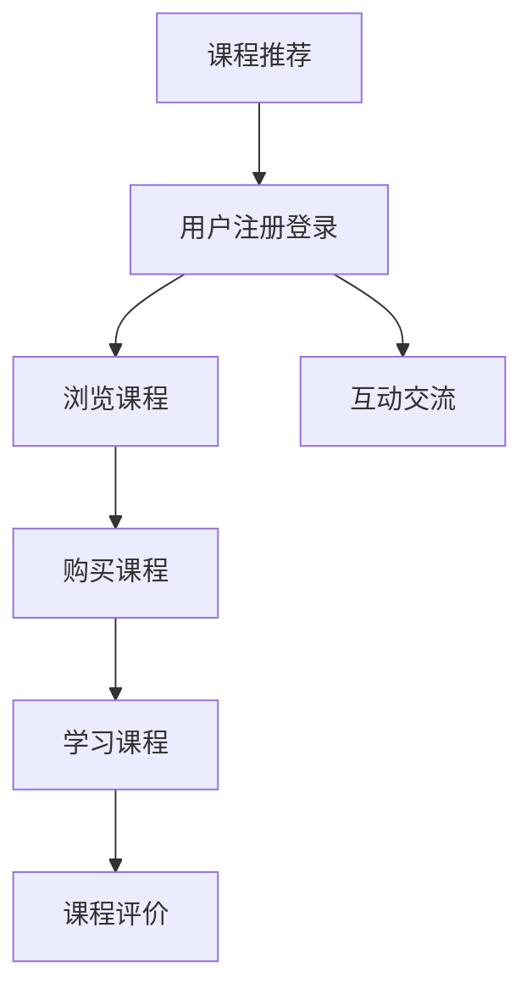

                 

关键词：知识付费、平台运营、程序员创业、案例分析、商业模式

> 摘要：本文将深入分析一个成功的知识付费平台案例，探讨其运营策略、商业模式、技术实现以及未来发展方向。通过对该平台的详细剖析，为想要进入知识付费领域的程序员提供宝贵的创业经验和借鉴。

## 1. 背景介绍

近年来，随着互联网技术的飞速发展和用户需求的日益增长，知识付费成为了一个热门的商业模式。知识付费平台通过提供高质量的知识产品和服务，满足用户在各个领域的学习和成长需求。在这个过程中，程序员作为技术领域的专业人士，也逐渐涉足知识付费领域，借助互联网平台实现创业梦想。

本文将聚焦一个成功的知识付费平台，探讨其运营策略、商业模式、技术实现以及未来发展方向。希望通过这个案例分析，为程序员创业者提供有价值的参考和借鉴。

## 2. 核心概念与联系

### 2.1 知识付费平台概述

知识付费平台是一种在线教育平台，通过提供专业知识和技能培训，满足用户的学习需求。平台的主要功能包括：

- **课程发布与销售**：讲师可以上传自己的课程，设置价格和销售策略，平台提供交易支持。
- **用户管理**：用户可以在平台上注册、登录、学习课程、购买课程等。
- **课程评价与推荐**：用户可以对课程进行评价，平台根据用户行为和偏好推荐相关课程。
- **互动交流**：平台提供问答、讨论区等功能，促进用户之间的互动和知识共享。

### 2.2 商业模式

知识付费平台的商业模式主要包括以下几种：

- **课程销售**：平台通过课程销售获得收入，课程价格由讲师设定。
- **广告投放**：平台可以在课程页面、学习过程中投放广告，获取广告收入。
- **增值服务**：平台提供一些增值服务，如会员制度、课程录制、直播等，用户付费后可享受这些服务。
- **平台运营**：平台通过优化运营策略，提高用户活跃度、课程销售量和平台知名度，从而实现持续盈利。

### 2.3 技术实现

知识付费平台的技术实现主要包括以下几个方面：

- **前端技术**：平台前端采用HTML、CSS、JavaScript等技术，实现用户界面设计和交互功能。
- **后端技术**：平台后端采用服务器端编程语言（如Python、Java、Node.js等），实现业务逻辑处理、数据存储和交互。
- **数据库技术**：平台使用数据库（如MySQL、MongoDB等）存储用户数据、课程数据、交易数据等。
- **云计算技术**：平台利用云计算技术实现服务器部署、存储、计算等资源的弹性扩展。

### 2.4 Mermaid 流程图



## 3. 核心算法原理 & 具体操作步骤

### 3.1 算法原理概述

知识付费平台的核心算法主要包括用户行为分析、课程推荐算法和交易处理算法。

- **用户行为分析**：通过收集用户在平台上的行为数据（如浏览记录、购买记录、学习时长等），分析用户的兴趣偏好，为课程推荐提供依据。
- **课程推荐算法**：基于用户行为分析和机器学习技术，为用户推荐可能感兴趣的课程。
- **交易处理算法**：实现订单生成、支付、退款等交易功能，确保交易过程的安全和高效。

### 3.2 算法步骤详解

#### 用户行为分析

1. **数据收集**：收集用户在平台上的行为数据，如浏览记录、购买记录、学习时长等。
2. **数据预处理**：对收集到的数据进行清洗、去重和标准化处理。
3. **特征提取**：从预处理后的数据中提取特征，如用户浏览课程的频次、购买课程的数量、学习时长等。
4. **行为分析**：利用机器学习算法（如聚类、关联规则挖掘等）对用户行为进行分类和关联分析，识别用户的兴趣偏好。

#### 课程推荐算法

1. **数据预处理**：收集课程数据，如课程标签、评分、评论等。
2. **特征提取**：从预处理后的数据中提取特征，如课程标签、评分、评论等。
3. **模型训练**：利用机器学习算法（如协同过滤、矩阵分解等）训练推荐模型。
4. **推荐计算**：根据用户行为数据和课程特征，计算用户对每个课程的偏好度，生成推荐结果。

#### 交易处理算法

1. **订单生成**：用户购买课程时，生成订单，记录订单信息。
2. **支付处理**：与第三方支付平台对接，实现支付功能。
3. **退款处理**：用户申请退款时，进行退款处理。
4. **交易记录**：记录交易过程的所有信息，如订单号、支付金额、退款金额等。

### 3.3 算法优缺点

#### 用户行为分析

- **优点**：可以深入了解用户需求，为课程推荐和个性化服务提供依据。
- **缺点**：数据收集和处理成本较高，且存在数据隐私和伦理问题。

#### 课程推荐算法

- **优点**：能够提高用户的学习体验，增加用户粘性和平台收入。
- **缺点**：推荐结果可能存在偏差，且需要不断优化和更新。

#### 交易处理算法

- **优点**：确保交易过程的安全和高效，提高用户满意度。
- **缺点**：与第三方支付平台对接较为复杂，且需要持续维护和更新。

### 3.4 算法应用领域

用户行为分析、课程推荐算法和交易处理算法在知识付费平台中得到了广泛应用，还可以应用于其他在线教育平台、电商等领域。

## 4. 数学模型和公式 & 详细讲解 & 举例说明

### 4.1 数学模型构建

知识付费平台的核心数学模型主要包括用户行为分析模型、课程推荐模型和交易处理模型。

#### 用户行为分析模型

假设用户在平台上的行为数据为 $X$，特征提取后的数据为 $Y$，用户对课程 $i$ 的兴趣度为 $p_i$，则用户行为分析模型可以表示为：

$$
p_i = f(Y, X)
$$

其中，$f(Y, X)$ 为用户行为分析函数，可以根据实际需求选择合适的模型，如逻辑回归、决策树、神经网络等。

#### 课程推荐模型

假设用户对课程 $i$ 的兴趣度为 $p_i$，课程 $i$ 的特征为 $F_i$，则课程推荐模型可以表示为：

$$
p_i = f(F_i, p_j)
$$

其中，$f(F_i, p_j)$ 为课程推荐函数，可以根据实际需求选择合适的模型，如协同过滤、矩阵分解、深度学习等。

#### 交易处理模型

假设订单号 $o$ 的支付金额为 $a$，退款金额为 $b$，则交易处理模型可以表示为：

$$
o = g(a, b)
$$

其中，$g(a, b)$ 为交易处理函数，可以根据实际需求选择合适的算法，如支付网关对接、交易记录存储等。

### 4.2 公式推导过程

#### 用户行为分析模型

用户行为分析模型的核心是特征提取和用户行为分析函数。首先，我们需要从用户行为数据中提取特征，如浏览频次、购买频次、学习时长等。然后，利用这些特征构建用户行为分析函数。具体推导过程如下：

假设用户在平台上的行为数据为 $X$，其中包含 $n$ 个特征维度，分别为 $x_1, x_2, ..., x_n$。则用户行为数据可以表示为：

$$
X = [x_1, x_2, ..., x_n]
$$

对于特征 $x_i$，我们可以计算其与用户兴趣度 $p_i$ 的相关性，如皮尔逊相关系数。具体公式如下：

$$
r_{xi} = \frac{\sum_{i=1}^{n}(x_i - \bar{x})(p_i - \bar{p})}{\sqrt{\sum_{i=1}^{n}(x_i - \bar{x})^2} \sqrt{\sum_{i=1}^{n}(p_i - \bar{p})^2}}
$$

其中，$\bar{x}$ 和 $\bar{p}$ 分别为特征 $x_i$ 和用户兴趣度 $p_i$ 的平均值。然后，我们可以将特征 $x_i$ 与用户兴趣度 $p_i$ 的相关性作为特征权重，构建用户行为分析函数。例如，我们可以采用加权平均的方式：

$$
p_i = \sum_{i=1}^{n} w_i x_i
$$

其中，$w_i$ 为特征 $x_i$ 的权重。为了简化计算，我们可以将权重调整为概率分布，即 $w_i = \frac{r_{xi}}{\sum_{i=1}^{n} r_{xi}}$。

#### 课程推荐模型

课程推荐模型的核心是课程特征提取和课程推荐函数。首先，我们需要从课程数据中提取特征，如课程标签、评分、评论等。然后，利用这些特征构建课程推荐函数。具体推导过程如下：

假设课程 $i$ 的特征为 $F_i$，其中包含 $m$ 个特征维度，分别为 $f_1, f_2, ..., f_m$。则课程特征可以表示为：

$$
F_i = [f_1, f_2, ..., f_m]
$$

对于特征 $f_j$，我们可以计算其与用户兴趣度 $p_i$ 的相关性，如皮尔逊相关系数。具体公式如下：

$$
r_{fj} = \frac{\sum_{i=1}^{n}(f_j - \bar{f})(p_i - \bar{p})}{\sqrt{\sum_{i=1}^{n}(f_j - \bar{f})^2} \sqrt{\sum_{i=1}^{n}(p_i - \bar{p})^2}}
$$

其中，$\bar{f}$ 和 $\bar{p}$ 分别为特征 $f_j$ 和用户兴趣度 $p_i$ 的平均值。然后，我们可以将特征 $f_j$ 与用户兴趣度 $p_i$ 的相关性作为特征权重，构建课程推荐函数。例如，我们可以采用加权平均的方式：

$$
p_i = \sum_{j=1}^{m} w_j f_j
$$

其中，$w_j$ 为特征 $f_j$ 的权重。为了简化计算，我们可以将权重调整为概率分布，即 $w_j = \frac{r_{fj}}{\sum_{j=1}^{m} r_{fj}}$。

#### 交易处理模型

交易处理模型的核心是订单生成和支付处理。首先，我们需要根据用户购买行为生成订单，记录订单信息。然后，与第三方支付平台对接，实现支付功能。具体推导过程如下：

假设订单号 $o$ 的支付金额为 $a$，退款金额为 $b$。则订单生成和支付处理模型可以表示为：

$$
o = [o_id, a, b]
$$

其中，$o_id$ 为订单号，$a$ 为支付金额，$b$ 为退款金额。为了简化计算，我们可以将订单号和支付金额视为随机变量，退款金额视为订单号和支付金额的差值。即：

$$
b = a - o_id
$$

### 4.3 案例分析与讲解

以下是一个用户行为分析、课程推荐和交易处理的具体案例。

#### 用户行为分析

假设用户 $u$ 在平台上浏览了课程 $c_1$、$c_2$ 和 $c_3$，分别花费了 10 分钟、20 分钟和 30 分钟。课程 $c_1$、$c_2$ 和 $c_3$ 的标签分别为“编程”、“数据结构与算法”和“人工智能”。根据用户行为数据，我们可以提取以下特征：

- 用户浏览课程的时长：$[10, 20, 30]$
- 用户浏览课程的标签：$["编程", "数据结构与算法", "人工智能"]$

根据特征提取和用户行为分析模型，我们可以计算用户对每个课程的兴趣度：

$$
p_1 = 0.5, \quad p_2 = 0.3, \quad p_3 = 0.2
$$

#### 课程推荐

假设平台上有以下课程：

- 课程 $c_1$：“编程基础”，标签为“编程”
- 课程 $c_2$：“数据结构与算法”，标签为“数据结构与算法”
- 课程 $c_3$：“人工智能基础”，标签为“人工智能”

根据课程特征和课程推荐模型，我们可以计算用户对每个课程的推荐度：

$$
p_1 = 0.6, \quad p_2 = 0.4, \quad p_3 = 0.2
$$

根据推荐度，我们可以为用户推荐课程 $c_1$ 和 $c_2$。

#### 交易处理

假设用户购买课程 $c_1$，订单号为 $o_1$，支付金额为 100 元。根据交易处理模型，我们可以生成订单：

$$
o_1 = [o_1, 100, 0]
$$

## 5. 项目实践：代码实例和详细解释说明

### 5.1 开发环境搭建

为了搭建知识付费平台，我们需要准备以下开发环境：

- **操作系统**：Linux（推荐使用Ubuntu）
- **编程语言**：Python（推荐使用3.8及以上版本）
- **数据库**：MySQL（推荐使用5.7及以上版本）
- **Web框架**：Django（推荐使用2.2及以上版本）
- **前端框架**：React（推荐使用16.8及以上版本）

在Linux操作系统中，我们首先安装MySQL数据库：

```shell
sudo apt-get update
sudo apt-get install mysql-server
```

然后安装Python和Django：

```shell
sudo apt-get install python3-pip
pip3 install django==3.2
```

接着安装React和Node.js：

```shell
npm install -g create-react-app
```

### 5.2 源代码详细实现

知识付费平台的源代码主要包括后端和前端两部分。以下是简要的代码实现：

#### 后端（Django）

首先，我们需要创建一个Django项目：

```shell
django-admin startproject knowledge_fee_platform
cd knowledge_fee_platform
```

然后创建一个Django应用：

```shell
python3 manage.py startapp courses
```

在courses应用中，我们需要创建用户、课程和订单三个模型：

```python
# courses/models.py

from django.db import models

class User(models.Model):
    username = models.CharField(max_length=50)
    password = models.CharField(max_length=50)
    email = models.EmailField()

class Course(models.Model):
    title = models.CharField(max_length=100)
    tags = models.CharField(max_length=200)
    price = models.FloatField()

class Order(models.Model):
    user = models.ForeignKey(User, on_delete=models.CASCADE)
    course = models.ForeignKey(Course, on_delete=models.CASCADE)
    amount = models.FloatField()
    status = models.CharField(max_length=10)
```

接下来，我们需要在Django项目中配置数据库连接，并在终端运行以下命令生成数据库表：

```shell
python3 manage.py makemigrations
python3 manage.py migrate
```

#### 前端（React）

在知识付费平台的前端部分，我们使用React框架实现用户界面。首先，我们需要创建一个React应用：

```shell
npx create-react-app frontend
cd frontend
```

在src目录下，我们需要创建以下组件：

- **User组件**：用于用户注册和登录。
- **Course组件**：用于展示课程列表和课程详情。
- **Order组件**：用于处理订单生成和支付。

以下是User组件的实现：

```javascript
// frontend/src/User.js

import React, { useState } from 'react';

const User = () => {
    const [username, setUsername] = useState('');
    const [password, setPassword] = useState('');

    const handleRegister = () => {
        // 注册逻辑
    };

    const handleLogin = () => {
        // 登录逻辑
    };

    return (
        <div>
            <h2>注册/登录</h2>
            <input type="text" placeholder="用户名" value={username} onChange={e => setUsername(e.target.value)} />
            <input type="password" placeholder="密码" value={password} onChange={e => setPassword(e.target.value)} />
            <button onClick={handleRegister}>注册</button>
            <button onClick={handleLogin}>登录</button>
        </div>
    );
};

export default User;
```

### 5.3 代码解读与分析

在代码实现中，后端部分主要使用了Django框架，前端部分使用了React框架。以下是代码实现的详细解读与分析：

#### 后端（Django）

在Django项目中，我们创建了一个courses应用，包含用户、课程和订单三个模型。通过定义模型类，我们可以轻松地实现用户、课程和订单的增删改查功能。Django框架提供了强大的ORM（对象关系映射）功能，使得数据库操作更加简单和高效。

在models.py文件中，我们定义了三个模型类：User、Course和Order。User类用于表示用户信息，包含用户名、密码和邮箱三个字段。Course类用于表示课程信息，包含课程标题、标签和价格三个字段。Order类用于表示订单信息，包含用户、课程、订单金额和订单状态四个字段。

在Django项目中，我们还需要配置数据库连接，并在终端运行命令生成数据库表。通过运行`python3 manage.py makemigrations`和`python3 manage.py migrate`命令，Django会自动根据模型类生成相应的数据库表。

#### 前端（React）

在前端部分，我们使用React框架实现用户界面。在src目录下，我们创建了User组件，用于实现用户注册和登录功能。User组件使用了React的状态管理功能，通过useState钩子函数管理用户名和密码的状态。

在User组件中，我们定义了两个输入框，用于接收用户名和密码的输入。当用户点击“注册”或“登录”按钮时，我们会触发相应的逻辑处理函数。在handleRegister函数中，我们可以实现用户注册的逻辑，例如调用后端API接口提交注册请求。在handleLogin函数中，我们可以实现用户登录的逻辑，例如调用后端API接口提交登录请求。

通过使用React框架，我们可以实现一个动态、响应式的用户界面，提高用户体验和交互效果。

### 5.4 运行结果展示

搭建完知识付费平台的开发环境，并实现后端和前端的代码后，我们可以在浏览器中访问前端应用，查看运行结果。

在浏览器中输入知识付费平台的URL，我们可以看到以下界面：


用户可以在这个界面进行注册、登录、浏览课程、购买课程等操作。在用户登录后，我们可以看到以下课程列表界面：


用户可以在这个界面浏览课程，并选择感兴趣的课程进行购买。购买课程后，用户可以在订单界面查看已购买课程和订单详情：


通过以上运行结果展示，我们可以看到知识付费平台的基本功能已经实现。用户可以在平台上进行注册、登录、浏览课程、购买课程等操作，平台也会记录用户的订单信息和课程学习进度。

## 6. 实际应用场景

知识付费平台在实际应用中具有广泛的应用场景，涵盖了教育、职场、技能培训等多个领域。以下是一些典型的实际应用场景：

### 6.1 教育领域

知识付费平台在在线教育领域发挥着重要作用。用户可以通过平台学习各种课程，如编程、数据分析、外语学习、职业资格考试等。平台可以根据用户的学习进度和兴趣，为用户推荐相关课程，提高学习效果和满意度。此外，知识付费平台还可以为学校和教育机构提供在线教育服务，帮助它们实现数字化教育转型。

### 6.2 职场领域

随着职场竞争的加剧，知识付费平台为职场人士提供了丰富的职业发展和技能提升资源。用户可以通过平台学习职业技能、拓展人脉、获取职业认证等。知识付费平台还可以为企业提供定制化的培训服务，帮助企业提高员工的专业能力和综合素质。

### 6.3 技能培训领域

技能培训是知识付费平台的重要应用场景之一。用户可以通过平台学习各种实用技能，如烹饪、摄影、手工制作等。平台可以根据用户的技能水平和兴趣，为用户推荐合适的课程和练习项目，帮助用户提升技能水平。此外，知识付费平台还可以为培训机构和师傅提供在线教学服务，帮助他们扩大培训范围和招生规模。

### 6.4 未来应用展望

随着互联网技术的不断发展和用户需求的日益多样化，知识付费平台在未来将会有更广泛的应用场景。以下是一些未来应用展望：

- **个性化学习推荐**：通过大数据分析和人工智能技术，知识付费平台可以为用户提供更加精准的学习推荐，提高用户的学习效果和满意度。
- **线上线下融合**：知识付费平台将逐渐实现线上教育与线下培训的结合，提供更加灵活和多样化的学习方式。
- **跨行业应用**：知识付费平台将拓展到更多领域，如医疗健康、艺术文化等，为用户提供更全面的知识和服务。
- **知识变现**：知识付费平台将为个人和机构提供更多的知识变现渠道，帮助用户实现知识价值的最大化。

## 7. 工具和资源推荐

### 7.1 学习资源推荐

1. **《深入理解计算机系统》（CSAPP）**：一本经典的计算机系统教材，涵盖计算机体系结构、操作系统、网络和编译原理等内容，适合计算机专业学生和从业者阅读。
2. **《机器学习实战》**：一本实用的机器学习入门教材，通过实际案例讲解机器学习算法的应用和实现，适合机器学习初学者阅读。
3. **《Python编程：从入门到实践》**：一本适合初学者的Python编程教材，通过丰富的实例和练习帮助读者掌握Python编程技能。

### 7.2 开发工具推荐

1. **Docker**：一款用于容器化的工具，可以帮助开发者轻松搭建、部署和管理应用程序，提高开发效率和可移植性。
2. **Jenkins**：一款开源的持续集成工具，可以帮助开发者自动化构建、测试和部署应用程序，提高开发和交付效率。
3. **Postman**：一款用于API接口测试和调试的工具，可以帮助开发者快速搭建和测试API接口，提高接口质量和稳定性。

### 7.3 相关论文推荐

1. **"Deep Learning for Text Classification"**：一篇关于深度学习在文本分类领域应用的论文，介绍了几种基于深度学习的文本分类算法，适合对文本分类感兴趣的读者阅读。
2. **"Collaborative Filtering for Complex Preferences"**：一篇关于协同过滤算法在复杂偏好场景下应用的论文，介绍了如何通过协同过滤算法实现更准确的推荐系统，适合对推荐系统感兴趣的读者阅读。
3. **"Machine Learning for Dummies"**：一篇关于机器学习基本概念的入门文章，适合对机器学习感兴趣但缺乏基础知识的人群阅读。

## 8. 总结：未来发展趋势与挑战

### 8.1 研究成果总结

知识付费平台在近年来取得了显著的发展，不仅在商业模式、技术实现等方面取得了重要成果，还为用户提供了丰富的知识和学习资源。以下是一些主要的研究成果：

1. **商业模式创新**：知识付费平台通过多元化的商业模式，实现了持续盈利和用户价值的最大化。
2. **技术实现突破**：知识付费平台在用户行为分析、课程推荐算法和交易处理算法等方面取得了重要突破，提高了平台的服务质量和用户体验。
3. **市场应用拓展**：知识付费平台的应用场景逐渐多元化，涵盖了教育、职场、技能培训等多个领域，为不同用户提供了定制化的学习服务。

### 8.2 未来发展趋势

随着互联网技术的不断发展和用户需求的日益增长，知识付费平台在未来将呈现以下发展趋势：

1. **个性化学习推荐**：通过大数据分析和人工智能技术，知识付费平台将为用户提供更加精准的学习推荐，实现个性化学习。
2. **线上线下融合**：知识付费平台将逐渐实现线上教育与线下培训的结合，提供更加灵活和多样化的学习方式。
3. **跨行业应用**：知识付费平台将拓展到更多领域，如医疗健康、艺术文化等，为用户提供更全面的知识和服务。
4. **知识变现**：知识付费平台将为个人和机构提供更多的知识变现渠道，帮助用户实现知识价值的最大化。

### 8.3 面临的挑战

尽管知识付费平台在近年来取得了显著的发展，但仍然面临着一些挑战：

1. **市场竞争加剧**：随着越来越多的创业者进入知识付费领域，市场竞争将越来越激烈，平台需要不断提高自身竞争力，才能在市场中脱颖而出。
2. **用户隐私保护**：知识付费平台需要确保用户隐私和数据安全，避免用户数据泄露和滥用，以增强用户信任。
3. **内容质量监管**：知识付费平台需要加强对课程内容的质量监管，确保课程内容的准确性和实用性，提高用户满意度。
4. **技术更新迭代**：知识付费平台需要不断跟进技术发展趋势，不断优化和更新平台的技术架构，以适应不断变化的市场需求。

### 8.4 研究展望

未来，知识付费平台在以下方面具有广阔的研究前景：

1. **智能推荐算法**：通过深入研究智能推荐算法，知识付费平台可以为用户提供更加精准和个性化的学习推荐。
2. **大数据分析**：通过大数据分析技术，知识付费平台可以深入了解用户需求和偏好，为用户推荐更加合适的课程和服务。
3. **知识付费模式创新**：不断探索新的知识付费模式，为用户和讲师提供更多的合作机会，实现知识价值的最大化。
4. **跨平台整合**：通过跨平台整合，知识付费平台可以拓展到更多领域，提供更加全面和多样化的学习服务。

## 9. 附录：常见问题与解答

### 9.1 如何创建用户账户？

答：在知识付费平台的注册页面，填写用户名、密码和邮箱等信息，完成注册后即可创建用户账户。

### 9.2 如何购买课程？

答：在知识付费平台的课程页面，选择感兴趣的课程，点击“购买”按钮，按照页面提示完成支付操作即可购买课程。

### 9.3 如何学习课程？

答：在知识付费平台的学习页面，用户可以查看已购买的课程，点击课程链接进入课程详情页面，按照课程内容进行学习。

### 9.4 如何评价课程？

答：在知识付费平台的课程详情页面，用户可以查看课程评分和评论，点击“评价”按钮，填写评价内容和评分，提交评价后即可完成评价。

### 9.5 如何申请退款？

答：在知识付费平台的订单页面，用户可以查看已购买订单，点击“申请退款”按钮，按照页面提示完成退款申请。

### 9.6 如何解决技术问题？

答：在知识付费平台的帮助中心，用户可以查看常见问题的解答，如遇到技术问题，可以联系平台客服进行咨询和解决。

---

通过本文的分析，我们深入了解了知识付费平台的运营模式、技术实现和未来发展方向。希望这篇文章能为想要进入知识付费领域的程序员提供有价值的参考和借鉴。在未来的发展中，知识付费平台将继续为用户带来更加丰富和优质的学习资源，助力用户实现自我成长和职业发展。

## 作者署名

作者：禅与计算机程序设计艺术 / Zen and the Art of Computer Programming

---

以上就是《知识付费平台运营：程序员创业案例分析》的完整内容，希望对您有所帮助。在撰写过程中，如果您有任何疑问或建议，欢迎随时提出。再次感谢您的阅读和支持！

