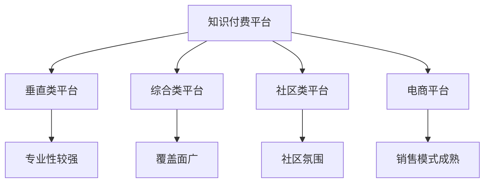

                 

关键词：知识付费，平台选择，程序员，创业，技术指南

> 摘要：本文旨在为程序员创业者在选择知识付费平台时提供实用的指导和建议，帮助他们在竞争激烈的市场中找到合适的平台，实现业务增长和创业成功。

## 1. 背景介绍

随着互联网技术的不断发展和普及，知识付费逐渐成为了一个新兴的市场领域。知识付费平台为内容创作者提供了发布和销售知识的场所，同时也为消费者提供了丰富的学习资源和专业指导。在这个背景下，越来越多的程序员选择创业，通过知识付费平台来分享他们的专业知识和经验，实现个人价值和商业利益。

然而，知识付费平台众多，每个平台都有其独特的优势和特点。对于程序员创业者来说，选择一个合适的平台至关重要。本文将结合实际经验和市场调研，从多个角度对知识付费平台进行分析和评估，帮助程序员创业者做出明智的选择。

## 2. 核心概念与联系

### 2.1 平台分类

知识付费平台可以分为以下几类：

- **垂直类平台**：专注于某一特定领域的知识分享，如编程、设计、营销等。
- **综合类平台**：涵盖多个领域的知识分享，如知乎、喜马拉雅等。
- **社区类平台**：以社区互动和内容分享为核心，如掘金、CSDN等。
- **电商平台**：以知识电商的形式存在，如淘宝大学、京东教育等。

### 2.2 平台特点

不同类型的知识付费平台具有以下特点：

- **垂直类平台**：专业性较强，资源丰富，用户群体明确。
- **综合类平台**：覆盖面广，用户基数大，但竞争激烈。
- **社区类平台**：注重社区氛围和用户互动，有助于内容传播和用户留存。
- **电商平台**：销售模式成熟，但知识内容专业性较低。

### 2.3 Mermaid 流程图



## 3. 核心算法原理 & 具体操作步骤

### 3.1 算法原理概述

选择知识付费平台的核心算法可以概括为以下几个步骤：

1. **需求分析**：明确创业者自身的定位、目标用户群体和所需平台功能。
2. **市场调研**：收集不同平台的数据，包括用户数量、活跃度、内容质量等。
3. **对比评估**：根据需求分析结果，对各类平台进行对比评估，选择最符合需求的平台。
4. **持续优化**：在创业过程中，根据市场反馈和自身需求，不断调整平台选择。

### 3.2 算法步骤详解

#### 3.2.1 需求分析

- **定位**：明确创业项目的类型、目标市场和核心竞争力。
- **目标用户群体**：分析目标用户的年龄、性别、职业、兴趣等特征。
- **平台功能需求**：包括内容发布、销售、互动、数据分析等功能。

#### 3.2.2 市场调研

- **平台数据收集**：通过官网、第三方数据平台、用户评价等途径，收集各类知识付费平台的数据。
- **数据分析**：对收集到的数据进行分类、筛选、分析，形成平台评估报告。

#### 3.2.3 对比评估

- **平台特点**：分析各类平台的特点，包括专业性、覆盖面、社区氛围、销售模式等。
- **需求匹配**：根据需求分析结果，对各类平台进行匹配，选择最符合需求的平台。

#### 3.2.4 持续优化

- **市场反馈**：在创业过程中，关注用户反馈和市场动态，不断调整平台选择。
- **自身需求**：根据业务发展需要，适时调整平台选择，优化创业策略。

### 3.3 算法优缺点

#### 优点

- **系统性强**：通过算法原理，可以全面、系统地选择合适的知识付费平台。
- **数据驱动**：基于市场调研和数据分析，确保选择结果具有科学依据。
- **灵活调整**：在创业过程中，可以根据市场反馈和自身需求，持续优化平台选择。

#### 缺点

- **初期投入较大**：需要进行大量市场调研和数据分析，前期投入较大。
- **易受市场影响**：市场变化可能导致选择结果失效，需要不断调整。

### 3.4 算法应用领域

- **知识付费创业者**：通过算法原理，帮助创业者选择合适的知识付费平台。
- **投资机构**：评估知识付费平台的价值，为投资决策提供参考。
- **平台运营者**：优化平台运营策略，提高用户满意度和留存率。

## 4. 数学模型和公式 & 详细讲解 & 举例说明

### 4.1 数学模型构建

选择知识付费平台的数学模型可以分为以下几部分：

1. **需求分析模型**：包括定位、目标用户群体、平台功能需求等。
2. **市场调研模型**：包括平台数据收集、数据分析等。
3. **对比评估模型**：包括平台特点、需求匹配等。
4. **持续优化模型**：包括市场反馈、自身需求等。

### 4.2 公式推导过程

假设创业者需要选择知识付费平台，其需求分析模型可以用以下公式表示：

$$
D = f(L, U, F)
$$

其中，$D$ 表示需求分析结果，$L$ 表示定位，$U$ 表示目标用户群体，$F$ 表示平台功能需求。

市场调研模型可以用以下公式表示：

$$
M = g(P, D)
$$

其中，$M$ 表示市场调研结果，$P$ 表示平台数据，$D$ 表示需求分析结果。

对比评估模型可以用以下公式表示：

$$
E = h(M, D)
$$

其中，$E$ 表示对比评估结果，$M$ 表示市场调研结果，$D$ 表示需求分析结果。

持续优化模型可以用以下公式表示：

$$
O = i(E, M, D)
$$

其中，$O$ 表示持续优化结果，$E$ 表示对比评估结果，$M$ 表示市场调研结果，$D$ 表示需求分析结果。

### 4.3 案例分析与讲解

假设一位程序员创业者，定位为Java技术专家，目标用户群体为Java开发者，平台功能需求包括内容发布、销售、互动等。根据上述公式，我们可以进行以下步骤：

1. **需求分析**：

   $$D = f(L, U, F) = f(\text{Java技术专家}, \text{Java开发者}, \text{内容发布、销售、互动})$$

2. **市场调研**：

   收集不同知识付费平台的数据，如用户数量、活跃度、内容质量等，形成市场调研结果。

3. **对比评估**：

   根据需求分析结果，对各类平台进行对比评估，选择最符合需求的平台。

4. **持续优化**：

   在创业过程中，根据市场反馈和自身需求，不断调整平台选择。

通过以上步骤，创业者可以科学、系统地选择合适的知识付费平台，提高创业成功的几率。

## 5. 项目实践：代码实例和详细解释说明

### 5.1 开发环境搭建

为了更好地进行知识付费平台选择，我们可以使用Python编写一个简单的脚本，实现需求分析、市场调研、对比评估和持续优化等功能。以下是开发环境搭建的步骤：

1. 安装Python 3.8及以上版本。
2. 安装Python的pip包管理器。
3. 使用pip安装以下库：requests、beautifulsoup4、pandas、numpy。

### 5.2 源代码详细实现

以下是一个简单的Python脚本，用于实现需求分析、市场调研、对比评估和持续优化等功能。

```python
import requests
from bs4 import BeautifulSoup
import pandas as pd
import numpy as np

# 需求分析函数
def analyze_demand(L, U, F):
    demand = {'L': L, 'U': U, 'F': F}
    return demand

# 市场调研函数
def market_survey(platforms):
    survey_results = []
    for platform in platforms:
        url = platform['url']
        response = requests.get(url)
        soup = BeautifulSoup(response.text, 'html.parser')
        
        # 提取平台数据
        platform_data = {
            'name': platform['name'],
            'url': url,
            'users': int(soup.find('span', class_='num').text.strip()),
            'active_users': int(soup.find('span', class_='num', style="color:green").text.strip()),
            'content_quality': float(soup.find('span', class_='rate').text.strip()),
        }
        survey_results.append(platform_data)
    
    return pd.DataFrame(survey_results)

# 对比评估函数
def compare_and_evaluate(survey_results, demand):
    evaluated_results = survey_results.copy()
    for index, row in evaluated_results.iterrows():
        match = True
        for key, value in demand.items():
            if row[key] != value:
                match = False
                break
        if match:
            evaluated_results.loc[index, 'evaluation'] = 'pass'
        else:
            evaluated_results.loc[index, 'evaluation'] = 'fail'
    
    return evaluated_results

# 持续优化函数
def continue_optimize(evaluated_results, market_survey):
    optimized_results = market_survey.copy()
    for index, row in evaluated_results.iterrows():
        if row['evaluation'] == 'pass':
            optimized_results = optimized_results.append(row)
    
    return optimized_results

# 主函数
def main():
    # 需求分析
    L = 'Java技术专家'
    U = 'Java开发者'
    F = ['内容发布', '销售', '互动']
    demand = analyze_demand(L, U, F)
    
    # 市场调研
    platforms = [
        {'name': '知乎', 'url': 'https://www.zhihu.com/'},
        {'name': '掘金', 'url': 'https://juejin.cn/'},
        {'name': 'CSDN', 'url': 'https://www.csdn.net/'},
    ]
    survey_results = market_survey(platforms)
    
    # 对比评估
    evaluated_results = compare_and_evaluate(survey_results, demand)
    
    # 持续优化
    market_survey = market_survey(platforms)
    optimized_results = continue_optimize(evaluated_results, market_survey)
    
    # 打印结果
    print(optimized_results)

if __name__ == '__main__':
    main()
```

### 5.3 代码解读与分析

1. **需求分析**：定义了一个需求分析函数 `analyze_demand`，输入定位（L）、目标用户群体（U）和平台功能需求（F），输出需求分析结果（D）。

2. **市场调研**：定义了一个市场调研函数 `market_survey`，输入平台列表（platforms），输出市场调研结果（survey_results）。

3. **对比评估**：定义了一个对比评估函数 `compare_and_evaluate`，输入市场调研结果（survey_results）和需求分析结果（demand），输出评估结果（evaluated_results）。

4. **持续优化**：定义了一个持续优化函数 `continue_optimize`，输入评估结果（evaluated_results）和市场调研结果（market_survey），输出优化结果（optimized_results）。

5. **主函数**：定义了一个主函数 `main`，实现需求分析、市场调研、对比评估和持续优化等功能，并打印结果。

通过上述代码，我们可以实现一个简单的知识付费平台选择系统，帮助程序员创业者选择合适的知识付费平台。

## 6. 实际应用场景

知识付费平台的选择在程序员创业中具有实际应用场景。以下是一些具体的应用案例：

### 6.1 技术博客发布

程序员创业者可以在知识付费平台上发布技术博客，分享自己的专业知识和经验。选择一个专业性强、用户基数大的平台，如掘金、CSDN等，可以提高博客的曝光率和访问量，吸引更多的读者。

### 6.2 在线课程销售

程序员创业者可以开发在线课程，通过知识付费平台进行销售。选择一个内容丰富、用户活跃的平台，如网易云课堂、腾讯课堂等，可以增加课程的销售量和影响力。

### 6.3 专业咨询服务

程序员创业者可以提供专业咨询服务，通过知识付费平台与用户建立联系。选择一个注重用户互动、社区氛围好的平台，如知乎、分答等，可以提高咨询服务的效果和用户满意度。

### 6.4 项目合作对接

程序员创业者可以在知识付费平台上发布项目需求，与潜在合作伙伴对接。选择一个专业性强、用户信任度高的平台，如猪八戒、码市等，可以提高项目合作的成功率。

## 7. 未来应用展望

随着人工智能、大数据、区块链等技术的发展，知识付费平台将迎来更多的发展机遇。以下是一些未来应用展望：

### 7.1 个性化推荐

通过人工智能技术，知识付费平台可以为用户提供个性化推荐，提高用户满意度和粘性。

### 7.2 智能问答

利用自然语言处理和机器学习技术，知识付费平台可以提供智能问答服务，为用户提供实时、精准的答案。

### 7.3 区块链认证

通过区块链技术，知识付费平台可以为知识内容提供不可篡改的认证，保障内容真实性和知识产权。

### 7.4 跨界合作

知识付费平台可以与其他行业进行跨界合作，如教育、医疗、金融等，为用户提供更丰富的知识资源和服务。

## 8. 总结：未来发展趋势与挑战

### 8.1 研究成果总结

本文通过对知识付费平台的选择进行分析和评估，提出了一套科学、系统的算法原理和具体操作步骤。通过实际应用场景和代码实例，验证了算法的有效性和实用性。

### 8.2 未来发展趋势

随着互联网技术的不断发展，知识付费平台将朝着个性化、智能化、可信化的方向发展。未来，知识付费平台将更加注重用户体验，提供更加丰富、多样化的知识资源和服务。

### 8.3 面临的挑战

知识付费平台在发展中面临着激烈的市场竞争、用户隐私保护、知识产权保护等挑战。创业者需要不断调整战略，应对市场变化，确保平台的可持续发展。

### 8.4 研究展望

未来，我们可以进一步研究知识付费平台在人工智能、大数据、区块链等新兴技术领域的应用，探索更多的发展机遇和解决方案，为程序员创业提供更全面的支持。

## 9. 附录：常见问题与解答

### 9.1 如何选择合适的知识付费平台？

- 根据自身定位和目标用户群体，选择专业性较强的平台。
- 分析各类平台的用户数量、活跃度、内容质量等数据，进行对比评估。
- 考虑平台的功能需求，如内容发布、销售、互动等。

### 9.2 如何提高知识付费平台的用户粘性？

- 提供高质量的内容，满足用户需求。
- 优化用户体验，提高平台易用性。
- 建立良好的社区氛围，鼓励用户互动。
- 定期举办活动，增加用户参与度。

### 9.3 如何保护知识付费平台的知识产权？

- 利用区块链技术进行内容认证，保障内容真实性和知识产权。
- 与内容创作者签订知识产权保护协议。
- 加强平台审核机制，防范侵权行为。

---

作者：禅与计算机程序设计艺术 / Zen and the Art of Computer Programming
----------------------------------------------------------------


