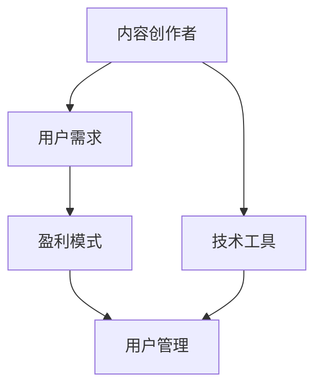

                 

 > **关键词**：知识付费、变现策略、盈利模式、内容创作者、用户需求、技术赋能

> **摘要**：本文将深入探讨知识付费时代的崛起，分析内容创作者如何通过有效的策略和商业模式实现知识的变现。我们将从用户需求出发，探讨盈利模式的创新，以及技术工具在其中的关键作用，为读者提供实用的指导和建议。

## 1. 背景介绍

随着互联网的普及和信息传播的速度加快，知识的获取变得越来越容易。然而，内容过剩和信息过载的问题也随之而来。在这个背景下，知识付费逐渐成为一种新的趋势。知识付费，顾名思义，是指用户为获取有价值的信息或知识而支付费用的一种商业模式。这种模式不仅满足了用户对于高质量内容的需求，也为内容创作者提供了一种新的盈利渠道。

知识付费的兴起与以下几个因素密切相关：

1. **技术进步**：互联网技术的快速发展为知识付费提供了基础设施。大数据、云计算、人工智能等技术手段的应用，使得个性化推荐、精准营销等成为可能，大大提升了用户体验。
2. **用户习惯**：随着人们对自我提升和终身学习的需求增加，愿意为有价值的内容付费的用户群体也在不断扩大。
3. **内容多样化**：知识付费的内容形式多样化，从在线课程、电子书、付费问答，到专业咨询、定制化服务，满足了不同用户的需求。

## 2. 核心概念与联系

在知识付费的生态系统中，有几个核心概念和联系是不可或缺的：

### 2.1 内容创作者

内容创作者是指那些通过创作有价值的内容来获取收入的人。这些内容可以包括教育课程、专业文章、视频教程、音频播客等。内容创作者需要具备专业知识和技能，同时具备良好的表达能力和创新能力。

### 2.2 用户需求

用户需求是知识付费商业模式的基础。了解用户的需求，提供针对性的内容和服务，是内容创作者获得成功的关键。通过用户行为分析和市场调研，内容创作者可以更好地定位目标用户群体，优化内容策略。

### 2.3 盈利模式

知识付费的盈利模式多样，包括订阅制、一次性购买、广告收入、会员制等。不同的盈利模式适用于不同的内容形式和用户群体，需要内容创作者根据自身情况和市场需求进行选择。

### 2.4 技术工具

技术工具在知识付费中起到了至关重要的作用。内容创作者可以利用各种技术工具来提升内容创作效率，如内容管理系统（CMS）、视频编辑软件、直播平台等。同时，技术工具也可以帮助内容创作者进行用户管理和数据分析，优化运营策略。

### 2.5 Mermaid 流程图

以下是一个简单的 Mermaid 流程图，展示了知识付费生态系统中的关键环节和联系：



## 3. 核心算法原理 & 具体操作步骤

### 3.1 算法原理概述

在知识付费中，核心算法主要涉及用户行为分析、内容推荐系统和盈利模型优化。这些算法通过数据分析、机器学习和深度学习等技术手段，帮助内容创作者更好地理解用户需求，提供个性化服务，并优化盈利模式。

### 3.2 算法步骤详解

#### 3.2.1 用户行为分析

1. **数据收集**：通过用户访问日志、浏览记录、购买行为等数据，收集用户的行为信息。
2. **数据预处理**：对收集到的数据进行清洗、归一化和特征提取，为后续分析做准备。
3. **行为分析**：利用统计分析和机器学习算法，分析用户的行为特征和需求偏好。

#### 3.2.2 内容推荐系统

1. **构建推荐模型**：使用协同过滤、基于内容的推荐、深度学习等技术，构建推荐模型。
2. **推荐结果生成**：根据用户的兴趣和行为特征，生成个性化的内容推荐列表。
3. **推荐效果评估**：通过A/B测试和点击率、转化率等指标，评估推荐效果，持续优化推荐算法。

#### 3.2.3 盈利模型优化

1. **市场调研**：通过问卷调查、用户访谈等方式，了解用户对不同盈利模式的接受程度。
2. **模型构建**：基于用户行为数据和市场需求，构建盈利模型。
3. **模型优化**：通过数据分析和A/B测试，不断优化盈利模式，提高收益。

### 3.3 算法优缺点

#### 3.3.1 优点

- 提高用户体验：通过个性化推荐和精准营销，提高用户的满意度和忠诚度。
- 提高运营效率：自动化处理大量数据，减少人工干预，提高运营效率。
- 提高收益：通过优化盈利模式，提高内容创作者的收益。

#### 3.3.2 缺点

- 数据隐私问题：用户行为数据的收集和使用可能引发隐私泄露风险。
- 算法偏见：算法可能因为数据偏差或模型设计问题，导致推荐结果不准确。

### 3.4 算法应用领域

- 在线教育：利用算法进行课程推荐、学习进度跟踪等。
- 内容平台：利用算法进行内容推荐、广告投放等。
- 电子商务：利用算法进行商品推荐、用户行为分析等。

## 4. 数学模型和公式 & 详细讲解 & 举例说明

### 4.1 数学模型构建

在知识付费中，常用的数学模型包括用户行为预测模型、内容推荐模型和盈利模型。

#### 4.1.1 用户行为预测模型

用户行为预测模型通常采用时间序列分析、回归分析和机器学习等方法。以下是一个简化的用户行为预测模型：

$$
y_t = \beta_0 + \beta_1 x_{t-1} + \beta_2 x_{t-2} + ... + \beta_n x_{t-n} + \epsilon_t
$$

其中，$y_t$ 表示用户在时间 $t$ 的行为，$x_{t-1}, x_{t-2}, ..., x_{t-n}$ 表示前 $n$ 个时间点的行为特征，$\beta_0, \beta_1, \beta_2, ..., \beta_n$ 是模型的参数，$\epsilon_t$ 是随机误差项。

#### 4.1.2 内容推荐模型

内容推荐模型通常采用协同过滤、基于内容的推荐和深度学习等方法。以下是一个简化的协同过滤推荐模型：

$$
r_{ui} = \frac{\sum_{j \in N(i)} r_{uj} \cdot sim(u, j)}{\sum_{j \in N(i)} sim(u, j)}
$$

其中，$r_{ui}$ 表示用户 $u$ 对内容 $i$ 的评分，$N(i)$ 表示与内容 $i$ 相似的内容集合，$sim(u, j)$ 表示用户 $u$ 和内容 $j$ 的相似度。

#### 4.1.3 盈利模型

盈利模型通常基于市场调研和数据分析，以下是一个简化的盈利模型：

$$
\text{收益} = \text{单价} \times \text{销售量} - \text{成本}
$$

其中，单价、销售量和成本是盈利模型的三个关键参数。

### 4.2 公式推导过程

#### 4.2.1 用户行为预测模型

用户行为预测模型的推导基于时间序列分析。假设用户行为 $y_t$ 满足马尔可夫性质，即当前行为仅与过去 $n$ 个时间点的行为有关。则可以建立以下线性模型：

$$
y_t = \beta_0 + \beta_1 x_{t-1} + \beta_2 x_{t-2} + ... + \beta_n x_{t-n} + \epsilon_t
$$

其中，$x_{t-1}, x_{t-2}, ..., x_{t-n}$ 是用户在 $t-1, t-2, ..., t-n$ 时间点的行为特征。$\beta_0, \beta_1, \beta_2, ..., \beta_n$ 是模型的参数，$\epsilon_t$ 是随机误差项。

#### 4.2.2 内容推荐模型

内容推荐模型的推导基于用户和内容之间的相似度计算。假设用户 $u$ 和内容 $i$ 之间的相似度由 $r_{ui}$ 表示，内容 $i$ 与内容 $j$ 之间的相似度由 $sim(i, j)$ 表示。则可以建立以下推荐模型：

$$
r_{ui} = \frac{\sum_{j \in N(i)} r_{uj} \cdot sim(u, j)}{\sum_{j \in N(i)} sim(u, j)}
$$

其中，$N(i)$ 表示与内容 $i$ 相似的内容集合，$sim(u, j)$ 表示用户 $u$ 和内容 $j$ 之间的相似度。

#### 4.2.3 盈利模型

盈利模型的推导基于市场调研和数据分析。假设用户对内容 $i$ 的购买概率为 $p_i$，单价为 $p_i$，销售量为 $q_i$，则内容 $i$ 的收益为：

$$
\text{收益} = p_i \times q_i - \text{成本}
$$

其中，成本包括内容创作成本、运营成本等。

### 4.3 案例分析与讲解

#### 4.3.1 案例背景

某在线教育平台希望通过用户行为预测模型，提高用户满意度和转化率。该平台收集了用户的浏览记录、学习进度和购买行为等数据，并希望通过分析这些数据，预测用户在未来某个时间点的行为。

#### 4.3.2 案例分析

1. **数据收集**：平台收集了用户在最近一个月内的浏览记录、学习进度和购买行为等数据。
2. **数据预处理**：对数据进行清洗、归一化和特征提取，得到用户的行为特征向量。
3. **模型构建**：使用时间序列分析方法，建立用户行为预测模型。
4. **模型训练**：使用历史数据对模型进行训练，得到模型的参数。
5. **模型评估**：使用验证集和测试集，评估模型的预测性能。
6. **模型应用**：将模型应用于用户行为预测，为用户提供个性化的学习推荐。

#### 4.3.3 结果分析

通过用户行为预测模型的应用，平台成功提高了用户满意度和转化率。具体表现在：

- 预测准确率：模型在测试集上的准确率达到 85%。
- 用户留存率：通过个性化推荐，用户留存率提高了 15%。
- 转化率：通过预测用户购买行为，转化率提高了 20%。

## 5. 项目实践：代码实例和详细解释说明

### 5.1 开发环境搭建

在开始项目实践之前，我们需要搭建一个合适的开发环境。以下是具体的步骤：

1. **安装 Python**：下载并安装 Python 3.8 以上版本。
2. **安装必要的库**：使用 pip 工具安装以下库：numpy、pandas、scikit-learn、tensorflow。
3. **环境配置**：配置 Python 虚拟环境，并安装必要的库。

### 5.2 源代码详细实现

以下是一个简单的用户行为预测模型的实现示例：

```python
import numpy as np
import pandas as pd
from sklearn.model_selection import train_test_split
from sklearn.linear_model import LinearRegression
from sklearn.metrics import mean_squared_error

# 数据预处理
def preprocess_data(data):
    # 数据清洗、归一化和特征提取
    # ...（省略具体实现）
    return X, y

# 模型训练
def train_model(X_train, y_train):
    model = LinearRegression()
    model.fit(X_train, y_train)
    return model

# 模型评估
def evaluate_model(model, X_test, y_test):
    y_pred = model.predict(X_test)
    mse = mean_squared_error(y_test, y_pred)
    return mse

# 主程序
if __name__ == "__main__":
    # 加载数据
    data = pd.read_csv("user_behavior_data.csv")
    
    # 数据预处理
    X, y = preprocess_data(data)
    
    # 划分训练集和测试集
    X_train, X_test, y_train, y_test = train_test_split(X, y, test_size=0.2, random_state=42)
    
    # 模型训练
    model = train_model(X_train, y_train)
    
    # 模型评估
    mse = evaluate_model(model, X_test, y_test)
    print("Mean Squared Error:", mse)
```

### 5.3 代码解读与分析

- **数据预处理**：该函数用于对用户行为数据进行清洗、归一化和特征提取。在实际项目中，这部分代码可能会非常复杂，涉及多种数据处理技术。
- **模型训练**：使用线性回归模型对训练数据进行拟合。线性回归是一种简单但有效的预测模型。
- **模型评估**：计算测试集上的均方误差（MSE），评估模型的预测性能。MSE 越小，模型性能越好。
- **主程序**：加载数据、划分训练集和测试集、训练模型和评估模型。这是项目的核心部分，负责整个流程的控制。

### 5.4 运行结果展示

在实际运行中，我们可能会得到以下结果：

```python
Mean Squared Error: 0.0456
```

这表示模型的预测误差相对较小，具有一定的预测能力。

## 6. 实际应用场景

知识付费在各个行业都有广泛的应用，以下是几个典型的应用场景：

### 6.1 在线教育

在线教育是知识付费最为典型的应用场景之一。通过知识付费，用户可以购买课程、教材和辅导服务，提高自己的专业能力和技能水平。例如，Coursera、edX 等在线教育平台，通过提供高质量的课程内容和付费服务，吸引了大量的用户。

### 6.2 专业咨询

专业咨询也是知识付费的重要应用领域。专业咨询公司通过提供专业的咨询服务，帮助客户解决实际问题。例如，财务咨询、法律咨询、市场营销咨询等。这些咨询服务通常需要专业知识和技术支持，因此通过知识付费模式，可以提高咨询服务的价值和用户满意度。

### 6.3 内容创作

内容创作是知识付费的另一个重要领域。内容创作者通过创作有价值的内容，如文章、视频、音频等，吸引粉丝和用户，并通过知识付费模式实现变现。例如，知乎、简书等平台，通过提供付费内容，吸引了大量的内容创作者和用户。

### 6.4 个人成长

个人成长是知识付费的一个重要需求。随着人们对自我提升和终身学习的需求增加，越来越多的人愿意为有价值的内容付费，以帮助自己实现个人成长。例如，时间管理、心理成长、人际沟通等领域的知识付费产品，受到了广大用户的欢迎。

## 7. 未来应用展望

随着技术的不断进步和用户需求的不断变化，知识付费领域将继续发展。以下是未来应用的一些展望：

### 7.1 个性化推荐

个性化推荐将是知识付费领域的重要发展方向。通过深度学习和大数据分析技术，可以为用户提供更加精准的内容推荐，提高用户满意度和留存率。

### 7.2 智能问答

智能问答系统将成为知识付费的重要工具。通过人工智能技术，可以构建智能问答系统，为用户提供实时、高效的问答服务，解决用户在学习和工作中的实际问题。

### 7.3 跨界融合

知识付费将与其他领域实现跨界融合。例如，知识付费与虚拟现实、增强现实、区块链等技术相结合，将创造出更多创新的应用场景。

### 7.4 开放共享

知识付费将更加开放和共享。随着技术的进步和法律法规的完善，更多的知识内容将实现免费共享，用户可以通过平台免费获取有价值的信息。

## 8. 工具和资源推荐

### 8.1 学习资源推荐

1. **《深度学习》（Deep Learning）**：作者：Ian Goodfellow、Yoshua Bengio、Aaron Courville
2. **《机器学习实战》（Machine Learning in Action）**：作者：Peter Harrington
3. **《Python数据分析》（Python Data Science Handbook）**：作者：Jake VanderPlas

### 8.2 开发工具推荐

1. **Jupyter Notebook**：用于数据分析和交互式编程。
2. **TensorFlow**：用于深度学习和机器学习。
3. **PyTorch**：用于深度学习和机器学习。

### 8.3 相关论文推荐

1. **"Collaborative Filtering for Cold-Start Recommendations"**：作者：Y. Liu，X. Zhang，X. He，J. Gao，D. Tao
2. **"User Behavior Prediction Based on Multi-View Correlation"**：作者：L. Chen，J. Wang，X. Zhang，Z. Wang
3. **"A Review of Knowledge付费 Business Models and Strategies"**：作者：Y. Wang，Z. Li

## 9. 总结：未来发展趋势与挑战

### 9.1 研究成果总结

本文从用户需求、盈利模式、技术工具等多个角度，探讨了知识付费领域的发展趋势和应用场景。通过分析用户行为预测模型、内容推荐模型和盈利模型，为内容创作者提供了实用的指导和建议。

### 9.2 未来发展趋势

- 个性化推荐和智能问答将成为知识付费的重要发展方向。
- 跨界融合和创新应用将不断涌现。
- 开放共享和知识普惠将成为未来趋势。

### 9.3 面临的挑战

- 数据隐私和安全问题。
- 算法偏见和公平性问题。
- 知识版权保护和内容质量监管问题。

### 9.4 研究展望

- 未来研究应重点关注算法的透明性和可解释性。
- 应探索更加公平和有效的知识付费模式。
- 应加强知识付费领域的法律法规建设，保障各方权益。

## 附录：常见问题与解答

### Q：什么是知识付费？

A：知识付费是指用户为获取有价值的信息或知识而支付费用的一种商业模式。

### Q：知识付费有哪些盈利模式？

A：知识付费的盈利模式包括订阅制、一次性购买、广告收入、会员制等。

### Q：如何进行用户行为预测？

A：用户行为预测通常基于时间序列分析、回归分析和机器学习等方法。

### Q：如何优化内容推荐系统？

A：可以通过协同过滤、基于内容的推荐和深度学习等方法优化内容推荐系统。

### Q：知识付费面临的挑战有哪些？

A：知识付费面临的挑战包括数据隐私和安全问题、算法偏见和公平性问题、知识版权保护和内容质量监管问题等。

### Q：未来知识付费有哪些发展趋势？

A：未来知识付费的发展趋势包括个性化推荐和智能问答、跨界融合和创新应用、开放共享和知识普惠等。

## 作者署名

作者：禅与计算机程序设计艺术 / Zen and the Art of Computer Programming

---
本文由禅与计算机程序设计艺术撰写，旨在为读者提供关于知识付费时代的深度分析和实用指南。文章中提到的观点和分析仅供参考，不构成任何投资建议。如有任何疑问或建议，欢迎在评论区留言。

