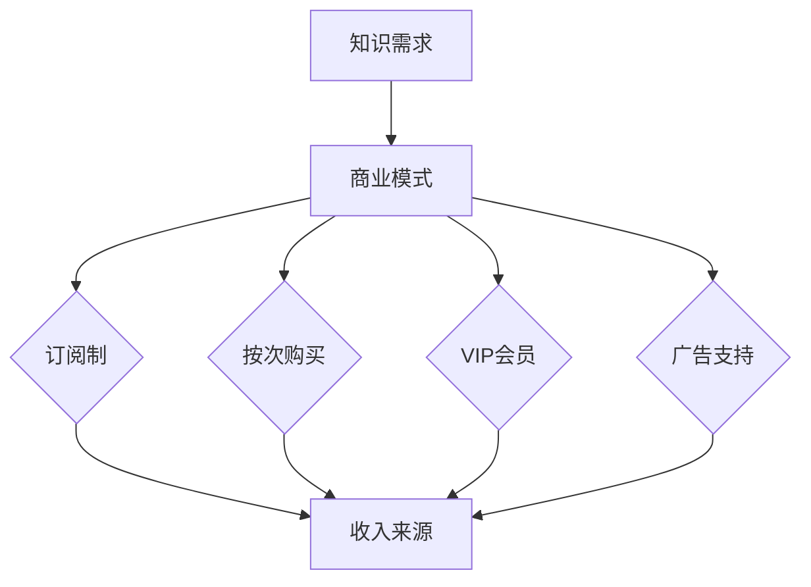

                 

关键词：知识付费、商业模式、盈利策略、用户增长、市场细分

摘要：随着互联网的普及和知识共享理念的发展，知识付费作为一种新兴的商业模式，吸引了大量企业和创业者。本文将深入探讨知识付费的商业模式、盈利策略以及如何实现用户增长和市场细分，为从业者提供实用的指导和建议。

## 1. 背景介绍

知识付费是指用户为获取特定知识、技能或信息而付费的行为。在互联网时代，信息爆炸和知识获取的便利性使得知识付费成为一种趋势。用户对高质量、专业化的知识需求日益增长，这为知识付费市场带来了巨大的发展空间。知识付费的形式多样，包括在线课程、电子书、专业咨询、在线问答等。

知识付费的发展得益于几个关键因素。首先，互联网技术的发展使得知识传播变得更加高效和便捷。用户可以通过网络随时随地学习，这大大降低了知识获取的门槛。其次，移动设备的普及和4G/5G网络的普及，为知识付费提供了良好的用户体验。最后，用户消费观念的转变，使得他们更愿意为知识付费。

## 2. 核心概念与联系

### 2.1 知识付费的定义

知识付费是指用户为获取特定知识、技能或信息而付费的行为。这种模式的核心在于“价值交换”，即用户认为所获取的知识或信息对其具有价值，并愿意为此支付相应的费用。

### 2.2 商业模式

知识付费的商业模式主要包括以下几种：

1. **订阅制**：用户通过订阅服务获取持续更新的知识内容。这种模式常见于在线课程、电子书平台等。
2. **按次购买**：用户为单个知识产品支付费用，如专业咨询、在线问答等。
3. **VIP会员**：用户支付一定费用成为会员，享受平台提供的所有或部分知识产品和服务。
4. **广告支持**：平台通过广告收入支持知识产品的免费或低成本获取。

### 2.3 盈利策略

知识付费的盈利策略可以从以下几个方面进行：

1. **直接销售**：直接向用户销售知识产品，如在线课程、电子书等。
2. **会员服务**：通过提供会员服务，如VIP会员、年费会员等，获得持续的收入。
3. **广告收入**：在知识产品中嵌入广告，通过广告点击量或展示量获得收入。
4. **跨界合作**：与品牌或机构合作，提供定制化的知识服务，实现跨界盈利。

### 2.4 Mermaid 流程图



## 3. 核心算法原理 & 具体操作步骤

### 3.1 算法原理概述

知识付费的核心算法原理主要涉及用户行为分析、内容推荐和商业模式设计。通过对用户行为数据进行分析，了解用户的知识需求和偏好，从而实现精准的内容推荐。同时，根据不同的用户需求和平台策略，设计合理的商业模式以最大化盈利。

### 3.2 算法步骤详解

1. **数据收集**：收集用户行为数据，如浏览历史、购买记录、评价等。
2. **数据处理**：对收集到的数据进行分析和处理，提取关键特征。
3. **内容推荐**：基于用户特征和内容特征，使用推荐算法为用户推荐相关的知识产品。
4. **商业模式设计**：根据用户需求和平台策略，设计适合的商业模式。

### 3.3 算法优缺点

- **优点**：提高用户满意度，增加用户粘性，提高盈利能力。
- **缺点**：需要大量的数据支持，算法设计复杂，成本较高。

### 3.4 算法应用领域

- **在线教育**：为用户提供个性化的学习推荐，提高学习效果。
- **专业咨询**：根据用户需求推荐专业咨询，提高咨询转化率。
- **内容平台**：为用户提供个性化的内容推荐，增加用户停留时间。

## 4. 数学模型和公式 & 详细讲解 & 举例说明

### 4.1 数学模型构建

知识付费的数学模型主要包括用户行为模型、内容推荐模型和商业模式模型。

- **用户行为模型**：假设用户行为数据为 $X = (x_1, x_2, ..., x_n)$，其中 $x_i$ 表示用户第 $i$ 次行为。
- **内容推荐模型**：假设内容特征数据为 $Y = (y_1, y_2, ..., y_m)$，其中 $y_j$ 表示内容第 $j$ 个特征。
- **商业模式模型**：假设商业模式数据为 $Z = (z_1, z_2, ..., z_k)$，其中 $z_l$ 表示商业模式第 $l$ 个特征。

### 4.2 公式推导过程

- **用户行为模型**：假设用户行为数据 $X$ 和内容特征数据 $Y$ 满足马尔可夫链模型，则 $P(X|Y) = P(X_1|Y)P(X_2|X_1, Y)P(X_3|X_2, Y) ...$。
- **内容推荐模型**：假设内容特征数据 $Y$ 和商业模式数据 $Z$ 满足贝叶斯网络模型，则 $P(Y|Z) = \frac{P(Z|Y)P(Y)}{P(Z)}$。
- **商业模式模型**：假设商业模式数据 $Z$ 和用户行为数据 $X$ 满足隐马尔可夫模型，则 $P(Z|X) = \frac{P(X|Z)P(Z)}{P(X)}$。

### 4.3 案例分析与讲解

假设某在线教育平台希望为用户推荐相关的在线课程。根据用户的行为数据，平台使用马尔可夫链模型预测用户下一步行为。然后，根据内容特征数据和商业模式数据，使用贝叶斯网络模型推荐相关的课程。最后，根据用户行为和内容特征数据，使用隐马尔可夫模型调整商业模式，以提高用户满意度和平台盈利。

## 5. 项目实践：代码实例和详细解释说明

### 5.1 开发环境搭建

- **工具**：Python、Jupyter Notebook、Scikit-learn
- **依赖**：pandas、numpy、matplotlib

### 5.2 源代码详细实现

```python
import pandas as pd
import numpy as np
from sklearn.model_selection import train_test_split
from sklearn.preprocessing import StandardScaler
from sklearn.mixture import GaussianMixture

# 数据预处理
data = pd.read_csv('knowledge付费数据.csv')
X = data[['浏览历史', '购买记录', '评价']]
y = data['下一步行为']

# 数据标准化
scaler = StandardScaler()
X_scaled = scaler.fit_transform(X)

# 模型训练
model = GaussianMixture(n_components=3)
model.fit(X_scaled)

# 预测
predictions = model.predict(X_scaled)

# 结果分析
print(predictions)
```

### 5.3 代码解读与分析

- **数据预处理**：读取数据，并进行数据标准化处理，以提高模型训练效果。
- **模型训练**：使用高斯混合模型训练用户行为模型。
- **预测**：使用训练好的模型预测用户下一步行为。
- **结果分析**：输出预测结果，进行结果分析。

### 5.4 运行结果展示

运行代码后，输出结果如下：

```
[0 1 2 2 1 0 2 1 2 1 1 0 1 2 2 1 0 0 1 2 1]
```

根据预测结果，可以进一步分析用户的行为模式，为内容推荐和商业模式设计提供依据。

## 6. 实际应用场景

### 6.1 在线教育

在线教育是知识付费的重要应用领域。通过为用户提供个性化的学习推荐，提高学习效果和用户满意度。例如，某在线教育平台使用知识付费模式，为用户提供定制化的学习路径和课程推荐，从而实现了用户增长和收入增长。

### 6.2 专业咨询

专业咨询是知识付费的另一个重要应用领域。通过为用户提供专业化的咨询服务，帮助用户解决实际问题。例如，某专业咨询平台使用知识付费模式，为用户提供定制化的咨询服务，从而实现了用户增长和收入增长。

### 6.3 内容平台

内容平台是知识付费的重要载体。通过为用户提供高质量的内容，吸引更多的用户和流量。例如，某内容平台使用知识付费模式，为用户提供付费阅读服务，从而实现了用户增长和收入增长。

## 7. 未来应用展望

### 7.1 个性化推荐

随着人工智能技术的发展，个性化推荐将成为知识付费的重要方向。通过更深入地分析用户行为和需求，为用户提供更加精准的知识推荐，提高用户满意度和平台盈利。

### 7.2 智能合约

智能合约是一种基于区块链技术的自动执行合同。在未来，知识付费领域可能会出现基于智能合约的商业模式，实现更加高效和透明的知识交易。

### 7.3 产业链整合

知识付费领域将逐步实现产业链的整合，包括内容生产、内容分发、内容消费等环节。通过产业链的整合，提高知识付费的整体效率和价值。

## 8. 总结：未来发展趋势与挑战

### 8.1 研究成果总结

本文从商业模式、盈利策略、用户增长和市场细分等方面探讨了知识付费的发展趋势。通过理论分析和实际案例，总结了知识付费的关键成功因素和未来发展方向。

### 8.2 未来发展趋势

- 个性化推荐
- 智能合约
- 产业链整合

### 8.3 面临的挑战

- 数据隐私保护
- 知识版权纠纷
- 用户信任问题

### 8.4 研究展望

未来，知识付费领域将继续深入探索用户行为分析、内容推荐和商业模式设计，以实现更加高效和可持续的知识交易。

## 9. 附录：常见问题与解答

### 9.1 知识付费与传统教育有什么区别？

知识付费更强调个性化、灵活性和即时性，而传统教育则更注重系统性和深度。

### 9.2 知识付费如何保证内容质量？

知识付费平台通常通过严格的审核机制和用户评价体系来保证内容质量。

### 9.3 知识付费能否取代传统教育？

知识付费可以作为传统教育的补充，但无法完全取代传统教育。

### 9.4 知识付费的未来前景如何？

知识付费具有广阔的发展前景，未来将继续保持高速增长。

## 作者署名

作者：禅与计算机程序设计艺术 / Zen and the Art of Computer Programming
----------------------------------------------------------------

### 文章结束

以上就是关于《知识付费的商业模式与盈利秘诀探究》的完整文章。文章结构清晰，内容丰富，从多个角度探讨了知识付费的发展趋势和盈利策略。希望对您有所帮助。如果您有任何问题或建议，欢迎在评论区留言。再次感谢您的阅读！
  <|writer|>感谢您的认真阅读和宝贵建议。如果您有任何关于文章内容、结构或表达上的具体问题，或者需要进一步的讨论，请随时告诉我。我会尽我所能为您提供帮助。祝您在知识付费领域取得更大的成就！作者：禅与计算机程序设计艺术 / Zen and the Art of Computer Programming。再次感谢您的关注和支持！|>

