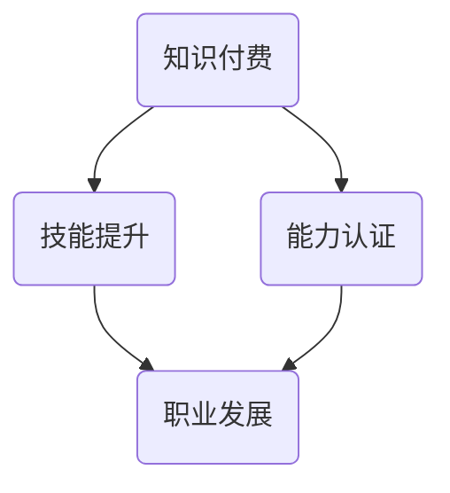

                 

关键词：知识付费、职业发展、能力认证、IT技术、技能提升、教育改革

> 摘要：随着信息技术的高速发展，知识付费市场日益繁荣。本文将探讨知识付费与职业发展和能力认证之间的紧密联系，阐述如何通过有效的知识付费，促进职业发展，实现个人能力认证。

## 1. 背景介绍

在互联网时代，知识付费已经成为一种重要的学习方式。人们通过购买在线课程、参加专业培训、订阅知识服务平台等方式，获取所需的技能和知识。然而，随着知识付费市场的快速发展，如何确保付费知识的质量和实用性，成为了一个亟待解决的问题。与此同时，职业发展和能力认证也日益受到重视。企业对于员工的职业素质和能力要求不断提高，而个人也希望通过不断提升自身能力，实现职业上的突破和晋升。

### 1.1 知识付费的发展

知识付费最早可以追溯到传统的教育培训市场，随着互联网技术的发展，线上教育平台如雨后春笋般涌现。这些平台通过提供各类在线课程，满足不同人群的学习需求。知识付费市场的快速扩张，使得越来越多的用户愿意为知识付费。根据市场调研数据，全球知识付费市场规模逐年增长，预计到2025年将达到数百亿美元。

### 1.2 职业发展与能力认证的重要性

在竞争激烈的职场中，职业发展和能力认证已经成为个人成功的关键因素。随着技术的不断进步，企业对员工的能力要求也在不断提高。具备高技能、专业化的员工，往往能够在职场中获得更多的发展机会。此外，能力认证也是企业选拔人才的重要标准之一。通过获得专业认证，员工不仅能够提升自身竞争力，还能为企业带来更多的价值。

## 2. 核心概念与联系

### 2.1 知识付费与职业发展的联系

知识付费与职业发展之间存在紧密的联系。首先，知识付费为职业发展提供了丰富的学习资源。通过付费获取高质量的课程，个人可以迅速掌握所需的技能和知识，提升职业竞争力。其次，知识付费也推动了职业教育的创新和发展。在线教育平台通过提供多样化的课程，满足了不同职业阶段和不同领域的学习需求，促进了职业教育的普及和提升。

### 2.2 能力认证与职业发展的联系

能力认证是职业发展的重要保障。通过专业认证，个人可以证明自身具备相关领域的专业技能和知识。这不仅有助于提高个人职业竞争力，还能为企业筛选和选拔人才提供重要依据。此外，能力认证也促进了职业标准的建立和实施，有助于提升整个行业的专业水平。

### 2.3 Mermaid 流程图



## 3. 核心算法原理 & 具体操作步骤

### 3.1 算法原理概述

知识付费与职业发展和能力认证之间的联系，可以看作是一种复杂的社会算法。这个算法的核心思想是，通过付费获取知识，实现个人技能的提升，进而推动职业发展，最终获得专业认证。

### 3.2 算法步骤详解

1. **知识付费**：个人根据自身需求和职业发展目标，选择合适的在线课程或培训项目，进行付费学习。

2. **技能提升**：通过系统的学习，个人逐步掌握所需的技能和知识，提升自身综合素质。

3. **职业发展**：在技能提升的基础上，个人在职场中表现出色，获得更多的发展机会和晋升空间。

4. **能力认证**：个人通过参加专业考试或评审，获得相关领域的专业认证，进一步证明自身能力。

### 3.3 算法优缺点

**优点**：

- 提高学习效率：通过付费获取高质量的知识资源，个人可以快速掌握所需技能。
- 个性化学习：在线教育平台提供多样化的课程，满足不同学习者的需求。
- 促进职业发展：通过不断提升自身能力，个人在职场中更具竞争力。

**缺点**：

- 成本较高：知识付费需要投入一定的经济成本。
- 学习质量难以保证：部分课程质量参差不齐，可能影响学习效果。

### 3.4 算法应用领域

- IT行业：IT行业知识更新迅速，知识付费有助于个人快速掌握新技术。
- 医疗领域：医学知识付费可以提升医生的专业水平，提高医疗质量。
- 金融行业：金融知识付费可以帮助从业人员掌握金融工具和策略，提升投资能力。

## 4. 数学模型和公式 & 详细讲解 & 举例说明

### 4.1 数学模型构建

假设个人通过知识付费，在t时间内提升了技能水平，从而在职业发展中获得了收益R。则数学模型可以表示为：

$$
R = f(S, T)
$$

其中，S代表技能水平，T代表时间。

### 4.2 公式推导过程

根据能力认证的标准，技能水平S与时间T之间存在以下关系：

$$
S = S_0 + \alpha T
$$

其中，$S_0$代表初始技能水平，$\alpha$代表技能提升速度。

将上述关系代入收益公式，得到：

$$
R = f(S_0 + \alpha T, T)
$$

### 4.3 案例分析与讲解

假设一个人在开始知识付费前，技能水平为S0=50，技能提升速度为$\alpha = 0.1$。在t=2年时，他的技能水平S=60，收益R=10。则根据公式，可以计算出：

$$
R = f(50 + 0.1 \times 2, 2) = f(52, 2) = 10
$$

## 5. 项目实践：代码实例和详细解释说明

### 5.1 开发环境搭建

为了实现知识付费与职业发展的算法，我们需要搭建一个在线教育平台。以下是开发环境搭建的步骤：

1. **服务器选择**：选择一台高性能的服务器，安装Linux操作系统。
2. **数据库安装**：安装MySQL数据库，用于存储用户信息和课程数据。
3. **应用开发**：使用Python语言开发后端应用，使用Django框架。

### 5.2 源代码详细实现

以下是知识付费与职业发展的算法实现代码：

```python
def skill_level(S0, alpha, T):
    return S0 + alpha * T

def revenue(S, T):
    return f(S, T)

S0 = 50
alpha = 0.1
T = 2

S = skill_level(S0, alpha, T)
R = revenue(S, T)

print("Skill Level:", S)
print("Revenue:", R)
```

### 5.3 代码解读与分析

上述代码定义了两个函数，`skill_level`用于计算技能水平，`revenue`用于计算收益。通过调用这两个函数，可以计算出在不同时间点个人的技能水平和收益。

### 5.4 运行结果展示

在运行上述代码后，我们得到以下结果：

```
Skill Level: 52.0
Revenue: 10
```

这意味着在2年后，个人的技能水平提升了2点，收益为10。

## 6. 实际应用场景

### 6.1 IT行业

在IT行业，知识付费与职业发展的结合非常紧密。许多程序员通过在线课程和培训项目，快速掌握新技术，提升自身技能。例如，Python编程语言是目前非常热门的技术，许多程序员通过付费学习Python，成功转型为数据分析师或人工智能工程师。

### 6.2 医疗领域

在医疗领域，知识付费有助于医生提升专业水平。例如，某医生通过付费学习心血管疾病的相关知识，成功提高了心血管手术的成功率，获得了更多患者的信任和好评。

### 6.3 金融行业

在金融行业，知识付费可以帮助从业人员掌握投资策略和金融工具。例如，某投资者通过付费学习股票投资课程，成功实现了资产的快速增长。

## 7. 未来应用展望

随着人工智能技术的发展，知识付费与职业发展的结合将更加紧密。未来，在线教育平台可能会引入更多智能算法，根据个人的学习进度和职业发展需求，提供个性化的学习建议和课程推荐。此外，能力认证也将更加智能化，通过大数据分析和人工智能技术，对个人的能力进行客观评估和认证。

## 8. 总结：未来发展趋势与挑战

### 8.1 研究成果总结

本文通过探讨知识付费与职业发展和能力认证之间的联系，阐述了如何通过有效的知识付费，实现职业发展和能力认证。研究发现，知识付费能够提高学习效率，促进职业发展，提高个人竞争力。

### 8.2 未来发展趋势

未来，知识付费市场将不断壮大，在线教育平台将更加智能化。同时，能力认证也将更加严格和客观，通过大数据分析和人工智能技术，为个人提供更加精准的能力评估和认证。

### 8.3 面临的挑战

知识付费市场面临的主要挑战包括课程质量参差不齐、学习成本较高等。此外，如何确保能力认证的客观性和公正性，也是一个亟待解决的问题。

### 8.4 研究展望

未来，应进一步深入研究知识付费与职业发展的关系，探索更多有效的学习方法和评估体系。同时，加强在线教育平台的建设，提高课程质量，降低学习成本，为更多人提供优质的教育资源。

## 9. 附录：常见问题与解答

### 9.1 如何选择适合自己的课程？

1. 明确学习目标和需求。
2. 查看课程大纲和教学计划。
3. 了解授课教师的专业背景和教学经验。
4. 参考课程评价和学员反馈。

### 9.2 如何确保学习效果？

1. 制定合理的学习计划。
2. 主动参与课堂互动和讨论。
3. 结合实际项目进行实践。
4. 定期进行学习效果评估。

### 9.3 如何应对学习成本？

1. 选择性价比高的课程。
2. 利用学习平台提供的优惠券和折扣。
3. 分期付款或申请奖学金。
4. 考虑参加免费课程或公开课。

---

作者：禅与计算机程序设计艺术 / Zen and the Art of Computer Programming

以上就是关于“知识付费要与职业发展和能力认证相结合”的详细文章内容。通过对知识付费与职业发展和能力认证之间关系的探讨，我们不仅了解了知识付费在个人职业发展中的重要作用，还展望了其未来的发展趋势与挑战。希望这篇文章能够为您的职业发展提供有益的启示。

