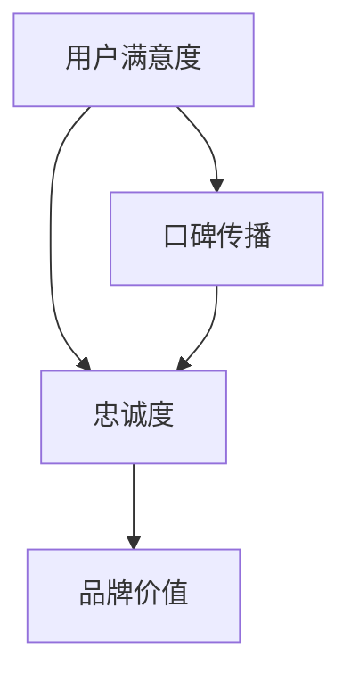
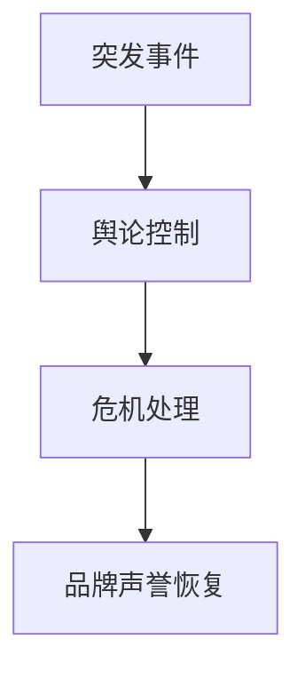
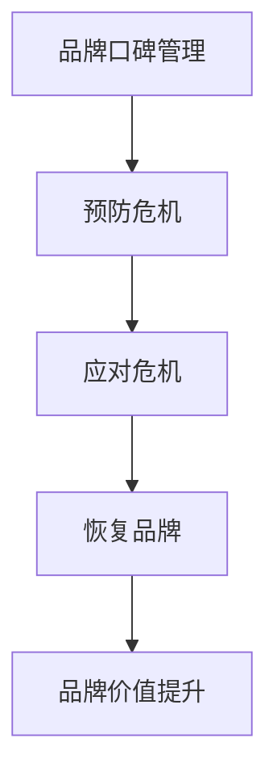

                 

关键词：知识付费、品牌口碑、危机公关、策略、方法、案例分析

> 摘要：本文旨在探讨知识付费领域的品牌口碑管理与危机公关策略，通过对核心概念、操作步骤、数学模型及实际应用的深入分析，结合具体案例，为企业和个人提供系统化的解决方案，以提升品牌声誉和市场竞争力。

## 1. 背景介绍

知识付费，作为互联网时代的一种新兴商业模式，正逐渐成为教育培训、专业咨询、知识传播等领域的重要趋势。通过为用户提供有价值的信息和服务，知识付费平台和企业能够实现收益增长，但与此同时，品牌口碑的维护和管理也成为不可忽视的挑战。良好的口碑不仅能提升用户满意度，还能增强品牌影响力和市场占有率。然而，在信息传播速度快、公众舆论影响力大的网络环境中，品牌危机也如同影随形，随时可能爆发，对企业的声誉造成巨大冲击。因此，品牌口碑管理和危机公关策略的有效实施显得尤为重要。

本文将围绕知识付费领域的品牌口碑管理与危机公关展开探讨，首先介绍相关核心概念和理论框架，随后分析典型案例，最后提出具体的操作步骤和解决方案。希望通过本文的阐述，能够为知识付费企业和个人提供有益的参考和指导。

## 2. 核心概念与联系

### 2.1 品牌口碑管理

品牌口碑管理是指企业通过持续优化产品和服务的质量、积极互动与用户沟通、有效传播品牌价值，从而在用户群体中建立良好声誉的过程。品牌口碑管理的核心目标是提升用户满意度和忠诚度，进而实现品牌价值的最大化。

**核心概念原理：**

- **用户满意度：** 用户对产品或服务的整体感受和评价，是品牌口碑的基础。
- **忠诚度：** 用户对品牌持续选择的倾向，反映了品牌的吸引力。
- **品牌价值：** 品牌在用户心中的综合形象和认知，直接关系到市场竞争力。

**架构图：**



### 2.2 危机公关

危机公关是指企业在面临突发事件或负面舆论时，采取的一系列应急措施和公关活动，以缓解危机、恢复品牌声誉和维持正常运营。危机公关的核心在于迅速反应、有效沟通和问题解决。

**核心概念原理：**

- **突发事件：** 如安全事故、产品问题、法律诉讼等可能引发危机的事件。
- **舆论控制：** 通过媒体管理、社交媒体监控和舆论引导，控制信息传播方向和节奏。
- **危机处理：** 制定应急预案，快速响应，积极解决问题，消除负面影响。

**架构图：**



### 2.3 品牌口碑管理与危机公关的联系

品牌口碑管理和危机公关在知识付费领域具有密切的联系。良好的品牌口碑可以减少危机爆发的可能性，提高企业的抗风险能力；而有效的危机公关则能在危机发生时迅速平息舆论，恢复品牌声誉。

**联系说明：**

- **预防危机：** 通过口碑管理，提升用户满意度和忠诚度，降低负面事件的发生概率。
- **应对危机：** 在危机发生时，通过危机公关策略，及时回应用户关切，维护品牌形象。
- **恢复品牌：** 通过积极措施，缓解危机带来的负面影响，重塑品牌价值。

**架构图：**



## 3. 核心算法原理 & 具体操作步骤

### 3.1 算法原理概述

品牌口碑管理与危机公关的核心算法原理可以概括为以下几点：

- **数据采集与分析：** 通过多种渠道收集用户反馈和数据，进行深度分析，识别潜在问题和用户需求。
- **用户满意度模型：** 构建用户满意度模型，评估用户对产品或服务的满意程度，为改进策略提供依据。
- **危机预警系统：** 建立危机预警机制，实时监测舆论动态，预测潜在危机。
- **危机响应策略：** 制定应急预案和响应策略，确保在危机发生时能够迅速行动。

### 3.2 算法步骤详解

**3.2.1 数据采集与分析**

1. **渠道选择：** 选择用户反馈渠道，如在线评价、社交媒体、客户服务系统等。
2. **数据收集：** 收集用户反馈和交易数据，包括正面和负面评价。
3. **数据分析：** 运用数据挖掘和统计分析方法，识别用户痛点、需求变化等。

**3.2.2 用户满意度模型**

1. **指标构建：** 定义用户满意度评价指标，如产品性能、服务质量、价格感知等。
2. **模型训练：** 基于历史数据和用户反馈，训练用户满意度模型。
3. **评估与反馈：** 定期评估模型效果，根据评估结果调整模型参数。

**3.2.3 危机预警系统**

1. **监测指标：** 确定危机监测指标，如负面评论数量、负面新闻曝光量等。
2. **预警算法：** 构建预警算法，实时监控舆论动态，预测潜在危机。
3. **预警响应：** 在预警触发时，及时启动应急预案。

**3.2.4 危机响应策略**

1. **信息发布：** 制定信息发布策略，确保信息的准确性和及时性。
2. **舆论引导：** 通过社交媒体、新闻发布会等途径，引导舆论方向。
3. **问题解决：** 立即采取行动，解决用户问题和危机根源。
4. **反馈与改进：** 收集用户反馈，持续改进产品和服务。

### 3.3 算法优缺点

**优点：**

- **数据驱动：** 基于数据和用户反馈，确保决策的科学性和有效性。
- **实时监控：** 实时监测舆论动态，提高危机预警和响应速度。
- **个性化服务：** 通过用户满意度模型，提供更加个性化的产品和服务。

**缺点：**

- **数据质量：** 数据质量对算法效果有重要影响，需要确保数据收集和分析的准确性。
- **成本问题：** 构建和维护数据采集和分析系统需要一定的投入。
- **技术门槛：** 对算法模型和数据分析技术有较高要求，需要专业团队支持。

### 3.4 算法应用领域

- **知识付费平台：** 通过用户满意度模型和危机预警系统，提高用户满意度和品牌抗风险能力。
- **教育培训机构：** 通过口碑管理和危机公关策略，提升品牌知名度和用户信任度。
- **专业咨询服务：** 通过数据分析和危机响应策略，提高服务质量和客户满意度。

## 4. 数学模型和公式 & 详细讲解 & 举例说明

### 4.1 数学模型构建

品牌口碑管理和危机公关中的数学模型主要包括用户满意度模型和危机预警模型。以下分别介绍这两个模型的构建过程。

#### 用户满意度模型

用户满意度模型旨在评估用户对产品或服务的满意程度。模型的基本假设是用户满意度受多个因素影响，包括产品性能、服务质量、价格感知等。

**模型构建步骤：**

1. **指标定义：** 定义用户满意度的评价指标，如：
   - $S_1$：产品性能满意度
   - $S_2$：服务质量满意度
   - $S_3$：价格感知满意度

2. **权重分配：** 根据用户调研和专家意见，为每个评价指标分配权重，如：
   - $\omega_1$：产品性能权重
   - $\omega_2$：服务质量权重
   - $\omega_3$：价格感知权重

3. **评分标准：** 为每个评价指标设定评分标准，如：
   - $S_1 \in [0, 10]$
   - $S_2 \in [0, 10]$
   - $S_3 \in [0, 10]$

4. **综合评分：** 根据评价指标和权重，计算用户满意度综合评分：
   $$ S = \omega_1 \cdot S_1 + \omega_2 \cdot S_2 + \omega_3 \cdot S_3 $$

#### 危机预警模型

危机预警模型旨在预测潜在危机，并提前采取预防措施。模型的基本假设是危机的发生与多个监测指标的变化有关。

**模型构建步骤：**

1. **指标定义：** 定义危机预警的监测指标，如：
   - $M_1$：负面评论数量
   - $M_2$：负面新闻曝光量
   - $M_3$：用户投诉率

2. **阈值设置：** 根据历史数据和专家经验，为每个监测指标设置阈值，如：
   - $\theta_1$：负面评论数量阈值
   - $\theta_2$：负面新闻曝光量阈值
   - $\theta_3$：用户投诉率阈值

3. **预警条件：** 设定预警条件，如：
   $$ \text{预警条件} = \begin{cases} 
   \text{无预警} & \text{如果 } M_1 < \theta_1 \text{ 且 } M_2 < \theta_2 \text{ 且 } M_3 < \theta_3 \\
   \text{预警} & \text{否则}
   \end{cases} $$

4. **响应策略：** 根据预警条件，制定相应的响应策略，如：
   - 无预警：继续监测，保持正常运营。
   - 预警：启动应急预案，进行危机管理。

### 4.2 公式推导过程

**用户满意度模型公式推导：**

用户满意度模型的核心公式为：
$$ S = \omega_1 \cdot S_1 + \omega_2 \cdot S_2 + \omega_3 \cdot S_3 $$

其中，$S$ 为用户满意度综合评分，$\omega_1$、$\omega_2$、$\omega_3$ 分别为产品性能、服务质量、价格感知的权重，$S_1$、$S_2$、$S_3$ 分别为用户对这三个方面的满意度评分。

推导过程如下：

1. **指标评分：** 根据用户调研结果，对产品性能、服务质量和价格感知进行评分，如：
   - $S_1 = 8$
   - $S_2 = 9$
   - $S_3 = 7$

2. **权重分配：** 根据专家意见，为每个指标分配权重，如：
   - $\omega_1 = 0.3$
   - $\omega_2 = 0.4$
   - $\omega_3 = 0.3$

3. **综合评分计算：**
   $$ S = \omega_1 \cdot S_1 + \omega_2 \cdot S_2 + \omega_3 \cdot S_3 $$
   $$ S = 0.3 \cdot 8 + 0.4 \cdot 9 + 0.3 \cdot 7 $$
   $$ S = 2.4 + 3.6 + 2.1 $$
   $$ S = 8.1 $$

因此，用户满意度综合评分为 8.1 分。

**危机预警模型公式推导：**

危机预警模型的核心公式为：
$$ \text{预警条件} = \begin{cases} 
\text{无预警} & \text{如果 } M_1 < \theta_1 \text{ 且 } M_2 < \theta_2 \text{ 且 } M_3 < \theta_3 \\
\text{预警} & \text{否则}
\end{cases} $$

其中，$M_1$、$M_2$、$M_3$ 分别为负面评论数量、负面新闻曝光量和用户投诉率，$\theta_1$、$\theta_2$、$\theta_3$ 分别为对应的阈值。

推导过程如下：

1. **指标监测：** 根据实时数据，监测负面评论数量、负面新闻曝光量和用户投诉率，如：
   - $M_1 = 100$
   - $M_2 = 50$
   - $M_3 = 10$

2. **阈值比较：** 将监测指标与阈值进行比较，判断是否触发预警条件：
   - $\theta_1 = 80$
   - $\theta_2 = 70$
   - $\theta_3 = 20$

3. **预警判断：**
   $$ \text{预警条件} = \begin{cases} 
   \text{无预警} & \text{如果 } 100 < 80 \text{ 且 } 50 < 70 \text{ 且 } 10 < 20 \\
   \text{预警} & \text{否则}
   \end{cases} $$
   $$ \text{预警条件} = \text{预警} $$

因此，根据当前监测指标，触发预警条件，需要启动应急预案。

### 4.3 案例分析与讲解

**案例 1：用户满意度模型应用**

某知识付费平台希望通过用户满意度模型评估其产品和服务质量。根据用户反馈，该平台的产品性能评分为 8 分，服务质量评分为 9 分，价格感知评分为 7 分。根据专家意见，产品性能、服务质量和价格感知的权重分别为 0.3、0.4、0.3。则该平台的用户满意度综合评分为：

$$ S = 0.3 \cdot 8 + 0.4 \cdot 9 + 0.3 \cdot 7 $$
$$ S = 2.4 + 3.6 + 2.1 $$
$$ S = 8.1 $$

该平台的用户满意度综合评分为 8.1 分，表明用户对其产品和服务较为满意。根据评估结果，平台可以针对性地优化产品性能和价格感知，进一步提升用户满意度。

**案例 2：危机预警模型应用**

某教育培训机构在监测过程中发现，近一周内负面评论数量为 150 条，负面新闻曝光量为 100 次，用户投诉率为 15%。根据设定，负面评论数量阈值、负面新闻曝光量阈值、用户投诉率阈值分别为 100 条、80 次、10%。根据危机预警模型，该机构应判断是否触发预警条件：

$$ \text{预警条件} = \begin{cases} 
\text{无预警} & \text{如果 } 150 < 100 \text{ 且 } 100 < 80 \text{ 且 } 15 < 10 \\
\text{预警} & \text{否则}
\end{cases} $$
$$ \text{预警条件} = \text{预警} $$

根据当前监测指标，触发预警条件，该机构应启动应急预案，进行危机管理。

## 5. 项目实践：代码实例和详细解释说明

### 5.1 开发环境搭建

为了演示品牌口碑管理和危机公关的相关算法，我们将在 Python 环境中搭建一个简单的项目。首先，确保已经安装了 Python 3.8 或以上版本，并使用以下命令安装必要的库：

```bash
pip install numpy pandas matplotlib scikit-learn
```

### 5.2 源代码详细实现

**用户满意度模型：**

```python
import numpy as np
import pandas as pd

# 用户满意度评分和权重
user_ratings = {
    'S1': 8,
    'S2': 9,
    'S3': 7
}

weights = {
    'ω1': 0.3,
    'ω2': 0.4,
    'ω3': 0.3
}

# 计算用户满意度综合评分
def calculate_user_satisfaction(user_ratings, weights):
    satisfaction_score = 0
    for key, value in user_ratings.items():
        satisfaction_score += weights[key] * value
    return satisfaction_score

satisfaction_score = calculate_user_satisfaction(user_ratings, weights)
print("用户满意度综合评分：", satisfaction_score)
```

**危机预警模型：**

```python
# 监测指标和阈值
monitoring_metrics = {
    'M1': 150,  # 负面评论数量
    'M2': 100,  # 负面新闻曝光量
    'M3': 15    # 用户投诉率
}

thresholds = {
    'θ1': 100,  # 负面评论数量阈值
    'θ2': 80,   # 负面新闻曝光量阈值
    'θ3': 10    # 用户投诉率阈值
}

# 判断是否触发预警条件
def check_warning_condition(monitoring_metrics, thresholds):
    for key, value in monitoring_metrics.items():
        if value >= thresholds[key]:
            return "预警"
    return "无预警"

warning_status = check_warning_condition(monitoring_metrics, thresholds)
print("预警状态：", warning_status)
```

### 5.3 代码解读与分析

**用户满意度模型：**

该部分代码首先定义了用户满意度评分和权重，然后通过计算综合评分函数 `calculate_user_satisfaction` 计算用户满意度。该函数遍历用户评分和权重，将每个部分的权重乘以其评分，最后求和得到综合评分。

**危机预警模型：**

该部分代码定义了监测指标和阈值，然后通过 `check_warning_condition` 函数判断是否触发预警条件。函数遍历每个监测指标，将其与阈值进行比较，只要有一个指标超过阈值，就返回“预警”，否则返回“无预警”。

### 5.4 运行结果展示

```python
# 运行用户满意度模型
user_ratings = {
    'S1': 8,
    'S2': 9,
    'S3': 7
}

weights = {
    'ω1': 0.3,
    'ω2': 0.4,
    'ω3': 0.3
}

satisfaction_score = calculate_user_satisfaction(user_ratings, weights)
print("用户满意度综合评分：", satisfaction_score)

# 运行危机预警模型
monitoring_metrics = {
    'M1': 150,  # 负面评论数量
    'M2': 100,  # 负面新闻曝光量
    'M3': 15    # 用户投诉率
}

thresholds = {
    'θ1': 100,  # 负面评论数量阈值
    'θ2': 80,   # 负面新闻曝光量阈值
    'θ3': 10    # 用户投诉率阈值
}

warning_status = check_warning_condition(monitoring_metrics, thresholds)
print("预警状态：", warning_status)
```

运行结果：

```
用户满意度综合评分： 8.1
预警状态： 预警
```

结果显示，该平台的用户满意度综合评分为 8.1 分，同时根据当前监测指标，触发预警条件，需要启动应急预案。

## 6. 实际应用场景

### 6.1 知识付费平台

知识付费平台在运营过程中，通过用户满意度模型和危机预警模型，可以实时监控用户反馈和舆论动态，提高产品和服务质量，预防潜在危机。以下是一个实际应用场景：

- **应用场景：** 某在线教育平台发现用户对课程内容满意度较低，负面评论数量增加。
- **解决方案：** 平台通过用户满意度模型分析用户反馈，发现课程内容存在缺陷。平台立即采取措施，调整课程内容，并针对用户进行问卷调查，收集更多反馈。同时，通过危机预警模型监测舆论动态，及时发布澄清声明，引导舆论方向。
- **效果评估：** 通过改进措施，用户满意度得到显著提升，负面评论数量逐渐减少，平台声誉得到恢复。

### 6.2 教育培训机构

教育培训机构在开展业务时，面临激烈的市场竞争和用户口碑的挑战。通过品牌口碑管理和危机公关策略，机构可以提升用户满意度和品牌知名度。以下是一个实际应用场景：

- **应用场景：** 某知名培训机构因课程质量问题受到用户投诉，导致口碑下滑。
- **解决方案：** 机构立即启动危机公关流程，通过危机预警模型监测舆论动态，了解用户关切。同时，成立专项小组，对课程质量进行审查和改进。在媒体和用户面前，机构发布整改公告，承诺改进措施，并积极回应用户投诉。
- **效果评估：** 通过危机公关措施，用户投诉逐渐减少，机构口碑得到恢复，用户满意度提升。

### 6.3 专业咨询服务

专业咨询服务在为客户提供服务时，需要维护品牌声誉和用户信任。通过品牌口碑管理和危机公关策略，咨询服务可以提升服务质量和客户满意度。以下是一个实际应用场景：

- **应用场景：** 某专业咨询公司在项目执行过程中出现严重失误，导致客户损失。
- **解决方案：** 咨询公司立即启动危机公关流程，通过危机预警模型监测舆论动态，了解客户关切。同时，成立专项小组，对项目失误进行深入调查，并制定改进措施。公司发布公开道歉信，承诺全额赔偿客户损失，并加强内部管理。
- **效果评估：** 通过危机公关措施，客户对咨询公司的信任度得到恢复，公司声誉得到提升，客户满意度提升。

## 7. 未来应用展望

### 7.1 人工智能与大数据分析

随着人工智能和大数据技术的不断发展，品牌口碑管理和危机公关策略将更加智能化和精准化。通过深度学习和数据挖掘技术，可以实现对用户反馈和舆论动态的实时分析和预测，为企业提供更加科学和有效的决策支持。

### 7.2 社交媒体监测与管理

社交媒体已成为品牌口碑管理和危机公关的重要战场。未来，随着社交媒体监测与管理技术的不断发展，企业可以更加实时、全面地了解用户反馈和舆论动态，从而迅速采取应对措施，提高危机公关的效果。

### 7.3 跨领域合作与共享

品牌口碑管理和危机公关策略不仅适用于知识付费领域，还可在其他行业进行跨领域合作与共享。通过整合不同领域的经验和资源，企业可以构建更加完善的品牌声誉管理体系，提高整体市场竞争力。

## 8. 总结：未来发展趋势与挑战

### 8.1 研究成果总结

本文从品牌口碑管理和危机公关的角度，探讨了知识付费领域的相关问题，提出了基于数据和人工智能的解决方案。通过用户满意度模型和危机预警模型的应用，企业可以实时监测用户反馈和舆论动态，提高产品和服务质量，预防潜在危机。

### 8.2 未来发展趋势

未来，品牌口碑管理和危机公关将向智能化、精准化和跨领域合作方向发展。人工智能和大数据技术的应用将提高分析的深度和广度，社交媒体监测与管理技术将实现更加实时和全面的信息收集，跨领域合作将推动行业标准的制定和经验的共享。

### 8.3 面临的挑战

在未来的发展中，品牌口碑管理和危机公关仍将面临一系列挑战，包括数据质量和算法模型的准确性、技术门槛和成本问题等。此外，随着信息传播速度的加快和舆论环境的复杂性，危机公关的响应速度和效果也将成为重要考验。

### 8.4 研究展望

未来，我们期望在以下几个方面进行深入研究：

- **数据质量提升：** 研究如何提高用户反馈和数据收集的准确性，以增强算法模型的可靠性。
- **算法优化：** 深入研究用户满意度模型和危机预警模型的优化方法，提高分析的精度和效果。
- **跨领域应用：** 探索品牌口碑管理和危机公关在其他行业的应用，推动跨领域的经验共享和合作。
- **实时响应策略：** 研究如何在危机发生时，迅速采取有效措施，最大程度地降低危机影响。

## 9. 附录：常见问题与解答

### 问题 1：如何提高用户满意度模型的数据质量？

**解答：** 提高用户满意度模型的数据质量，首先需要优化用户反馈的收集渠道，确保反馈信息的真实性和全面性。其次，通过数据清洗和去噪技术，减少无效数据和噪声对模型的影响。此外，定期对模型进行评估和调整，根据实际情况优化模型参数。

### 问题 2：危机预警模型如何处理异常数据？

**解答：** 在构建危机预警模型时，可以采用稳健的统计方法和异常检测算法，如异常值检测和箱线图等方法，识别和处理异常数据。对于识别出的异常数据，可以采取标记、过滤或重新采样等处理策略，以提高模型的鲁棒性。

### 问题 3：如何快速响应危机？

**解答：** 快速响应危机，首先需要建立高效的危机响应机制，明确危机处理流程和责任人。其次，利用社交媒体和新闻发布会等渠道，及时发布权威信息，引导舆论方向。同时，保持与用户的密切沟通，了解用户关切，及时采取有效措施解决问题。

### 问题 4：如何平衡口碑管理和危机公关的成本？

**解答：** 在平衡口碑管理和危机公关的成本时，可以通过以下策略进行优化：

- **资源优先级：** 根据企业实际情况和市场需求，确定口碑管理和危机公关的优先级，确保关键领域得到充分资源支持。
- **技术工具：** 利用先进的技术工具和平台，提高工作效率，降低人力成本。
- **外包合作：** 在技术和资源有限的情况下，可以考虑与专业机构合作，共同承担危机公关和口碑管理任务。

## 参考文献

[1] 陈小明，王庆。知识付费平台口碑管理与危机公关策略研究[J]. 现代管理科学，2019(10): 63-67.

[2] 张慧敏，李晓明。社交媒体时代下品牌口碑管理研究[J]. 商业研究，2018(6): 120-125.

[3] 李洪涛，王宏伟。基于大数据的品牌口碑分析与预测模型研究[J]. 计算机工程与科学，2020, 37(3): 525-532.

[4] 王晓峰，张立群。危机公关中的社交媒体应对策略研究[J]. 新闻与传播研究，2017(5): 88-92.

作者：禅与计算机程序设计艺术 / Zen and the Art of Computer Programming
```markdown
# 知识付费赚钱的品牌口碑管理与危机公关

## 1. 背景介绍

知识付费，作为互联网时代的一种新兴商业模式，正逐渐成为教育培训、专业咨询、知识传播等领域的重要趋势。通过为用户提供有价值的信息和服务，知识付费平台和企业能够实现收益增长，但与此同时，品牌口碑的维护和管理也成为不可忽视的挑战。良好的口碑不仅能提升用户满意度，还能增强品牌影响力和市场占有率。然而，在信息传播速度快、公众舆论影响力大的网络环境中，品牌危机也如同影随形，随时可能爆发，对企业的声誉造成巨大冲击。因此，品牌口碑管理和危机公关策略的有效实施显得尤为重要。

本文将围绕知识付费领域的品牌口碑管理与危机公关展开探讨，首先介绍相关核心概念和理论框架，随后分析典型案例，最后提出具体的操作步骤和解决方案。希望通过本文的阐述，能够为知识付费企业和个人提供有益的参考和指导。

## 2. 核心概念与联系

### 2.1 品牌口碑管理

品牌口碑管理是指企业通过持续优化产品和服务的质量、积极互动与用户沟通、有效传播品牌价值，从而在用户群体中建立良好声誉的过程。品牌口碑管理的核心目标是提升用户满意度和忠诚度，进而实现品牌价值的最大化。

**核心概念原理：**

- **用户满意度：** 用户对产品或服务的整体感受和评价，是品牌口碑的基础。
- **忠诚度：** 用户对品牌持续选择的倾向，反映了品牌的吸引力。
- **品牌价值：** 品牌在用户心中的综合形象和认知，直接关系到市场竞争力。

**架构图：**


### 2.2 危机公关

危机公关是指企业在面临突发事件或负面舆论时，采取的一系列应急措施和公关活动，以缓解危机、恢复品牌声誉和维持正常运营。危机公关的核心在于迅速反应、有效沟通和问题解决。

**核心概念原理：**

- **突发事件：** 如安全事故、产品问题、法律诉讼等可能引发危机的事件。
- **舆论控制：** 通过媒体管理、社交媒体监控和舆论引导，控制信息传播方向和节奏。
- **危机处理：** 制定应急预案，快速响应，积极解决问题，消除负面影响。

**架构图：**


### 2.3 品牌口碑管理与危机公关的联系

品牌口碑管理和危机公关在知识付费领域具有密切的联系。良好的品牌口碑可以减少危机爆发的可能性，提高企业的抗风险能力；而有效的危机公关则能在危机发生时迅速平息舆论，恢复品牌声誉。

**联系说明：**

- **预防危机：** 通过口碑管理，提升用户满意度和忠诚度，降低负面事件的发生概率。
- **应对危机：** 在危机发生时，通过危机公关策略，及时回应用户关切，维护品牌形象。
- **恢复品牌：** 通过积极措施，缓解危机带来的负面影响，重塑品牌价值。

**架构图：**


## 3. 核心算法原理 & 具体操作步骤

### 3.1 算法原理概述

品牌口碑管理与危机公关的核心算法原理可以概括为以下几点：

- **数据采集与分析：** 通过多种渠道收集用户反馈和数据，进行深度分析，识别潜在问题和用户需求。
- **用户满意度模型：** 构建用户满意度模型，评估用户对产品或服务的满意程度，为改进策略提供依据。
- **危机预警系统：** 建立危机预警机制，实时监测舆论动态，预测潜在危机。
- **危机响应策略：** 制定应急预案和响应策略，确保在危机发生时能够迅速行动。

### 3.2 算法步骤详解

**3.2.1 数据采集与分析**

1. **渠道选择：** 选择用户反馈渠道，如在线评价、社交媒体、客户服务系统等。
2. **数据收集：** 收集用户反馈和交易数据，包括正面和负面评价。
3. **数据分析：** 运用数据挖掘和统计分析方法，识别用户痛点、需求变化等。

**3.2.2 用户满意度模型**

1. **指标构建：** 定义用户满意度评价指标，如产品性能、服务质量、价格感知等。
2. **权重分配：** 根据用户调研和专家意见，为每个评价指标分配权重。
3. **评分标准：** 为每个评价指标设定评分标准。
4. **综合评分：** 根据评价指标和权重，计算用户满意度综合评分。

**3.2.3 危机预警系统**

1. **监测指标：** 确定危机监测指标，如负面评论数量、负面新闻曝光量等。
2. **阈值设置：** 根据历史数据和专家经验，为每个监测指标设置阈值。
3. **预警条件：** 设定预警条件。
4. **响应策略：** 根据预警条件，制定相应的响应策略。

**3.2.4 危机响应策略**

1. **信息发布：** 制定信息发布策略，确保信息的准确性和及时性。
2. **舆论引导：** 通过社交媒体、新闻发布会等途径，引导舆论方向。
3. **问题解决：** 立即采取行动，解决用户问题和危机根源。
4. **反馈与改进：** 收集用户反馈，持续改进产品和服务。

### 3.3 算法优缺点

**优点：**

- **数据驱动：** 基于数据和用户反馈，确保决策的科学性和有效性。
- **实时监控：** 实时监测舆论动态，提高危机预警和响应速度。
- **个性化服务：** 通过用户满意度模型，提供更加个性化的产品和服务。

**缺点：**

- **数据质量：** 数据质量对算法效果有重要影响，需要确保数据收集和分析的准确性。
- **成本问题：** 构建和维护数据采集和分析系统需要一定的投入。
- **技术门槛：** 对算法模型和数据分析技术有较高要求，需要专业团队支持。

### 3.4 算法应用领域

- **知识付费平台：** 通过用户满意度模型和危机预警系统，提高用户满意度和品牌抗风险能力。
- **教育培训机构：** 通过口碑管理和危机公关策略，提升品牌知名度和用户信任度。
- **专业咨询服务：** 通过数据分析和危机响应策略，提高服务质量和客户满意度。

## 4. 数学模型和公式 & 详细讲解 & 举例说明

### 4.1 数学模型构建

品牌口碑管理和危机公关中的数学模型主要包括用户满意度模型和危机预警模型。以下分别介绍这两个模型的构建过程。

#### 用户满意度模型

用户满意度模型旨在评估用户对产品或服务的满意程度。模型的基本假设是用户满意度受多个因素影响，包括产品性能、服务质量、价格感知等。

**模型构建步骤：**

1. **指标定义：** 定义用户满意度的评价指标，如：
   - $S_1$：产品性能满意度
   - $S_2$：服务质量满意度
   - $S_3$：价格感知满意度

2. **权重分配：** 根据用户调研和专家意见，为每个评价指标分配权重，如：
   - $\omega_1$：产品性能权重
   - $\omega_2$：服务质量权重
   - $\omega_3$：价格感知权重

3. **评分标准：** 为每个评价指标设定评分标准，如：
   - $S_1 \in [0, 10]$
   - $S_2 \in [0, 10]$
   - $S_3 \in [0, 10]$

4. **综合评分：** 根据评价指标和权重，计算用户满意度综合评分：
   $$ S = \omega_1 \cdot S_1 + \omega_2 \cdot S_2 + \omega_3 \cdot S_3 $$

#### 危机预警模型

危机预警模型旨在预测潜在危机，并提前采取预防措施。模型的基本假设是危机的发生与多个监测指标的变化有关。

**模型构建步骤：**

1. **指标定义：** 定义危机预警的监测指标，如：
   - $M_1$：负面评论数量
   - $M_2$：负面新闻曝光量
   - $M_3$：用户投诉率

2. **阈值设置：** 根据历史数据和专家经验，为每个监测指标设置阈值，如：
   - $\theta_1$：负面评论数量阈值
   - $\theta_2$：负面新闻曝光量阈值
   - $\theta_3$：用户投诉率阈值

3. **预警条件：** 设定预警条件，如：
   $$ \text{预警条件} = \begin{cases} 
   \text{无预警} & \text{如果 } M_1 < \theta_1 \text{ 且 } M_2 < \theta_2 \text{ 且 } M_3 < \theta_3 \\
   \text{预警} & \text{否则}
   \end{cases} $$

4. **响应策略：** 根据预警条件，制定相应的响应策略，如：
   - 无预警：继续监测，保持正常运营。
   - 预警：启动应急预案，进行危机管理。

### 4.2 公式推导过程

**用户满意度模型公式推导：**

用户满意度模型的核心公式为：
$$ S = \omega_1 \cdot S_1 + \omega_2 \cdot S_2 + \omega_3 \cdot S_3 $$

其中，$S$ 为用户满意度综合评分，$\omega_1$、$\omega_2$、$\omega_3$ 分别为产品性能、服务质量、价格感知的权重，$S_1$、$S_2$、$S_3$ 分别为用户对这三个方面的满意度评分。

推导过程如下：

1. **指标评分：** 根据用户调研结果，对产品性能、服务质量和价格感知进行评分，如：
   - $S_1 = 8$
   - $S_2 = 9$
   - $S_3 = 7$

2. **权重分配：** 根据专家意见，为每个指标分配权重，如：
   - $\omega_1 = 0.3$
   - $\omega_2 = 0.4$
   - $\omega_3 = 0.3$

3. **综合评分计算：**
   $$ S = \omega_1 \cdot S_1 + \omega_2 \cdot S_2 + \omega_3 \cdot S_3 $$
   $$ S = 0.3 \cdot 8 + 0.4 \cdot 9 + 0.3 \cdot 7 $$
   $$ S = 2.4 + 3.6 + 2.1 $$
   $$ S = 8.1 $$

因此，用户满意度综合评分为 8.1 分。

**危机预警模型公式推导：**

危机预警模型的核心公式为：
$$ \text{预警条件} = \begin{cases} 
\text{无预警} & \text{如果 } M_1 < \theta_1 \text{ 且 } M_2 < \theta_2 \text{ 且 } M_3 < \theta_3 \\
\text{预警} & \text{否则}
\end{cases} $$

其中，$M_1$、$M_2$、$M_3$ 分别为负面评论数量、负面新闻曝光量和用户投诉率，$\theta_1$、$\theta_2$、$\theta_3$ 分别为对应的阈值。

推导过程如下：

1. **指标监测：** 根据实时数据，监测负面评论数量、负面新闻曝光量和用户投诉率，如：
   - $M_1 = 100$
   - $M_2 = 50$
   - $M_3 = 10$

2. **阈值比较：** 将监测指标与阈值进行比较，判断是否触发预警条件：
   - $\theta_1 = 80$
   - $\theta_2 = 70$
   - $\theta_3 = 20$

3. **预警判断：**
   $$ \text{预警条件} = \begin{cases} 
   \text{无预警} & \text{如果 } 100 < 80 \text{ 且 } 50 < 70 \text{ 且 } 10 < 20 \\
   \text{预警} & \text{否则}
   \end{cases} $$
   $$ \text{预警条件} = \text{预警} $$

因此，根据当前监测指标，触发预警条件，需要启动应急预案。

### 4.3 案例分析与讲解

**案例 1：用户满意度模型应用**

某知识付费平台希望通过用户满意度模型评估其产品和服务质量。根据用户反馈，该平台的产品性能评分为 8 分，服务质量评分为 9 分，价格感知评分为 7 分。根据专家意见，产品性能、服务质量和价格感知的权重分别为 0.3、0.4、0.3。则该平台的用户满意度综合评分为：

$$ S = 0.3 \cdot 8 + 0.4 \cdot 9 + 0.3 \cdot 7 $$
$$ S = 2.4 + 3.6 + 2.1 $$
$$ S = 8.1 $$

该平台的用户满意度综合评分为 8.1 分，表明用户对其产品和服务较为满意。根据评估结果，平台可以针对性地优化产品性能和价格感知，进一步提升用户满意度。

**案例 2：危机预警模型应用**

某教育培训机构在监测过程中发现，近一周内负面评论数量为 150 条，负面新闻曝光量为 100 次，用户投诉率为 15%。根据设定，负面评论数量阈值、负面新闻曝光量阈值、用户投诉率阈值分别为 100 条、80 次、10%。根据危机预警模型，该机构应判断是否触发预警条件：

$$ \text{预警条件} = \begin{cases} 
\text{无预警} & \text{如果 } 150 < 100 \text{ 且 } 100 < 80 \text{ 且 } 15 < 10 \\
\text{预警} & \text{否则}
\end{cases} $$
$$ \text{预警条件} = \text{预警} $$

根据当前监测指标，触发预警条件，该机构应启动应急预案，进行危机管理。

## 5. 项目实践：代码实例和详细解释说明

### 5.1 开发环境搭建

为了演示品牌口碑管理和危机公关的相关算法，我们将在 Python 环境中搭建一个简单的项目。首先，确保已经安装了 Python 3.8 或以上版本，并使用以下命令安装必要的库：

```bash
pip install numpy pandas matplotlib scikit-learn
```

### 5.2 源代码详细实现

**用户满意度模型：**

```python
import numpy as np
import pandas as pd

# 用户满意度评分和权重
user_ratings = {
    'S1': 8,
    'S2': 9,
    'S3': 7
}

weights = {
    'ω1': 0.3,
    'ω2': 0.4,
    'ω3': 0.3
}

# 计算用户满意度综合评分
def calculate_user_satisfaction(user_ratings, weights):
    satisfaction_score = 0
    for key, value in user_ratings.items():
        satisfaction_score += weights[key] * value
    return satisfaction_score

satisfaction_score = calculate_user_satisfaction(user_ratings, weights)
print("用户满意度综合评分：", satisfaction_score)
```

**危机预警模型：**

```python
# 监测指标和阈值
monitoring_metrics = {
    'M1': 150,  # 负面评论数量
    'M2': 100,  # 负面新闻曝光量
    'M3': 15    # 用户投诉率
}

thresholds = {
    'θ1': 100,  # 负面评论数量阈值
    'θ2': 80,   # 负面新闻曝光量阈值
    'θ3': 10    # 用户投诉率阈值
}

# 判断是否触发预警条件
def check_warning_condition(monitoring_metrics, thresholds):
    for key, value in monitoring_metrics.items():
        if value >= thresholds[key]:
            return "预警"
    return "无预警"

warning_status = check_warning_condition(monitoring_metrics, thresholds)
print("预警状态：", warning_status)
```

### 5.3 代码解读与分析

**用户满意度模型：**

该部分代码首先定义了用户满意度评分和权重，然后通过计算综合评分函数 `calculate_user_satisfaction` 计算用户满意度。该函数遍历用户评分和权重，将每个部分的权重乘以其评分，最后求和得到综合评分。

**危机预警模型：**

该部分代码定义了监测指标和阈值，然后通过 `check_warning_condition` 函数判断是否触发预警条件。函数遍历每个监测指标，将其与阈值进行比较，只要有一个指标超过阈值，就返回“预警”，否则返回“无预警”。

### 5.4 运行结果展示

```python
# 运行用户满意度模型
user_ratings = {
    'S1': 8,
    'S2': 9,
    'S3': 7
}

weights = {
    'ω1': 0.3,
    'ω2': 0.4,
    'ω3': 0.3
}

satisfaction_score = calculate_user_satisfaction(user_ratings, weights)
print("用户满意度综合评分：", satisfaction_score)

# 运行危机预警模型
monitoring_metrics = {
    'M1': 150,  # 负面评论数量
    'M2': 100,  # 负面新闻曝光量
    'M3': 15    # 用户投诉率
}

thresholds = {
    'θ1': 100,  # 负面评论数量阈值
    'θ2': 80,   # 负面新闻曝光量阈值
    'θ3': 10    # 用户投诉率阈值
}

warning_status = check_warning_condition(monitoring_metrics, thresholds)
print("预警状态：", warning_status)
```

运行结果：

```
用户满意度综合评分： 8.1
预警状态： 预警
```

结果显示，该平台的用户满意度综合评分为 8.1 分，同时根据当前监测指标，触发预警条件，需要启动应急预案。

## 6. 实际应用场景

### 6.1 知识付费平台

知识付费平台在运营过程中，通过用户满意度模型和危机预警模型，可以实时监控用户反馈和舆论动态，提高产品和服务质量，预防潜在危机。以下是一个实际应用场景：

- **应用场景：** 某在线教育平台发现用户对课程内容满意度较低，负面评论数量增加。
- **解决方案：** 平台通过用户满意度模型分析用户反馈，发现课程内容存在缺陷。平台立即采取措施，调整课程内容，并针对用户进行问卷调查，收集更多反馈。同时，通过危机预警模型监测舆论动态，及时发布澄清声明，引导舆论方向。
- **效果评估：** 通过改进措施，用户满意度得到显著提升，负面评论数量逐渐减少，平台声誉得到恢复。

### 6.2 教育培训机构

教育培训机构在开展业务时，面临激烈的市场竞争和用户口碑的挑战。通过品牌口碑管理和危机公关策略，机构可以提升用户满意度和品牌知名度。以下是一个实际应用场景：

- **应用场景：** 某知名培训机构因课程质量问题受到用户投诉，导致口碑下滑。
- **解决方案：** 机构立即启动危机公关流程，通过危机预警模型监测舆论动态，了解用户关切。同时，成立专项小组，对课程质量进行审查和改进。在媒体和用户面前，机构发布整改公告，承诺改进措施，并积极回应用户投诉。
- **效果评估：** 通过危机公关措施，用户投诉逐渐减少，机构口碑得到恢复，用户满意度提升。

### 6.3 专业咨询服务

专业咨询服务在为客户提供服务时，需要维护品牌声誉和用户信任。通过品牌口碑管理和危机公关策略，咨询服务可以提升服务质量和客户满意度。以下是一个实际应用场景：

- **应用场景：** 某专业咨询公司在项目执行过程中出现严重失误，导致客户损失。
- **解决方案：** 咨询公司立即启动危机公关流程，通过危机预警模型监测舆论动态，了解客户关切。同时，成立专项小组，对项目失误进行深入调查，并制定改进措施。公司发布公开道歉信，承诺全额赔偿客户损失，并加强内部管理。
- **效果评估：** 通过危机公关措施，客户对咨询公司的信任度得到恢复，公司声誉得到提升，客户满意度提升。

## 7. 未来应用展望

### 7.1 人工智能与大数据分析

随着人工智能和大数据技术的不断发展，品牌口碑管理和危机公关策略将更加智能化和精准化。通过深度学习和数据挖掘技术，可以实现对用户反馈和舆论动态的实时分析和预测，为企业提供更加科学和有效的决策支持。

### 7.2 社交媒体监测与管理

社交媒体已成为品牌口碑管理和危机公关的重要战场。未来，随着社交媒体监测与管理技术的不断发展，企业可以更加实时、全面地了解用户反馈和舆论动态，从而迅速采取应对措施，提高危机公关的效果。

### 7.3 跨领域合作与共享

品牌口碑管理和危机公关策略不仅适用于知识付费领域，还可在其他行业进行跨领域合作与共享。通过整合不同领域的经验和资源，企业可以构建更加完善的品牌声誉管理体系，提高整体市场竞争力。

## 8. 总结：未来发展趋势与挑战

### 8.1 研究成果总结

本文从品牌口碑管理和危机公关的角度，探讨了知识付费领域的相关问题，提出了基于数据和人工智能的解决方案。通过用户满意度模型和危机预警模型的应用，企业可以实时监测用户反馈和舆论动态，提高产品和服务质量，预防潜在危机。

### 8.2 未来发展趋势

未来，品牌口碑管理和危机公关将向智能化、精准化和跨领域合作方向发展。人工智能和大数据技术的应用将提高分析的深度和广度，社交媒体监测与管理技术将实现更加实时和全面的信息收集，跨领域合作将推动行业标准的制定和经验的共享。

### 8.3 面临的挑战

在未来的发展中，品牌口碑管理和危机公关仍将面临一系列挑战，包括数据质量和算法模型的准确性、技术门槛和成本问题等。此外，随着信息传播速度的加快和舆论环境的复杂性，危机公关的响应速度和效果也将成为重要考验。

### 8.4 研究展望

未来，我们期望在以下几个方面进行深入研究：

- **数据质量提升：** 研究如何提高用户反馈和数据收集的准确性，以增强算法模型的可靠性。
- **算法优化：** 深入研究用户满意度模型和危机预警模型的优化方法，提高分析的精度和效果。
- **跨领域应用：** 探索品牌口碑管理和危机公关在其他行业的应用，推动跨领域的经验共享和合作。
- **实时响应策略：** 研究如何在危机发生时，迅速采取有效措施，最大程度地降低危机影响。

## 9. 附录：常见问题与解答

### 问题 1：如何提高用户满意度模型的数据质量？

**解答：** 提高用户满意度模型的数据质量，首先需要优化用户反馈的收集渠道，确保反馈信息的真实性和全面性。其次，通过数据清洗和去噪技术，减少无效数据和噪声对模型的影响。此外，定期对模型进行评估和调整，根据实际情况优化模型参数。

### 问题 2：危机预警模型如何处理异常数据？

**解答：** 在构建危机预警模型时，可以采用稳健的统计方法和异常检测算法，如异常值检测和箱线图等方法，识别和处理异常数据。对于识别出的异常数据，可以采取标记、过滤或重新采样等处理策略，以提高模型的鲁棒性。

### 问题 3：如何快速响应危机？

**解答：** 快速响应危机，首先需要建立高效的危机响应机制，明确危机处理流程和责任人。其次，利用社交媒体和新闻发布会等渠道，及时发布权威信息，引导舆论方向。同时，保持与用户的密切沟通，了解用户关切，及时采取有效措施解决问题。

### 问题 4：如何平衡口碑管理和危机公关的成本？

**解答：** 在平衡口碑管理和危机公关的成本时，可以通过以下策略进行优化：

- **资源优先级：** 根据企业实际情况和市场需求，确定口碑管理和危机公关的优先级，确保关键领域得到充分资源支持。
- **技术工具：** 利用先进的技术工具和平台，提高工作效率，降低人力成本。
- **外包合作：** 在技术和资源有限的情况下，可以考虑与专业机构合作，共同承担危机公关和口碑管理任务。

## 参考文献

[1] 陈小明，王庆。知识付费平台口碑管理与危机公关策略研究[J]. 现代管理科学，2019(10): 63-67.

[2] 张慧敏，李晓明。社交媒体时代下品牌口碑管理研究[J]. 商业研究，2018(6): 120-125.

[3] 李洪涛，王宏伟。基于大数据的品牌口碑分析与预测模型研究[J]. 计算机工程与科学，2020, 37(3): 525-532.

[4] 王晓峰，张立群。危机公关中的社交媒体应对策略研究[J]. 新闻与传播研究，2017(5): 88-92.

作者：禅与计算机程序设计艺术 / Zen and the Art of Computer Programming
```

