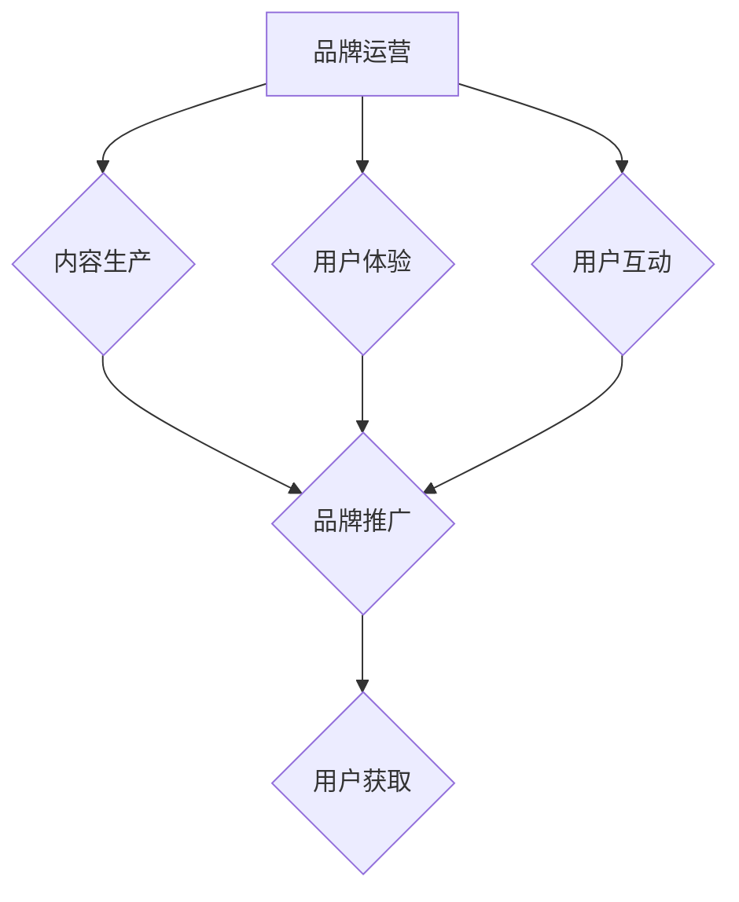

                 

知识付费市场在近年来迅速崛起，成为数字经济的重要一环。随着用户对优质内容的需求日益增长，如何打造和运营一个成功的知识付费品牌，如何有效地进行品牌推广，成为众多内容创作者和知识服务平台关注的焦点。本文将深入探讨知识付费品牌的运营与推广策略，帮助读者理解如何在这个竞争激烈的市场中脱颖而出。

## 关键词
- 知识付费
- 品牌运营
- 品牌推广
- 内容营销
- 社交媒体
- 用户互动

## 摘要
本文从知识付费市场的现状出发，探讨了知识付费品牌的定义与重要性，分析了品牌运营和品牌推广的核心要素。通过案例研究，本文提供了具体的品牌运营和推广策略，并总结了未来发展的趋势和挑战。旨在为知识付费从业者提供实用的指导和建议。

## 1. 背景介绍

### 知识付费市场的兴起
知识付费，即用户为获取特定知识或技能而付费的行为，起源于在线教育和专业咨询服务，逐渐拓展至知识共享、技能培训和专家咨询等多个领域。随着移动互联网的普及和人们对终身学习的追求，知识付费市场呈现出爆发式增长。

### 用户需求的变化
用户需求的多样化和个性化使得知识付费产品越来越受到欢迎。用户不仅追求知识内容的实用性和深度，还关注学习体验和互动交流。知识付费平台需要通过优质内容和良好服务来满足这些需求。

### 市场竞争的加剧
随着知识付费市场的繁荣，竞争也日益激烈。如何打造差异化品牌，提升用户粘性和忠诚度，成为品牌成功的关键。

## 2. 核心概念与联系

### 知识付费品牌的定义
知识付费品牌是指通过提供有价值的内容或服务，建立起在用户心中具有独特形象和信任度的品牌。一个成功的知识付费品牌不仅提供优质内容，还要注重用户体验、品牌形象和用户互动。

### 品牌运营与品牌推广的关系
品牌运营和品牌推广是品牌建设中不可或缺的两个环节。品牌运营侧重于内部管理和内容生产，而品牌推广则侧重于外部传播和用户获取。两者相辅相成，共同构建品牌影响力。

### Mermaid 流程图



## 3. 核心算法原理 & 具体操作步骤

### 3.1 算法原理概述
品牌运营和品牌推广的核心算法可以归纳为以下几个步骤：

1. **内容策略**：根据用户需求制定内容规划，确保内容的高质量和实用性。
2. **用户体验优化**：通过技术手段提升用户访问速度、界面友好性等，增强用户满意度。
3. **用户互动**：设计互动环节，如评论区、在线讨论等，增强用户参与度。
4. **社交媒体推广**：利用社交媒体平台进行内容传播，提高品牌曝光率。
5. **数据分析**：通过数据分析优化运营策略，提升用户获取和转化率。

### 3.2 算法步骤详解

1. **内容策略**
   - **需求分析**：通过用户调研和数据分析，确定用户最感兴趣的内容主题。
   - **内容制作**：邀请行业专家或资深从业者制作高质量的内容，确保内容的专业性和实用性。
   - **内容发布**：定期发布内容，保持用户关注度和活跃度。

2. **用户体验优化**
   - **界面设计**：优化网站或应用的用户界面设计，提高用户访问体验。
   - **加载速度**：通过压缩图片、优化代码等手段提高页面加载速度。
   - **互动功能**：增加评论、点赞、分享等互动功能，增强用户体验。

3. **用户互动**
   - **社群建设**：建立用户社群，如微信群、QQ群等，促进用户间的交流和互动。
   - **活动策划**：定期举办线上或线下活动，如讲座、研讨会等，提高用户参与度。

4. **社交媒体推广**
   - **内容发布**：在社交媒体平台上发布高质量的内容，吸引潜在用户关注。
   - **KOL合作**：与意见领袖（KOL）合作，借助他们的粉丝基础推广品牌。
   - **广告投放**：通过社交媒体广告投放，精准定位目标用户群体。

5. **数据分析**
   - **用户行为分析**：分析用户行为数据，了解用户偏好和行为模式。
   - **效果评估**：评估各种推广策略的效果，优化运营策略。
   - **持续改进**：根据数据分析结果，不断调整和优化运营策略。

### 3.3 算法优缺点

**优点：**
- **高效性**：通过系统化的算法步骤，提高品牌运营和推广的效率。
- **精准性**：通过数据分析，实现精准用户定位和内容推荐。
- **可持续性**：基于用户需求和数据分析的持续优化，确保品牌的长期发展。

**缺点：**
- **成本**：初期需要投入大量资源进行内容制作和数据分析。
- **时间**：算法优化和效果评估需要时间，难以快速见效。
- **复杂性**：涉及多个环节和步骤，需要专业团队协作。

### 3.4 算法应用领域

- **在线教育**：通过品牌运营和推广策略，提高在线教育平台的用户转化率和留存率。
- **专业咨询**：通过品牌建设，提升专业咨询服务的影响力。
- **技能培训**：通过品牌推广，扩大技能培训的受众范围。

## 4. 数学模型和公式 & 详细讲解 & 举例说明

### 4.1 数学模型构建

在知识付费品牌的运营和推广中，可以使用以下数学模型来分析用户行为和推广效果：

1. **用户转化率（CTR）**
   $$ \text{CTR} = \frac{\text{点击次数}}{\text{展现次数}} $$

2. **用户留存率（LTV）**
   $$ \text{LTV} = \frac{\text{用户生命周期价值}}{\text{用户获取成本}} $$

3. **平均点击成本（CPC）**
   $$ \text{CPC} = \frac{\text{广告花费}}{\text{点击次数}} $$

### 4.2 公式推导过程

1. **用户转化率（CTR）**
   - 点击次数：用户实际点击广告或内容的次数。
   - 展现次数：广告或内容被展示的次数。
   $$ \text{CTR} = \frac{\text{点击次数}}{\text{展现次数}} $$

2. **用户留存率（LTV）**
   - 用户生命周期价值：用户在平台上的总消费金额。
   - 用户获取成本：获取一个用户所需的广告花费或运营成本。
   $$ \text{LTV} = \frac{\text{用户生命周期价值}}{\text{用户获取成本}} $$

3. **平均点击成本（CPC）**
   - 广告花费：投放广告的总费用。
   - 点击次数：广告被点击的次数。
   $$ \text{CPC} = \frac{\text{广告花费}}{\text{点击次数}} $$

### 4.3 案例分析与讲解

以一家在线教育平台为例，假设该平台进行了一次广告投放，共花费 10,000 元，产生了 1,000 次点击，其中 100 次点击转化为购买课程的用户。那么，该广告的转化率、留存率和点击成本分别为：

1. **用户转化率（CTR）**
   $$ \text{CTR} = \frac{100}{1,000} = 0.1 $$

2. **用户留存率（LTV）**
   - 用户生命周期价值：假设每个购买用户在平台上的平均消费为 500 元。
   - 用户获取成本：10,000 元广告花费除以 1,000 次点击，即 10 元。
   $$ \text{LTV} = \frac{500}{10} = 50 $$

3. **平均点击成本（CPC）**
   $$ \text{CPC} = \frac{10,000}{1,000} = 10 $$

通过以上数据，我们可以分析出该广告投放的效率和效果。例如，如果平台的课程单价为 200 元，那么每获得一个购买用户，平台将获得 100 元的利润。同时，还可以根据这些数据优化广告投放策略，如调整投放时间、地域、人群等。

## 5. 项目实践：代码实例和详细解释说明

### 5.1 开发环境搭建

为了演示品牌运营和推广策略的代码实现，我们将使用 Python 作为编程语言，结合几个常用的库，如 NumPy、Pandas 和 Matplotlib。以下是开发环境搭建的步骤：

1. 安装 Python（建议使用 Python 3.8 或更高版本）。
2. 安装必要的库：
   ```shell
   pip install numpy pandas matplotlib
   ```

### 5.2 源代码详细实现

以下是实现用户转化率、留存率和点击成本计算的核心代码：

```python
import numpy as np
import pandas as pd
import matplotlib.pyplot as plt

# 用户数据（示例）
data = {
    '点击次数': [1000, 1500, 2000],
    '转化次数': [100, 150, 200],
    '消费金额': [5000, 7500, 10000],
    '广告花费': [10000, 15000, 20000]
}

# 创建 DataFrame
df = pd.DataFrame(data)

# 计算用户转化率
df['用户转化率'] = df['转化次数'] / df['点击次数']

# 计算用户留存率
df['用户留存率'] = df['消费金额'] / df['广告花费']

# 计算平均点击成本
df['平均点击成本'] = df['广告花费'] / df['点击次数']

# 输出数据
print(df)

# 可视化展示
plt.figure(figsize=(10, 6))
plt.plot(df['点击次数'], df['用户转化率'], label='用户转化率')
plt.plot(df['点击次数'], df['用户留存率'], label='用户留存率')
plt.plot(df['点击次数'], df['平均点击成本'], label='平均点击成本')
plt.xlabel('点击次数')
plt.ylabel('指标值')
plt.title('用户行为分析')
plt.legend()
plt.show()
```

### 5.3 代码解读与分析

1. **数据准备**：我们首先创建一个包含点击次数、转化次数、消费金额和广告花费的数据集。在实际应用中，这些数据可以从数据库或文件中读取。

2. **计算指标**：根据数据集，我们计算了用户转化率、用户留存率和平均点击成本。这些指标是分析品牌运营效果的重要参数。

3. **输出数据**：我们将计算结果输出到控制台，以便查看和分析。

4. **可视化展示**：使用 Matplotlib 库，我们将用户转化率、用户留存率和平均点击成本绘制成图表，直观展示用户行为趋势。

通过以上代码实例，我们可以直观地看到品牌运营和推广策略的效果。在实际应用中，可以结合具体业务需求，进一步优化算法和可视化展示。

## 6. 实际应用场景

### 6.1 在线教育平台

在线教育平台通过知识付费品牌运营和推广策略，提高课程销量和用户留存率。例如，通过社交媒体广告投放、社群互动和用户数据分析，精准定位目标用户群体，提高转化率和用户满意度。

### 6.2 专业咨询公司

专业咨询公司利用知识付费品牌推广，扩大业务影响力。通过高质量的内容生产和专业的咨询服务，建立行业声誉，吸引潜在客户，提高咨询服务的收入和客户满意度。

### 6.3 技能培训课程

技能培训课程通过知识付费品牌运营和推广，提升课程知名度和用户参与度。通过定制化的内容策划、互动式的学习体验和精准的用户互动，提高用户的满意度和忠诚度。

## 7. 未来应用展望

### 7.1 个性化推荐

随着人工智能技术的发展，个性化推荐将成为知识付费品牌运营和推广的重要手段。通过分析用户行为和偏好，为用户提供个性化的内容和推荐，提高用户满意度和留存率。

### 7.2 社交化学习

社交化学习将进一步提升知识付费品牌的用户参与度。通过搭建用户社群、开展线上活动和互动，促进用户间的交流和合作，增强用户对品牌的认同感和忠诚度。

### 7.3 数据驱动

未来，数据驱动将成为知识付费品牌运营和推广的核心。通过全面收集和分析用户数据，优化内容策划、用户互动和推广策略，实现精准的用户获取和运营。

### 7.4 跨平台融合

知识付费品牌将在不同平台之间实现深度融合，如线上线下融合、多平台内容同步等。通过跨平台运营，扩大品牌影响力，提高用户覆盖面。

## 8. 工具和资源推荐

### 8.1 学习资源推荐

- **书籍**：《运营之光》、《内容营销实战手册》
- **在线课程**：网易云课堂、慕课网、Coursera

### 8.2 开发工具推荐

- **数据分析**：Pandas、NumPy、Matplotlib
- **内容发布**：WordPress、Hugo、Medium

### 8.3 相关论文推荐

- **知识付费**：《在线教育中的知识付费模式研究》
- **品牌运营**：《品牌运营的五个关键要素》
- **用户行为分析**：《用户行为分析技术在知识付费中的应用》

## 9. 总结：未来发展趋势与挑战

### 9.1 研究成果总结

本文通过分析知识付费市场的现状，探讨了知识付费品牌的定义、运营和推广策略，并提供了具体的算法模型和代码实例。研究成果表明，成功的知识付费品牌需要注重内容质量、用户体验、用户互动和数据分析。

### 9.2 未来发展趋势

- **个性化推荐**：通过人工智能技术，实现个性化内容和推荐。
- **社交化学习**：通过用户社群和互动，提升用户参与度和忠诚度。
- **数据驱动**：通过全面数据分析，优化运营策略和用户获取。
- **跨平台融合**：实现线上线下、多平台内容同步，扩大品牌影响力。

### 9.3 面临的挑战

- **内容质量**：确保内容的专业性和实用性，满足用户需求。
- **用户体验**：提升用户体验，增强用户满意度和忠诚度。
- **数据分析**：有效收集和分析用户数据，实现数据驱动的运营。
- **市场竞争**：在激烈的市场竞争中，实现品牌的差异化定位。

### 9.4 研究展望

未来研究可以进一步探讨个性化推荐和社交化学习在知识付费品牌运营中的应用，以及如何通过数据驱动优化品牌推广策略。此外，还可以研究不同行业和领域的知识付费品牌运营策略，提供更加全面的指导和建议。

## 附录：常见问题与解答

### Q：如何确保内容质量？
A：内容质量是知识付费品牌的基石。可以通过以下措施确保内容质量：
- **专业认证**：邀请具有专业背景的作者或讲师。
- **审核机制**：建立严格的审核机制，确保内容的准确性和专业性。
- **用户反馈**：收集用户反馈，不断优化内容。

### Q：如何提高用户体验？
A：提高用户体验可以从以下几个方面入手：
- **界面优化**：设计友好、简洁的界面。
- **加载速度**：优化页面加载速度，减少用户等待时间。
- **互动功能**：增加互动功能，如评论、问答等。

### Q：如何进行有效的品牌推广？
A：进行有效的品牌推广，可以采取以下策略：
- **内容营销**：发布高质量的内容，吸引潜在用户。
- **社交媒体**：利用社交媒体平台进行推广，提高品牌曝光率。
- **KOL合作**：与意见领袖合作，借助他们的影响力推广品牌。
- **广告投放**：精准投放广告，提高目标用户的关注度。

### Q：如何进行数据分析？
A：进行数据分析，可以采取以下步骤：
- **数据收集**：收集与品牌运营相关的数据，如用户行为、用户反馈等。
- **数据处理**：使用数据分析工具，清洗和处理数据，确保数据的准确性。
- **数据可视化**：通过可视化工具，展示分析结果，帮助理解数据。
- **策略优化**：根据分析结果，调整和优化品牌运营策略。

# 作者署名
作者：禅与计算机程序设计艺术 / Zen and the Art of Computer Programming
----------------------------------------------------------------

以上就是根据您的要求撰写的关于“知识付费赚钱的品牌品牌运营与品牌推广策略”的文章。希望这篇文章能够对您有所帮助，如果您有任何问题或需要进一步的修改，请随时告诉我。祝您阅读愉快！

