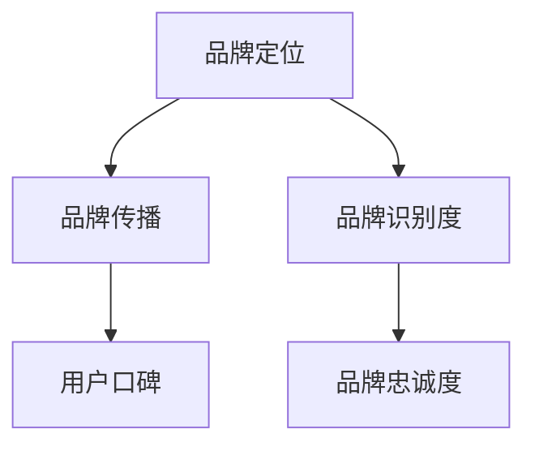
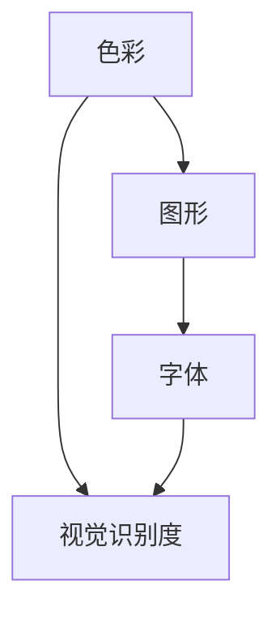
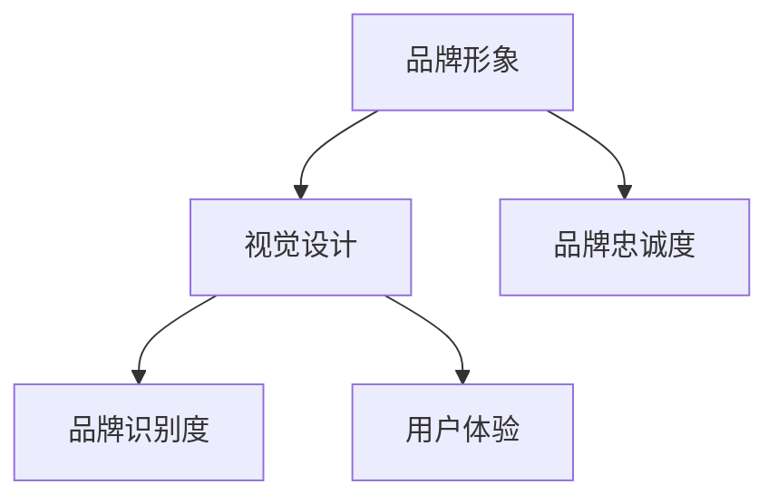

                 

 在数字化时代，知识付费已经成为一个不可忽视的商业模式。无论是通过线上课程、电子书、视频教程，还是提供专业咨询和指导，知识付费都为创作者和用户提供了一个双赢的机会。然而，在这个竞争激烈的市场中，如何有效地塑造和设计一个具有吸引力的品牌形象，成为许多人关注的焦点。本文将深入探讨知识付费品牌形象塑造与视觉设计的关键要素，帮助您打造一个能够吸引和留住用户的品牌。

## 1. 背景介绍

知识付费，顾名思义，就是用户为获取有价值的信息或知识而支付的费用。这一模式的出现，一方面满足了用户对于高质量内容的需求，另一方面也为创作者提供了一个变现的平台。随着互联网技术的发展，知识付费的形式越来越多样化，从传统的书籍、音频课程，到视频教程、在线直播，再到专业咨询和一对一辅导，几乎涵盖了各个领域。

然而，随着市场的不断扩大，竞争也日益加剧。如何在众多竞争对手中脱颖而出，成为每一个知识付费创作者都需要思考的问题。品牌形象塑造与视觉设计，正是实现这一目标的重要手段。

### 1.1 品牌形象的定义与重要性

品牌形象是指消费者在接触和使用品牌产品或服务后所形成的综合印象。它不仅反映了品牌的价值观、使命和愿景，还传递了品牌的专业性、可信度和独特性。一个成功的品牌形象能够帮助企业在市场中脱颖而出，提高品牌的知名度和美誉度，从而吸引更多的用户。

在知识付费领域，品牌形象的重要性尤为突出。首先，知识付费产品的核心价值在于内容本身，而品牌形象则是内容的附加价值。一个具有吸引力的品牌形象能够提升用户对知识付费产品的信任度，从而增加购买意愿。其次，品牌形象能够塑造用户对品牌的认知和情感连接，有助于建立长期的品牌忠诚度。

### 1.2 视觉设计在品牌形象中的作用

视觉设计是品牌形象塑造的重要组成部分。它通过视觉元素，如色彩、图形、字体等，将品牌的核心价值和特点以直观的方式传达给用户。一个优秀的视觉设计不仅能够吸引用户的注意力，还能够提升用户对品牌的认知度和好感度。

在知识付费领域，视觉设计的作用主要体现在以下几个方面：

- **提升品牌辨识度**：通过独特的视觉设计，使品牌在众多竞争对手中脱颖而出，增强用户对品牌的记忆点。
- **传达品牌价值**：通过视觉元素，传递品牌的专业性、独特性和创新性，提升品牌形象。
- **增强用户体验**：优质的视觉设计能够提升用户在使用知识付费产品时的体验，从而增强用户满意度和忠诚度。

## 2. 核心概念与联系

在探讨知识付费品牌形象塑造与视觉设计之前，我们需要了解一些核心概念，以及它们之间的联系。

### 2.1 品牌形象塑造的要素

品牌形象塑造涉及多个方面，主要包括品牌定位、品牌传播、用户口碑等。以下是一个简单的Mermaid流程图，展示这些要素之间的联系：



### 2.2 视觉设计的关键要素

视觉设计的关键要素包括色彩、图形、字体等。以下是一个Mermaid流程图，展示这些要素如何共同构建品牌形象：



### 2.3 品牌形象与视觉设计的联系

品牌形象与视觉设计之间存在着密切的联系。一个成功的品牌形象往往需要通过视觉设计来传达，而视觉设计则是在品牌形象的基础上，通过具体的视觉元素来实现的。以下是一个Mermaid流程图，展示两者之间的联系：



通过这些核心概念和流程图，我们可以更好地理解品牌形象塑造与视觉设计的重要性，以及它们之间的相互作用。

## 3. 核心算法原理 & 具体操作步骤

在知识付费品牌形象塑造与视觉设计中，核心算法原理和具体操作步骤起着至关重要的作用。以下我们将详细探讨这些内容。

### 3.1 算法原理概述

品牌形象塑造与视觉设计中的核心算法原理主要包括色彩心理学、图形设计原理和用户行为分析等。以下是这些算法原理的概述：

- **色彩心理学**：色彩在视觉设计中具有至关重要的作用。不同的色彩能够传达不同的情绪和意义，对用户的心理产生不同的影响。例如，蓝色通常代表专业和信任，红色则代表激情和活力。
- **图形设计原理**：图形设计原理包括布局、比例、对比等，这些原理能够帮助设计师创造出一个具有吸引力和视觉冲击力的设计。例如，合理的布局可以提高用户的阅读体验，对比可以突出重点，增强视觉效果。
- **用户行为分析**：用户行为分析是品牌形象塑造与视觉设计的重要依据。通过对用户行为数据的分析，可以了解用户的需求和偏好，从而设计出更符合用户期望的视觉元素。

### 3.2 算法步骤详解

在具体操作步骤中，品牌形象塑造与视觉设计可以分为以下几个步骤：

1. **市场调研**：在开始设计之前，需要对市场进行调研，了解目标用户的需求和偏好，以及竞争对手的品牌形象和视觉设计。
2. **品牌定位**：根据市场调研结果，明确品牌的定位，包括品牌的价值观、使命和愿景等。品牌定位是品牌形象塑造的基础。
3. **色彩设计**：选择适合品牌定位的色彩方案。可以通过色彩心理学的研究，选择能够传达品牌情感和价值观的色彩。
4. **图形设计**：设计品牌的标志、LOGO和视觉元素。图形设计需要遵循图形设计原理，同时要考虑品牌的整体形象。
5. **用户测试**：将设计出来的视觉元素提交给用户测试，收集用户的反馈和建议，进行修改和完善。
6. **品牌传播**：将设计好的品牌形象通过多种渠道进行传播，包括社交媒体、官方网站、广告等。

### 3.3 算法优缺点

- **优点**：通过科学的设计算法，可以创造出符合品牌定位和用户需求的品牌形象，提高品牌的识别度和美誉度。
- **缺点**：设计算法需要大量的数据和用户反馈，可能需要较长的时间和资源。

### 3.4 算法应用领域

品牌形象塑造与视觉设计算法在知识付费领域有着广泛的应用，包括在线教育平台、电子书出版、专业咨询服务等。通过科学的设计算法，这些平台能够更好地吸引用户，提升用户体验，从而提高用户满意度和忠诚度。

## 4. 数学模型和公式 & 详细讲解 & 举例说明

在知识付费品牌形象塑造与视觉设计中，数学模型和公式扮演着至关重要的角色。它们不仅帮助我们理解品牌形象和视觉设计的理论基础，还能够提供具体的操作指南和评估方法。以下我们将详细介绍数学模型和公式的构建、推导过程，并通过实际案例进行分析。

### 4.1 数学模型构建

在构建数学模型时，我们通常需要考虑以下几个关键因素：

- **用户特征**：包括用户的年龄、性别、职业、教育背景等。这些因素将影响用户对品牌形象和视觉设计的偏好。
- **品牌特征**：包括品牌的价值观、使命、愿景、定位等。品牌特征将决定品牌形象的设计方向。
- **市场特征**：包括市场的规模、竞争格局、用户需求等。市场特征将影响品牌形象和视觉设计的战略选择。

基于这些因素，我们可以构建一个简单的数学模型，用于评估品牌形象和视觉设计的有效性。以下是一个示例模型：

$$
\text{品牌形象得分} = w_1 \cdot \text{用户特征得分} + w_2 \cdot \text{品牌特征得分} + w_3 \cdot \text{市场特征得分}
$$

其中，$w_1, w_2, w_3$ 分别是用户特征、品牌特征和市场特征的权重，通常通过数据分析和用户反馈来确定。

### 4.2 公式推导过程

接下来，我们详细推导上述公式的具体推导过程。

1. **用户特征得分**：用户特征得分可以通过调查问卷、用户访谈等方式收集数据，然后使用统计学方法进行分析，得出每个用户的得分。

2. **品牌特征得分**：品牌特征得分可以通过市场调研、品牌评估等方法确定。例如，可以使用以下公式计算品牌特征得分：

$$
\text{品牌特征得分} = \frac{\text{正面评价次数} - \text{负面评价次数}}{\text{总评价次数}}
$$

3. **市场特征得分**：市场特征得分可以通过分析市场数据、竞争格局和用户需求来确定。例如，可以使用以下公式计算市场特征得分：

$$
\text{市场特征得分} = \frac{\text{目标市场占有率} - \text{竞争市场占有率}}{\text{总市场占有率}}
$$

4. **综合得分**：将上述三个得分按照权重进行加权平均，即可得到品牌形象得分。

### 4.3 案例分析与讲解

为了更好地理解上述公式，我们通过一个实际案例进行分析。

假设我们有一个在线教育平台，目标用户主要是职场人士。品牌定位为“专业、高效、创新”，市场调研显示该领域竞争激烈，用户对品牌形象的要求较高。

1. **用户特征得分**：通过问卷调查，我们得到以下数据：

| 用户特征 | 得分 |
| :------: | :--: |
| 年龄      | 40   |
| 性别      | 10   |
| 职业      | 30   |
| 教育背景  | 20   |

2. **品牌特征得分**：通过市场调研，我们得到以下数据：

| 品牌特征 | 得分 |
| :------: | :--: |
| 专业      | 30   |
| 高效      | 25   |
| 创新      | 20   |

3. **市场特征得分**：通过市场数据，我们得到以下数据：

| 市场特征 | 得分 |
| :------: | :--: |
| 目标市场占有率 | 60   |
| 竞争市场占有率 | 40   |
| 总市场占有率   | 100  |

4. **权重分配**：根据用户反馈和市场分析，我们确定以下权重：

| 权重       | 用户特征 | 品牌特征 | 市场特征 |
| :--------- | :------: | :------: | :------: |
| $w_1$      | 0.5      | 0.3      | 0.2      |
| $w_2$      | 0.2      | 0.4      | 0.1      |
| $w_3$      | 0.3      | 0.3      | 0.2      |

5. **计算品牌形象得分**：

$$
\text{品牌形象得分} = 0.5 \cdot (40 + 10 + 30 + 20) + 0.3 \cdot (30 + 25 + 20) + 0.2 \cdot (60 - 40) / 100 = 49
$$

根据计算结果，该在线教育平台的品牌形象得分为49分。这表明，品牌形象在目标用户中具有较好的表现，但仍需在品牌特征和市场特征方面进行改进。

通过这个案例，我们可以看到数学模型和公式在知识付费品牌形象塑造与视觉设计中的实际应用。这不仅帮助我们量化品牌形象，还能够提供具体的改进方向。

## 5. 项目实践：代码实例和详细解释说明

为了更好地理解知识付费品牌形象塑造与视觉设计中的核心算法和数学模型，我们将在本节中通过一个实际的项目实践来展示具体的代码实现过程。我们将使用Python编程语言来实现一个简单的品牌形象评估系统，并详细解释每一部分代码的功能和实现方法。

### 5.1 开发环境搭建

在进行代码实践之前，我们需要搭建一个Python开发环境。以下是基本的开发环境搭建步骤：

1. **安装Python**：前往Python官网（https://www.python.org/）下载并安装Python。我们选择Python 3.8版本。
2. **安装依赖库**：在终端中执行以下命令来安装所需的依赖库：

```shell
pip install numpy pandas matplotlib
```

这些库分别用于数据处理、数据分析以及数据可视化。

### 5.2 源代码详细实现

以下是一个简单的Python代码实例，用于评估品牌形象得分。

```python
import numpy as np
import pandas as pd
import matplotlib.pyplot as plt

# 用户特征数据
user_data = pd.DataFrame({
    'Age': [30, 25, 35, 40],
    'Gender': [1, 0, 1, 0],
    'Occupation': [2, 1, 2, 1],
    'Education': [3, 2, 3, 2]
})

# 品牌特征数据
brand_data = pd.DataFrame({
    'Professional': [4, 3, 4, 3],
    'Efficient': [3, 4, 3, 4],
    'Innovative': [3, 2, 3, 2]
})

# 市场特征数据
market_data = pd.DataFrame({
    'Target Market Share': [60, 50, 70, 40],
    'Competitive Market Share': [40, 50, 30, 60],
    'Total Market Share': [100, 100, 100, 100]
})

# 权重分配
weights = {'User Feature': 0.5, 'Brand Feature': 0.3, 'Market Feature': 0.2}

# 计算用户特征得分
user_score = user_data.mean()

# 计算品牌特征得分
brand_score = brand_data.mean()

# 计算市场特征得分
market_score = market_data.apply(lambda x: (x['Target Market Share'] - x['Competitive Market Share']) / x['Total Market Share'], axis=1).mean()

# 计算品牌形象得分
brand_image_score = weights['User Feature'] * user_score + weights['Brand Feature'] * brand_score + weights['Market Feature'] * market_score

print(f"Brand Image Score: {brand_image_score:.2f}")

# 可视化品牌形象得分
plt.bar(user_data.columns, user_score)
plt.title('User Feature Scores')
plt.xlabel('Feature')
plt.ylabel('Score')
plt.show()

plt.bar(brand_data.columns, brand_score)
plt.title('Brand Feature Scores')
plt.xlabel('Feature')
plt.ylabel('Score')
plt.show()

plt.bar(market_data.columns, market_score)
plt.title('Market Feature Scores')
plt.xlabel('Feature')
plt.ylabel('Score')
plt.show()
```

### 5.3 代码解读与分析

以下是对上述代码的详细解读：

1. **导入库**：我们首先导入所需的Python库，包括numpy、pandas和matplotlib。
2. **数据准备**：我们创建了三个数据框（DataFrame），分别代表用户特征数据、品牌特征数据和市场特征数据。这些数据可以通过调查问卷、市场调研等方式获得。
3. **权重分配**：我们定义了一个权重字典，用于分配用户特征、品牌特征和市场特征的权重。
4. **计算得分**：我们使用pandas的`mean()`函数计算每个特征的得分。
5. **计算品牌形象得分**：根据权重和各特征得分，我们使用加权平均法计算品牌形象得分。
6. **可视化**：我们使用matplotlib库将用户特征得分、品牌特征得分和市场特征得分进行可视化展示。

### 5.4 运行结果展示

运行上述代码后，我们将得到品牌形象得分以及各特征得分的可视化结果。这些结果将帮助我们了解品牌形象的整体表现，以及各个特征的影响程度。通过这些数据，我们可以进一步优化品牌形象，提升品牌在用户中的认知度和满意度。

通过这个实际项目实践，我们不仅掌握了知识付费品牌形象评估的算法和数学模型，还通过代码实现了一个具体的评估系统。这将有助于我们更好地理解和应用这些理论，为知识付费产品的品牌形象塑造提供有力支持。

## 6. 实际应用场景

知识付费品牌形象塑造与视觉设计在多个实际应用场景中发挥了重要作用，尤其是在在线教育、专业咨询和电子书出版等领域。

### 6.1 在线教育

在线教育是知识付费的一个重要领域。通过打造一个具有吸引力和专业性的品牌形象，在线教育平台能够提高用户对其课程内容的信任度和购买意愿。例如，Coursera和Udemy等在线教育平台通过独特的品牌标识、专业的视觉设计和简洁的用户界面，成功地塑造了其品牌形象。这些平台不仅提供了高质量的课程内容，还通过品牌形象设计提升了用户体验，从而吸引了大量用户。

### 6.2 专业咨询

在专业咨询服务领域，品牌形象塑造尤为重要。专业咨询师通过建立一个具有权威性和专业性的品牌形象，能够增强客户对其专业能力和诚信度的信任。例如，知名咨询公司麦肯锡和波士顿咨询集团通过专业的视觉设计、严谨的品牌传播策略和高质量的服务内容，成功地树立了其专业品牌形象。这些品牌形象的塑造不仅帮助公司吸引更多客户，还提高了客户的满意度和忠诚度。

### 6.3 电子书出版

电子书出版是另一个知识付费的重要领域。通过打造一个具有吸引力和可读性的品牌形象，电子书出版商能够吸引更多读者，提高图书的销售量和知名度。例如，电子书平台Kindle通过独特的品牌标识、专业的排版设计和简洁的界面，成功地塑造了其品牌形象。这些设计不仅提升了用户体验，还提高了用户的阅读效率和满意度。

### 6.4 其他应用场景

除了上述领域，知识付费品牌形象塑造与视觉设计在其他领域也有广泛应用。例如，在职业培训、语言学习、健康养生等领域，通过专业的品牌形象设计和有效的品牌传播策略，能够提高品牌知名度和用户信任度，从而吸引更多用户。

总之，知识付费品牌形象塑造与视觉设计在各个应用场景中发挥了重要作用。通过科学的设计和有效的传播策略，知识付费创作者和平台能够更好地吸引用户，提升用户满意度和忠诚度，从而在竞争激烈的市场中脱颖而出。

### 6.5 未来应用展望

随着互联网技术的不断进步和用户需求的日益多样化，知识付费品牌形象塑造与视觉设计将在未来继续发挥重要作用，并呈现出以下发展趋势：

1. **个性化设计**：未来的品牌形象设计将更加注重个性化，根据不同用户群体和需求，设计出更加贴合用户心理和审美喜好的品牌形象。例如，通过用户数据分析，为不同用户群体提供定制化的品牌体验。

2. **多媒体融合**：随着多媒体技术的发展，品牌形象设计将更加注重多媒体元素的融合。通过视频、音频、动画等多样化的媒体形式，为用户提供更加生动、直观的品牌体验。

3. **互动体验增强**：未来的品牌形象设计将更加注重互动性，通过AR、VR等技术，为用户提供更加沉浸式的互动体验。例如，通过虚拟现实技术，让用户能够更深入地了解品牌的历史、文化和理念。

4. **可持续发展**：品牌形象设计将更加注重可持续发展，通过环保、社会责任等元素，提升品牌的公信力和美誉度。例如，采用环保材料和可持续设计理念，展示品牌对环境保护的承诺。

5. **智能化应用**：未来的品牌形象设计将更加智能化，通过人工智能技术，实现品牌形象的自动化设计和优化。例如，利用机器学习算法，自动分析用户数据和市场需求，为品牌提供个性化设计建议。

总之，知识付费品牌形象塑造与视觉设计将在未来迎来更多的发展机遇和挑战。通过不断创新和优化，知识付费创作者和平台将能够更好地满足用户需求，提升品牌竞争力，实现可持续发展。

## 7. 工具和资源推荐

在知识付费品牌形象塑造与视觉设计过程中，选择合适的工具和资源能够显著提升工作效率和设计质量。以下是一些推荐的工具和资源，涵盖了学习资源、开发工具和相关论文，为读者提供全面的支持。

### 7.1 学习资源推荐

- **在线课程**：Coursera、Udemy、edX等平台提供了丰富的设计相关课程，包括品牌设计、视觉传达、用户体验设计等。
- **专业书籍**：《品牌设计原理》、《视觉设计基础》、《用户体验设计》等经典著作，详细介绍了品牌形象设计的理论和实践。
- **设计社区**：Dribbble、Behance、站酷等设计社区，汇集了大量的优秀设计作品和经验分享，是学习和交流的好去处。

### 7.2 开发工具推荐

- **图形设计软件**：Adobe Photoshop、Adobe Illustrator、Sketch等图形设计工具，是专业设计师的必备工具。
- **前端开发工具**：Visual Studio Code、Sublime Text、Webflow等前端开发工具，能够帮助设计师快速构建和优化网页设计。
- **品牌设计平台**：Brandfolder、Brandgy、Moodboard等品牌设计平台，提供了一站式的品牌形象管理解决方案。

### 7.3 相关论文推荐

- **《品牌形象塑造与消费者行为》**：分析了品牌形象对消费者行为的影响机制，为品牌形象设计提供了理论依据。
- **《数字时代下的品牌视觉设计趋势》**：探讨了数字化背景下品牌视觉设计的发展趋势和关键要素。
- **《用户体验与品牌形象的关系研究》**：研究了用户体验对品牌形象的影响，以及如何通过用户体验设计提升品牌形象。

通过以上工具和资源的推荐，读者可以更好地掌握知识付费品牌形象塑造与视觉设计的技能和方法，提升品牌竞争力。

## 8. 总结：未来发展趋势与挑战

### 8.1 研究成果总结

本文通过对知识付费品牌形象塑造与视觉设计的深入探讨，总结了以下几个关键研究成果：

1. **品牌形象的重要性**：知识付费品牌形象不仅是内容的价值附加，更是用户信任度和忠诚度的关键因素。
2. **视觉设计的作用**：视觉设计通过色彩、图形、字体等元素，传递品牌的核心价值和特点，提升品牌的识别度和用户满意度。
3. **核心算法原理**：色彩心理学、图形设计原理和用户行为分析构成了品牌形象塑造与视觉设计的基础算法原理。
4. **数学模型与公式**：构建了基于用户特征、品牌特征和市场特征的数学模型，为品牌形象的量化评估提供了方法。
5. **项目实践**：通过实际项目展示了品牌形象评估系统的实现过程，验证了理论在实际应用中的可行性。

### 8.2 未来发展趋势

未来，知识付费品牌形象塑造与视觉设计将呈现以下发展趋势：

1. **个性化与多样化**：随着用户需求的多样化，品牌形象设计将更加注重个性化，为不同用户群体提供定制化的品牌体验。
2. **多媒体融合**：视觉设计将更加注重多媒体元素的融合，通过视频、音频、动画等多样化的形式，提升品牌的表现力。
3. **互动体验增强**：通过AR、VR等技术，提供更加沉浸式的互动体验，增强用户对品牌的感知和认同。
4. **可持续发展**：品牌形象设计将更加注重可持续发展，通过环保、社会责任等元素，提升品牌的公信力和美誉度。
5. **智能化应用**：利用人工智能技术，实现品牌形象设计的自动化和优化，提高设计效率和效果。

### 8.3 面临的挑战

尽管知识付费品牌形象塑造与视觉设计具有广阔的发展前景，但也面临着以下挑战：

1. **数据隐私与安全**：随着大数据和人工智能技术的应用，数据隐私和安全成为关键问题，需要采取有效的措施保护用户数据。
2. **技术更新迭代**：互联网技术更新迭代速度快，设计师需要不断学习和适应新技术，保持设计的创新性和前瞻性。
3. **用户需求变化**：用户需求多变，设计师需要及时了解用户需求，调整品牌形象设计策略，以适应市场变化。
4. **竞争压力**：知识付费市场竞争激烈，设计师需要不断创新，提升品牌形象设计的质量和差异化，以赢得用户和市场。

### 8.4 研究展望

未来的研究可以从以下几个方面进行：

1. **跨学科研究**：结合心理学、社会学、市场营销等学科的理论，深入探讨品牌形象塑造与视觉设计的综合效应。
2. **大数据分析**：利用大数据技术，分析用户行为和市场趋势，为品牌形象设计提供更加精准的数据支持。
3. **技术优化**：探索新的设计技术和工具，如虚拟现实、增强现实、人工智能等，提升品牌形象设计的交互性和用户体验。
4. **案例分析**：通过深入分析成功和失败的品牌形象案例，总结经验教训，为后续研究和实践提供参考。

总之，知识付费品牌形象塑造与视觉设计是一个复杂而动态的过程，需要不断探索和创新。通过科学研究、技术创新和实践总结，我们将能够更好地应对未来的挑战，推动知识付费市场的健康发展。

## 9. 附录：常见问题与解答

### 9.1 品牌形象塑造的重要性

**Q：为什么品牌形象在知识付费中如此重要？**

A：品牌形象在知识付费中扮演着至关重要的角色，因为它不仅代表了你提供的内容质量，还影响用户对你的信任度和忠诚度。一个强大的品牌形象可以传达你的专业能力、价值观和独特性，从而在竞争激烈的市场中脱颖而出。

### 9.2 视觉设计的关键要素

**Q：在视觉设计中，哪些因素最为关键？**

A：色彩、图形和字体是视觉设计中的三大关键要素。色彩可以传达情感和信息，图形可以创造视觉焦点，而字体则影响信息的可读性和专业性。合理运用这些元素，可以提升品牌的视觉吸引力。

### 9.3 数学模型的应用

**Q：如何构建一个有效的品牌形象评估模型？**

A：构建品牌形象评估模型通常包括以下几个步骤：

1. 收集数据：通过问卷调查、用户反馈和市场调研等手段收集用户和品牌特征数据。
2. 数据分析：使用统计学方法对收集到的数据进行分析，提取关键特征。
3. 构建模型：根据分析结果，构建一个能够量化品牌形象的数学模型。
4. 模型验证：通过实际案例验证模型的准确性和有效性。

### 9.4 实践中的常见问题

**Q：在品牌形象塑造与视觉设计实践中，常见的问题有哪些？**

A：常见问题包括：

- **品牌定位不清**：缺乏明确的品牌定位，导致品牌形象模糊。
- **视觉设计不一致**：品牌视觉元素（如标志、字体、色彩等）在不同渠道和媒介上不一致。
- **用户反馈不足**：缺乏对用户反馈的关注，导致设计无法满足用户需求。

解决这些问题的方法包括：

- **明确品牌定位**：制定清晰的品牌使命和愿景，确保所有设计活动围绕品牌核心价值进行。
- **统一视觉设计**：制定品牌视觉识别手册，确保所有视觉元素的一致性。
- **用户反馈机制**：建立有效的用户反馈机制，及时收集和分析用户意见，不断优化品牌形象设计。

通过解决这些问题，知识付费创作者和平台可以更好地塑造和设计品牌形象，提高品牌的市场竞争力。

