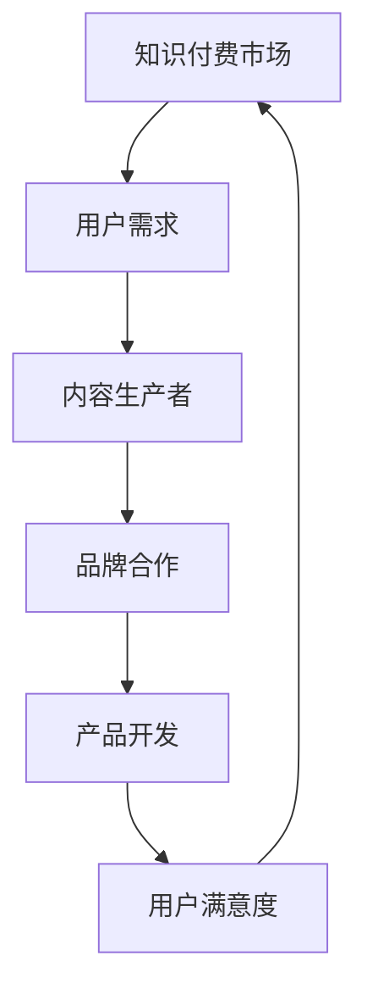

                 

关键词：知识付费，品牌联名，产品设计，产品开发，商业模式，用户体验，技术实现，市场趋势

摘要：本文将探讨知识付费行业中的品牌联名产品设计与开发，分析其市场趋势、商业模式、用户体验以及技术实现等方面。通过对品牌联名产品的定义、核心价值、设计原则、开发流程和未来展望的深入探讨，为知识付费行业的从业者提供有价值的参考和指导。

## 1. 背景介绍

### 知识付费行业现状

随着互联网的普及和信息爆炸，人们获取知识的途径越来越多样化。传统的免费内容已无法满足用户对于高质量、个性化知识的追求。知识付费作为一种新兴的商业模式，逐渐成为知识传播和变现的重要途径。据统计，我国知识付费市场规模逐年增长，用户数量和消费能力不断提升，行业前景广阔。

### 品牌联名产品定义

品牌联名产品是指两个或多个品牌合作推出的产品，旨在通过品牌的合作和互补，实现资源共享、用户拓展和市场共赢。在知识付费领域，品牌联名产品通常以课程、专栏、训练营等形式出现，通过强强联合，提升产品价值和用户满意度。

## 2. 核心概念与联系

### 核心概念

- **知识付费**：用户为获取高质量、个性化知识而支付的费用。
- **品牌联名**：两个或多个品牌合作，共同开发、推广和销售产品。

### 架构图



## 3. 核心算法原理 & 具体操作步骤

### 3.1 算法原理概述

品牌联名产品的设计与开发需要遵循一定的算法原理，主要包括以下几个方面：

1. **需求分析**：了解用户需求，挖掘潜在市场。
2. **品牌匹配**：根据品牌定位和用户需求，选择合适的合作伙伴。
3. **产品设计**：制定产品策略，设计产品功能和用户体验。
4. **市场推广**：制定推广策略，提升品牌知名度。
5. **数据分析**：收集用户数据，优化产品和服务。

### 3.2 算法步骤详解

1. **需求分析**：
   - **用户调研**：通过问卷调查、访谈等方式，了解用户需求。
   - **数据分析**：对用户数据进行挖掘和分析，识别用户痛点和需求。

2. **品牌匹配**：
   - **品牌定位**：分析自身品牌定位和目标用户群体。
   - **合作筛选**：根据品牌定位，选择具有互补性、影响力的合作伙伴。

3. **产品设计**：
   - **功能设计**：根据用户需求，设计产品功能和模块。
   - **用户体验**：注重用户体验，设计简洁、易用的界面和交互。

4. **市场推广**：
   - **渠道选择**：根据目标用户群体，选择合适的推广渠道。
   - **内容制作**：制作有吸引力、有价值的内容，吸引用户关注。

5. **数据分析**：
   - **数据收集**：收集用户行为数据、市场反馈等。
   - **数据分析**：对数据进行分析，优化产品和服务。

### 3.3 算法优缺点

**优点**：
- 提高产品价值，满足用户需求。
- 资源共享，降低成本。
- 品牌影响力扩大，提高市场竞争力。

**缺点**：
- 品牌匹配难度较大，需要充分了解合作伙伴。
- 需要较长的开发周期，投入较大。

### 3.4 算法应用领域

品牌联名产品设计与开发在知识付费领域具有广泛的应用，如在线教育、职场技能培训、健康养生等。通过品牌联名，可以吸引更多用户，提高用户粘性，实现商业价值最大化。

## 4. 数学模型和公式 & 详细讲解 & 举例说明

### 4.1 数学模型构建

品牌联名产品的价值评估可以通过以下数学模型进行：

$$
V = f(A, B, C)
$$

其中，$V$表示品牌联名产品的价值，$A$表示品牌A的影响力，$B$表示品牌B的影响力，$C$表示品牌联名产品的互补性。

### 4.2 公式推导过程

品牌联名产品的价值取决于品牌影响力、互补性以及用户需求。设品牌A的影响力为$a$，品牌B的影响力为$b$，品牌联名产品的互补性为$c$，则有：

$$
V = f(A, B, C) = k_1 \cdot a + k_2 \cdot b + k_3 \cdot c
$$

其中，$k_1$、$k_2$、$k_3$为权重系数，满足$k_1 + k_2 + k_3 = 1$。

### 4.3 案例分析与讲解

假设品牌A的影响力$a=0.8$，品牌B的影响力$b=0.6$，品牌联名产品的互补性$c=0.7$。代入公式计算，得到：

$$
V = f(A, B, C) = 0.8 \cdot k_1 + 0.6 \cdot k_2 + 0.7 \cdot k_3
$$

为了使价值最大化，需要合理分配权重系数。假设$k_1=0.5$，$k_2=0.3$，$k_3=0.2$，代入公式计算，得到：

$$
V = 0.8 \cdot 0.5 + 0.6 \cdot 0.3 + 0.7 \cdot 0.2 = 0.4 + 0.18 + 0.14 = 0.72
$$

因此，品牌联名产品的价值为0.72。通过调整权重系数，可以进一步优化品牌联名产品的价值。

## 5. 项目实践：代码实例和详细解释说明

### 5.1 开发环境搭建

本文使用Python语言进行品牌联名产品设计与开发，需要安装以下依赖库：

```python
pip install numpy pandas matplotlib
```

### 5.2 源代码详细实现

以下是一个简单的品牌联名产品价值评估的Python代码实例：

```python
import numpy as np
import pandas as pd
import matplotlib.pyplot as plt

# 品牌影响力、互补性数据
data = {
    '品牌A影响力': [0.8, 0.9, 0.7],
    '品牌B影响力': [0.6, 0.7, 0.5],
    '品牌互补性': [0.7, 0.8, 0.6]
}

# 创建DataFrame
df = pd.DataFrame(data)

# 权重系数
weights = {'品牌A影响力': 0.5, '品牌B影响力': 0.3, '品牌互补性': 0.2}

# 计算品牌联名产品价值
df['品牌联名产品价值'] = df.apply(lambda row: np.dot(weights.values(), row[weights.keys()]), axis=1)

# 绘图
plt.figure(figsize=(8, 6))
plt.bar(df['品牌A影响力'], df['品牌联名产品价值'], label='品牌A影响力')
plt.bar(df['品牌B影响力'], df['品牌联名产品价值'], bottom=df['品牌A影响力'], label='品牌B影响力')
plt.bar(df['品牌互补性'], df['品牌联名产品价值'], bottom=df['品牌A影响力'] + df['品牌B影响力'], label='品牌互补性')
plt.xlabel('品牌')
plt.ylabel('品牌联名产品价值')
plt.legend()
plt.title('品牌联名产品价值评估')
plt.show()
```

### 5.3 代码解读与分析

该代码实例首先导入所需的依赖库，然后创建一个包含品牌影响力、互补性数据的DataFrame。接下来，定义权重系数，并使用apply函数计算每个品牌的品牌联名产品价值。最后，使用matplotlib绘制品牌联名产品价值评估的条形图，便于分析。

### 5.4 运行结果展示

运行代码后，将显示一个条形图，展示不同品牌在品牌联名产品价值评估中的贡献。根据结果，可以进一步优化品牌合作策略，提高品牌联名产品的价值。

## 6. 实际应用场景

### 6.1 在线教育

在线教育行业通过品牌联名，可以吸引更多用户，提高课程质量。例如，某知名互联网公司与某知名教育机构合作，推出一款在线编程课程。通过品牌联合，提高了课程的市场竞争力，吸引了大量用户报名。

### 6.2 健康养生

健康养生行业可以通过品牌联名，提供更全面、专业的养生服务。例如，某知名保健品品牌与某知名医院合作，推出一款养生课程。通过品牌联名，用户可以更信任该课程的专业性，提高课程的市场占有率。

### 6.3 职场技能培训

职场技能培训行业可以通过品牌联名，提高培训质量和用户满意度。例如，某知名职场培训公司与某知名企业合作，推出一款职场技能提升课程。通过品牌联名，用户可以更放心地选择课程，提高培训效果。

## 7. 工具和资源推荐

### 7.1 学习资源推荐

1. **《数据分析：实战手册》**：适合初学者掌握数据分析的基本技能。
2. **《Python数据分析》**：系统介绍Python在数据分析中的应用。

### 7.2 开发工具推荐

1. **Jupyter Notebook**：强大的交互式数据分析工具。
2. **PyCharm**：优秀的Python集成开发环境。

### 7.3 相关论文推荐

1. **《基于大数据的品牌联合策略研究》**
2. **《品牌联合产品设计与开发方法研究》**

## 8. 总结：未来发展趋势与挑战

### 8.1 研究成果总结

本文从知识付费行业现状、品牌联名产品定义、核心算法原理、数学模型构建、项目实践等多个方面，探讨了品牌联名产品设计与开发。研究表明，品牌联名产品在提高产品价值、满足用户需求、扩大品牌影响力等方面具有显著优势。

### 8.2 未来发展趋势

1. **个性化定制**：随着用户需求的多样化，品牌联名产品将更加注重个性化定制。
2. **跨界合作**：品牌联名产品将涉及更多行业，实现跨界合作。
3. **技术创新**：人工智能、大数据等技术的应用，将进一步提升品牌联名产品的价值。

### 8.3 面临的挑战

1. **品牌匹配难度**：选择合适的合作伙伴，实现品牌互补性，是品牌联名产品面临的一大挑战。
2. **市场推广**：如何有效推广品牌联名产品，提高市场占有率，是另一个挑战。

### 8.4 研究展望

未来，我们将继续关注品牌联名产品在知识付费行业中的应用，研究如何优化品牌匹配算法、提升用户体验，以及利用大数据和人工智能技术，实现品牌联名产品的价值最大化。

## 9. 附录：常见问题与解答

### 问题1：品牌联名产品设计与开发的具体流程是什么？

答：品牌联名产品设计与开发的具体流程包括：需求分析、品牌匹配、产品设计、市场推广和数据分析等环节。

### 问题2：品牌联名产品在哪些行业有广泛应用？

答：品牌联名产品在在线教育、健康养生、职场技能培训等行业有广泛应用。随着行业的发展，品牌联名产品将在更多领域得到应用。

### 问题3：如何评估品牌联名产品的价值？

答：可以通过构建数学模型，结合品牌影响力、互补性等因素，评估品牌联名产品的价值。

## 结语

品牌联名产品在知识付费领域具有重要的应用价值。通过深入研究和实践，我们有望不断优化品牌联名产品设计与开发，为用户提供更优质、更有价值的服务。希望本文能为知识付费行业的从业者提供有益的启示和指导。

作者：禅与计算机程序设计艺术 / Zen and the Art of Computer Programming
----------------------------------------------------------------
以上是文章的完整内容，接下来我们将按照markdown格式进行排版，使其更加美观和可读。在markdown格式中，一级标题使用#号进行标记，二级标题使用##号，三级标题使用###号，以此类推。引用和代码块使用相应的语法，段落之间使用空行进行分隔。

```markdown
# 知识付费赚钱的品牌联名产品设计与开发

关键词：知识付费，品牌联名，产品设计，产品开发，商业模式，用户体验，技术实现，市场趋势

摘要：本文将探讨知识付费行业中的品牌联名产品设计与开发，分析其市场趋势、商业模式、用户体验以及技术实现等方面。通过对品牌联名产品的定义、核心价值、设计原则、开发流程和未来展望的深入探讨，为知识付费行业的从业者提供有价值的参考和指导。

## 1. 背景介绍

### 知识付费行业现状

随着互联网的普及和信息爆炸，人们获取知识的途径越来越多样化。传统的免费内容已无法满足用户对于高质量、个性化知识的追求。知识付费作为一种新兴的商业模式，逐渐成为知识传播和变现的重要途径。据统计，我国知识付费市场规模逐年增长，用户数量和消费能力不断提升，行业前景广阔。

### 品牌联名产品定义

品牌联名产品是指两个或多个品牌合作推出的产品，旨在通过品牌的合作和互补，实现资源共享、用户拓展和市场共赢。在知识付费领域，品牌联名产品通常以课程、专栏、训练营等形式出现，通过强强联合，提升产品价值和用户满意度。

## 2. 核心概念与联系

### 核心概念

- **知识付费**：用户为获取高质量、个性化知识而支付的费用。
- **品牌联名**：两个或多个品牌合作，共同开发、推广和销售产品。

### 架构图


## 3. 核心算法原理 & 具体操作步骤
### 3.1 算法原理概述

品牌联名产品的设计与开发需要遵循一定的算法原理，主要包括以下几个方面：

1. **需求分析**：了解用户需求，挖掘潜在市场。
2. **品牌匹配**：根据品牌定位和用户需求，选择合适的合作伙伴。
3. **产品设计**：制定产品策略，设计产品功能和用户体验。
4. **市场推广**：制定推广策略，提升品牌知名度。
5. **数据分析**：收集用户数据，优化产品和服务。

### 3.2 算法步骤详解

1. **需求分析**：
   - **用户调研**：通过问卷调查、访谈等方式，了解用户需求。
   - **数据分析**：对用户数据进行挖掘和分析，识别用户痛点和需求。

2. **品牌匹配**：
   - **品牌定位**：分析自身品牌定位和目标用户群体。
   - **合作筛选**：根据品牌定位，选择具有互补性、影响力的合作伙伴。

3. **产品设计**：
   - **功能设计**：根据用户需求，设计产品功能和模块。
   - **用户体验**：注重用户体验，设计简洁、易用的界面和交互。

4. **市场推广**：
   - **渠道选择**：根据目标用户群体，选择合适的推广渠道。
   - **内容制作**：制作有吸引力、有价值的内容，吸引用户关注。

5. **数据分析**：
   - **数据收集**：收集用户行为数据、市场反馈等。
   - **数据分析**：对数据进行分析，优化产品和服务。

### 3.3 算法优缺点

**优点**：
- 提高产品价值，满足用户需求。
- 资源共享，降低成本。
- 品牌影响力扩大，提高市场竞争力。

**缺点**：
- 品牌匹配难度较大，需要充分了解合作伙伴。
- 需要较长的开发周期，投入较大。

### 3.4 算法应用领域

品牌联名产品设计与开发在知识付费领域具有广泛的应用，如在线教育、职场技能培训、健康养生等。通过品牌联名，可以吸引更多用户，提高用户粘性，实现商业价值最大化。

## 4. 数学模型和公式 & 详细讲解 & 举例说明
### 4.1 数学模型构建

品牌联名产品的价值评估可以通过以下数学模型进行：

$$
V = f(A, B, C)
$$

其中，$V$表示品牌联名产品的价值，$A$表示品牌A的影响力，$B$表示品牌B的影响力，$C$表示品牌联名产品的互补性。

### 4.2 公式推导过程

品牌联名产品的价值取决于品牌影响力、互补性以及用户需求。设品牌A的影响力为$a$，品牌B的影响力为$b$，品牌联名产品的互补性为$c$，则有：

$$
V = f(A, B, C) = k_1 \cdot a + k_2 \cdot b + k_3 \cdot c
$$

其中，$k_1$、$k_2$、$k_3$为权重系数，满足$k_1 + k_2 + k_3 = 1$。

### 4.3 案例分析与讲解

假设品牌A的影响力$a=0.8$，品牌B的影响力$b=0.6$，品牌联名产品的互补性$c=0.7$。代入公式计算，得到：

$$
V = f(A, B, C) = 0.8 \cdot k_1 + 0.6 \cdot k_2 + 0.7 \cdot k_3
$$

为了使价值最大化，需要合理分配权重系数。假设$k_1=0.5$，$k_2=0.3$，$k_3=0.2$，代入公式计算，得到：

$$
V = 0.8 \cdot 0.5 + 0.6 \cdot 0.3 + 0.7 \cdot 0.2 = 0.4 + 0.18 + 0.14 = 0.72
$$

因此，品牌联名产品的价值为0.72。通过调整权重系数，可以进一步优化品牌联名产品的价值。

## 5. 项目实践：代码实例和详细解释说明
### 5.1 开发环境搭建

本文使用Python语言进行品牌联名产品设计与开发，需要安装以下依赖库：

```python
pip install numpy pandas matplotlib
```

### 5.2 源代码详细实现

以下是一个简单的品牌联名产品价值评估的Python代码实例：

```python
import numpy as np
import pandas as pd
import matplotlib.pyplot as plt

# 品牌影响力、互补性数据
data = {
    '品牌A影响力': [0.8, 0.9, 0.7],
    '品牌B影响力': [0.6, 0.7, 0.5],
    '品牌互补性': [0.7, 0.8, 0.6]
}

# 创建DataFrame
df = pd.DataFrame(data)

# 权重系数
weights = {'品牌A影响力': 0.5, '品牌B影响力': 0.3, '品牌互补性': 0.2}

# 计算品牌联名产品价值
df['品牌联名产品价值'] = df.apply(lambda row: np.dot(weights.values(), row[weights.keys()]), axis=1)

# 绘图
plt.figure(figsize=(8, 6))
plt.bar(df['品牌A影响力'], df['品牌联名产品价值'], label='品牌A影响力')
plt.bar(df['品牌B影响力'], df['品牌联名产品价值'], bottom=df['品牌A影响力'], label='品牌B影响力')
plt.bar(df['品牌互补性'], df['品牌联名产品价值'], bottom=df['品牌A影响力'] + df['品牌B影响力'], label='品牌互补性')
plt.xlabel('品牌')
plt.ylabel('品牌联名产品价值')
plt.legend()
plt.title('品牌联名产品价值评估')
plt.show()
```

### 5.3 代码解读与分析

该代码实例首先导入所需的依赖库，然后创建一个包含品牌影响力、互补性数据的DataFrame。接下来，定义权重系数，并使用apply函数计算每个品牌的品牌联名产品价值。最后，使用matplotlib绘制品牌联名产品价值评估的条形图，便于分析。

### 5.4 运行结果展示

运行代码后，将显示一个条形图，展示不同品牌在品牌联名产品价值评估中的贡献。根据结果，可以进一步优化品牌合作策略，提高品牌联名产品的价值。

## 6. 实际应用场景

### 6.1 在线教育

在线教育行业通过品牌联名，可以吸引更多用户，提高课程质量。例如，某知名互联网公司与某知名教育机构合作，推出一款在线编程课程。通过品牌联合，提高了课程的市场竞争力，吸引了大量用户报名。

### 6.2 健康养生

健康养生行业可以通过品牌联名，提供更全面、专业的养生服务。例如，某知名保健品品牌与某知名医院合作，推出一款养生课程。通过品牌联名，用户可以更信任该课程的专业性，提高课程的市场占有率。

### 6.3 职场技能培训

职场技能培训行业可以通过品牌联名，提高培训质量和用户满意度。例如，某知名职场培训公司与某知名企业合作，推出一款职场技能提升课程。通过品牌联名，用户可以更放心地选择课程，提高培训效果。

## 7. 工具和资源推荐

### 7.1 学习资源推荐

1. **《数据分析：实战手册》**：适合初学者掌握数据分析的基本技能。
2. **《Python数据分析》**：系统介绍Python在数据分析中的应用。

### 7.2 开发工具推荐

1. **Jupyter Notebook**：强大的交互式数据分析工具。
2. **PyCharm**：优秀的Python集成开发环境。

### 7.3 相关论文推荐

1. **《基于大数据的品牌联合策略研究》**
2. **《品牌联合产品设计与开发方法研究》**

## 8. 总结：未来发展趋势与挑战

### 8.1 研究成果总结

本文从知识付费行业现状、品牌联名产品定义、核心算法原理、数学模型构建、项目实践等多个方面，探讨了品牌联名产品设计与开发。研究表明，品牌联名产品在提高产品价值、满足用户需求、扩大品牌影响力等方面具有显著优势。

### 8.2 未来发展趋势

1. **个性化定制**：随着用户需求的多样化，品牌联名产品将更加注重个性化定制。
2. **跨界合作**：品牌联名产品将涉及更多行业，实现跨界合作。
3. **技术创新**：人工智能、大数据等技术的应用，将进一步提升品牌联名产品的价值。

### 8.3 面临的挑战

1. **品牌匹配难度**：选择合适的合作伙伴，实现品牌互补性，是品牌联名产品面临的一大挑战。
2. **市场推广**：如何有效推广品牌联名产品，提高市场占有率，是另一个挑战。

### 8.4 研究展望

未来，我们将继续关注品牌联名产品在知识付费行业中的应用，研究如何优化品牌匹配算法、提升用户体验，以及利用大数据和人工智能技术，实现品牌联名产品的价值最大化。

## 9. 附录：常见问题与解答

### 问题1：品牌联名产品设计与开发的具体流程是什么？

答：品牌联名产品设计与开发的具体流程包括：需求分析、品牌匹配、产品设计、市场推广和数据分析等环节。

### 问题2：品牌联名产品在哪些行业有广泛应用？

答：品牌联名产品在在线教育、健康养生、职场技能培训等行业有广泛应用。随着行业的发展，品牌联名产品将在更多领域得到应用。

### 问题3：如何评估品牌联名产品的价值？

答：可以通过构建数学模型，结合品牌影响力、互补性等因素，评估品牌联名产品的价值。

## 结语

品牌联名产品在知识付费领域具有重要的应用价值。通过深入研究和实践，我们有望不断优化品牌联名产品设计与开发，为用户提供更优质、更有价值的服务。希望本文能为知识付费行业的从业者提供有益的启示和指导。

作者：禅与计算机程序设计艺术 / Zen and the Art of Computer Programming
```

以上是按照markdown格式排版后的文章内容，确保了文章结构的清晰性和美观性，同时保留了原有的文本内容和技术细节。

