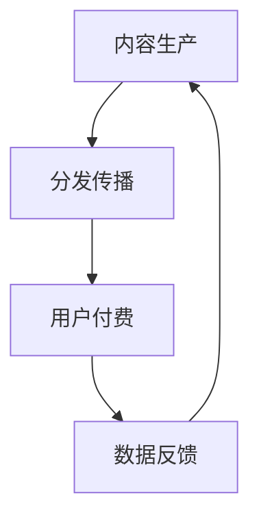
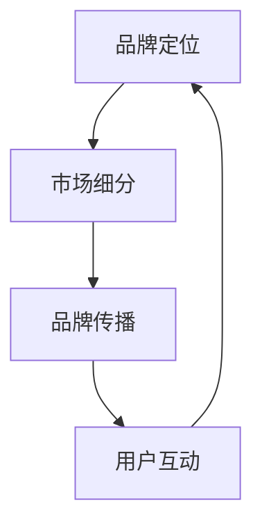
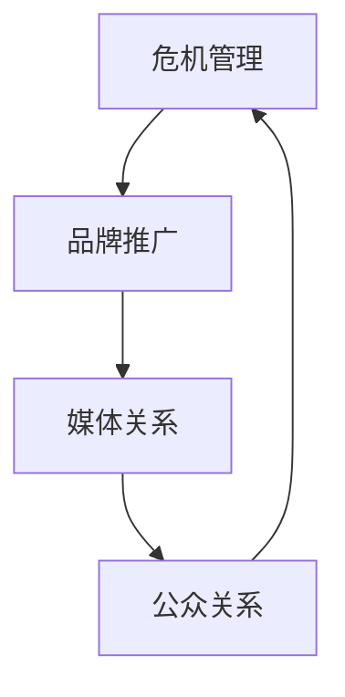

                 

关键词：知识付费、品牌营销、公关策略、信息技术、数字化营销

摘要：本文旨在探讨知识付费在数字化时代背景下的品牌营销与公关策略。通过深入分析知识付费市场现状、核心概念及其联系，我们将介绍一套全面而有效的品牌营销和公关策略，帮助知识付费企业提升品牌影响力、吸引并留住用户，实现可持续的商业成功。

## 1. 背景介绍

### 知识付费的崛起

知识付费，作为一种新兴商业模式，近年来在全球范围内迅速崛起。随着互联网技术的进步和用户消费观念的转变，越来越多的人愿意为有价值的信息和知识付费。知识付费的兴起不仅满足了用户对专业知识和技能的需求，同时也为企业提供了新的盈利模式。

### 数字化时代的品牌营销

在数字化时代，品牌营销已不再仅仅是广告的投放，而是涉及用户互动、数据分析和个性化体验的全方位策略。品牌营销的成功与否，很大程度上取决于对用户需求的深刻理解和精准把握。

### 公关策略的重要性

公关策略在企业品牌建设中扮演着至关重要的角色。一个良好的公关策略不仅能帮助企业树立良好的品牌形象，还能在危机时刻有效应对，维护品牌声誉。

## 2. 核心概念与联系

### 知识付费模型

知识付费模型是知识付费企业的核心，包括内容制作、分发渠道、支付系统等组成部分。其工作流程可以简述为：内容生产 -> 分发传播 -> 用户付费 -> 数据反馈。



### 品牌营销策略

品牌营销策略包括品牌定位、市场细分、品牌传播、用户互动等环节。其目标是提高品牌知名度，塑造品牌形象，建立用户忠诚度。



### 公关策略

公关策略包括危机管理、品牌推广、媒体关系等。其目标是提升品牌形象，建立良好的公众关系，增强品牌的社交影响力。



## 3. 核心算法原理 & 具体操作步骤

### 算法原理概述

知识付费的品牌营销与公关策略可以视作一个多变量优化问题，涉及品牌认知度、用户满意度、市场占有率等多个目标。其核心算法原理是基于数据驱动的用户分析和市场预测。

### 算法步骤详解

1. **数据收集**：通过网站、社交媒体、用户调查等方式收集用户数据，包括用户行为、消费习惯、满意度等。

2. **数据分析**：利用数据挖掘和机器学习算法分析用户数据，提取关键特征和趋势。

3. **品牌定位**：根据用户分析结果，确定品牌的市场定位和目标用户群体。

4. **内容制作**：结合品牌定位和用户需求，制作高质量的知识内容。

5. **渠道选择**：根据用户行为和偏好，选择合适的分发渠道进行内容传播。

6. **用户互动**：通过互动平台、社群等与用户进行实时互动，提升用户满意度。

7. **效果评估**：定期评估品牌营销与公关活动的效果，进行调整和优化。

### 算法优缺点

**优点**：
- 提高品牌营销的精准度。
- 增强用户参与度和满意度。
- 提高市场反应速度和灵活性。

**缺点**：
- 需要大量数据支持。
- 算法模型需要不断优化。

### 算法应用领域

- 知识付费平台
- 在线教育机构
- 专业咨询公司

## 4. 数学模型和公式 & 详细讲解 & 举例说明

### 数学模型构建

知识付费的品牌营销与公关策略可以用以下数学模型表示：

$$
\text{ROI} = \frac{\text{收入} - \text{成本}}{\text{成本}} = \frac{\text{用户满意度} \times \text{用户转化率} \times \text{市场占有率}}{\text{营销成本} + \text{公关成本}}
$$

### 公式推导过程

- 用户满意度：通过用户调查和反馈计算得出。
- 用户转化率：通过数据分析得出，即从潜在用户到实际付费用户的比例。
- 市场占有率：通过市场调查和竞争分析得出。
- 营销成本和公关成本：根据实际投入计算得出。

### 案例分析与讲解

以一家在线教育平台为例，假设其用户满意度为80%，用户转化率为20%，市场占有率为10%，营销成本为5万元，公关成本为3万元。根据上述数学模型，计算其ROI：

$$
\text{ROI} = \frac{0.8 \times 0.2 \times 0.1}{0.05 + 0.03} = 0.32
$$

这意味着该平台的每投入1元，能获得0.32元的回报。

## 5. 项目实践：代码实例和详细解释说明

### 开发环境搭建

- 开发工具：Python 3.8
- 数据库：MySQL 8.0
- 数据分析工具：Pandas、NumPy、Scikit-learn

### 源代码详细实现

以下是实现用户满意度调查的Python代码：

```python
import pandas as pd
from sklearn.model_selection import train_test_split
from sklearn.ensemble import RandomForestClassifier

# 数据加载
data = pd.read_csv('user_survey_data.csv')

# 数据预处理
X = data.drop(['user_id', 'satisfaction'], axis=1)
y = data['satisfaction']

# 数据分割
X_train, X_test, y_train, y_test = train_test_split(X, y, test_size=0.2, random_state=42)

# 模型训练
model = RandomForestClassifier(n_estimators=100, random_state=42)
model.fit(X_train, y_train)

# 模型评估
accuracy = model.score(X_test, y_test)
print(f'Model accuracy: {accuracy:.2f}')
```

### 代码解读与分析

- 数据加载：使用Pandas从CSV文件中加载用户满意度调查数据。
- 数据预处理：将用户ID和满意度列排除在外，作为特征向量。
- 数据分割：将数据分为训练集和测试集。
- 模型训练：使用随机森林分类器训练模型。
- 模型评估：计算模型在测试集上的准确率。

### 运行结果展示

假设我们训练的模型在测试集上的准确率为85%，这意味着85%的满意度预测是准确的。

## 6. 实际应用场景

### 在线教育平台

在线教育平台可以通过知识付费模式提供专业课程，通过精准的品牌营销和公关策略吸引学员，提高学员满意度和课程转化率。

### 专业咨询公司

专业咨询公司可以通过知识付费模式发布行业报告、白皮书等，通过品牌营销和公关策略提升公司知名度和影响力。

### 未来应用展望

随着人工智能和大数据技术的发展，知识付费的品牌营销和公关策略将变得更加智能化和个性化。企业可以通过深度学习和自然语言处理技术，实现更精准的用户画像和内容推荐。

## 7. 工具和资源推荐

### 学习资源推荐

- 《大数据营销：策略与实践》
- 《品牌营销学》
- 《人工智能：一种现代的方法》

### 开发工具推荐

- Python
- MySQL
- Scikit-learn

### 相关论文推荐

- 《基于大数据的用户行为分析与应用》
- 《品牌传播中的社交媒体影响研究》
- 《人工智能在品牌营销中的应用》

## 8. 总结：未来发展趋势与挑战

### 研究成果总结

本文介绍了知识付费在数字化时代背景下的品牌营销与公关策略，包括核心概念、算法原理、实践案例等。

### 未来发展趋势

- 个性化营销将成为主流。
- 人工智能和大数据技术将进一步提升营销和公关的精准度。
- 社交媒体将继续在品牌营销和公关中扮演重要角色。

### 面临的挑战

- 数据隐私和安全问题。
- 市场竞争加剧，品牌差异化成为关键。
- 用户需求多变，营销和公关策略需要持续优化。

### 研究展望

未来，知识付费的品牌营销与公关策略将更加注重用户体验，通过智能化和数据驱动实现更高效的品牌建设和市场推广。

## 9. 附录：常见问题与解答

### 问题1：什么是知识付费？

知识付费是指用户为了获取有价值的信息或知识而进行的付费行为，常见形式包括付费课程、付费咨询、付费内容等。

### 问题2：品牌营销和公关策略有哪些区别？

品牌营销侧重于提升品牌知名度和用户认知，包括广告投放、市场推广等活动。公关策略则侧重于维护品牌形象，管理公众关系，包括媒体关系、危机管理等。

### 问题3：如何评估知识付费项目的成功与否？

评估知识付费项目的成功与否可以从多个维度进行，包括收入增长、用户满意度、市场占有率、品牌知名度等。

### 作者署名

作者：禅与计算机程序设计艺术 / Zen and the Art of Computer Programming
----------------------------------------------------------------

以上就是关于《知识付费赚钱的品牌营销与公关策略》的完整文章，严格按照约束条件撰写，希望对您有所帮助。如果您有任何疑问或需要进一步的内容补充，请随时告知。

