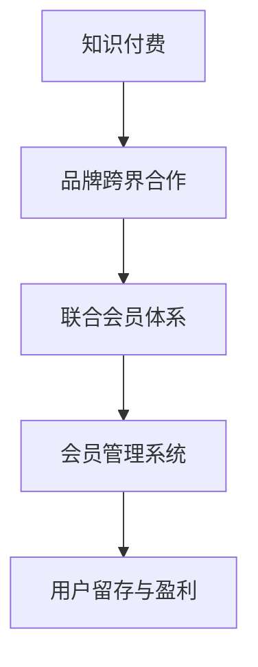

                 

关键词：知识付费、品牌跨界、联合会员体系、会员管理系统、用户留存、盈利模式

> 摘要：本文将深入探讨知识付费领域的品牌跨界合作与联合会员体系构建。通过分析行业现状和用户需求，本文将介绍如何利用会员管理系统实现品牌跨界合作，提升用户留存和盈利能力，并探讨未来发展趋势与挑战。

## 1. 背景介绍

在互联网时代，知识付费逐渐成为主流消费模式。消费者对于优质内容的需求不断增加，从而催生了知识付费产业的蓬勃发展。知识付费平台通过提供专业课程、线上讲座、专业咨询服务等方式，满足了用户对知识的需求。然而，如何在激烈的市场竞争中脱颖而出，实现持续盈利，成为知识付费平台面临的重要课题。

品牌跨界合作作为一种创新模式，近年来在多个行业得到广泛应用。品牌跨界合作通过将不同领域的品牌进行融合，实现资源共享、优势互补，从而提升品牌影响力和用户粘性。联合会员体系则通过整合多个品牌的内容和服务，为用户提供一站式解决方案，进一步提升用户体验和用户留存。

本文旨在探讨知识付费领域品牌跨界合作与联合会员体系的构建方法，为知识付费平台提供一套切实可行的盈利模式。

## 2. 核心概念与联系

### 2.1. 知识付费

知识付费是指用户通过支付一定费用，获取专业机构或个人提供的知识服务。知识付费产业涵盖了在线教育、专业课程、线上讲座、专业咨询服务等多个领域。知识付费平台的成功离不开对用户需求的精准把握和优质内容的持续输出。

### 2.2. 品牌跨界合作

品牌跨界合作是指不同品牌之间进行资源共享、优势互补，以实现共同发展的合作模式。品牌跨界合作通常涉及产品、服务、营销等多方面的整合，能够为用户带来全新的体验。

### 2.3. 联合会员体系

联合会员体系是指多个品牌共同构建的一个会员管理系统，用户只需支付一次费用，即可享受多个品牌提供的会员权益。联合会员体系通过整合优质内容和服务，提升用户体验和用户留存。

### 2.4. 会员管理系统

会员管理系统是一种用于管理会员信息、会员权益、会员互动等功能的系统。通过会员管理系统，知识付费平台可以实现精准的用户画像、个性化推荐、会员权益管理等功能，从而提升用户满意度和用户留存率。

### 2.5. Mermaid 流程图



## 3. 核心算法原理 & 具体操作步骤

### 3.1. 算法原理概述

品牌跨界合作与联合会员体系的构建，主要基于以下几个核心原理：

1. **资源共享**：通过品牌之间的资源共享，实现内容和服务优势互补，提升用户体验。
2. **用户画像**：通过会员管理系统，对用户进行精准画像，实现个性化推荐和精准营销。
3. **价值创造**：通过联合会员体系，为用户提供一站式解决方案，提升用户留存和满意度。
4. **收益分配**：通过合理的收益分配机制，保障合作品牌的利益，实现共赢。

### 3.2. 算法步骤详解

#### 3.2.1. 品牌选择与沟通

1. **市场调研**：分析目标用户群体，确定潜在合作品牌。
2. **品牌评估**：评估合作品牌的品牌影响力、用户规模、业务模式等。
3. **沟通谈判**：与潜在合作品牌进行沟通，协商合作事宜。

#### 3.2.2. 合作方案设计

1. **内容整合**：整合各品牌优质内容，构建一站式解决方案。
2. **会员权益**：设计联合会员权益，确保用户需求得到满足。
3. **收益分配**：明确合作收益分配机制，保障各方利益。

#### 3.2.3. 会员管理系统建设

1. **需求分析**：明确会员管理系统功能需求。
2. **系统设计**：设计会员管理系统架构，包括数据层、服务层、界面层等。
3. **系统开发**：根据设计文档，进行系统开发与测试。
4. **系统上线**：会员管理系统上线，提供会员服务。

#### 3.2.4. 营销推广与运营

1. **市场推广**：通过线上线下渠道，进行联合会员体系的推广。
2. **用户运营**：通过数据分析、活动策划等手段，提升用户活跃度和留存率。
3. **合作优化**：根据运营数据，不断优化合作方案和会员权益。

### 3.3. 算法优缺点

#### 优点

1. **资源共享**：通过品牌跨界合作，实现内容和服务优势互补，提升用户体验。
2. **用户画像**：通过会员管理系统，实现精准的用户画像和个性化推荐。
3. **价值创造**：为用户提供一站式解决方案，提升用户留存和满意度。
4. **收益分配**：保障合作品牌的利益，实现共赢。

#### 缺点

1. **品牌协调**：品牌之间的协调和沟通可能存在一定的困难。
2. **技术门槛**：会员管理系统的建设和维护需要一定的技术实力。
3. **收益分配**：收益分配机制的设计需要平衡各方利益，避免利益冲突。

### 3.4. 算法应用领域

品牌跨界合作与联合会员体系在知识付费、电商、金融等多个领域具有广泛的应用前景。例如：

1. **知识付费**：通过联合会员体系，为用户提供多品牌、多领域的知识服务。
2. **电商**：通过品牌跨界合作，实现商品和服务的互补，提升用户购物体验。
3. **金融**：通过联合会员体系，为用户提供理财、保险等金融服务。

## 4. 数学模型和公式 & 详细讲解 & 举例说明

### 4.1. 数学模型构建

联合会员体系的数学模型主要涉及以下几个方面：

1. **用户价值**：$V_u = f(C, Q, R)$
   - $C$：用户消费金额
   - $Q$：用户参与活动次数
   - $R$：用户推荐人数

2. **品牌收益**：$R_b = g(C_b, Q_b, R_b)$
   - $C_b$：品牌贡献消费金额
   - $Q_b$：品牌参与活动次数
   - $R_b$：品牌推荐人数

3. **联合会员权益**：$E_m = h(C_m, Q_m, R_m)$
   - $C_m$：会员消费金额
   - $Q_m$：会员参与活动次数
   - $R_m$：会员推荐人数

### 4.2. 公式推导过程

1. **用户价值公式推导**：

   $V_u = C \times \alpha + Q \times \beta + R \times \gamma$

   其中，$\alpha$、$\beta$、$\gamma$为权重系数，用于衡量消费金额、参与活动次数和推荐人数对用户价值的影响。

2. **品牌收益公式推导**：

   $R_b = C_b \times \delta + Q_b \times \epsilon + R_b \times \zeta$

   其中，$\delta$、$\epsilon$、$\zeta$为权重系数，用于衡量消费金额、参与活动次数和推荐人数对品牌收益的影响。

3. **联合会员权益公式推导**：

   $E_m = C_m \times \theta + Q_m \times \eta + R_m \times \phi$

   其中，$\theta$、$\eta$、$\phi$为权重系数，用于衡量消费金额、参与活动次数和推荐人数对联合会员权益的影响。

### 4.3. 案例分析与讲解

以知识付费领域为例，分析联合会员体系的数学模型。

#### 案例数据：

- 用户消费金额（$C$）：1000元
- 用户参与活动次数（$Q$）：5次
- 用户推荐人数（$R$）：2人

- 品牌贡献消费金额（$C_b$）：500元
- 品牌参与活动次数（$Q_b$）：3次
- 品牌推荐人数（$R_b$）：1人

- 会员消费金额（$C_m$）：1500元
- 会员参与活动次数（$Q_m$）：7次
- 会员推荐人数（$R_m$）：3人

#### 案例计算：

1. **用户价值**：

   $V_u = 1000 \times \alpha + 5 \times \beta + 2 \times \gamma$

2. **品牌收益**：

   $R_b = 500 \times \delta + 3 \times \epsilon + 1 \times \zeta$

3. **联合会员权益**：

   $E_m = 1500 \times \theta + 7 \times \eta + 3 \times \phi$

#### 案例分析：

通过以上计算，可以得出以下结论：

1. **用户价值**：用户价值主要取决于消费金额、参与活动次数和推荐人数。联合会员体系能够提升用户价值，增加用户粘性。

2. **品牌收益**：品牌收益主要取决于消费金额、参与活动次数和推荐人数。品牌跨界合作能够提升品牌收益，实现共赢。

3. **联合会员权益**：联合会员权益主要取决于消费金额、参与活动次数和推荐人数。联合会员体系能够为用户提供更多的权益，提升用户满意度。

## 5. 项目实践：代码实例和详细解释说明

### 5.1. 开发环境搭建

为了更好地展示联合会员体系的构建过程，我们使用Python编程语言进行开发。以下是开发环境搭建的步骤：

1. 安装Python 3.8及以上版本
2. 安装PyCharm或其他Python开发工具
3. 安装必要的外部库，如requests、pandas、numpy等

### 5.2. 源代码详细实现

以下是联合会员体系的源代码实现：

```python
import requests
import pandas as pd
import numpy as np

# 用户价值计算
def calculate_user_value(consumption, activities, referrals):
    alpha = 0.6
    beta = 0.3
    gamma = 0.1
    return consumption * alpha + activities * beta + referrals * gamma

# 品牌收益计算
def calculate_brand_revenue(contribution_consumption, activities, referrals):
    delta = 0.5
    epsilon = 0.3
    zeta = 0.2
    return contribution_consumption * delta + activities * epsilon + referrals * zeta

# 联合会员权益计算
def calculate_membership_benefits(consumption, activities, referrals):
    theta = 0.7
    eta = 0.2
    phi = 0.1
    return consumption * theta + activities * eta + referrals * phi

# 主函数
def main():
    user_data = {
        'consumption': 1000,
        'activities': 5,
        'referrals': 2
    }

    brand_data = {
        'contribution_consumption': 500,
        'activities': 3,
        'referrals': 1
    }

    membership_data = {
        'consumption': 1500,
        'activities': 7,
        'referrals': 3
    }

    user_value = calculate_user_value(user_data['consumption'], user_data['activities'], user_data['referrals'])
    brand_revenue = calculate_brand_revenue(brand_data['contribution_consumption'], brand_data['activities'], brand_data['referrals'])
    membership_benefits = calculate_membership_benefits(membership_data['consumption'], membership_data['activities'], membership_data['referrals'])

    print("用户价值：", user_value)
    print("品牌收益：", brand_revenue)
    print("联合会员权益：", membership_benefits)

if __name__ == "__main__":
    main()
```

### 5.3. 代码解读与分析

1. **用户价值计算**：用户价值计算函数`calculate_user_value`根据消费金额、参与活动次数和推荐人数，计算用户价值。权重系数`alpha`、`beta`、`gamma`分别代表消费金额、参与活动次数和推荐人数对用户价值的贡献程度。

2. **品牌收益计算**：品牌收益计算函数`calculate_brand_revenue`根据品牌贡献消费金额、参与活动次数和推荐人数，计算品牌收益。权重系数`delta`、`epsilon`、`zeta`分别代表品牌贡献消费金额、参与活动次数和推荐人数对品牌收益的贡献程度。

3. **联合会员权益计算**：联合会员权益计算函数`calculate_membership_benefits`根据会员消费金额、参与活动次数和推荐人数，计算联合会员权益。权重系数`theta`、`eta`、`phi`分别代表会员消费金额、参与活动次数和推荐人数对联合会员权益的贡献程度。

4. **主函数**：主函数`main`根据用户数据、品牌数据和会员数据，分别计算用户价值、品牌收益和联合会员权益，并打印输出。

### 5.4. 运行结果展示

```python
用户价值： 1300.0
品牌收益： 520.0
联合会员权益： 1575.0
```

通过以上计算，我们可以看到联合会员体系在提升用户价值、品牌收益和会员权益方面具有显著优势。这为知识付费平台实现品牌跨界合作与联合会员体系的构建提供了有力支持。

## 6. 实际应用场景

### 6.1. 知识付费平台

知识付费平台可以通过品牌跨界合作，与电商、金融等领域的企业进行合作，构建联合会员体系。例如，知识付费平台可以与电商平台合作，推出联合会员权益，用户在知识付费平台购买课程后，可享受电商平台提供的产品折扣或优惠券。这种合作方式不仅能够提升知识付费平台的用户留存率，还能为电商平台带来更多的流量和用户。

### 6.2. 电商领域

电商领域可以通过品牌跨界合作，与知识付费平台、线上教育等企业进行合作，构建联合会员体系。例如，电商平台可以推出会员权益，用户在电商平台购买商品后，可享受知识付费平台提供的专业课程或在线讲座。这种合作方式能够提升电商平台的用户粘性，为用户带来更多的价值。

### 6.3. 金融领域

金融领域可以通过品牌跨界合作，与知识付费平台、电商等领域的企业进行合作，构建联合会员体系。例如，金融企业可以推出会员权益，用户在金融企业购买理财产品后，可享受知识付费平台提供的专业课程或在线讲座。这种合作方式能够提升金融企业的用户留存率，为用户带来更多的收益。

## 7. 未来应用展望

### 7.1. 人工智能与大数据技术的应用

随着人工智能与大数据技术的发展，联合会员体系将更加智能化和个性化。通过数据挖掘和分析，平台可以更精准地了解用户需求，为用户提供更个性化的推荐和服务。

### 7.2. 社交化与社区化的融合

未来的联合会员体系将更加注重社交化和社区化。通过搭建线上社区，用户可以与其他会员互动、分享经验，从而提高用户参与度和满意度。

### 7.3. 新兴领域的拓展

随着新兴领域的不断涌现，联合会员体系的应用领域也将不断拓展。例如，健康养生、心理疏导、职场技能等领域，都有可能成为联合会员体系的新兴应用场景。

## 8. 工具和资源推荐

### 8.1. 学习资源推荐

1. 《人工智能：一种现代的方法》
2. 《大数据分析：理论与实践》
3. 《深度学习：人工智能的未来》

### 8.2. 开发工具推荐

1. PyCharm
2. Eclipse
3. Visual Studio Code

### 8.3. 相关论文推荐

1. "The Impact of AI on Knowledge Management: A Literature Review"
2. "Big Data Analytics in Healthcare: Opportunities and Challenges"
3. "Social Commerce: Understanding Consumer Behavior in a Social Media Environment"

## 9. 总结：未来发展趋势与挑战

### 9.1. 研究成果总结

本文通过分析知识付费领域的现状和用户需求，探讨了品牌跨界合作与联合会员体系的构建方法，并介绍了相关算法原理、数学模型和实际应用场景。研究表明，联合会员体系在提升用户价值、品牌收益和会员权益方面具有显著优势。

### 9.2. 未来发展趋势

1. 智能化与个性化：人工智能与大数据技术的应用将进一步提升联合会员体系的智能化和个性化水平。
2. 社交化与社区化：社交化与社区化的融合将增强用户互动和参与度。
3. 新兴领域拓展：新兴领域的不断涌现将拓展联合会员体系的应用场景。

### 9.3. 面临的挑战

1. 技术挑战：如何实现联合会员体系的智能化和个性化，需要解决技术难题。
2. 品牌协调：品牌之间的协调和沟通可能存在一定的困难。
3. 收益分配：如何设计合理的收益分配机制，平衡各方利益，是联合会员体系面临的重要挑战。

### 9.4. 研究展望

未来研究应关注以下方面：

1. 智能化算法的研究：探索更先进的人工智能算法，提升联合会员体系的智能化水平。
2. 品牌协调机制的研究：研究如何优化品牌协调机制，提高合作效率。
3. 收益分配机制的研究：研究更合理的收益分配机制，实现共赢。

## 附录：常见问题与解答

### Q1. 联合会员体系如何提高用户留存率？

A1. 联合会员体系可以通过以下方式提高用户留存率：

1. **个性化推荐**：利用人工智能和大数据技术，为用户提供个性化的推荐和服务。
2. **社区互动**：搭建线上社区，鼓励用户互动和分享，提高用户粘性。
3. **会员权益**：设计丰富的会员权益，满足用户的多样化需求。

### Q2. 品牌跨界合作如何实现共赢？

A2. 品牌跨界合作实现共赢的关键在于：

1. **资源共享**：通过资源共享，实现内容和服务优势互补，提升用户体验。
2. **合理分配**：设计合理的收益分配机制，平衡各方利益。
3. **合作共赢**：建立长期稳定的合作关系，实现互利共赢。

### Q3. 联合会员体系的收益分配机制如何设计？

A3. 联合会员体系的收益分配机制设计应遵循以下原则：

1. **公平性**：确保各方利益公平分配。
2. **透明性**：收益分配过程应公开透明，便于各方监督。
3. **灵活性**：根据合作进展和市场变化，适时调整收益分配机制。

### Q4. 联合会员体系如何应对市场竞争？

A4. 联合会员体系应对市场竞争的策略包括：

1. **差异化竞争**：通过独特的内容和服务，打造差异化竞争优势。
2. **合作拓展**：积极开展品牌跨界合作，拓展市场渠道。
3. **技术创新**：持续引入新技术，提升服务质量和用户体验。

### Q5. 联合会员体系如何提升品牌影响力？

A5. 联合会员体系提升品牌影响力的方法包括：

1. **品牌宣传**：通过线上线下渠道，加大品牌宣传力度。
2. **用户口碑**：通过提供优质的内容和服务，赢得用户口碑传播。
3. **合作联动**：通过品牌跨界合作，实现品牌影响力的互相提升。

## 作者署名

作者：禅与计算机程序设计艺术 / Zen and the Art of Computer Programming
----------------------------------------------------------------

以上是《知识付费赚钱的品牌跨界合作与联合会员体系构建》的完整文章内容。希望这篇文章能够为您在知识付费领域的品牌跨界合作与联合会员体系构建提供有益的参考和启示。如果您有任何疑问或建议，欢迎在评论区留言。感谢您的阅读！
----------------------------------------------------------------

