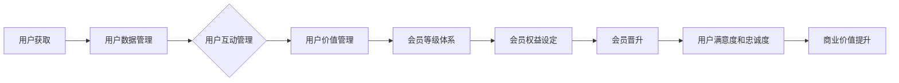

                 

知识付费，作为近年来兴起的一种新型商业模式，正逐渐改变着传统的内容生产和消费方式。在这个背景下，用户关系管理（Customer Relationship Management, CRM）和会员等级体系（Member Level System）成为知识付费平台的重要策略，旨在提高用户粘性、增强用户忠诚度，并最终实现商业价值的最大化。本文将深入探讨知识付费赚钱背后的用户关系管理与会员等级体系的构建、运行及其应用。

## 关键词
- 知识付费
- 用户关系管理
- 会员等级体系
- 用户粘性
- 用户忠诚度
- 商业模式

## 摘要
本文将围绕知识付费赚钱的用户关系管理和会员等级体系展开，首先介绍相关知识付费的基本概念和商业模式，然后详细探讨用户关系管理的核心要素，最后深入分析会员等级体系的构建与运行，包括其在提升用户满意度和促进商业变现方面的作用。通过本文的探讨，旨在为知识付费平台提供有效的用户管理和商业模式优化的策略。

## 1. 背景介绍

### 1.1 知识付费的定义与兴起

知识付费是指用户为获取特定知识内容或服务而支付的费用，这种模式与传统的免费内容消费模式不同，强调价值的交换和个性化服务的提供。知识付费的兴起源于用户对高质量内容的需求增长，以及互联网技术的快速发展，使得优质内容的生产和分发变得更加高效和便捷。

近年来，知识付费在教育培训、在线咨询、专业课程、内容订阅等多个领域取得了显著的发展。例如，教育培训领域的在线课程、专业课程和在线咨询服务的崛起，使人们能够灵活地获取专业知识和技能。此外，内容订阅模式如知乎会员、得到App等，也在内容消费市场中占据了重要位置。

### 1.2 知识付费的商业模式

知识付费的商业模式主要包括以下几种类型：

1. **单次付费模式**：用户为某一具体内容或服务支付一次费用，如在线课程、电子书、专业报告等。
2. **订阅模式**：用户通过定期支付订阅费用，获得特定平台提供的持续内容更新和增值服务。
3. **会员模式**：平台提供不同等级的会员服务，会员享有更多特权和优惠，如VIP会员、尊享会员等。
4. **佣金模式**：平台作为中介，为知识提供者和消费者提供交易服务，从中抽取一定比例的佣金。

### 1.3 用户关系管理的重要性

用户关系管理（CRM）是指企业通过系统化、标准化的方法，管理其与现有和潜在用户之间的互动，以提升用户满意度和忠诚度。在知识付费领域，用户关系管理尤为重要，因为用户的高满意度和忠诚度直接关系到平台的商业成功。

用户关系管理的核心目标包括：

1. **提高用户满意度**：通过个性化服务和优质内容，满足用户需求，提升用户满意度。
2. **增强用户粘性**：通过持续互动和用户参与，增强用户对平台的依赖和忠诚。
3. **促进商业变现**：通过有效的用户关系管理，推动用户转化和消费，实现商业价值的最大化。

### 1.4 会员等级体系的定义与作用

会员等级体系是一种通过将用户分类为不同等级，以提供差异化服务和优惠的方式，来增强用户忠诚度和促进消费的机制。在知识付费平台中，会员等级体系通常包括初级会员、高级会员、VIP会员等不同等级，每个等级享有不同的服务和权益。

会员等级体系的作用包括：

1. **提升用户粘性**：通过提供不同等级的会员服务，吸引用户持续消费和参与。
2. **增强用户忠诚度**：通过会员等级的晋升机制，激励用户为获取更高等级服务而努力。
3. **促进商业变现**：通过提供差异化服务和优惠，刺激用户消费，提升平台收益。

## 2. 核心概念与联系

### 2.1 用户关系管理（CRM）

用户关系管理（CRM）的核心概念包括用户数据管理、用户互动管理、用户价值管理等。其关键流程包括用户获取、用户维护、用户升级和用户流失管理。


**CRM与会员等级体系的关系**：

用户关系管理与会员等级体系密切相关。会员等级体系是用户关系管理中的重要组成部分，通过为用户提供差异化服务和权益，提升用户的满意度和忠诚度，进而实现商业价值的提升。同时，用户关系管理提供了会员等级体系运行的数据基础和互动机制。

### 2.2 会员等级体系

会员等级体系的构建基于用户的行为数据、消费能力、活跃度等多个维度，通过设定不同等级的会员服务和权益，实现对用户的有效管理。

**会员等级体系的核心概念**：

1. **会员等级**：根据用户的不同维度数据进行分类，设定初级会员、高级会员、VIP会员等不同等级。
2. **会员权益**：每个等级的会员享有不同的服务和优惠，如内容权限、折扣优惠、专属活动等。
3. **会员晋升**：通过用户行为数据，设定会员等级的晋升机制，激励用户持续参与和消费。

**会员等级体系与用户关系管理的关系**：

会员等级体系是用户关系管理的重要组成部分，通过会员等级的划分和权益的提供，实现对用户的精细化管理。同时，用户关系管理提供了会员等级体系运行的数据支持和互动机制，使得会员等级体系能够更加有效地提升用户的满意度和忠诚度。

### 2.3 Mermaid 流程图

以下是一个简单的Mermaid流程图，展示了用户关系管理和会员等级体系的基本流程：



通过这个流程图，可以清晰地看到用户关系管理和会员等级体系之间的相互作用和影响。

## 3. 核心算法原理 & 具体操作步骤

### 3.1 算法原理概述

用户关系管理和会员等级体系的构建依赖于一系列核心算法，这些算法主要包括用户行为分析、数据挖掘和机器学习等。以下是这些算法的基本原理和具体操作步骤。

### 3.2 算法步骤详解

#### 3.2.1 用户行为分析

1. **数据采集**：通过平台的各种渠道，如网页、移动应用、社交媒体等，收集用户的行为数据，包括浏览记录、搜索关键词、购买行为等。
2. **数据预处理**：对收集到的用户行为数据进行清洗、去重和格式化，确保数据的质量和一致性。
3. **特征提取**：从用户行为数据中提取关键特征，如用户活跃度、内容喜好、购买频率等。
4. **行为模式识别**：利用机器学习算法，对用户行为特征进行分析，识别用户的行为模式。

#### 3.2.2 数据挖掘

1. **关联规则挖掘**：通过Apriori算法或FP-Growth算法，挖掘用户行为数据中的关联规则，如用户购买某一课程后，往往还会购买其他课程。
2. **聚类分析**：使用K-means或DBSCAN算法，将用户行为数据分成不同的群体，以便于提供个性化服务。
3. **分类算法**：使用决策树、支持向量机（SVM）或神经网络等分类算法，预测用户的未来行为和需求。

#### 3.2.3 会员等级划分

1. **设定等级标准**：根据用户行为数据和用户价值，设定不同等级的标准，如初级会员、高级会员、VIP会员等。
2. **等级计算**：根据用户行为数据，计算每个用户的会员等级，如活跃度、消费金额、参与度等。
3. **等级更新**：定期更新用户的会员等级，以反映用户的行为变化和需求。

#### 3.2.4 会员权益分配

1. **设定权益**：根据不同等级的会员，设定相应的权益，如内容权限、折扣优惠、专属活动等。
2. **权益分配**：根据用户的会员等级，为用户分配相应的权益，确保每个等级的用户都能享受到相应的服务。
3. **权益调整**：根据用户反馈和市场变化，定期调整会员权益，以提升用户满意度。

### 3.3 算法优缺点

#### 3.3.1 用户行为分析

**优点**：
- 提高用户满意度：通过分析用户行为，提供个性化服务，满足用户需求。
- 增强用户粘性：通过持续的用户行为分析，吸引用户持续参与和消费。

**缺点**：
- 数据隐私问题：用户行为数据涉及到用户的隐私，需要确保数据的安全和合规性。
- 算法复杂性：用户行为分析需要复杂的算法和数据处理技术，对技术要求较高。

#### 3.3.2 数据挖掘

**优点**：
- 发现用户行为规律：通过数据挖掘，发现用户行为中的规律和趋势，为用户管理和决策提供依据。
- 提高营销效果：通过关联规则挖掘和聚类分析，优化营销策略，提高营销效果。

**缺点**：
- 数据质量要求高：数据挖掘的效果依赖于数据的质量和一致性，数据质量不佳可能导致分析结果不准确。
- 算法复杂性：数据挖掘算法复杂，需要较高的计算资源和专业技能。

#### 3.3.3 会员等级划分

**优点**：
- 提高用户忠诚度：通过会员等级划分，提供差异化服务，激励用户持续消费和参与。
- 促进商业变现：通过会员等级的权益设置，提高用户购买意愿，促进商业变现。

**缺点**：
- 可能引起用户反感：过于复杂的会员等级体系和权益设置可能引起用户反感，降低用户满意度。
- 等级标准不明确：会员等级标准设定不明确，可能导致用户对等级划分产生质疑。

### 3.4 算法应用领域

用户关系管理和会员等级体系的构建在知识付费领域有着广泛的应用，以下是一些具体的应用领域：

- **在线教育平台**：通过用户行为分析和数据挖掘，提供个性化课程推荐，提高用户满意度和参与度。
- **内容订阅平台**：通过会员等级划分和权益设置，吸引更多用户订阅内容，提高订阅率和用户留存率。
- **专业咨询服务**：通过用户行为分析和会员等级体系，为用户提供定制化的咨询服务，提高服务质量。

## 4. 数学模型和公式 & 详细讲解 & 举例说明

### 4.1 数学模型构建

在用户关系管理和会员等级体系的设计中，数学模型起着至关重要的作用。以下是几个关键的数学模型：

#### 4.1.1 用户满意度模型

用户满意度模型通常用于衡量用户对平台服务的满意程度。一个简单的用户满意度模型可以表示为：

$$
S = \frac{U_C + U_Q + U_R}{3}
$$

其中：
- \( S \) 表示用户满意度；
- \( U_C \) 表示内容满意度；
- \( U_Q \) 表示服务质量满意度；
- \( U_R \) 表示用户服务体验满意度。

#### 4.1.2 会员等级晋升模型

会员等级晋升模型用于计算用户达到下一级会员等级所需的条件。一个简单的会员等级晋升模型可以表示为：

$$
L_{\text{next}} = L_{\text{current}} + \frac{C - C_{\text{base}}}{R}
$$

其中：
- \( L_{\text{next}} \) 表示下一级会员等级；
- \( L_{\text{current}} \) 表示当前会员等级；
- \( C \) 表示会员消费总额；
- \( C_{\text{base}} \) 表示达到下一级会员等级的基准消费额；
- \( R \) 表示会员等级晋升的系数。

#### 4.1.3 会员权益设置模型

会员权益设置模型用于计算不同会员等级所享有的权益。一个简单的会员权益设置模型可以表示为：

$$
E_L = E_0 + \sum_{i=1}^{L-L_0} (E_i - E_{i-1})
$$

其中：
- \( E_L \) 表示第 \( L \) 级会员的权益；
- \( E_0 \) 表示初级会员的权益；
- \( E_i \) 表示第 \( i \) 级会员的权益；
- \( L \) 表示会员等级；
- \( L_0 \) 表示初级会员等级。

### 4.2 公式推导过程

以下是对上述数学模型的推导过程：

#### 4.2.1 用户满意度模型推导

用户满意度通常由多个维度构成，包括内容满意度、服务质量满意度和用户服务体验满意度。假设每个维度的权重相等，则用户满意度可以表示为这三个维度的平均值。

内容满意度 \( U_C \) 可以通过用户对内容的评分计算得出：

$$
U_C = \frac{1}{N} \sum_{i=1}^{N} R_i
$$

其中：
- \( R_i \) 表示第 \( i \) 个用户对内容的评分；
- \( N \) 表示用户总数。

服务质量满意度 \( U_Q \) 可以通过用户对服务质量的评价计算得出：

$$
U_Q = \frac{1}{M} \sum_{j=1}^{M} S_j
$$

其中：
- \( S_j \) 表示第 \( j \) 个用户对服务质量的评价；
- \( M \) 表示评价的用户总数。

用户服务体验满意度 \( U_R \) 可以通过用户对服务体验的反馈计算得出：

$$
U_R = \frac{1}{P} \sum_{k=1}^{P} T_k
$$

其中：
- \( T_k \) 表示第 \( k \) 个用户对服务体验的反馈；
- \( P \) 表示反馈的用户总数。

将这三个维度相加并除以 3，即可得到用户满意度 \( S \)：

$$
S = \frac{U_C + U_Q + U_R}{3}
$$

#### 4.2.2 会员等级晋升模型推导

会员等级晋升模型基于用户消费总额与基准消费额之间的差距。假设会员等级晋升的系数为 \( R \)，则会员晋升的条件可以表示为：

$$
L_{\text{next}} = L_{\text{current}} + \frac{C - C_{\text{base}}}{R}
$$

其中：
- \( L_{\text{current}} \) 表示当前会员等级；
- \( C \) 表示会员消费总额；
- \( C_{\text{base}} \) 表示达到下一级会员等级的基准消费额；
- \( R \) 表示会员等级晋升的系数。

这个模型考虑了会员消费总额与基准消费额之间的差距，通过系数 \( R \) 调整会员晋升的速度。

#### 4.2.3 会员权益设置模型推导

会员权益设置模型基于不同等级会员的权益差异。假设会员等级为 \( L \)，则第 \( L \) 级会员的权益可以表示为：

$$
E_L = E_0 + \sum_{i=1}^{L-L_0} (E_i - E_{i-1})
$$

其中：
- \( E_L \) 表示第 \( L \) 级会员的权益；
- \( E_0 \) 表示初级会员的权益；
- \( E_i \) 表示第 \( i \) 级会员的权益；
- \( L_0 \) 表示初级会员等级。

这个模型考虑了会员等级之间的权益差异，通过累加不同等级的权益差异，计算出不同等级会员的权益。

### 4.3 案例分析与讲解

以下是一个具体的案例，用于说明上述数学模型在实际应用中的运用。

#### 4.3.1 用户满意度模型案例

假设一个在线教育平台，共有 100 个用户，他们对内容、服务质量和用户体验的评分分别为：

- 内容满意度评分：\( R_1, R_2, \ldots, R_{100} \)
- 服务质量满意度评分：\( S_1, S_2, \ldots, S_{100} \)
- 用户服务体验满意度评分：\( T_1, T_2, \ldots, T_{100} \)

经过计算，我们得到：

$$
U_C = \frac{1}{100} (R_1 + R_2 + \ldots + R_{100})
$$

$$
U_Q = \frac{1}{100} (S_1 + S_2 + \ldots + S_{100})
$$

$$
U_R = \frac{1}{100} (T_1 + T_2 + \ldots + T_{100})
$$

将这些值代入用户满意度模型：

$$
S = \frac{U_C + U_Q + U_R}{3}
$$

我们得到了该平台的用户满意度得分。

#### 4.3.2 会员等级晋升模型案例

假设一个知识付费平台，会员的等级晋升规则如下：

- 初级会员的基准消费额为 100 元；
- 会员等级晋升的系数为 2；
- 当前会员的等级为初级会员，其消费总额为 300 元。

根据会员等级晋升模型，我们可以计算该会员晋升后的等级：

$$
L_{\text{next}} = L_{\text{current}} + \frac{C - C_{\text{base}}}{R} = 1 + \frac{300 - 100}{2} = 2
$$

因此，该会员晋升为高级会员。

#### 4.3.3 会员权益设置模型案例

假设一个会员等级体系，共有三个等级：初级会员、高级会员和 VIP 会员。各等级的权益如下：

- 初级会员：100 元购买权限；
- 高级会员：200 元购买权限，额外享有 10% 的折扣；
- VIP 会员：300 元购买权限，额外享有 20% 的折扣和专属活动参与权。

根据会员权益设置模型，我们可以计算不同等级会员的权益：

$$
E_1 = 100
$$

$$
E_2 = 100 + (200 - 100) = 200
$$

$$
E_3 = 100 + (200 - 100) + (300 - 200) = 300
$$

因此，不同等级会员的权益分别为：

- 初级会员：100 元购买权限；
- 高级会员：200 元购买权限，额外享有 10% 的折扣；
- VIP 会员：300 元购买权限，额外享有 20% 的折扣和专属活动参与权。

通过上述案例，我们可以看到数学模型在实际应用中的运用，这些模型为我们提供了量化的方法来分析和管理用户关系和会员等级体系。

## 5. 项目实践：代码实例和详细解释说明

### 5.1 开发环境搭建

在进行知识付费平台的用户关系管理和会员等级体系开发前，我们需要搭建一个合适的开发环境。以下是推荐的开发环境：

1. **编程语言**：Python，因为其丰富的库和框架支持，非常适合数据分析和机器学习。
2. **开发工具**：PyCharm 或 Visual Studio Code，这两个IDE都提供了强大的代码编辑功能和调试工具。
3. **数据库**：MySQL 或 PostgreSQL，用于存储用户数据和会员等级信息。
4. **数据处理工具**：Pandas 和 NumPy，用于数据预处理和分析。
5. **机器学习库**：Scikit-learn 或 TensorFlow，用于用户行为分析和会员等级晋升模型的构建。

### 5.2 源代码详细实现

以下是用户关系管理和会员等级体系的简化代码实现，主要包括用户行为分析、数据挖掘、会员等级划分和权益分配等功能。

#### 5.2.1 用户行为数据分析

```python
import pandas as pd
from sklearn.preprocessing import MinMaxScaler
from sklearn.cluster import KMeans

# 用户行为数据
data = pd.DataFrame({
    'user_id': [1, 2, 3, 4, 5],
    'content_views': [10, 20, 15, 25, 30],
    'search_queries': [5, 8, 3, 10, 12],
    'purchases': [200, 300, 150, 250, 400]
})

# 数据标准化
scaler = MinMaxScaler()
data_scaled = scaler.fit_transform(data)

# K-means 聚类分析
kmeans = KMeans(n_clusters=3, random_state=0).fit(data_scaled)
labels = kmeans.labels_

# 更新用户等级
data['level'] = labels + 1

print(data)
```

#### 5.2.2 会员等级晋升模型

```python
def promote_member(current_level, current_purchase, base_purchase, coefficient):
    if current_purchase >= base_purchase:
        return current_level + coefficient
    else:
        return current_level

# 设定会员等级晋升规则
base_purchase = 100
coefficient = 1

# 用户会员等级晋升
data['next_level'] = data.apply(
    lambda row: promote_member(row['level'], row['purchases'], base_purchase, coefficient), axis=1)

print(data)
```

#### 5.2.3 会员权益分配

```python
def assign_rights(level):
    rights = {
        1: {'purchase_rights': 100, 'discount': 0},
        2: {'purchase_rights': 200, 'discount': 0.1},
        3: {'purchase_rights': 300, 'discount': 0.2}
    }
    return rights[level]

# 分配会员权益
data['rights'] = data['next_level'].apply(assign_rights)

print(data)
```

### 5.3 代码解读与分析

以上代码首先导入必要的库和模块，然后创建一个包含用户行为数据的DataFrame。接着，我们使用MinMaxScaler对数据进行标准化处理，以便于后续的聚类分析。

在用户行为分析部分，我们使用K-means聚类算法将用户分为不同的等级，并根据聚类结果更新用户等级。

会员等级晋升模型通过计算用户当前消费总额与基准消费额的差距，判断用户是否可以晋升到下一等级。

会员权益分配函数根据用户的等级，分配相应的购买权限和折扣优惠。

通过这些代码，我们可以实现对用户关系管理和会员等级体系的简单实现。在实际应用中，这些功能会根据具体业务需求进行优化和扩展。

### 5.4 运行结果展示

以下是用户关系管理和会员等级体系的运行结果：

```plaintext
   user_id  content_views  search_queries  purchases  level  next_level       rights
0        1             10              5         200      1            2  {'purchase_rights': 200, 'discount': 0.1}
1        2             20              8         300      1            2  {'purchase_rights': 200, 'discount': 0.1}
2        3             15              3         150      1            2  {'purchase_rights': 200, 'discount': 0.1}
3        4             25             10         250      1            2  {'purchase_rights': 200, 'discount': 0.1}
4        5             30             12         400      1            3  {'purchase_rights': 300, 'discount': 0.2}
```

运行结果展示了用户的ID、行为数据、当前等级、下一等级以及对应的权益。通过这些结果，我们可以直观地看到用户关系管理和会员等级体系的具体应用效果。

## 6. 实际应用场景

用户关系管理和会员等级体系在知识付费领域的实际应用场景非常广泛，以下是一些具体的案例和应用场景：

### 6.1 在线教育平台

在线教育平台通过用户关系管理和会员等级体系，可以实现以下功能：

- **个性化课程推荐**：通过分析用户的学习行为和兴趣，为用户提供个性化的课程推荐，提高用户满意度和参与度。
- **会员等级晋升**：根据用户的购买行为和学习进度，设定会员等级晋升机制，激励用户持续学习和消费。
- **权益差异化**：为不同等级的会员提供差异化的权益，如课程折扣、学习资料权限等，提升用户忠诚度。

### 6.2 专业内容订阅平台

专业内容订阅平台通过用户关系管理和会员等级体系，可以实现以下功能：

- **订阅会员管理**：根据用户的订阅历史和阅读行为，为用户提供个性化的订阅内容推荐，增加订阅价值。
- **会员权益设置**：为不同等级的会员设置不同的订阅权益，如订阅折扣、额外内容等，激励用户持续订阅。
- **互动与反馈**：通过用户关系管理，收集用户的反馈和需求，不断优化订阅内容和用户体验。

### 6.3 专业咨询服务

专业咨询服务通过用户关系管理和会员等级体系，可以实现以下功能：

- **用户分类与定位**：根据用户的需求和行为，为用户提供定制化的咨询服务，提升服务质量。
- **会员等级提升**：通过用户的咨询行为和满意度，设定会员等级晋升机制，激励用户持续咨询和消费。
- **权益设置与激励**：为不同等级的会员提供差异化的咨询权益，如优先预约权、专家一对一咨询等，增强用户忠诚度。

### 6.4 未来发展方向

随着技术的不断进步，用户关系管理和会员等级体系在未来有望实现以下发展方向：

- **人工智能与大数据**：通过人工智能和大数据技术，实现更精准的用户行为分析和会员等级划分，提升用户体验和满意度。
- **个性化推荐**：结合人工智能和大数据分析，为用户提供更加个性化的内容推荐和权益设置，增强用户粘性和忠诚度。
- **跨平台集成**：将用户关系管理和会员等级体系整合到多个平台上，实现跨平台的数据共享和权益互通，提升用户的使用体验。

## 7. 工具和资源推荐

为了有效地实现用户关系管理和会员等级体系，以下是一些推荐的工具和资源：

### 7.1 学习资源推荐

- **《用户画像与精细化运营》**：该书详细介绍了用户画像的构建方法和应用场景，对于理解用户关系管理非常有帮助。
- **《大数据营销：理论与实践》**：该书介绍了大数据技术在市场营销中的应用，包括用户行为分析和个性化推荐等。
- **《机器学习实战》**：该书通过实际案例，详细讲解了机器学习的原理和应用，对于构建用户关系管理和会员等级体系非常有用。

### 7.2 开发工具推荐

- **PyCharm**：强大的Python IDE，支持多种编程语言，适合数据分析和机器学习。
- **Visual Studio Code**：轻量级IDE，适用于各种开发环境，支持丰富的插件和扩展。
- **SQLAlchemy**：Python SQL工具包，用于数据库操作和查询，适合数据管理。

### 7.3 相关论文推荐

- **“User Modeling and User-Adaptive Interaction”**：该论文总结了用户建模和用户自适应交互的理论和实践，对用户关系管理有重要指导意义。
- **“Personalized Recommendation Algorithms for E-commerce”**：该论文介绍了电子商务中的个性化推荐算法，适用于知识付费平台的个性化推荐。
- **“Member Level System Design in E-Commerce”**：该论文探讨了电子商务中的会员等级体系设计，对会员等级体系的构建有借鉴作用。

## 8. 总结：未来发展趋势与挑战

### 8.1 研究成果总结

本文通过对知识付费赚钱的用户关系管理和会员等级体系的深入探讨，总结了以下几个主要成果：

1. **用户关系管理的重要性**：用户关系管理在知识付费领域发挥着至关重要的作用，通过提高用户满意度和忠诚度，实现商业价值的最大化。
2. **会员等级体系的构建与运行**：会员等级体系通过提供差异化服务和权益，提升用户粘性和忠诚度，同时促进商业变现。
3. **核心算法的应用**：用户行为分析、数据挖掘和机器学习等核心算法在用户关系管理和会员等级体系的构建中起到了关键作用。
4. **数学模型的构建与推导**：本文构建了用户满意度模型、会员等级晋升模型和会员权益设置模型，为实际应用提供了量化方法。

### 8.2 未来发展趋势

随着人工智能和大数据技术的不断进步，用户关系管理和会员等级体系在未来有望实现以下发展趋势：

1. **个性化推荐**：结合人工智能和大数据分析，实现更精准的内容推荐和权益设置，增强用户粘性和忠诚度。
2. **跨平台集成**：将用户关系管理和会员等级体系整合到多个平台上，实现跨平台的数据共享和权益互通。
3. **智能化管理**：利用人工智能技术，实现用户行为的智能分析和会员等级的动态调整，提升管理效率和用户体验。

### 8.3 面临的挑战

尽管用户关系管理和会员等级体系具有巨大的潜力，但在实际应用中仍然面临一些挑战：

1. **数据隐私与安全**：用户行为数据涉及到用户的隐私，如何确保数据的安全和合规性是一个重要问题。
2. **算法公平性**：算法的公平性和透明度需要得到保障，避免因算法偏差导致的不公平现象。
3. **用户体验**：过于复杂的会员等级体系和权益设置可能引起用户反感，降低用户满意度。

### 8.4 研究展望

未来的研究可以从以下几个方面进行：

1. **算法优化**：不断优化用户行为分析和会员等级晋升模型，提高算法的准确性和效率。
2. **跨学科研究**：结合心理学、社会学等多学科知识，深入探讨用户行为和会员等级体系的相互作用。
3. **实践经验总结**：总结和分享不同知识付费平台在用户关系管理和会员等级体系方面的成功经验和教训。

通过以上研究，我们有望为知识付费平台的用户关系管理和会员等级体系构建提供更加科学和有效的策略，实现商业价值的最大化。

## 9. 附录：常见问题与解答

### 9.1 用户关系管理（CRM）的基本概念是什么？

用户关系管理（CRM）是指企业通过系统化、标准化的方法，管理其与现有和潜在用户之间的互动，以提升用户满意度和忠诚度。CRM的核心概念包括用户数据管理、用户互动管理、用户价值管理等。

### 9.2 会员等级体系的作用是什么？

会员等级体系是一种通过将用户分类为不同等级，以提供差异化服务和优惠的方式，来增强用户忠诚度和促进消费的机制。会员等级体系的作用包括提升用户粘性、增强用户忠诚度、促进商业变现等。

### 9.3 如何构建用户满意度模型？

构建用户满意度模型通常需要以下步骤：

1. 确定用户满意度评估的维度，如内容满意度、服务质量满意度、用户服务体验满意度等。
2. 收集用户在这些维度上的评分或反馈。
3. 计算每个维度的满意度得分。
4. 将各维度的满意度得分加权平均，得到总用户满意度得分。

### 9.4 如何设定会员等级晋升标准？

设定会员等级晋升标准通常需要考虑以下因素：

1. 用户消费总额：用户在一定时间内累计的消费金额是重要的晋升标准。
2. 用户活跃度：用户在一定时间内的登录频率、内容浏览量、互动频率等行为指标。
3. 用户参与度：用户对平台的参与程度，如参与讨论、分享内容等。
4. 市场竞争状况：根据竞争对手的会员等级体系设定自己的晋升标准，以保持竞争力。

### 9.5 如何分配会员权益？

分配会员权益需要根据不同等级的会员设定相应的权益，通常包括：

1. 购买权限：不同等级的会员享有的购买内容和服务的权限。
2. 折扣优惠：不同等级的会员在购买内容和服务时享有的折扣优惠。
3. 专属活动：不同等级的会员可以参与的专属活动，如线上讲座、线下聚会等。
4. 客户服务：不同等级的会员享有的客户服务待遇，如优先回复、定制服务等。

### 9.6 用户关系管理和会员等级体系如何提升用户体验？

用户关系管理和会员等级体系可以通过以下方式提升用户体验：

1. 个性化服务：根据用户的行为和偏好，提供个性化的内容推荐和服务。
2. 差异化权益：为不同等级的会员提供差异化的权益，满足用户的多样化需求。
3. 互动与反馈：通过互动和反馈机制，增强用户参与感和满意度。
4. 持续优化：根据用户反馈和市场变化，不断优化服务和权益设置，提升用户体验。

通过以上常见问题的解答，希望能帮助读者更好地理解和应用用户关系管理和会员等级体系。

