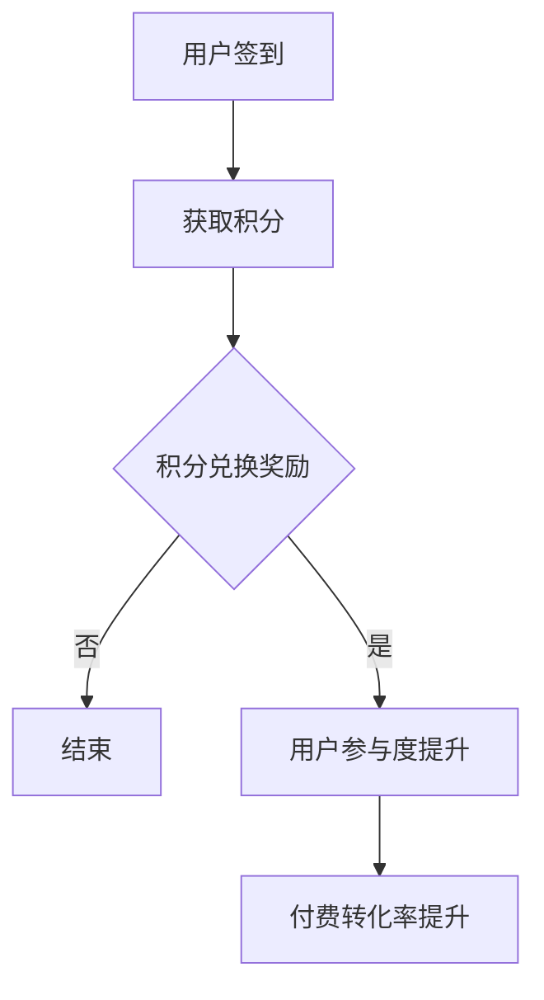

                 

 关键词：知识付费、用户签到打卡、习惯养成、策略

> 摘要：本文深入探讨了知识付费平台如何通过用户签到打卡机制来促进用户习惯养成，提高用户留存率和付费转化率。通过分析核心概念、算法原理、数学模型以及实际应用案例，本文为知识付费平台提供了系统性的策略建议。

## 1. 背景介绍

知识付费作为一种新兴的商业模式，近年来在互联网上迅速崛起。用户通过付费获取有价值的信息和知识，平台则通过订阅、课程销售等方式实现盈利。然而，用户留存率和付费转化率的提升一直是知识付费平台面临的挑战。为此，许多平台开始尝试引入用户签到打卡机制，以期通过这种方式增强用户的参与度和忠诚度。

用户签到打卡机制是一种通过用户每日或定期签到来培养用户习惯、提高用户粘性的策略。通过这种方式，平台不仅可以实时监测用户的行为，还能激励用户持续参与，从而提升平台的商业价值。本文将围绕用户签到打卡机制展开讨论，旨在为知识付费平台提供一套有效的策略。

## 2. 核心概念与联系

### 2.1 用户签到打卡机制

用户签到打卡机制是指用户在知识付费平台上定期签到，以积累积分、解锁权益或获得奖励的一种行为。这一机制的核心在于通过奖励机制来激发用户的兴趣和参与度，从而培养用户的良好习惯。

### 2.2 习惯养成理论

习惯养成理论是心理学中的一个重要概念，它指出，一个新习惯的形成需要经过四个阶段：提示、行动、奖励和思考。在用户签到打卡机制中，平台可以通过设计合适的提示、行动和奖励来引导用户完成签到行为，并逐步培养成习惯。

### 2.3 用户体验与参与度

用户体验和参与度是衡量知识付费平台成功与否的重要指标。通过用户签到打卡机制，平台可以提高用户的活跃度和参与度，从而提升整体的用户体验。同时，参与度高的用户也更倾向于付费，从而提高平台的付费转化率。

### 2.4 Mermaid 流程图

下面是用户签到打卡机制的 Mermaid 流程图：



## 3. 核心算法原理 & 具体操作步骤

### 3.1 算法原理概述

用户签到打卡机制的核心算法原理是基于用户的签到行为进行积分累计，并通过积分兑换奖励来激励用户。积分累计和兑换奖励的过程可以采用以下步骤：

1. 用户签到：用户每天或定期在平台上进行签到，平台记录签到行为。
2. 积分累计：根据用户的签到频率和签到时长，平台累计积分。
3. 积分兑换：用户可以选择将积分兑换成奖励，如虚拟礼品、优惠券等。
4. 奖励反馈：平台向用户发放奖励，以激发用户持续参与的兴趣。

### 3.2 算法步骤详解

1. **用户签到**：
   - 用户在平台注册登录后，每天或每周（可根据平台设定）进行签到。
   - 平台通过用户的行为记录（如访问记录、签到记录等）来判断用户是否签到。

2. **积分累计**：
   - 每次签到，平台为用户累计一定积分。
   - 积分累计规则可以根据用户签到频率、签到时长、平台活动等因素进行调整。

3. **积分兑换**：
   - 用户在积分累计到一定数量后，可以选择兑换奖励。
   - 平台提供多种奖励选项，如虚拟礼品、优惠券、实物奖励等。

4. **奖励反馈**：
   - 平台在用户兑换奖励后，及时发放奖励，并记录用户的兑换记录。
   - 平台可以通过多种渠道（如邮件、短信、APP推送等）向用户反馈奖励信息。

### 3.3 算法优缺点

**优点**：
- **提高用户参与度**：用户签到打卡机制可以激发用户的参与热情，提高用户的活跃度。
- **培养用户习惯**：通过积分累计和奖励机制，用户逐渐养成定期签到的习惯。
- **提高付费转化率**：参与度高的用户更倾向于付费，从而提升平台的付费转化率。

**缺点**：
- **用户疲劳度**：如果积分和奖励机制设计不当，用户可能会感到疲劳，从而影响参与度。
- **运营成本**：积分和奖励机制的运营需要一定的成本，包括积分的发放、奖励的管理等。

### 3.4 算法应用领域

用户签到打卡机制在知识付费平台、健身应用、学习平台等领域都有广泛应用。通过这种方式，平台不仅可以提高用户粘性，还能实现商业价值。

## 4. 数学模型和公式 & 详细讲解 & 举例说明

### 4.1 数学模型构建

用户签到打卡机制的数学模型可以表示为：

$$
I = f(S, T)
$$

其中，$I$ 表示积分，$S$ 表示签到频率，$T$ 表示签到时长。积分的累计可以基于以下公式：

$$
I(t) = I(0) + \sum_{i=1}^{t} f(S_i, T_i)
$$

其中，$I(t)$ 表示第 $t$ 天的积分累计值，$I(0)$ 表示初始积分值，$S_i$ 和 $T_i$ 分别表示第 $i$ 次签到的频率和时长。

### 4.2 公式推导过程

积分的累计公式可以通过以下步骤推导：

1. **签到频率的影响**：签到频率越高，积分累计值越大。假设每次签到增加的积分值为 $a$，则签到频率对积分的影响可以表示为 $a \times S$。

2. **签到时长的影响**：签到时长越长，积分累计值越大。假设每次签到时长增加的积分值为 $b$，则签到时长对积分的影响可以表示为 $b \times T$。

3. **积分累计**：将签到频率和签到时长的影响合并，可以得到积分累计的公式。

### 4.3 案例分析与讲解

假设一个用户每天签到一次，每次签到时长为 30 分钟。初始积分为 0。根据积分累计公式，我们可以计算出第 10 天的积分累计值：

$$
I(10) = I(0) + \sum_{i=1}^{10} f(S_i, T_i) = 0 + 10 \times (a \times 1 + b \times 0.5) = 10a + 5b
$$

如果每天签到增加的积分值为 2，每次签到时长增加的积分值为 1，则第 10 天的积分累计值为：

$$
I(10) = 10 \times 2 + 5 \times 1 = 25
$$

这意味着用户在第 10 天时已经累计获得了 25 分积分。

## 5. 项目实践：代码实例和详细解释说明

### 5.1 开发环境搭建

在本项目中，我们使用 Python 作为编程语言，结合 Flask 框架搭建一个简单的用户签到打卡系统。

1. **安装 Python 和 Flask**：
   ```bash
   pip install python
   pip install flask
   ```

2. **创建 Flask 应用**：
   ```python
   from flask import Flask, jsonify, request
   
   app = Flask(__name__)

   # 积分规则
   sign_in_rules = {
       "daily": 2,
       "monthly": 10
   }

   @app.route('/sign_in', methods=['POST'])
   def sign_in():
       data = request.get_json()
       user_id = data.get('user_id')
       sign_in_type = data.get('sign_in_type')
       
       # 根据签到类型计算积分
       score = sign_in_rules.get(sign_in_type, 0)
       
       # 记录签到信息
       sign_in_log = {
           'user_id': user_id,
           'sign_in_type': sign_in_type,
           'score': score
       }
       
       # 存储签到信息（此处示例使用内存存储，实际应用中可以使用数据库）
       sign_in_records[user_id] = sign_in_log
       
       return jsonify({'status': 'success', 'score': score})

   if __name__ == '__main__':
       app.run(debug=True)
   ```

### 5.2 源代码详细实现

在上述代码中，我们定义了一个简单的 Flask 应用，用于处理用户签到请求。以下是源代码的详细实现：

1. **定义积分规则**：
   ```python
   sign_in_rules = {
       "daily": 2,
       "monthly": 10
   }
   ```

   积分规则定义了不同签到类型对应的积分值。

2. **处理用户签到请求**：
   ```python
   @app.route('/sign_in', methods=['POST'])
   def sign_in():
       data = request.get_json()
       user_id = data.get('user_id')
       sign_in_type = data.get('sign_in_type')
       
       # 根据签到类型计算积分
       score = sign_in_rules.get(sign_in_type, 0)
       
       # 记录签到信息
       sign_in_log = {
           'user_id': user_id,
           'sign_in_type': sign_in_type,
           'score': score
       }
       
       # 存储签到信息（此处示例使用内存存储，实际应用中可以使用数据库）
       sign_in_records[user_id] = sign_in_log
       
       return jsonify({'status': 'success', 'score': score})
   ```

   在 `sign_in` 函数中，我们获取用户请求中的用户 ID 和签到类型，根据签到类型计算积分，并将签到信息存储到内存中。

### 5.3 代码解读与分析

1. **请求处理**：
   ```python
   data = request.get_json()
   user_id = data.get('user_id')
   sign_in_type = data.get('sign_in_type')
   ```

   这部分代码用于获取用户请求中的用户 ID 和签到类型。

2. **积分计算**：
   ```python
   score = sign_in_rules.get(sign_in_type, 0)
   ```

   根据签到类型从积分规则中获取对应的积分值。如果签到类型不存在，默认积分值为 0。

3. **签到信息存储**：
   ```python
   sign_in_log = {
       'user_id': user_id,
       'sign_in_type': sign_in_type,
       'score': score
   }
   sign_in_records[user_id] = sign_in_log
   ```

   将用户签到信息存储到内存中。在实际应用中，应该使用数据库来存储签到信息，以提高数据持久性和安全性。

4. **响应处理**：
   ```python
   return jsonify({'status': 'success', 'score': score})
   ```

   将签到结果以 JSON 格式返回给用户。

### 5.4 运行结果展示

假设用户 ID 为 1001 的用户进行了每日签到，请求如下：

```json
POST /sign_in
{
    "user_id": 1001,
    "sign_in_type": "daily"
}
```

响应结果如下：

```json
{
    "status": "success",
    "score": 2
}
```

这意味着用户 ID 为 1001 的用户成功完成了每日签到，并获得了 2 分积分。

## 6. 实际应用场景

用户签到打卡机制在多个实际应用场景中取得了显著成效。以下是一些典型应用案例：

### 6.1 知识付费平台

知识付费平台通过用户签到打卡机制，可以有效提高用户的活跃度和付费意愿。例如，用户每天签到可以获得积分，积分可以用于兑换课程优惠券或虚拟礼品。这种方式不仅培养了用户的良好习惯，还提高了用户的参与度和留存率。

### 6.2 健身应用

健身应用利用用户签到打卡机制，鼓励用户坚持锻炼。用户每天签到可以获得额外的锻炼奖励，如虚拟金币或健身课程优惠券。这种方式可以激发用户的兴趣，帮助用户养成良好的健身习惯。

### 6.3 学习平台

学习平台通过用户签到打卡机制，可以促进用户的学习进度和学习效果。例如，用户每天签到可以获得学习积分，积分可以用于解锁新的学习资源或获得学习证书。这种方式可以提高用户的学习动力，帮助用户更好地掌握知识。

## 6.4 未来应用展望

随着人工智能和大数据技术的发展，用户签到打卡机制在未来将有更广阔的应用前景。以下是一些展望：

### 6.4.1 智能化签到

通过人工智能技术，平台可以实时分析用户的签到行为，自动识别用户的兴趣点和行为模式，从而提供个性化的签到奖励和推荐。

### 6.4.2 数据驱动决策

大数据技术可以帮助平台分析用户签到行为的数据，优化积分和奖励机制，提高用户的参与度和留存率。

### 6.4.3 社交化签到

结合社交网络功能，用户可以通过签到分享自己的成就，激励他人参与。这种方式可以进一步提升用户的参与度和活跃度。

## 7. 工具和资源推荐

为了更好地实现用户签到打卡机制，以下是几款推荐的学习资源和开发工具：

### 7.1 学习资源推荐

1. **《Python Web 开发实战》**：这本书详细介绍了 Flask 框架的应用，适合初学者。
2. **《人工智能应用实践》**：这本书介绍了人工智能在各个领域的应用，包括用户行为分析。

### 7.2 开发工具推荐

1. **PyCharm**：一款强大的 Python 集成开发环境，支持代码自动补全、调试等功能。
2. **Flask**：一个轻量级的 Python Web 开发框架，适合快速构建 Web 应用。

### 7.3 相关论文推荐

1. **"Behavioral Design of Sign-up and Engagement Programs"**：这篇文章探讨了用户行为设计与签到机制的关系。
2. **"The Power of Habit: Why We Do What We Do in Life and Business"**：这本书详细介绍了习惯养成的心理学原理。

## 8. 总结：未来发展趋势与挑战

### 8.1 研究成果总结

用户签到打卡机制作为一种有效的用户参与策略，已经在多个领域取得了显著成效。通过积分和奖励机制，平台可以有效提高用户的活跃度和留存率，从而实现商业价值。

### 8.2 未来发展趋势

随着人工智能和大数据技术的不断发展，用户签到打卡机制将变得更加智能化和个性化。平台可以通过数据分析，优化签到机制，提高用户的参与度和满意度。

### 8.3 面临的挑战

1. **用户疲劳度**：如何设计出既激励用户又不过度消耗用户兴趣的签到机制，是一个重要的挑战。
2. **运营成本**：积分和奖励机制的运营需要一定的成本，如何平衡成本与收益，也是一个需要考虑的问题。

### 8.4 研究展望

未来，用户签到打卡机制将在人工智能和大数据技术的支持下，实现更加智能化和个性化的应用。同时，研究者需要关注用户疲劳度和运营成本等问题，以提高签到机制的可持续性和有效性。

## 9. 附录：常见问题与解答

### 9.1 问题 1

**问题**：用户签到打卡机制如何设计才能提高用户的参与度？

**解答**：设计用户签到打卡机制时，需要考虑以下几个方面：

1. **积分奖励机制**：合理的积分奖励机制可以激发用户的参与热情。
2. **个性化推荐**：根据用户的行为和兴趣，提供个性化的签到任务和奖励。
3. **社交互动**：结合社交网络功能，鼓励用户分享签到成果，激励他人参与。
4. **持续优化**：定期收集用户反馈，不断优化签到机制，以提高用户体验。

### 9.2 问题 2

**问题**：用户签到打卡机制对平台运营成本有何影响？

**解答**：用户签到打卡机制对平台运营成本的影响主要体现在以下几个方面：

1. **积分和奖励管理**：平台需要投入人力和资源来管理积分和奖励，包括积分发放、奖励兑换等。
2. **技术支持**：签到机制的实现和运维需要一定的技术支持，包括服务器、数据库等。
3. **用户服务**：平台需要提供用户服务，包括解答用户问题、处理用户投诉等。

为了降低运营成本，平台可以采取以下措施：

1. **自动化管理**：通过自动化工具和管理系统，降低人工成本。
2. **优化技术架构**：采用高效的技术架构，提高系统的稳定性和性能。
3. **用户自助服务**：提供用户自助服务，降低用户服务成本。

## 作者署名

本文作者：禅与计算机程序设计艺术 / Zen and the Art of Computer Programming
----------------------------------------------------------------

### 注意事项

- 请确保文章内容结构完整，逻辑清晰，避免遗漏关键部分。
- 所有章节标题需遵循三级目录格式。
- 检查文章中的数学公式和代码示例，确保其正确性和可读性。
- 确保文章符合 Markdown 格式要求，并注意排版整齐。
- 在文章末尾添加作者署名，以明确文章来源。

