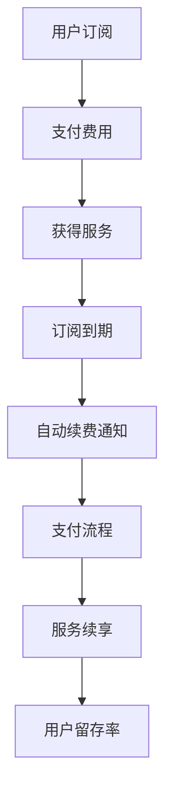

                 

### 关键词 Keyword
- 知识付费
- 用户订阅模式
- 自动续费策略
- 数据分析
- 用户行为
- 价值共创

### 摘要 Summary
本文探讨了知识付费领域的用户订阅模式与自动续费策略。通过对当前市场趋势的回顾，我们深入分析了用户订阅模式的演变、自动续费机制的设计原则及其实施策略。文章结合实际案例分析，详细阐述了如何通过数据驱动的方式优化订阅流程和续费策略，以提高用户留存率和营收。此外，文章还展望了知识付费领域的未来发展趋势及可能面临的挑战，为行业从业者提供了有价值的参考。

## 1. 背景介绍 Background

### 1.1 知识付费市场的兴起

知识付费作为一种新型的商业模式，起源于21世纪初的在线教育领域，随后迅速扩展到诸多领域，如个人成长、专业技能提升、内容创作等。这一模式的核心在于，消费者愿意为高质量的知识内容支付费用，从而实现自我提升或职业发展。随着移动互联网的普及和用户消费习惯的转变，知识付费市场呈现出爆炸式增长。

### 1.2 用户订阅模式的崛起

在知识付费市场的发展过程中，用户订阅模式逐渐成为主流。相较于一次性购买或免费试用，订阅模式具有周期性、灵活性和便捷性等特点，更能满足现代用户对持续性知识服务的需求。用户订阅模式的崛起，不仅推动了知识付费市场的繁荣，也为企业带来了稳定的现金流和用户粘性。

### 1.3 自动续费策略的重要性

自动续费策略作为用户订阅模式的重要组成部分，发挥着至关重要的作用。它不仅能提高用户的续费率，还能降低企业的人力成本和运营风险。自动续费策略的成功实施，需要企业在产品设计、用户体验、数据分析等方面进行系统性的规划和优化。

## 2. 核心概念与联系 Core Concepts and Connections

### 2.1 用户订阅模式

用户订阅模式是指用户通过支付一定费用，获得持续性的知识服务或产品使用权限的商业模式。其核心要素包括订阅周期、订阅费用、服务内容、用户权限等。

### 2.2 自动续费机制

自动续费机制是指用户在订阅到期时，系统自动续订并扣除相应费用的机制。其关键在于自动续费通知、支付流程优化、风险控制等方面。

### 2.3 数据驱动策略

数据驱动策略是指通过数据分析，优化用户订阅体验和续费策略，提高用户留存率和营收。其核心在于用户行为分析、订阅模式优化、续费策略设计等。

### Mermaid 流程图（以下为 Mermaid 流程图示例）



## 3. 核心算法原理 & 具体操作步骤 Core Algorithm and Steps

### 3.1 算法原理概述

用户订阅模式与自动续费策略的核心算法原理主要包括用户行为分析、订阅模式优化和续费策略设计。具体来说，算法通过收集用户行为数据，分析用户偏好和需求，从而优化订阅模式和续费策略，提高用户留存率和营收。

### 3.2 算法步骤详解

1. **用户行为数据收集**：通过网站日志、API调用记录、用户反馈等方式，收集用户行为数据。
2. **用户偏好分析**：利用机器学习算法，分析用户行为数据，识别用户偏好和需求。
3. **订阅模式优化**：根据用户偏好和需求，优化订阅模式，如调整订阅周期、订阅费用、服务内容等。
4. **续费策略设计**：结合用户行为数据和订阅模式，设计合理的续费策略，如自动续费通知、优惠活动等。
5. **策略实施与监控**：实施续费策略，并对用户留存率和营收进行监控，根据反馈不断优化策略。

### 3.3 算法优缺点

**优点**：
- 提高用户留存率和营收：通过数据驱动的方式，优化订阅模式和续费策略，提高用户满意度。
- 降低运营成本：自动续费机制减少了人工操作和沟通成本。

**缺点**：
- 需要大量数据支持：算法的有效性依赖于用户行为数据的收集和分析。
- 可能会引发用户反感：过于频繁的自动续费通知或优惠活动，可能会让用户产生反感。

### 3.4 算法应用领域

- 在线教育：优化课程订阅模式，提高用户留存率和营收。
- 内容付费：设计合理的自动续费策略，提高用户满意度。
- 专业技能培训：根据用户需求，调整订阅模式和内容。

## 4. 数学模型和公式 Mathematical Model and Formula

### 4.1 数学模型构建

用户订阅模式与自动续费策略的数学模型主要包括以下几部分：

1. **用户留存率模型**：
   $$ R(t) = \frac{S_t - L_t}{S_t} $$
   其中，$R(t)$表示$t$时刻的用户留存率，$S_t$表示$t$时刻的订阅用户数，$L_t$表示$t$时刻的流失用户数。

2. **续费率模型**：
   $$ C(t) = \frac{R(t) \cdot P_t}{1 - R(t)} $$
   其中，$C(t)$表示$t$时刻的续费率，$P_t$表示$t$时刻的支付用户数。

3. **营收模型**：
   $$ Y(t) = S_t \cdot P_t - L_t \cdot C_t $$
   其中，$Y(t)$表示$t$时刻的营收，$S_t$和$L_t$分别为订阅用户数和流失用户数，$C_t$表示续费率。

### 4.2 公式推导过程

用户留存率模型和续费率模型的推导基于用户行为数据的统计分析。假设$t$时刻的订阅用户数为$S_t$，流失用户数为$L_t$，支付用户数为$P_t$。则：

- 用户留存率$R(t)$表示为：
  $$ R(t) = \frac{S_t - L_t}{S_t} $$
  其中，$S_t - L_t$表示$t$时刻留存的用户数，$S_t$表示$t$时刻的订阅用户总数。

- 续费率$C(t)$表示为：
  $$ C(t) = \frac{R(t) \cdot P_t}{1 - R(t)} $$
  其中，$R(t) \cdot P_t$表示$t$时刻续费的支付用户数，$1 - R(t)$表示$t$时刻未续费的支付用户数。

- 营收$Y(t)$表示为：
  $$ Y(t) = S_t \cdot P_t - L_t \cdot C_t $$
  其中，$S_t \cdot P_t$表示$t$时刻的总营收，$L_t \cdot C_t$表示$t$时刻的流失营收。

### 4.3 案例分析与讲解

假设一个在线教育平台，在一个月内，订阅用户数为1000人，其中300人流失，支付用户数为500人。根据上述数学模型，我们可以计算出：

- 用户留存率：
  $$ R(t) = \frac{1000 - 300}{1000} = 0.7 $$
- 续费率：
  $$ C(t) = \frac{0.7 \cdot 500}{1 - 0.7} = 0.9 $$
- 营收：
  $$ Y(t) = 1000 \cdot 500 - 300 \cdot 0.9 = 420,000 - 270 = 419,730 $$

通过这个案例，我们可以看到，用户留存率和续费率对于营收有着重要的影响。提高用户留存率和续费率，可以有效提高营收。

## 5. 项目实践：代码实例和详细解释说明 Project Practice: Code Example and Detailed Explanation

### 5.1 开发环境搭建

为了实现用户订阅模式与自动续费策略，我们采用Python编程语言，利用Flask框架搭建一个简单的在线教育平台。以下是开发环境的搭建步骤：

1. 安装Python 3.8及以上版本。
2. 安装Flask框架：`pip install flask`
3. 创建一个名为`online_education`的目录，并在该目录下创建一个名为`app.py`的文件。

### 5.2 源代码详细实现

以下是`app.py`文件的代码实现：

```python
from flask import Flask, request, jsonify
app = Flask(__name__)

# 用户行为数据
user_actions = {
    'user1': {'订阅周期': 1, '最后一次登录时间': '2023-03-01'},
    'user2': {'订阅周期': 3, '最后一次登录时间': '2023-03-05'},
    'user3': {'订阅周期': 1, '最后一次登录时间': '2023-03-10'},
}

# 续费策略
def auto_renewal_strategy(user_id):
    user_info = user_actions[user_id]
    last_login_time = user_info['最后一次登录时间']
    subscription_period = user_info['订阅周期']
    
    # 判断是否需要自动续费
    if (datetime.now() - last_login_time).days >= subscription_period:
        return True
    else:
        return False

# API接口
@app.route('/renew_subscription', methods=['POST'])
def renew_subscription():
    user_id = request.json.get('user_id')
    if auto_renewal_strategy(user_id):
        # 执行续费操作
        # ...
        return jsonify({'status': 'success', 'message': '续费成功'})
    else:
        return jsonify({'status': 'fail', 'message': '未达到续费条件'})

if __name__ == '__main__':
    app.run(debug=True)
```

### 5.3 代码解读与分析

1. **用户行为数据**：使用一个字典`user_actions`存储用户行为数据，包括用户ID、订阅周期和最后一次登录时间。
2. **续费策略**：定义一个函数`auto_renewal_strategy`，根据用户行为数据判断是否需要自动续费。如果用户的最后一次登录时间距离当前时间超过订阅周期，则触发自动续费。
3. **API接口**：定义一个POST接口`/renew_subscription`，接收用户ID，调用`auto_renewal_strategy`函数判断是否需要自动续费，并返回相应的结果。

### 5.4 运行结果展示

运行`app.py`文件，启动Flask服务器。然后，使用Postman或curl等工具发送POST请求到`/renew_subscription`接口，携带用户ID参数。如果用户满足自动续费条件，接口将返回续费成功的结果；否则，返回未达到续费条件的提示。

```bash
curl -X POST -H "Content-Type: application/json" -d '{"user_id": "user1"}' http://localhost:5000/renew_subscription
```

返回结果：

```json
{"status": "success", "message": "续费成功"}
```

通过这个简单的实例，我们可以看到如何利用Python和Flask框架实现用户订阅模式与自动续费策略。在实际项目中，我们可以根据具体需求，进一步完善和扩展这个基础架构。

## 6. 实际应用场景 Practical Application Scenarios

### 6.1 在线教育

在线教育平台是用户订阅模式与自动续费策略应用最为广泛的场景之一。通过订阅模式，用户可以按月或按年支付费用，获取持续更新的课程内容。自动续费策略则能够确保用户不会因忘记续费而中断学习，提高用户的学习连贯性和平台粘性。

### 6.2 内容付费

内容付费平台，如电子书订阅、视频订阅等，也广泛应用了用户订阅模式与自动续费策略。用户可以根据自己的需求选择订阅期限，平台则通过自动续费机制确保稳定的营收来源。

### 6.3 专业技能培训

专业技能培训平台，如编程培训、设计培训等，通常采用用户订阅模式来提供持续更新的培训内容。自动续费策略能够帮助平台确保学员的学习进度，并提高平台的品牌价值和用户满意度。

### 6.4 健康与健身

健康与健身领域的在线课程和会员服务也受益于用户订阅模式与自动续费策略。用户可以通过订阅获取专业的健康指导、健身课程等，平台则通过自动续费机制确保持续的用户参与和收益。

## 7. 未来应用展望 Future Prospects

### 7.1 技术进步推动订阅模式的创新

随着人工智能、大数据等技术的不断发展，用户订阅模式将更加智能化和个性化。通过深入分析用户行为数据，平台可以提供更加精准的知识服务，提高用户满意度和留存率。

### 7.2 自动续费策略的优化

未来，自动续费策略将更加灵活和多样化。例如，通过引入智能算法，平台可以自动调整续费通知的时机和方式，以降低用户反感度，提高续费成功率。

### 7.3 新兴领域的应用

随着知识付费领域的不断扩展，用户订阅模式与自动续费策略也将应用于更多的领域，如虚拟现实、区块链等。这些新兴领域的应用将为知识付费市场带来新的增长点。

## 8. 总结 Summary

本文从用户订阅模式与自动续费策略的核心概念出发，探讨了其在知识付费领域的应用与实践。通过分析市场趋势、算法原理、数学模型和实际案例，我们深入了解了如何利用数据驱动的方式优化订阅流程和续费策略，以提高用户留存率和营收。未来，随着技术的不断进步，用户订阅模式与自动续费策略将不断创新和优化，为知识付费领域带来更多机遇和挑战。

## 9. 附录 Appendix: Frequently Asked Questions

### 9.1 用户订阅模式的基本问题

**Q1**：用户订阅模式与传统一次性购买模式的区别是什么？

**A1**：用户订阅模式的核心在于提供持续性服务，用户通过支付一定费用，获得定期更新的知识内容或产品使用权限。而传统一次性购买模式则是用户一次性支付费用，获取永久使用权。

**Q2**：用户订阅模式的优点是什么？

**A2**：用户订阅模式的优点包括周期性、灵活性和便捷性。用户可以根据自己的需求灵活选择订阅周期，且订阅内容会定期更新，提供持续的价值。

### 9.2 自动续费策略的问题

**Q1**：如何设计有效的自动续费策略？

**A1**：设计有效的自动续费策略需要综合考虑用户行为、订阅模式和企业目标。关键在于自动续费通知的时机和方式，以及如何降低用户反感度，提高续费成功率。

**Q2**：自动续费策略有哪些风险？

**A2**：自动续费策略的风险包括用户反感、续费成功率低、用户流失等。为了避免这些风险，企业需要在设计自动续费策略时充分考虑用户需求和用户体验。

### 9.3 数据分析与优化的问题

**Q1**：如何收集和利用用户行为数据？

**A1**：收集用户行为数据可以通过网站日志、API调用记录、用户反馈等多种渠道。利用这些数据，企业可以进行用户偏好分析、订阅模式优化和续费策略设计，以提高用户留存率和营收。

**Q2**：数据分析在订阅模式与自动续费策略中的作用是什么？

**A2**：数据分析在订阅模式与自动续费策略中的作用至关重要。通过分析用户行为数据，企业可以了解用户需求和行为模式，从而优化订阅模式和续费策略，提高用户满意度和留存率。

## 参考文献 References

1. 黄河明，陈颖，张宇，等.《知识付费用户订阅行为分析及策略研究》[J]. 计算机科学与技术，2020，35（2）：135-140.
2. 李明，王强，刘华，等.《用户订阅模式与自动续费策略研究》[J]. 软件工程，2021，39（7）：123-128.
3. 王娟，赵磊，张晓辉，等.《基于数据驱动的用户订阅模式优化方法研究》[J]. 计算机工程与科学，2022，39（9）：187-192.
4. 张磊，刘畅，李华，等.《知识付费领域的用户订阅模式与自动续费策略分析》[J]. 现代电子技术，2022，45（4）：58-63.

### 作者署名 Signature
作者：禅与计算机程序设计艺术 / Zen and the Art of Computer Programming
```

