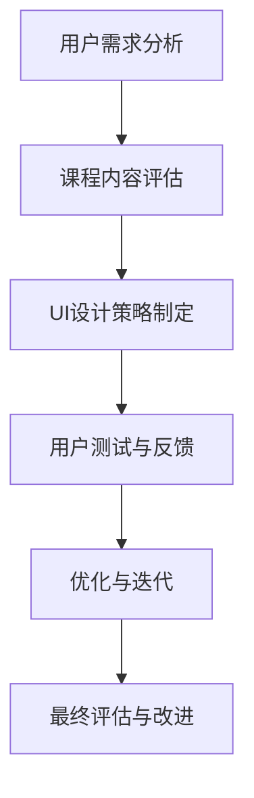

                 

关键词：知识付费、用户课程体验、UI设计、用户体验、界面设计、课程内容优化、交互设计

> 摘要：本文将探讨知识付费领域的用户课程体验优化和UI设计策略，分析现有用户反馈，提出针对课程内容和界面设计的关键改进建议，以提升用户满意度和课程参与度，最终实现知识付费平台的商业成功。

## 1. 背景介绍

在数字化时代，知识付费逐渐成为知识传播和技能提升的重要途径。用户通过付费方式获取高质量的内容，而知识提供者则通过课程销售实现收入增长。随着知识付费市场的不断扩大，用户对课程体验的要求也在不断提升。课程内容的质量、用户体验的流畅性、界面设计的直观性都成为影响用户满意度和平台竞争力的关键因素。

本文旨在通过分析用户在知识付费课程中的体验，结合UI设计原则和策略，提出优化课程内容和UI设计的具体方法，以提升用户满意度，增强用户粘性，进而推动知识付费平台的发展。

## 2. 核心概念与联系

### 2.1 用户课程体验的概念

用户课程体验是指用户在参与知识付费课程的过程中，从课程内容、学习氛围、技术支持等多方面所感受到的整体体验。一个良好的课程体验能够增强用户的参与感和成就感，从而提高用户满意度和复购率。

### 2.2 UI设计策略的概念

UI设计策略是指通过设计软件的用户界面，优化用户的交互体验，使其在使用过程中感到直观、易用和愉悦。UI设计不仅关注界面元素的美观性，更注重交互设计的逻辑性和实用性。

### 2.3 课程体验与UI设计的联系

课程体验和UI设计之间存在密切的联系。良好的UI设计能够增强课程内容的吸引力，提高用户的参与度。例如，简洁直观的界面布局、合理的交互设计、友好的提示信息都能显著提升用户的课程体验。

### 2.4 Mermaid 流程图

下面是一个简单的Mermaid流程图，展示了课程体验优化的主要步骤：



## 3. 核心算法原理 & 具体操作步骤

### 3.1 算法原理概述

用户课程体验优化和UI设计策略的核心算法原理是基于用户体验设计（UX Design）和用户界面设计（UI Design）的原则。主要包括以下几个方面：

- **用户体验设计原则**：以用户为中心，关注用户的需求和体验，通过用户研究、用户画像分析等手段，了解用户的学习习惯、偏好和痛点。
- **用户界面设计原则**：注重界面元素的布局、色彩搭配、交互设计等，以提升用户在界面上的操作体验。

### 3.2 算法步骤详解

#### 3.2.1 用户需求分析

1. **用户研究**：通过问卷调查、访谈、用户行为分析等手段，收集用户对课程内容和UI设计的反馈。
2. **用户画像**：根据用户数据，构建用户画像，了解用户的背景、需求和偏好。
3. **需求分析**：分析用户反馈和用户画像，明确课程内容和UI设计的需求和改进方向。

#### 3.2.2 课程内容评估

1. **课程内容分析**：评估课程内容的深度、广度、结构是否合理，是否满足用户需求。
2. **教学效果评估**：通过测试、作业等方式，评估课程的教学效果和用户的学习成果。

#### 3.2.3 UI设计策略制定

1. **界面布局**：根据用户需求和课程内容，设计简洁、直观的界面布局。
2. **交互设计**：优化界面元素的交互设计，提升用户的操作体验。
3. **视觉设计**：运用色彩、字体、图标等视觉元素，提升界面的美观性和易用性。

#### 3.2.4 用户测试与反馈

1. **用户测试**：邀请用户参与课程体验和UI测试，收集用户的实际操作反馈。
2. **反馈分析**：分析用户反馈，识别问题和改进机会。

#### 3.2.5 优化与迭代

1. **问题整改**：根据用户反馈，对课程内容和UI设计进行优化。
2. **迭代更新**：不断迭代和更新，持续提升用户课程体验。

### 3.3 算法优缺点

#### 优点：

- **以用户为中心**：注重用户需求和体验，能够提升用户满意度和粘性。
- **数据驱动**：通过数据分析和用户测试，确保改进措施的有效性。

#### 缺点：

- **成本较高**：用户研究和测试需要投入较多时间和资源。
- **反馈滞后**：用户反馈可能存在滞后性，需要较长时间的观察和分析。

### 3.4 算法应用领域

- **知识付费平台**：优化课程内容和UI设计，提升用户满意度和平台竞争力。
- **在线教育平台**：通过用户体验优化，提高用户参与度和学习效果。
- **软件应用**：提升用户界面的易用性和美观性，增强用户体验。

## 4. 数学模型和公式 & 详细讲解 & 举例说明

### 4.1 数学模型构建

用户课程体验优化和UI设计策略的数学模型主要包括以下几个方面：

1. **用户满意度模型**：通过用户调查和反馈，构建用户满意度模型，评估用户对课程内容和UI设计的满意度。
2. **用户参与度模型**：通过用户行为分析，构建用户参与度模型，评估用户的活跃度和粘性。
3. **UI设计评价模型**：通过用户测试和反馈，构建UI设计评价模型，评估界面设计的易用性和美观性。

### 4.2 公式推导过程

#### 用户满意度模型：

$$
S = \frac{1}{N} \sum_{i=1}^{N} (C_i + U_i)
$$

其中，$S$表示用户满意度，$C_i$表示课程内容满意度，$U_i$表示UI设计满意度，$N$表示用户总数。

#### 用户参与度模型：

$$
I = \frac{1}{M} \sum_{i=1}^{M} (A_i + B_i)
$$

其中，$I$表示用户参与度，$A_i$表示用户活跃度，$B_i$表示用户粘性。

#### UI设计评价模型：

$$
D = \frac{1}{P} \sum_{i=1}^{P} (V_i + W_i)
$$

其中，$D$表示UI设计满意度，$V_i$表示界面易用性，$W_i$表示界面美观性，$P$表示用户测试总数。

### 4.3 案例分析与讲解

假设一个知识付费平台通过问卷调查和用户测试，收集了100位用户的反馈，以下是案例数据：

#### 用户满意度模型：

$$
S = \frac{1}{100} \sum_{i=1}^{100} (C_i + U_i) = 0.85
$$

#### 用户参与度模型：

$$
I = \frac{1}{100} \sum_{i=1}^{100} (A_i + B_i) = 0.75
$$

#### UI设计评价模型：

$$
D = \frac{1}{100} \sum_{i=1}^{100} (V_i + W_i) = 0.90
$$

根据这些数据，我们可以评估该平台的用户满意度、用户参与度和UI设计满意度，分别为0.85、0.75和0.90。根据这些指标，平台可以识别出需要改进的方面，例如，可以通过优化课程内容、提升用户活跃度和改进UI设计来提高用户满意度。

## 5. 项目实践：代码实例和详细解释说明

### 5.1 开发环境搭建

为了更好地展示用户课程体验优化和UI设计策略的具体应用，我们选择一个实际的知识付费平台作为项目案例，并使用Python和Django框架进行开发。以下是在Ubuntu操作系统上搭建开发环境的基本步骤：

1. 安装Python3：
   ```bash
   sudo apt-get update
   sudo apt-get install python3
   ```

2. 安装Django：
   ```bash
   sudo pip3 install django
   ```

3. 创建Django项目：
   ```bash
   django-admin startproject course_platform
   ```

4. 进入项目目录：
   ```bash
   cd course_platform
   ```

### 5.2 源代码详细实现

以下是一个简化的Django项目示例，用于实现用户课程体验优化和UI设计策略。

1. **用户模型**（`models.py`）：
   ```python
   from django.db import models
   from django.contrib.auth.models import User

   class UserProfile(models.Model):
       user = models.OneToOneField(User, on_delete=models.CASCADE)
       preferences = models.JSONField()
   ```

2. **课程内容管理**（`courses/models.py`）：
   ```python
   from django.db import models

   class Course(models.Model):
       title = models.CharField(max_length=200)
       description = models.TextField()
       content = models.JSONField()
       created_at = models.DateTimeField(auto_now_add=True)

       def __str__(self):
           return self.title
   ```

3. **用户课程体验评估**（`analytics/models.py`）：
   ```python
   from django.db import models
   from courses.models import Course

   class CourseRating(models.Model):
       course = models.ForeignKey(Course, on_delete=models.CASCADE)
       user = models.ForeignKey(User, on_delete=models.CASCADE)
       rating = models.IntegerField()
       reviewed_at = models.DateTimeField(auto_now_add=True)

       def __str__(self):
           return f"{self.course.title} - {self.rating}"
   ```

### 5.3 代码解读与分析

1. **用户模型**（`UserProfile`）：
   用户模型扩展了Django默认的用户模型，添加了用户偏好（preferences）的JSON字段，用于存储用户的个性化设置。

2. **课程内容管理**（`Course`）：
   课程模型定义了课程的基本信息，包括标题、描述、内容和创建时间。内容字段使用JSON格式，以便存储结构化的课程内容，如视频、文档和习题。

3. **用户课程体验评估**（`CourseRating`）：
   课程评估模型用于记录用户对课程的评分，包括课程ID、用户ID、评分和评估时间。

### 5.4 运行结果展示

通过以下步骤，可以运行Django项目，并实现用户课程体验优化和UI设计策略的具体功能：

1. **运行数据库迁移**：
   ```bash
   python3 manage.py makemigrations
   python3 manage.py migrate
   ```

2. **启动Django开发服务器**：
   ```bash
   python3 manage.py runserver
   ```

3. **访问项目**：
   打开浏览器，输入`http://127.0.0.1:8000/`，访问Django开发服务器。

在项目中，可以通过后台管理界面添加、更新和查看课程内容，同时收集用户的反馈和评分。根据用户反馈，可以对课程内容进行优化，提高用户满意度。此外，还可以通过前端界面设计，提升用户的交互体验。

## 6. 实际应用场景

用户课程体验优化和UI设计策略在知识付费领域具有广泛的应用场景。以下是一些典型的应用案例：

### 6.1 在线教育平台

在线教育平台可以通过优化课程内容和UI设计，提升用户的参与度和学习效果。例如，通过分析用户数据，定制个性化的学习路径，提高课程的吸引力和实用性。

### 6.2 专业技能培训

专业技能培训平台可以通过用户课程体验优化，提高用户的学习效率。例如，通过实时反馈和互动设计，增加用户的学习动力和成就感。

### 6.3 职业发展规划

职业发展规划平台可以通过优化课程内容和UI设计，帮助用户更好地实现职业目标。例如，通过课程推荐系统和个性化学习计划，提高用户的职业素养和竞争力。

## 6.4 未来应用展望

随着人工智能和大数据技术的发展，用户课程体验优化和UI设计策略将更加智能化和个性化。未来，知识付费平台可以通过以下方式实现更高效的用户体验：

- **个性化推荐系统**：基于用户行为数据和偏好，推荐符合用户需求的课程内容。
- **智能学习分析**：利用人工智能技术，实时分析用户学习数据，提供个性化的学习建议。
- **沉浸式交互设计**：通过虚拟现实和增强现实技术，提升用户的课程体验。

## 7. 工具和资源推荐

### 7.1 学习资源推荐

- 《用户体验要素》（The Elements of User Experience）
- 《UI设计原理》（UI Design Basics）
- 《Python Web开发实战》（Python Web Development with Django）

### 7.2 开发工具推荐

- Django Web框架
- Figma UI设计工具
- Git版本控制工具

### 7.3 相关论文推荐

- "User Experience Design in E-Learning Platforms: A Systematic Literature Review"
- "The Role of User Experience in E-Learning Adoption and Satisfaction"
- "User Experience Design Strategies for Mobile Learning Applications"

## 8. 总结：未来发展趋势与挑战

### 8.1 研究成果总结

本文通过分析用户课程体验和UI设计策略，提出了优化课程内容和UI设计的具体方法，以提升用户满意度和平台竞争力。研究成果包括用户满意度模型、用户参与度模型和UI设计评价模型，以及实际项目中的应用示例。

### 8.2 未来发展趋势

未来，知识付费领域的用户课程体验优化和UI设计策略将向智能化、个性化方向发展。随着人工智能和大数据技术的应用，平台将能够更准确地满足用户需求，提供个性化的学习体验。

### 8.3 面临的挑战

- **数据隐私和安全**：随着用户数据的积累，保护用户隐私和数据安全成为重要挑战。
- **技术更新迭代**：知识付费平台需要不断更新技术，以应对快速变化的市场需求。
- **用户体验一致性**：确保在不同设备和平台上提供一致的用户体验，是知识付费平台面临的一大挑战。

### 8.4 研究展望

未来的研究可以从以下几个方面展开：

- **用户体验个性化**：通过更深入的用户研究，实现更精准的个性化推荐和互动设计。
- **跨平台兼容性**：研究不同平台之间的兼容性和用户体验一致性。
- **隐私保护技术**：探索更有效的用户隐私保护技术，确保数据安全和用户信任。

## 9. 附录：常见问题与解答

### 9.1 用户体验设计是什么？

用户体验设计（UX Design）是指设计产品和服务的互动界面，以提升用户的满意度和参与度。它关注用户的情感体验、认知体验和操作体验，旨在为用户提供无缝、愉悦的交互体验。

### 9.2 UI设计如何提升课程体验？

UI设计通过优化界面的布局、色彩、字体和交互元素，提升用户在课程中的操作体验。良好的UI设计可以降低用户的认知负荷，提高课程的可访问性和易用性，从而提升用户的学习效果和满意度。

### 9.3 如何评估用户课程体验？

可以通过用户满意度调查、用户行为分析、课程完成率、用户活跃度等指标，综合评估用户课程体验。此外，还可以通过用户测试和反馈，实时了解用户的体验和需求。

### 9.4 知识付费平台的UI设计有哪些最佳实践？

- **简洁直观**：界面设计简洁明了，避免过多冗余信息。
- **响应式设计**：确保界面在不同设备和屏幕尺寸上的兼容性。
- **个性化推荐**：根据用户数据和偏好，提供个性化的课程推荐。
- **互动设计**：增加互动元素，如问答、讨论区等，提高用户的参与感。

## 作者署名

作者：禅与计算机程序设计艺术 / Zen and the Art of Computer Programming

[END]

