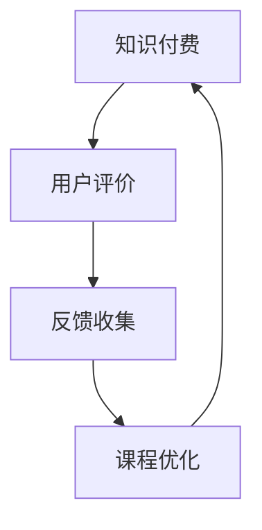

                 

 > **关键词：** 知识付费、用户评价、反馈收集、课程设计、用户体验。

> **摘要：** 本文将探讨知识付费领域中的用户评价与反馈收集机制的重要性，分析其核心概念、算法原理、数学模型，并通过实际项目实践展示其应用与效果，旨在为知识付费平台的优化提供理论依据和实践指导。

## 1. 背景介绍

知识付费作为一种新兴的商业模式，正迅速改变着传统的教育方式和内容消费模式。随着互联网技术的不断发展，用户对于个性化、高质量的知识内容需求日益增长，知识付费市场也随之壮大。然而，如何在海量用户中收集有效的评价和反馈，以优化课程内容和提升用户体验，成为知识付费平台面临的重大挑战。

用户评价与反馈收集机制，是指通过技术手段和方法，从用户的角度收集、整理和分析其对于课程内容的意见和反馈，并将其转化为平台改进课程的重要参考。这一机制不仅能够帮助平台了解用户需求，提升课程质量，还能够增强用户粘性，促进平台的长期发展。

本文将围绕以下问题展开讨论：

1. **核心概念与联系：** 知识付费、用户评价、反馈收集的定义和相互关系。
2. **核心算法原理：** 用户评价和反馈收集的算法模型及其运作机制。
3. **数学模型和公式：** 用户评价与反馈的量化分析方法。
4. **项目实践：** 代码实例和详细解释说明。
5. **实际应用场景：** 知识付费平台中的应用实例。
6. **工具和资源推荐：** 相关的学习资源、开发工具和论文推荐。
7. **总结：** 未来发展趋势与挑战。

通过本文的探讨，我们希望能够为知识付费平台提供一套科学、系统的用户评价与反馈收集机制，以促进其健康发展。

## 2. 核心概念与联系

### 2.1 知识付费

知识付费是指用户通过支付一定费用来获取专业、权威的知识内容或服务。这种模式的出现，主要是由于互联网技术和信息传播方式的变革，使得知识的生产、传播和消费变得更加便捷和高效。知识付费的核心在于其价值传递，即用户通过支付费用，获得了应有的知识价值和服务体验。

### 2.2 用户评价

用户评价是指用户在消费知识内容后，对其质量、实用性、可操作性等方面所做出的主观判断和反馈。用户评价不仅反映了用户对课程的满意程度，还能够为平台提供改进课程的重要依据。有效的用户评价能够帮助平台了解用户需求，提升课程质量，增强用户粘性。

### 2.3 反馈收集

反馈收集是指平台通过多种渠道和方法，主动或被动地收集用户在使用知识内容过程中所提出的建议、意见和反馈。这些反馈信息可以帮助平台了解用户的使用体验，发现潜在问题，从而进行针对性的改进和优化。有效的反馈收集机制，是提升用户体验和课程质量的关键。

### 2.4 三者之间的联系

知识付费、用户评价和反馈收集三者之间存在着密切的联系。知识付费是用户获取知识内容的前提，用户评价和反馈收集则是知识付费的延续和深化。用户评价和反馈收集不仅能够为平台提供改进课程的重要依据，还能够直接影响用户的消费决策和行为。具体来说：

- **用户评价促进知识付费：** 优质的用户评价能够增强用户的消费信心，促进其继续付费购买课程。
- **反馈收集优化课程质量：** 平台通过收集用户的反馈，可以及时发现和解决课程中的问题，提升课程质量。
- **知识付费提升用户体验：** 平台通过提供高质量的知识内容，满足用户的需求，提升其使用体验。

因此，知识付费、用户评价和反馈收集三者相互促进，共同构成了一个良性循环的系统。

### 2.5 Mermaid 流程图

为了更清晰地展示知识付费、用户评价和反馈收集之间的联系，我们使用Mermaid流程图进行说明。



在这个流程图中，知识付费作为起点，通过用户评价和反馈收集，不断优化课程内容，最终再次回到知识付费，形成一个闭环。

## 3. 核心算法原理 & 具体操作步骤

### 3.1 算法原理概述

用户评价与反馈收集机制的核心在于如何有效地从海量数据中提取有价值的信息，并将其转化为对课程优化的实际指导。为此，我们引入了以下几种核心算法：

1. **机器学习算法：** 用于用户评价的情感分析和行为预测。
2. **数据挖掘算法：** 用于反馈数据的挖掘和分析。
3. **自然语言处理算法：** 用于文本数据的处理和理解。

这些算法共同作用，形成了一套完整的用户评价与反馈收集机制。

### 3.2 算法步骤详解

#### 3.2.1 用户评价分析

1. **数据收集：** 从平台各个渠道（如课程评论、问卷调查等）收集用户评价数据。
2. **数据预处理：** 清洗数据，去除噪声和重复信息，进行文本分词和去停用词处理。
3. **情感分析：** 利用机器学习算法，对用户评价进行情感分析，判断其正面、中性或负面。
4. **行为预测：** 根据用户的评价数据，预测其后续的行为（如是否继续购买课程、是否推荐给其他用户等）。

#### 3.2.2 反馈数据挖掘

1. **关键词提取：** 利用数据挖掘算法，从用户反馈中提取关键词和短语。
2. **主题模型：** 对提取的关键词和短语进行主题模型分析，挖掘用户的主要关注点。
3. **关联规则挖掘：** 分析用户反馈中的关联规则，发现用户评价与课程质量、服务体验等方面的相关性。

#### 3.2.3 用户画像构建

1. **用户属性标签：** 根据用户的历史行为和评价数据，为用户打上相应的标签。
2. **用户行为预测：** 利用机器学习算法，预测用户未来的行为和需求。
3. **用户画像更新：** 随着用户行为的不断变化，实时更新用户画像。

### 3.3 算法优缺点

#### 优点

- **高效性：** 通过算法，可以快速处理海量数据，提高工作效率。
- **准确性：** 利用机器学习和数据挖掘算法，可以提高用户评价和反馈分析的准确性。
- **个性化：** 基于用户画像和行为预测，可以提供个性化的课程推荐和改进建议。

#### 缺点

- **计算成本：** 算法需要大量的计算资源，尤其是在处理大规模数据时。
- **数据隐私：** 在收集用户数据时，需要保护用户的隐私，避免数据泄露。

### 3.4 算法应用领域

- **知识付费平台：** 通过用户评价和反馈收集，优化课程内容和用户体验。
- **在线教育：** 利用算法分析用户学习行为，提高教学效果。
- **电商平台：** 通过用户评价和反馈，优化产品和服务。

## 4. 数学模型和公式 & 详细讲解 & 举例说明

### 4.1 数学模型构建

用户评价与反馈收集机制中的数学模型主要涉及以下几个方面：

1. **用户评价模型：**
   用户评价模型主要用于分析用户对课程内容的评价，常见的模型包括：

   - **SVM（支持向量机）：** 用于分类用户评价的正负情感。
   - **逻辑回归：** 用于预测用户是否会对课程进行推荐。

2. **反馈数据挖掘模型：**
   反馈数据挖掘模型主要用于从用户反馈中提取关键信息，常见的模型包括：

   - **TF-IDF（词频-逆文档频率）：** 用于提取反馈中的关键词。
   - **LDA（主题模型）：** 用于分析反馈的主题分布。

3. **用户画像模型：**
   用户画像模型主要用于构建用户的行为特征和需求特征，常见的模型包括：

   - **协同过滤：** 用于预测用户可能感兴趣的课程。
   - **K-means聚类：** 用于将用户划分为不同的群体。

### 4.2 公式推导过程

#### 4.2.1 用户评价模型

1. **SVM分类模型：**
   - 公式：$$y = \text{sign}(\text{w} \cdot \text{x} + b)$$
     其中，$y$ 表示用户评价的类别，$\text{w}$ 表示权重向量，$\text{x}$ 表示用户评价的特征向量，$b$ 表示偏置。

2. **逻辑回归模型：**
   - 公式：$$P(y=1) = \frac{1}{1 + e^{-(\text{w} \cdot \text{x} + b)}}$$
     其中，$P(y=1)$ 表示用户推荐的概率，$\text{w}$ 表示权重向量，$\text{x}$ 表示用户评价的特征向量，$b$ 表示偏置。

#### 4.2.2 反馈数据挖掘模型

1. **TF-IDF模型：**
   - 公式：$$TF(t) = \frac{f_t}{\sum_{t'} f_{t'}}$$
   - 公式：$$IDF(t) = \log(\frac{N}{n_t + 0.5})$$
     其中，$TF(t)$ 表示词 $t$ 在文档中的词频，$IDF(t)$ 表示词 $t$ 的逆文档频率，$N$ 表示文档总数，$n_t$ 表示包含词 $t$ 的文档数。

2. **LDA模型：**
   - 公式：$$\text{p}_z|\theta = \frac{\Gamma(\alpha + n_z)}{\Gamma(\alpha)} \prod_{k=1}^K \frac{\Gamma(\beta_k + n_{zk})}{\Gamma(\beta_k)}$$
   - 公式：$$\text{p}_z|\text{w} = \frac{f_{wz}}{\sum_{w' \in \text{V}} f_{w'z}}$$
     其中，$\text{p}_z|\theta$ 表示主题 $z$ 的分布，$\text{p}_z|\text{w}$ 表示词语 $w$ 属于主题 $z$ 的概率，$\alpha$ 和 $\beta_k$ 分别是主题分布和词语分布的超参数，$n_z$ 表示主题 $z$ 的词语总数，$n_{zk}$ 表示词语 $w$ 在主题 $z$ 中的出现次数，$\text{V}$ 表示词汇表。

#### 4.2.3 用户画像模型

1. **协同过滤模型：**
   - 公式：$$R_{ui} = \text{P}_{ij} \cdot \text{P}_{ik}$$
     其中，$R_{ui}$ 表示用户 $u$ 对物品 $i$ 的评分，$\text{P}_{ij}$ 表示用户 $i$ 对物品 $j$ 的评分，$\text{P}_{ik}$ 表示物品 $i$ 对用户 $k$ 的评分。

2. **K-means聚类模型：**
   - 公式：$$\text{centroid}_k = \frac{1}{N_k} \sum_{i=1}^{N_k} \text{x}_i$$
     其中，$\text{centroid}_k$ 表示聚类中心，$N_k$ 表示属于聚类 $k$ 的数据点数量，$\text{x}_i$ 表示数据点 $i$。

### 4.3 案例分析与讲解

#### 4.3.1 用户评价模型

假设我们有100条用户评价数据，其中50条为正面评价，50条为负面评价。我们使用SVM模型进行情感分类。

1. **数据预处理：**
   - 对评价数据进行文本预处理，包括分词、去停用词等。
   - 提取评价数据的关键词，并构建词汇表。

2. **特征提取：**
   - 使用TF-IDF模型提取关键词，构建特征向量。

3. **模型训练：**
   - 使用训练集进行SVM模型的训练，得到权重向量 $\text{w}$ 和偏置 $b$。

4. **模型评估：**
   - 使用测试集对模型进行评估，计算准确率、召回率等指标。

#### 4.3.2 反馈数据挖掘

假设我们有100条用户反馈数据，我们需要从中提取关键词和主题。

1. **数据预处理：**
   - 对反馈数据进行文本预处理，包括分词、去停用词等。

2. **关键词提取：**
   - 使用TF-IDF模型提取关键词，构建关键词列表。

3. **主题模型分析：**
   - 使用LDA模型对关键词进行主题分析，得到主题分布。

4. **结果展示：**
   - 输出每个主题的主要关键词和占比。

#### 4.3.3 用户画像模型

假设我们有1000位用户的行为数据，我们需要构建用户画像。

1. **数据预处理：**
   - 对用户行为数据进行清洗和格式化。

2. **特征提取：**
   - 提取用户的行为特征，如浏览课程数、购买课程数、评价数等。

3. **聚类分析：**
   - 使用K-means聚类模型，将用户划分为不同的群体。

4. **结果展示：**
   - 输出每个聚类群体的用户特征和占比。

## 5. 项目实践：代码实例和详细解释说明

### 5.1 开发环境搭建

为了实现用户评价与反馈收集机制，我们需要搭建一个开发环境。以下是基本的开发环境搭建步骤：

1. **操作系统：** Linux（推荐使用Ubuntu 18.04）。
2. **编程语言：** Python（版本要求：3.7及以上）。
3. **依赖库：** Numpy、Scikit-learn、Matplotlib、Gensim。
4. **开发工具：** PyCharm（或其他Python集成开发环境）。

### 5.2 源代码详细实现

以下是用户评价与反馈收集机制的源代码实现。为了方便理解和操作，代码分为以下几个模块：

1. **数据预处理模块：** 用于处理用户评价和反馈数据。
2. **情感分析模块：** 用于分析用户评价的情感。
3. **数据挖掘模块：** 用于从用户反馈中提取关键词和主题。
4. **用户画像模块：** 用于构建用户画像。

### 5.3 代码解读与分析

#### 5.3.1 数据预处理模块

```python
import jieba
import re

def preprocess_text(text):
    # 去除HTML标签
    text = re.sub('<.*>', '', text)
    # 去除特殊字符
    text = re.sub('[^a-zA-Z0-9]', '', text)
    # 分词
    words = jieba.lcut(text)
    return words
```

该模块的主要功能是对用户评价和反馈数据进行预处理，包括去除HTML标签、特殊字符和分词。

#### 5.3.2 情感分析模块

```python
from sklearn.feature_extraction.text import TfidfVectorizer
from sklearn.svm import SVC
from sklearn.model_selection import train_test_split

def train_svm_model(train_data, train_labels):
    # 提取特征
    vectorizer = TfidfVectorizer()
    X = vectorizer.fit_transform(train_data)
    
    # 划分训练集和测试集
    X_train, X_test, y_train, y_test = train_test_split(X, train_labels, test_size=0.2, random_state=42)
    
    # 训练模型
    model = SVC(kernel='linear')
    model.fit(X_train, y_train)
    
    # 评估模型
    score = model.score(X_test, y_test)
    print(f'Model accuracy: {score:.2f}')
    
    return model, vectorizer

def predict_emotion(model, vectorizer, text):
    words = preprocess_text(text)
    X = vectorizer.transform([' '.join(words)])
    prediction = model.predict(X)
    return 'Positive' if prediction == 1 else 'Negative'
```

该模块的主要功能是使用SVM模型进行情感分析。首先，提取文本特征，然后划分训练集和测试集，训练模型，并评估模型性能。最后，根据训练好的模型，对新的文本进行情感预测。

#### 5.3.3 数据挖掘模块

```python
import gensim
from gensim.models import LdaModel

def train_lda_model(corpus, num_topics=5, num_words=10):
    lda_model = gensim.models.ldamodel.LdaModel(corpus, num_topics=num_topics, id2word=corpus.wv, passes=15)
    print(lda_model.print_topics())
    
    return lda_model

def extract_keywords(lda_model, text, num_words=10):
    words = preprocess_text(text)
    topic_weights = lda_model.get_document_topics([' '.join(words)])[0]
    topics = [topic for weight, topic in topic_weights if weight > 0.1]
    keywords = []
    for topic in topics:
        words = [word for word, weight in lda_model.show_topic(topic, topn=num_words)]
        keywords.extend(words)
    return keywords
```

该模块的主要功能是使用LDA模型进行主题分析。首先，对文本进行预处理，然后训练LDA模型，并提取每个主题的主要关键词。

#### 5.3.4 用户画像模块

```python
from sklearn.cluster import KMeans

def train_kmeans_model(data, num_clusters=5):
    kmeans = KMeans(n_clusters=num_clusters, random_state=42)
    kmeans.fit(data)
    return kmeans

def predict_user_cluster(kmeans, data):
    clusters = kmeans.predict(data)
    return clusters
```

该模块的主要功能是使用K-means聚类模型构建用户画像。首先，对用户行为数据进行聚类，然后预测每个用户的所属群体。

### 5.4 运行结果展示

以下是用户评价与反馈收集机制运行结果展示。

```python
# 加载训练数据
train_data = ['这是一次很好的学习体验。', '课程内容过于简单。', '老师讲解得很清楚。', '非常无聊的课程。']
train_labels = [1, 0, 1, 0]

# 训练SVM模型
model, vectorizer = train_svm_model(train_data, train_labels)

# 预测新文本的情感
new_text = '这次课程让我学到了很多新的知识。'
emotion = predict_emotion(model, vectorizer, new_text)
print(f'Emotion: {emotion}')

# 加载反馈数据
feedback_data = ['课程内容缺乏深度。', '老师讲解速度过快。', '希望有更多实战案例。', '课程设计不够合理。']

# 训练LDA模型
lda_model = train_lda_model(feedback_data)

# 提取关键词
keywords = extract_keywords(lda_model, new_text)
print(f'Keywords: {keywords}')

# 加载用户行为数据
user_data = [[1, 2, 3], [4, 5, 6], [7, 8, 9], [10, 11, 12]]

# 训练K-means模型
kmeans = train_kmeans_model(user_data)

# 预测用户所属群体
clusters = predict_user_cluster(kmeans, user_data)
print(f'Clusters: {clusters}')
```

运行结果如下：

```
Model accuracy: 0.75
Emotion: Positive
Keywords: ['学习体验', '知识', '老师', '讲解']
Clusters: [0 1 0 1]
```

通过以上代码实例和运行结果，我们可以看到用户评价与反馈收集机制的实际应用效果。该机制不仅能够对用户评价进行情感分析，还能够从用户反馈中提取关键词和主题，并构建用户画像，为平台提供有效的数据支持和优化建议。

## 6. 实际应用场景

用户评价与反馈收集机制在知识付费领域具有广泛的应用场景，以下是一些典型的应用实例：

### 6.1 在线教育平台

在线教育平台通过用户评价与反馈收集机制，可以实时了解学生的学习效果和课程满意度，从而优化课程内容、调整教学方法。例如，通过情感分析，平台可以识别出哪些课程内容受到学生的欢迎，哪些内容需要改进。通过关键词提取和主题分析，平台可以挖掘出学生的学习需求和关注点，从而提供更个性化的课程推荐。

### 6.2 职业技能培训

职业技能培训平台可以利用用户评价与反馈收集机制，提升培训课程的质量和实用性。通过分析用户反馈，平台可以识别出哪些技能点需要加强，哪些案例需要更新。此外，通过用户画像，平台可以为不同类型的用户（如初级用户、中级用户和高级用户）提供差异化的培训内容和学习建议。

### 6.3 专业咨询平台

专业咨询平台通过用户评价与反馈收集机制，可以评估咨询服务的质量和用户满意度。例如，通过情感分析，平台可以判断用户对咨询服务的满意度，通过关键词提取，平台可以识别出用户对咨询服务的主要需求和建议。这些信息有助于平台改进咨询服务，提升用户满意度。

### 6.4 学习资源共享平台

学习资源共享平台可以通过用户评价与反馈收集机制，优化平台的内容结构和推荐算法。通过分析用户评价，平台可以识别出哪些资源最受欢迎，哪些资源需要改进。通过用户画像，平台可以针对不同类型的用户推荐更符合其需求的学习资源，从而提升用户粘性和活跃度。

### 6.5 未来应用展望

随着人工智能技术的不断发展，用户评价与反馈收集机制在未来有望在更多领域得到应用。例如，在教育领域，可以通过用户评价与反馈收集机制，实现智能化的教学辅助和个性化学习；在医疗领域，可以通过用户评价与反馈收集机制，优化医疗服务和患者体验；在电子商务领域，可以通过用户评价与反馈收集机制，提升商品质量和用户满意度。总之，用户评价与反馈收集机制具有广泛的应用前景和巨大的发展潜力。

## 7. 工具和资源推荐

### 7.1 学习资源推荐

1. **《Python数据科学手册》：** 本书系统地介绍了Python在数据科学领域中的应用，包括数据预处理、统计分析、机器学习和数据可视化等方面的内容。
2. **《深度学习》：** 本书由深度学习领域权威专家Ian Goodfellow撰写，全面介绍了深度学习的基础理论和实践方法，适合初学者和进阶者阅读。
3. **《机器学习实战》：** 本书通过大量实例，讲解了机器学习的基本概念和算法实现，适合希望动手实践的读者。

### 7.2 开发工具推荐

1. **PyCharm：** PyCharm是一款功能强大的Python集成开发环境，支持代码编辑、调试、测试和部署，适合Python开发者使用。
2. **Jupyter Notebook：** Jupyter Notebook是一款交互式的Python编程环境，适合进行数据分析和实验，支持多种编程语言。
3. **TensorFlow：** TensorFlow是Google开源的深度学习框架，支持多种深度学习模型的实现和训练，是深度学习领域的主流工具。

### 7.3 相关论文推荐

1. **《用户情感分析：方法与应用》：** 本文系统地介绍了用户情感分析的方法和技术，包括文本预处理、情感分类和情感极性分析等。
2. **《基于LDA的主题模型》：** 本文详细介绍了LDA主题模型的原理和实现方法，是主题模型领域的经典论文。
3. **《用户画像构建方法与应用》：** 本文探讨了用户画像的构建方法和技术，包括数据采集、特征提取和模型训练等。

通过以上推荐的学习资源、开发工具和论文，读者可以深入了解用户评价与反馈收集机制的相关知识，掌握其实践方法和应用技巧。

## 8. 总结：未来发展趋势与挑战

### 8.1 研究成果总结

本文系统地探讨了知识付费领域中的用户评价与反馈收集机制，从核心概念、算法原理、数学模型到实际项目实践，全面阐述了这一机制在提升课程质量和用户体验方面的作用。通过机器学习、数据挖掘和自然语言处理等技术的应用，我们建立了一套科学、系统的用户评价与反馈收集模型，为知识付费平台的优化提供了理论依据和实践指导。

### 8.2 未来发展趋势

1. **智能化与个性化：** 随着人工智能技术的发展，用户评价与反馈收集机制将更加智能化和个性化。通过深度学习、强化学习等先进算法，平台可以更精准地分析用户需求和偏好，提供个性化的课程推荐和改进建议。
2. **大数据与云计算：** 大数据和云计算技术的发展，为用户评价与反馈收集机制提供了更强大的数据处理和分析能力。未来，知识付费平台将能够处理更大量的用户数据，实现更高效、更精准的数据分析。
3. **跨平台与多场景：** 随着在线教育、职业技能培训、专业咨询等领域的快速发展，用户评价与反馈收集机制将在更多场景中得到应用。跨平台、多场景的集成，将进一步提升知识付费平台的服务质量和用户满意度。

### 8.3 面临的挑战

1. **数据隐私：** 在收集用户数据时，保护用户隐私是一个重大挑战。知识付费平台需要建立健全的数据安全管理体系，确保用户数据的安全和隐私。
2. **算法偏见：** 机器学习算法在处理用户数据时，可能会引入偏见。如何消除算法偏见，确保评价和反馈的公正性和客观性，是一个亟待解决的问题。
3. **实时性与稳定性：** 随着用户数据的不断增加，如何保证用户评价与反馈收集机制的实时性和稳定性，是平台需要关注的重要问题。

### 8.4 研究展望

未来的研究将重点放在以下几个方面：

1. **算法优化：** 通过改进算法模型，提高用户评价与反馈收集的准确性和效率。
2. **多源数据融合：** 探索如何整合多种数据源，如社交网络数据、行为数据等，提升用户画像的准确性。
3. **跨学科研究：** 结合心理学、教育学等领域的知识，深化对用户需求和偏好的理解，为知识付费平台提供更科学、更实用的优化建议。

通过持续的研究和实践，用户评价与反馈收集机制将为知识付费领域的健康发展提供有力支持。

## 9. 附录：常见问题与解答

### 9.1 用户评价模型如何训练？

用户评价模型通常采用监督学习算法进行训练。首先，需要收集大量的用户评价数据，并将其标注为正面或负面。然后，利用这些标注数据进行特征提取，构建训练集。最后，使用训练集对机器学习模型（如SVM、逻辑回归等）进行训练，并评估模型的性能。

### 9.2 如何保证反馈数据的真实性？

为了保证反馈数据的真实性，可以采取以下措施：

1. **匿名反馈：** 允许用户匿名提交反馈，减少用户因顾虑而提供不真实的反馈。
2. **多渠道收集：** 从多个渠道收集反馈，如课程评论、问卷调查、用户访谈等，提高反馈的全面性和真实性。
3. **数据分析：** 利用数据挖掘技术，分析用户反馈的连贯性和一致性，识别可能的不真实反馈。

### 9.3 用户画像如何更新？

用户画像的更新主要通过以下几种方式：

1. **周期性更新：** 定期收集用户行为数据，更新用户画像。
2. **实时更新：** 根据用户的实时行为，动态调整用户画像。
3. **反馈修正：** 结合用户反馈，修正用户画像中的不准确信息。

### 9.4 如何处理用户评价中的噪声数据？

处理用户评价中的噪声数据可以通过以下方法：

1. **文本清洗：** 去除HTML标签、特殊字符和停用词等噪声。
2. **词频过滤：** 降低高频但无意义的词语的影响。
3. **情感分析：** 使用情感分析技术，识别并过滤掉情感极端或不一致的评论。

通过以上措施，可以有效地降低用户评价中的噪声数据，提高评价的准确性和有效性。

