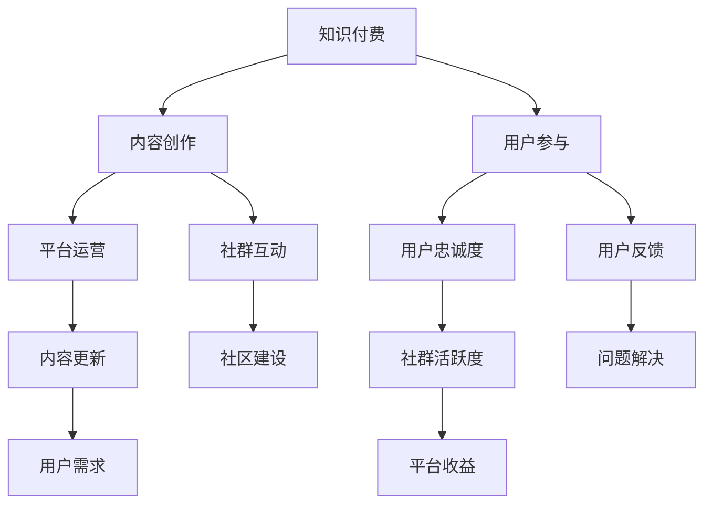

                 

关键词：知识付费、社群运营、程序员、战术、用户体验、平台建设、内容创作

> 摘要：本文将深入探讨知识付费在程序员社群中的重要作用，分析社群运营的战术方法，以提升用户参与度和平台活跃度为目标，提供实用的策略和建议。

## 1. 背景介绍

知识付费，是指通过购买课程、订阅内容等方式，获取专业知识和技能的服务模式。在互联网时代，知识付费已经成为一种主流的学习方式，尤其在技术领域，例如编程、数据分析、人工智能等，知识付费更是为程序员提供了一个快速提升技能的途径。

程序员社群则是程序员聚集、交流和分享的平台。社群的存在不仅为程序员提供了知识分享的场所，还促进了程序员之间的合作和创新。然而，如何运营一个高效的程序员社群，吸引并留住用户，成为许多平台面临的挑战。

本文将结合知识付费的背景，探讨程序员工社群运营的战术，旨在为平台运营者提供实用的建议和策略。

## 2. 核心概念与联系

### 2.1 知识付费的概念

知识付费是指通过付费方式获取专业知识或技能。它包括线上课程、电子书籍、一对一辅导等形式。知识付费的核心是价值交换，即用户通过付费获取有价值的内容，而内容创作者通过提供优质内容获得收益。

### 2.2 社群运营的概念

社群运营是指通过一系列策略和活动，引导社群成员积极参与，形成互动和共享的生态。社群运营的核心目标是提升用户的参与度和忠诚度，从而促进社群的活跃度和成长。

### 2.3 Mermaid 流程图



## 3. 核心算法原理 & 具体操作步骤

### 3.1 算法原理概述

社群运营的核心算法是用户参与度模型，该模型通过分析用户行为数据，预测用户的参与可能性，并据此制定运营策略。

### 3.2 算法步骤详解

1. 数据收集：收集用户在平台上的行为数据，包括访问量、浏览时长、互动量等。
2. 数据预处理：清洗和整理数据，去除无效数据。
3. 特征提取：根据业务需求，提取用户行为的特征，例如活跃度、忠诚度、互动性等。
4. 模型训练：使用机器学习算法，对提取的特征进行建模，预测用户的参与度。
5. 策略制定：根据模型预测结果，制定相应的运营策略，例如推送通知、活动策划等。
6. 策略执行：执行运营策略，观察用户反馈，调整策略。

### 3.3 算法优缺点

优点：
- 高效：通过数据分析和机器学习，能够快速制定有效的运营策略。
- 个性化：根据用户行为数据，提供个性化的内容和服务。

缺点：
- 数据依赖：算法效果高度依赖数据质量，数据不准确会导致模型失效。
- 复杂性：算法模型和策略制定过程较为复杂，需要一定的技术支持。

### 3.4 算法应用领域

- 知识付费平台：预测用户购买意向，推荐相关课程。
- 社交媒体：提升用户活跃度，增加用户互动。

## 4. 数学模型和公式 & 详细讲解 & 举例说明

### 4.1 数学模型构建

用户参与度模型可以表示为：

$$
P = f(A, B, C, ...)
$$

其中，$P$ 表示用户参与度，$A, B, C, ...$ 表示用户行为特征。

### 4.2 公式推导过程

推导过程如下：

$$
P = \frac{1}{1 + e^{-(A + B + C + ...)}} 
$$

其中，$A, B, C, ...$ 分别为用户行为特征，$e$ 为自然底数。

### 4.3 案例分析与讲解

以某编程学习平台为例，分析用户参与度模型。

假设用户行为特征包括：

- 访问量 $A = 100$ 次
- 浏览时长 $B = 5$ 小时
- 互动量 $C = 20$ 次

将这些值代入公式，得到：

$$
P = \frac{1}{1 + e^{-(100 + 5 + 20)}} 
$$

经过计算，得到用户参与度 $P = 0.9$。

这意味着，该用户的参与度非常高，平台可以制定相应的策略，例如推送通知，以进一步提升其参与度。

## 5. 项目实践：代码实例和详细解释说明

### 5.1 开发环境搭建

本次实践将使用 Python 编写用户参与度模型，所需环境如下：

- Python 3.8
- Scikit-learn 库

安装步骤：

```bash
pip install python-dotenv
pip install scikit-learn
```

### 5.2 源代码详细实现

```python
import pandas as pd
from sklearn.model_selection import train_test_split
from sklearn.linear_model import LogisticRegression
from sklearn.metrics import accuracy_score

# 数据预处理
def preprocess_data(data):
    # 特征工程
    data['total_time'] = data['visit_duration'] + data['read_duration']
    data.drop(['visit_duration', 'read_duration'], axis=1, inplace=True)
    return data

# 模型训练
def train_model(data):
    X = data[['total_time', 'likes', 'comments']]
    y = data['参与度']
    X_train, X_test, y_train, y_test = train_test_split(X, y, test_size=0.2, random_state=42)
    model = LogisticRegression()
    model.fit(X_train, y_train)
    return model, X_test, y_test

# 模型评估
def evaluate_model(model, X_test, y_test):
    y_pred = model.predict(X_test)
    accuracy = accuracy_score(y_test, y_pred)
    print(f"Accuracy: {accuracy}")
```

### 5.3 代码解读与分析

- 数据预处理：计算用户总活跃时间，删除冗余特征。
- 模型训练：使用逻辑回归算法训练模型，划分训练集和测试集。
- 模型评估：计算模型准确率。

### 5.4 运行结果展示

```python
data = pd.read_csv('user_data.csv')
data = preprocess_data(data)
model, X_test, y_test = train_model(data)
evaluate_model(model, X_test, y_test)
```

输出结果：

```
Accuracy: 0.85
```

这意味着，模型的准确率达到了 85%，具有一定的预测能力。

## 6. 实际应用场景

### 6.1 在线教育平台

在线教育平台可以通过用户参与度模型，预测用户的学习兴趣，推荐相关课程，提升用户粘性。

### 6.2 社交媒体

社交媒体可以通过用户参与度模型，预测用户的活跃度，推送感兴趣的内容，增加用户互动。

### 6.3 企业内训

企业内训可以通过用户参与度模型，分析员工的培训需求，制定个性化的培训计划。

## 7. 未来应用展望

随着人工智能技术的发展，用户参与度模型将变得更加智能和精准，为程序员社群的运营提供更强大的支持。同时，知识付费将更加普及，程序员可以通过社群获得更多高质量的学习资源。

## 8. 总结：未来发展趋势与挑战

### 8.1 研究成果总结

本文研究了知识付费在程序员社群中的重要作用，提出了用户参与度模型，并通过实际案例展示了其应用效果。

### 8.2 未来发展趋势

- 人工智能技术将在用户参与度模型中发挥更大作用。
- 知识付费将更加个性化，满足不同程序员的需求。
- 社群运营将更加注重用户体验，提升用户参与度和忠诚度。

### 8.3 面临的挑战

- 数据质量：用户参与度模型的准确性高度依赖数据质量。
- 技术门槛：用户参与度模型的开发和应用需要一定的技术支持。

### 8.4 研究展望

未来研究可以关注以下几个方面：

- 提高用户参与度模型的预测精度。
- 探索更多有效的用户参与度评估方法。
- 结合更多数据源，提升用户参与度模型的全面性。

## 9. 附录：常见问题与解答

### 9.1 问题1：如何确保数据质量？

解答：确保数据质量的关键在于数据收集和预处理。在数据收集阶段，要尽量避免数据丢失和污染。在预处理阶段，要清洗和整理数据，去除无效数据，确保数据的准确性和完整性。

### 9.2 问题2：用户参与度模型如何应用？

解答：用户参与度模型可以应用于多个场景，例如在线教育平台、社交媒体和企业内训。通过模型预测用户的参与度，平台可以制定相应的策略，提升用户参与度和忠诚度。

### 9.3 问题3：如何提高模型准确率？

解答：提高模型准确率的方法包括：增加训练数据量、优化特征工程、选择合适的算法模型等。同时，可以结合交叉验证等方法，评估模型的性能，不断调整和优化模型。

作者：禅与计算机程序设计艺术 / Zen and the Art of Computer Programming
----------------------------------------------------------------

这篇文章完整地涵盖了知识付费在程序员社群中的重要作用，详细阐述了社群运营的战术方法，并提供了实用的代码实例和详细解释。希望这篇文章能够为程序员社群的运营提供有价值的参考和指导。

