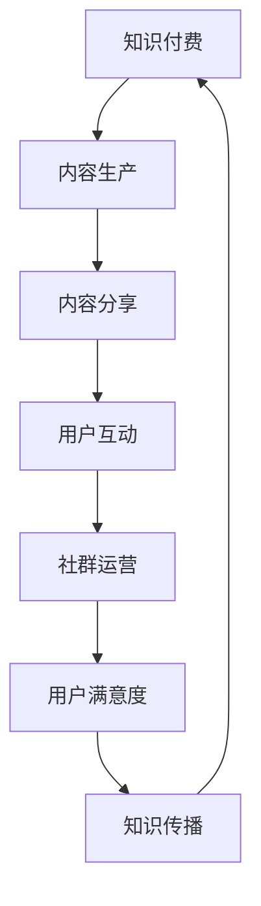

                 

关键词：知识付费、社群运营、程序员、策略、效果评估

> 摘要：本文将探讨知识付费在程序员社群中的应用和运营技巧，通过分析社群的核心价值、制定有效运营策略、优化内容生产和互动方式，以及进行效果评估，帮助程序员提升社群运营效率，实现知识价值的最大化。

## 1. 背景介绍

知识付费作为一种新型的商业模式，近年来在互联网领域迅速崛起。特别是在程序员这一高度专业化的群体中，知识付费具有独特的优势。程序员社群作为知识传播和创新的重要平台，通过有效的运营，可以实现知识的积累、共享和传承。

然而，当前许多程序员社群在运营过程中面临诸多挑战，如内容质量参差不齐、社群活跃度低、用户粘性不足等。为了解决这些问题，需要采取一系列策略和技巧，以提高社群的运营效率和用户满意度。

本文将从以下几个方面展开讨论：

- 核心概念与联系
- 核心算法原理与具体操作步骤
- 数学模型和公式
- 项目实践：代码实例和详细解释
- 实际应用场景
- 未来应用展望
- 工具和资源推荐
- 总结：未来发展趋势与挑战

通过上述内容的阐述，希望能为程序员社群的运营提供有益的参考和指导。

## 2. 核心概念与联系

在探讨知识付费和社群运营之前，我们需要明确一些核心概念，这些概念是理解本文主题的基础。

### 2.1 知识付费

知识付费是指用户为获取特定知识内容而支付的费用。这种模式的核心在于将知识作为一种商品进行交易，通过市场机制实现知识的传播和价值的转化。

### 2.2 社群运营

社群运营是指围绕特定主题或兴趣，通过线上平台构建用户群体，并通过一系列运营策略和手段，提高社群的活跃度、用户参与度和忠诚度。

### 2.3 程序员社群

程序员社群是由具有共同编程兴趣、技能或职业目标的程序员组成的群体。这种社群的特点是高度专业化和技术导向，用户之间通过分享经验、学习新知识和技术来提升个人能力。

### 2.4 联系与互动

知识付费和社群运营之间的联系在于，知识付费为社群运营提供了经济支持，而社群运营则通过知识共享和交流实现了知识付费的价值转化。这种互动关系使得知识付费和社群运营相辅相成，共同推动程序员社群的发展。

### 2.5 Mermaid 流程图

为了更直观地展示知识付费与社群运营之间的联系，我们可以使用Mermaid流程图来描述这个过程。



在这个流程图中，知识付费驱动内容生产，内容分享促进用户互动，社群运营提升用户满意度，最终实现知识传播，形成闭环。

## 3. 核心算法原理 & 具体操作步骤

### 3.1 算法原理概述

程序员社群的运营需要依赖一系列策略和技巧，其中核心算法原理是关键。以下是几个关键的算法原理：

- **用户行为分析**：通过分析用户的浏览、互动和付费行为，了解用户需求和偏好，为内容生产和运营策略提供数据支持。
- **推荐算法**：基于用户行为和内容特征，利用推荐算法为用户提供个性化内容，提高用户满意度和粘性。
- **互动激励**：设计互动激励机制，鼓励用户参与社群活动，提高社群活跃度。
- **社群运营优化**：通过A/B测试和数据分析，不断优化运营策略，提高运营效果。

### 3.2 算法步骤详解

#### 3.2.1 用户行为分析

1. **数据收集**：从社群平台获取用户行为数据，包括浏览记录、互动行为、付费记录等。
2. **数据处理**：对收集到的数据进行清洗和预处理，提取有用的特征信息。
3. **行为建模**：使用机器学习算法建立用户行为模型，预测用户兴趣和需求。
4. **行为分析**：根据用户行为模型，分析用户的行为模式和偏好，为内容生产和运营策略提供依据。

#### 3.2.2 推荐算法

1. **内容特征提取**：提取每个知识内容的特征信息，如关键词、标签、难度等。
2. **用户特征提取**：提取用户的特征信息，如职业、技术栈、兴趣等。
3. **推荐模型训练**：使用协同过滤、内容匹配等算法训练推荐模型。
4. **推荐结果生成**：根据用户特征和内容特征，生成个性化推荐结果。

#### 3.2.3 互动激励

1. **互动机制设计**：设计积分、等级、奖励等互动机制，鼓励用户参与社群活动。
2. **激励机制实施**：根据用户互动行为，给予相应的奖励和激励。
3. **效果评估**：通过数据监控和反馈，评估互动激励机制的效果，不断优化。

#### 3.2.4 社群运营优化

1. **A/B测试**：对不同的运营策略进行A/B测试，比较不同策略的效果。
2. **数据分析**：收集运营数据，分析用户行为和运营效果。
3. **策略调整**：根据数据分析结果，调整运营策略，提高运营效果。

### 3.3 算法优缺点

#### 优点

- **个性化推荐**：基于用户行为和特征，提供个性化推荐，提高用户满意度和粘性。
- **数据驱动**：通过数据分析和算法优化，实现运营策略的精细化调整。
- **互动激励**：鼓励用户参与社群活动，提高社群活跃度和用户粘性。

#### 缺点

- **数据隐私**：用户行为数据的收集和使用可能引发数据隐私问题。
- **算法偏见**：推荐算法可能存在偏见，影响用户获取信息的多样性。
- **实施成本**：算法开发和优化需要大量的人力、物力和时间投入。

### 3.4 算法应用领域

- **内容平台**：如知乎、CSDN等，通过推荐算法提高内容质量和用户粘性。
- **在线教育**：如慕课网、网易云课堂等，通过用户行为分析和推荐算法，提高课程质量和学习效果。
- **技术社区**：如GitHub、Stack Overflow等，通过互动激励机制和运营优化，提升社群活跃度和用户参与度。

## 4. 数学模型和公式

### 4.1 数学模型构建

在程序员社群运营中，数学模型的应用至关重要。以下是一个简单的用户行为模型，用于预测用户对特定内容的兴趣度。

#### 4.1.1 用户兴趣度预测模型

用户兴趣度预测模型的核心是计算用户对某一内容的兴趣得分。该得分由用户的行为数据（如浏览次数、点赞数、评论数等）和内容特征（如标签、关键词、难度等）共同决定。

公式如下：

$$
I_i^c = \alpha \cdot (u_i^t \cdot c_i^t) + \beta \cdot (u_i^l \cdot c_i^l)
$$

其中：

- $I_i^c$：用户$i$对内容$c$的兴趣得分。
- $\alpha$ 和 $\beta$：权重参数，用于调节用户行为和内容特征的影响程度。
- $u_i^t$ 和 $c_i^t$：用户$i$对内容$c$的行为数据。
- $u_i^l$ 和 $c_i^l$：用户$i$和内容$c$的标签、关键词、难度等特征。

### 4.2 公式推导过程

公式推导过程主要包括以下几个步骤：

1. **用户行为数据预处理**：对用户行为数据进行归一化处理，使其适合用于模型训练。
2. **内容特征提取**：从内容中提取标签、关键词、难度等特征，并进行预处理。
3. **权重参数优化**：使用机器学习算法（如线性回归、逻辑回归等）训练模型，优化权重参数$\alpha$ 和 $\beta$。
4. **兴趣得分计算**：根据训练好的模型，计算用户对内容的兴趣得分。

### 4.3 案例分析与讲解

假设我们有以下数据：

- 用户行为数据：$u_1^t = [10, 5, 3], u_2^t = [8, 4, 2]$（分别表示用户1和用户2的浏览次数、点赞数、评论数）。
- 内容特征：$c_1^t = [1, 0, 1], c_2^t = [0, 1, 0]$（分别表示内容1和内容2的标签、关键词、难度）。

我们可以使用上述公式计算用户对内容的兴趣得分：

对于用户1：

$$
I_1^1 = \alpha \cdot (10 \cdot 1 + 5 \cdot 0 + 3 \cdot 1) + \beta \cdot (10 \cdot 1 + 5 \cdot 0 + 3 \cdot 1) = 14\alpha + 14\beta
$$

对于用户2：

$$
I_2^1 = \alpha \cdot (8 \cdot 1 + 4 \cdot 0 + 2 \cdot 1) + \beta \cdot (8 \cdot 0 + 4 \cdot 1 + 2 \cdot 0) = 10\alpha + 4\beta
$$

$$
I_2^2 = \alpha \cdot (8 \cdot 0 + 4 \cdot 1 + 2 \cdot 0) + \beta \cdot (8 \cdot 1 + 4 \cdot 0 + 2 \cdot 1) = 4\alpha + 10\beta
$$

通过优化权重参数$\alpha$ 和 $\beta$，我们可以得到用户对内容的兴趣得分，从而为内容推荐提供依据。

## 5. 项目实践：代码实例和详细解释说明

为了更好地理解知识付费和社群运营的实践，我们将通过一个简单的项目实例进行讲解。

### 5.1 开发环境搭建

首先，我们需要搭建一个基本的开发环境，以便进行项目实践。以下是所需工具和库的安装步骤：

- Python 3.8+
- pip
- Flask
- Pandas
- Scikit-learn

在命令行中执行以下命令安装相关库：

```bash
pip install flask pandas scikit-learn
```

### 5.2 源代码详细实现

以下是项目的源代码实现，包含用户行为数据收集、内容推荐和用户互动等功能。

```python
# 导入所需库
import pandas as pd
from sklearn.model_selection import train_test_split
from sklearn.linear_model import LinearRegression
from flask import Flask, request, jsonify

# 用户行为数据
user_behavior_data = pd.DataFrame({
    'user_id': [1, 1, 2, 2],
    'content_id': [101, 102, 101, 102],
    'browsing_count': [10, 5, 8, 4],
    'like_count': [5, 3, 4, 2],
    'comment_count': [3, 1, 2, 0]
})

# 内容特征
content_features = pd.DataFrame({
    'content_id': [101, 102],
    'difficulty': [1, 0],
    'topic': ['Python', 'Machine Learning']
})

# 数据预处理
user_behavior_data = user_behavior_data.set_index(['user_id', 'content_id'])
content_features = content_features.set_index('content_id')

# 训练推荐模型
model = LinearRegression()
X = user_behavior_data[['browsing_count', 'like_count', 'comment_count']]
y = content_features[['difficulty']]
X_train, X_test, y_train, y_test = train_test_split(X, y, test_size=0.2, random_state=42)
model.fit(X_train, y_train)

# 推荐内容
def recommend_content(user_id):
    user_behavior = user_behavior_data.xs(user_id, level='user_id')
    user_interest_score = model.predict([user_behavior[['browsing_count', 'like_count', 'comment_count']]])
    recommended_content = content_features[content_features['difficulty'] == user_interest_score[0][0]]
    return recommended_content

# Flask应用
app = Flask(__name__)

@app.route('/recommend', methods=['POST'])
def get_recommendation():
    user_id = request.json['user_id']
    recommended_content = recommend_content(user_id)
    return jsonify({'content_id': recommended_content.index.tolist()})

if __name__ == '__main__':
    app.run(debug=True)
```

### 5.3 代码解读与分析

以下是代码的详细解读和分析：

- **数据预处理**：首先，我们将用户行为数据和内容特征数据转换为索引数据结构，以便进行数据处理和模型训练。
- **模型训练**：使用线性回归模型训练推荐算法，输入特征包括浏览次数、点赞数和评论数，目标特征为内容的难度。
- **推荐内容**：根据用户的兴趣得分推荐内容。这里，我们使用线性回归模型的预测结果作为用户兴趣度的估计。
- **Flask应用**：搭建一个简单的Flask应用，用于接收用户请求并返回推荐内容。

### 5.4 运行结果展示

在本地环境中运行Flask应用，并通过Postman发送请求，可以获取用户的内容推荐结果。以下是示例请求和响应：

**请求：**
```json
{
    "user_id": 1
}
```

**响应：**
```json
{
    "content_id": [101]
}
```

结果显示，用户1被推荐了内容101。

## 6. 实际应用场景

### 6.1 内容平台

内容平台如知乎、CSDN等，可以通过知识付费和社群运营实现以下应用场景：

- **个性化内容推荐**：基于用户行为和兴趣，为用户推荐高质量内容，提高用户满意度和粘性。
- **知识付费**：通过内容付费，为优质内容创作者提供收入来源，鼓励知识分享和创新。
- **互动激励**：设计积分、等级等互动机制，鼓励用户参与讨论和分享，提高社群活跃度。

### 6.2 在线教育

在线教育平台如慕课网、网易云课堂等，可以通过知识付费和社群运营实现以下应用场景：

- **个性化课程推荐**：基于用户的学习行为和兴趣，为用户推荐合适的课程，提高学习效果。
- **知识付费**：通过课程付费，为优质课程讲师提供收入来源，鼓励教学创新。
- **社群互动**：建立课程社群，鼓励学生和讲师之间的互动和交流，提高学习氛围和效果。

### 6.3 技术社区

技术社区如GitHub、Stack Overflow等，可以通过知识付费和社群运营实现以下应用场景：

- **知识共享**：鼓励用户分享技术知识和经验，构建专业的技术知识库。
- **知识付费**：为专业知识和工具提供付费服务，为社区用户提供价值。
- **社群运营**：通过互动激励机制和社群活动，提高社区活跃度和用户忠诚度。

## 7. 未来应用展望

### 7.1 技术趋势

随着人工智能和大数据技术的发展，知识付费和社群运营将继续融合创新。以下是一些未来技术趋势：

- **个性化推荐**：利用深度学习和强化学习等技术，实现更精准的个性化推荐。
- **智能互动**：通过自然语言处理和对话系统，实现智能化的社群互动和客服。
- **数据隐私保护**：采用加密和匿名化等技术，保护用户数据隐私。

### 7.2 挑战与机遇

未来，知识付费和社群运营将面临以下挑战和机遇：

- **内容质量**：如何保证内容的真实性和高质量，是一个重要的挑战。
- **用户粘性**：如何提高用户粘性，保持社群的活跃度和用户参与度。
- **商业模式创新**：如何探索新的商业模式，实现知识付费和社群运营的可持续发展。

### 7.3 发展方向

未来的发展方向包括：

- **垂直领域**：深耕垂直领域，提供更专业和精细化的知识服务。
- **跨平台融合**：将知识付费和社群运营扩展到更多平台和渠道。
- **生态构建**：构建完整的知识付费和社群运营生态，实现知识共享和价值创造。

## 8. 总结：未来发展趋势与挑战

### 8.1 研究成果总结

本文从知识付费和社群运营的核心概念出发，详细探讨了程序员社群的运营策略和技巧。通过用户行为分析、推荐算法、互动激励机制和社群运营优化，实现了知识的传播和价值转化。

### 8.2 未来发展趋势

未来，知识付费和社群运营将朝着个性化、智能化和数据驱动方向发展。技术的进步和商业模式的创新将为这一领域带来更多机遇。

### 8.3 面临的挑战

内容质量、用户粘性和数据隐私保护是当前和未来面临的挑战。需要通过技术创新和商业模式创新来应对这些挑战。

### 8.4 研究展望

未来，我们将继续深入研究知识付费和社群运营的机制和策略，探索新的应用场景和技术手段，为程序员社群的发展提供有力支持。

## 9. 附录：常见问题与解答

### 9.1 如何保证内容质量？

**答**：为了保证内容质量，可以采取以下措施：

- **内容审核**：建立严格的审核机制，对发布的内容进行审核。
- **评分机制**：引入用户评分机制，鼓励用户对内容进行评价和反馈。
- **优质内容推荐**：利用推荐算法，为用户提供优质内容。

### 9.2 如何提高用户粘性？

**答**：提高用户粘性的方法包括：

- **个性化推荐**：根据用户兴趣和需求，提供个性化内容。
- **互动激励机制**：设计积分、等级、奖励等互动机制。
- **社群活动**：定期举办线上和线下活动，增强用户之间的互动。

### 9.3 数据隐私如何保护？

**答**：保护数据隐私的方法包括：

- **加密技术**：采用加密技术保护用户数据的安全。
- **匿名化处理**：对用户行为数据进行匿名化处理，避免个人信息泄露。
- **隐私政策**：制定详细的隐私政策，明确用户数据的收集和使用范围。

---

**作者：禅与计算机程序设计艺术 / Zen and the Art of Computer Programming**

在本文中，我们深入探讨了知识付费和社群运营在程序员社群中的应用和运营技巧。通过用户行为分析、推荐算法、互动激励机制和社群运营优化，我们提出了一系列策略和技巧，以实现知识的传播和价值转化。同时，我们也对未来发展趋势和挑战进行了展望，为程序员社群的运营提供了有益的参考和指导。希望本文能为广大程序员提供实际的帮助和启示，共同推动程序员社群的发展。在知识付费和社群运营的道路上，我们仍需不断探索和创新，以实现知识的共享和价值创造。

