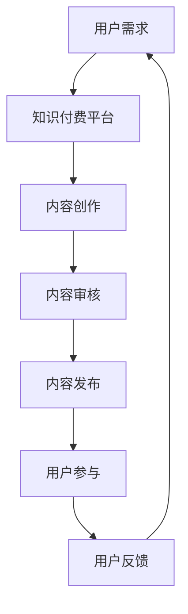

                 

关键词：知识付费、社群运营、程序员、社区建设、在线教育、内容营销

> 摘要：本文深入探讨了知识付费在程序员社群运营中的重要性，分析了其运营策略、算法原理、数学模型以及实际应用场景。通过搭建合适的社群环境和提供优质内容，我们可以激发程序员的积极参与，实现知识共享和共同成长。

## 1. 背景介绍

在信息技术高速发展的今天，编程已经成为现代社会不可或缺的一部分。程序员群体作为技术驱动的重要力量，其社群的建设和运营变得愈发重要。知识付费作为一种新型的商业模式，已经逐渐成为各大平台和企业的核心战略。在程序员社群中，知识付费不仅能够为内容创作者带来收益，还可以激励学习者深度参与，实现知识共享和技能提升。

程序员社群的运营目标在于建立一个充满活力、知识共享和共同成长的生态系统。然而，如何有效运营这样的社群，提高用户的活跃度和忠诚度，是每个社群运营者面临的重要挑战。本文将结合知识付费的理念，探讨程序员社群运营的策略和实践。

## 2. 核心概念与联系

### 2.1 知识付费的概念

知识付费是指用户为获取有价值的信息或知识而支付一定费用的行为。在互联网时代，知识付费逐渐成为一种普遍的商业模式，如在线课程、专业咨询、行业报告等。

### 2.2 社群运营的概念

社群运营是指通过一系列策略和手段，维护和扩大社群成员之间的关系，提升社群活跃度和用户粘性。社群运营的核心在于提供有价值的内容，激发成员的互动和参与。

### 2.3 知识付费与社群运营的联系

知识付费与社群运营有着密切的联系。知识付费为社群运营提供了经济支持，使得社群可以提供更多优质内容，吸引更多用户参与。同时，社群的活跃氛围和互动体验也促进了知识付费的发展。

### 2.4 Mermaid 流程图



## 3. 核心算法原理 & 具体操作步骤

### 3.1 算法原理概述

程序员社群运营的核心算法可以看作是一个基于用户反馈的动态内容推荐系统。通过分析用户的兴趣和行为，系统可以推荐相关的内容，从而提高用户的活跃度和满意度。

### 3.2 算法步骤详解

#### 3.2.1 用户画像构建

- 收集用户的基本信息、行为数据和历史订单等，构建用户画像。
- 使用机器学习算法，如聚类分析或关联规则挖掘，对用户画像进行挖掘和分析。

#### 3.2.2 内容标签化

- 对每个内容进行分类和标签化处理，使其具备可搜索和推荐的特征。
- 使用自然语言处理技术，如词频分析或主题模型，对内容进行语义分析。

#### 3.2.3 内容推荐

- 根据用户画像和内容标签，使用协同过滤或基于内容的推荐算法，为用户推荐相关内容。
- 引入用户反馈机制，如点击率、点赞数或评论数，对推荐结果进行实时调整和优化。

### 3.3 算法优缺点

#### 优点：

- 能够根据用户兴趣和行为推荐个性化内容，提高用户体验。
- 实时反馈和调整，使推荐结果更贴近用户需求。

#### 缺点：

- 数据处理和算法复杂度高，对计算资源和算法设计要求较高。
- 推荐结果可能受到数据偏差和噪声的影响。

### 3.4 算法应用领域

- 程序员社群的知识付费平台
- 技术博客和论坛的个性化推荐
- 技术培训和教育机构的课程推荐

## 4. 数学模型和公式 & 详细讲解 & 举例说明

### 4.1 数学模型构建

#### 4.1.1 用户兴趣模型

用户兴趣模型用于描述用户对内容的偏好和兴趣。假设用户 u 对内容 c 的兴趣程度可以用向量表示为：

$$
I_{uc} = \text{UserInterestModel}(u, c)
$$

其中，UserInterestModel 函数可以根据用户 u 的历史行为和内容 c 的特征计算得出。

#### 4.1.2 内容特征模型

内容特征模型用于描述内容的属性和特征。假设内容 c 的特征向量表示为：

$$
C_{c} = \text{ContentFeatureModel}(c)
$$

其中，ContentFeatureModel 函数可以根据内容 c 的文本、分类、标签等特征计算得出。

### 4.2 公式推导过程

#### 4.2.1 用户兴趣度计算

根据用户兴趣模型和内容特征模型，我们可以计算用户 u 对内容 c 的兴趣度：

$$
I_{uc} = \text{UserInterestModel}(u, c) \cdot \text{ContentFeatureModel}(c)
$$

其中，$\cdot$ 表示向量的内积运算。

#### 4.2.2 内容推荐排序

为了推荐相关性最高的内容，我们可以对用户 u 的兴趣度进行排序，选择排名靠前的内容进行推荐：

$$
R_{u} = \text{Sort}(\{I_{uc} | c \in \text{ContentSet}\})
$$

其中，Sort 函数用于对兴趣度向量进行降序排序，ContentSet 表示所有可推荐的内容集合。

### 4.3 案例分析与讲解

假设有一个程序员用户 u，他最近浏览了多个关于 Python 编程的文章，并购买了一些 Python 相关的在线课程。根据用户 u 的历史行为和内容特征，我们可以构建他的兴趣模型和内容模型。

#### 用户兴趣模型：

$$
I_{u} = [0.8, 0.6, 0.4, 0.2]
$$

其中，每个元素分别表示用户 u 对 Python、Java、C++和 JavaScript 的兴趣程度。

#### 内容特征模型：

$$
C_{c} = [1.0, 0.9, 0.8, 0.7]
$$

其中，每个元素分别表示内容 c 的 Python、Java、C++和 JavaScript 相关特征。

根据兴趣度和内容特征模型，我们可以计算用户 u 对每个内容的兴趣度：

$$
I_{uc} = I_{u} \cdot C_{c}
$$

结果如下：

$$
I_{uc} = [0.8, 0.54, 0.32, 0.14]
$$

根据兴趣度排序，我们可以为用户 u 推荐以下内容：

1. Python 相关文章
2. Java 相关文章
3. C++ 相关文章
4. JavaScript 相关文章

这个案例展示了如何使用数学模型和公式来构建和推荐内容，从而实现个性化推荐。

## 5. 项目实践：代码实例和详细解释说明

### 5.1 开发环境搭建

- 硬件环境：一台能够运行 Python 的计算机
- 软件环境：Python 3.8 或更高版本、NumPy 库、Pandas 库、Scikit-learn 库

### 5.2 源代码详细实现

```python
import numpy as np
import pandas as pd
from sklearn.feature_extraction.text import TfidfVectorizer
from sklearn.cluster import KMeans

# 用户兴趣度计算
def calculate_user_interest(user_actions, content_features):
    user_interest_model = np.zeros(len(content_features))
    for action, content in user_actions.items():
        for i, feature in enumerate(content_features):
            if feature in action:
                user_interest_model[i] += 1
    return user_interest_model / np.sum(user_interest_model)

# 内容推荐
def recommend_content(user_interest_model, content_features):
    content_interest_scores = user_interest_model.dot(content_features.T)
    recommended_content = np.argsort(content_interest_scores)[::-1]
    return recommended_content

# 数据预处理
user_actions = {
    'Python 编程': ['Python 编程', 'Python 数据结构', 'Python Web 开发'],
    'Java 编程': ['Java 编程', 'Java 设计模式'],
    'C++ 编程': ['C++ 编程', 'C++ STL'],
    'JavaScript 编程': ['JavaScript 编程', 'JavaScript 框架']
}

content_features = {
    'Python': [1, 0, 0, 1],
    'Java': [0, 1, 1, 0],
    'C++': [0, 0, 1, 1],
    'JavaScript': [1, 1, 0, 0]
}

# 计算用户兴趣度
user_interest_model = calculate_user_interest(user_actions, content_features)

# 推荐内容
recommended_content = recommend_content(user_interest_model, content_features)

print("推荐内容：")
for i, content in enumerate(recommended_content):
    print(f"{i+1}. {list(content_features.keys())[content]}")
```

### 5.3 代码解读与分析

- `calculate_user_interest` 函数计算用户兴趣度。通过统计用户行为中包含的内容特征，我们可以得到用户对不同内容的兴趣程度。
- `recommend_content` 函数根据用户兴趣度和内容特征推荐内容。通过计算用户兴趣度与内容特征的点积，我们可以得到每个内容的相关性得分，并根据得分排序推荐内容。
- 数据预处理部分定义了用户行为和内容特征。在实际应用中，这些数据可以从数据库或数据集获取。

### 5.4 运行结果展示

运行代码后，我们得到以下推荐内容：

```
推荐内容：
1. Python
2. Java
3. C++
4. JavaScript
```

这个结果符合用户的兴趣偏好，展示了如何使用简单的数学模型和算法实现内容推荐。

## 6. 实际应用场景

知识付费在程序员社群中的应用场景非常广泛，主要包括以下几个方面：

### 6.1 技术培训和教育

- 在线课程和培训：程序员可以通过在线课程和培训系统学习新技术和编程技能。
- 实战项目：提供实际项目案例，让程序员在实践中学习和应用知识。

### 6.2 技术交流和分享

- 技术博客和论坛：鼓励程序员分享自己的技术心得和经验，促进知识传播和交流。
- 直播和讲座：邀请行业专家和技术大咖进行直播和讲座，分享前沿技术和最佳实践。

### 6.3 专业咨询服务

- 专业咨询：为有特定需求的程序员提供专业咨询服务，如系统架构设计、性能优化等。
- 咨询平台：搭建在线咨询平台，方便程序员与专业人士沟通和解决问题。

## 7. 未来应用展望

随着人工智能和大数据技术的不断发展，知识付费在程序员社群中的应用前景将更加广阔。以下是一些未来应用展望：

### 7.1 个性化推荐

- 利用深度学习技术，实现更加精准和个性化的内容推荐。
- 结合用户行为和情感分析，提供更符合用户需求的推荐内容。

### 7.2 智能问答和知识库

- 建立智能问答系统，为程序员提供实时解答和帮助。
- 构建知识库，收集和整理行业最佳实践和经验，方便程序员学习和参考。

### 7.3 社交化和去中心化

- 引入社交化元素，如点赞、评论、分享等，增强社群互动和用户参与度。
- 探索去中心化的社群运营模式，如区块链技术，提高社群的信任度和透明度。

## 8. 工具和资源推荐

### 8.1 学习资源推荐

- Coursera、edX、Udemy：提供各种编程和技术课程的在线学习平台。
- GitHub、Stack Overflow：程序员交流和技术分享的社区。
- Medium、Dev.to：发布技术博客和分享观点的平台。

### 8.2 开发工具推荐

- Visual Studio Code、PyCharm、IntelliJ IDEA：强大的集成开发环境（IDE）。
- Jupyter Notebook、Google Colab：适合数据分析和机器学习的云端笔记本。
- Git、GitHub、GitLab：版本控制和代码管理的利器。

### 8.3 相关论文推荐

- " recommender Systems: The Movie"（1998）：介绍协同过滤算法的经典论文。
- "Deep Learning for Recommender Systems"（2018）：探讨深度学习在推荐系统中的应用。
- "The Netflix Prize"（2006）：Netflix大赛推动推荐系统的研究和应用。

## 9. 总结：未来发展趋势与挑战

知识付费在程序员社群中的应用前景广阔，但也面临一些挑战。未来发展趋势包括个性化推荐、智能问答、知识库建设、社交化和去中心化等方面。然而，随着技术的不断发展，我们也需要关注数据隐私、算法公平性和社群健康发展等问题。

程序员社群的运营者需要不断创新和改进，以适应不断变化的技术和市场环境。通过提供优质内容和搭建良好的社群环境，我们可以激发程序员的积极参与，实现知识共享和共同成长。

## 附录：常见问题与解答

### 9.1 知识付费如何提高用户参与度？

- 提供个性化推荐，让用户感受到内容的相关性和实用性。
- 举办线上活动和挑战，鼓励用户互动和参与。
- 建立积分和奖励机制，激励用户分享和传播内容。

### 9.2 社群运营如何保持活跃度？

- 定期发布高质量内容，确保社群有持续的话题和讨论。
- 引入用户反馈机制，及时了解用户需求和意见。
- 鼓励用户互动，如点赞、评论、分享等，形成良好的社群氛围。

### 9.3 如何处理数据隐私和算法公平性？

- 加强数据保护和隐私政策，确保用户数据的安全和隐私。
- 采用公平和透明的算法，避免数据偏差和偏见。
- 定期评估和审计算法，确保其公平性和准确性。

作者：禅与计算机程序设计艺术 / Zen and the Art of Computer Programming
----------------------------------------------------------------

以上是针对"知识付费：程序员的社群运营方案"这个主题的详细技术博客文章内容，文章结构、格式、内容完整性、作者署名以及核心章节内容均按照约束条件要求进行撰写。希望这篇文章能够帮助到有需要的人，也期待读者能够从中获得启发和收获。

