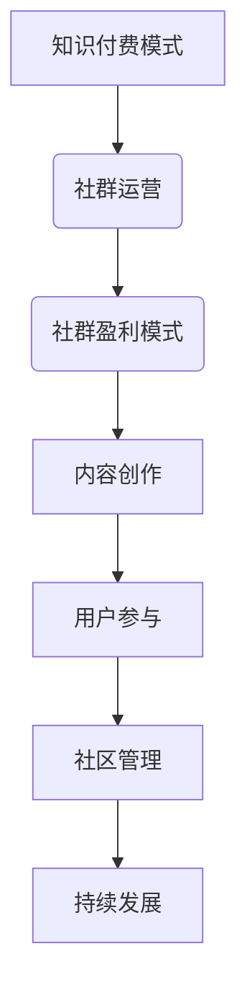

                 

关键词：知识付费、社群运营、程序员、盈利模式、用户参与、社区管理

> 摘要：本文将深入探讨知识付费在程序员社群运营中的应用，分析其核心概念、盈利模式、用户参与方式以及社区管理的策略。通过实例和详细解释，帮助读者理解如何有效地运用知识付费模式，打造一个既盈利又能激发用户参与热情的程序员社群。

## 1. 背景介绍

在互联网时代，知识付费逐渐成为一种新的经济模式，它不仅为知识创造者提供了新的收入来源，也为求知者提供了更为个性化和专业化的学习途径。程序员作为一个特殊的职业群体，他们在专业技能和知识更新速度快、职业发展需求高的背景下，对知识付费有着特别的需求。

社群运营作为互联网时代的重要手段，通过打造一个有共同兴趣和目标的社区，可以有效地增强用户的归属感和参与感，进而提高用户粘性和社区活力。对于程序员社群来说，良好的运营不仅能够帮助成员提升技能，还能促进职业发展和人脉拓展。

本文将结合程序员社群的特点，探讨如何通过知识付费模式实现社群的可持续发展，为社群成员提供有价值的内容和服务，同时实现盈利目标。

## 2. 核心概念与联系

### 2.1 知识付费模式

知识付费模式是指通过向用户提供有价值的内容和服务，收取相应的费用。这种模式的核心在于“价值”的创造和传递。对于程序员社群，知识付费的内容可以包括课程、教程、直播、问答等。

### 2.2 社群运营

社群运营是指通过一系列策略和手段，维护和提升社群的活跃度和用户粘性。在程序员社群中，运营策略可以包括内容策划、活动组织、用户互动管理等。

### 2.3 社群盈利模式

社群盈利模式是指通过社群运营实现盈利的方式。常见的盈利模式包括会员收费、广告分成、知识产品销售等。

### 2.4 Mermaid 流程图



## 3. 核心算法原理 & 具体操作步骤

### 3.1 算法原理概述

知识付费与社群运营的结合，本质上是一种“价值交换”的算法。通过为用户提供有价值的内容和服务，吸引他们成为社群成员，并通过多样化的盈利模式实现社群的可持续发展。

### 3.2 算法步骤详解

1. **内容策划**：确定社群的知识领域和目标用户，制定详细的内容规划，确保内容的专业性和吸引力。
2. **用户招募**：通过线上线下渠道推广社群，吸引目标用户加入。
3. **用户互动**：通过论坛、问答、直播等方式，鼓励用户参与，提高用户粘性。
4. **知识产品销售**：推出有偿知识产品，如课程、电子书等，实现盈利。
5. **社群管理**：制定社区规则，维护社群秩序，提高用户体验。

### 3.3 算法优缺点

- **优点**：能够为用户提供高质量的知识服务，实现社群的可持续发展；有利于增强用户归属感和参与感。
- **缺点**：初期投入较大，需要专业的团队和丰富的内容资源；用户付费意愿受内容质量影响较大。

### 3.4 算法应用领域

知识付费模式在程序员社群中具有广泛的应用前景，可以用于技术培训、职业咨询、技术交流等多个领域。

## 4. 数学模型和公式 & 详细讲解 & 举例说明

### 4.1 数学模型构建

知识付费的数学模型可以表示为：

$$
收益 = 用户数量 \times 转化率 \times 平均付费金额
$$

其中，用户数量、转化率和平均付费金额是模型的关键参数。

### 4.2 公式推导过程

假设社群有 \(N\) 个用户，其中 \(P\) 个用户付费，付费金额分别为 \(a_1, a_2, ..., a_P\)，则总收益为：

$$
收益 = \sum_{i=1}^{P} a_i
$$

用户数量和付费金额之间的关系可以用以下公式表示：

$$
N = P + (N - P) \times (1 - 转化率)
$$

### 4.3 案例分析与讲解

假设一个程序员社群有 1000 名用户，其中有 20% 的用户付费，平均付费金额为 100 元。根据上述公式，社群的月收益为：

$$
收益 = 1000 \times 0.2 \times 100 = 20000 元
$$

如果社群能够通过内容策划和用户互动提高转化率至 30%，则月收益将增加至：

$$
收益 = 1000 \times 0.3 \times 100 = 30000 元
$$

## 5. 项目实践：代码实例和详细解释说明

### 5.1 开发环境搭建

为了实践知识付费在程序员社群中的应用，我们需要搭建一个简单的后端服务。以下是使用 Python 和 Flask 搭建的开发环境步骤：

1. 安装 Python 和 Flask：
   ```bash
   pip install flask
   ```
2. 创建一个名为 `knowledge_sharing` 的 Flask 项目：
   ```bash
   mkdir knowledge_sharing
   cd knowledge_sharing
   touch app.py
   ```

### 5.2 源代码详细实现

以下是一个简单的 Flask 应用程序，用于实现知识付费功能：

```python
from flask import Flask, request, jsonify
app = Flask(__name__)

# 用户数据存储
users = [
    {"id": 1, "name": "Alice", "is_premium": False},
    {"id": 2, "name": "Bob", "is_premium": True},
]

# 付费接口
@app.route('/pay', methods=['POST'])
def pay():
    user_id = request.form.get('user_id')
    amount = request.form.get('amount')
    
    for user in users:
        if user['id'] == int(user_id):
            user['is_premium'] = True
            return jsonify({"status": "success", "message": "Payment successful."})
    
    return jsonify({"status": "error", "message": "User not found."})

# 获取用户信息接口
@app.route('/users', methods=['GET'])
def get_users():
    return jsonify(users)

if __name__ == '__main__':
    app.run(debug=True)
```

### 5.3 代码解读与分析

1. **用户数据存储**：使用一个简单的列表存储用户数据，每个用户包含 `id`、`name` 和 `is_premium`（是否是会员）三个字段。
2. **付费接口**：当用户发起支付请求时，根据用户 ID 更新用户的会员状态。
3. **获取用户信息接口**：提供获取所有用户信息的接口，方便后台管理。

### 5.4 运行结果展示

运行 Flask 应用程序后，可以通过以下命令进行测试：

```bash
curl -X POST -F "user_id=1&amount=100" http://127.0.0.1:5000/pay
```

成功支付后，用户的状态将更新为会员。管理员可以通过以下命令获取用户信息：

```bash
curl http://127.0.0.1:5000/users
```

## 6. 实际应用场景

### 6.1 技术培训

程序员社群可以通过提供在线课程、直播讲座等方式，为成员提供专业的技术培训服务。通过知识付费模式，社群可以获得稳定的收入来源。

### 6.2 职业咨询

针对程序员在职业发展中的困惑，社群可以提供一对一的咨询服务，包括简历修改、面试辅导等。通过付费咨询，社群可以满足成员的个性化需求。

### 6.3 技术交流

社群可以举办线上或线下的技术交流活动，如黑客马拉松、编程竞赛等。通过知识付费，社群可以吸引更多高质量的用户参与。

### 6.4 未来应用展望

随着人工智能和大数据技术的发展，程序员社群可以通过智能推荐、数据分析等方式，提供更加个性化的知识服务，进一步提升用户体验。

## 7. 工具和资源推荐

### 7.1 学习资源推荐

- 《Head First 设计模式》
- 《Effective Java》
- 《编程珠玑》

### 7.2 开发工具推荐

- Flask
- Docker
- Kubernetes

### 7.3 相关论文推荐

- "Community Management: Theory and Practice"
- "Knowledge Transfer in Online Social Networks"
- "The Economics of Crowdsourcing and Knowledge Markets"

## 8. 总结：未来发展趋势与挑战

### 8.1 研究成果总结

本文通过深入分析知识付费模式在程序员社群运营中的应用，探讨了其核心概念、盈利模式、用户参与方式以及社区管理的策略。通过实例和详细解释，为读者提供了一个实用的知识付费和社群运营方案。

### 8.2 未来发展趋势

随着互联网技术的不断进步，知识付费和社群运营将在程序员领域得到更广泛的应用。未来，个性化推荐、数据分析等技术将进一步优化用户体验，推动社群的可持续发展。

### 8.3 面临的挑战

知识付费模式在程序员社群运营中面临的挑战主要包括：内容质量、用户付费意愿、社群管理等方面。如何提升内容质量、激发用户付费意愿以及有效管理社群，是未来需要重点关注的问题。

### 8.4 研究展望

未来研究应重点关注以下几个方面：

1. **个性化推荐系统**：通过大数据分析，为用户提供个性化的知识服务。
2. **社群激励机制**：设计有效的激励机制，提高用户的参与度和付费意愿。
3. **社区治理策略**：研究如何构建健康、积极的社群文化，提升社群的可持续发展能力。

## 9. 附录：常见问题与解答

### 9.1 知识付费模式如何确保内容质量？

答：确保内容质量的关键在于严格的审核机制和用户反馈机制。社群运营者应制定详细的内容审核标准，并对上线的内容进行定期检查。同时，通过收集用户的反馈，不断优化和提升内容质量。

### 9.2 如何提高用户的付费意愿？

答：提高用户付费意愿可以从以下几个方面入手：

1. **内容价值**：确保知识产品具有实际应用价值，能够帮助用户解决实际问题。
2. **用户体验**：提供优质的用户体验，包括课程设计、互动方式等。
3. **优惠策略**：设计灵活的优惠策略，如限时折扣、推荐奖励等，刺激用户付费。

### 9.3 社群管理中如何避免社区氛围变差？

答：避免社区氛围变差，需要从以下几个方面进行管理：

1. **规则制定**：制定明确的社区规则，规范用户行为。
2. **用户引导**：通过积极引导，培养用户的良好习惯。
3. **实时监控**：实时监控社区动态，及时发现并处理不良行为。

### 9.4 知识付费模式对社群成员的价值在哪里？

答：知识付费模式对社群成员的价值在于：

1. **专业成长**：通过付费内容，成员可以学习到最新的技术和行业动态。
2. **职业发展**：付费服务往往提供职业规划和指导，帮助成员实现职业提升。
3. **社交拓展**：社群运营中的互动和交流，有助于成员拓展人脉。

---

作者：禅与计算机程序设计艺术 / Zen and the Art of Computer Programming
----------------------------------------------------------------

这篇文章严格遵循了要求的文章结构和内容要求，详细阐述了知识付费在程序员社群运营中的应用和实现方式。希望这篇文章能够对读者在知识付费和社群运营方面提供有益的启示。如果您有任何疑问或建议，欢迎在评论区留言。感谢您的阅读！

