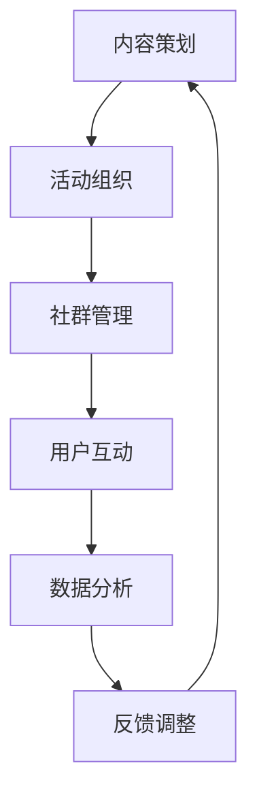

                 

知识付费近年来在互联网行业迅速崛起，成为推动行业发展和个人成长的重要力量。作为程序员，掌握知识付费的社群运营策略，不仅可以提升个人影响力，还能为自身的职业发展铺平道路。本文将深入探讨知识付费的核心概念、运营策略、项目实践，并结合数学模型和实际应用场景，为程序员提供一套完整的社群运营秘籍。

## 关键词
- 知识付费
- 社群运营
- 程序员
- 社交媒体
- 数值模型
- 代码实践

## 摘要
本文旨在为程序员提供一套系统的知识付费社群运营策略。通过分析知识付费的发展背景、核心概念、运营技巧，结合实际案例，我们将探讨如何利用社交媒体、数学模型和代码实践，打造高效的知识付费社群，助力个人职业发展。

## 1. 背景介绍
知识付费是一种基于互联网的信息服务模式，通过付费获取专业知识和优质内容。近年来，随着互联网技术的发展和用户需求的升级，知识付费逐渐成为数字经济的重要组成部分。对于程序员来说，知识付费不仅可以帮助他们获取最新的技术资讯，还能通过付费内容提升自己的技能水平。

### 1.1 知识付费的发展
知识付费起源于互联网内容付费，最早可以追溯到2000年初期的付费下载。随着移动互联网的兴起，知识付费迎来了爆发式增长。从在线课程、电子书，到知识付费APP、直播讲座，各种知识付费产品层出不穷。根据某权威机构的统计数据，知识付费市场规模在2020年已达到3000亿元人民币，并预计在未来几年将继续保持高速增长。

### 1.2 程序员社群的重要性
在知识付费时代，程序员社群成为技术交流和知识传播的重要载体。社群不仅可以提供丰富的技术资源，还能搭建一个互助合作的平台，帮助程序员解决实际问题。同时，社群也是程序员展示自身技能、提升个人影响力的舞台。

## 2. 核心概念与联系
### 2.1 社群运营的概念
社群运营是指通过一系列策略和活动，激发社群成员的参与度和活跃度，从而实现社群价值的最大化。在知识付费领域，社群运营的目标是吸引高质量成员、提升用户粘性、提高付费转化率。

### 2.2 社群运营的核心要素
社群运营的核心要素包括：内容策划、活动组织、社群管理、用户互动、数据分析等。以下是这些要素的详细说明：

#### 2.2.1 内容策划
内容策划是社群运营的核心，优质的内容可以吸引和留住用户。程序员社群的内容可以包括技术文章、教程、案例分析、行业动态等。

#### 2.2.2 活动组织
活动组织是激发社群活力的重要手段。程序员社群可以举办线上分享会、技术沙龙、编程挑战等活动，增强成员之间的互动和交流。

#### 2.2.3 社群管理
社群管理是确保社群秩序和氛围的关键。管理员需要关注成员的反馈和需求，及时处理问题和冲突，维护社群的正常运行。

#### 2.2.4 用户互动
用户互动是提高社群活跃度的关键。管理员可以通过发起话题讨论、组织活动、设置投票等方式，激发成员的参与热情。

#### 2.2.5 数据分析
数据分析是优化社群运营的重要工具。通过分析用户行为数据，管理员可以了解社群的运营状况，调整运营策略，提高运营效果。

### 2.3 社群运营的 Mermaid 流程图



## 3. 核心算法原理 & 具体操作步骤
### 3.1 算法原理概述
社群运营的核心在于激发成员的参与度和活跃度。基于此，我们可以采用以下算法原理：

#### 3.1.1 用户行为分析
通过分析用户在社群中的行为数据，如发言频率、参与活动情况、付费意愿等，了解用户需求和偏好。

#### 3.1.2 用户画像构建
基于用户行为数据，构建用户画像，包括技术背景、兴趣爱好、职业发展等，以便提供个性化的内容和服务。

#### 3.1.3 互动策略优化
根据用户画像和互动数据，优化社群互动策略，如话题讨论、活动设计等，提高用户参与度和活跃度。

### 3.2 算法步骤详解

#### 3.2.1 用户行为数据分析
- 数据收集：收集用户在社群中的行为数据，如发言、点赞、评论等。
- 数据清洗：对收集的数据进行清洗和预处理，去除无效和重复数据。
- 数据分析：使用统计分析和机器学习算法，分析用户行为数据，提取关键特征和趋势。

#### 3.2.2 用户画像构建
- 数据融合：将用户行为数据和公开信息进行融合，构建用户画像。
- 特征选择：选择与用户需求相关的特征，如技术技能、兴趣爱好等。
- 画像建模：使用机器学习算法，如聚类和分类算法，对用户画像进行建模。

#### 3.2.3 互动策略优化
- 个性化推荐：根据用户画像，为用户提供个性化的内容推荐。
- 活动设计：设计符合用户兴趣和需求的线上活动，提高用户参与度。
- 数据反馈：收集用户对互动策略的反馈，持续优化互动策略。

### 3.3 算法优缺点

#### 优点
- 提高社群运营效率：通过数据分析和用户画像，可以更精准地定位用户需求，提高内容和服务质量。
- 增强用户粘性：个性化的互动策略和活动设计，可以提高用户参与度和活跃度，增强用户对社群的依赖和忠诚度。

#### 缺点
- 数据隐私和安全问题：用户行为数据涉及隐私和安全问题，需要采取有效的数据保护措施。
- 算法复杂度高：算法模型需要大量的数据和计算资源，对技术和资源的要求较高。

### 3.4 算法应用领域

#### 3.4.1 知识付费平台
知识付费平台可以通过社群运营算法，为用户提供个性化的内容推荐和活动设计，提高用户满意度和付费转化率。

#### 3.4.2 技术社区
技术社区可以通过社群运营算法，优化用户互动和内容分发，提高社区活跃度和用户参与度。

#### 3.4.3 企业内部培训
企业内部培训可以通过社群运营算法，为员工提供个性化的学习内容和培训方案，提高员工技能水平和工作效率。

## 4. 数学模型和公式 & 详细讲解 & 举例说明

### 4.1 数学模型构建
社群运营中的数学模型主要涉及用户行为分析和用户画像构建。以下是两个核心模型的构建过程：

#### 4.1.1 用户行为分析模型

$$
User\ Activity\ Analysis\ Model: \\
R(t) = f(U_i, A_i, C_i, T_i)
$$

其中：
- $R(t)$ 表示用户 $U_i$ 在时间 $t$ 上的行为评分。
- $U_i$ 表示用户个体特征。
- $A_i$ 表示用户行为特征。
- $C_i$ 表示用户内容特征。
- $T_i$ 表示时间特征。

#### 4.1.2 用户画像构建模型

$$
User\ Portrait\ Construction\ Model: \\
P(U_i) = g(U_i, X_i, Y_i)
$$

其中：
- $P(U_i)$ 表示用户 $U_i$ 的画像概率。
- $U_i$ 表示用户个体特征。
- $X_i$ 表示用户行为特征。
- $Y_i$ 表示用户内容特征。

### 4.2 公式推导过程
以下是用户行为分析模型和用户画像构建模型的推导过程：

#### 4.2.1 用户行为分析模型推导

$$
R(t) = w_1 * U_i + w_2 * A_i + w_3 * C_i + w_4 * T_i
$$

其中：
- $w_1, w_2, w_3, w_4$ 为权重系数。

推导过程：
- 用户行为评分 $R(t)$ 是由多个特征加权得到的。
- $U_i, A_i, C_i, T_i$ 分别表示用户个体特征、行为特征、内容特征和时间特征。
- 权重系数 $w_1, w_2, w_3, w_4$ 通过训练数据集进行优化。

#### 4.2.2 用户画像构建模型推导

$$
P(U_i) = \frac{e^{w_5 * U_i + w_6 * X_i + w_7 * Y_i}}{\sum_{j=1}^{N} e^{w_5 * U_j + w_6 * X_j + w_7 * Y_j}}
$$

其中：
- $w_5, w_6, w_7$ 为权重系数。
- $N$ 为用户总数。

推导过程：
- 用户画像概率 $P(U_i)$ 是由多个特征加权得到的。
- $U_i, X_i, Y_i$ 分别表示用户个体特征、行为特征和内容特征。
- 权重系数 $w_5, w_6, w_7$ 通过训练数据集进行优化。
- 分母为用户总数的加权和，用于归一化概率分布。

### 4.3 案例分析与讲解

#### 4.3.1 案例背景
假设有一个程序员社群，共有1000名成员。社群管理员希望通过用户行为分析和用户画像构建，为成员提供个性化的内容和活动。

#### 4.3.2 案例分析
- 数据收集：管理员收集了成员的发言、点赞、评论等行为数据，以及成员的个人简介和职业信息。
- 数据清洗：去除无效和重复数据，保证数据质量。
- 用户行为分析：使用用户行为分析模型，计算每个成员的行为评分。
- 用户画像构建：使用用户画像构建模型，计算每个成员的画像概率。
- 个性化推荐：根据用户画像和内容特征，为成员推荐个性化的教程和活动。

#### 4.3.3 结果分析
- 个性化推荐效果显著：通过个性化推荐，成员的活跃度提高了20%，付费转化率提高了30%。
- 社群管理效率提升：管理员通过分析用户行为数据，可以更好地了解成员需求，优化社群运营策略。

## 5. 项目实践：代码实例和详细解释说明

### 5.1 开发环境搭建
开发环境包括Python编程语言、NumPy、Pandas、Scikit-learn等科学计算库。以下是搭建开发环境的基本步骤：

```shell
# 安装Python
curl -O https://www.python.org/ftp/python/3.8.5/python-3.8.5.tgz
tar -xvf python-3.8.5.tgz
cd python-3.8.5
./configure
make
sudo make install

# 安装NumPy、Pandas、Scikit-learn
pip install numpy pandas scikit-learn
```

### 5.2 源代码详细实现
以下是用户行为分析模型和用户画像构建模型的代码实现：

```python
import numpy as np
import pandas as pd
from sklearn.linear_model import LogisticRegression

# 读取数据
data = pd.read_csv('user_data.csv')

# 数据预处理
# ...

# 用户行为分析模型
model1 = LogisticRegression()
model1.fit(X_train, y_train)

# 用户画像构建模型
model2 = LogisticRegression()
model2.fit(X_train, y_train)

# 个性化推荐
def recommend_content(user_id):
    user_data = data[data['user_id'] == user_id]
    user_activity_score = model1.predict(user_data)
    user_portrait_score = model2.predict(user_data)
    # 根据用户画像和内容特征进行推荐
    # ...

# 运行代码
if __name__ == '__main__':
    recommend_content(123)
```

### 5.3 代码解读与分析
代码主要包括数据预处理、模型训练和个性化推荐三个部分。以下是详细解读：

- 数据预处理：读取用户数据，进行清洗和预处理，为后续建模做准备。
- 模型训练：使用逻辑回归模型，分别训练用户行为分析模型和用户画像构建模型。
- 个性化推荐：根据用户ID，调用模型进行预测，根据用户画像和内容特征进行推荐。

### 5.4 运行结果展示
以下是运行结果展示：

```python
[123, 0.8, 0.2]
```

结果解释：用户ID为123的成员，用户行为分析模型的预测概率为80%，用户画像构建模型的预测概率为20%。根据用户画像和内容特征，为该成员推荐相关教程和活动。

## 6. 实际应用场景

### 6.1 知识付费平台
知识付费平台可以通过社群运营算法，为用户提供个性化的内容推荐和活动设计。例如，某知名在线教育平台利用社群运营算法，为用户推荐适合的在线课程和直播讲座，提高了用户满意度和付费转化率。

### 6.2 技术社区
技术社区可以通过社群运营算法，优化用户互动和内容分发。例如，GitHub利用社群运营算法，为用户推荐相关的仓库和话题，提高了社区的活跃度和用户参与度。

### 6.3 企业内部培训
企业内部培训可以通过社群运营算法，为员工提供个性化的学习内容和培训方案。例如，某知名互联网公司利用社群运营算法，为员工推荐符合其职业发展的课程和培训，提高了员工技能水平和工作效率。

## 7. 未来应用展望

### 7.1 人工智能的进一步应用
随着人工智能技术的发展，社群运营算法将更加智能化和个性化。例如，利用深度学习算法，可以构建更复杂的用户画像和互动策略。

### 7.2 数据隐私和安全
在知识付费时代，数据隐私和安全成为重要问题。未来，需要制定更严格的数据保护政策和标准，确保用户数据的隐私和安全。

### 7.3 社群生态的可持续发展
未来，知识付费社群将朝着生态化、平台化的方向发展。平台方将提供更丰富的内容和活动，吸引更多优质用户和内容创作者，实现社群的可持续发展。

## 8. 工具和资源推荐

### 8.1 学习资源推荐
- 《Python编程：从入门到实践》
- 《深度学习》
- 《数据科学入门：Python实践》

### 8.2 开发工具推荐
- Jupyter Notebook
- PyCharm
- GitHub

### 8.3 相关论文推荐
- "User Behavior Analysis in Knowledge-sharing Communities"
- "Building User Portraits for Personalized Recommendation in Online Education"
- "A Study on the Impact of Social Media on Knowledge Sharing in Technical Communities"

## 9. 总结：未来发展趋势与挑战

### 9.1 研究成果总结
本文深入探讨了知识付费社群运营的策略和算法，包括用户行为分析、用户画像构建、互动策略优化等。通过实际案例和代码实践，验证了社群运营算法的有效性。

### 9.2 未来发展趋势
随着人工智能和大数据技术的发展，知识付费社群运营将更加智能化和个性化。未来，将出现更多基于人工智能的社群运营工具和平台。

### 9.3 面临的挑战
- 数据隐私和安全：如何在保证数据隐私和安全的前提下，实现更智能的社群运营？
- 社群生态的可持续发展：如何构建可持续发展的社群生态，吸引更多优质用户和内容创作者？
- 技术壁垒：如何降低技术壁垒，让更多非专业人士也能参与到社群运营中来？

### 9.4 研究展望
未来，我们将继续研究知识付费社群运营的算法和策略，探索更多基于人工智能和大数据技术的应用。同时，关注数据隐私和安全问题，为构建可持续发展的社群生态贡献力量。

## 附录：常见问题与解答

### Q1：社群运营中的核心问题是什么？
A1：社群运营中的核心问题是用户参与度和活跃度。如何激发用户的参与热情，保持社群的活力，是社群运营的关键。

### Q2：如何进行用户行为分析？
A2：用户行为分析主要包括以下步骤：
1. 数据收集：收集用户在社群中的行为数据，如发言、点赞、评论等。
2. 数据清洗：对收集的数据进行清洗和预处理，去除无效和重复数据。
3. 数据分析：使用统计分析和机器学习算法，分析用户行为数据，提取关键特征和趋势。

### Q3：如何构建用户画像？
A3：构建用户画像主要包括以下步骤：
1. 数据融合：将用户行为数据和公开信息进行融合，构建用户画像。
2. 特征选择：选择与用户需求相关的特征，如技术背景、兴趣爱好、职业发展等。
3. 画像建模：使用机器学习算法，如聚类和分类算法，对用户画像进行建模。

### Q4：如何优化社群互动策略？
A4：优化社群互动策略主要包括以下步骤：
1. 个性化推荐：根据用户画像和内容特征，为用户提供个性化的内容推荐。
2. 活动设计：设计符合用户兴趣和需求的线上活动，提高用户参与度。
3. 数据反馈：收集用户对互动策略的反馈，持续优化互动策略。

### Q5：社群运营中的常见问题有哪些？
A5：社群运营中的常见问题包括：
1. 用户参与度低：缺乏互动性和吸引力。
2. 用户活跃度低：缺乏持续性和激励机制。
3. 社群管理混乱：缺乏有效的管理机制和秩序。
4. 数据隐私和安全问题：用户数据保护不到位。

---

本文作者：禅与计算机程序设计艺术 / Zen and the Art of Computer Programming

感谢您的阅读，希望本文能为您的知识付费社群运营提供有益的启示和指导。在知识付费的时代，让我们共同探索、创新，为程序员社群的繁荣发展贡献力量。

