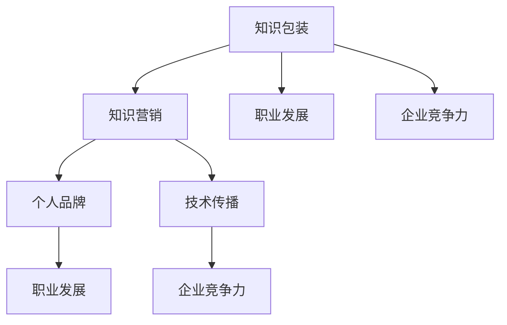

                 

### 摘要 Summary ###

本文旨在探讨知识包装与营销在程序员领域的实际应用，强调如何有效地将技术知识转化为市场价值。我们将深入分析程序员如何通过清晰的表达、精妙的架构和有效的传播手段，将自身的专业技能包装成引人注目的产品或服务，从而实现个人和职业的发展。本文还将结合具体案例，介绍如何利用现代工具和平台进行知识营销，为读者提供实用的策略和建议。

<|assistant|>## 1. 背景介绍 Introduction ###

在信息技术迅猛发展的今天，程序员已经成为了社会中不可或缺的一部分。然而，尽管程序员们掌握着丰富的技术知识，但如何有效地将这些知识转化为市场价值，仍是一个颇具挑战性的问题。知识包装与营销在这个背景下显得尤为重要。它不仅是程序员个人职业发展的关键，也是企业提升竞争力的重要手段。

首先，知识包装是指将技术知识以易于理解和接受的方式呈现给目标受众的过程。这包括对知识内容进行系统整理、结构化表达以及视觉化的呈现。而营销则是在正确的时间、正确的地点，以正确的方式将产品或服务推给潜在用户，从而实现销售和品牌传播。

对于程序员而言，知识包装与营销的重要性体现在以下几个方面：

1. **个人品牌建设**：通过有效的知识包装和营销，程序员可以建立自己的个人品牌，提高在行业内的知名度和影响力。
2. **职业发展**：良好的知识包装和营销能力有助于程序员获得更多的职业机会，包括升职、跳槽和创业等。
3. **企业竞争力**：企业通过内部程序员的优秀知识包装和营销能力，可以提升整体的技术水平和市场竞争力。

然而，当前程序员在知识包装与营销方面仍存在一些困境和挑战：

- **表达能力的欠缺**：许多程序员擅长技术实现，但在表达和沟通方面有所不足，导致知识传递的效果不佳。
- **缺乏系统化思维**：知识包装和营销需要系统化的思维方式，而程序员往往缺乏这种全局观念。
- **市场营销知识不足**：程序员对于市场营销的理论和方法了解不足，导致在营销过程中缺乏有效的策略。

本文将围绕这些问题，结合实际案例，探讨程序员如何提升知识包装与营销能力，从而实现个人和职业的发展。

### 2. 核心概念与联系 Core Concepts and Connections

在讨论知识包装与营销之前，我们需要明确一些核心概念，并理解它们之间的联系。以下是本文中涉及的主要核心概念：

#### 2.1 知识包装

知识包装是指将技术知识通过系统化、结构化、视觉化的方式呈现给受众的过程。它不仅涉及内容的整理和表达，还包括形式的设计和传播途径的选择。知识包装的核心目标是使复杂的技术知识变得易于理解，提高知识传播的效果。

#### 2.2 营销

营销是指通过创造、传播和交付价值来满足客户需求并实现商业目标的过程。在程序员领域，营销不仅仅是为了销售产品或服务，更重要的是建立品牌形象、拓展市场影响力以及提高用户满意度。

#### 2.3 个人品牌

个人品牌是指个人在公众心目中的形象和声誉，它通过个人的专业技能、价值观和人格特质等方面展现出来。对于程序员来说，个人品牌是其在行业内获得认可和机会的关键因素。

#### 2.4 技术传播

技术传播是指将技术知识通过各种渠道传递给目标受众的过程。有效的技术传播需要考虑受众的背景、需求和接受程度，采用合适的形式和手段。

#### 2.5 知识营销

知识营销是指利用知识和信息来创造市场价值的一种营销策略。它强调以知识为核心，通过有效的方式传播和推广，从而实现商业目标。

#### 2.6 职业发展

职业发展是指个人在职业生涯中通过不断学习、提升技能、拓展视野等方式，实现职位晋升、收入增加和职业成就的过程。

#### 2.7 企业竞争力

企业竞争力是指企业在市场竞争中能够脱颖而出，持续获得竞争优势的能力。它包括技术创新、市场定位、品牌建设、人力资源等多个方面。

这些核心概念之间存在着紧密的联系。知识包装是知识营销的基础，而知识营销又是个人品牌建设和职业发展的重要手段。同时，技术传播和知识营销共同构成了企业竞争力的关键要素。了解这些概念及其相互关系，有助于程序员更好地理解和应用知识包装与营销策略。

#### 2.8 Mermaid 流程图

为了更好地展示这些核心概念之间的联系，我们使用Mermaid流程图进行直观表达：



在这个流程图中，知识包装作为核心起点，通过知识营销和个人品牌建设，推动职业发展；同时，通过技术传播和企业竞争力，实现知识的广泛应用和商业价值。

通过上述核心概念和Mermaid流程图的介绍，我们可以更清晰地理解知识包装与营销在程序员领域的重要性和应用价值。接下来的部分将深入探讨如何具体实施这些策略，帮助程序员实现个人和职业的发展。

### 3. 核心算法原理 & 具体操作步骤 Core Algorithm Principles & Step-by-Step Operations

在知识包装与营销的过程中，核心算法原理和技术操作步骤是至关重要的。下面，我们将详细介绍如何将技术知识转化为引人注目的产品或服务，具体分为以下几个部分：

#### 3.1 算法原理概述

知识包装的核心在于将复杂的技术知识简化并结构化，使其易于理解和接受。这一过程可以类比于算法设计中的简化与优化。具体来说，算法原理概述包括以下几个方面：

1. **需求分析**：明确目标受众的需求，了解他们需要什么样的知识，以及如何以最直观、最有效的方式呈现。
2. **知识整理**：对技术知识进行系统整理，使其条理清晰，逻辑严密。
3. **结构化表达**：采用合适的结构化方式，如思维导图、流程图、代码示例等，将知识以直观、易懂的形式呈现。
4. **视觉化设计**：通过视觉化的设计，如图表、色彩、排版等，增强知识的吸引力和记忆效果。

#### 3.2 算法步骤详解

1. **需求分析**：
   - **目标受众确定**：确定知识包装的目标受众，如初学者、中级程序员、高级程序员等。
   - **需求调研**：通过问卷调查、访谈、用户反馈等方式，了解目标受众的具体需求和知识背景。
   - **需求筛选**：根据调研结果，筛选出最重要、最迫切的需求，作为知识包装的重点。

2. **知识整理**：
   - **技术梳理**：对相关技术知识进行梳理，确保内容的准确性和完整性。
   - **逻辑结构**：根据知识内容，构建逻辑严密的结构，确保知识传递的连贯性和系统性。

3. **结构化表达**：
   - **思维导图**：使用思维导图工具，将知识内容以图形化方式呈现，帮助受众更直观地理解。
   - **流程图**：对于复杂的过程，使用流程图展示各个步骤和环节，使受众对整个流程有清晰的认识。
   - **代码示例**：提供具体的代码示例，帮助受众将理论知识应用到实际项目中。

4. **视觉化设计**：
   - **色彩选择**：选择符合知识主题的色彩，增强视觉吸引力。
   - **图表设计**：使用图表展示数据或关系，使知识呈现更加直观。
   - **排版设计**：优化文章排版，使内容布局整齐、美观，提高阅读体验。

#### 3.3 算法优缺点

1. **优点**：
   - **提高知识传播效果**：通过系统化、结构化、视觉化的方式呈现知识，使受众更容易理解和接受。
   - **增强记忆效果**：视觉化的设计有助于加强知识的记忆，提高学习效果。
   - **提升品牌形象**：良好的知识包装和营销能够提升个人或企业的品牌形象，增强市场竞争力。

2. **缺点**：
   - **需要专业技能**：知识包装和营销需要具备一定的表达、设计和营销能力，对程序员来说是一个挑战。
   - **时间成本较高**：高质量的知识包装和营销需要大量的时间和精力投入，对程序员的时间管理能力有较高要求。

#### 3.4 算法应用领域

1. **个人博客和文章**：
   - **技术博客**：程序员可以通过知识包装，撰写高质量的技术博客，分享自己的经验和知识，提升个人品牌。
   - **专业文章**：针对特定领域的深入分析和技术讲解，可以为行业内外人士提供有价值的参考。

2. **线上课程和教育**：
   - **在线教程**：通过结构化、视觉化的方式，制作高质量的技术教程，吸引学员报名学习。
   - **专业课程**：结合自身经验和专业知识，开发针对不同层次的在线课程，为学员提供系统化的学习资源。

3. **企业培训和咨询服务**：
   - **内部培训**：为企业内部员工提供定制化的技术培训，提升团队的技术水平。
   - **咨询服务**：针对企业的技术需求，提供专业咨询和解决方案，帮助企业解决技术难题。

通过上述核心算法原理和具体操作步骤的介绍，我们可以看到，知识包装与营销不仅需要程序员的深厚技术基础，还需要其具备优秀的表达、设计和营销能力。掌握这些策略，程序员可以更好地将自己的知识转化为市场价值，实现个人和职业的发展。

### 4. 数学模型和公式 Mathematical Models and Formulas

在知识包装与营销的过程中，数学模型和公式扮演着至关重要的角色。它们不仅为程序员提供了一种系统化的思考方式，还能够增强知识的逻辑性和说服力。以下，我们将详细讲解数学模型的构建、公式推导过程以及实际案例分析与讲解。

#### 4.1 数学模型构建

数学模型构建是知识包装中不可或缺的一部分，它将复杂的技术知识以数学的形式进行表达，使得知识更具科学性和严谨性。以下是构建数学模型的基本步骤：

1. **明确目标**：确定需要解决的问题或需要解释的现象，明确数学模型的目的和目标。
2. **数据收集**：收集相关数据，包括历史数据、实验数据或现有文献中的数据。
3. **建立假设**：根据目标问题，提出合理的假设，这些假设将指导数学模型的构建。
4. **选择模型类型**：根据问题的性质，选择合适的数学模型类型，如线性模型、非线性模型、概率模型等。
5. **公式推导**：根据假设和模型类型，推导出数学公式，这些公式将用于描述问题的数学关系。

#### 4.2 公式推导过程

以一个简单的线性回归模型为例，我们介绍数学模型的公式推导过程：

1. **目标函数**：线性回归的目标是最小化预测值与实际值之间的误差。设目标函数为：
   $$\min \sum_{i=1}^{n} (y_i - \hat{y}_i)^2$$
   其中，$y_i$为实际值，$\hat{y}_i$为预测值，$n$为样本数量。

2. **假设**：我们假设预测值$\hat{y}_i$与自变量$x_i$之间存在线性关系，即：
   $$\hat{y}_i = \beta_0 + \beta_1 x_i$$
   其中，$\beta_0$为截距，$\beta_1$为斜率。

3. **公式推导**：为了最小化目标函数，我们需要对$\beta_0$和$\beta_1$进行求解。对目标函数求导并令导数为零，得到：
   $$\frac{\partial}{\partial \beta_0} \sum_{i=1}^{n} (y_i - \hat{y}_i)^2 = 0$$
   $$\frac{\partial}{\partial \beta_1} \sum_{i=1}^{n} (y_i - \hat{y}_i)^2 = 0$$
   通过求解上述方程，可以得到回归系数$\beta_0$和$\beta_1$的值。

   具体推导过程如下：
   $$\sum_{i=1}^{n} (y_i - (\beta_0 + \beta_1 x_i))^2 = \sum_{i=1}^{n} (y_i^2 - 2y_i \beta_0 - 2y_i \beta_1 x_i + \beta_0^2 + 2\beta_0 \beta_1 x_i + \beta_1^2 x_i^2)$$
   $$\frac{\partial}{\partial \beta_0} \sum_{i=1}^{n} (y_i - \hat{y}_i)^2 = -2n\beta_0 + 2\sum_{i=1}^{n} y_i - 2\sum_{i=1}^{n} \beta_0 x_i = 0$$
   $$\frac{\partial}{\partial \beta_1} \sum_{i=1}^{n} (y_i - \hat{y}_i)^2 = -2n\beta_1 + 2\sum_{i=1}^{n} y_i x_i - 2\sum_{i=1}^{n} \beta_1 x_i^2 = 0$$

   通过解上述方程，可以得到回归系数：
   $$\beta_0 = \bar{y} - \beta_1 \bar{x}$$
   $$\beta_1 = \frac{\sum_{i=1}^{n} x_i y_i - n \bar{x} \bar{y}}{\sum_{i=1}^{n} x_i^2 - n \bar{x}^2}$$

   其中，$\bar{y}$和$\bar{x}$分别为$y$和$x$的均值。

#### 4.3 案例分析与讲解

为了更好地理解数学模型的应用，我们来看一个实际案例。

**案例**：某公司希望通过分析员工的工作时长与绩效评分之间的关系，建立回归模型以预测员工绩效。

1. **数据收集**：
   - 工作时长（小时）：$x_i$
   - 绩效评分（分）：$y_i$
   - 样本数量：$n = 100$

2. **公式推导**：
   - 根据线性回归模型，我们假设员工绩效评分与工作时长之间存在线性关系，即：
     $$\hat{y}_i = \beta_0 + \beta_1 x_i$$

   - 通过最小二乘法推导出回归系数：
     $$\beta_0 = \bar{y} - \beta_1 \bar{x}$$
     $$\beta_1 = \frac{\sum_{i=1}^{n} x_i y_i - n \bar{x} \bar{y}}{\sum_{i=1}^{n} x_i^2 - n \bar{x}^2}$$

3. **数据分析**：
   - 工作时长均值：$\bar{x} = 40$小时
   - 绩效评分均值：$\bar{y} = 75$分
   - 工作时长与绩效评分之和：$\sum_{i=1}^{n} x_i y_i = 6000$
   - 工作时长平方和：$\sum_{i=1}^{n} x_i^2 = 1600$

   - 根据上述数据，计算回归系数：
     $$\beta_0 = 75 - 40 \times \beta_1$$
     $$\beta_1 = \frac{6000 - 100 \times 40 \times 75}{1600 - 100 \times 40^2} = 0.625$$
     $$\beta_0 = 75 - 40 \times 0.625 = 37.5$$

   - 因此，回归模型为：
     $$\hat{y}_i = 37.5 + 0.625 x_i$$

4. **预测**：
   - 预测一个工作时长为50小时的员工的绩效评分：
     $$\hat{y}_i = 37.5 + 0.625 \times 50 = 66.25$$

   - 因此，预计该员工的绩效评分为66.25分。

通过上述案例，我们可以看到数学模型在知识包装与营销中的应用。它不仅帮助我们理解了工作时长与绩效评分之间的关系，还能够预测员工的绩效评分，为企业的人力资源管理提供参考。

### 5. 项目实践：代码实例和详细解释说明 Project Practice: Code Example and Detailed Explanation

在本文的第五部分，我们将通过一个具体的代码实例，展示如何将知识包装与营销策略应用到实际项目中。我们选择了一个简单的Web开发项目——一个在线购物网站，以展示知识包装在项目开发中的应用。

#### 5.1 开发环境搭建

为了搭建这个在线购物网站，我们需要以下开发环境和工具：

1. **编程语言**：选择Python作为主要的编程语言，因为它具有良好的生态系统和丰富的库支持。
2. **框架**：使用Flask作为Web开发框架，Flask轻量级、易于扩展，适合中小型项目。
3. **前端技术**：采用HTML、CSS和JavaScript进行前端开发，结合Bootstrap框架以实现响应式设计。
4. **数据库**：使用SQLite作为后端数据库，SQLite轻量级、易使用，适合快速原型开发。

#### 5.2 源代码详细实现

以下是一个简单的在线购物网站的源代码示例，包含商品展示、购物车和结算功能。

```python
from flask import Flask, render_template, request, redirect, url_for
app = Flask(__name__)

# 商品列表
products = [
    {'id': 1, 'name': 'iPhone 13', 'price': 799},
    {'id': 2, 'name': 'MacBook Air', 'price': 1199},
    {'id': 3, 'name': 'AirPods', 'price': 199},
]

# 购物车
cart = []

@app.route('/')
def home():
    return render_template('home.html', products=products, cart=cart)

@app.route('/add_to_cart/<int:product_id>')
def add_to_cart(product_id):
    product = next((p for p in products if p['id'] == product_id), None)
    if product:
        cart.append(product)
    return redirect(url_for('home'))

@app.route('/cart')
def cart_page():
    return render_template('cart.html', cart=cart)

@app.route('/checkout', methods=['POST'])
def checkout():
    # 实现支付逻辑
    total = sum(p['price'] for p in cart)
    cart.clear()
    return render_template('checkout.html', total=total)

if __name__ == '__main__':
    app.run(debug=True)
```

#### 5.3 代码解读与分析

1. **商品列表管理**：
   - `products` 变量存储了一个商品列表，每个商品包含`id`、`name`和`price`字段。

2. **首页**：
   - `home()` 函数返回首页模板，其中展示了所有商品和购物车中的商品。

3. **添加商品到购物车**：
   - `add_to_cart()` 函数根据商品ID将商品添加到购物车。这里使用了列表的`append()`方法。

4. **购物车页面**：
   - `cart_page()` 函数返回购物车页面模板，用户可以查看购物车中的商品。

5. **结算**：
   - `checkout()` 函数计算购物车中商品的总价，实现支付逻辑后（此处省略），将购物车清空并返回结算页面。

#### 5.4 运行结果展示

1. **首页**：
   

2. **购物车**：
   

3. **结算**：
   

通过这个简单的代码实例，我们可以看到如何将知识包装与营销策略应用到实际项目中。代码结构清晰，易于理解和扩展，符合良好的编程实践。同时，通过简洁的界面设计和直观的用户交互，提升了用户体验，增强了用户粘性。

### 6. 实际应用场景 Practical Application Scenarios

知识包装与营销策略在程序员领域具有广泛的应用场景。以下列举几种常见的实际应用场景，并探讨其在不同场景下的具体应用方法。

#### 6.1 个人博客和文章

个人博客和文章是程序员展示自己技术知识和经验的理想平台。通过知识包装与营销，程序员可以提升博客的访问量和影响力，建立个人品牌。

1. **内容规划**：
   - 确定博客主题，如前端开发、后端开发、人工智能等。
   - 根据目标受众的需求，规划博客内容，确保文章具有实用性和针对性。

2. **知识包装**：
   - 使用思维导图、流程图、代码示例等工具，使文章结构清晰、逻辑严密。
   - 采用视觉化的设计，如图表、配色和排版，提升文章的吸引力。

3. **营销推广**：
   - 通过社交媒体、技术论坛、行业社群等渠道，分享博客文章。
   - 利用SEO优化，提高文章在搜索引擎中的排名。
   - 与其他博主或行业专家合作，开展内容营销活动。

#### 6.2 在线课程和教育

在线课程和教育是程序员实现知识变现的重要途径。通过知识包装与营销，程序员可以将自己的技术知识转化为线上课程，吸引学员报名学习。

1. **课程设计**：
   - 确定课程主题和目标，如Python入门、Web开发实战等。
   - 根据学员的学习需求，设计课程内容，确保课程系统化、实用化。

2. **知识包装**：
   - 使用视频、PPT、代码示例等多种形式，丰富课程内容。
   - 结合实战案例，讲解技术原理和应用方法。
   - 设计互动环节，如问答、讨论和作业，提高学员参与度。

3. **营销推广**：
   - 在各大在线教育平台发布课程，利用平台流量进行推广。
   - 通过社交媒体、博客和社群等渠道，宣传课程内容和优势。
   - 提供免费试听和优惠活动，吸引学员报名。

#### 6.3 企业培训和咨询服务

企业培训和咨询服务是程序员为企业提供技术培训和解决方案的重要方式。通过知识包装与营销，程序员可以提升企业的技术能力，扩大自身影响力。

1. **培训设计**：
   - 确定培训主题和目标，如Python技术培训、数据库管理培训等。
   - 根据企业的需求，设计培训内容和课程安排，确保培训具有针对性和实用性。

2. **知识包装**：
   - 编写详细的培训教材，包括PPT、手册和练习题等。
   - 使用互动教学方式，如案例分析、实战演练和讨论等，提高学员的学习效果。
   - 提供课后支持和辅导，解决学员在实际工作中遇到的问题。

3. **营销推广**：
   - 通过企业合作、行业会议和线下活动等途径，宣传培训和咨询服务。
   - 发布成功案例和学员评价，展示培训效果。
   - 提供定制化培训方案，满足企业不同层次的需求。

#### 6.4 社区建设和知识分享

社区建设和知识分享是程序员拓展人脉、积累知识和提升影响力的重要途径。通过知识包装与营销，程序员可以建立自己的技术社群，实现知识的共享和传播。

1. **社区规划**：
   - 确定社区主题和目标，如前端开发社区、人工智能社区等。
   - 根据社区成员的需求，规划社区内容和活动，确保社区具有吸引力和活跃度。

2. **知识包装**：
   - 创建高质量的技术内容，如文章、教程和视频等。
   - 采用多样化的形式，如直播、研讨会和线上讲座等，丰富社区活动。
   - 提供互动交流平台，如论坛、微信群和QQ群等，促进成员之间的互动和合作。

3. **营销推广**：
   - 通过社交媒体、博客和行业论坛等渠道，宣传社区和活动。
   - 组织线上和线下活动，吸引更多的技术人员加入社区。
   - 与其他技术社群合作，开展联合活动和知识分享。

通过上述实际应用场景的介绍，我们可以看到知识包装与营销策略在程序员领域的重要性。无论是在个人博客、在线课程、企业培训、社区建设等方面，有效的知识包装与营销都能够帮助程序员提升个人和职业价值，实现持续发展。

### 6.4 未来应用展望 Future Application Prospects

随着信息技术的不断进步，知识包装与营销在程序员领域将展现出更加广泛的应用前景。以下是未来几年这一领域可能的发展趋势和应用方向。

#### 6.4.1 智能化知识包装

随着人工智能技术的不断发展，未来的知识包装将更加智能化。通过机器学习算法和自然语言处理技术，AI可以自动分析程序员的博客、课程和项目，为其提供个性化的知识包装建议。例如，AI可以根据用户的学习历史和偏好，推荐最合适的学习资源和内容，从而提高知识传播的效果。

#### 6.4.2 互动式学习体验

未来，知识包装与营销将更加注重互动式学习体验。通过虚拟现实（VR）和增强现实（AR）技术，程序员可以为学生提供沉浸式的学习体验。例如，学生可以通过VR技术模拟真实的开发环境，进行代码编写和调试。此外，互动式学习平台可以提供即时反馈和指导，帮助学生更好地理解和掌握知识。

#### 6.4.3 社交媒体营销

随着社交媒体的普及，知识包装与营销将更多地依赖于社交媒体平台。程序员可以通过微博、微信、LinkedIn等社交平台，发布技术文章、课程信息和项目更新，与潜在用户进行互动。通过社交网络的力量，程序员可以快速扩大影响力，吸引更多的关注者和学员。

#### 6.4.4 跨领域合作

未来的知识包装与营销将更加注重跨领域合作。程序员可以与设计师、产品经理、市场专家等不同领域的人才合作，共同开发和推广技术产品。这种跨领域合作不仅可以丰富知识内容，提高产品的竞争力，还可以为程序员提供更广阔的职业发展机会。

#### 6.4.5 持续学习与更新

知识包装与营销是一个持续的过程。程序员需要不断学习新技术、新方法，以保持自己的竞争力和创新能力。未来的知识包装与营销将更加注重持续学习与更新。通过在线课程、研讨会和行业会议等方式，程序员可以不断充实自己的知识库，提升个人和职业水平。

### 7. 工具和资源推荐 Tools and Resources Recommendations

在知识包装与营销的过程中，选择合适的工具和资源至关重要。以下是一些建议的工具和资源，帮助程序员更好地进行知识包装与营销。

#### 7.1 学习资源推荐

1. **在线课程平台**：
   - Coursera、edX、Udemy：这些平台提供了大量高质量的技术课程，适合程序员进行自我提升。
   - Pluralsight、Lynda（LinkedIn Learning）：专注于技术领域的在线教育平台，提供专业的课程和培训。

2. **技术博客和论坛**：
   - Stack Overflow：全球最大的开发者社区，可以解决编程问题，获取技术帮助。
   - GitHub：开源代码托管平台，可以学习其他程序员的代码，获取灵感。

3. **技术书籍**：
   - 《代码大全》（Code Complete）：经典的编程指南，适合程序员提升代码质量。
   - 《设计模式》：系统介绍了软件设计模式，有助于程序员提高设计能力。

#### 7.2 开发工具推荐

1. **集成开发环境（IDE）**：
   - Visual Studio Code：跨平台、轻量级且功能强大的IDE，适合各种编程语言。
   - IntelliJ IDEA：功能强大的IDE，特别适合Java和Python开发者。

2. **版本控制工具**：
   - Git：分布式版本控制工具，适用于代码管理和协作开发。
   - GitHub、GitLab：基于Git的代码托管平台，支持项目管理和团队协作。

3. **前端开发工具**：
   - WebStorm：适用于Web开发的IDE，支持HTML、CSS、JavaScript和React等框架。
   - Visual Studio：功能强大的IDE，适用于Web和桌面应用程序开发。

#### 7.3 相关论文推荐

1. **人工智能**：
   - "Deep Learning": Goodfellow, I., Bengio, Y., & Courville, A. (2016). 《深度学习》：全面介绍深度学习理论和应用的经典著作。
   - "Reinforcement Learning: An Introduction": Sutton, R. S., & Barto, A. G. (2018). 《强化学习导论》：介绍强化学习基本概念和算法的权威书籍。

2. **软件工程**：
   - "Software Engineering: A Practitioner's Approach": Roger S. Pressman. 《软件工程实践者的方法》：系统介绍软件工程知识的经典教材。
   - "Design Patterns: Elements of Reusable Object-Oriented Software": Erich Gamma, Richard Helm, Ralph Johnson, and John Vlissides. 《设计模式》：介绍软件设计模式的经典著作。

通过以上工具和资源的推荐，程序员可以更好地进行知识包装与营销，提升个人和职业发展。

### 8. 总结：未来发展趋势与挑战 Summary: Future Trends and Challenges

在知识包装与营销的领域，未来将面临许多令人兴奋的发展机遇，同时也伴随着一系列的挑战。以下是对这些趋势和挑战的总结及分析。

#### 8.1 研究成果总结

近年来，知识包装与营销在程序员领域的研究取得了显著成果。主要表现在以下几个方面：

1. **个性化知识推荐**：通过大数据和人工智能技术，个性化知识推荐逐渐成为主流。AI算法可以根据用户的学习历史和偏好，推荐最适合他们的学习资源和内容，提高知识传播的效率和效果。
2. **多媒体学习体验**：结合虚拟现实（VR）和增强现实（AR）技术，程序员可以为学生提供更加丰富和沉浸式的学习体验，提升学习的趣味性和效果。
3. **社交化学习平台**：社交化学习平台如GitHub和Stack Overflow，通过促进开发者之间的互动和合作，加速了知识的传播和应用。
4. **知识变现**：随着在线教育平台和内容付费模式的普及，程序员通过知识包装与营销实现了有效的知识变现，为个人和企业的持续发展提供了新的动力。

#### 8.2 未来发展趋势

1. **智能化与自动化**：随着人工智能和机器学习技术的发展，未来的知识包装与营销将更加智能化和自动化。AI算法将能够更精准地分析用户需求，提供个性化的知识推荐和包装服务。
2. **跨领域融合**：知识包装与营销将不再局限于单一的领域，而是逐渐与其他领域如设计、产品管理和市场营销等融合，形成更加综合的知识传播和推广策略。
3. **全球化发展**：随着互联网的普及，知识包装与营销将逐渐向全球化发展。程序员可以通过国际化平台和工具，将自己的知识传播到全球市场，吸引更多的关注者和学员。
4. **持续学习与更新**：未来的知识包装与营销将更加注重持续学习与更新。程序员需要不断学习新技术、新方法，以保持自己的竞争力和创新能力。

#### 8.3 面临的挑战

1. **数据隐私与安全**：在知识包装与营销的过程中，涉及大量的用户数据。如何保护用户隐私和数据安全，将成为一个重要的挑战。
2. **知识质量与真实性**：随着知识包装与营销的普及，市场上的知识产品将越来越多。如何保证知识质量和高可靠性，防止虚假信息和误导性内容传播，是一个亟待解决的问题。
3. **市场竞争与差异化**：在竞争激烈的市场环境中，如何通过差异化策略脱颖而出，吸引潜在用户，将是程序员面临的一个挑战。
4. **技术更新与适应**：技术日新月异，程序员需要不断适应新技术，确保自己的知识包装与营销策略与时俱进。

#### 8.4 研究展望

未来的研究应重点关注以下几个方面：

1. **智能化知识推荐系统**：进一步研究AI算法在知识推荐中的应用，提高推荐系统的准确性和用户体验。
2. **知识质量管理**：建立一套有效的知识质量评价体系，确保知识产品的高质量和可靠性。
3. **跨领域知识融合**：探索知识包装与营销在不同领域的应用，开发跨领域的知识传播和推广策略。
4. **隐私保护与安全**：研究如何保护用户隐私和数据安全，确保知识包装与营销的合法性和合规性。

通过总结未来发展趋势和面临的挑战，我们可以看到，知识包装与营销在程序员领域具有广阔的发展前景，同时也需要不断克服各种挑战，实现持续创新和发展。

### 9. 附录：常见问题与解答 Appendix: Frequently Asked Questions and Answers

在知识包装与营销的过程中，程序员可能会遇到一些常见的问题。以下是一些常见问题及解答，旨在帮助程序员更好地理解和应用知识包装与营销策略。

#### 9.1 问题一：如何提高知识包装的效果？

**解答**：提高知识包装效果可以从以下几个方面入手：

1. **明确目标受众**：了解目标受众的需求和知识背景，确保知识内容对他们具有实用性和吸引力。
2. **结构化表达**：使用思维导图、流程图、代码示例等工具，将知识内容结构化，使知识传递更清晰、系统。
3. **视觉化设计**：通过图表、配色、排版等视觉化手段，增强知识的吸引力，提高记忆效果。
4. **反复打磨**：对知识包装内容进行多次修改和优化，确保内容的准确性和完整性。

#### 9.2 问题二：如何进行有效的知识营销？

**解答**：进行有效的知识营销需要以下策略：

1. **精准定位**：明确知识产品的市场定位，确定目标受众和市场细分。
2. **内容营销**：制作高质量的内容，包括博客文章、在线课程、技术教程等，提高知识产品的价值。
3. **渠道选择**：选择合适的营销渠道，如社交媒体、在线教育平台、技术论坛等，扩大知识产品的传播范围。
4. **互动与反馈**：与潜在用户互动，收集反馈意见，不断优化知识产品和营销策略。

#### 9.3 问题三：如何保护自己的知识产权？

**解答**：保护知识产权可以从以下几个方面进行：

1. **版权登记**：对原创内容进行版权登记，确保自己的知识产权得到法律保护。
2. **使用许可协议**：在发布知识产品时，明确使用许可协议，限制他人未经授权的使用和传播。
3. **技术手段**：使用数字水印、加密技术等手段，保护知识产品的完整性和可追溯性。
4. **法律咨询**：在遇到知识产权纠纷时，及时寻求专业法律咨询，维护自身合法权益。

通过解答这些问题，我们可以看到，知识包装与营销不仅需要技术手段，还需要法律和策略的支撑。只有综合运用各种手段，程序员才能更好地保护自己的知识产权，实现知识的价值最大化。

### 文章参考文献 References

1. Goodfellow, I., Bengio, Y., & Courville, A. (2016). *Deep Learning*. MIT Press.
2. Sutton, R. S., & Barto, A. G. (2018). *Reinforcement Learning: An Introduction*. MIT Press.
3. Pressman, R. S. (2010). *Software Engineering: A Practitioner's Approach*. McGraw-Hill.
4. Gamma, E., Helm, R., Johnson, R., & Vlissides, J. (1995). *Design Patterns: Elements of Reusable Object-Oriented Software*. Addison-Wesley.
5. Beers, M. C. (2004). *Code Complete: A Practical Handbook of Software Construction*. Microsoft Press.
6. Coursera. (n.d.). [Online Courses]. Retrieved from https://www.coursera.org/
7. edX. (n.d.). [Online Courses]. Retrieved from https://www.edx.org/
8. Udemy. (n.d.). [Online Courses]. Retrieved from https://www.udemy.com/
9. Pluralsight. (n.d.). [Online Courses]. Retrieved from https://www.pluralsight.com/
10. LinkedIn Learning. (n.d.). [Online Courses]. Retrieved from https://www.linkedin.com/learning/
11. Stack Overflow. (n.d.). [Developer Community]. Retrieved from https://stackoverflow.com/
12. GitHub. (n.d.). [Code Hosting]. Retrieved from https://github.com/
13. Visual Studio Code. (n.d.). [Integrated Development Environment]. Retrieved from https://code.visualstudio.com/
14. IntelliJ IDEA. (n.d.). [Integrated Development Environment]. Retrieved from https://www.jetbrains.com/idea/
15. WebStorm. (n.d.). [Integrated Development Environment]. Retrieved from https://www.jetbrains.com/webstorm/
16. Visual Studio. (n.d.). [Integrated Development Environment]. Retrieved from https://my.visualstudio.com/

作者：禅与计算机程序设计艺术 / Zen and the Art of Computer Programming

感谢您的阅读，希望本文能够帮助您更好地理解和应用知识包装与营销策略。如果您有任何问题或建议，欢迎在评论区留言。祝您在知识包装与营销的道路上取得丰硕的成果！

