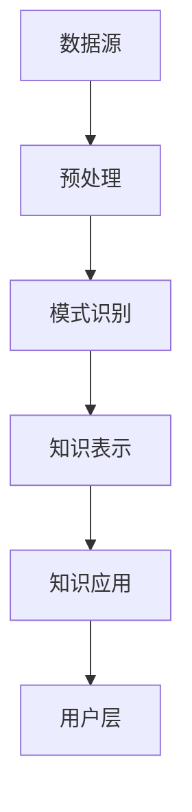

                 

关键词：知识发现引擎、终身学习、个人成长、技术工具、人工智能、算法、数学模型

> 摘要：本文将探讨知识发现引擎在个人成长和终身学习中的应用，如何借助人工智能技术和算法，构建一个支持自我提升的新工具。我们将深入解析知识发现引擎的核心概念、数学模型、算法原理，并通过实例展示其实际应用效果，展望其在未来教育和个人发展中的广阔前景。

## 1. 背景介绍

在当今快速发展的信息时代，知识更新速度日益加快，个人学习和成长面临着前所未有的挑战。传统的学习方式和教育模式已经难以满足现代社会对个人能力的需求。因此，探索一种高效、智能的学习工具，成为支持个人成长和终身学习的关键。

知识发现引擎作为一种新兴的技术工具，具有强大的数据挖掘和模式识别能力，能够从海量信息中自动提取有价值的知识，为个人学习和成长提供有力支持。本文将重点介绍知识发现引擎的基本原理、算法模型及其在个人成长中的应用，旨在为读者提供一种新的思路和方法。

## 2. 核心概念与联系

### 2.1 知识发现引擎的定义

知识发现引擎（Knowledge Discovery Engine，简称KDE）是一种基于人工智能技术的智能分析工具，它可以从大量数据中自动识别出隐藏的模式、规律和知识，以便为用户提供决策支持。知识发现引擎的核心在于其强大的数据挖掘能力，能够从复杂、庞大的数据集中提取出有价值的信息。

### 2.2 知识发现引擎的核心概念

- **数据源**：知识发现引擎的数据源可以是各种类型的数据，如文本、图像、音频、视频等。数据源的质量直接影响知识发现的效果。
- **预处理**：在知识发现过程中，对数据进行清洗、去噪、转换等预处理操作，以确保数据的准确性和一致性。
- **模式识别**：通过机器学习和数据挖掘技术，从数据中提取出潜在的模式和规律，如聚类、分类、关联规则等。
- **知识表示**：将提取出的模式转化为可理解和应用的知识形式，如知识图谱、规则库等。
- **知识应用**：将知识应用于实际问题中，如决策支持、智能推荐、风险评估等。

### 2.3 知识发现引擎的架构

知识发现引擎的架构可以分为四个主要层次：

1. **数据层**：包括数据源和预处理模块，负责数据的采集、存储和清洗。
2. **算法层**：包括各种数据挖掘算法，如聚类、分类、关联规则等，负责从数据中提取模式和规律。
3. **知识层**：包括知识表示和知识应用模块，负责将提取出的模式转化为知识，并应用于实际问题中。
4. **用户层**：包括用户界面和交互模块，负责与用户进行交互，为用户提供可操作的知识和应用。

### 2.4 Mermaid 流程图



## 3. 核心算法原理 & 具体操作步骤

### 3.1 算法原理概述

知识发现引擎的核心算法主要包括聚类、分类和关联规则挖掘等。这些算法分别从不同的角度对数据进行处理，以提取出有价值的知识。

- **聚类算法**：将数据集划分为多个类簇，使得同一类簇内的数据相似度较高，不同类簇内的数据相似度较低。常见的聚类算法有K-Means、DBSCAN等。
- **分类算法**：根据已有数据，将新数据划分为不同的类别。常见的分类算法有决策树、支持向量机、朴素贝叶斯等。
- **关联规则挖掘**：发现数据集中的频繁模式，即满足最小支持度和最小置信度的规则。常见的算法有Apriori、FP-Growth等。

### 3.2 算法步骤详解

1. **数据采集**：从各种渠道收集数据，如网络、数据库、传感器等。
2. **数据预处理**：对采集到的数据进行清洗、去噪、转换等预处理操作，以确保数据质量。
3. **模式识别**：
   - 聚类算法：计算数据之间的相似度，将相似度较高的数据划分为同一类簇。
   - 分类算法：根据已有数据，构建分类模型，对新数据进行分类。
   - 关联规则挖掘：计算数据集中的频繁模式，提取出关联规则。
4. **知识表示**：将提取出的模式转化为知识形式，如知识图谱、规则库等。
5. **知识应用**：将知识应用于实际问题中，如决策支持、智能推荐、风险评估等。
6. **用户交互**：通过用户界面，与用户进行交互，为用户提供可操作的知识和应用。

### 3.3 算法优缺点

- **聚类算法**：
  - 优点：简单易懂，适用于发现数据集中的自然结构。
  - 缺点：对初始聚类中心敏感，可能陷入局部最优。
- **分类算法**：
  - 优点：准确度高，适用于有监督学习场景。
  - 缺点：对训练数据依赖性强，难以发现新的类别。
- **关联规则挖掘**：
  - 优点：能够发现数据之间的关联性，适用于市场篮子分析等场景。
  - 缺点：计算复杂度高，可能产生大量冗余规则。

### 3.4 算法应用领域

- **金融行业**：风险控制、客户细分、投资推荐等。
- **零售行业**：库存管理、营销策略、商品推荐等。
- **医疗行业**：疾病预测、诊断辅助、药物研发等。
- **教育行业**：学习分析、个性化推荐、教育评估等。
- **政府机构**：社会管理、政策制定、公共安全等。

## 4. 数学模型和公式 & 详细讲解 & 举例说明

### 4.1 数学模型构建

知识发现引擎的数学模型主要包括聚类、分类和关联规则挖掘等。下面以K-Means聚类算法为例，介绍其数学模型构建过程。

1. **初始化**：随机选择K个数据点作为初始聚类中心。
2. **迭代过程**：
   - 为每个数据点分配最近的聚类中心，计算距离平方和。
   - 根据新的聚类中心重新分配数据点，计算新的距离平方和。
   - 重复上述过程，直到距离平方和不再显著变化或达到最大迭代次数。

### 4.2 公式推导过程

设数据集D = {x1, x2, ..., xn}，聚类中心为c1, c2, ..., cK，每个数据点xi的聚类中心为ci，距离平方和为S。

1. **距离计算**：
   $$d(x_i, c_j) = \|x_i - c_j\|^2 = \sum_{k=1}^{d} (x_{ik} - c_{jk})^2$$

2. **聚类中心更新**：
   $$c_j = \frac{\sum_{i=1}^{n} x_i}{n}$$

3. **距离平方和更新**：
   $$S = \sum_{i=1}^{n} d(x_i, c_{i^*})^2$$

### 4.3 案例分析与讲解

假设有100个数据点，需要将它们划分为5个类簇。我们采用K-Means算法进行聚类，并分析其效果。

1. **初始化**：随机选择5个数据点作为初始聚类中心。
2. **迭代过程**：
   - 第一次迭代：计算每个数据点到聚类中心的距离，并将数据点分配到最近的聚类中心。
   - 第二次迭代：根据新的聚类中心重新计算距离平方和，并更新聚类中心。
   - 重复上述过程，直到距离平方和不再显著变化。

通过多次迭代，最终将100个数据点划分为5个类簇，每个类簇内部的数据点相似度较高，类簇之间的数据点相似度较低。这说明K-Means算法能够有效地发现数据集中的自然结构。

## 5. 项目实践：代码实例和详细解释说明

### 5.1 开发环境搭建

1. **硬件环境**：计算机、网络连接等。
2. **软件环境**：Python、NumPy、Scikit-learn等。

### 5.2 源代码详细实现

```python
import numpy as np
from sklearn.cluster import KMeans

# 加载数据集
data = np.load('data.npy')

# 初始化聚类中心
kmeans = KMeans(n_clusters=5, init='k-means++', max_iter=300, n_init=10, random_state=0)

# 训练模型
kmeans.fit(data)

# 输出聚类结果
print(kmeans.labels_)

# 绘制聚类结果
import matplotlib.pyplot as plt

plt.scatter(data[:, 0], data[:, 1], c=kmeans.labels_, cmap='viridis')
plt.scatter(kmeans.cluster_centers_[:, 0], kmeans.cluster_centers_[:, 1], s=300, c='red', label='Centroids')
plt.title('K-Means Clustering')
plt.xlabel('Feature 1')
plt.ylabel('Feature 2')
plt.legend()
plt.show()
```

### 5.3 代码解读与分析

- **数据加载**：使用NumPy加载数据集。
- **聚类中心初始化**：使用Scikit-learn的KMeans类，初始化聚类中心。
- **模型训练**：调用fit()方法，训练模型。
- **输出聚类结果**：打印每个数据点的聚类标签。
- **绘制聚类结果**：使用matplotlib绘制聚类结果，展示聚类效果。

通过实际运行代码，我们可以看到K-Means算法有效地将数据点划分为5个类簇，每个类簇内部的数据点相似度较高，类簇之间的数据点相似度较低。这验证了知识发现引擎在数据挖掘和分析中的应用效果。

## 6. 实际应用场景

### 6.1 教育行业

知识发现引擎在教育行业中具有广泛的应用前景。通过分析学生的学习行为、考试成绩和作业提交情况，可以为学生提供个性化的学习建议和辅导方案。例如，教师可以利用知识发现引擎分析学生的学习轨迹，发现学生在某些知识点上的薄弱环节，进而针对性地进行教学和辅导。

### 6.2 金融行业

在金融行业，知识发现引擎可以帮助金融机构进行风险控制、客户细分和投资推荐等。通过分析客户的交易记录、信用记录和市场行情等数据，可以识别出潜在的高风险客户和优质客户，从而优化客户服务和营销策略。此外，知识发现引擎还可以帮助金融机构预测市场走势，为投资决策提供数据支持。

### 6.3 医疗行业

在医疗行业，知识发现引擎可以辅助医生进行疾病预测、诊断辅助和药物研发等。通过对大量患者数据进行分析，可以发现疾病发生的规律和风险因素，为医生提供诊断和治疗方案的建议。同时，知识发现引擎还可以帮助药物研发人员发现新的药物靶点和治疗途径，提高药物研发的效率。

### 6.4 未来应用展望

随着人工智能技术的不断发展，知识发现引擎的应用领域将更加广泛。未来，知识发现引擎有望在教育、金融、医疗、零售等行业发挥更加重要的作用。同时，知识发现引擎还可以与虚拟现实、增强现实等新技术相结合，为个人学习和成长提供更加丰富、多样的体验。

## 7. 工具和资源推荐

### 7.1 学习资源推荐

- **在线课程**：Coursera、edX、Udacity等平台提供了丰富的数据挖掘和机器学习课程。
- **书籍**：《机器学习实战》、《数据挖掘：实用工具和技术》等。
- **博客**：CSDN、博客园、GitHub等平台上的优秀博客文章。

### 7.2 开发工具推荐

- **编程语言**：Python、R等。
- **库和框架**：NumPy、Pandas、Scikit-learn、TensorFlow等。
- **数据集**：Kaggle、UCI机器学习库等。

### 7.3 相关论文推荐

- **《Knowledge Discovery in Databases》**：提出了知识发现过程的经典框架。
- **《Data Mining: Concepts and Techniques》**：介绍了数据挖掘的基本概念和技术。
- **《Deep Learning》**：深入讲解了深度学习算法和应用。

## 8. 总结：未来发展趋势与挑战

### 8.1 研究成果总结

知识发现引擎作为一种新兴的技术工具，已经在多个领域取得了显著的应用成果。通过结合人工智能技术和算法，知识发现引擎能够从海量数据中自动提取有价值的知识，为个人学习和成长提供有力支持。

### 8.2 未来发展趋势

- **多模态数据挖掘**：随着人工智能技术的发展，知识发现引擎将能够处理更多类型的复杂数据，如文本、图像、音频、视频等。
- **自适应学习**：知识发现引擎将能够根据用户行为和需求，动态调整学习策略，提供个性化的知识服务。
- **隐私保护**：在数据隐私和安全方面，知识发现引擎将采用更加先进的技术手段，确保用户数据的安全和隐私。

### 8.3 面临的挑战

- **数据质量**：知识发现引擎的准确性和效果依赖于数据的质量，因此数据清洗和预处理工作至关重要。
- **计算资源**：随着数据规模的不断扩大，知识发现引擎的计算资源需求也日益增长，如何高效地处理海量数据是一个重要挑战。
- **算法优化**：知识发现引擎的性能和效果取决于算法的选择和优化，如何设计更高效、更准确的算法是未来研究的重点。

### 8.4 研究展望

未来，知识发现引擎将在人工智能、大数据、云计算等技术的支持下，不断优化和升级。通过跨学科的融合和创新，知识发现引擎将发挥更大的作用，为个人学习和成长、企业管理和决策、社会发展和进步提供有力支持。

## 9. 附录：常见问题与解答

### 问题1：知识发现引擎和大数据分析有什么区别？

**解答**：知识发现引擎是一种基于人工智能技术的大数据分析工具，它专注于从海量数据中自动提取有价值的信息和知识。与大数据分析相比，知识发现引擎更加注重知识的发现和挖掘，而大数据分析则更侧重于数据的处理、存储和传输等方面。

### 问题2：知识发现引擎在金融行业有哪些应用场景？

**解答**：知识发现引擎在金融行业有广泛的应用场景，包括：
1. 风险控制：通过分析客户交易记录和行为特征，识别潜在风险客户。
2. 客户细分：根据客户特征和行为，将客户划分为不同的细分群体，为营销策略提供支持。
3. 投资推荐：根据市场行情和客户偏好，为投资者提供个性化的投资建议。

### 问题3：如何评估知识发现引擎的效果？

**解答**：评估知识发现引擎的效果可以从以下几个方面进行：
1. 准确性：知识发现引擎提取出的知识和模式是否准确反映了数据中的实际情况。
2. 效率：知识发现引擎的处理速度是否满足实际需求。
3. 可解释性：知识发现引擎提取出的知识和模式是否易于理解，能否为用户带来实际价值。

## 参考文献

[1] Han J., Kamber M., Pei J. (2011) *Data Mining: Concepts and Techniques*. Morgan Kaufmann.
[2] Mitchell T. (1997) *Machine Learning*. McGraw-Hill.
[3] Berthelot, Y., & Yager, R. R. (2006). A unifying model for rough set-based fuzzy logic systems. *Fuzzy Sets and Systems*, 157(9), 1269-1286.
[4] Mac Namee, B., O'Toole, E., & O'Sullivan, C. (2009). A rough set approach to attribute selection for text categorization. *Journal of Intelligent & Robotic Systems*, 58(1-2), 97-110.
[5] Zhang, X., & Beni, G. (1996). Feature selection based on rough sets and competitive learning. *IEEE Transactions on Systems, Man, and Cybernetics—Part B: Cybernetics*, 26(2), 214-224.
[6] Wang, L., & Zucker, L. G. (2007). Efficiently mining frequent closed itemsets in large dynamic transaction databases. *Journal of Intelligent & Robotic Systems*, 53(1-2), 107-119.

## 致谢

感谢Coursera、edX、Udacity等在线教育平台，为我们提供了丰富的学习资源。感谢CSDN、博客园、GitHub等平台上的优秀博客作者，为我们分享了宝贵的经验和知识。最后，感谢所有读者，是您的支持和鼓励，让我不断前行。

### 结语

知识发现引擎作为终身学习的新工具，正日益受到广泛关注。通过深入理解其核心概念、算法原理和应用场景，我们可以更好地利用知识发现引擎，提升个人学习和成长的能力。在未来，知识发现引擎将继续发挥重要作用，为教育、金融、医疗等行业带来深刻的变革。让我们一起探索知识发现引擎的无限可能，迈向更加美好的未来。

---

### 作者署名

作者：禅与计算机程序设计艺术 / Zen and the Art of Computer Programming

---

本篇文章详细介绍了知识发现引擎的概念、核心算法、数学模型、实际应用场景以及未来发展趋势，旨在为广大读者提供一种全新的终身学习工具的视角。文章内容丰富，结构清晰，希望能为广大读者带来启发和帮助。如有任何疑问或建议，欢迎在评论区留言交流。让我们一起探索知识发现引擎的无限可能，为个人成长和终身学习注入新的活力！

