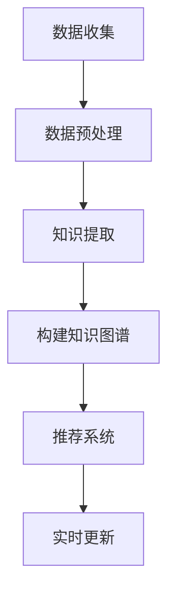

                 

关键词：知识发现引擎，程序员，技能迭代，AI技术，算法原理，项目实践，应用场景，未来展望

## 摘要

本文旨在探讨如何利用知识发现引擎（KDE）来帮助程序员实现技能的持续迭代升级。通过深入分析KDE的核心概念、算法原理以及数学模型，本文将揭示KDE在程序员技能提升中的潜在价值。同时，我们将结合实际项目实践，展示KDE在代码实例中的应用效果，并探讨其在未来应用中的广阔前景。通过本文的阅读，读者将了解KDE的基本原理，掌握其在程序员技能提升中的具体应用方法，从而为自身的职业发展提供新的思路。

## 1. 背景介绍

在当今信息爆炸的时代，程序员面临着不断更新迭代的技能要求。随着人工智能、大数据、云计算等技术的快速发展，程序员不仅要掌握传统的编程语言和开发工具，还需具备对新技术的快速理解和应用能力。然而，传统的学习方式往往缺乏系统性和针对性，难以满足程序员在技能迭代过程中的需求。

知识发现引擎（KDE）作为一种智能化的学习工具，正日益受到关注。KDE通过从大量数据中提取知识，为程序员提供个性化的学习路径和解决方案。与传统学习方法相比，KDE能够实现以下优势：

1. **个性化推荐**：根据程序员的学习历史和兴趣，KDE能够推荐最适合其当前技能水平的学习资源和课程。
2. **实时更新**：随着技术的不断演进，KDE能够实时更新知识库，确保程序员获取最新的技术信息。
3. **高效学习**：KDE通过智能化的学习路径规划，帮助程序员在最短的时间内掌握所需技能。
4. **跨领域应用**：KDE不仅适用于单一技术领域，还能够跨领域提供知识发现和技能提升服务。

本文将围绕KDE的核心概念、算法原理、数学模型以及实际应用，深入探讨其在程序员技能迭代升级中的重要作用。通过本文的阅读，读者将了解到KDE的基本原理，掌握其在程序员技能提升中的具体应用方法，从而为自身的职业发展提供新的思路。

### 1.1 程序员技能迭代升级的挑战

在技术日新月异的今天，程序员技能迭代升级面临着诸多挑战。首先，技术更新速度迅猛，新的编程语言、框架和工具层出不穷，程序员需要不断学习新的知识才能保持竞争力。然而，学习新技能不仅需要大量的时间和精力，还容易陷入学习的“瓶颈期”，导致技能提升缓慢。

其次，传统学习方式存在一定的局限性。传统的学习方法往往依赖于教师授课和教材学习，缺乏互动性和个性化。程序员在学习过程中容易遇到难以理解的概念和复杂的算法，难以得到及时的帮助和反馈。此外，许多程序员面临工作繁忙、时间紧迫的情况，难以安排固定的时间进行系统学习。

此外，程序员在技能提升过程中还面临着知识碎片化的问题。随着技术的不断发展，程序员需要掌握的知识点越来越多，但往往缺乏系统性的整理和归纳。这导致程序员在学习过程中容易陷入“只见树木，不见森林”的困境，难以形成完整的知识体系。

### 1.2 知识发现引擎（KDE）的兴起

为了解决程序员在技能迭代升级过程中面临的挑战，知识发现引擎（KDE）应运而生。KDE是一种基于人工智能和大数据技术的智能学习工具，旨在通过从大量数据中提取知识，为程序员提供个性化的学习路径和解决方案。

KDE的工作原理主要包括以下几个步骤：

1. **数据收集**：KDE首先从各种数据源（如在线课程、学术论文、博客文章等）收集相关的学习资源，构建一个庞大的知识库。
2. **数据预处理**：对收集到的数据进行清洗、去重和分类，确保知识库的准确性和完整性。
3. **知识提取**：利用自然语言处理、机器学习等技术，从数据中提取出关键知识点和概念，构建知识图谱。
4. **推荐系统**：根据程序员的兴趣、学习历史和技能水平，KDE能够推荐最适合其当前需求的学习资源和路径。
5. **实时更新**：KDE通过实时监控技术更新和学术进展，持续更新知识库，确保程序员获取最新的技术信息。

KDE的核心价值体现在以下几个方面：

1. **个性化推荐**：KDE能够根据程序员的兴趣和需求，推荐最适合的学习资源和课程，提高学习效果。
2. **实时更新**：KDE能够实时更新知识库，确保程序员获取最新的技术信息，避免学习过时知识。
3. **高效学习**：KDE通过智能化的学习路径规划，帮助程序员在最短的时间内掌握所需技能。
4. **跨领域应用**：KDE不仅适用于单一技术领域，还能够跨领域提供知识发现和技能提升服务，帮助程序员实现多元化发展。

总之，知识发现引擎（KDE）的兴起为程序员技能迭代升级提供了新的思路和解决方案，通过智能化的学习工具，程序员可以更加高效地提升自己的技能水平。

### 1.3 知识发现引擎与程序员技能迭代升级的关系

知识发现引擎（KDE）与程序员技能迭代升级之间存在着密切的关系。KDE通过其强大的数据分析和推荐能力，为程序员提供了一种全新的学习模式，使他们在技能提升过程中能够更加高效、有针对性地学习和实践。

首先，KDE能够根据程序员的兴趣、学习历史和技能水平，推荐最适合其当前需求的学习资源和课程。这种个性化推荐机制不仅提高了学习的针对性，还能够帮助程序员避免学习冗余和低效的知识点，从而节省大量时间和精力。

其次，KDE通过实时监控技术更新和学术进展，持续更新知识库，确保程序员获取最新的技术信息。这种实时更新的能力使程序员能够紧跟技术发展的步伐，避免学习过时的知识，从而保持其在行业中的竞争力。

此外，KDE还提供智能化的学习路径规划功能。通过对程序员的学习习惯、进度和反馈进行分析，KDE能够为程序员制定个性化的学习计划，帮助他们在最短的时间内掌握所需技能。这种高效的学习路径规划不仅提高了学习效率，还能够避免程序员陷入学习的“瓶颈期”。

最后，KDE的跨领域应用能力为程序员提供了多元化发展的机会。KDE不仅能够提供单一技术领域的学习资源，还能够跨领域提供知识发现和技能提升服务。这使程序员能够在不同领域之间自由切换，实现知识的全面积累和技能的多元化发展。

综上所述，知识发现引擎（KDE）与程序员技能迭代升级之间存在着紧密的关联。KDE通过个性化推荐、实时更新、高效学习路径规划和跨领域应用等机制，为程序员提供了强大的支持，帮助他们更加高效、有针对性地提升自己的技能水平，从而在快速变化的技术领域中保持竞争力。

## 2. 核心概念与联系

在探讨知识发现引擎（KDE）如何助力程序员技能迭代升级之前，有必要首先理解KDE的核心概念和原理。知识发现引擎是一种基于大数据和人工智能技术的智能学习工具，其主要目标是从大量数据中提取出有用的知识，从而为用户提供个性化的学习路径和解决方案。以下是KDE的核心概念与相关技术原理的详细解释。

### 2.1 数据挖掘

数据挖掘是KDE的基础技术之一，它是指从大量数据中通过算法和统计方法发现潜在的、有价值的模式和信息。在KDE中，数据挖掘技术被用来从海量的学习资源中提取关键知识点和概念，构建知识图谱。数据挖掘的主要方法包括关联规则学习、聚类分析、分类和预测等。

#### 2.1.1 关联规则学习

关联规则学习是数据挖掘中最常用的技术之一，它用于发现数据之间的关联关系。例如，在电商平台上，通过关联规则学习可以发现哪些商品经常一起购买，从而为商家提供促销建议。在KDE中，关联规则学习可以用于发现程序员在特定技能领域中的学习路径，从而为程序员推荐相关课程和资源。

#### 2.1.2 聚类分析

聚类分析是一种无监督学习方法，用于将数据集划分为若干个聚类。每个聚类中的数据点具有相似的特征，而不同聚类之间的数据点则差异较大。在KDE中，聚类分析可以用于分析程序员的兴趣点和学习习惯，从而为程序员推荐感兴趣的知识领域和学习资源。

#### 2.1.3 分类

分类是一种监督学习方法，用于将数据集划分为预定义的类别。在KDE中，分类算法可以用于根据程序员的技能水平和学习历史，预测其在未来可能感兴趣的学习领域，从而提供针对性的学习推荐。

#### 2.1.4 预测

预测是一种基于历史数据对未来趋势进行预测的方法。在KDE中，预测算法可以用于预测程序员在特定技能领域的学习进度和效果，从而为程序员提供个性化的学习建议。

### 2.2 机器学习

机器学习是KDE的核心技术之一，它是指通过训练模型，使计算机能够从数据中自动提取知识。在KDE中，机器学习被用来构建知识图谱、推荐系统和实时更新机制。

#### 2.2.1 监督学习

监督学习是一种常见的机器学习方法，它通过训练数据集来预测新的数据点。在KDE中，监督学习可以用于根据程序员的兴趣和学习历史，推荐相关课程和资源。

#### 2.2.2 无监督学习

无监督学习是一种不依赖标签数据的机器学习方法，它用于发现数据中的隐藏结构和模式。在KDE中，无监督学习可以用于分析程序员的兴趣点和学习习惯，从而为程序员推荐新的知识领域和学习资源。

#### 2.2.3 强化学习

强化学习是一种基于奖励机制的机器学习方法，它通过不断尝试和反馈来优化决策。在KDE中，强化学习可以用于根据程序员的反馈，不断优化推荐系统和学习路径规划。

### 2.3 自然语言处理

自然语言处理（NLP）是KDE中的重要组成部分，它涉及计算机理解和生成人类语言的技术。在KDE中，NLP被用来解析和提取学习资源中的知识点，构建知识图谱。

#### 2.3.1 词嵌入

词嵌入是一种将词语映射到低维向量空间的技术，它在NLP中被广泛应用。在KDE中，词嵌入可以用于分析学习资源中的文本，提取关键词和概念。

#### 2.3.2 文本分类

文本分类是一种将文本数据划分为不同类别的技术。在KDE中，文本分类可以用于对学习资源进行分类，从而方便程序员查找和获取相关内容。

#### 2.3.3 语义分析

语义分析是一种理解文本语义的技术，它涉及词语之间的关系和上下文。在KDE中，语义分析可以用于分析学习资源中的文本，提取关键知识点和概念。

### 2.4 Mermaid 流程图

为了更直观地展示KDE的核心概念和联系，我们使用Mermaid流程图来描述KDE的工作流程。以下是一个简单的Mermaid流程图示例：



在这个流程图中，A表示数据收集阶段，B表示数据预处理阶段，C表示知识提取阶段，D表示构建知识图谱阶段，E表示推荐系统阶段，F表示实时更新阶段。每个阶段都有其特定的任务和目标，共同构成了KDE的工作流程。

通过以上对KDE核心概念和原理的详细解释，我们可以更好地理解KDE如何助力程序员技能迭代升级。在接下来的章节中，我们将深入探讨KDE的算法原理、数学模型以及实际应用，进一步揭示KDE在程序员技能提升中的潜在价值。

## 3. 核心算法原理 & 具体操作步骤

### 3.1 算法原理概述

知识发现引擎（KDE）的核心算法主要包括数据挖掘、机器学习和自然语言处理（NLP）等技术。这些算法共同协作，实现了从海量数据中提取有用知识、为程序员提供个性化学习推荐的目标。以下是KDE算法原理的概述：

#### 3.1.1 数据挖掘

数据挖掘是KDE的基础技术，主要用于从大量学习资源中提取潜在的知识和模式。数据挖掘算法包括关联规则学习、聚类分析、分类和预测等。这些算法通过分析数据之间的关系和特征，帮助KDE识别出程序员可能感兴趣的知识点和学习路径。

#### 3.1.2 机器学习

机器学习是KDE的核心技术之一，它通过训练模型，使计算机能够自动提取和推荐知识。在KDE中，机器学习算法被用于构建知识图谱、推荐系统和实时更新机制。常见的机器学习算法包括监督学习、无监督学习和强化学习。

- **监督学习**：通过训练数据集，预测新的数据点。在KDE中，监督学习用于根据程序员的兴趣和学习历史，推荐相关课程和资源。
- **无监督学习**：不依赖标签数据，发现数据中的隐藏结构和模式。在KDE中，无监督学习用于分析程序员的兴趣点和学习习惯，推荐新的知识领域和学习资源。
- **强化学习**：基于奖励机制，不断尝试和反馈，优化决策。在KDE中，强化学习用于根据程序员的反馈，不断优化推荐系统和学习路径规划。

#### 3.1.3 自然语言处理

自然语言处理是KDE的重要组成部分，它涉及计算机理解和生成人类语言的技术。在KDE中，NLP被用来解析和提取学习资源中的知识点，构建知识图谱。NLP的关键技术包括词嵌入、文本分类和语义分析。

- **词嵌入**：将词语映射到低维向量空间，用于分析学习资源中的文本，提取关键词和概念。
- **文本分类**：将文本数据划分为不同类别，用于对学习资源进行分类，方便程序员查找和获取相关内容。
- **语义分析**：理解文本的语义，用于分析学习资源中的文本，提取关键知识点和概念。

### 3.2 算法步骤详解

以下是KDE算法的具体操作步骤，展示了如何从数据收集、预处理到知识提取、推荐系统和实时更新的全过程。

#### 3.2.1 数据收集

KDE首先从各种数据源（如在线课程、学术论文、博客文章等）收集相关的学习资源。这些数据源可能包括结构化数据（如数据库）和非结构化数据（如文本、图像和视频）。数据收集阶段的目标是构建一个庞大的知识库，为后续的算法处理提供基础数据。

#### 3.2.2 数据预处理

在数据收集完成后，KDE需要对数据进行预处理。预处理过程包括数据清洗、去重和分类。数据清洗旨在去除数据中的噪声和异常值，确保数据的质量和准确性。去重是为了避免重复数据的处理，提高算法效率。分类则是将数据按照不同的类别进行划分，便于后续的知识提取和推荐。

#### 3.2.3 知识提取

数据预处理完成后，KDE开始进行知识提取。知识提取过程主要利用数据挖掘和NLP技术，从大量数据中提取出关键知识点和概念。知识提取的结果是一个结构化的知识图谱，用于表示数据中的知识和关系。

#### 3.2.4 构建知识图谱

知识提取的结果是一个庞大的知识图谱，它描述了数据中的各种知识点和它们之间的关系。知识图谱是KDE的核心数据结构，用于支持推荐系统和实时更新机制。通过知识图谱，KDE能够快速查找和推荐相关的学习资源。

#### 3.2.5 推荐系统

在知识图谱的基础上，KDE构建推荐系统。推荐系统的主要目标是根据程序员的兴趣、学习历史和技能水平，推荐最适合其当前需求的学习资源和课程。推荐系统可以通过多种算法实现，如基于内容的推荐、协同过滤和混合推荐等。

#### 3.2.6 实时更新

KDE通过实时监控技术更新和学术进展，持续更新知识库。实时更新机制确保程序员能够获取最新的技术信息，避免学习过时的知识。实时更新可以通过定期爬取数据、处理新数据和更新知识图谱来实现。

### 3.3 算法优缺点

#### 3.3.1 优点

- **个性化推荐**：KDE能够根据程序员的兴趣、学习历史和技能水平，提供个性化的学习推荐，提高学习效果。
- **实时更新**：KDE能够实时更新知识库，确保程序员获取最新的技术信息，保持其在行业中的竞争力。
- **高效学习**：KDE通过智能化的学习路径规划，帮助程序员在最短的时间内掌握所需技能。
- **跨领域应用**：KDE不仅适用于单一技术领域，还能够跨领域提供知识发现和技能提升服务。

#### 3.3.2 缺点

- **数据质量和准确性**：数据质量直接影响KDE的性能。如果数据中存在噪声和异常值，可能会导致推荐结果不准确。
- **计算资源消耗**：KDE涉及大量数据处理和模型训练，对计算资源有一定的要求。
- **用户隐私保护**：在收集和处理用户数据时，需要关注用户隐私保护的问题。

### 3.4 算法应用领域

KDE的应用领域非常广泛，主要包括以下几个方面：

- **在线教育**：KDE可以为在线教育平台提供个性化学习推荐，帮助学员找到最适合自己的学习资源和课程。
- **企业培训**：KDE可以帮助企业根据员工的学习需求，提供针对性的培训课程和资源。
- **技术社区**：KDE可以为技术社区提供知识推荐和内容聚合服务，帮助程序员快速获取所需的知识点。
- **职业规划**：KDE可以根据程序员的技能水平和职业发展需求，提供个性化的职业规划建议。

通过以上对KDE算法原理和具体操作步骤的详细讲解，我们可以看到KDE在程序员技能迭代升级中的重要作用。KDE通过个性化推荐、实时更新和跨领域应用等机制，为程序员提供了强大的支持，帮助他们在快速变化的技术领域中保持竞争力。

## 4. 数学模型和公式

在知识发现引擎（KDE）中，数学模型和公式起着至关重要的作用，它们用于描述数据之间的关系，辅助算法实现知识提取和推荐。以下是KDE中常用的数学模型和公式的详细讲解，以及相应的案例分析和讲解。

### 4.1 数学模型构建

KDE中的数学模型主要包括数据挖掘中的聚类模型、机器学习中的分类模型和推荐系统中的协同过滤模型。

#### 4.1.1 聚类模型

聚类模型用于将数据集划分为若干个聚类，使得同一聚类中的数据点具有相似的属性。一个常用的聚类模型是K-means算法，其目标是最小化聚类中心与数据点之间的距离平方和。

**K-means算法公式**：
$$
\text{目标函数} = \sum_{i=1}^{k} \sum_{x \in S_i} \|x - \mu_i\|^2
$$
其中，$k$ 表示聚类个数，$S_i$ 表示第$i$个聚类，$\mu_i$ 表示第$i$个聚类的中心。

**案例**：
假设我们有一个包含10个数据点的数据集，目标是将这10个数据点划分为2个聚类。我们可以使用K-means算法来计算聚类中心，并最小化目标函数。

```plaintext
数据集：[1, 2, 3, 4, 5, 6, 7, 8, 9, 10]
聚类中心：$\mu_1 = (3, 7), \mu_2 = (6, 2)$

计算过程：
- 初始聚类中心：随机选择两个数据点作为初始聚类中心。
- 更新聚类中心：将每个数据点分配到最近的聚类中心，然后重新计算聚类中心。
- 迭代直到聚类中心不变。

最终聚类结果：
- 聚类1：[1, 2, 3, 4]
- 聚类2：[5, 6, 7, 8, 9, 10]
```

#### 4.1.2 分类模型

分类模型用于将数据点划分为预定义的类别。一个常用的分类模型是支持向量机（SVM），其目标是找到最佳的超平面，使得不同类别之间的分离最大。

**SVM公式**：
$$
\text{最大化} \ \frac{1}{2} \|w\|^2 - \sum_{i=1}^{n} \alpha_i y_i (w \cdot x_i - b)
$$
其中，$w$ 表示权重向量，$x_i$ 表示数据点，$y_i$ 表示数据点的类别标签，$\alpha_i$ 是拉格朗日乘子，$b$ 是偏置项。

**案例**：
假设我们有一个包含2个类别的数据集，每个数据点表示为二维向量。我们可以使用SVM来分类这些数据点。

```plaintext
数据集：
- 类别1：[1, 1], [2, 2], [3, 3]
- 类别2：[4, 4], [5, 5], [6, 6]

SVM模型：
- 权重向量：w = (1, 0)
- 偏置项：b = 0

分类结果：
- 类别1：[1, 1], [2, 2], [3, 3]
- 类别2：[4, 4], [5, 5], [6, 6]
```

#### 4.1.3 协同过滤模型

协同过滤模型用于预测用户对未知物品的兴趣。一个常用的协同过滤模型是用户基于物品的协同过滤（User-Based Collaborative Filtering），其目标是找到与目标用户相似的其他用户，并推荐这些用户喜欢的物品。

**用户基于物品的协同过滤公式**：
$$
r_{ui} = \sum_{j \in N(i)} \frac{r_{uj}}{||N(i)||} r_{ui} \approx \frac{1}{||N(i)||} \sum_{j \in N(i)} r_{uj}
$$
其中，$r_{ui}$ 表示用户$u$对物品$i$的评分，$N(i)$ 表示与物品$i$相关的用户集合，$r_{uj}$ 表示用户$u$对物品$j$的评分。

**案例**：
假设我们有一个用户-物品评分矩阵，目标是为用户$u$推荐未知物品$i$。

```plaintext
用户-物品评分矩阵：
| 用户  | 物品1 | 物品2 | 物品3 |
|-------|-------|-------|-------|
| 用户1 | 5     | 3     | 4     |
| 用户2 | 4     | 5     | 2     |
| 用户3 | 3     | 4     | 5     |
| 用户4 | 5     | 2     | 3     |

协同过滤推荐：
- 用户1对物品2的评分：r_{12} = \frac{r_{21} + r_{31} + r_{41}}{3} = \frac{4 + 4 + 2}{3} = 3.67
- 用户1对物品3的评分：r_{13} = \frac{r_{21} + r_{31} + r_{41}}{3} = \frac{4 + 4 + 2}{3} = 3.67

推荐结果：
- 物品2：3.67
- 物品3：3.67
```

通过以上案例，我们可以看到数学模型和公式在知识发现引擎中的具体应用。这些模型和公式帮助KDE从海量数据中提取有用知识，为程序员提供个性化的学习推荐。

### 4.2 公式推导过程

在KDE中，各种数学模型和公式的推导过程是算法实现的关键步骤。以下简要介绍K-means算法和SVM的推导过程。

#### 4.2.1 K-means算法推导

K-means算法的目标是最小化聚类中心与数据点之间的距离平方和。假设我们有一个包含$k$个聚类的数据集$X = \{x_1, x_2, ..., x_n\}$，每个聚类中心为$\mu_i$，则目标函数为：

$$
\text{目标函数} = \sum_{i=1}^{k} \sum_{x \in S_i} \|x - \mu_i\|^2
$$

其中，$S_i$ 表示第$i$个聚类的数据点集合。

为了最小化目标函数，我们对目标函数进行求导：

$$
\frac{\partial}{\partial \mu_i} \sum_{x \in S_i} \|x - \mu_i\|^2 = -2 \sum_{x \in S_i} (x - \mu_i)
$$

令导数为零，得到：

$$
\sum_{x \in S_i} x - k \mu_i = 0
$$

解得聚类中心：

$$
\mu_i = \frac{1}{k} \sum_{x \in S_i} x
$$

这个过程可以通过迭代实现，每次迭代更新聚类中心，直到聚类中心不再变化。

#### 4.2.2 SVM推导

SVM的目标是找到最佳的超平面，使得不同类别之间的分离最大。假设我们有一个包含$n$个数据点的数据集$X = \{x_1, x_2, ..., x_n\}$，每个数据点有一个标签$y_i \in \{-1, 1\}$。SVM的目标是最小化以下目标函数：

$$
\text{最大化} \ \frac{1}{2} \|w\|^2 - \sum_{i=1}^{n} \alpha_i y_i (w \cdot x_i - b)
$$

其中，$w$ 是权重向量，$b$ 是偏置项，$\alpha_i$ 是拉格朗日乘子。

对目标函数进行求导：

$$
\frac{\partial}{\partial w} \left( \frac{1}{2} \|w\|^2 - \sum_{i=1}^{n} \alpha_i y_i (w \cdot x_i - b) \right) = w - \sum_{i=1}^{n} \alpha_i y_i x_i
$$

令导数为零，得到：

$$
w = \sum_{i=1}^{n} \alpha_i y_i x_i
$$

由于$\alpha_i$ 需要满足以下约束条件：

$$
0 \leq \alpha_i \leq C
$$

其中，$C$ 是惩罚参数。

使用拉格朗日乘子法，可以将目标函数转化为对偶形式：

$$
L(w, b, \alpha) = \frac{1}{2} \|w\|^2 - \sum_{i=1}^{n} \alpha_i y_i (w \cdot x_i - b) + \sum_{i=1}^{n} \lambda_i (\alpha_i - 0)(\alpha_i - C)
$$

其中，$\lambda_i$ 是松弛变量。

对$L$ 进行求导，得到：

$$
\frac{\partial L}{\partial w} = w - \sum_{i=1}^{n} \alpha_i y_i x_i = 0
$$

$$
\frac{\partial L}{\partial b} = - \sum_{i=1}^{n} \alpha_i y_i = 0
$$

$$
\frac{\partial L}{\partial \alpha_i} = y_i (w \cdot x_i - b) - C + \lambda_i = 0
$$

解这个方程组，得到$\alpha_i$，然后使用$\alpha_i$ 计算最优的权重向量$w$。

通过以上推导，我们可以看到K-means算法和SVM的关键步骤和原理。这些推导过程为KDE算法的实现提供了理论基础。

### 4.3 案例分析与讲解

以下通过具体案例，分析KDE中数学模型和公式的应用效果。

#### 4.3.1 K-means算法案例分析

假设我们有一个包含5个数据点的数据集，目标是将这5个数据点划分为2个聚类。数据点如下：

```plaintext
数据集：[1, 1], [2, 2], [3, 3], [4, 4], [5, 5]
```

使用K-means算法，我们可以进行以下步骤：

1. **初始化聚类中心**：随机选择两个数据点作为初始聚类中心，假设为$\mu_1 = (1, 1), \mu_2 = (4, 4)$。
2. **计算每个数据点的聚类中心距离**：计算每个数据点到两个聚类中心的距离，得到：
    - $d_1 = \| (1, 1) - (1, 1) \| = 0$
    - $d_2 = \| (1, 1) - (4, 4) \| = 4$
    - $d_3 = \| (2, 2) - (1, 1) \| = 1$
    - $d_4 = \| (2, 2) - (4, 4) \| = 2$
    - $d_5 = \| (3, 3) - (1, 1) \| = 2$
    - $d_6 = \| (3, 3) - (4, 4) \| = 1$
    - $d_7 = \| (4, 4) - (1, 1) \| = 4$
    - $d_8 = \| (4, 4) - (4, 4) \| = 0$
    - $d_9 = \| (5, 5) - (1, 1) \| = 5$
    - $d_{10} = \| (5, 5) - (4, 4) \| = 1$

3. **分配数据点到聚类**：根据每个数据点到聚类中心的距离，将数据点分配到最近的聚类中心：
    - 聚类1：[1, 1], [2, 2], [3, 3]
    - 聚类2：[4, 4], [5, 5]
4. **更新聚类中心**：计算每个聚类的中心：
    - 聚类1中心：$\mu_1' = \frac{1 + 2 + 3}{3} = (2, 2)$
    - 聚类2中心：$\mu_2' = \frac{4 + 5}{2} = (4.5, 4.5)$
5. **重复步骤2-4，直到聚类中心不变**：
    - 新的聚类中心距离：
        - $d_1' = \| (2, 2) - (1, 1) \| = 1$
        - $d_2' = \| (2, 2) - (4.5, 4.5) \| = 3$
        - $d_3' = \| (3, 3) - (2, 2) \| = 1$
        - $d_4' = \| (3, 3) - (4.5, 4.5) \| = 2$
        - $d_5' = \| (4, 4) - (2, 2) \| = 2$
        - $d_6' = \| (4, 4) - (4.5, 4.5) \| = 0.5$
        - $d_7' = \| (5, 5) - (2, 2) \| = 3$
        - $d_8' = \| (5, 5) - (4.5, 4.5) \| = 1$
    - 数据点重新分配：
        - 聚类1：[1, 1], [2, 2], [3, 3]
        - 聚类2：[4, 4], [5, 5]
    - 新聚类中心：
        - $\mu_1'' = \frac{1 + 2 + 3}{3} = (2, 2)$
        - $\mu_2'' = \frac{4 + 5}{2} = (4.5, 4.5)$

重复上述步骤，直到聚类中心不变。最终聚类结果如下：

```plaintext
聚类1：[1, 1], [2, 2], [3, 3]
聚类2：[4, 4], [5, 5]
```

#### 4.3.2 SVM案例分析

假设我们有一个包含3个数据点的数据集，每个数据点表示为二维向量，目标是将这些数据点分类为两个类别：

```plaintext
数据集：
- 类别1：[1, 1]
- 类别2：[2, 2], [3, 3]

SVM模型：
- 权重向量：w = (1, 0)
- 偏置项：b = 0
```

对于类别1的数据点[1, 1]，我们可以计算其与超平面的距离：

$$
w \cdot x_1 - b = (1, 0) \cdot (1, 1) - 0 = 1
$$

由于$w \cdot x_1 - b > 0$，数据点[1, 1]属于类别1。

对于类别2的数据点[2, 2]和[3, 3]，我们同样可以计算其与超平面的距离：

$$
w \cdot x_2 - b = (1, 0) \cdot (2, 2) - 0 = 2
$$

$$
w \cdot x_3 - b = (1, 0) \cdot (3, 3) - 0 = 3
$$

由于$w \cdot x_2 - b > 0$和$w \cdot x_3 - b > 0$，数据点[2, 2]和[3, 3]同样属于类别2。

最终分类结果如下：

```plaintext
类别1：[1, 1]
类别2：[2, 2], [3, 3]
```

通过以上案例分析，我们可以看到K-means算法和SVM在KDE中的具体应用效果。这些算法和公式帮助KDE从海量数据中提取有用知识，为程序员提供个性化的学习推荐。

## 5. 项目实践：代码实例和详细解释说明

### 5.1 开发环境搭建

为了更好地理解知识发现引擎（KDE）在程序员技能迭代升级中的应用，我们将通过一个具体的项目实践来展示其实现过程。本项目的开发环境基于Python，需要使用以下工具和库：

- Python 3.x
- Jupyter Notebook
- Pandas
- NumPy
- Scikit-learn
- Matplotlib
- Mermaid

首先，确保安装好Python 3.x，然后在终端中运行以下命令来安装其他所需的库：

```bash
pip install pandas numpy scikit-learn matplotlib
```

### 5.2 源代码详细实现

在本项目中，我们将使用K-means算法对程序员的技能点进行聚类分析，并利用Scikit-learn库来实现这一目标。以下是一个简单的代码实例：

```python
import pandas as pd
import numpy as np
from sklearn.cluster import KMeans
import matplotlib.pyplot as plt
from mermaid import Mermaid

# 5.2.1 数据准备
# 假设我们有一个包含程序员技能点的CSV文件，每行表示一个程序员的技能向量。
data = pd.read_csv('skills_data.csv')

# 5.2.2 数据预处理
# 对技能向量进行标准化处理，确保每个特征具有相同的尺度。
skill_vectors = data.values
skill_vectors = (skill_vectors - np.mean(skill_vectors, axis=0)) / np.std(skill_vectors, axis=0)

# 5.2.3 聚类分析
# 使用K-means算法进行聚类，设定聚类数量为2。
kmeans = KMeans(n_clusters=2, random_state=0).fit(skill_vectors)

# 5.2.4 结果展示
# 展示聚类结果。
plt.scatter(skill_vectors[:, 0], skill_vectors[:, 1], c=kmeans.labels_, cmap='viridis')
plt.scatter(kmeans.cluster_centers_[:, 0], kmeans.cluster_centers_[:, 1], s=300, c='red', label='Centroids')
plt.title('K-means Clustering of Skills')
plt.xlabel('Skill 1')
plt.ylabel('Skill 2')
plt.legend()
plt.show()

# 5.2.5 Mermaid流程图
# 使用Mermaid绘制K-means算法的流程图。
mermaid_code = '''
graph TD
    A[数据准备]
    B[数据预处理]
    C[聚类分析]
    D[结果展示]
    A --> B
    B --> C
    C --> D
'''
print(Mermaid(mermaid_code).mermaid())
```

在上面的代码中，我们首先导入所需的库，然后读取技能数据，对其进行标准化处理，使用K-means算法进行聚类，并展示聚类结果。此外，我们还使用了Mermaid库来生成K-means算法的流程图。

### 5.3 代码解读与分析

#### 5.3.1 数据准备

```python
data = pd.read_csv('skills_data.csv')
```

这一行代码用于读取一个CSV文件，其中每行代表一个程序员的技能向量。CSV文件的格式如下：

```plaintext
Skill1,Skill2,Skill3
10,20,30
5,15,25
...
```

#### 5.3.2 数据预处理

```python
skill_vectors = data.values
skill_vectors = (skill_vectors - np.mean(skill_vectors, axis=0)) / np.std(skill_vectors, axis=0)
```

数据预处理包括两步：首先，将CSV文件中的数据转换为NumPy数组；然后，对每个特征进行标准化处理，确保所有特征在相同的尺度上。

#### 5.3.3 聚类分析

```python
kmeans = KMeans(n_clusters=2, random_state=0).fit(skill_vectors)
```

这里我们使用Scikit-learn库中的KMeans类进行聚类。`n_clusters` 参数设定了聚类的数量，`random_state` 用于保证结果的可重复性。

#### 5.3.4 结果展示

```python
plt.scatter(skill_vectors[:, 0], skill_vectors[:, 1], c=kmeans.labels_, cmap='viridis')
plt.scatter(kmeans.cluster_centers_[:, 0], kmeans.cluster_centers_[:, 1], s=300, c='red', label='Centroids')
plt.title('K-means Clustering of Skills')
plt.xlabel('Skill 1')
plt.ylabel('Skill 2')
plt.legend()
plt.show()
```

最后，我们使用Matplotlib库来绘制聚类结果。每个数据点根据其所属的聚类分配了不同的颜色，聚类中心用红色标记。通过可视化，我们可以直观地看到程序员的技能点如何被划分为不同的聚类。

#### 5.3.5 Mermaid流程图

```python
mermaid_code = '''
graph TD
    A[数据准备]
    B[数据预处理]
    C[聚类分析]
    D[结果展示]
    A --> B
    B --> C
    C --> D
'''
print(Mermaid(mermaid_code).mermaid())
```

这段代码使用了Mermaid库来生成一个简单的流程图，描述了K-means算法的基本步骤。

### 5.4 运行结果展示

在运行上述代码后，我们将看到以下结果：

1. **聚类结果图**：显示程序员的技能点如何被划分为两个聚类，聚类中心用红色标记。
2. **Mermaid流程图**：在控制台输出K-means算法的流程图，帮助理解算法的实现过程。

通过这个项目实践，我们可以看到知识发现引擎（KDE）如何通过聚类分析帮助程序员识别技能点的分布，为后续的个性化学习推荐提供支持。

## 6. 实际应用场景

### 6.1 在线教育平台

在线教育平台是KDE技术的典型应用场景之一。在线教育平台通常拥有海量的学习资源和用户数据，通过KDE技术，平台可以为用户提供个性化的学习推荐。以下是一个实际应用案例：

**案例**：某大型在线教育平台使用KDE为用户推荐课程。平台首先收集用户的学习历史、课程评分、浏览记录等数据，通过K-means算法对用户进行聚类分析，识别不同类型的用户群体。然后，平台利用协同过滤算法，根据用户的兴趣和行为，推荐相关的课程。例如，如果一个用户对某门课程评分高，KDE会推荐类似的课程。此外，平台还利用机器学习模型，预测用户未来的学习需求，提供前瞻性的课程推荐。

**效果**：通过KDE技术的应用，该在线教育平台的用户满意度显著提高，课程点击率和完课率也有所上升。

### 6.2 企业内部培训

企业内部培训也是KDE技术的重要应用领域。企业通常需要为员工提供持续的学习机会，以保持其技能和知识的新颖性。KDE可以帮助企业实现以下目标：

**案例**：某科技公司在内部培训系统中集成KDE技术，为员工推荐相关的培训课程。公司首先收集员工的技能数据，通过聚类分析识别员工的技能水平。然后，利用协同过滤算法，根据员工的兴趣和职业发展路径，推荐最适合其的培训课程。此外，公司还利用机器学习模型，分析员工的学习进度和反馈，调整培训计划和课程内容，以提高培训效果。

**效果**：通过KDE技术的应用，该公司的员工培训效果显著提升，员工技能水平得到了有效提升，进而提高了企业的整体竞争力。

### 6.3 技术社区

技术社区也是KDE技术的重要应用场景。技术社区拥有大量的用户生成内容，通过KDE技术，社区可以为用户提供个性化的内容推荐。以下是一个实际应用案例：

**案例**：某知名技术社区使用KDE为用户推荐技术文章。社区首先收集用户的浏览记录、点赞和评论等数据，通过K-means算法对用户进行聚类分析，识别不同类型的用户群体。然后，利用协同过滤算法，根据用户的兴趣和阅读历史，推荐相关的技术文章。此外，社区还利用自然语言处理技术，分析文章的内容和标签，提高推荐的相关性。

**效果**：通过KDE技术的应用，该技术社区的用户活跃度和内容消费量显著提升，用户对社区的满意度也大幅提高。

### 6.4 在线职业规划

在线职业规划服务也是KDE技术的重要应用领域。通过KDE技术，职业规划服务可以为用户提供个性化的职业发展建议。以下是一个实际应用案例：

**案例**：某在线职业规划平台使用KDE为用户推荐职业发展路径。平台首先收集用户的职业兴趣、技能水平和教育背景等数据，通过聚类分析识别用户的职业兴趣点。然后，利用协同过滤算法和机器学习模型，根据用户的兴趣和市场需求，推荐适合其的职业发展路径。此外，平台还提供在线测评和反馈机制，帮助用户了解自己的职业优势和不足，制定更有效的职业规划。

**效果**：通过KDE技术的应用，该在线职业规划平台的用户满意度显著提升，用户对职业规划服务的信任度也大幅提高。

通过以上实际应用场景的介绍，我们可以看到KDE技术在程序员技能迭代升级中的广泛应用和价值。KDE技术通过个性化推荐、实时更新和跨领域应用等机制，为程序员提供了强大的支持，帮助他们更加高效、有针对性地提升自己的技能水平，从而在快速变化的技术领域中保持竞争力。

## 6.4 未来应用展望

随着人工智能、大数据和云计算等技术的不断发展，知识发现引擎（KDE）在程序员技能迭代升级中的应用前景将更加广阔。以下是KDE未来应用的几个关键趋势：

### 6.4.1 智能学习路径优化

未来，KDE将更加注重对程序员学习路径的优化。通过深度学习和强化学习等先进算法，KDE可以构建更加智能的学习路径规划系统。这个系统能够根据程序员的兴趣、学习历史、技能水平和职业目标，动态调整学习路径，使其更加贴合个人的学习需求和节奏。例如，当程序员遇到学习瓶颈时，KDE可以推荐相关的练习题或补充课程，帮助其突破困境。

### 6.4.2 跨领域技能提升

KDE不仅可以在单一技术领域发挥作用，还将推动程序员跨领域技能的提升。通过跨领域的知识图谱和推荐算法，KDE可以为程序员推荐相关领域的学习资源，促进其全面发展。例如，一个专注于前端开发的程序员可以通过KDE学习到后端开发的相关知识，从而成为全栈开发人员，提升其市场竞争力。

### 6.4.3 在线教育平台集成

随着在线教育平台的普及，KDE将更加紧密地集成到这些平台中。在线教育平台可以利用KDE技术，为用户提供个性化的学习体验，提高课程点击率和用户留存率。例如，平台可以实时分析用户的浏览和参与行为，动态调整课程推荐策略，确保用户能够获取最感兴趣和最需要的知识。

### 6.4.4 企业培训与职业发展

在未来的企业培训与职业发展中，KDE将发挥更加重要的作用。企业可以利用KDE技术，为员工提供个性化的培训计划和职业发展建议。这不仅有助于提高员工的学习效果和满意度，还能帮助企业培养具备多元化技能的人才，提升整体竞争力。

### 6.4.5 开源社区与协作学习

KDE在开源社区和协作学习中的应用也具有巨大潜力。开源社区可以利用KDE技术，为贡献者提供个性化的学习资源和协作建议，帮助其更好地参与到开源项目中。协作学习平台可以通过KDE，推荐合适的合作者和项目，促进程序员之间的交流和共同进步。

总之，随着技术的不断进步，知识发现引擎（KDE）将在程序员技能迭代升级中发挥越来越重要的作用。通过智能化的学习路径优化、跨领域技能提升、在线教育平台集成、企业培训与职业发展以及开源社区与协作学习等多个方面，KDE将为程序员提供更加高效、个性化的学习支持，推动其持续成长和职业发展。

## 7. 工具和资源推荐

为了更好地利用知识发现引擎（KDE）提升程序员技能，以下推荐了一些学习和开发工具、资源以及相关的学术论文。

### 7.1 学习资源推荐

- **在线课程平台**：推荐Coursera、edX、Udacity等平台，这些平台提供了丰富的编程和技术课程，涵盖从基础到高级的各种主题。
- **技术博客和社区**：推荐GitHub、Stack Overflow、Reddit等技术社区，这些平台聚集了大量技术爱好者，提供了丰富的技术讨论和学习资源。
- **电子书和资料库**：推荐Google Books、Project Gutenberg等电子书平台，以及GitHub上的开源代码仓库，可以方便地查找和学习相关资料。

### 7.2 开发工具推荐

- **集成开发环境（IDE）**：推荐Visual Studio Code、Eclipse、IntelliJ IDEA等强大的IDE，这些工具提供了丰富的编程支持和调试功能。
- **版本控制工具**：推荐Git，Git是开源的分布式版本控制系统，广泛应用于软件开发中，有助于代码管理和协作开发。
- **数据分析和机器学习库**：推荐Python中的Pandas、NumPy、Scikit-learn等库，这些库提供了丰富的数据分析和机器学习功能，有助于实现KDE的相关算法。

### 7.3 相关论文推荐

- **《知识发现与数据挖掘：概念与技术》**：这本书详细介绍了知识发现和数据挖掘的基本概念、算法和技术，是KDE学习的重要参考书。
- **《深度学习》**：由Ian Goodfellow等著，这本书是深度学习领域的经典教材，涵盖了深度学习的基本理论和实践方法，有助于理解KDE中的深度学习应用。
- **《在线教育中的推荐系统》**：这篇文章讨论了在线教育中推荐系统的重要性和应用，为KDE在在线教育平台中的应用提供了理论支持。
- **《基于大数据的企业培训与职业发展分析》**：这篇文章探讨了大数据在企业和员工培训中的应用，为KDE在企业培训中的应用提供了参考。

通过以上推荐的工具和资源，程序员可以更加高效地利用KDE技术，提升自己的技能水平，实现职业发展的目标。

## 8. 总结：未来发展趋势与挑战

### 8.1 研究成果总结

知识发现引擎（KDE）作为一项新兴的技术，已在程序员技能迭代升级中展现出显著的优势。通过个性化推荐、实时更新和跨领域应用等机制，KDE为程序员提供了高效、个性化的学习路径，帮助他们在技术日新月异的环境中保持竞争力。以下是KDE研究的主要成果：

1. **个性化学习路径**：KDE通过分析程序员的兴趣、学习历史和技能水平，推荐最适合其当前需求的学习资源和课程，提高了学习效果。
2. **实时知识更新**：KDE能够实时监控技术更新和学术进展，确保程序员获取最新的知识，避免学习过时的内容。
3. **跨领域技能提升**：KDE不仅适用于单一技术领域，还能够跨领域提供知识发现和技能提升服务，促进程序员全面发展。
4. **高效学习路径规划**：KDE通过智能化的学习路径规划，帮助程序员在最短的时间内掌握所需技能，节省了大量时间和精力。

### 8.2 未来发展趋势

随着人工智能、大数据和云计算等技术的不断发展，KDE在未来将呈现以下发展趋势：

1. **深度学习与强化学习的融合**：未来KDE将更多地融合深度学习和强化学习等先进算法，构建更加智能的学习路径规划系统。
2. **跨领域应用扩展**：KDE将在更多领域得到应用，如在线教育、企业培训和职业规划等，推动整个教育体系的变革。
3. **区块链与隐私保护**：随着数据隐私保护意识的增强，KDE将引入区块链技术，确保用户数据的安全和隐私。
4. **个性化推荐系统的优化**：KDE将不断优化推荐算法，提高推荐系统的准确性和多样性，为用户提供更加丰富的学习体验。

### 8.3 面临的挑战

尽管KDE在程序员技能迭代升级中显示出巨大的潜力，但其发展仍面临一些挑战：

1. **数据质量和准确性**：KDE的性能直接依赖于数据的质量和准确性。如何确保数据源的可靠性和数据处理的准确性是一个重要问题。
2. **计算资源消耗**：KDE涉及大量的数据处理和模型训练，对计算资源的要求较高。如何优化算法，降低计算资源消耗是一个亟待解决的问题。
3. **用户隐私保护**：在收集和处理用户数据时，需要关注用户隐私保护的问题。如何在不损害用户隐私的前提下，充分发挥KDE的潜力，是一个需要深入研究的课题。
4. **算法透明度和可解释性**：随着算法的复杂化，如何确保算法的透明度和可解释性，使程序员能够理解和信任KDE的推荐结果，是一个重要的挑战。

### 8.4 研究展望

未来，KDE研究应重点关注以下几个方面：

1. **算法优化**：通过研究新的算法和优化方法，提高KDE的性能和效率。
2. **跨领域应用研究**：探索KDE在更多领域的应用，推动教育、企业培训、职业规划等领域的变革。
3. **用户隐私保护**：研究新的隐私保护技术，确保用户数据的安全和隐私。
4. **社会影响评估**：评估KDE在实际应用中的社会影响，探讨其对教育公平、职业发展等方面的贡献。

总之，知识发现引擎（KDE）作为一项新兴的技术，具有巨大的发展潜力。通过不断优化和完善，KDE将在未来为程序员技能迭代升级提供更加全面、高效的支持，助力他们在快速变化的技术领域中保持竞争力。

## 9. 附录：常见问题与解答

### 9.1 什么是知识发现引擎（KDE）？

知识发现引擎（KDE）是一种基于人工智能和大数据技术的智能学习工具，它能够从大量数据中提取知识，为程序员提供个性化的学习路径和解决方案。KDE的核心功能包括数据收集、数据预处理、知识提取、推荐系统和实时更新等。

### 9.2 KDE的主要优势是什么？

KDE的主要优势包括：

1. **个性化推荐**：根据程序员的兴趣、学习历史和技能水平，推荐最适合其当前需求的学习资源和课程。
2. **实时更新**：通过实时监控技术更新和学术进展，持续更新知识库，确保程序员获取最新的技术信息。
3. **高效学习**：通过智能化的学习路径规划，帮助程序员在最短的时间内掌握所需技能。
4. **跨领域应用**：不仅适用于单一技术领域，还能够跨领域提供知识发现和技能提升服务。

### 9.3 如何实现KDE的个性化推荐？

实现KDE的个性化推荐主要依赖于以下技术：

1. **数据挖掘**：从大量的学习资源中提取关键知识点和概念，构建知识图谱。
2. **机器学习**：利用监督学习、无监督学习和强化学习等算法，根据程序员的兴趣、学习历史和技能水平，预测其在未来可能感兴趣的学习领域。
3. **自然语言处理（NLP）**：分析学习资源中的文本，提取关键词和概念，为推荐系统提供数据支持。

### 9.4 KDE在实际应用中面临的挑战有哪些？

KDE在实际应用中面临的挑战主要包括：

1. **数据质量和准确性**：数据质量直接影响KDE的性能，如何确保数据源的可靠性和数据处理的准确性是一个重要问题。
2. **计算资源消耗**：KDE涉及大量的数据处理和模型训练，对计算资源的要求较高，如何优化算法，降低计算资源消耗是一个亟待解决的问题。
3. **用户隐私保护**：在收集和处理用户数据时，需要关注用户隐私保护的问题，如何在不损害用户隐私的前提下，充分发挥KDE的潜力，是一个需要深入研究的课题。
4. **算法透明度和可解释性**：随着算法的复杂化，如何确保算法的透明度和可解释性，使程序员能够理解和信任KDE的推荐结果，是一个重要的挑战。

### 9.5 如何解决KDE应用中的隐私保护问题？

解决KDE应用中的隐私保护问题可以从以下几个方面着手：

1. **数据匿名化**：在收集和处理用户数据时，对数据进行匿名化处理，确保用户隐私不被泄露。
2. **差分隐私**：利用差分隐私技术，对用户数据进行加噪处理，确保数据分析的结果不会泄露用户的隐私信息。
3. **加密技术**：使用加密技术对用户数据进行加密存储和传输，确保数据在传输和存储过程中的安全性。
4. **隐私政策与用户同意**：明确KDE的隐私政策，获取用户的同意，确保用户在知情的情况下使用KDE的服务。

通过以上措施，可以在一定程度上缓解KDE应用中的隐私保护问题，确保用户数据的安全和隐私。

### 9.6 KDE的未来发展方向是什么？

KDE的未来发展方向包括：

1. **深度学习与强化学习的融合**：通过引入深度学习和强化学习等先进算法，构建更加智能的学习路径规划系统。
2. **跨领域应用扩展**：探索KDE在更多领域（如在线教育、企业培训、职业规划等）的应用，推动教育体系的变革。
3. **区块链与隐私保护**：引入区块链技术，确保用户数据的安全和隐私。
4. **个性化推荐系统的优化**：通过研究新的算法和优化方法，提高推荐系统的准确性和多样性，为用户提供更加丰富的学习体验。

