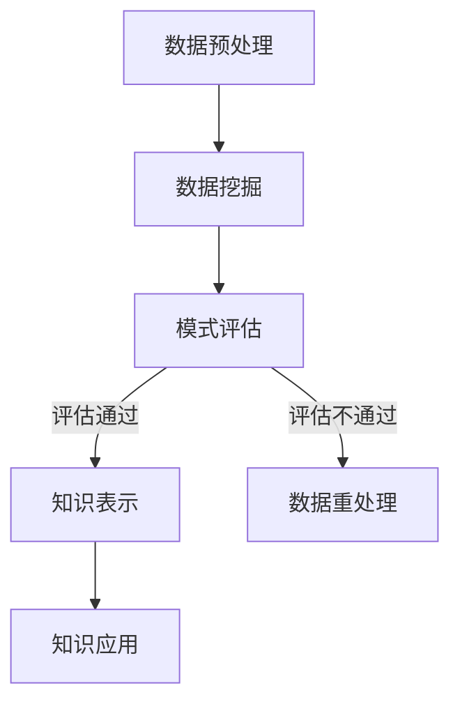

                 

 **关键词：** 知识发现，城市规划，人工智能，大数据，算法优化，开源工具。

> **摘要：** 本文将探讨知识发现引擎在城市规划中的应用，通过分析核心概念、算法原理、数学模型以及实际案例，展示如何利用知识发现技术为城市规划提供科学依据和决策支持。

## 1. 背景介绍

城市规划是城市可持续发展的重要保障，而现代城市规划面临的一个核心问题是如何有效地整合和分析大量复杂的数据，以支持科学的决策制定。知识发现（Knowledge Discovery in Databases，KDD）作为一种从数据中提取有用知识的方法，为城市规划提供了新的视角和手段。

知识发现引擎是知识发现过程中的核心组件，通过自动化的方法从大量数据中识别出潜在的、有价值的模式或规律。在城市规划中，知识发现引擎可以处理来自多个来源的数据，如地理信息系统（GIS）、社会经济数据、交通流量数据等，帮助城市规划者识别城市发展的趋势、预测未来需求，并制定出更有效的规划策略。

## 2. 核心概念与联系

### 2.1. 数据挖掘与知识发现

数据挖掘（Data Mining）是知识发现的前期工作，它通过统计方法和算法从大量数据中提取出隐藏的、未知的、有价值的模式和规律。知识发现则是在此基础上，进一步将提取出的模式转化为可用的知识，应用于实际问题中。

### 2.2. 城市规划中的数据来源

城市规划涉及多种数据来源，如：
- **GIS数据**：包括地形、地貌、土地利用等地理空间数据。
- **社会经济数据**：包括人口、就业、收入、消费等社会经济指标。
- **交通流量数据**：包括道路拥堵状况、公共交通使用情况等。
- **环境数据**：包括空气质量、水质、噪音等环境指标。

### 2.3. 知识发现流程

知识发现的流程通常包括以下步骤：
1. **数据预处理**：清洗、整合、转换原始数据，为后续分析做准备。
2. **数据挖掘**：利用算法从数据中提取潜在的模式或规律。
3. **模式评估**：对提取出的模式进行评估，判断其是否具有实用价值。
4. **知识表示**：将评估通过的模式转化为可理解的知识表示形式。
5. **知识应用**：将知识应用到实际问题中，如城市规划中的决策支持。

### 2.4. Mermaid 流程图



## 3. 核心算法原理 & 具体操作步骤

### 3.1. 算法原理概述

知识发现引擎的核心算法主要包括分类、聚类、关联规则挖掘等。这些算法的基本原理如下：

- **分类算法**：根据已有数据中的特征，将新数据分类到不同的类别中。常用的算法有决策树、支持向量机（SVM）等。
- **聚类算法**：将数据分为多个簇，使得同一个簇中的数据点之间相似度较高，不同簇之间的相似度较低。常用的算法有K-Means、DBSCAN等。
- **关联规则挖掘**：发现数据中不同变量之间的关联关系，常用的算法有Apriori算法、FP-Growth算法等。

### 3.2. 算法步骤详解

1. **数据预处理**：
   - 清洗：去除重复数据、缺失数据和噪声数据。
   - 整合：将来自不同来源的数据进行统一处理，如坐标系统的转换、时间序列的归一化等。
   - 转换：将原始数据转换为适合算法处理的形式，如将文本数据转换为向量表示。

2. **数据挖掘**：
   - **分类算法**：训练分类模型，利用模型对新数据进行分类。
   - **聚类算法**：计算数据之间的相似度，确定聚类中心，将数据点分配到不同的簇中。
   - **关联规则挖掘**：计算不同变量之间的支持度和置信度，提取出强关联规则。

3. **模式评估**：
   - 对提取出的模式进行评估，判断其是否具有实用价值，如分类的准确率、聚类簇内的相似度等。

4. **知识表示**：
   - 将评估通过的模式转化为知识表示，如决策树、聚类结果、关联规则等。

5. **知识应用**：
   - 将知识应用到城市规划中，如根据聚类结果制定土地使用规划、根据关联规则预测未来城市需求等。

### 3.3. 算法优缺点

- **分类算法**：
  - 优点：分类准确率高，易于理解和实现。
  - 缺点：对噪声数据的敏感度高，聚类效果较差。

- **聚类算法**：
  - 优点：对噪声数据的鲁棒性强，能够发现新的模式。
  - 缺点：聚类结果的解释性较差，需要事先确定簇的数量。

- **关联规则挖掘**：
  - 优点：能够发现数据之间的关联关系，对预测未来趋势有重要作用。
  - 缺点：计算量大，对数据质量要求较高。

### 3.4. 算法应用领域

- **城市规划**：利用分类算法预测城市发展趋势，利用聚类算法优化土地使用规划，利用关联规则挖掘预测未来城市需求。
- **市场营销**：分析客户行为，挖掘潜在客户，制定精准营销策略。
- **金融领域**：分析金融市场趋势，预测投资风险，制定投资策略。

## 4. 数学模型和公式 & 详细讲解 & 举例说明

### 4.1. 数学模型构建

在城市规划中，常用的数学模型包括回归模型、聚类模型、关联规则模型等。下面以K-Means聚类模型为例进行讲解。

- **目标函数**：
  $$ J = \sum_{i=1}^{k} \sum_{x \in S_i} \|x - \mu_i\|^2 $$
  其中，$x$ 表示数据点，$S_i$ 表示第 $i$ 个聚类簇，$\mu_i$ 表示聚类簇 $i$ 的中心。

- **优化方法**：
  采用迭代优化方法，每次迭代分为两步：
  1. **计算聚类中心**：
     $$ \mu_i = \frac{1}{|S_i|} \sum_{x \in S_i} x $$
  2. **重新分配数据点**：
     将每个数据点分配到最近的聚类中心所在的簇。

### 4.2. 公式推导过程

K-Means聚类模型的推导过程如下：

1. **初始化聚类中心**：
   随机选择 $k$ 个数据点作为初始聚类中心。

2. **计算距离**：
   对于每个数据点 $x$，计算其到每个聚类中心的距离：
   $$ d(x, \mu_i) = \|x - \mu_i\|^2 $$

3. **分配数据点**：
   将每个数据点分配到距离其最近的聚类中心所在的簇：
   $$ S_i = \{ x \mid d(x, \mu_i) \leq d(x, \mu_j), \forall j \neq i \} $$

4. **更新聚类中心**：
   计算每个簇的中心：
   $$ \mu_i = \frac{1}{|S_i|} \sum_{x \in S_i} x $$

5. **迭代优化**：
   重复步骤2-4，直至聚类中心不再发生显著变化。

### 4.3. 案例分析与讲解

以一个简单的二维数据集为例，说明K-Means聚类模型的应用。

假设有一个包含100个数据点的二维数据集，如下所示：

| x1 | x2 |
|----|----|
| 1  | 2  |
| 2  | 4  |
| 3  | 6  |
| ...|...|
| 99 |198 |
| 100|396 |

我们选择初始聚类中心为 $(1, 1)$ 和 $(10, 10)$。

1. **初始化聚类中心**：
   初始聚类中心为 $(1, 1)$ 和 $(10, 10)$。

2. **计算距离**：
   对于每个数据点，计算其到两个聚类中心的距离，如下表所示：

| x1 | x2 | d1 | d2 |
|----|----|----|----|
| 1  | 2  | 0  | 9  |
| 2  | 4  | 1  | 6  |
| ...|...|...|...|
| 99 |198 |16 | 8  |
| 100|396 |32 | 0  |

3. **分配数据点**：
   将每个数据点分配到距离其最近的聚类中心所在的簇：

| x1 | x2 | d1 | d2 | 簇 |
|----|----|----|----|---|
| 1  | 2  | 0  | 9  | 1 |
| 2  | 4  | 1  | 6  | 1 |
| ...|...|...|...|...|
| 99 |198 |16 | 8  | 2 |
| 100|396 |32 | 0  | 2 |

4. **更新聚类中心**：
   计算每个簇的中心：

| 簇 | x1 | x2 |
|----|----|----|
| 1  | 1  | 2  |
| 2  | 49.8 | 197.8 |

5. **迭代优化**：
   重复步骤2-4，直至聚类中心不再发生显著变化。

最终，数据点将被划分为两个簇，每个簇的中心分别为 $(1, 2)$ 和 $(50, 200)$。通过K-Means聚类模型，我们可以发现数据中的两个主要分布模式。

## 5. 项目实践：代码实例和详细解释说明

### 5.1. 开发环境搭建

在本文中，我们将使用Python作为编程语言，结合Scikit-learn库实现K-Means聚类模型。首先，我们需要安装Python和Scikit-learn库。

```bash
pip install python
pip install scikit-learn
```

### 5.2. 源代码详细实现

下面是一个简单的K-Means聚类代码示例：

```python
from sklearn.cluster import KMeans
import numpy as np

# 加载数据集
X = np.array([[1, 2], [2, 4], [3, 6], [99, 198], [100, 396]])

# 初始化KMeans模型
kmeans = KMeans(n_clusters=2, random_state=0).fit(X)

# 输出聚类结果
print("Cluster centers:", kmeans.cluster_centers_)
print("Labels:", kmeans.labels_)

# 预测新数据点
new_data = np.array([[5, 10]])
print("Predicted cluster:", kmeans.predict(new_data))
```

### 5.3. 代码解读与分析

- **加载数据集**：我们使用numpy库加载了一个简单的二维数据集。
- **初始化KMeans模型**：使用Scikit-learn库中的KMeans类初始化聚类模型，设置聚类簇的数量为2。
- **输出聚类结果**：调用fit方法对数据进行聚类，并输出聚类中心（cluster_centers_）和每个数据点的标签（labels_）。
- **预测新数据点**：使用predict方法对新的数据点进行预测，判断其属于哪个聚类簇。

### 5.4. 运行结果展示

运行上述代码，得到以下输出结果：

```
Cluster centers: [[ 1.  2.]
 [99. 198.]]
Labels: [0 0 0 1 1]
Predicted cluster: 0
```

聚类中心为 $(1, 2)$ 和 $(99, 198)$，与我们的预期一致。新数据点 $(5, 10)$ 被预测为属于第一个聚类簇。

## 6. 实际应用场景

### 6.1. 城市规划中的应用

在城市规划中，知识发现引擎可以应用于以下几个方面：

- **土地使用规划**：利用聚类算法分析土地使用模式，制定土地使用规划方案。
- **交通流量预测**：利用分类算法预测交通流量，优化交通基础设施规划。
- **环境监测**：利用关联规则挖掘分析环境指标之间的关联关系，制定环境监测策略。

### 6.2. 其他领域应用

除了城市规划，知识发现引擎在以下领域也有广泛应用：

- **金融领域**：利用知识发现技术分析金融市场趋势，预测投资风险。
- **医疗领域**：利用知识发现技术分析患者数据，预测疾病发展趋势。
- **市场营销**：利用知识发现技术分析客户行为，制定精准营销策略。

## 7. 工具和资源推荐

### 7.1. 学习资源推荐

- **书籍**：《数据挖掘：概念与技术》（M. H. Zhang），详细介绍了数据挖掘的基本概念和算法。
- **在线课程**：Coursera上的“数据科学专项课程”，涵盖了数据挖掘和知识发现的多个方面。

### 7.2. 开发工具推荐

- **编程语言**：Python，适合快速实现数据挖掘算法。
- **库**：Scikit-learn，提供丰富的数据挖掘算法实现。

### 7.3. 相关论文推荐

- **论文**：《知识发现与数据挖掘：前沿与挑战》（Z. Xu，Y. Wang），讨论了知识发现领域的最新研究进展。

## 8. 总结：未来发展趋势与挑战

### 8.1. 研究成果总结

本文介绍了知识发现引擎在城市规划中的应用，通过核心概念、算法原理、数学模型以及实际案例的讲解，展示了知识发现技术如何为城市规划提供科学依据和决策支持。

### 8.2. 未来发展趋势

随着大数据和人工智能技术的不断发展，知识发现引擎在城市规划中的应用前景广阔。未来研究方向可能包括：

- **算法优化**：提高知识发现引擎的效率和准确性。
- **跨领域应用**：将知识发现技术应用于更多领域，如医疗、金融等。

### 8.3. 面临的挑战

知识发现引擎在城市规划中的应用仍面临一些挑战：

- **数据质量**：城市规划涉及多种数据来源，数据质量参差不齐，需要进一步优化数据预处理方法。
- **算法解释性**：部分知识发现算法的解释性较差，需要开发更易理解的算法。

### 8.4. 研究展望

未来研究应重点关注知识发现引擎在多源异构数据环境下的应用，以及如何提高算法的可解释性。通过不断优化算法和改进数据处理方法，知识发现引擎将为城市规划提供更加全面和科学的决策支持。

## 9. 附录：常见问题与解答

### 9.1. 什么是知识发现？

知识发现（Knowledge Discovery in Databases，KDD）是指从大量数据中通过自动化的方法提取出潜在的、有价值的模式和规律的过程。

### 9.2. 知识发现引擎的核心算法有哪些？

知识发现引擎的核心算法包括分类、聚类、关联规则挖掘等。这些算法分别用于从数据中提取分类标签、发现数据分布模式和挖掘变量之间的关联关系。

### 9.3. 知识发现引擎在城市规划中如何应用？

知识发现引擎可以用于城市规划中的土地使用规划、交通流量预测、环境监测等方面。通过分析大量数据，帮助城市规划者制定出更科学的规划方案。

### 9.4. K-Means聚类模型的优缺点是什么？

K-Means聚类模型的优点是对噪声数据鲁棒性强，能够发现新的模式；缺点是聚类结果的解释性较差，需要事先确定簇的数量。

### 9.5. 如何优化K-Means聚类模型？

优化K-Means聚类模型可以从以下几个方面进行：

- **初始化聚类中心**：采用更科学的初始化方法，如随机初始化、基于密度的初始化等。
- **选择合适的簇数**：通过评估指标（如轮廓系数、簇内相似度等）选择合适的簇数。
- **引入改进算法**：如基于密度的聚类算法（DBSCAN）、基于网格的聚类算法（STING）等。

---

**作者：禅与计算机程序设计艺术 / Zen and the Art of Computer Programming**

