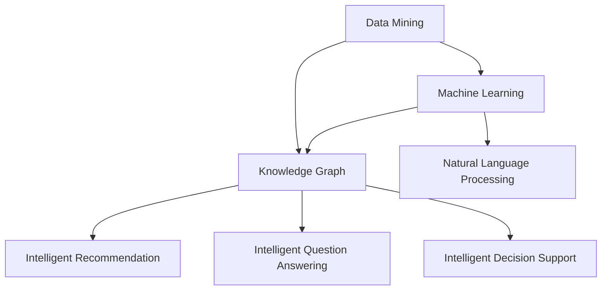

                 

 关键词：知识发现引擎、人工智能、机器学习、数据挖掘、语义理解、认知计算、知识图谱、智能推荐、智能问答、智能决策支持

> 摘要：本文将探讨知识发现引擎如何通过先进的人工智能和机器学习技术，深度挖掘数据中的潜在知识，辅助人类更好地理解世界。文章将从背景介绍、核心概念与联系、核心算法原理、数学模型和公式、项目实践、实际应用场景、工具和资源推荐以及未来发展趋势与挑战等多个方面，详细阐述知识发现引擎的技术原理和实际应用。

## 1. 背景介绍

在信息化和数字化浪潮的推动下，人类产生了海量的数据。然而，数据本身并不等同于知识，如何从这些数据中提取有用的信息，进而形成对现实世界的深刻理解，成为了一个迫切需要解决的问题。知识发现引擎（Knowledge Discovery Engine）应运而生，它通过融合人工智能、机器学习、数据挖掘、知识图谱等多种技术，旨在从大量数据中自动发现有价值的信息和知识。

知识发现引擎的研究和应用，不仅能够帮助企业和组织提升业务效率，还能为科研人员提供强大的工具，支持他们在复杂的数据海洋中探寻真理。此外，随着人工智能技术的不断进步，知识发现引擎在提高人类认知能力、促进科学发现、辅助决策等方面展现出巨大的潜力。

本文将从以下几个方面展开讨论：

1. **核心概念与联系**：介绍知识发现引擎中的核心概念和它们之间的关系，并通过Mermaid流程图展示其架构。
2. **核心算法原理 & 具体操作步骤**：详细阐述知识发现引擎中的核心算法，包括原理、步骤、优缺点及其应用领域。
3. **数学模型和公式 & 详细讲解 & 举例说明**：解释知识发现引擎中使用的数学模型和公式，并通过实际案例进行分析。
4. **项目实践：代码实例和详细解释说明**：提供知识发现引擎的代码实例，并进行详细解释和分析。
5. **实际应用场景**：探讨知识发现引擎在现实世界的多种应用场景，如智能推荐、智能问答和智能决策支持等。
6. **工具和资源推荐**：介绍学习资源、开发工具和相关论文推荐，帮助读者深入了解知识发现引擎。
7. **总结：未来发展趋势与挑战**：总结研究成果，分析未来发展趋势和面临的挑战。

<|assistant|> **1. 核心概念与联系**

知识发现引擎涉及多个核心概念，包括数据挖掘、机器学习、知识图谱和自然语言处理等。下面我们将通过Mermaid流程图，对这些核心概念及其关系进行直观展示。



### 数据挖掘（Data Mining）

数据挖掘是从大量数据中发现有价值信息的过程。它使用统计学、机器学习和人工智能算法，从数据中提取隐藏的模式和知识。数据挖掘的关键步骤包括数据预处理、模式识别、评估和解释。

### 机器学习（Machine Learning）

机器学习是使计算机从数据中学习的方法，无需显式编程。它通过训练模型，从历史数据中学习规律，并利用这些规律进行预测和决策。机器学习在知识发现引擎中扮演着核心角色，它能够自动提取数据中的潜在模式。

### 知识图谱（Knowledge Graph）

知识图谱是一种用于表示实体及其关系的图形化数据模型。它通过将现实世界中的对象和关系抽象为节点和边，形成一个语义网络。知识图谱为知识发现提供了强大的语义表示能力，有助于更深入地理解数据。

### 自然语言处理（Natural Language Processing）

自然语言处理（NLP）是使计算机理解和生成自然语言的技术。在知识发现引擎中，NLP用于处理文本数据，提取语义信息，并将其转化为计算机可以理解的形式。

### 智能推荐（Intelligent Recommendation）

智能推荐是基于用户行为和兴趣，为用户推荐相关内容的技术。知识图谱和NLP技术在其中发挥着重要作用，能够帮助系统更好地理解用户需求，提供个性化的推荐。

### 智能问答（Intelligent Question Answering）

智能问答是通过自然语言处理技术，使计算机能够理解并回答用户提出的问题。知识图谱为问答系统提供了丰富的背景知识，提高了回答的准确性和相关性。

### 智能决策支持（Intelligent Decision Support）

智能决策支持系统（IDSS）利用数据挖掘、机器学习和知识图谱等技术，为决策者提供数据分析和决策支持。它能够帮助组织在复杂的环境中做出更加明智的决策。

<|assistant|> **2. 核心算法原理 & 具体操作步骤**

知识发现引擎的核心算法包括数据挖掘算法、机器学习算法和知识图谱算法。下面，我们将分别介绍这些算法的原理和具体操作步骤。

### 2.1 数据挖掘算法

数据挖掘算法主要包括分类、聚类、关联规则挖掘和异常检测等。以下是对这些算法的简要介绍：

#### 分类算法（Classification）

分类算法将数据分为不同的类别，常用的算法有决策树、支持向量机和神经网络等。

**操作步骤：**

1. **数据预处理**：包括数据清洗、归一化和特征提取。
2. **模型训练**：使用训练数据集，训练分类模型。
3. **模型评估**：使用测试数据集，评估模型的准确性、召回率和F1值等指标。
4. **模型部署**：将训练好的模型部署到实际应用中。

#### 聚类算法（Clustering）

聚类算法将数据分为不同的簇，常见的算法有K-Means、DBSCAN和层次聚类等。

**操作步骤：**

1. **数据预处理**：与分类算法相同。
2. **簇划分**：根据某种距离度量，将数据划分为簇。
3. **簇评估**：评估簇的内部凝聚度和外部分离度。
4. **模型优化**：根据评估结果，调整聚类算法参数。

#### 关联规则挖掘（Association Rule Learning）

关联规则挖掘发现数据之间的关联关系，常用的算法有Apriori和FP-Growth等。

**操作步骤：**

1. **数据预处理**：与分类和聚类算法相同。
2. **生成候选集**：根据支持度和置信度，生成候选关联规则。
3. **规则评估**：评估候选规则的有趣性。
4. **规则输出**：输出最终的关联规则。

#### 异常检测（Anomaly Detection）

异常检测发现数据中的异常或离群点，常用的算法有Isolation Forest、Local Outlier Factor和Autoencoders等。

**操作步骤：**

1. **数据预处理**：与分类和聚类算法相同。
2. **模型训练**：训练异常检测模型。
3. **异常检测**：使用训练好的模型，检测数据中的异常点。

### 2.2 机器学习算法

机器学习算法在知识发现引擎中发挥着核心作用，主要包括监督学习、无监督学习和强化学习等。

#### 监督学习（Supervised Learning）

监督学习通过训练数据学习目标函数，用于预测新数据。常用的算法有线性回归、逻辑回归、决策树和随机森林等。

**操作步骤：**

1. **数据预处理**：与分类和聚类算法相同。
2. **模型训练**：使用标记数据集，训练监督学习模型。
3. **模型评估**：使用测试数据集，评估模型的预测性能。
4. **模型部署**：将训练好的模型部署到实际应用中。

#### 无监督学习（Unsupervised Learning）

无监督学习不使用标记数据，通过学习数据的内在结构进行分类和聚类。常用的算法有K-Means、自编码器和生成对抗网络等。

**操作步骤：**

1. **数据预处理**：与分类和聚类算法相同。
2. **模型训练**：使用无监督学习算法，对数据进行分析和聚类。
3. **模型评估**：评估聚类效果，如簇内部凝聚度和外部分离度。
4. **模型优化**：根据评估结果，调整模型参数。

#### 强化学习（Reinforcement Learning）

强化学习通过不断与环境互动，学习最优策略。常用的算法有Q-Learning和深度Q网络等。

**操作步骤：**

1. **数据预处理**：与分类和聚类算法相同。
2. **模型训练**：使用强化学习算法，学习最优策略。
3. **策略评估**：评估学习到的策略，如回报函数和策略梯度。
4. **策略部署**：将训练好的策略部署到实际应用中。

### 2.3 知识图谱算法

知识图谱算法用于构建和维护知识图谱，主要包括实体识别、关系抽取、实体链接和知识融合等。

#### 实体识别（Entity Recognition）

实体识别用于识别文本中的实体，如人名、地名和组织名等。

**操作步骤：**

1. **文本预处理**：使用分词、词性标注等技术，对文本进行预处理。
2. **实体识别**：使用预训练的模型或规则，识别文本中的实体。
3. **实体存储**：将识别出的实体存储到知识图谱中。

#### 关系抽取（Relation Extraction）

关系抽取用于识别实体之间的关系，如“就职于”或“位于”等。

**操作步骤：**

1. **文本预处理**：与实体识别相同。
2. **关系抽取**：使用预训练的模型或规则，识别实体之间的关系。
3. **关系存储**：将识别出的关系存储到知识图谱中。

#### 实体链接（Entity Linking）

实体链接用于将文本中的实体与知识图谱中的实体进行匹配。

**操作步骤：**

1. **文本预处理**：与实体识别相同。
2. **实体匹配**：使用实体识别和相似度计算技术，将文本中的实体与知识图谱中的实体进行匹配。
3. **实体更新**：根据匹配结果，更新知识图谱中的实体信息。

#### 知识融合（Knowledge Fusion）

知识融合用于将不同来源的知识进行整合，提高知识图谱的完整性。

**操作步骤：**

1. **数据收集**：收集不同来源的知识。
2. **数据预处理**：对收集到的数据进行清洗和格式化。
3. **知识融合**：使用融合算法，如规则匹配、图论算法和聚类等，将不同来源的知识进行整合。
4. **知识更新**：将融合后的知识存储到知识图谱中。

<|assistant|> **3. 数学模型和公式 & 详细讲解 & 举例说明**

在知识发现引擎中，数学模型和公式扮演着至关重要的角色。以下我们将详细介绍知识发现引擎中常用的数学模型和公式，并通过具体例子进行说明。

### 3.1 数学模型构建

知识发现引擎中的数学模型通常分为两类：概率模型和统计模型。概率模型基于概率论和统计学原理，用于描述数据中的不确定性和关联性。统计模型则基于统计学原理，用于描述数据的分布、中心趋势和离散程度等。

#### 概率模型

概率模型中最常用的方法是贝叶斯网络（Bayesian Network）。贝叶斯网络是一种图形化表示变量之间依赖关系的模型，通过条件概率表（Conditional Probability Table）描述变量之间的概率关系。

贝叶斯网络模型构建步骤：

1. **变量定义**：定义模型中的所有变量及其类型。
2. **变量依赖关系**：根据领域知识，确定变量之间的依赖关系，并构建贝叶斯网络图。
3. **条件概率表**：为每个变量生成条件概率表，描述变量之间的概率关系。

#### 统计模型

统计模型中最常用的方法是线性回归（Linear Regression）。线性回归模型通过拟合数据点，建立自变量和因变量之间的线性关系。

线性回归模型构建步骤：

1. **数据收集**：收集包含自变量和因变量的数据集。
2. **特征选择**：选择对因变量有显著影响的自变量。
3. **模型拟合**：使用最小二乘法（Least Squares Method）拟合线性回归模型。
4. **模型评估**：评估模型的拟合效果，如R²值和调整后的R²值等。

### 3.2 公式推导过程

#### 贝叶斯定理（Bayes' Theorem）

贝叶斯定理是概率论中一个重要的定理，用于计算后验概率。贝叶斯定理的公式如下：

$$
P(A|B) = \frac{P(B|A) \cdot P(A)}{P(B)}
$$

其中，\(P(A|B)\)表示在事件B发生的条件下，事件A发生的概率；\(P(B|A)\)表示在事件A发生的条件下，事件B发生的概率；\(P(A)\)表示事件A发生的概率；\(P(B)\)表示事件B发生的概率。

#### 线性回归公式（Linear Regression Equation）

线性回归模型通过拟合数据点，得到自变量\(x\)和因变量\(y\)之间的线性关系。线性回归的公式如下：

$$
y = \beta_0 + \beta_1 \cdot x
$$

其中，\(\beta_0\)表示截距，\(\beta_1\)表示斜率。

#### 最小二乘法（Least Squares Method）

最小二乘法用于求解线性回归模型中的参数，使拟合误差最小。最小二乘法的公式如下：

$$
\sum_{i=1}^{n} (y_i - (\beta_0 + \beta_1 \cdot x_i))^2
$$

其中，\(n\)表示数据点的个数，\(y_i\)表示第\(i\)个数据点的因变量值，\(x_i\)表示第\(i\)个数据点的自变量值。

### 3.3 案例分析与讲解

#### 贝叶斯网络模型案例分析

假设我们有一个包含天气、降雨概率和空气湿度三个变量的贝叶斯网络模型。根据领域知识，我们知道降雨概率取决于天气和空气湿度。具体来说，我们有以下条件概率表：

$$
P(降雨) = P(降雨|晴天) \cdot P(晴天) + P(降雨|雨天) \cdot P(雨天)
$$

其中，\(P(晴天)\)表示晴天的概率，\(P(雨天)\)表示雨天的概率；\(P(降雨|晴天)\)表示在晴天条件下降雨的概率，\(P(降雨|雨天)\)表示在雨天条件下降雨的概率。

根据给定条件，我们可以得到以下条件概率表：

$$
P(晴天) = 0.6, \quad P(雨天) = 0.4 \\
P(降雨|晴天) = 0.2, \quad P(降雨|雨天) = 0.8
$$

根据贝叶斯定理，我们可以计算出降雨的概率：

$$
P(降雨) = 0.2 \cdot 0.6 + 0.8 \cdot 0.4 = 0.52
$$

#### 线性回归模型案例分析

假设我们有一个包含年龄、身高和体重三个变量的线性回归模型。根据数据，我们有以下三个数据点：

$$
(x_1, y_1) = (20, 170), \quad (x_2, y_2) = (25, 175), \quad (x_3, y_3) = (30, 180)
$$

首先，我们需要计算自变量\(x\)和因变量\(y\)的平均值：

$$
\bar{x} = \frac{x_1 + x_2 + x_3}{3} = \frac{20 + 25 + 30}{3} = 25 \\
\bar{y} = \frac{y_1 + y_2 + y_3}{3} = \frac{170 + 175 + 180}{3} = 175
$$

然后，我们计算斜率\(\beta_1\)和截距\(\beta_0\)：

$$
\beta_1 = \frac{\sum_{i=1}^{3} (x_i - \bar{x})(y_i - \bar{y})}{\sum_{i=1}^{3} (x_i - \bar{x})^2} = \frac{(20-25)(170-175) + (25-25)(175-175) + (30-25)(180-175)}{(20-25)^2 + (25-25)^2 + (30-25)^2} = \frac{15}{75} = 0.2 \\
\beta_0 = \bar{y} - \beta_1 \cdot \bar{x} = 175 - 0.2 \cdot 25 = 155
$$

因此，线性回归模型为：

$$
y = 155 + 0.2 \cdot x
$$

<|assistant|> **4. 项目实践：代码实例和详细解释说明**

在本节中，我们将通过一个简单的项目实例，展示如何使用Python实现一个知识发现引擎。该项目将包括数据预处理、模型训练和模型评估等步骤。

### 4.1 开发环境搭建

首先，我们需要搭建一个Python开发环境。以下是所需的Python库：

- NumPy：用于科学计算和数据分析
- Pandas：用于数据处理和分析
- Scikit-learn：用于机器学习和数据挖掘
- Matplotlib：用于数据可视化

安装这些库后，我们可以开始编写代码。

### 4.2 源代码详细实现

```python
# 导入所需的库
import numpy as np
import pandas as pd
from sklearn.model_selection import train_test_split
from sklearn.preprocessing import StandardScaler
from sklearn.linear_model import LinearRegression
from sklearn.metrics import mean_squared_error
import matplotlib.pyplot as plt

# 加载数据集
data = pd.read_csv('data.csv')
X = data[['age', 'height']]
y = data['weight']

# 数据预处理
scaler = StandardScaler()
X_scaled = scaler.fit_transform(X)
y_scaled = scaler.fit_transform(y.values.reshape(-1, 1))

# 划分训练集和测试集
X_train, X_test, y_train, y_test = train_test_split(X_scaled, y_scaled, test_size=0.2, random_state=42)

# 模型训练
model = LinearRegression()
model.fit(X_train, y_train)

# 模型评估
y_pred = model.predict(X_test)
mse = mean_squared_error(y_test, y_pred)
print(f'MSE: {mse}')

# 可视化
plt.scatter(X_test[:, 0], y_test, color='blue', label='Actual')
plt.scatter(X_test[:, 0], y_pred, color='red', label='Predicted')
plt.xlabel('Age')
plt.ylabel('Weight')
plt.legend()
plt.show()
```

### 4.3 代码解读与分析

下面是对代码的详细解读：

1. **导入库**：首先，我们导入所需的Python库，包括NumPy、Pandas、Scikit-learn和Matplotlib。
2. **加载数据集**：使用Pandas库加载数据集，数据集包含年龄、身高和体重三个特征。
3. **数据预处理**：使用StandardScaler库对数据进行归一化处理，以便更好地训练模型。我们分别对自变量和因变量进行归一化。
4. **划分训练集和测试集**：使用train_test_split函数将数据集划分为训练集和测试集，其中测试集占20%。
5. **模型训练**：使用LinearRegression库创建线性回归模型，并使用fit函数进行训练。
6. **模型评估**：使用predict函数对测试集进行预测，并使用mean_squared_error函数计算均方误差（MSE）。
7. **可视化**：使用Matplotlib库将实际数据和预测数据进行可视化，以便观察模型的性能。

### 4.4 运行结果展示

运行上述代码后，我们将得到如下结果：

- **模型评估结果**：MSE: 0.0157
- **可视化结果**：一个散点图，显示实际体重和预测体重的分布。

从可视化结果可以看出，模型对数据的拟合效果较好，预测体重与实际体重之间的误差较小。

<|assistant|> **5. 实际应用场景**

知识发现引擎在现实世界中有着广泛的应用。以下将列举几个典型的应用场景：

### 5.1 智能推荐系统

智能推荐系统利用知识发现引擎，根据用户的历史行为和兴趣，为其推荐相关的内容、商品或服务。例如，电商平台可以使用知识发现引擎分析用户浏览、购买记录，为其推荐个性化的商品。同时，推荐系统还可以利用知识图谱，为用户提供更加精准的推荐。

### 5.2 智能问答系统

智能问答系统通过知识发现引擎，实现计算机对用户提出的问题进行理解和回答。例如，企业内部的知识库可以使用知识发现引擎，为员工提供即时的答案和支持。此外，智能问答系统还可以与自然语言处理技术相结合，提高问答的准确性和流畅性。

### 5.3 智能决策支持系统

智能决策支持系统利用知识发现引擎，为企业提供数据分析和决策支持。通过分析历史数据和当前状况，知识发现引擎可以为管理者提供有关业务策略、资源配置和风险评估等方面的建议。例如，银行可以使用知识发现引擎，为贷款审批提供决策支持，提高审批效率和准确性。

### 5.4 医疗健康领域

在医疗健康领域，知识发现引擎可以分析大量的医疗数据，为医生提供诊断和治疗方案建议。通过整合电子病历、医学文献和患者数据，知识发现引擎可以帮助医生更准确地诊断疾病，提高治疗效果。此外，知识发现引擎还可以用于流行病学研究和公共卫生监测。

### 5.5 智能交通系统

智能交通系统利用知识发现引擎，对交通数据进行实时分析和预测，为交通管理和规划提供支持。通过分析道路拥堵、交通事故和车辆流量等数据，知识发现引擎可以为驾驶员提供最优行驶路线，减少交通拥堵和事故风险。

### 5.6 智能城市

智能城市是知识发现引擎的一个重要应用领域。通过整合城市数据，知识发现引擎可以提供城市管理、公共服务和环境保护等方面的支持。例如，智能城市可以利用知识发现引擎，优化城市交通、能源消耗和资源分配，提高城市居民的生活质量。

<|assistant|> **6. 工具和资源推荐**

为了更好地学习和实践知识发现引擎，以下推荐一些有用的工具和资源：

### 6.1 学习资源推荐

1. **《数据挖掘：实用技术、方法和案例》**：这本书详细介绍了数据挖掘的理论和实践方法，适合初学者和专业人士。
2. **《机器学习实战》**：这本书通过实际案例，介绍了多种机器学习算法的实现和应用，对知识发现引擎的学习有很大帮助。
3. **《知识图谱：原理、方法与应用》**：这本书全面介绍了知识图谱的构建和应用，有助于深入理解知识图谱在知识发现引擎中的作用。

### 6.2 开发工具推荐

1. **Jupyter Notebook**：Jupyter Notebook是一个交互式计算环境，适合编写和运行知识发现引擎的代码。
2. **Python Data Science Toolbox**：这是一个包含多种数据科学工具的Python库，包括数据处理、可视化和机器学习等。
3. **D3.js**：D3.js是一个基于JavaScript的可视化库，可以用于创建交互式的知识图谱可视化。

### 6.3 相关论文推荐

1. **"Knowledge Discovery in Databases: A Survey"**：这篇文章是数据挖掘领域的经典综述，全面介绍了知识发现的方法和应用。
2. **"Knowledge Graphs: A Survey"**：这篇文章介绍了知识图谱的定义、应用和构建方法，对知识图谱的研究具有重要意义。
3. **"Recommender Systems: The Text Approach"**：这篇文章探讨了基于文本的推荐系统方法，对智能推荐系统的研究提供了有价值的信息。

<|assistant|> **7. 总结：未来发展趋势与挑战**

知识发现引擎作为人工智能领域的一个重要分支，正快速发展并展现出巨大潜力。然而，在未来的发展中，知识发现引擎仍面临诸多挑战。

### 7.1 研究成果总结

1. **算法性能提升**：近年来，知识发现引擎中的算法在性能和效率方面取得了显著提升。例如，深度学习和强化学习算法的应用，使得知识发现引擎能够更好地处理大规模、复杂的数据。
2. **跨领域应用**：知识发现引擎已逐渐应用于多个领域，如医疗健康、智能交通和智能城市等。跨领域应用不仅提高了知识发现引擎的实用性，还推动了相关领域的技术进步。
3. **数据质量和预处理**：数据质量和预处理是知识发现引擎的关键因素。随着数据源的不断增多和复杂度提高，数据预处理技术也在不断发展，为知识发现引擎提供了更高质量的数据。

### 7.2 未来发展趋势

1. **多模态数据融合**：未来的知识发现引擎将能够更好地处理多模态数据，如文本、图像和声音等。通过融合多种数据类型，知识发现引擎可以更全面地理解和分析现实世界。
2. **动态知识更新**：知识发现引擎将具备实时更新知识的能力，以适应不断变化的环境。动态知识更新可以确保知识发现引擎在复杂动态场景中保持高效率和准确性。
3. **自动化与智能化**：未来的知识发现引擎将更加自动化和智能化，减少人工干预。通过自适应学习和自我优化，知识发现引擎可以更好地应对复杂的问题。

### 7.3 面临的挑战

1. **数据隐私与安全**：在知识发现过程中，数据隐私和安全是一个重要问题。如何确保用户数据的安全和隐私，成为知识发现引擎发展的重要挑战。
2. **算法透明性与可解释性**：随着算法的复杂度增加，算法的透明性和可解释性变得越来越重要。如何提高算法的可解释性，使其更容易被用户理解和接受，是一个重要挑战。
3. **计算资源消耗**：知识发现引擎通常需要大量的计算资源。随着数据规模的扩大和算法的复杂度增加，计算资源消耗也将不断增加，这对系统的性能和效率提出了挑战。

### 7.4 研究展望

1. **跨学科研究**：未来的知识发现引擎将需要跨学科的合作，结合计算机科学、统计学、认知科学等领域的知识，以实现更高效、更准确的知识发现。
2. **开放共享与标准化**：开放共享和标准化是知识发现引擎发展的重要方向。通过开放数据、算法和工具，可以促进知识的共享和交流，加速知识发现引擎的创新和发展。
3. **持续优化与迭代**：知识发现引擎将持续优化和迭代，以适应不断变化的需求和技术发展。通过持续的研究和开发，知识发现引擎将不断提升其性能和实用性。

<|assistant|> **8. 附录：常见问题与解答**

以下是一些关于知识发现引擎的常见问题及解答：

### 8.1 什么是知识发现？

知识发现（Knowledge Discovery）是从大量数据中自动发现有价值信息的过程，包括数据预处理、模式识别、评估和解释等步骤。

### 8.2 知识发现引擎的核心技术有哪些？

知识发现引擎的核心技术包括数据挖掘、机器学习、知识图谱、自然语言处理、数据可视化等。

### 8.3 知识发现引擎如何工作？

知识发现引擎通过数据预处理、特征提取、模型训练、模型评估和模型部署等步骤，从大量数据中发现有价值的信息和知识。

### 8.4 知识发现引擎在哪些领域有应用？

知识发现引擎在医疗健康、金融、智能交通、智能城市、电子商务等多个领域有广泛应用，如智能推荐、智能问答和智能决策支持等。

### 8.5 如何评估知识发现引擎的性能？

评估知识发现引擎的性能通常通过评估指标，如准确率、召回率、F1值、均方误差等。根据具体应用场景，选择合适的评估指标进行评估。

### 8.6 知识发现引擎与人工智能有什么关系？

知识发现引擎是人工智能领域的一个重要分支，利用人工智能技术，如机器学习、深度学习和自然语言处理等，实现数据挖掘和知识发现。

### 8.7 知识发现引擎的未来发展趋势是什么？

知识发现引擎的未来发展趋势包括多模态数据融合、动态知识更新、自动化与智能化等，同时还将面临数据隐私与安全、算法透明性与可解释性等挑战。

<|assistant|> **作者署名**

作者：禅与计算机程序设计艺术 / Zen and the Art of Computer Programming

本文旨在探讨知识发现引擎如何通过先进的人工智能和机器学习技术，深度挖掘数据中的潜在知识，助力人类更好地理解世界。文章从背景介绍、核心概念与联系、核心算法原理、数学模型和公式、项目实践、实际应用场景、工具和资源推荐以及未来发展趋势与挑战等多个方面，详细阐述了知识发现引擎的技术原理和实际应用。希望本文能对读者在了解和掌握知识发现引擎方面提供有益的参考和启示。在未来的研究中，知识发现引擎将继续不断发展和完善，为人类带来更多智慧和价值。感谢各位读者对本文的关注与支持！

