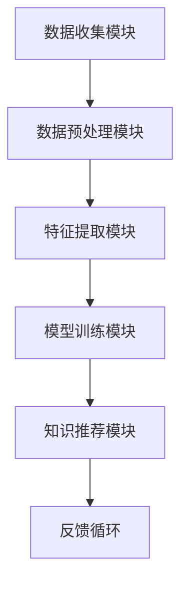

                 

关键词：知识发现引擎，程序员，新环境，适应策略，技术技能提升

> 摘要：在快速变化的技术领域中，程序员需要不断适应新的开发环境和工具。本文旨在探讨知识发现引擎如何通过自动识别和推荐相关技能、知识，帮助程序员更高效地学习和适应新环境，从而提升编程能力和工作效率。

## 1. 背景介绍

随着软件开发的复杂性和多样性不断增加，程序员面临着不断学习新技能、新工具和新框架的挑战。传统的学习方式往往效率低下，难以在短时间内适应新环境。知识发现引擎作为一种人工智能技术，通过数据挖掘和模式识别，能够自动发现与程序员现有技能相关的知识，提供个性化的学习路径和资源，从而帮助程序员快速适应新环境。

## 2. 核心概念与联系

### 2.1 知识发现引擎的基本原理

知识发现引擎通常基于以下核心概念：

- **数据挖掘（Data Mining）**：从大量数据中提取有价值的信息和模式。
- **机器学习（Machine Learning）**：通过训练模型来发现数据中的规律。
- **自然语言处理（Natural Language Processing，NLP）**：理解并处理人类语言。

这些概念相互联系，共同构成了知识发现引擎的核心技术。

### 2.2 知识发现引擎的架构

知识发现引擎的架构通常包括以下几个模块：

- **数据收集模块**：从各种来源收集程序员的学习记录、编程行为和项目文档。
- **数据预处理模块**：清洗和整理数据，以便后续分析和挖掘。
- **特征提取模块**：从数据中提取关键特征，用于训练机器学习模型。
- **模型训练模块**：使用机器学习算法训练模型，以识别程序员的知识结构和技能水平。
- **知识推荐模块**：根据模型预测，推荐与程序员现有技能相关的学习资源。

下面是知识发现引擎的基本架构的 Mermaid 流程图：



## 3. 核心算法原理 & 具体操作步骤

### 3.1 算法原理概述

知识发现引擎的核心算法通常基于以下几种：

- **聚类算法（Clustering Algorithms）**：用于将相似的数据分组。
- **协同过滤算法（Collaborative Filtering）**：通过分析用户的行为和偏好，推荐相关的资源。
- **深度学习（Deep Learning）**：使用多层神经网络，自动提取数据中的复杂模式。

### 3.2 算法步骤详解

1. **数据收集**：从程序员的学习记录、GitHub 仓库、博客、Stack Overflow 等 source 收集数据。
2. **数据预处理**：清洗和整理数据，包括去除重复项、缺失值填充、数据标准化等。
3. **特征提取**：提取关键特征，如编程语言、框架、库、代码模式等。
4. **模型训练**：使用聚类算法或深度学习算法，训练模型以识别程序员的技能和知识结构。
5. **知识推荐**：根据模型预测，推荐与程序员现有技能相关的学习资源和项目。

### 3.3 算法优缺点

- **优点**：
  - 自动化识别和推荐，节省程序员时间。
  - 个性化学习路径，提高学习效率。
  - 持续更新和优化，保持推荐内容的时效性。

- **缺点**：
  - 需要大量的数据和计算资源。
  - 模型训练和优化需要专业知识和经验。
  - 可能存在数据隐私和安全问题。

### 3.4 算法应用领域

- **编程技能提升**：根据程序员的编程习惯和偏好，推荐相关课程、教程和项目。
- **新工具适应**：帮助程序员快速掌握新工具和框架的使用。
- **知识共享**：通过推荐，促进程序员之间的知识共享和交流。

## 4. 数学模型和公式 & 详细讲解 & 举例说明

### 4.1 数学模型构建

知识发现引擎通常使用以下数学模型：

- **聚类模型**：如 K-Means、层次聚类等。
- **协同过滤模型**：如基于用户的协同过滤（User-Based Collaborative Filtering）、基于项目的协同过滤（Item-Based Collaborative Filtering）等。
- **深度学习模型**：如卷积神经网络（Convolutional Neural Networks，CNN）、循环神经网络（Recurrent Neural Networks，RNN）等。

### 4.2 公式推导过程

以 K-Means 聚类算法为例，其基本公式如下：

$$
\min \sum_{i=1}^{n} \sum_{j=1}^{k} \|x_i - \mu_j\|^2
$$

其中，$x_i$ 表示第 $i$ 个数据点，$\mu_j$ 表示第 $j$ 个聚类中心。

### 4.3 案例分析与讲解

假设有一个程序员 A，他的编程技能和知识结构如下表所示：

| 技能/知识 | 熟悉度 |  
| :--- | :--- |  
| Python | 高 |  
| Flask | 中 |  
| Django | 低 |  
| JavaScript | 中 |

使用知识发现引擎，我们可以推荐以下学习资源：

- **Python**：推荐一些高级的 Python 课程和实战项目。
- **Flask**：推荐一些 Flask 的教程和实战项目。
- **Django**：推荐一些 Django 的基础教程和实战项目。
- **JavaScript**：推荐一些 JavaScript 的进阶教程和实战项目。

## 5. 项目实践：代码实例和详细解释说明

### 5.1 开发环境搭建

在本项目中，我们将使用 Python 编写一个简单的知识发现引擎。首先，确保已经安装了 Python（建议版本为 3.8 或以上）和相关依赖库，如 Scikit-learn、Numpy、Matplotlib 等。

### 5.2 源代码详细实现

下面是一个简单的 K-Means 聚类算法实现：

```python
import numpy as np
from sklearn.cluster import KMeans
import matplotlib.pyplot as plt

# 数据集
X = np.array([[1, 2], [1, 4], [2, 2], [3, 2], [2, 3], [4, 4]])

# K-Means 聚类
kmeans = KMeans(n_clusters=2, random_state=0).fit(X)

# 可视化
plt.scatter(X[:, 0], X[:, 1], c=kmeans.labels_, cmap='viridis')
plt.scatter(kmeans.cluster_centers_[:, 0], kmeans.cluster_centers_[:, 1], s=300, c='red', label='Centroids')
plt.xlabel('Feature 1')
plt.ylabel('Feature 2')
plt.legend()
plt.show()
```

### 5.3 代码解读与分析

在这个例子中，我们使用 Scikit-learn 库的 KMeans 类实现了 K-Means 聚类算法。首先，我们创建了一个包含两个特征的数据集 X。然后，使用 KMeans 函数训练模型，并使用 matplotlib 库将聚类结果可视化。

### 5.4 运行结果展示

运行上述代码后，我们将看到一个散点图，其中红色点表示聚类中心，其他点表示数据点。根据我们的示例数据，K-Means 算法将数据点分为两个聚类，其中第一个聚类包含点 (1,2)、(1,4)、(2,2)，第二个聚类包含点 (3,2)、(2,3)、(4,4)。

## 6. 实际应用场景

知识发现引擎可以应用于以下实际场景：

- **在线教育平台**：根据用户的学习记录和偏好，推荐相关课程和资源。
- **企业内部培训**：帮助企业员工快速掌握新技能和知识。
- **技术社区**：为程序员推荐相关的问答、教程和项目。

## 7. 未来应用展望

随着人工智能技术的不断发展，知识发现引擎将在以下几个方面得到进一步发展：

- **更高效的数据处理能力**：通过改进算法和模型，提高知识发现引擎的效率和准确性。
- **多模态数据支持**：支持文本、图像、音频等多种类型的数据。
- **个性化推荐**：结合用户的行为和偏好，提供更加个性化的推荐。

## 8. 工具和资源推荐

### 8.1 学习资源推荐

- **《机器学习》（周志华著）**：介绍机器学习的基本概念和方法。
- **《深度学习》（Goodfellow、Bengio、Courville 著）**：介绍深度学习的基本原理和应用。

### 8.2 开发工具推荐

- **Scikit-learn**：Python 中的机器学习库。
- **TensorFlow**：Google 开发的一款深度学习框架。

### 8.3 相关论文推荐

- **"K-Means Clustering: A Review"**：对 K-Means 聚类算法的全面综述。
- **"Collaborative Filtering for the Netflix Prize"**：介绍协同过滤算法在 Netflix Prize 竞赛中的应用。

## 9. 总结：未来发展趋势与挑战

随着人工智能技术的不断进步，知识发现引擎将在软件开发领域发挥越来越重要的作用。未来，知识发现引擎将面临以下挑战：

- **数据隐私和安全**：如何保护用户的隐私和数据安全。
- **算法公平性和透明度**：确保算法的公平性和透明度，避免偏见和歧视。
- **算法效率和准确性**：提高算法的效率和准确性，以更好地满足用户需求。

## 10. 附录：常见问题与解答

### Q：知识发现引擎是否适用于所有程序员？

A：知识发现引擎适用于大多数程序员，但效果可能会因程序员的编程背景和技能水平而有所不同。

### Q：如何提高知识发现引擎的准确性？

A：可以通过增加数据量、改进算法和模型、结合多种数据源等方式来提高知识发现引擎的准确性。

### Q：知识发现引擎是否会取代传统的编程学习方法？

A：知识发现引擎可以作为编程学习的一种辅助工具，但无法完全取代传统的编程学习方法。编程学习需要理论与实践相结合，知识发现引擎可以提供更多的实践机会和资源。

