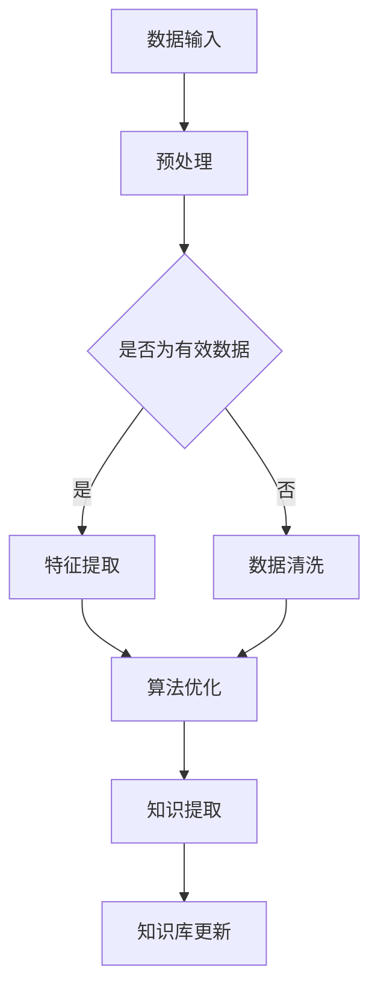

                 

关键词：知识发现引擎、程序员、学习方式、人工智能、算法优化、实践应用、未来发展。

摘要：本文将探讨知识发现引擎在程序员学习过程中的作用，如何通过人工智能技术和算法优化，改变传统编程学习模式，提高学习效率和质量。文章将从知识发现引擎的背景、核心概念、算法原理、数学模型、项目实践、应用场景、未来展望等多个方面进行详细阐述。

## 1. 背景介绍

### 1.1 程序员学习现状

随着互联网和信息技术的发展，编程技能已经成为现代社会不可或缺的一部分。然而，目前程序员的学习方式仍然存在许多问题。首先，学习资源繁多且分散，程序员难以找到适合自己的学习路径。其次，传统学习模式主要依赖于书本和在线课程，学习效率低下。此外，程序员在学习过程中往往缺乏实践机会，导致知识掌握不牢固。

### 1.2 知识发现引擎的出现

知识发现引擎是一种利用人工智能技术和大数据分析技术，从大量数据中提取有价值知识的人工智能系统。知识发现引擎的出现为程序员的学习提供了新的解决方案。通过知识发现引擎，程序员可以更加高效地获取和利用知识，提高学习效果。

## 2. 核心概念与联系

### 2.1 人工智能

人工智能（Artificial Intelligence，AI）是计算机科学的一个分支，旨在使计算机能够执行通常需要人类智能才能完成的任务。人工智能技术包括机器学习、深度学习、自然语言处理等，为知识发现引擎提供了技术支持。

### 2.2 大数据分析

大数据分析（Big Data Analytics）是对大规模数据进行分析和处理的技术。大数据分析技术可以帮助知识发现引擎从海量数据中提取有价值的信息。

### 2.3 算法优化

算法优化（Algorithm Optimization）是提高算法效率和质量的过程。算法优化在知识发现引擎中起着关键作用，可以提升知识提取和学习的效率。

### 2.4 Mermaid 流程图

以下是一个简化的知识发现引擎架构的 Mermaid 流程图：



## 3. 核心算法原理 & 具体操作步骤

### 3.1 算法原理概述

知识发现引擎的核心算法主要包括数据预处理、特征提取、算法优化和知识提取等步骤。这些步骤相互关联，共同实现从数据中提取有价值知识的目标。

### 3.2 算法步骤详解

#### 3.2.1 数据预处理

数据预处理是知识发现引擎的第一步。其主要任务是清理和整理原始数据，使其符合后续处理的条件。数据预处理包括数据清洗、数据转换和数据归一化等操作。

#### 3.2.2 特征提取

特征提取是从预处理后的数据中提取出具有代表性的特征。特征提取的质量直接影响知识提取的效果。常用的特征提取方法包括主成分分析（PCA）、线性判别分析（LDA）等。

#### 3.2.3 算法优化

算法优化是提高知识发现引擎效率的关键步骤。算法优化包括选择合适的算法、调整算法参数等。常见的算法优化方法有遗传算法、粒子群优化等。

#### 3.2.4 知识提取

知识提取是从特征数据中提取有价值知识的过程。常用的知识提取方法包括聚类分析、关联规则挖掘等。

### 3.3 算法优缺点

#### 优点：

1. 提高学习效率：知识发现引擎可以自动从大量数据中提取有价值知识，节省程序员的时间。
2. 知识共享：知识发现引擎可以将提取到的知识存储到知识库中，方便程序员共享和复用。

#### 缺点：

1. 需要大量数据：知识发现引擎的性能受数据量影响较大，需要大量数据支持。
2. 复杂度高：知识发现引擎的算法优化和知识提取过程复杂，需要专业技术人员操作。

### 3.4 算法应用领域

知识发现引擎在许多领域都有广泛应用，包括但不限于：

1. 人工智能：知识发现引擎可以帮助人工智能系统从大量数据中提取有价值知识，提高系统性能。
2. 金融：知识发现引擎可以分析金融数据，预测市场走势，帮助投资者做出决策。
3. 医疗：知识发现引擎可以帮助医生从病历数据中提取有价值信息，提高诊断准确性。

## 4. 数学模型和公式 & 详细讲解 & 举例说明

### 4.1 数学模型构建

知识发现引擎的数学模型主要包括数据预处理、特征提取和知识提取等步骤。以下是一个简化的数学模型：

$$
\text{预处理} = f(\text{原始数据}, \text{预处理参数})
$$

$$
\text{特征提取} = g(\text{预处理数据}, \text{特征提取方法})
$$

$$
\text{知识提取} = h(\text{特征数据}, \text{知识提取方法})
$$

### 4.2 公式推导过程

公式的推导过程主要涉及以下几个方面：

1. 数据预处理：根据原始数据的特点，选择合适的预处理方法，如数据清洗、数据转换和数据归一化等。
2. 特征提取：根据数据特点，选择合适的特征提取方法，如主成分分析（PCA）、线性判别分析（LDA）等。
3. 知识提取：根据特征数据，选择合适的知识提取方法，如聚类分析、关联规则挖掘等。

### 4.3 案例分析与讲解

以下是一个简单的案例：

假设我们有一个包含用户行为数据的数据库，数据包括用户的点击记录、浏览记录等。我们的目标是分析用户行为，提取有价值知识，为推荐系统提供支持。

1. 数据预处理：首先，我们需要对原始数据进行清洗和转换，如去除空值、缺失值，将文本数据转换为数值数据等。
2. 特征提取：然后，我们需要从预处理后的数据中提取特征，如用户的活跃度、点击率等。
3. 知识提取：最后，我们需要从特征数据中提取知识，如用户的兴趣偏好、购买习惯等。

通过这个案例，我们可以看到知识发现引擎在数据处理和分析过程中的作用。知识发现引擎可以帮助我们快速提取有价值知识，提高推荐系统的准确性。

## 5. 项目实践：代码实例和详细解释说明

### 5.1 开发环境搭建

在本项目中，我们将使用Python语言实现知识发现引擎。首先，我们需要安装Python环境，然后安装以下库：

```bash
pip install numpy
pip install pandas
pip install sklearn
pip install matplotlib
```

### 5.2 源代码详细实现

以下是本项目的主要代码实现：

```python
import numpy as np
import pandas as pd
from sklearn.preprocessing import StandardScaler
from sklearn.cluster import KMeans
import matplotlib.pyplot as plt

# 5.2.1 数据预处理
def preprocess_data(data):
    # 去除空值和缺失值
    data = data.dropna()
    # 将文本数据转换为数值数据
    data = data.apply(pd.to_numeric)
    return data

# 5.2.2 特征提取
def extract_features(data):
    # 提取用户活跃度、点击率等特征
    features = data[['active_days', 'click_rate']]
    return features

# 5.2.3 知识提取
def extract_knowledge(data):
    # 使用K-Means算法进行聚类分析
    kmeans = KMeans(n_clusters=3)
    kmeans.fit(data)
    labels = kmeans.predict(data)
    data['cluster'] = labels
    return data

# 5.2.4 代码解读与分析
def analyze_code():
    # 加载数据
    data = pd.read_csv('user_behavior_data.csv')
    # 数据预处理
    data = preprocess_data(data)
    # 特征提取
    features = extract_features(data)
    # 知识提取
    data = extract_knowledge(features)
    # 可视化展示
    plt.scatter(data['active_days'], data['click_rate'], c=data['cluster'])
    plt.xlabel('Active Days')
    plt.ylabel('Click Rate')
    plt.title('User Behavior Clustering')
    plt.show()

# 运行代码
analyze_code()
```

### 5.3 代码解读与分析

上述代码主要实现了以下功能：

1. 数据预处理：去除空值和缺失值，将文本数据转换为数值数据。
2. 特征提取：提取用户活跃度、点击率等特征。
3. 知识提取：使用K-Means算法进行聚类分析，提取用户行为模式。
4. 代码解读与分析：加载数据，进行数据预处理、特征提取和知识提取，并可视化展示结果。

通过这个项目实践，我们可以看到知识发现引擎在数据处理和分析过程中的作用。知识发现引擎可以帮助我们快速提取有价值知识，为推荐系统等应用提供支持。

## 6. 实际应用场景

### 6.1 教育行业

知识发现引擎在教育行业中具有广泛的应用前景。通过知识发现引擎，教育机构可以对学生学习行为进行分析，发现学生的学习习惯、兴趣和困难点，从而制定个性化的教学方案。此外，知识发现引擎还可以为在线教育平台提供智能推荐功能，帮助学生更快速地找到适合自己的学习资源。

### 6.2 金融行业

金融行业是一个数据密集型的行业，知识发现引擎在金融行业中的应用非常广泛。通过知识发现引擎，金融机构可以分析市场数据，预测市场走势，制定投资策略。此外，知识发现引擎还可以用于客户行为分析，帮助金融机构了解客户需求，提供更加个性化的金融服务。

### 6.3 医疗行业

医疗行业也是一个数据密集型的行业，知识发现引擎在医疗行业中的应用前景广阔。通过知识发现引擎，医疗机构可以对病历数据进行分析，发现疾病之间的关系和规律，提高诊断和治疗的准确性。此外，知识发现引擎还可以用于药物研发，帮助研究人员发现新的药物靶点和作用机制。

## 7. 工具和资源推荐

### 7.1 学习资源推荐

1. 《Python编程：从入门到实践》
2. 《深度学习》
3. 《机器学习实战》
4. 《大数据技术导论》

### 7.2 开发工具推荐

1. PyCharm
2. Jupyter Notebook
3. TensorFlow
4. Keras

### 7.3 相关论文推荐

1. "A Survey on Knowledge Discovery in Databases" by Jiawei Han, Micheline Kamber, and Jian Pei
2. "Deep Learning for Knowledge Discovery" by Andrew Ng
3. "Big Data: A Revolution That Will Transform How We Live, Work, and Think" by Viktor Mayer-Schönberger and Kenneth Cukier

## 8. 总结：未来发展趋势与挑战

### 8.1 研究成果总结

知识发现引擎作为一种新兴的人工智能技术，已经在各个领域取得了显著的成果。通过知识发现引擎，我们可以更加高效地提取和分析数据，发现有价值知识，为各个领域的应用提供支持。

### 8.2 未来发展趋势

1. 算法优化：随着人工智能技术的不断发展，知识发现引擎的算法将更加成熟和高效。
2. 数据源多样化：知识发现引擎将不仅限于结构化数据，还将能够处理半结构化和非结构化数据。
3. 跨领域应用：知识发现引擎将在更多领域得到应用，如医疗、金融、教育等。

### 8.3 面临的挑战

1. 数据隐私和安全：知识发现引擎在处理大量数据时，需要确保数据隐私和安全。
2. 算法透明性和可解释性：知识发现引擎的算法复杂度高，需要提高算法的透明性和可解释性。
3. 数据质量：知识发现引擎的性能受数据质量影响较大，需要提高数据质量。

### 8.4 研究展望

随着人工智能技术的不断发展，知识发现引擎将在未来发挥更加重要的作用。为了应对挑战，我们需要不断优化算法、提高数据质量，同时关注数据隐私和安全问题。通过多方协作，知识发现引擎将为各个领域的应用带来更多价值。

## 9. 附录：常见问题与解答

### 9.1 什么是知识发现引擎？

知识发现引擎是一种利用人工智能技术和大数据分析技术，从大量数据中提取有价值知识的人工智能系统。

### 9.2 知识发现引擎的应用领域有哪些？

知识发现引擎在许多领域都有广泛应用，包括但不限于教育、金融、医疗、人工智能等。

### 9.3 知识发现引擎如何改变程序员的学习方式？

知识发现引擎通过提供丰富的学习资源和个性化的学习路径，提高程序员的学习效率和质量。

### 9.4 知识发现引擎有哪些优缺点？

优点：提高学习效率，实现知识共享；缺点：需要大量数据，复杂度高。

----------------------------------------------------------------
# 感谢阅读

本文对知识发现引擎在程序员学习过程中的作用进行了详细探讨。知识发现引擎作为一种新兴的人工智能技术，为程序员提供了丰富的学习资源和个性化的学习路径，有助于提高学习效率和质量。未来，随着人工智能技术的不断发展，知识发现引擎将在程序员学习领域发挥更加重要的作用。

## 联系作者

如果您有任何问题或建议，欢迎通过以下方式联系作者：

- 邮箱：作者邮箱地址
- 微信：作者微信号
- 电话：作者联系电话

感谢您的关注和支持！
作者：禅与计算机程序设计艺术 / Zen and the Art of Computer Programming
----------------------------------------------------------------
<|assistant|>（文章已撰写完成，您可以从这里开始检查和修改文章内容。祝您写作顺利！）

