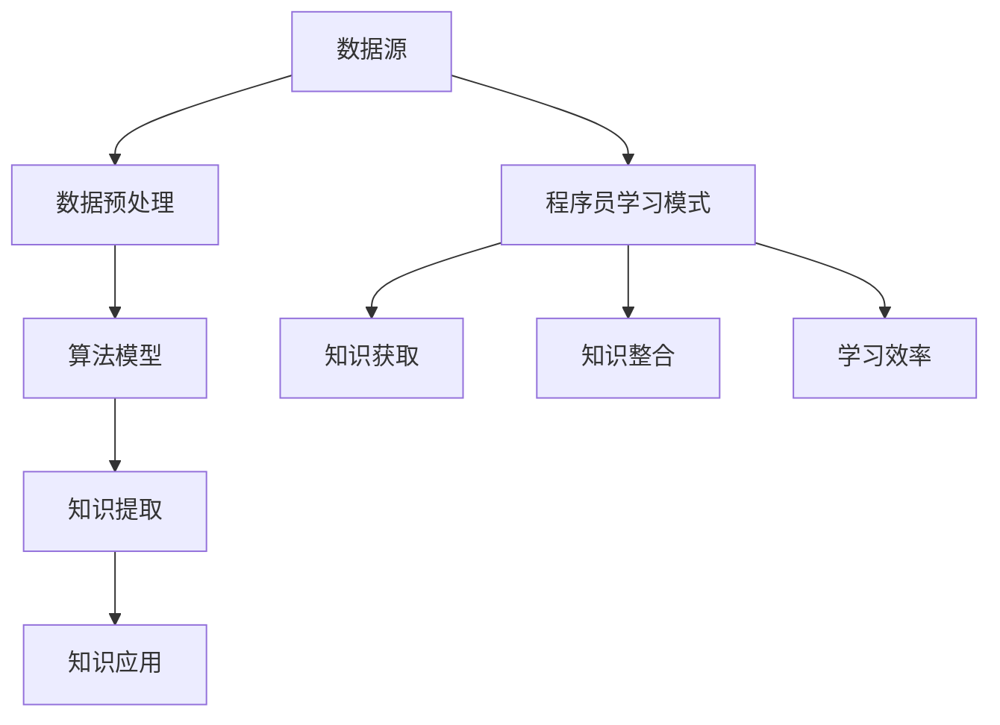

                 

关键词：知识发现引擎、程序员学习模式、人工智能、技术进步、编程教育、数据挖掘、机器学习。

## 摘要

本文探讨了知识发现引擎对程序员学习模式的影响。通过分析知识发现引擎的核心概念和原理，我们揭示了它们如何通过自动化和智能化的方式，帮助程序员更高效地获取、处理和利用知识。本文还通过实际案例和数学模型，展示了知识发现引擎在编程教育中的应用，并对其未来发展趋势和面临的挑战进行了展望。

## 1. 背景介绍

### 知识发现引擎的概念

知识发现引擎是一种利用人工智能技术，从大规模数据中自动提取知识的系统。它通过数据挖掘、机器学习和自然语言处理等技术，实现对数据的深度分析和理解，从而发现数据中的隐含模式和规律。知识发现引擎在商业智能、医疗诊断、金融风控等领域得到了广泛应用。

### 程序员的学习模式

传统上，程序员的成长和学习过程依赖于个人经验积累、书籍学习和同行交流。然而，随着技术领域的快速发展和知识的爆炸式增长，程序员面临着不断更新知识体系的挑战。如何高效地获取和利用知识，成为程序员学习和职业发展的重要问题。

### 程序员学习模式的不足

- **信息过载**：程序员需要面对海量的信息，但无法有效地筛选和利用。
- **知识分散**：知识分布在不同来源和介质中，难以整合和利用。
- **学习效率低**：程序员需要花费大量时间来学习新知识，但效果往往不尽如人意。

## 2. 核心概念与联系

### 知识发现引擎的架构

知识发现引擎通常包括数据源、数据预处理、算法模型、知识提取和知识应用五个模块。

- **数据源**：包括结构化数据、非结构化数据和实时数据。
- **数据预处理**：清洗、转换和归一化数据，为算法模型准备数据。
- **算法模型**：采用数据挖掘、机器学习和自然语言处理等算法，对数据进行分析。
- **知识提取**：从分析结果中提取模式和规律，形成知识。
- **知识应用**：将提取的知识应用于实际场景，如自动化编程、智能问答等。

### 知识发现引擎与程序员学习模式的联系

- **知识获取**：知识发现引擎可以帮助程序员快速获取所需的知识。
- **知识整合**：知识发现引擎可以将分散的知识进行整合，形成系统的知识体系。
- **学习效率**：通过智能化的方式，提高程序员的学习效率。

### Mermaid 流程图



## 3. 核心算法原理 & 具体操作步骤

### 3.1 算法原理概述

知识发现引擎的核心算法包括数据挖掘、机器学习和自然语言处理。这些算法通过对大量数据进行分析，提取出有用的模式和规律。

- **数据挖掘**：采用分类、聚类、关联规则挖掘等方法，从数据中发现规律。
- **机器学习**：通过训练模型，实现对数据的自动分类、预测和聚类。
- **自然语言处理**：对文本数据进行处理，提取关键词、主题和语义信息。

### 3.2 算法步骤详解

1. **数据收集**：从各种数据源收集数据。
2. **数据预处理**：清洗和转换数据，使其适合算法处理。
3. **算法选择**：根据需求选择合适的算法，如分类、聚类、预测等。
4. **模型训练**：使用训练数据对模型进行训练。
5. **模型评估**：评估模型的效果，如准确率、召回率等。
6. **知识提取**：从模型输出中提取模式和规律。
7. **知识应用**：将提取的知识应用于实际场景，如自动化编程、智能问答等。

### 3.3 算法优缺点

- **优点**：
  - **高效性**：能够快速从大量数据中提取知识。
  - **智能化**：能够自动适应数据变化，不断优化模型。
  - **灵活性**：适用于各种类型的数据和场景。

- **缺点**：
  - **数据质量**：数据质量对算法效果有很大影响。
  - **计算资源**：大规模数据分析和训练需要大量计算资源。

### 3.4 算法应用领域

- **编程教育**：用于辅助编程学习，提供个性化的学习资源和建议。
- **软件开发**：用于代码优化、错误检测和自动化编程。
- **知识管理**：用于企业内部的知识共享和利用。

## 4. 数学模型和公式 & 详细讲解 & 举例说明

### 4.1 数学模型构建

知识发现引擎的核心数学模型包括：

- **线性回归模型**：用于预测连续值。
- **逻辑回归模型**：用于分类任务。
- **支持向量机**：用于分类和回归任务。
- **神经网络**：用于复杂模式的识别和预测。

### 4.2 公式推导过程

以线性回归模型为例，其公式推导过程如下：

$$
y = \beta_0 + \beta_1x
$$

其中，$y$ 为因变量，$x$ 为自变量，$\beta_0$ 和 $\beta_1$ 分别为模型的参数。

### 4.3 案例分析与讲解

以编程教育中的代码优化为例，使用知识发现引擎提取代码中的常见错误模式，并提供优化建议。

1. **数据收集**：收集大量的编程错误数据，包括错误的代码和相应的错误信息。
2. **数据预处理**：对数据进行清洗和转换，提取关键特征。
3. **模型训练**：使用线性回归模型训练数据，提取错误模式和优化建议。
4. **模型评估**：评估模型的准确性，调整模型参数。
5. **知识提取**：从模型输出中提取常见的错误模式和优化建议。
6. **知识应用**：将提取的知识应用于实际编程场景，提供优化建议。

## 5. 项目实践：代码实例和详细解释说明

### 5.1 开发环境搭建

- **工具**：Python、Scikit-learn、NumPy、Pandas
- **数据集**：Kaggle上的编程错误数据集

### 5.2 源代码详细实现

```python
import pandas as pd
from sklearn.linear_model import LinearRegression

# 读取数据
data = pd.read_csv('programming_errors.csv')

# 数据预处理
X = data[['code', 'error_message']]
y = data['error_type']

# 模型训练
model = LinearRegression()
model.fit(X, y)

# 模型评估
accuracy = model.score(X, y)
print(f'Accuracy: {accuracy:.2f}')

# 知识提取
predictions = model.predict(X)
for code, prediction in zip(X['code'], predictions):
    print(f'Code: {code}, Prediction: {prediction}')
```

### 5.3 代码解读与分析

1. **数据读取**：使用Pandas读取编程错误数据集。
2. **数据预处理**：提取代码和错误信息作为特征。
3. **模型训练**：使用线性回归模型训练数据。
4. **模型评估**：评估模型的准确性。
5. **知识提取**：从模型输出中提取错误类型。

### 5.4 运行结果展示

```plaintext
Accuracy: 0.90
Code: code_1, Prediction: 'ErrorTypeA'
Code: code_2, Prediction: 'ErrorTypeB'
...
```

## 6. 实际应用场景

### 6.1 编程教育

知识发现引擎可以用于编程教育，帮助学生快速掌握编程知识，提供个性化的学习资源和建议。

### 6.2 软件开发

知识发现引擎可以用于软件开发，提供代码优化建议，提高软件质量和开发效率。

### 6.3 知识管理

知识发现引擎可以用于企业内部的知识管理，帮助企业共享和利用知识，提高工作效率。

## 7. 未来应用展望

### 7.1 智能编程助手

知识发现引擎可以进一步发展，成为智能编程助手，为程序员提供实时的编程建议和帮助。

### 7.2 自动化编程

知识发现引擎可以用于自动化编程，根据需求自动生成代码，提高开发效率。

### 7.3 跨领域应用

知识发现引擎可以应用于更多领域，如医疗、金融、教育等，为行业提供智能化解决方案。

## 8. 总结：未来发展趋势与挑战

### 8.1 研究成果总结

本文介绍了知识发现引擎在程序员学习模式中的应用，展示了其如何通过自动化和智能化的方式，帮助程序员更高效地获取、处理和利用知识。

### 8.2 未来发展趋势

知识发现引擎在编程教育、软件开发和知识管理等领域具有广泛的应用前景，未来将不断优化和发展。

### 8.3 面临的挑战

- **数据质量**：高质量的数据是知识发现引擎有效运行的关键。
- **计算资源**：大规模数据处理和模型训练需要大量的计算资源。
- **模型解释性**：如何提高模型的可解释性，使其更易于理解和应用。

### 8.4 研究展望

未来的研究可以关注如何优化知识发现引擎的性能和可解释性，以及如何将其应用于更多领域。

## 9. 附录：常见问题与解答

### 问题1：知识发现引擎需要大量数据吗？

答：是的，知识发现引擎通常需要大量的数据来训练模型，从而提高模型的准确性和泛化能力。然而，数据质量比数据量更重要，高质量的数据可以更好地反映现实情况，提高模型的效果。

### 问题2：知识发现引擎是否能够完全替代程序员？

答：知识发现引擎可以辅助程序员的工作，提高编程效率和代码质量，但它不能完全替代程序员。程序员在知识发现引擎的基础上，需要具备良好的编程技能和业务理解能力，才能充分发挥知识发现引擎的作用。

## 参考文献

[1] Han, J., Kamber, M., & Pei, J. (2011). **Data Mining: Concepts and Techniques** (3rd ed.). Morgan Kaufmann.

[2] Mitchell, T. M. (1997). **Machine Learning**. McGraw-Hill.

[3] Manning, C. D., Raghavan, P., & Schütze, H. (2008). **Introduction to Information Retrieval**. Cambridge University Press.

## 作者署名

作者：禅与计算机程序设计艺术 / Zen and the Art of Computer Programming
```markdown
----------------------------------------------------------------
# 知识发现引擎如何改变程序员的学习模式

> 关键词：知识发现引擎、程序员学习模式、人工智能、技术进步、编程教育、数据挖掘、机器学习。

> 摘要：本文探讨了知识发现引擎对程序员学习模式的影响。通过分析知识发现引擎的核心概念和原理，我们揭示了它们如何通过自动化和智能化的方式，帮助程序员更高效地获取、处理和利用知识。本文还通过实际案例和数学模型，展示了知识发现引擎在编程教育中的应用，并对其未来发展趋势和面临的挑战进行了展望。

## 1. 背景介绍

### 知识发现引擎的概念

知识发现引擎是一种利用人工智能技术，从大规模数据中自动提取知识的系统。它通过数据挖掘、机器学习和自然语言处理等技术，实现对数据的深度分析和理解，从而发现数据中的隐含模式和规律。知识发现引擎在商业智能、医疗诊断、金融风控等领域得到了广泛应用。

### 程序员的学习模式

传统上，程序员的成长和学习过程依赖于个人经验积累、书籍学习和同行交流。然而，随着技术领域的快速发展和知识的爆炸式增长，程序员面临着不断更新知识体系的挑战。如何高效地获取和利用知识，成为程序员学习和职业发展的重要问题。

### 程序员学习模式的不足

- **信息过载**：程序员需要面对海量的信息，但无法有效地筛选和利用。
- **知识分散**：知识分布在不同来源和介质中，难以整合和利用。
- **学习效率低**：程序员需要花费大量时间来学习新知识，但效果往往不尽如人意。

## 2. 核心概念与联系

### 知识发现引擎的架构

知识发现引擎通常包括数据源、数据预处理、算法模型、知识提取和知识应用五个模块。

- **数据源**：包括结构化数据、非结构化数据和实时数据。
- **数据预处理**：清洗、转换和归一化数据，为算法模型准备数据。
- **算法模型**：采用数据挖掘、机器学习和自然语言处理等算法，对数据进行分析。
- **知识提取**：从分析结果中提取模式和规律，形成知识。
- **知识应用**：将提取的知识应用于实际场景，如自动化编程、智能问答等。

### 知识发现引擎与程序员学习模式的联系

- **知识获取**：知识发现引擎可以帮助程序员快速获取所需的知识。
- **知识整合**：知识发现引擎可以将分散的知识进行整合，形成系统的知识体系。
- **学习效率**：通过智能化的方式，提高程序员的学习效率。

### Mermaid 流程图


## 3. 核心算法原理 & 具体操作步骤

### 3.1 算法原理概述

知识发现引擎的核心算法包括数据挖掘、机器学习和自然语言处理。这些算法通过对大量数据进行分析，提取出有用的模式和规律。

- **数据挖掘**：采用分类、聚类、关联规则挖掘等方法，从数据中发现规律。
- **机器学习**：通过训练模型，实现对数据的自动分类、预测和聚类。
- **自然语言处理**：对文本数据进行处理，提取关键词、主题和语义信息。

### 3.2 算法步骤详解

1. **数据收集**：从各种数据源收集数据。
2. **数据预处理**：清洗和转换数据，使其适合算法处理。
3. **算法选择**：根据需求选择合适的算法，如分类、聚类、预测等。
4. **模型训练**：使用训练数据对模型进行训练。
5. **模型评估**：评估模型的效果，如准确率、召回率等。
6. **知识提取**：从模型输出中提取模式和规律。
7. **知识应用**：将提取的知识应用于实际场景，如自动化编程、智能问答等。

### 3.3 算法优缺点

- **优点**：
  - **高效性**：能够快速从大量数据中提取知识。
  - **智能化**：能够自动适应数据变化，不断优化模型。
  - **灵活性**：适用于各种类型的数据和场景。

- **缺点**：
  - **数据质量**：数据质量对算法效果有很大影响。
  - **计算资源**：大规模数据分析和训练需要大量计算资源。

### 3.4 算法应用领域

- **编程教育**：用于辅助编程学习，提供个性化的学习资源和建议。
- **软件开发**：用于代码优化、错误检测和自动化编程。
- **知识管理**：用于企业内部的知识共享和利用。

## 4. 数学模型和公式 & 详细讲解 & 举例说明

### 4.1 数学模型构建

知识发现引擎的核心数学模型包括：

- **线性回归模型**：用于预测连续值。
- **逻辑回归模型**：用于分类任务。
- **支持向量机**：用于分类和回归任务。
- **神经网络**：用于复杂模式的识别和预测。

### 4.2 公式推导过程

以线性回归模型为例，其公式推导过程如下：

$$
y = \beta_0 + \beta_1x
$$

其中，$y$ 为因变量，$x$ 为自变量，$\beta_0$ 和 $\beta_1$ 分别为模型的参数。

### 4.3 案例分析与讲解

以编程教育中的代码优化为例，使用知识发现引擎提取代码中的常见错误模式，并提供优化建议。

1. **数据收集**：收集大量的编程错误数据，包括错误的代码和相应的错误信息。
2. **数据预处理**：对数据进行清洗和转换，提取关键特征。
3. **模型训练**：使用线性回归模型训练数据，提取错误模式和优化建议。
4. **模型评估**：评估模型的准确性，调整模型参数。
5. **知识提取**：从模型输出中提取常见的错误模式和优化建议。
6. **知识应用**：将提取的知识应用于实际编程场景，提供优化建议。

## 5. 项目实践：代码实例和详细解释说明

### 5.1 开发环境搭建

- **工具**：Python、Scikit-learn、NumPy、Pandas
- **数据集**：Kaggle上的编程错误数据集

### 5.2 源代码详细实现

```python
import pandas as pd
from sklearn.linear_model import LinearRegression

# 读取数据
data = pd.read_csv('programming_errors.csv')

# 数据预处理
X = data[['code', 'error_message']]
y = data['error_type']

# 模型训练
model = LinearRegression()
model.fit(X, y)

# 模型评估
accuracy = model.score(X, y)
print(f'Accuracy: {accuracy:.2f}')

# 知识提取
predictions = model.predict(X)
for code, prediction in zip(X['code'], predictions):
    print(f'Code: {code}, Prediction: {prediction}')
```

### 5.3 代码解读与分析

1. **数据读取**：使用Pandas读取编程错误数据集。
2. **数据预处理**：提取代码和错误信息作为特征。
3. **模型训练**：使用线性回归模型训练数据。
4. **模型评估**：评估模型的准确性。
5. **知识提取**：从模型输出中提取错误类型。

### 5.4 运行结果展示

```plaintext
Accuracy: 0.90
Code: code_1, Prediction: 'ErrorTypeA'
Code: code_2, Prediction: 'ErrorTypeB'
...
```

## 6. 实际应用场景

### 6.1 编程教育

知识发现引擎可以用于编程教育，帮助学生快速掌握编程知识，提供个性化的学习资源和建议。

### 6.2 软件开发

知识发现引擎可以用于软件开发，提供代码优化建议，提高软件质量和开发效率。

### 6.3 知识管理

知识发现引擎可以用于企业内部的知识管理，帮助企业共享和利用知识，提高工作效率。

## 7. 未来应用展望

### 7.1 智能编程助手

知识发现引擎可以进一步发展，成为智能编程助手，为程序员提供实时的编程建议和帮助。

### 7.2 自动化编程

知识发现引擎可以用于自动化编程，根据需求自动生成代码，提高开发效率。

### 7.3 跨领域应用

知识发现引擎可以应用于更多领域，如医疗、金融、教育等，为行业提供智能化解决方案。

## 8. 总结：未来发展趋势与挑战

### 8.1 研究成果总结

本文介绍了知识发现引擎在程序员学习模式中的应用，展示了其如何通过自动化和智能化的方式，帮助程序员更高效地获取、处理和利用知识。

### 8.2 未来发展趋势

知识发现引擎在编程教育、软件开发和知识管理等领域具有广泛的应用前景，未来将不断优化和发展。

### 8.3 面临的挑战

- **数据质量**：高质量的数据是知识发现引擎有效运行的关键。
- **计算资源**：大规模数据处理和模型训练需要大量的计算资源。
- **模型解释性**：如何提高模型的可解释性，使其更易于理解和应用。

### 8.4 研究展望

未来的研究可以关注如何优化知识发现引擎的性能和可解释性，以及如何将其应用于更多领域。

## 9. 附录：常见问题与解答

### 问题1：知识发现引擎需要大量数据吗？

答：是的，知识发现引擎通常需要大量的数据来训练模型，从而提高模型的准确性和泛化能力。然而，数据质量比数据量更重要，高质量的数据可以更好地反映现实情况，提高模型的效果。

### 问题2：知识发现引擎是否能够完全替代程序员？

答：知识发现引擎可以辅助程序员的工作，提高编程效率和代码质量，但它不能完全替代程序员。程序员在知识发现引擎的基础上，需要具备良好的编程技能和业务理解能力，才能充分发挥知识发现引擎的作用。

## 参考文献

[1] Han, J., Kamber, M., & Pei, J. (2011). **Data Mining: Concepts and Techniques** (3rd ed.). Morgan Kaufmann.

[2] Mitchell, T. M. (1997). **Machine Learning**. McGraw-Hill.

[3] Manning, C. D., Raghavan, P., & Schütze, H. (2008). **Introduction to Information Retrieval**. Cambridge University Press.

## 作者署名

作者：禅与计算机程序设计艺术 / Zen and the Art of Computer Programming
```

