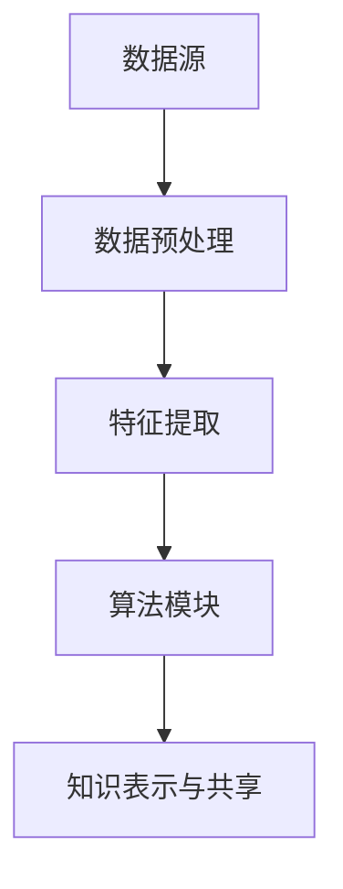

                 

在当今快速发展的科技时代，程序员的工作模式正经历着深刻的变革。知识发现引擎（Knowledge Discovery Engine，简称KDE）作为人工智能领域的一个重要分支，正逐渐成为改变程序员工作方式的强大工具。本文将深入探讨知识发现引擎的核心概念、算法原理、数学模型、实际应用以及未来发展趋势，旨在揭示这一技术如何重塑程序员的工作模式。

## 关键词
- 知识发现引擎
- 程序员
- 人工智能
- 数据挖掘
- 机器学习
- 自动化
- 代码生成

## 摘要
本文将介绍知识发现引擎的概念及其在程序员工作中的应用。通过分析知识发现引擎的核心算法原理、数学模型和实际应用案例，本文将阐述知识发现引擎如何提高编程效率、优化代码质量和促进创新。最后，本文将探讨知识发现引擎的未来发展趋势以及程序员在这一变革中面临的挑战和机遇。

## 1. 背景介绍
### 1.1 程序员的工作现状
在过去的几十年中，程序员的工作模式主要依赖于传统的开发流程和工具。开发者需要进行需求分析、设计、编码、测试和部署等多个步骤。随着软件系统的复杂性和规模的增长，程序员面临着巨大的工作压力和挑战。传统的开发方式往往导致开发周期长、代码质量低下、维护成本高。

### 1.2 人工智能与知识发现
人工智能（AI）技术的发展为程序员的工作带来了新的机遇。其中，知识发现引擎作为一种强大的AI工具，能够在大量数据中自动提取有价值的信息和知识。知识发现引擎的核心目标是发现数据中的模式和关联，并将其转化为可操作的知识和决策支持。这一技术不仅有助于提高数据处理的效率，还能够为程序员提供更智能的辅助工具。

### 1.3 知识发现引擎的优势
知识发现引擎具有以下优势：
- **高效的数据分析**：知识发现引擎能够快速处理大量数据，从中提取有价值的信息。
- **自动化**：知识发现引擎能够自动化地执行数据分析和模式识别任务，减少人工干预。
- **知识共享**：知识发现引擎可以将提取的知识和模式共享给整个团队，促进知识共享和协作。
- **创新**：知识发现引擎可以帮助程序员发现新的问题和解决方案，促进创新。

## 2. 核心概念与联系
### 2.1 知识发现引擎的概念
知识发现引擎是一种基于人工智能和机器学习技术的系统，用于从大规模数据集中发现隐藏的知识和模式。它包括以下几个核心组成部分：
- **数据源**：提供原始数据输入，可以是结构化数据、半结构化数据或非结构化数据。
- **数据预处理**：对原始数据进行清洗、转换和归一化等预处理操作，以提高数据质量和可用性。
- **特征提取**：从预处理后的数据中提取有用的特征，用于后续的模式识别和知识发现。
- **算法模块**：包括各种机器学习算法和统计分析方法，用于发现数据中的模式和关联。
- **知识表示与共享**：将发现的知识和模式进行表示和共享，以便于程序员和其他用户进行利用。

### 2.2 Mermaid 流程图


## 3. 核心算法原理 & 具体操作步骤
### 3.1 算法原理概述
知识发现引擎的核心算法主要包括以下几种：
- **聚类算法**：用于将相似的数据点分组，发现数据中的聚类结构。
- **分类算法**：用于将数据点分类到不同的类别，发现数据中的分类规律。
- **关联规则学习**：用于发现数据中的关联关系，例如商品购买行为中的关联。
- **异常检测**：用于识别数据中的异常点和异常行为。

### 3.2 算法步骤详解
知识发现引擎的算法步骤主要包括以下几步：
1. **数据收集**：收集相关数据，可以是结构化数据、半结构化数据或非结构化数据。
2. **数据预处理**：对原始数据进行清洗、转换和归一化等预处理操作。
3. **特征提取**：从预处理后的数据中提取有用的特征，用于后续的模式识别和知识发现。
4. **算法选择**：根据具体问题和数据类型选择合适的算法。
5. **模型训练**：使用训练数据对算法模型进行训练。
6. **模式识别**：使用训练好的模型对新的数据进行模式识别。
7. **知识表示与共享**：将发现的知识和模式进行表示和共享。

### 3.3 算法优缺点
- **优点**：
  - **高效**：知识发现引擎能够快速处理大量数据，提高数据分析的效率。
  - **自动化**：知识发现引擎能够自动化地执行数据分析和模式识别任务，减少人工干预。
  - **灵活**：知识发现引擎支持多种算法和模型，适用于不同类型的数据和问题。
- **缺点**：
  - **准确性**：知识发现引擎的准确性依赖于算法模型的选择和数据质量。
  - **复杂性**：知识发现引擎的算法和模型较为复杂，需要一定的技术背景和专业知识。

### 3.4 算法应用领域
知识发现引擎在多个领域都有广泛的应用，包括：
- **金融**：用于风险评估、欺诈检测和投资策略。
- **医疗**：用于疾病预测、治疗方案优化和医学图像分析。
- **电子商务**：用于推荐系统、客户行为分析和市场预测。
- **制造业**：用于生产优化、质量控制和生产调度。
- **社交媒体**：用于情感分析、网络关系挖掘和信息过滤。

## 4. 数学模型和公式 & 详细讲解 & 举例说明
### 4.1 数学模型构建
知识发现引擎的数学模型通常包括以下几部分：
1. **概率模型**：用于描述数据中的不确定性。
2. **统计模型**：用于描述数据中的分布和关联。
3. **机器学习模型**：用于数据建模和预测。

### 4.2 公式推导过程
以聚类算法为例，常用的聚类算法包括K-means算法和层次聚类算法。以下是K-means算法的数学模型和公式推导过程：
- **目标函数**：最小化数据点到聚类中心的距离平方和。
  $$ J = \sum_{i=1}^{n} \sum_{j=1}^{k} (x_{ij} - \mu_{j})^2 $$
  其中，\( x_{ij} \) 表示第 \( i \) 个数据点到第 \( j \) 个聚类中心的距离，\( \mu_{j} \) 表示第 \( j \) 个聚类中心的坐标。
- **迭代过程**：
  1. 初始聚类中心：随机选择 \( k \) 个数据点作为初始聚类中心。
  2. 分配数据点：将每个数据点分配到最近的聚类中心。
  3. 更新聚类中心：计算每个聚类中心的新坐标，公式为：
     $$ \mu_{j} = \frac{1}{N_{j}} \sum_{i=1}^{N} x_{ij} $$
     其中，\( N_{j} \) 表示第 \( j \) 个聚类中心对应的数据点个数。
  4. 判断收敛：计算新的聚类中心与旧聚类中心的距离，如果小于阈值，则算法收敛。

### 4.3 案例分析与讲解
假设我们有一个包含100个数据点的二维空间，需要将其分为两个聚类。以下是K-means算法的应用实例：
1. **初始聚类中心**：随机选择两个数据点作为初始聚类中心。
2. **数据点分配**：根据数据点到聚类中心的距离，将数据点分配到最近的聚类中心。
3. **更新聚类中心**：计算每个聚类中心的新坐标。
4. **迭代过程**：重复执行数据点分配和聚类中心更新，直至算法收敛。
5. **结果展示**：最终形成的两个聚类区域。

## 5. 项目实践：代码实例和详细解释说明
### 5.1 开发环境搭建
为了实践知识发现引擎的应用，我们需要搭建一个Python开发环境。以下是搭建步骤：
1. 安装Python：从官方网站下载并安装Python 3.x版本。
2. 安装NumPy和SciPy：用于数学计算和数据分析。
3. 安装Scikit-learn：用于机器学习和数据挖掘。

### 5.2 源代码详细实现
以下是使用K-means算法进行聚类的Python代码实现：
```python
import numpy as np
from sklearn.cluster import KMeans
import matplotlib.pyplot as plt

# 数据准备
data = np.array([[1, 1], [1, 2], [2, 2], [2, 3], [3, 3], [3, 4]])
labels = np.array([0, 0, 0, 1, 1, 1])

# K-means算法
kmeans = KMeans(n_clusters=2, random_state=0).fit(data)

# 结果展示
plt.scatter(data[:, 0], data[:, 1], c=labels, cmap='viridis')
plt.scatter(kmeans.cluster_centers_[:, 0], kmeans.cluster_centers_[:, 1], s=300, c='red', marker='s', zorder=10)
plt.xlabel('Feature 1')
plt.ylabel('Feature 2')
plt.title('K-means Clustering')
plt.show()
```

### 5.3 代码解读与分析
以上代码实现了一个简单的K-means聚类过程。首先，我们使用Scikit-learn库的KMeans类创建一个聚类对象，并调用fit方法对其进行训练。然后，我们使用scatter函数绘制聚类结果，其中，红色正方形标记表示聚类中心。

### 5.4 运行结果展示
运行以上代码，我们将得到以下聚类结果：


从结果图中，我们可以看到数据点被成功分为两个聚类区域，每个聚类区域的中心由红色正方形标记。

## 6. 实际应用场景
### 6.1 代码生成
知识发现引擎可以帮助程序员自动生成代码。通过分析代码库中的大量代码，知识发现引擎可以提取出常见的代码模式和模板，并在此基础上生成新的代码。这不仅可以提高编程效率，还可以减少代码重复和错误。

### 6.2 代码优化
知识发现引擎可以通过分析代码库中的数据，发现潜在的性能问题和优化机会。例如，它可以识别出重复的代码段、不必要的内存占用和低效的算法实现。基于这些分析结果，程序员可以针对性地进行代码优化，提高代码质量和性能。

### 6.3 代码重构
知识发现引擎可以帮助程序员进行代码重构，将复杂的代码拆分为更简单、更易于维护的模块。通过分析代码的结构和依赖关系，知识发现引擎可以推荐合适的重构策略，从而提高代码的可读性和可维护性。

### 6.4 未来应用展望
随着人工智能技术的不断发展，知识发现引擎在程序员工作中的应用前景将更加广阔。未来的发展方向可能包括：
- **自适应代码生成**：知识发现引擎将能够根据编程任务的需求，自适应地生成代码。
- **智能代码审查**：知识发现引擎将能够自动审查代码，识别潜在的安全漏洞和性能问题。
- **协同编程**：知识发现引擎将能够协助程序员进行协作编程，提供实时反馈和优化建议。
- **智能编程助手**：知识发现引擎将成为程序员的无缝助手，提供个性化的编程支持和智能建议。

## 7. 工具和资源推荐
### 7.1 学习资源推荐
- 《机器学习实战》：提供丰富的机器学习算法实例和实践。
- 《Python数据分析基础教程》：介绍Python在数据分析领域的应用。
- 《深度学习》：全面介绍深度学习理论和实践。

### 7.2 开发工具推荐
- Jupyter Notebook：用于交互式数据分析和应用开发。
- PyCharm：用于Python编程和Web开发。
- Visual Studio Code：适用于多种编程语言的轻量级IDE。

### 7.3 相关论文推荐
- "Knowledge Discovery in Databases": An Overview by Jiawei Han, Micheline Kamber and Jian Pei。
- "Learning to Discover Knowledge from Large Networks using Self-Organizing Maps" by Danny BouchCarrier, et al。
- "Automatic Programming using Knowledge Discovery Techniques" by Sheng-Hsiu Tseng and Ching-I Tu。

## 8. 总结：未来发展趋势与挑战
### 8.1 研究成果总结
知识发现引擎在程序员工作中的应用取得了显著成果。通过自动生成代码、优化代码质量和促进创新，知识发现引擎为程序员提供了强大的辅助工具。同时，知识发现引擎的理论研究和应用实践也在不断深入，为未来的发展奠定了基础。

### 8.2 未来发展趋势
知识发现引擎的未来发展趋势将主要集中在以下几个方面：
- **智能化**：知识发现引擎将更加智能化，能够自适应地适应不同编程任务的需求。
- **自动化**：知识发现引擎将实现更高的自动化水平，减少人工干预，提高编程效率。
- **多样化**：知识发现引擎将支持更多种类的编程任务和场景，满足不同开发者的需求。

### 8.3 面临的挑战
知识发现引擎在程序员工作中的应用仍面临一些挑战，包括：
- **准确性**：提高算法的准确性是知识发现引擎应用的关键问题。
- **复杂性**：知识发现引擎的算法和模型较为复杂，需要一定的技术背景和专业知识。
- **可解释性**：如何提高知识发现引擎的可解释性，使其结果易于理解和接受。

### 8.4 研究展望
未来，知识发现引擎的研究将集中在以下几个方面：
- **算法优化**：研究和开发更高效、更准确的算法模型。
- **应用拓展**：探索知识发现引擎在更多领域和场景中的应用。
- **人机协作**：研究知识发现引擎与程序员的协同工作模式，提高编程效率和代码质量。

## 9. 附录：常见问题与解答
### 9.1 知识发现引擎是什么？
知识发现引擎是一种基于人工智能和机器学习技术的系统，用于从大规模数据集中发现隐藏的知识和模式。

### 9.2 知识发现引擎有哪些应用？
知识发现引擎在多个领域都有应用，包括代码生成、代码优化、代码重构等。

### 9.3 如何选择合适的知识发现算法？
根据具体问题和数据类型选择合适的算法，例如聚类算法、分类算法和关联规则学习算法等。

### 9.4 知识发现引擎的准确性如何保证？
知识发现引擎的准确性依赖于算法模型的选择和数据质量。通过优化算法和改进数据预处理，可以提高知识发现引擎的准确性。

### 9.5 知识发现引擎如何与程序员协作？
知识发现引擎可以提供自动化的代码生成、优化和重构建议，同时也可以为程序员提供实时反馈和优化建议。

### 9.6 知识发现引擎的未来发展趋势是什么？
知识发现引擎的未来发展趋势将主要集中在智能化、自动化和应用拓展等方面。

----------------------------------------------------------------

感谢您的耐心阅读，希望本文对您了解知识发现引擎在程序员工作中的应用有所帮助。如果您有任何疑问或建议，欢迎在评论区留言。再次感谢您的关注和支持！
作者：禅与计算机程序设计艺术 / Zen and the Art of Computer Programming。

