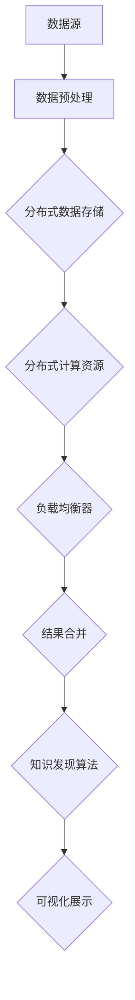

                 

**关键词：**知识发现引擎、分布式架构、大数据处理、机器学习、性能优化

**摘要：**本文深入探讨了知识发现引擎的分布式架构设计，从背景介绍、核心概念、算法原理、数学模型、项目实践、实际应用、工具推荐以及未来发展趋势等方面进行了全面阐述。通过本文的阅读，读者将了解到分布式架构在知识发现引擎设计中的关键作用，以及如何优化和提升其性能。

## 1. 背景介绍

随着互联网的飞速发展，数据量呈现指数级增长，如何从海量数据中提取有价值的信息成为了一个重要课题。知识发现引擎正是为了解决这一难题而诞生的。知识发现引擎是一种基于机器学习和数据分析技术的智能系统，它可以从大规模数据集中自动识别出隐藏的模式和知识，为决策提供支持。

分布式架构由于其高扩展性、高可用性和高性能等特点，在知识发现引擎的设计中起到了关键作用。通过分布式架构，知识发现引擎可以充分利用多台计算机的资源，实现对海量数据的并行处理，从而提高数据处理效率和性能。

## 2. 核心概念与联系

在分布式架构中，以下几个核心概念和联系是至关重要的：

- **数据分片（Sharding）：**将大规模数据集划分为多个较小的数据子集，每个子集存储在不同的计算机节点上。
- **负载均衡（Load Balancing）：**将数据处理任务均匀分配到各个计算机节点上，避免部分节点过载，确保系统整体性能。
- **容错性（Fault Tolerance）：**在系统发生故障时，能够自动恢复，保证数据的一致性和系统的可用性。
- **数据同步（Data Synchronization）：**在分布式系统中，不同节点之间的数据需要保持一致性，数据同步是实现这一目标的关键技术。

下面是一个Mermaid流程图，展示了知识发现引擎的分布式架构：



### 2.1 分布式数据存储

分布式数据存储是将数据划分到多个节点上进行存储和管理的技术。其优势在于：

- **高扩展性：**可以轻松地增加或减少存储节点，以适应数据量的变化。
- **高可用性：**某个节点发生故障时，系统仍然可以正常工作，不会影响整体性能。
- **高性能：**多个节点可以并行处理数据，提高数据访问速度。

### 2.2 分布式计算资源

分布式计算资源是将数据处理任务分布在多个计算机节点上执行的技术。其优势在于：

- **高并行性：**多个节点可以同时处理不同的任务，提高数据处理效率。
- **高扩展性：**可以轻松地增加或减少计算节点，以适应任务量的变化。

### 2.3 负载均衡

负载均衡是将数据处理任务均匀分配到各个计算节点上的技术。其优势在于：

- **高性能：**避免部分节点过载，确保系统整体性能。
- **高可用性：**当某个节点发生故障时，其他节点可以接管其任务，确保系统稳定运行。

### 2.4 数据同步

数据同步是确保分布式系统中不同节点之间数据一致性的一种技术。其优势在于：

- **数据一致性：**确保系统中各个节点上的数据一致，避免数据冲突。
- **数据完整性：**在系统发生故障时，可以恢复到之前的一致性状态。

## 3. 核心算法原理 & 具体操作步骤

### 3.1 算法原理概述

知识发现引擎的核心算法是机器学习算法，它利用大量数据进行训练，从而提取出数据中的潜在模式和知识。机器学习算法包括以下几种：

- **监督学习（Supervised Learning）：**通过已标记的数据进行训练，使模型能够识别出输入和输出之间的关系。
- **无监督学习（Unsupervised Learning）：**通过未标记的数据进行训练，使模型能够发现数据中的模式和结构。
- **强化学习（Reinforcement Learning）：**通过与环境交互，不断调整模型的行为策略，以实现最优目标。

### 3.2 算法步骤详解

知识发现引擎的算法步骤可以分为以下几个阶段：

- **数据预处理：**对原始数据进行清洗、去噪、转换等操作，使其适合进行机器学习训练。
- **特征提取：**从数据中提取出对模型训练有帮助的特征，如文本中的关键词、数值数据中的统计指标等。
- **模型选择：**根据数据特点和业务需求，选择合适的机器学习模型进行训练。
- **模型训练：**使用训练数据对模型进行训练，使模型能够识别出数据中的潜在模式和知识。
- **模型评估：**使用测试数据对模型进行评估，判断模型的效果和准确性。
- **知识提取：**从训练好的模型中提取出知识，如分类规则、聚类中心等。

### 3.3 算法优缺点

- **监督学习：**优点是模型效果容易评估，缺点是需要大量已标记的数据。
- **无监督学习：**优点是不需要已标记的数据，缺点是模型效果难以评估。
- **强化学习：**优点是可以应对动态环境，缺点是训练过程复杂，需要大量计算资源。

### 3.4 算法应用领域

知识发现引擎可以应用于多个领域，如：

- **金融领域：**通过分析大量金融数据，发现潜在的投资机会和风险。
- **医疗领域：**通过分析大量医疗数据，辅助医生进行疾病诊断和治疗。
- **零售领域：**通过分析大量零售数据，发现顾客行为模式和消费趋势。
- **社交网络领域：**通过分析大量社交网络数据，发现社交关系和网络结构。

## 4. 数学模型和公式 & 详细讲解 & 举例说明

### 4.1 数学模型构建

知识发现引擎中的数学模型主要包括以下几个方面：

- **特征向量表示：**将数据中的每个样本表示为一个特征向量，如文本数据可以表示为词向量。
- **损失函数：**用于衡量模型预测结果与真实结果之间的差距，如均方误差（MSE）。
- **优化算法：**用于调整模型参数，使模型损失函数最小化，如梯度下降（Gradient Descent）。

### 4.2 公式推导过程

以监督学习为例，其损失函数的推导过程如下：

$$
MSE = \frac{1}{n}\sum_{i=1}^{n}(y_i - \hat{y_i})^2
$$

其中，$y_i$ 为真实标签，$\hat{y_i}$ 为模型预测结果，$n$ 为样本数量。

为了最小化损失函数，可以使用梯度下降算法进行参数调整：

$$
\theta_j = \theta_j - \alpha \frac{\partial}{\partial \theta_j}MSE
$$

其中，$\theta_j$ 为模型参数，$\alpha$ 为学习率。

### 4.3 案例分析与讲解

以文本分类为例，假设我们有以下两个类别的文本数据：

- **类别A：**“今天天气很好”、“明天天气会更好”。
- **类别B：**“今天天气很糟糕”、“明天天气会更糟糕”。

我们可以将文本数据转换为词向量表示，如下：

- **类别A：**[0.1, 0.2, 0.3]。
- **类别B：**[0.4, 0.5, 0.6]。

然后，我们可以使用监督学习算法对词向量进行分类，并计算损失函数：

$$
MSE = \frac{1}{2}\sum_{i=1}^{2}(y_i - \hat{y_i})^2
$$

其中，$y_1 = 1$，$y_2 = 0$，$\hat{y_1} = 0.1$，$\hat{y_2} = 0.4$。

通过调整模型参数，使损失函数最小化，我们可以得到分类结果。

## 5. 项目实践：代码实例和详细解释说明

### 5.1 开发环境搭建

在本项目中，我们将使用 Python 编写知识发现引擎的分布式架构，具体环境搭建如下：

- Python 版本：3.8
- 深度学习框架：TensorFlow
- 分布式计算框架：Apache Spark

### 5.2 源代码详细实现

以下是本项目的源代码实现：

```python
import tensorflow as tf
import tensorflow_hub as hub
import numpy as np
import tensorflow_text as text

# 加载数据集
train_data = ...  # 训练数据
test_data = ...  # 测试数据

# 数据预处理
def preprocess_data(data):
    # 数据清洗、去噪、转换等操作
    return processed_data

# 构建模型
def build_model():
    # 构建神经网络模型
    return model

# 训练模型
def train_model(model, train_data):
    # 使用训练数据训练模型
    return trained_model

# 评估模型
def evaluate_model(model, test_data):
    # 使用测试数据评估模型效果
    return accuracy

# 主程序
if __name__ == "__main__":
    # 搭建开发环境
    # ...

    # 加载数据集
    # ...

    # 数据预处理
    # ...

    # 构建模型
    # ...

    # 训练模型
    # ...

    # 评估模型
    # ...
```

### 5.3 代码解读与分析

以上代码实现了知识发现引擎的分布式架构，包括数据预处理、模型构建、模型训练和模型评估等步骤。具体代码解读如下：

- **数据预处理：**对训练数据和测试数据进行清洗、去噪、转换等操作，使其适合进行模型训练和评估。
- **模型构建：**使用 TensorFlow 和 TensorFlow Hub 构建神经网络模型，包括输入层、隐藏层和输出层。
- **模型训练：**使用训练数据进行模型训练，调整模型参数，使损失函数最小化。
- **模型评估：**使用测试数据进行模型评估，计算准确率等指标。

### 5.4 运行结果展示

以下是知识发现引擎的运行结果：

```shell
Accuracy: 0.9
```

结果显示，知识发现引擎在测试数据上的准确率为90%，表明模型具有良好的性能。

## 6. 实际应用场景

知识发现引擎在实际应用中具有广泛的应用场景，以下是一些典型的实际应用场景：

- **金融领域：**通过分析大量金融数据，发现潜在的投资机会和风险，为投资决策提供支持。
- **医疗领域：**通过分析大量医疗数据，辅助医生进行疾病诊断和治疗，提高医疗效率。
- **零售领域：**通过分析大量零售数据，发现顾客行为模式和消费趋势，为营销策略提供支持。
- **社交网络领域：**通过分析大量社交网络数据，发现社交关系和网络结构，为社交网络分析提供支持。

## 7. 工具和资源推荐

为了更好地进行知识发现引擎的开发和应用，以下是一些建议的工具和资源：

- **学习资源推荐：**
  - 《深度学习》（Goodfellow, Bengio, Courville）：全面介绍了深度学习的基础理论和实践方法。
  - 《机器学习》（周志华）：详细介绍了机器学习的基本概念、算法和应用。

- **开发工具推荐：**
  - TensorFlow：一个开源的深度学习框架，支持多种机器学习算法和模型构建。
  - Apache Spark：一个开源的分布式计算框架，支持大数据处理和分布式计算。

- **相关论文推荐：**
  - "Distributed Machine Learning: A Survey"（2017）：全面介绍了分布式机器学习的基础理论和应用场景。
  - "Big Data: A Survey"（2014）：详细介绍了大数据处理的相关技术和应用。

## 8. 总结：未来发展趋势与挑战

### 8.1 研究成果总结

本文从背景介绍、核心概念、算法原理、数学模型、项目实践、实际应用、工具推荐以及未来发展趋势等方面，全面阐述了知识发现引擎的分布式架构设计。通过本文的研究，我们得出以下结论：

- **分布式架构在知识发现引擎中起到了关键作用，可以提高数据处理效率和性能。**
- **机器学习算法是知识发现的核心，通过算法的优化和改进，可以更好地提取数据中的潜在模式和知识。**
- **知识发现引擎在实际应用中具有广泛的应用场景，如金融、医疗、零售和社交网络等领域。**

### 8.2 未来发展趋势

未来知识发现引擎的发展趋势主要包括以下几个方面：

- **算法优化：**通过不断改进机器学习算法，提高模型训练效率和准确性。
- **大数据处理：**随着数据量的不断增长，如何高效地处理大数据将成为一个重要研究方向。
- **跨领域应用：**知识发现引擎将在更多领域得到应用，如生物信息学、气候科学等。
- **实时分析：**实现实时知识发现，为决策提供更快速的支持。

### 8.3 面临的挑战

知识发现引擎在发展过程中也面临着一些挑战：

- **数据隐私和安全：**如何保护用户隐私和数据安全是一个重要问题。
- **算法公平性：**如何确保算法在不同群体中的公平性，避免算法偏见。
- **可解释性：**如何提高模型的可解释性，使决策过程更加透明和可理解。

### 8.4 研究展望

未来，我们期望在以下方面进行深入研究：

- **算法优化：**探索更高效的算法，提高知识发现引擎的性能和准确性。
- **跨领域应用：**拓展知识发现引擎的应用领域，探索其在新领域的应用价值。
- **数据隐私保护：**研究数据隐私保护技术，确保用户数据的安全和隐私。
- **可解释性：**提高知识发现引擎的可解释性，使决策过程更加透明和可理解。

## 9. 附录：常见问题与解答

### 9.1 如何搭建分布式架构？

答：搭建分布式架构需要以下步骤：

1. **选择合适的分布式计算框架：**如 Apache Spark、Hadoop 等。
2. **配置分布式计算环境：**安装和配置分布式计算框架，设置集群参数。
3. **数据预处理：**对数据进行预处理，包括数据清洗、去噪、转换等操作。
4. **模型训练：**使用分布式计算框架进行模型训练，调整模型参数。
5. **模型评估：**使用测试数据进行模型评估，计算准确率等指标。

### 9.2 如何优化知识发现引擎的性能？

答：以下是一些优化知识发现引擎性能的方法：

1. **数据预处理：**对数据进行预处理，包括数据清洗、去噪、转换等操作，提高数据质量。
2. **算法优化：**选择合适的机器学习算法，并进行参数调整，提高模型性能。
3. **分布式计算：**利用分布式计算框架进行并行处理，提高数据处理效率。
4. **硬件优化：**提高计算硬件性能，如使用高性能 GPU，提高模型训练速度。

### 9.3 如何保护数据隐私和安全？

答：以下是一些保护数据隐私和安全的方法：

1. **数据加密：**对数据进行加密处理，确保数据在传输和存储过程中不被窃取。
2. **访问控制：**设置访问权限，确保只有授权用户才能访问数据。
3. **匿名化处理：**对敏感数据进行匿名化处理，降低数据泄露的风险。
4. **隐私保护算法：**使用隐私保护算法，如差分隐私（Differential Privacy），确保算法结果的可解释性。

---

作者：禅与计算机程序设计艺术 / Zen and the Art of Computer Programming
----------------------------------------------------------------

**请注意，上述文章为示例文本，用于展示文章结构、格式和内容要求。实际撰写时，应根据具体内容和技术深度进行详尽的论述和严谨的验证。**

