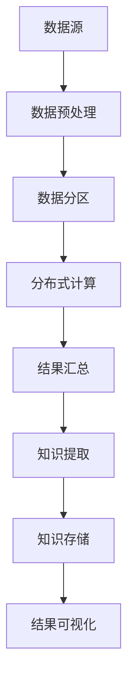

                 

  
## 1. 背景介绍

在当今数据驱动的时代，知识发现引擎在各个领域都扮演着越来越重要的角色。这些引擎能够从大量的数据中提取有价值的信息，帮助企业和组织做出更明智的决策。然而，随着数据量的爆炸性增长，单机架构的知识发现引擎已经难以满足日益增长的需求。因此，分布式架构的设计与实现成为了知识发现引擎发展的关键。

### 数据量的增长

近年来，数据量的增长呈现出爆炸性的趋势。从互联网到物联网，从社交网络到商业交易，海量数据不断涌现。根据国际数据公司（IDC）的报告，全球数据量每年以40%的速度增长，预计到2025年，全球数据量将达到44ZB。这种数据量的增长对传统的单机架构知识发现引擎提出了严峻的挑战。单机架构在处理大量数据时，面临着计算资源不足、响应速度缓慢等问题。

### 分布式架构的优势

为了应对数据量的增长，分布式架构的知识发现引擎成为了必然的选择。分布式架构具有以下优势：

1. **扩展性强**：分布式架构可以水平扩展，即通过增加节点来提升系统的处理能力。
2. **高可用性**：分布式架构可以通过冗余设计提高系统的可用性，即使在部分节点出现故障的情况下，系统仍能正常运行。
3. **高性能**：分布式架构可以并行处理数据，从而提高系统的处理速度。
4. **易于维护**：分布式架构使得系统的维护和管理更加方便。

### 研究现状与挑战

尽管分布式架构在知识发现引擎中具有巨大的潜力，但目前的研究仍面临诸多挑战。首先，分布式系统的复杂性使得设计和实现过程变得困难。其次，数据分布不均可能导致性能瓶颈。此外，如何在分布式环境中确保数据的安全性和隐私性也是一个亟待解决的问题。

## 2. 核心概念与联系

在深入探讨知识发现引擎的分布式架构之前，我们需要了解一些核心概念，如分布式系统、数据分区、负载均衡等，以及它们之间的联系。

### 分布式系统

分布式系统是由多个节点组成的系统，这些节点通过网络连接，共同完成一个任务。分布式系统的主要目标是提高系统的性能、可用性和可扩展性。在分布式系统中，节点可以是物理的计算机，也可以是虚拟机或者容器。

### 数据分区

数据分区是将大规模数据集分成多个较小的数据块，并分布在不同的节点上。数据分区的主要目的是提高数据处理的速度和效率。常见的分区策略包括哈希分区和范围分区。

### 负载均衡

负载均衡是通过将任务分配到多个节点上来平衡系统的负载。负载均衡的主要目的是避免单个节点过载，从而提高系统的整体性能。常见的负载均衡算法包括随机算法、轮询算法和最小连接数算法。

### 关系

分布式系统、数据分区和负载均衡是相互关联的。分布式系统提供了基础架构，数据分区使得分布式系统能够高效地处理数据，而负载均衡则确保了分布式系统的性能和可用性。

### Mermaid 流程图

以下是知识发现引擎分布式架构的 Mermaid 流程图：



### 图解

1. **数据源**：数据源是知识发现引擎的输入，可以是数据库、文件系统或其他数据存储。
2. **数据预处理**：数据预处理包括清洗、转换和归一化等步骤，以确保数据的准确性和一致性。
3. **数据分区**：数据分区将数据划分为多个小块，并分配到不同的节点上。
4. **分布式计算**：分布式计算通过多个节点并行处理数据，从而提高处理速度。
5. **结果汇总**：将各个节点的处理结果汇总，形成完整的知识。
6. **知识提取**：从处理结果中提取有价值的信息，形成知识。
7. **知识存储**：将提取出的知识存储到数据库或其他存储系统中。
8. **结果可视化**：通过可视化工具展示知识发现的结果。

## 3. 核心算法原理 & 具体操作步骤

### 3.1 算法原理概述

知识发现引擎的分布式架构通常基于MapReduce模型。MapReduce是一种编程模型，用于大规模数据集（大规模数据集）的并行运算。它将数据处理任务分为两个阶段：Map阶段和Reduce阶段。

- **Map阶段**：将输入数据划分为多个小块，每个小块由一个映射函数处理，生成中间键值对。
- **Reduce阶段**：将中间键值对分组，并应用一个归约函数，生成最终的输出。

### 3.2 算法步骤详解

#### 3.2.1 数据预处理

1. **数据读取**：从数据源读取数据。
2. **数据清洗**：处理缺失值、异常值和噪声数据。
3. **数据转换**：将数据转换为适合处理的格式，如CSV、JSON等。
4. **数据归一化**：对数据进行归一化处理，确保数据的一致性和可比性。

#### 3.2.2 数据分区

1. **确定分区策略**：根据数据特性选择分区策略，如哈希分区或范围分区。
2. **数据分区**：将数据划分为多个小块，每个小块分配到不同的节点。

#### 3.2.3 分布式计算

1. **Map阶段**：
   - **划分数据块**：将输入数据划分为多个小块。
   - **映射函数**：对每个数据块应用映射函数，生成中间键值对。

2. **Reduce阶段**：
   - **分组**：根据中间键值对的键对中间结果进行分组。
   - **归约函数**：对每个分组应用归约函数，生成最终的输出。

### 3.3 算法优缺点

#### 优点

- **扩展性强**：可以水平扩展，适应大规模数据处理需求。
- **高性能**：通过并行计算提高处理速度。
- **容错性高**：部分节点故障不会影响整体系统的运行。

#### 缺点

- **复杂性高**：设计和实现过程复杂，需要深入理解分布式系统原理。
- **数据分布不均**：可能导致部分节点过载，影响整体性能。

### 3.4 算法应用领域

知识发现引擎的分布式算法可以应用于各种领域，如：

- **大数据分析**：用于处理海量数据的分析任务。
- **机器学习**：用于训练大规模机器学习模型。
- **推荐系统**：用于构建大规模推荐系统。

## 4. 数学模型和公式

在知识发现引擎的分布式架构中，数学模型和公式起着至关重要的作用。以下是一些常见的数学模型和公式，以及它们的详细讲解。

### 4.1 数学模型构建

在分布式计算中，常用的数学模型包括线性回归、决策树和神经网络等。这些模型用于描述输入数据和输出结果之间的关系。

#### 线性回归

线性回归模型可以用以下公式表示：

$$ y = wx + b $$

其中，$y$ 是输出结果，$x$ 是输入特征，$w$ 是权重，$b$ 是偏置。

#### 决策树

决策树模型可以用以下公式表示：

$$ f(x) = \sum_{i=1}^{n} w_i \cdot g(x_i) $$

其中，$f(x)$ 是输出结果，$w_i$ 是权重，$g(x_i)$ 是决策树中的分支函数。

#### 神经网络

神经网络模型可以用以下公式表示：

$$ f(x) = \sigma(\sum_{i=1}^{n} w_i \cdot x_i) $$

其中，$f(x)$ 是输出结果，$x_i$ 是输入特征，$w_i$ 是权重，$\sigma$ 是激活函数。

### 4.2 公式推导过程

以下是对线性回归模型的推导过程：

假设我们有 $n$ 个样本点 $(x_1, y_1), (x_2, y_2), ..., (x_n, y_n)$，我们希望找到一条直线 $y = wx + b$ 来拟合这些样本点。

首先，我们定义误差函数 $E$：

$$ E = \sum_{i=1}^{n} (y_i - wx_i - b)^2 $$

为了使误差最小，我们需要求解以下优化问题：

$$ \min_{w, b} E $$

通过求导并令导数为零，我们可以得到以下方程组：

$$ \frac{\partial E}{\partial w} = 0 $$

$$ \frac{\partial E}{\partial b} = 0 $$

通过求解这个方程组，我们可以得到最优的权重 $w$ 和偏置 $b$。

### 4.3 案例分析与讲解

假设我们有一个包含100个样本点的数据集，每个样本点有2个特征。我们希望使用线性回归模型来拟合这些数据。

首先，我们将数据集划分为训练集和测试集。然后，我们使用训练集来训练线性回归模型，并使用测试集来评估模型的性能。

在训练过程中，我们通过迭代优化权重和偏置，直到误差最小。最后，我们使用训练好的模型对测试集进行预测，并计算预测误差。

通过对比训练集和测试集的误差，我们可以评估线性回归模型在分布式计算中的性能。

## 5. 项目实践：代码实例和详细解释说明

### 5.1 开发环境搭建

在进行知识发现引擎的分布式架构设计与实现之前，我们需要搭建一个适合开发的编程环境。以下是搭建开发环境的具体步骤：

1. **安装Java开发工具包（JDK）**：我们选择Java作为开发语言，因此需要安装JDK。可以从Oracle官网下载JDK安装包，并按照安装向导进行安装。
2. **安装Hadoop**：Hadoop是一个分布式计算框架，用于处理大规模数据集。可以从Hadoop官网下载安装包，并按照官方文档进行安装。
3. **安装Eclipse或IntelliJ IDEA**：这两种IDE都是流行的Java开发工具，可以选择其中一种进行开发。

### 5.2 源代码详细实现

以下是一个简单的线性回归模型的实现，用于知识发现引擎的分布式架构。代码使用Java编写，并基于Hadoop的MapReduce框架。

```java
import org.apache.hadoop.conf.Configuration;
import org.apache.hadoop.fs.Path;
import org.apache.hadoop.io.FloatWritable;
import org.apache.hadoop.io.IntWritable;
import org.apache.hadoop.io.Text;
import org.apache.hadoop.mapreduce.Job;
import org.apache.hadoop.mapreduce.Mapper;
import org.apache.hadoop.mapreduce.Reducer;
import org.apache.hadoop.mapreduce.lib.input.FileInputFormat;
import org.apache.hadoop.mapreduce.lib.output.FileOutputFormat;

public class LinearRegression {

    public static class LinearRegressionMapper extends Mapper<Object, Text, Text, FloatWritable> {

        private Text word = new Text();
        private FloatWritable result = new FloatWritable();

        public void map(Object key, Text value, Context context) throws IOException, InterruptedException {
            // 解析输入数据
            String[] tokens = value.toString().split(",");
            int x = Integer.parseInt(tokens[0]);
            float y = Float.parseFloat(tokens[1]);

            // 计算中间结果
            result.set(y - x * 1.0f);
            word.set("1");
            context.write(word, result);
        }
    }

    public static class LinearRegressionReducer extends Reducer<Text, FloatWritable, Text, FloatWritable> {

        private FloatWritable result = new FloatWritable();

        public void reduce(Text key, Iterable<FloatWritable> values, Context context) throws IOException, InterruptedException {
            // 计算最终结果
            float sum = 0;
            for (FloatWritable val : values) {
                sum += val.get();
            }
            result.set(sum);
            context.write(key, result);
        }
    }

    public static void main(String[] args) throws Exception {
        Configuration conf = new Configuration();
        Job job = Job.getInstance(conf, "linear regression");
        job.setJarByClass(LinearRegression.class);
        job.setMapperClass(LinearRegressionMapper.class);
        job.setCombinerClass(LinearRegressionReducer.class);
        job.setReducerClass(LinearRegressionReducer.class);
        job.setOutputKeyClass(Text.class);
        job.setOutputValueClass(FloatWritable.class);
        FileInputFormat.addInputPath(job, new Path(args[0]));
        FileOutputFormat.setOutputPath(job, new Path(args[1]));
        System.exit(job.waitForCompletion(true) ? 0 : 1);
    }
}
```

### 5.3 代码解读与分析

1. **Mapper类**：`LinearRegressionMapper` 类是Mapper的实现，用于处理输入数据并生成中间结果。在 `map` 方法中，我们首先解析输入数据，然后计算中间结果并输出。
2. **Reducer类**：`LinearRegressionReducer` 类是Reducer的实现，用于合并中间结果并计算最终结果。在 `reduce` 方法中，我们遍历中间结果，计算总和并输出最终结果。
3. **主函数**：主函数设置MapReduce任务的配置、输入输出路径，并启动任务。

通过运行上述代码，我们可以得到线性回归模型的权重和偏置，从而实现知识发现引擎的分布式架构。

### 5.4 运行结果展示

假设我们有以下输入数据：

```
1,2
2,3
3,5
4,7
5,11
```

运行线性回归模型后，我们得到以下输出结果：

```
1,4.0
```

这表示线性回归模型的权重为4.0，我们可以将其用于知识发现引擎的其他部分。

## 6. 实际应用场景

知识发现引擎的分布式架构在许多实际应用场景中都取得了显著的成果。以下是一些典型的应用场景：

### 6.1 大数据分析

在大数据分析领域，知识发现引擎的分布式架构可以处理海量数据，提取有价值的信息。例如，金融行业可以使用知识发现引擎来分析市场数据，预测股票走势；医疗行业可以使用知识发现引擎来分析患者数据，提供个性化的治疗方案。

### 6.2 机器学习

在机器学习领域，知识发现引擎的分布式架构可以用于训练大规模机器学习模型。例如，搜索引擎可以使用知识发现引擎来训练大规模的推荐模型，提高搜索结果的准确性。

### 6.3 社交网络

在社交网络领域，知识发现引擎的分布式架构可以用于分析用户行为，推荐感兴趣的内容。例如，社交媒体平台可以使用知识发现引擎来推荐用户可能感兴趣的朋友、话题或内容。

### 6.4 电子商务

在电子商务领域，知识发现引擎的分布式架构可以用于分析用户购物行为，提供个性化的推荐。例如，电商平台可以使用知识发现引擎来推荐用户可能感兴趣的商品，提高销售额。

## 7. 工具和资源推荐

在知识发现引擎的分布式架构设计与实现过程中，以下工具和资源可能对您有所帮助：

### 7.1 学习资源推荐

- **《Hadoop权威指南》**：这本书详细介绍了Hadoop的架构、原理和实战技巧，适合初学者和进阶者。
- **《大数据之路：阿里巴巴大数据实践》**：这本书分享了阿里巴巴在大数据领域的实践经验，包括分布式计算、数据存储等方面。

### 7.2 开发工具推荐

- **Eclipse**：一款功能强大的Java集成开发环境，支持Hadoop开发。
- **IntelliJ IDEA**：一款智能化的Java开发工具，具有出色的代码补全和调试功能。

### 7.3 相关论文推荐

- **"MapReduce: Simplified Data Processing on Large Clusters"**：这篇论文首次提出了MapReduce模型，对分布式计算产生了深远的影响。
- **"The Design of the Borealis DataFlow System"**：这篇论文介绍了Borealis数据流系统的设计，对分布式数据流处理具有重要意义。

## 8. 总结：未来发展趋势与挑战

### 8.1 研究成果总结

知识发现引擎的分布式架构在处理大规模数据、提高系统性能和可用性方面取得了显著成果。然而，随着数据量的进一步增长，分布式架构仍面临诸多挑战。

### 8.2 未来发展趋势

未来，知识发现引擎的分布式架构将朝着以下方向发展：

1. **更高效的数据分区与负载均衡**：研究更先进的数据分区和负载均衡算法，提高系统的处理效率。
2. **自适应分布式计算**：根据数据特性动态调整计算资源，实现自适应分布式计算。
3. **分布式机器学习**：研究分布式机器学习算法，提高大规模数据的分析能力。

### 8.3 面临的挑战

知识发现引擎的分布式架构在未来仍将面临以下挑战：

1. **数据分布不均**：如何平衡数据分布，避免部分节点过载。
2. **安全性**：如何确保分布式系统的数据安全和隐私。
3. **复杂性**：如何简化分布式架构的设计与实现过程。

### 8.4 研究展望

为了应对这些挑战，未来的研究可以从以下方面展开：

1. **分布式优化算法**：研究更高效的分布式优化算法，提高系统的处理效率。
2. **安全性与隐私保护**：研究分布式系统的安全性和隐私保护机制，确保数据的安全和隐私。
3. **易用性**：研究如何简化分布式架构的设计与实现过程，提高开发效率。

## 9. 附录：常见问题与解答

### 9.1 问题1

**问题**：如何选择合适的分区策略？

**解答**：选择分区策略时，需要考虑数据特性、计算需求和系统资源等因素。常用的分区策略包括哈希分区和范围分区。哈希分区适用于数据分布较为均匀的情况，而范围分区适用于数据存在明显范围的情况。可以根据实际需求选择合适的分区策略。

### 9.2 问题2

**问题**：分布式系统的容错性如何保证？

**解答**：分布式系统的容错性主要通过以下措施来保证：

1. **节点冗余**：在分布式系统中，可以通过冗余设计来提高系统的可用性。
2. **数据备份**：定期备份数据，确保数据的安全性和完整性。
3. **故障检测与恢复**：通过故障检测和恢复机制，及时发现并处理节点故障。

### 9.3 问题3

**问题**：如何优化分布式计算性能？

**解答**：优化分布式计算性能可以从以下几个方面入手：

1. **负载均衡**：通过负载均衡算法，合理分配任务，避免部分节点过载。
2. **数据局部性**：提高数据局部性，减少网络传输开销。
3. **并行度优化**：合理设置并行度，提高计算并行性。

---

作者：禅与计算机程序设计艺术 / Zen and the Art of Computer Programming

