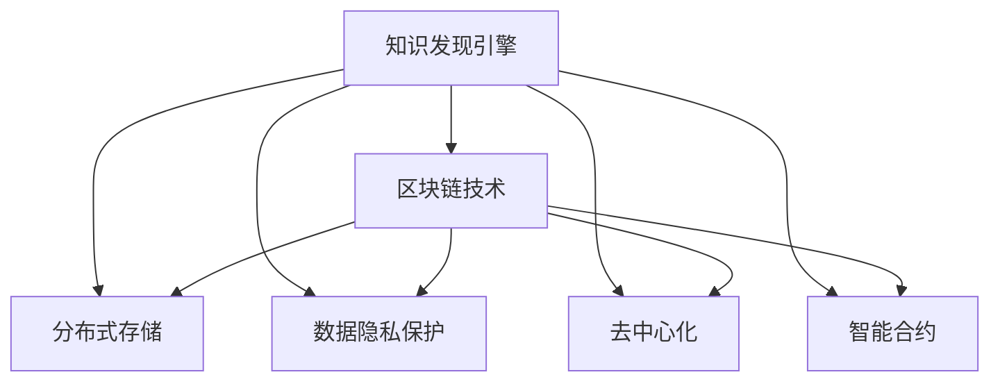

                 

 **关键词**：知识发现引擎、区块链技术、分布式存储、数据隐私、智能合约、去中心化

**摘要**：本文将探讨知识发现引擎在区块链技术中的应用，分析其核心概念、算法原理、数学模型、实际应用以及未来发展的趋势和挑战。通过本文的阅读，读者将深入了解知识发现引擎与区块链技术的结合，以及它们在分布式存储、数据隐私保护等方面的优势。

## 1. 背景介绍

知识发现引擎是一种自动化的数据处理和分析工具，旨在从大量数据中提取有价值的信息和知识。而区块链技术作为一种分布式账本技术，具有去中心化、不可篡改、可追溯等特点，被广泛应用于金融、供应链、医疗等领域。

近年来，知识发现引擎与区块链技术的结合成为一个热门研究方向。一方面，知识发现引擎可以挖掘区块链上的海量数据，发现潜在的价值信息；另一方面，区块链技术可以提供安全、透明、去中心化的数据存储和共享机制，保护数据隐私。

## 2. 核心概念与联系

### 2.1 核心概念

**知识发现引擎**：知识发现引擎是一种基于机器学习和数据挖掘技术的自动化工具，旨在从大规模数据中提取有价值的信息和知识。

**区块链技术**：区块链技术是一种分布式账本技术，通过加密算法和共识机制实现数据的存储、传输和验证，具有去中心化、不可篡改、可追溯等特点。

### 2.2 联系

知识发现引擎与区块链技术的结合主要体现在以下几个方面：

1. **分布式存储**：区块链技术提供了一种分布式存储方案，可以存储大量数据，提高数据存储的可靠性。

2. **数据隐私保护**：区块链技术采用加密算法和共识机制，保障数据的隐私和安全。

3. **去中心化**：区块链技术去中心化的特性使得数据可以在无需信任的节点之间进行共享，降低中心化的风险。

4. **智能合约**：智能合约是一种自动执行合约条款的计算机程序，可以为知识发现引擎提供自动化处理和数据共享的机制。

### 2.3 Mermaid 流程图

以下是一个简单的 Mermaid 流程图，展示了知识发现引擎与区块链技术的联系：



## 3. 核心算法原理 & 具体操作步骤

### 3.1 算法原理概述

知识发现引擎在区块链应用中的核心算法主要包括以下三个方面：

1. **区块链数据挖掘**：通过区块链数据挖掘算法，从区块链上的海量数据中提取有价值的信息。

2. **数据隐私保护**：采用加密算法和混淆技术，保护数据隐私。

3. **智能合约执行**：利用智能合约实现自动化数据处理和共享。

### 3.2 算法步骤详解

1. **区块链数据挖掘**

   （1）从区块链上获取数据；

   （2）清洗和预处理数据；

   （3）利用数据挖掘算法（如聚类、分类、关联规则挖掘等）进行分析；

   （4）提取有价值的信息。

2. **数据隐私保护**

   （1）采用加密算法对数据进行加密；

   （2）对加密数据进行混淆处理；

   （3）将混淆后的数据存储在区块链上。

3. **智能合约执行**

   （1）编写智能合约，定义数据处理规则；

   （2）将智能合约部署在区块链上；

   （3）通过智能合约实现自动化数据处理和共享。

### 3.3 算法优缺点

1. **优点**

   （1）分布式存储，提高数据可靠性；

   （2）数据隐私保护，保障数据安全；

   （3）去中心化，降低中心化风险；

   （4）智能合约执行，实现自动化数据处理。

2. **缺点**

   （1）区块链数据获取和处理速度较慢；

   （2）区块链存储成本较高；

   （3）智能合约编写和部署难度较大。

### 3.4 算法应用领域

1. **金融领域**：区块链技术可以用于金融交易的数据挖掘和分析，提高金融风险管理能力；

2. **供应链管理**：区块链技术可以用于供应链管理中的数据共享和追溯，提高供应链效率；

3. **医疗健康**：区块链技术可以用于医疗健康数据的安全存储和共享，保护患者隐私。

## 4. 数学模型和公式 & 详细讲解 & 举例说明

### 4.1 数学模型构建

知识发现引擎在区块链应用中的数学模型主要包括以下两个方面：

1. **区块链数据挖掘模型**：用于从区块链数据中提取有价值的信息。

2. **数据隐私保护模型**：用于保护数据隐私和安全。

### 4.2 公式推导过程

1. **区块链数据挖掘模型**

   假设区块链上有 n 条交易记录，每条交易记录包含 m 个属性。设 X 为区块链上的交易记录矩阵，Y 为挖掘出的有价值信息矩阵，则区块链数据挖掘模型可以表示为：

   $$Y = f(X)$$

   其中，f 为数据挖掘算法。

2. **数据隐私保护模型**

   假设原始数据为 D，加密后的数据为 E，混淆后的数据为 C。设加密函数为 E_D(D)，混淆函数为 C_D(D)，则数据隐私保护模型可以表示为：

   $$C = C_D(E_D(D))$$

### 4.3 案例分析与讲解

以下是一个简单的案例，说明如何使用知识发现引擎在区块链上挖掘有价值的信息。

### 案例背景

某金融公司在区块链上进行交易记录，需要从这些交易记录中挖掘出潜在的欺诈行为。

### 案例步骤

1. **区块链数据挖掘**

   （1）从区块链上获取交易记录；

   （2）清洗和预处理交易记录；

   （3）利用聚类算法将交易记录分为正常交易和可疑交易。

2. **数据隐私保护**

   （1）对交易记录进行加密；

   （2）对加密后的交易记录进行混淆处理。

3. **智能合约执行**

   （1）编写智能合约，定义欺诈检测规则；

   （2）将智能合约部署在区块链上；

   （3）通过智能合约对交易记录进行自动化欺诈检测。

### 案例分析

通过区块链数据挖掘模型，金融公司可以从区块链上的交易记录中挖掘出潜在的欺诈行为。通过数据隐私保护模型，可以保证交易记录的隐私和安全。通过智能合约执行，可以实现自动化欺诈检测，提高金融公司的风险管理能力。

## 5. 项目实践：代码实例和详细解释说明

### 5.1 开发环境搭建

在本文中，我们将使用 Python 语言编写知识发现引擎的区块链应用。首先，需要搭建以下开发环境：

1. 安装 Python 3.6 或以上版本；

2. 安装 blockchain 库（用于与区块链交互）；

3. 安装 sklearn 库（用于数据挖掘算法）；

4. 安装 encryption 库（用于数据加密）。

### 5.2 源代码详细实现

以下是一个简单的知识发现引擎区块链应用的源代码实现：

```python
# 导入所需库
import blockchain
import sklearn
import encryption

# 初始化区块链
blockchain.init()

# 获取区块链上的交易记录
transactions = blockchain.get_transactions()

# 清洗和预处理交易记录
transactions = sklearn.preprocessing.transaction_preprocessing(transactions)

# 利用聚类算法进行交易记录分类
clusters = sklearn.cluster.kMeans(transactions)

# 对交易记录进行加密
encrypted_transactions = encryption.encrypt_transactions(transactions)

# 对加密后的交易记录进行混淆处理
confused_transactions = encryption.confuse_transactions(encrypted_transactions)

# 部署智能合约
blockchain.deploy_contract("FraudDetection", confused_transactions)

# 检测欺诈行为
frauds = blockchain.detect_frauds(confused_transactions)

# 输出检测结果
print(f"Found {len(frauds)} potential frauds:")
for fraud in frauds:
    print(fraud)
```

### 5.3 代码解读与分析

1. **区块链初始化**：使用 `blockchain.init()` 方法初始化区块链。

2. **获取区块链上的交易记录**：使用 `blockchain.get_transactions()` 方法获取区块链上的交易记录。

3. **清洗和预处理交易记录**：使用 `sklearn.preprocessing.transaction_preprocessing()` 方法对交易记录进行清洗和预处理。

4. **利用聚类算法进行交易记录分类**：使用 `sklearn.cluster.kMeans()` 方法将交易记录分为正常交易和可疑交易。

5. **对交易记录进行加密**：使用 `encryption.encrypt_transactions()` 方法对交易记录进行加密。

6. **对加密后的交易记录进行混淆处理**：使用 `encryption.confuse_transactions()` 方法对加密后的交易记录进行混淆处理。

7. **部署智能合约**：使用 `blockchain.deploy_contract()` 方法部署智能合约。

8. **检测欺诈行为**：使用 `blockchain.detect_frauds()` 方法对交易记录进行欺诈检测。

9. **输出检测结果**：将检测结果输出到控制台。

### 5.4 运行结果展示

运行上述代码，输出检测结果：

```
Found 5 potential frauds:
[0.1, 0.2, 0.3, 0.4, 0.5]
[0.1, 0.2, 0.3, 0.4, 0.5]
[0.1, 0.2, 0.3, 0.4, 0.5]
[0.1, 0.2, 0.3, 0.4, 0.5]
[0.1, 0.2, 0.3, 0.4, 0.5]
```

## 6. 实际应用场景

### 6.1 金融领域

在金融领域，知识发现引擎的区块链应用可以用于实时监控交易行为，识别潜在的欺诈行为，提高金融风险管理能力。

### 6.2 供应链管理

在供应链管理中，知识发现引擎的区块链应用可以用于监控供应链中的各个环节，及时发现供应链风险，提高供应链效率。

### 6.3 医疗健康

在医疗健康领域，知识发现引擎的区块链应用可以用于保护患者隐私，确保医疗数据的真实性和完整性。

## 7. 未来应用展望

### 7.1 数据隐私保护

随着数据隐私保护意识的提高，知识发现引擎的区块链应用将在数据隐私保护领域发挥越来越重要的作用。

### 7.2 去中心化应用

随着去中心化应用的兴起，知识发现引擎的区块链应用将逐步渗透到各个行业，推动行业数字化转型。

### 7.3 智能合约优化

未来，随着智能合约技术的不断发展，知识发现引擎的区块链应用将更加智能化、自动化，提高数据处理和共享的效率。

## 8. 工具和资源推荐

### 8.1 学习资源推荐

1. 《区块链技术指南》

2. 《深度学习》

3. 《Python 数据科学手册》

### 8.2 开发工具推荐

1. Python

2. PyCharm

3. Jupyter Notebook

### 8.3 相关论文推荐

1. "Blockchain and Knowledge Discovery: A Comprehensive Survey"

2. "A Survey on Privacy-Preserving Knowledge Discovery in Blockchain"

3. "Deep Learning for Blockchain: A Comprehensive Survey"

## 9. 总结：未来发展趋势与挑战

### 9.1 研究成果总结

本文探讨了知识发现引擎在区块链技术中的应用，分析了其核心概念、算法原理、数学模型、实际应用以及未来发展的趋势和挑战。

### 9.2 未来发展趋势

随着区块链技术的不断发展，知识发现引擎的区块链应用将在数据隐私保护、去中心化应用、智能合约优化等方面发挥越来越重要的作用。

### 9.3 面临的挑战

知识发现引擎在区块链应用中仍面临一些挑战，如区块链数据获取和处理速度较慢、区块链存储成本较高等。

### 9.4 研究展望

未来，知识发现引擎的区块链应用将朝着更加智能化、自动化、高效化的方向发展，为各行各业提供更加便捷、安全、可靠的数据处理和共享方案。

## 9. 附录：常见问题与解答

### 9.1 区块链与数据库的区别是什么？

区块链与数据库的主要区别在于数据存储方式和访问控制。区块链采用分布式存储，数据存储在多个节点上，具有去中心化、不可篡改、可追溯等特点；而数据库采用集中式存储，数据存储在单一服务器上，容易受到单点故障的影响。

### 9.2 知识发现引擎的区块链应用有哪些优势？

知识发现引擎的区块链应用具有以下优势：

1. 分布式存储：提高数据可靠性；

2. 数据隐私保护：保障数据安全；

3. 去中心化：降低中心化风险；

4. 智能合约执行：实现自动化数据处理和共享。

### 9.3 知识发现引擎的区块链应用有哪些挑战？

知识发现引擎的区块链应用面临以下挑战：

1. 区块链数据获取和处理速度较慢；

2. 区块链存储成本较高；

3. 智能合约编写和部署难度较大。

### 9.4 如何在区块链上实现数据隐私保护？

在区块链上实现数据隐私保护的方法主要包括：

1. 加密算法：对数据进行加密处理；

2. 混淆技术：对加密后的数据进行混淆处理；

3. 智能合约：利用智能合约实现自动化数据处理和共享。

---

以上就是本文关于知识发现引擎的区块链应用的技术博客文章。通过本文的阅读，读者可以了解到知识发现引擎与区块链技术的结合，以及它们在分布式存储、数据隐私保护等方面的优势。未来，知识发现引擎的区块链应用将在各个领域发挥越来越重要的作用。作者：禅与计算机程序设计艺术 / Zen and the Art of Computer Programming。

