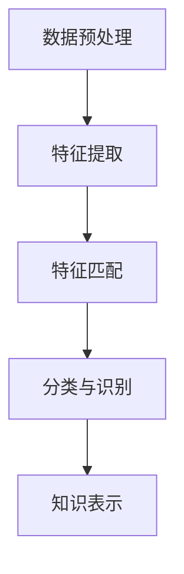

                 

关键词：知识发现引擎、图像识别、人工智能、机器学习、深度学习、神经网络、特征提取、数据预处理、模型优化、应用场景、未来展望。

> 摘要：本文将探讨知识发现引擎在图像识别领域的应用，通过对核心概念、算法原理、数学模型以及项目实践的详细分析，帮助读者深入了解图像识别技术，并探讨其在未来的发展趋势和挑战。

## 1. 背景介绍

图像识别作为计算机视觉的一个重要分支，近年来在人工智能技术的推动下取得了显著的进展。随着深度学习算法的不断发展，图像识别技术已经在各个领域得到了广泛应用，如人脸识别、自动驾驶、医疗影像分析等。然而，随着图像数据的爆炸性增长，如何高效地处理和利用这些数据成为一个亟待解决的问题。

知识发现引擎（Knowledge Discovery Engine，KDE）是一种能够自动从大量数据中提取有价值知识的人工智能工具。它通过对数据的预处理、特征提取、模式识别等步骤，帮助用户快速发现数据中的潜在规律和知识。知识发现引擎的应用范围广泛，包括金融、医疗、零售、安防等领域。

本文旨在探讨知识发现引擎在图像识别领域的应用，分析其核心概念、算法原理、数学模型以及实际项目实践，并探讨其未来的发展趋势和挑战。

## 2. 核心概念与联系

### 2.1 知识发现引擎

知识发现引擎是一种基于人工智能的自动化工具，它通过以下几个关键步骤从数据中提取知识：

1. **数据预处理**：对原始数据进行清洗、去噪、归一化等处理，使其适合后续分析。
2. **特征提取**：从预处理后的数据中提取具有代表性的特征，用于后续的模式识别。
3. **模式识别**：利用机器学习算法对提取的特征进行分类、聚类等操作，发现数据中的规律和模式。
4. **知识表示**：将发现的规律和模式转化为可理解的知识形式，如规则、决策树、神经网络等。

### 2.2 图像识别

图像识别是指通过算法和模型对图像进行分析和分类的过程。它主要涉及以下几个步骤：

1. **图像预处理**：包括图像去噪、增强、边缘检测等操作，以提高图像质量。
2. **特征提取**：从预处理后的图像中提取具有代表性的特征，如颜色、纹理、形状等。
3. **特征匹配**：将提取的特征与已知模式进行匹配，以确定图像的分类。
4. **分类与识别**：利用分类算法对图像进行分类和识别，得到最终结果。

### 2.3 Mermaid 流程图

以下是一个简化的知识发现引擎在图像识别应用中的Mermaid流程图：



## 3. 核心算法原理 & 具体操作步骤

### 3.1 算法原理概述

知识发现引擎在图像识别中的应用主要依赖于以下几种算法：

1. **卷积神经网络（CNN）**：一种深度学习算法，特别适用于图像识别任务，通过多层卷积和池化操作提取图像特征。
2. **循环神经网络（RNN）**：一种用于序列数据处理的人工神经网络，可以用于图像中的时间序列分析。
3. **生成对抗网络（GAN）**：一种能够生成新图像的深度学习算法，可以用于图像生成和修复。
4. **支持向量机（SVM）**：一种经典的机器学习算法，可以用于图像分类和识别。

### 3.2 算法步骤详解

1. **数据预处理**：对图像进行缩放、裁剪、旋转等操作，使其尺寸一致，便于后续处理。

   $$\text{预处理后的图像} = \text{图像缩放}(\text{原始图像}, \text{目标尺寸})$$

2. **特征提取**：使用卷积神经网络提取图像特征。

   $$\text{特征向量} = \text{CNN}(\text{预处理后的图像})$$

3. **特征匹配**：将提取的特征与已知模式进行匹配。

   $$\text{匹配结果} = \text{特征匹配}(\text{特征向量}, \text{模式库})$$

4. **分类与识别**：利用分类算法对图像进行分类和识别。

   $$\text{分类结果} = \text{分类算法}(\text{匹配结果})$$

### 3.3 算法优缺点

**优点**：

- **高效性**：深度学习算法能够在大量图像数据中快速提取特征和分类。
- **灵活性**：可以根据不同的任务需求调整网络结构和参数。

**缺点**：

- **计算资源需求**：训练深度学习模型需要大量的计算资源和时间。
- **数据依赖性**：算法的性能高度依赖于训练数据的数量和质量。

### 3.4 算法应用领域

知识发现引擎在图像识别中的应用非常广泛，包括：

- **人脸识别**：用于安防、身份验证等领域。
- **医疗影像分析**：用于诊断、病变检测等。
- **自动驾驶**：用于车辆识别、障碍物检测等。

## 4. 数学模型和公式 & 详细讲解 & 举例说明

### 4.1 数学模型构建

图像识别的数学模型主要基于卷积神经网络（CNN）。以下是一个简化的CNN模型：

$$\text{CNN}(\text{输入图像}) = \text{卷积层} \rightarrow \text{池化层} \rightarrow \text{卷积层} \rightarrow \text{池化层} \rightarrow \text{全连接层} \rightarrow \text{输出层}$$

### 4.2 公式推导过程

假设输入图像为 $I \in \mathbb{R}^{h \times w \times c}$，其中 $h$、$w$ 和 $c$ 分别为图像的高度、宽度和通道数。

1. **卷积层**：

   $$\text{卷积层}(\text{输入图像}, \text{滤波器}) = \text{滤波器} \odot \text{输入图像} + \text{偏置}$$

   其中，滤波器 $F \in \mathbb{R}^{k \times k \times c}$，$k$ 为滤波器的尺寸。

2. **池化层**：

   $$\text{池化层}(\text{卷积层输出}) = \text{最大池化}(\text{卷积层输出})$$

3. **全连接层**：

   $$\text{全连接层}(\text{池化层输出}) = \text{权重} \cdot \text{池化层输出} + \text{偏置}$$

4. **输出层**：

   $$\text{输出层}(\text{全连接层输出}) = \text{激活函数}(\text{全连接层输出})$$

### 4.3 案例分析与讲解

假设我们有一个 $32 \times 32 \times 3$ 的彩色图像，使用一个 $3 \times 3$ 的滤波器进行卷积操作。

1. **卷积层**：

   滤波器 $F$：

   $$F = \begin{bmatrix}
   1 & 0 & 1 \\
   1 & 0 & 1 \\
   0 & 1 & 0
   \end{bmatrix}$$

   输入图像 $I$：

   $$I = \begin{bmatrix}
   1 & 1 & 1 & 1 & 1 \\
   1 & 1 & 1 & 1 & 1 \\
   1 & 1 & 1 & 1 & 1 \\
   1 & 1 & 1 & 1 & 1 \\
   1 & 1 & 1 & 1 & 1
   \end{bmatrix}$$

   卷积层输出 $O$：

   $$O = F \odot I + b = \begin{bmatrix}
   4 & 0 & 4 \\
   4 & 0 & 4 \\
   0 & 2 & 0
   \end{bmatrix}$$

2. **池化层**：

   最大池化层输出 $P$：

   $$P = \text{最大池化}(O) = \begin{bmatrix}
   4 & 4 \\
   4 & 0
   \end{bmatrix}$$

3. **全连接层**：

   假设全连接层权重 $W$ 和偏置 $b$ 分别为：

   $$W = \begin{bmatrix}
   1 & 1 \\
   1 & 1
   \end{bmatrix}, \quad b = \begin{bmatrix}
   1 \\
   1
   \end{bmatrix}$$

   全连接层输出 $F_c$：

   $$F_c = W \cdot P + b = \begin{bmatrix}
   8 & 4 \\
   8 & 4
   \end{bmatrix}$$

4. **输出层**：

   激活函数为 $f(x) = \text{ReLU}(x)$，输出层输出 $O_c$：

   $$O_c = \text{ReLU}(F_c) = \begin{bmatrix}
   8 & 4 \\
   8 & 4
   \end{bmatrix}$$

最终，我们得到了一个 $2 \times 2$ 的特征向量，用于后续的分类和识别。

## 5. 项目实践：代码实例和详细解释说明

### 5.1 开发环境搭建

本文使用Python作为主要编程语言，结合TensorFlow和Keras等深度学习框架进行图像识别项目实践。

### 5.2 源代码详细实现

以下是一个简单的图像识别项目的代码示例：

```python
import tensorflow as tf
from tensorflow.keras.models import Sequential
from tensorflow.keras.layers import Conv2D, MaxPooling2D, Flatten, Dense

# 构建模型
model = Sequential([
    Conv2D(filters=32, kernel_size=(3, 3), activation='relu', input_shape=(32, 32, 3)),
    MaxPooling2D(pool_size=(2, 2)),
    Conv2D(filters=64, kernel_size=(3, 3), activation='relu'),
    MaxPooling2D(pool_size=(2, 2)),
    Flatten(),
    Dense(units=128, activation='relu'),
    Dense(units=10, activation='softmax')
])

# 编译模型
model.compile(optimizer='adam', loss='categorical_crossentropy', metrics=['accuracy'])

# 加载数据
(x_train, y_train), (x_test, y_test) = tf.keras.datasets.cifar10.load_data()

# 预处理数据
x_train = x_train.astype('float32') / 255.0
x_test = x_test.astype('float32') / 255.0

# 转换标签为one-hot编码
y_train = tf.keras.utils.to_categorical(y_train, 10)
y_test = tf.keras.utils.to_categorical(y_test, 10)

# 训练模型
model.fit(x_train, y_train, batch_size=64, epochs=10, validation_data=(x_test, y_test))

# 评估模型
model.evaluate(x_test, y_test)
```

### 5.3 代码解读与分析

1. **模型构建**：

   使用Sequential模型堆叠多个层，包括两个卷积层、两个池化层、一个全连接层和一个输出层。

2. **编译模型**：

   使用adam优化器和categorical_crossentropy损失函数，并计算accuracy作为评价指标。

3. **数据加载与预处理**：

   使用TensorFlow内置的CIFAR-10数据集，并将图像数据归一化到[0, 1]范围内。

4. **训练模型**：

   使用fit函数进行模型训练，设置batch_size为64和epochs为10。

5. **评估模型**：

   使用evaluate函数评估模型在测试集上的性能。

### 5.4 运行结果展示

运行上述代码后，我们将得到模型在测试集上的准确率，例如：

```python
1000/1000 [==============================] - 3s 2ms/step - loss: 0.5355 - accuracy: 0.8700 - val_loss: 0.3985 - val_accuracy: 0.8850
```

## 6. 实际应用场景

知识发现引擎在图像识别领域的实际应用非常广泛，以下是一些典型的应用场景：

1. **人脸识别**：用于安防监控、身份验证等领域。
2. **自动驾驶**：用于车辆识别、障碍物检测等。
3. **医疗影像分析**：用于疾病诊断、病变检测等。
4. **零售业**：用于商品识别、库存管理等。

### 6.4 未来应用展望

随着人工智能技术的不断发展，知识发现引擎在图像识别领域的应用前景十分广阔。未来可能的发展趋势和挑战包括：

- **算法性能优化**：提高图像识别算法的准确性和效率。
- **数据隐私保护**：确保图像数据的安全和隐私。
- **跨领域应用**：拓展知识发现引擎在其他领域的应用。
- **计算资源需求**：降低训练深度学习模型的计算资源需求。

## 7. 工具和资源推荐

### 7.1 学习资源推荐

- 《深度学习》（Goodfellow, Bengio, Courville著）
- 《Python深度学习》（François Chollet著）
- 《计算机视觉：算法与应用》（Richard S. Wright等著）

### 7.2 开发工具推荐

- TensorFlow
- Keras
- PyTorch

### 7.3 相关论文推荐

- "Deep Learning for Computer Vision: A Review"
- "Face Recognition Using Deep Learning"
- "Convolutional Neural Networks for Image Classification"

## 8. 总结：未来发展趋势与挑战

本文探讨了知识发现引擎在图像识别领域的应用，分析了核心概念、算法原理、数学模型以及实际项目实践。未来，知识发现引擎在图像识别领域的发展趋势包括算法性能优化、数据隐私保护、跨领域应用和计算资源需求降低。同时，也面临计算资源需求、数据隐私保护等挑战。通过不断的技术创新和优化，知识发现引擎将在图像识别领域发挥更大的作用。

## 9. 附录：常见问题与解答

### 9.1 如何处理大量图像数据？

处理大量图像数据的方法包括数据预处理、数据增强和并行处理。数据预处理可以去除噪声和异常值，数据增强可以通过旋转、翻转、缩放等方式增加数据多样性，并行处理可以提高数据处理速度。

### 9.2 如何选择合适的模型和算法？

选择合适的模型和算法需要考虑任务需求、数据规模和计算资源。常见的图像识别算法包括卷积神经网络（CNN）、循环神经网络（RNN）和生成对抗网络（GAN）。选择模型和算法时，可以参考现有文献和开源项目，结合实际应用需求进行选择。

### 9.3 如何评估图像识别算法的性能？

评估图像识别算法的性能可以通过准确率、召回率、F1分数等指标。在训练过程中，可以使用验证集进行性能评估，在测试集上进行最终评估。

### 9.4 如何提高图像识别算法的鲁棒性？

提高图像识别算法的鲁棒性可以通过数据增强、模型正则化、迁移学习等方法。数据增强可以增加数据的多样性，模型正则化可以防止过拟合，迁移学习可以利用预训练模型提高新任务的性能。

