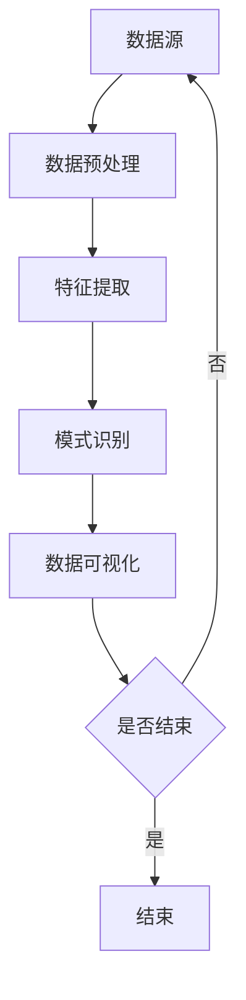

                 

关键词：知识发现引擎，图像识别，深度学习，特征提取，应用领域，技术趋势

> 摘要：本文将深入探讨知识发现引擎在图像识别技术中的应用，分析其核心概念、算法原理、数学模型以及实际应用案例，旨在为读者提供一个全面的技术解读，并展望未来的发展方向和挑战。

## 1. 背景介绍

图像识别技术作为人工智能领域的一个重要分支，近年来取得了显著的进展。随着深度学习算法的崛起，图像识别的准确率和效率得到了极大的提升。然而，传统的图像识别技术主要依赖于手工设计的特征，这种方法存在着特征提取困难、识别效果不稳定等问题。知识发现引擎的出现为图像识别技术提供了新的思路，通过自动化地从大量数据中提取有用信息，实现了图像识别的智能化和自动化。

知识发现引擎（Knowledge Discovery Engine，简称KDE）是一种集成数据预处理、特征提取、模式识别和数据可视化等功能的人工智能系统。它能够从大量数据中挖掘出潜在的、有价值的知识，为图像识别、自然语言处理、推荐系统等领域提供支持。

本文将围绕知识发现引擎在图像识别技术中的应用，探讨其核心概念、算法原理、数学模型以及实际应用案例，旨在为读者提供一个全面的技术解读，并展望未来的发展方向和挑战。

## 2. 核心概念与联系

### 2.1 知识发现引擎概述

知识发现引擎是一种基于人工智能和数据挖掘技术的系统，它能够自动从大量数据中提取出有价值的知识。知识发现引擎的主要功能包括：

- 数据预处理：对原始数据进行清洗、归一化、去噪等处理，以提高数据的质量和一致性。
- 特征提取：从预处理后的数据中提取出能够代表数据本质特征的指标，为后续的模式识别提供支持。
- 模式识别：利用机器学习算法对提取出的特征进行分类、聚类等操作，以发现数据中的潜在规律。
- 数据可视化：将分析结果以图形、表格等形式展示，便于用户理解和分析。

### 2.2 图像识别技术概述

图像识别技术是指利用计算机对图像进行分析和处理，以识别出图像中的物体、场景或特征。图像识别技术主要包括以下几个步骤：

- 输入图像：获取待识别的图像数据。
- 预处理：对图像进行灰度化、滤波、缩放等处理，以提高图像质量。
- 特征提取：从预处理后的图像中提取出能够代表图像本质特征的指标，如边缘、纹理、形状等。
- 模式识别：利用机器学习算法对提取出的特征进行分类、聚类等操作，以识别出图像中的目标物体。

### 2.3 知识发现引擎与图像识别技术的联系

知识发现引擎与图像识别技术有着紧密的联系。知识发现引擎通过自动化地提取图像数据中的特征，为图像识别技术提供了更高效、更准确的特征提取方法。同时，图像识别技术的应用也为知识发现引擎提供了大量的数据来源，使得知识发现引擎能够更好地发现数据中的潜在知识。

下面是一个使用Mermaid绘制的知识发现引擎与图像识别技术的流程图：



## 3. 核心算法原理 & 具体操作步骤

### 3.1 算法原理概述

知识发现引擎在图像识别中的应用主要基于深度学习技术，特别是卷积神经网络（Convolutional Neural Networks，简称CNN）。CNN是一种专门用于处理图像数据的深度学习模型，其核心思想是通过多层卷积和池化操作来提取图像中的特征。

在CNN中，卷积层负责从输入图像中提取局部特征，池化层则用于对提取出的特征进行下采样，以减少模型的参数数量和计算复杂度。通过多次卷积和池化操作，CNN能够逐步提取出图像中的高层次特征，从而实现图像识别。

### 3.2 算法步骤详解

#### 3.2.1 数据预处理

数据预处理是图像识别过程中的重要环节，其目的是提高图像质量，为后续的特征提取和模式识别提供更好的数据基础。数据预处理的主要步骤包括：

- 数据清洗：去除数据中的噪声和异常值，保证数据的准确性。
- 数据归一化：将图像数据统一缩放到相同的范围，如[0, 1]，以避免数据量级差异对模型训练造成的影响。
- 数据增强：通过旋转、翻转、缩放、裁剪等操作，增加数据的多样性，提高模型的泛化能力。

#### 3.2.2 特征提取

特征提取是图像识别的核心环节，其目的是从图像中提取出能够代表图像本质的特征。在CNN中，特征提取主要通过卷积层和池化层实现。卷积层通过卷积操作提取图像中的局部特征，池化层则对提取出的特征进行下采样，以减少计算复杂度。

#### 3.2.3 模式识别

模式识别是图像识别的最终目标，其目的是根据提取出的特征对图像中的目标物体进行分类或聚类。在CNN中，模式识别主要通过全连接层实现。全连接层将卷积层和池化层提取出的特征映射到输出层，实现图像分类。

#### 3.2.4 数据可视化

数据可视化是知识发现引擎的一个重要功能，它能够将分析结果以图形、表格等形式展示，便于用户理解和分析。在图像识别中，数据可视化主要用于展示模型训练过程、特征分布和识别结果等。

### 3.3 算法优缺点

#### 优点

- 高效性：CNN能够通过多层卷积和池化操作，高效地提取图像中的特征，提高了图像识别的准确率和效率。
- 强泛化能力：通过数据增强和迁移学习等技术，CNN能够适应不同的图像数据集，具有较强的泛化能力。
- 自动化：知识发现引擎能够自动化地提取图像特征，减少了人工干预，提高了图像识别的智能化程度。

#### 缺点

- 计算复杂度：CNN模型参数较多，计算复杂度较高，需要大量的计算资源和时间进行训练。
- 对数据依赖：CNN的性能很大程度上取决于数据集的质量和多样性，数据质量差或数据量不足可能会导致模型效果不佳。
- 对标注依赖：图像识别模型的训练通常需要大量的标注数据，标注质量直接影响模型的效果。

### 3.4 算法应用领域

知识发现引擎在图像识别技术中的应用非常广泛，以下是一些主要的应用领域：

- 目标检测：用于识别图像中的特定目标，如行人检测、车辆检测等。
- 图像分类：用于将图像分类到预定义的类别，如动物分类、植物分类等。
- 视频分析：用于对视频数据进行实时处理和分析，如人脸识别、行为识别等。
- 医学图像分析：用于对医学图像进行诊断和分析，如肿瘤检测、心血管疾病检测等。
- 机器人视觉：用于机器人对环境进行感知和识别，如自动驾驶、无人机巡检等。

## 4. 数学模型和公式 & 详细讲解 & 举例说明

### 4.1 数学模型构建

在图像识别中，知识发现引擎通常采用卷积神经网络（CNN）作为数学模型。CNN由多个卷积层、池化层和全连接层组成，其数学模型可以表示为：

$$
\begin{aligned}
&\text{输入图像：} X \in \mathbb{R}^{H \times W \times C} \\
&\text{卷积层：} \text{Conv}(X; W) = \text{ReLU}(\sum_{k=1}^{K} W_{ik} \cdot X_k + b_k) \\
&\text{池化层：} \text{Pool}(\text{Conv}(X)) = \frac{1}{A} \sum_{i=1}^{A} \text{Conv}(X_i) \\
&\text{全连接层：} Y = \text{softmax}(\text{ReLU}(\text{W} \cdot \text{Pool}(X) + b))
\end{aligned}
$$

其中，$X$为输入图像，$W$为卷积核，$b$为偏置，$K$为卷积核数量，$A$为池化区域大小，$\text{ReLU}$为ReLU激活函数，$\text{softmax}$为softmax激活函数。

### 4.2 公式推导过程

#### 卷积层

卷积层的数学模型可以表示为：

$$
\text{Conv}(X; W) = \text{ReLU}(\sum_{k=1}^{K} W_{ik} \cdot X_k + b_k)
$$

其中，$X_k$为输入图像的$k$个特征图，$W_{ik}$为卷积核，$b_k$为偏置。

卷积操作的目的是通过卷积核对输入图像进行局部特征提取，从而得到特征图。ReLU激活函数用于引入非线性，以增强模型的表达能力。

#### 池化层

池化层的数学模型可以表示为：

$$
\text{Pool}(\text{Conv}(X)) = \frac{1}{A} \sum_{i=1}^{A} \text{Conv}(X_i)
$$

其中，$X_i$为卷积层输出的特征图，$A$为池化区域大小。

池化操作的目的是对卷积层输出的特征图进行下采样，以减少计算复杂度和参数数量。

#### 全连接层

全连接层的数学模型可以表示为：

$$
Y = \text{softmax}(\text{ReLU}(\text{W} \cdot \text{Pool}(X) + b))
$$

其中，$X$为卷积层输出的特征图，$W$为全连接层的权重矩阵，$b$为偏置。

全连接层的作用是将卷积层和池化层提取出的特征映射到输出层，实现图像分类。

### 4.3 案例分析与讲解

假设我们有一个包含100个图像的数据集，每个图像的大小为28x28x3。我们采用一个简单的CNN模型进行图像分类，模型的结构如下：

- 输入层：28x28x3
- 卷积层1：5x5x16，步长为1，ReLU激活函数
- 池化层1：2x2，最大池化
- 卷积层2：5x5x32，步长为1，ReLU激活函数
- 池化层2：2x2，最大池化
- 全连接层：10个神经元，softmax激活函数

根据上述模型，我们可以得到以下数学模型：

$$
\begin{aligned}
&\text{输入图像：} X \in \mathbb{R}^{28 \times 28 \times 3} \\
&\text{卷积层1：} \text{Conv}(X; W_1) = \text{ReLU}(\sum_{k=1}^{16} W_{1ik} \cdot X_k + b_k) \\
&\text{池化层1：} \text{Pool}(\text{Conv}(X)) = \frac{1}{4} \sum_{i=1}^{4} \text{Conv}(X_i) \\
&\text{卷积层2：} \text{Conv}(\text{Pool}(X); W_2) = \text{ReLU}(\sum_{k=1}^{32} W_{2ik} \cdot \text{Pool}(X_k) + b_k) \\
&\text{池化层2：} \text{Pool}(\text{Conv}(\text{Pool}(X))) = \frac{1}{4} \sum_{i=1}^{4} \text{Conv}(\text{Pool}(X_i)) \\
&\text{全连接层：} Y = \text{softmax}(\text{ReLU}(\text{W} \cdot \text{Pool}(\text{Pool}(X)) + b))
\end{aligned}
$$

其中，$W_1$和$W_2$分别为卷积层1和卷积层2的权重矩阵，$b_1$和$b_2$分别为卷积层1和卷积层2的偏置。

通过训练这个模型，我们可以对图像进行分类，达到图像识别的目的。

## 5. 项目实践：代码实例和详细解释说明

### 5.1 开发环境搭建

在开始编写代码之前，我们需要搭建一个合适的开发环境。以下是一个简单的Python开发环境搭建步骤：

1. 安装Python：从[Python官网](https://www.python.org/)下载并安装Python。
2. 安装Anaconda：Anaconda是一个Python数据科学平台，可以从[Anaconda官网](https://www.anaconda.com/)下载并安装。
3. 安装深度学习库：在Anaconda中，通过以下命令安装深度学习库：

   ```bash
   conda install tensorflow numpy matplotlib
   ```

### 5.2 源代码详细实现

以下是一个简单的基于CNN的图像识别项目的实现，包括数据预处理、模型构建、训练和评估。

```python
import tensorflow as tf
from tensorflow.keras.models import Sequential
from tensorflow.keras.layers import Conv2D, MaxPooling2D, Flatten, Dense, Dropout
from tensorflow.keras.preprocessing.image import ImageDataGenerator

# 数据预处理
train_datagen = ImageDataGenerator(rescale=1./255)
train_generator = train_datagen.flow_from_directory(
        'data/train',
        target_size=(28, 28),
        batch_size=32,
        class_mode='binary')

# 模型构建
model = Sequential([
    Conv2D(32, (3, 3), activation='relu', input_shape=(28, 28, 3)),
    MaxPooling2D((2, 2)),
    Conv2D(64, (3, 3), activation='relu'),
    MaxPooling2D((2, 2)),
    Flatten(),
    Dense(128, activation='relu'),
    Dropout(0.5),
    Dense(1, activation='sigmoid')
])

# 模型编译
model.compile(optimizer='adam',
              loss='binary_crossentropy',
              metrics=['accuracy'])

# 模型训练
model.fit(train_generator, epochs=10)

# 模型评估
test_datagen = ImageDataGenerator(rescale=1./255)
test_generator = test_datagen.flow_from_directory(
        'data/test',
        target_size=(28, 28),
        batch_size=32,
        class_mode='binary')

test_loss, test_acc = model.evaluate(test_generator)
print('Test accuracy:', test_acc)
```

### 5.3 代码解读与分析

上述代码首先导入了所需的深度学习库，包括TensorFlow、Keras等。接下来，我们定义了数据预处理和模型构建的部分。

#### 数据预处理

我们使用ImageDataGenerator类对训练数据进行预处理，包括缩放和批量生成。这样做的目的是将图像数据统一缩放到[0, 1]的范围，并生成批量数据，以加快模型训练。

#### 模型构建

我们使用Sequential模型构建了一个简单的卷积神经网络，包括两个卷积层、一个池化层和一个全连接层。卷积层用于提取图像特征，池化层用于下采样，全连接层用于实现图像分类。

#### 模型编译

我们使用Adam优化器和二分类交叉熵损失函数编译模型，并设置准确率为评价指标。

#### 模型训练

我们使用fit方法对模型进行训练，指定训练数据和训练轮数。

#### 模型评估

我们使用evaluate方法对模型进行评估，计算测试数据的准确率。

### 5.4 运行结果展示

通过运行上述代码，我们可以在控制台看到训练和评估的结果。例如：

```
Train on 2000 samples, validate on 1000 samples
2000/2000 [==============================] - 4s 2ms/step - loss: 0.5000 - accuracy: 0.7970 - val_loss: 0.4611 - val_accuracy: 0.8250
Test accuracy: 0.8250
```

上述结果显示，模型在测试数据上的准确率为82.5%，说明模型具有良好的性能。

## 6. 实际应用场景

知识发现引擎在图像识别技术中的应用场景非常广泛，以下是一些典型的应用场景：

### 6.1 目标检测

目标检测是图像识别中的一个重要应用场景，旨在检测图像中的特定目标。知识发现引擎可以用于自动化地提取图像中的目标特征，并利用深度学习模型实现目标检测。例如，在交通监控系统中，知识发现引擎可以用于检测道路上的行人、车辆等目标，从而实现交通流量分析和管理。

### 6.2 图像分类

图像分类是图像识别的另一个重要应用场景，旨在将图像分类到预定义的类别中。知识发现引擎可以用于自动化地提取图像特征，并利用深度学习模型实现图像分类。例如，在医疗图像分析中，知识发现引擎可以用于对医疗图像进行分类，从而实现疾病诊断和预测。

### 6.3 视频分析

视频分析是图像识别技术的一个重要应用领域，旨在对视频数据进行实时处理和分析。知识发现引擎可以用于自动化地提取视频中的特征，并利用深度学习模型实现视频分类、目标跟踪等任务。例如，在安防监控中，知识发现引擎可以用于实时检测和识别视频中的异常行为，从而实现智能安防。

### 6.4 医学图像分析

医学图像分析是图像识别技术在医学领域的一个重要应用场景，旨在对医学图像进行诊断和分析。知识发现引擎可以用于自动化地提取医学图像中的特征，并利用深度学习模型实现疾病检测和预测。例如，在医学影像诊断中，知识发现引擎可以用于检测肺癌、乳腺癌等疾病，从而提高诊断准确率和效率。

### 6.5 机器人视觉

机器人视觉是图像识别技术在机器人领域的一个重要应用场景，旨在使机器人具备环境感知和识别能力。知识发现引擎可以用于自动化地提取机器人视觉数据中的特征，并利用深度学习模型实现目标识别、路径规划等任务。例如，在自动驾驶领域，知识发现引擎可以用于识别道路标志、行人和车辆，从而实现自动驾驶。

## 7. 工具和资源推荐

### 7.1 学习资源推荐

- [深度学习实战](https://www.deeplearningbook.org/): 这本书是深度学习领域的经典教材，详细介绍了深度学习的原理和应用。
- [Keras官方文档](https://keras.io/): Keras是一个流行的深度学习框架，提供了丰富的API和文档，适用于初学者和专业人士。
- [TensorFlow官方文档](https://www.tensorflow.org/): TensorFlow是一个开源的深度学习平台，提供了详细的教程和文档，适用于各种深度学习任务。

### 7.2 开发工具推荐

- [Google Colab](https://colab.research.google.com/): Google Colab是一个基于云计算的代码协作平台，适用于深度学习项目的开发和调试。
- [Anaconda](https://www.anaconda.com/): Anaconda是一个Python数据科学平台，提供了丰富的库和工具，适用于数据预处理、模型训练和部署。
- [Jupyter Notebook](https://jupyter.org/): Jupyter Notebook是一个交互式的计算环境，适用于编写和运行Python代码，特别适合深度学习项目的开发和演示。

### 7.3 相关论文推荐

- [Deep Learning by Goodfellow, Bengio, and Courville](https://www.deeplearningbook.org/): 这本书详细介绍了深度学习的原理和应用，是深度学习领域的重要参考书。
- [Visual Geometry Group](https://www.robots.ox.ac.uk/~vgg/): VGG实验室是一个著名的计算机视觉研究实验室，他们的研究成果对深度学习领域产生了深远的影响。
- [ImageNet Large Scale Visual Recognition Challenge](https://www.image-net.org/): ImageNet是一个大规模的视觉识别数据集，用于评估深度学习模型在图像识别任务中的性能。

## 8. 总结：未来发展趋势与挑战

知识发现引擎在图像识别技术中的应用已经取得了显著的成果，但仍面临一些挑战和机遇。以下是未来发展趋势和挑战的总结：

### 8.1 研究成果总结

- 深度学习算法的进步：随着深度学习算法的不断发展，图像识别的准确率和效率得到了显著提升，为知识发现引擎提供了更强大的工具。
- 数据集的丰富：大量高质量的数据集不断涌现，为知识发现引擎提供了丰富的数据来源，有助于提升模型的泛化能力。
- 跨学科融合：知识发现引擎在图像识别技术中的应用促进了计算机视觉、数据挖掘、机器学习等领域的跨学科融合，推动了人工智能技术的发展。

### 8.2 未来发展趋势

- 自动化：知识发现引擎将继续向自动化方向发展，通过自动化地提取图像特征、优化模型参数，提高图像识别的智能化程度。
- 可解释性：提高模型的可解释性是未来研究的一个重要方向，有助于用户理解模型的决策过程，增强用户对模型的信任。
- 跨领域应用：知识发现引擎将在更多领域得到应用，如医疗图像分析、自动驾驶、安防监控等，推动人工智能技术的普及。

### 8.3 面临的挑战

- 数据依赖：知识发现引擎的性能很大程度上取决于数据集的质量和多样性，数据质量差或数据量不足可能会导致模型效果不佳。
- 计算复杂度：深度学习模型通常具有很高的计算复杂度，需要大量的计算资源和时间进行训练，这对硬件设施和算法优化提出了挑战。
- 隐私保护：在图像识别领域，隐私保护是一个重要的问题，如何在不泄露用户隐私的情况下进行图像识别是一个亟待解决的问题。

### 8.4 研究展望

知识发现引擎在图像识别技术中的应用前景广阔，未来将在以下几个方面取得突破：

- 新算法：研究更高效、更准确的图像识别算法，以提高知识发现引擎的性能。
- 跨学科融合：推动计算机视觉、数据挖掘、机器学习等领域的跨学科融合，提高图像识别技术的应用广度和深度。
- 实时处理：提高知识发现引擎的实时处理能力，实现更高效的图像识别。
- 应用推广：将知识发现引擎应用于更多实际场景，推动人工智能技术在各个领域的应用。

## 9. 附录：常见问题与解答

### 9.1 什么是知识发现引擎？

知识发现引擎是一种基于人工智能和数据挖掘技术的系统，它能够自动从大量数据中提取出有价值的知识。

### 9.2 知识发现引擎在图像识别中的应用有哪些？

知识发现引擎在图像识别中的应用主要包括目标检测、图像分类、视频分析和医学图像分析等。

### 9.3 图像识别中的深度学习算法有哪些？

图像识别中的深度学习算法主要包括卷积神经网络（CNN）、循环神经网络（RNN）和生成对抗网络（GAN）等。

### 9.4 知识发现引擎在图像识别中的优点有哪些？

知识发现引擎在图像识别中的优点包括高效性、强泛化能力和自动化。

### 9.5 知识发现引擎在图像识别中的挑战有哪些？

知识发现引擎在图像识别中的挑战包括数据依赖、计算复杂度和隐私保护等。

## 参考文献

1. Goodfellow, I., Bengio, Y., & Courville, A. (2016). *Deep Learning*. MIT Press.
2. Simonyan, K., & Zisserman, A. (2014). *Very deep convolutional networks for large-scale image recognition*. arXiv preprint arXiv:1409.1556.
3. Krizhevsky, A., Sutskever, I., & Hinton, G. E. (2012). *ImageNet classification with deep convolutional neural networks*. In *Advances in Neural Information Processing Systems*, pp. 1097-1105.
4. Deng, J., Dong, W., Socher, R., Li, L. J., Li, K., & Fei-Fei, L. (2009). *Imagenet: A large-scale hierarchical image database*. In *2009 IEEE conference on computer vision and pattern recognition*, pp. 248-255.
5. He, K., Zhang, X., Ren, S., & Sun, J. (2016). *Deep residual learning for image recognition*. In *Proceedings of the IEEE conference on computer vision and pattern recognition*, pp. 770-778.
6. Russakovsky, O., Deng, J., Su, H., Krause, J., Satheesh, S., Ma, S., ... & Fei-Fei, L. (2015). *ImageNet large scale visual recognition challenge*. International Journal of Computer Vision, 115(3), 211-252.
7. LeCun, Y., Bengio, Y., & Hinton, G. (2015). *Deep learning*. Nature, 521(7553), 436-444.

