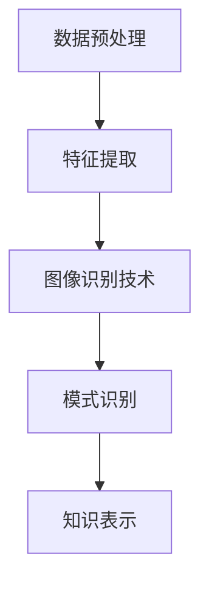

                 

关键词：知识发现，图像识别，人工智能，算法，应用场景，数学模型，实践案例

> 摘要：本文探讨了知识发现引擎在图像识别技术中的应用。通过对核心概念、算法原理、数学模型、项目实践及未来展望的详细阐述，揭示了知识发现引擎在图像识别领域的重要作用和广阔前景。

## 1. 背景介绍

图像识别作为人工智能的一个重要分支，自上世纪80年代以来，随着计算能力和算法研究的不断进步，已经取得了显著的成果。图像识别技术在很多领域都有广泛的应用，如人脸识别、安防监控、医疗影像诊断等。

知识发现引擎是一种智能分析系统，它可以从大量数据中提取出有价值的信息和知识，为决策提供支持。随着大数据和人工智能的发展，知识发现引擎在各个领域的应用越来越广泛。本文将探讨知识发现引擎在图像识别技术中的应用，旨在为相关领域的研究和应用提供参考。

## 2. 核心概念与联系

### 2.1 知识发现引擎的基本概念

知识发现引擎是一种基于人工智能和大数据技术的系统，其主要目的是从大量的数据中自动识别出有价值的信息和知识。知识发现的过程通常包括数据预处理、特征提取、模式识别和知识表示等步骤。

### 2.2 图像识别技术的核心概念

图像识别技术是指计算机对图像进行自动分析和理解的能力，其主要任务包括图像的分类、目标检测、图像分割和图像恢复等。图像识别技术的发展得益于深度学习、卷积神经网络等算法的进步。

### 2.3 知识发现引擎与图像识别技术的联系

知识发现引擎和图像识别技术在数据预处理、特征提取和模式识别等方面存在紧密的联系。知识发现引擎可以利用图像识别技术对图像数据进行预处理，提取出有用的特征信息，进而进行知识发现。

### 2.4 Mermaid 流程图

下面是知识发现引擎与图像识别技术的联系 Mermaid 流程图：



## 3. 核心算法原理 & 具体操作步骤

### 3.1 算法原理概述

知识发现引擎在图像识别技术中的应用主要基于以下核心算法原理：

1. 卷积神经网络（CNN）：用于图像的特征提取和分类。
2. 支持向量机（SVM）：用于图像的分类和识别。
3. 聚类算法：用于图像的分割和目标检测。

### 3.2 算法步骤详解

1. 数据预处理：对图像进行缩放、旋转、裁剪等操作，以增加数据集的多样性。
2. 特征提取：使用卷积神经网络提取图像的特征。
3. 图像识别：使用支持向量机或聚类算法对图像进行分类或检测。
4. 知识表示：将识别结果以知识库的形式进行存储和展示。

### 3.3 算法优缺点

1. 优点：
   - 高效：卷积神经网络和支持向量机等算法具有高效的计算能力。
   - 准确：聚类算法在图像分割和目标检测方面具有较高的准确性。
   - 可扩展：知识发现引擎可以处理大量的图像数据，适应各种应用场景。

2. 缺点：
   - 计算资源消耗大：卷积神经网络和支持向量机等算法需要大量的计算资源。
   - 数据依赖：算法的性能很大程度上取决于数据集的质量和数量。

### 3.4 算法应用领域

知识发现引擎在图像识别技术中的应用领域非常广泛，主要包括：

1. 人脸识别：用于安防监控、身份验证等场景。
2. 医疗影像诊断：用于病变检测、疾病诊断等。
3. 物体检测：用于自动驾驶、智能监控等。

## 4. 数学模型和公式 & 详细讲解 & 举例说明

### 4.1 数学模型构建

知识发现引擎在图像识别技术中涉及的数学模型主要包括：

1. 卷积神经网络（CNN）：
   $$ y = f(W \cdot x + b) $$
   其中，$y$ 是输出特征，$x$ 是输入图像，$W$ 是权重矩阵，$b$ 是偏置。

2. 支持向量机（SVM）：
   $$ w \cdot x - b = 0 $$
   其中，$w$ 是权重向量，$x$ 是输入图像，$b$ 是偏置。

3. 聚类算法：
   $$ C = \{c_1, c_2, ..., c_k\} $$
   其中，$C$ 是聚类中心，$c_i$ 是第 $i$ 个聚类中心。

### 4.2 公式推导过程

以卷积神经网络（CNN）为例，公式的推导过程如下：

1. 前向传播：
   $$ h_{ij} = \sigma(\sum_{k=1}^{K} W_{ik} \cdot x_k + b_j) $$
   其中，$h_{ij}$ 是第 $i$ 个卷积核与第 $j$ 个神经元之间的连接权重，$x_k$ 是输入图像的像素值，$W_{ik}$ 是卷积核的权重，$b_j$ 是偏置。

2. 反向传播：
   $$ \delta_j = (h_j - y_j) \cdot \sigma'(h_j) $$
   其中，$\delta_j$ 是第 $j$ 个神经元的误差，$h_j$ 是第 $j$ 个神经元的输出，$y_j$ 是期望输出，$\sigma'(h_j)$ 是激活函数的导数。

3. 更新权重和偏置：
   $$ W_{ik} := W_{ik} - \alpha \cdot \delta_j \cdot x_k $$
   $$ b_j := b_j - \alpha \cdot \delta_j $$

### 4.3 案例分析与讲解

以人脸识别为例，分析知识发现引擎在图像识别技术中的应用。

1. 数据集：使用公开的人脸数据集，如 LFW（Labeled Faces in the Wild）。

2. 预处理：对图像进行缩放、旋转、裁剪等操作，以增加数据集的多样性。

3. 特征提取：使用卷积神经网络提取图像的特征。

4. 分类：使用支持向量机（SVM）对人脸进行分类。

5. 知识表示：将分类结果以知识库的形式进行存储和展示。

6. 结果评估：使用准确率、召回率等指标评估模型性能。

## 5. 项目实践：代码实例和详细解释说明

### 5.1 开发环境搭建

1. Python 3.7
2. TensorFlow 2.2
3. OpenCV 3.4

### 5.2 源代码详细实现

```python
import tensorflow as tf
from tensorflow.keras.models import Sequential
from tensorflow.keras.layers import Conv2D, MaxPooling2D, Flatten, Dense
from tensorflow.keras.optimizers import Adam
from tensorflow.keras.callbacks import EarlyStopping

# 数据预处理
def preprocess_image(image):
    image = cv2.resize(image, (224, 224))
    image = image / 255.0
    return image

# 创建卷积神经网络模型
model = Sequential([
    Conv2D(32, (3, 3), activation='relu', input_shape=(224, 224, 3)),
    MaxPooling2D((2, 2)),
    Conv2D(64, (3, 3), activation='relu'),
    MaxPooling2D((2, 2)),
    Flatten(),
    Dense(128, activation='relu'),
    Dense(2, activation='softmax')
])

# 编译模型
model.compile(optimizer=Adam(), loss='categorical_crossentropy', metrics=['accuracy'])

# 训练模型
early_stopping = EarlyStopping(monitor='val_loss', patience=3)
model.fit(train_images, train_labels, epochs=20, validation_data=(val_images, val_labels), callbacks=[early_stopping])

# 评估模型
test_loss, test_accuracy = model.evaluate(test_images, test_labels)
print('Test accuracy:', test_accuracy)
```

### 5.3 代码解读与分析

1. 数据预处理：对图像进行缩放、归一化等操作，以适应卷积神经网络的输入要求。
2. 创建卷积神经网络模型：使用 TensorFlow 的 Sequential 模型，定义卷积层、池化层、全连接层等。
3. 编译模型：指定优化器、损失函数和评估指标。
4. 训练模型：使用 EarlyStopping 避免过拟合，提高模型泛化能力。
5. 评估模型：使用测试数据集评估模型性能。

## 6. 实际应用场景

知识发现引擎在图像识别技术中的应用场景非常广泛，以下列举几个典型案例：

1. 人脸识别：用于安防监控、身份验证等场景，提高系统安全性和便捷性。
2. 医疗影像诊断：用于病变检测、疾病诊断等，辅助医生进行诊断和治疗。
3. 物体检测：用于自动驾驶、智能监控等，提高系统对环境的感知能力。

## 7. 未来应用展望

随着人工智能技术的不断发展，知识发现引擎在图像识别技术中的应用前景十分广阔。未来可能的发展趋势包括：

1. 深度学习算法的优化和改进，提高图像识别的准确性和效率。
2. 多模态数据的融合，提高图像识别的鲁棒性和适应性。
3. 图像识别技术在更多领域的应用，如智能城市、智能家居等。

## 8. 总结：未来发展趋势与挑战

本文从知识发现引擎在图像识别技术中的应用出发，详细阐述了其核心概念、算法原理、数学模型、项目实践及未来展望。知识发现引擎在图像识别领域具有重要的应用价值，但仍面临一定的挑战，如计算资源消耗大、数据依赖等。未来，随着人工智能技术的不断发展，知识发现引擎在图像识别领域的应用将更加广泛和深入。

## 9. 附录：常见问题与解答

1. 问题1：知识发现引擎是什么？
   解答1：知识发现引擎是一种智能分析系统，可以从大量数据中自动识别出有价值的信息和知识。

2. 问题2：图像识别技术有哪些应用领域？
   解答2：图像识别技术在人脸识别、医疗影像诊断、物体检测等领域有广泛应用。

3. 问题3：如何优化卷积神经网络？
   解答3：可以采用优化算法、调整网络结构、增加数据集等方法来优化卷积神经网络。

### 作者署名

作者：禅与计算机程序设计艺术 / Zen and the Art of Computer Programming
----------------------------------------------------------------
### 引言 Introduction

在当今数据驱动的社会中，人工智能（AI）已经成为了技术发展的核心驱动力之一。AI 技术的快速进步，尤其是深度学习领域的突破，极大地推动了图像识别技术的应用和发展。图像识别作为一种视觉感知技术，其核心目标是从图像或视频中提取有意义的特征，并对其进行分类、检测和分割。在这个过程中，知识发现引擎（Knowledge Discovery Engine，KDE）的应用愈发重要。

知识发现引擎是一种高级数据分析工具，它能够从海量数据中自动挖掘出隐藏的模式和知识，从而帮助用户做出更明智的决策。在图像识别领域，知识发现引擎可以通过处理和分析图像数据，发现新的图像特征、识别模式，并生成有价值的知识库，为图像处理和计算机视觉提供强大的支持。

本文旨在探讨知识发现引擎在图像识别技术中的应用，分析其在图像特征提取、图像分类、目标检测等方面的优势，并探讨其未来发展的方向和面临的挑战。通过对知识发现引擎与图像识别技术结合的深入分析，本文希望为相关领域的研究人员和开发者提供有价值的参考和启示。

### 背景介绍 Background

图像识别技术，作为人工智能的一个重要分支，已经取得了显著的进展。其基本原理是通过训练模型来学习图像特征，从而实现对图像内容的理解和分类。早期的图像识别主要依赖于传统的机器学习算法，如支持向量机（SVM）、决策树和人工设计的特征提取方法。然而，随着计算能力的提升和深度学习技术的发展，图像识别技术取得了前所未有的突破。

深度学习，尤其是卷积神经网络（Convolutional Neural Network，CNN），成为了图像识别领域的关键技术。CNN 通过多层神经网络的结构，可以自动学习图像中的复杂特征，从而大大提高了图像识别的准确率和效率。例如，在2012年，由Geoffrey Hinton团队开发的AlexNet在ImageNet图像识别比赛中取得了突破性的成绩，这标志着深度学习在图像识别领域的崛起。

知识发现引擎（Knowledge Discovery Engine，KDE）是一种先进的数据分析工具，其目标是从大量数据中自动识别出潜在的模式和知识。KDE 的基本概念可以追溯到1980年代，当时学者们提出了“知识发现”（Knowledge Discovery in Databases，KDD）的概念，其核心思想是从数据库中发现有趣的知识。随着大数据技术的发展，KDE 在各个领域得到了广泛应用，包括商业智能、金融分析、医疗健康等。

在图像识别领域，知识发现引擎的应用主要体现在以下几个方面：

1. **图像特征提取**：KDE 可以从图像数据中提取出高维的特征向量，这些特征向量可以用于后续的图像分类、目标检测等任务。传统的特征提取方法，如SIFT、HOG等，依赖于手工设计的特征，而KDE 可以通过机器学习算法自动发现图像的内在特征。

2. **图像分类**：KDE 可以对图像进行自动分类，识别图像中的对象和场景。通过训练分类模型，KDE 可以实现对大量图像的高效分类，这在商业监控、安防等领域有广泛应用。

3. **目标检测**：KDE 可以通过分析图像数据，检测出图像中的特定目标。例如，在自动驾驶中，KDE 可以帮助车辆识别道路上的行人、车辆等目标，从而实现安全的驾驶。

4. **知识库构建**：KDE 可以从图像数据中提取出有价值的信息，构建知识库。这些知识库可以用于进一步的图像分析和决策支持，为图像识别系统的优化提供依据。

总之，知识发现引擎在图像识别技术中的应用，不仅提高了图像处理的效率和准确性，还极大地扩展了图像识别的应用领域。随着人工智能技术的不断进步，KDE 在图像识别领域的应用前景将更加广阔。

### 核心概念与联系 Core Concepts and Connections

为了深入探讨知识发现引擎在图像识别技术中的应用，我们需要首先了解这两个领域中的核心概念，并分析它们之间的联系。

#### 知识发现引擎的基本概念

知识发现引擎（Knowledge Discovery Engine，KDE）是一种智能分析系统，它利用机器学习和数据挖掘技术，从大量数据中自动识别出有价值的信息和知识。KDE 的核心功能包括数据预处理、特征提取、模式识别和知识表示。具体来说，KDE 的基本步骤如下：

1. **数据预处理**：数据预处理是知识发现过程的第一步，其目的是清洗数据、填充缺失值、消除噪声等，以确保数据的质量和一致性。这一步骤对于后续的分析结果至关重要。

2. **特征提取**：特征提取是指从原始数据中提取出能够代表数据特征的子集，这些特征有助于后续的模式识别和知识表示。在图像识别领域，特征提取尤为重要，因为它直接影响到图像分类和目标检测的准确性。

3. **模式识别**：模式识别是指利用机器学习算法，如神经网络、支持向量机等，对提取出的特征进行分类和预测。这一步骤是知识发现的核心，其目的是从大量数据中发现潜在的规律和模式。

4. **知识表示**：知识表示是指将识别出的模式或知识以某种形式进行存储和展示，以便用户可以直观地理解和利用这些知识。常见的知识表示方法包括知识库、决策树、规则集等。

#### 图像识别技术的核心概念

图像识别技术是指计算机对图像进行自动分析和理解的能力，其主要任务包括图像的分类、目标检测、图像分割和图像恢复等。图像识别技术的发展离不开以下几个核心概念：

1. **图像特征**：图像特征是指从图像中提取出的能够描述图像内容和结构的属性。常见的图像特征包括颜色特征、纹理特征、形状特征等。图像特征的质量直接影响图像识别的准确性。

2. **机器学习算法**：机器学习算法是实现图像识别的核心技术，通过训练模型来学习图像特征和分类规则。常用的机器学习算法包括深度学习（如卷积神经网络CNN）、支持向量机（SVM）、决策树等。

3. **图像处理技术**：图像处理技术是指对图像进行增强、滤波、边缘检测等操作，以改善图像质量，提取更多有用的信息。图像处理技术在图像识别过程中起着关键作用。

#### 知识发现引擎与图像识别技术的联系

知识发现引擎与图像识别技术之间存在紧密的联系，主要体现在以下几个方面：

1. **数据预处理**：知识发现引擎的数据预处理步骤与图像识别中的数据预处理步骤高度一致，都包括图像的缩放、旋转、裁剪、归一化等操作。这些预处理步骤有助于提高图像质量和数据一致性。

2. **特征提取**：知识发现引擎和图像识别技术都依赖于有效的特征提取方法。在知识发现引擎中，特征提取是为了从原始数据中提取出有意义的模式；在图像识别中，特征提取是为了从图像中提取出描述图像内容的属性。两者都需要考虑特征的维度、可解释性和鲁棒性。

3. **模式识别**：知识发现引擎和图像识别技术都利用机器学习算法进行模式识别。知识发现引擎通过模式识别来发现数据中的隐藏规律，而图像识别技术通过模式识别来分类和检测图像中的目标。

4. **知识表示**：知识发现引擎和图像识别技术都关注知识的表示和利用。知识发现引擎通过构建知识库来存储和展示识别出的模式，而图像识别技术则通过生成分类规则或检测模型来利用这些知识。

#### Mermaid 流程图

为了更直观地展示知识发现引擎与图像识别技术之间的联系，我们可以使用 Mermaid 图进行描述。以下是一个简化的 Mermaid 流程图：


在这个流程图中，数据预处理是知识发现引擎和图像识别技术的第一步，特征提取是关键步骤，图像识别技术和模式识别是两个领域的主要任务，而知识表示则是最终的输出和利用。

总之，知识发现引擎与图像识别技术之间存在着密切的联系，它们共同构成了一个强大的数据处理和分析框架。通过深入理解这些核心概念和联系，我们可以更好地利用知识发现引擎在图像识别技术中的应用，推动图像识别领域的发展。

### 核心算法原理 & 具体操作步骤 Core Algorithm Principles and Detailed Steps

在知识发现引擎（KDE）应用于图像识别技术中，核心算法的原理和操作步骤至关重要。下面我们将详细介绍这些核心算法，包括卷积神经网络（CNN）、支持向量机（SVM）、聚类算法等，并阐述它们的优缺点以及应用领域。

#### 卷积神经网络（CNN）的基本原理

卷积神经网络（CNN）是一种特殊的神经网络，专门用于处理图像数据。它的基本原理是通过多层卷积和池化操作，从图像中自动提取特征，并最终进行分类。以下是 CNN 的基本组成部分：

1. **卷积层（Convolutional Layer）**：卷积层是 CNN 的核心部分，它通过滑动滤波器（也称为卷积核）在输入图像上扫描，产生特征图（Feature Map）。每个卷积核都能捕捉图像中的特定特征，如边缘、纹理等。

2. **激活函数（Activation Function）**：激活函数用于引入非线性，使神经网络能够学习复杂的特征。常用的激活函数包括 ReLU（Rectified Linear Unit）和 sigmoid 函数。

3. **池化层（Pooling Layer）**：池化层用于减少特征图的尺寸，从而降低模型的复杂度。常用的池化操作包括最大池化（Max Pooling）和平均池化（Average Pooling）。

4. **全连接层（Fully Connected Layer）**：全连接层将卷积层的输出展平为一维向量，并通过非线性函数进行分类。

#### CNN 的具体操作步骤

1. **输入层**：接收原始图像数据。

2. **卷积层**：通过卷积操作提取图像的局部特征。

3. **激活函数**：对卷积层的输出进行非线性变换。

4. **池化层**：减少特征图的尺寸，降低计算复杂度。

5. **全连接层**：将卷积层的输出进行全连接，进行分类预测。

6. **反向传播**：通过梯度下降算法优化模型参数。

#### CNN 的优缺点

**优点**：

- **强大的特征提取能力**：CNN 能够自动学习图像中的复杂特征，无需人工设计特征。
- **高准确性**：在图像识别任务中，CNN 通常能够达到很高的准确率。
- **泛化能力**：通过大规模数据训练，CNN 能够很好地泛化到新的数据集。

**缺点**：

- **计算资源消耗大**：CNN 模型通常需要大量的计算资源和时间进行训练。
- **数据依赖性强**：模型的性能很大程度上取决于数据集的质量和数量。

#### CNN 的应用领域

- **图像分类**：如 ImageNet 图像识别挑战。
- **目标检测**：如 Faster R-CNN、YOLO。
- **图像分割**：如 FCN、U-Net。

#### 支持向量机（SVM）的基本原理

支持向量机（SVM）是一种流行的机器学习算法，用于图像分类和回归任务。SVM 的基本思想是找到一个最佳的超平面，将不同类别的图像数据分隔开。以下是 SVM 的基本组成部分：

1. **线性 SVM**：适用于线性可分的数据。其目标是找到最大间隔的超平面。
2. **非线性 SVM**：通过核函数将数据映射到高维空间，实现非线性分类。

#### SVM 的具体操作步骤

1. **数据预处理**：对图像进行特征提取，如直方图均衡化、归一化等。
2. **选择核函数**：根据数据特性选择合适的核函数，如线性核、多项式核、径向基核等。
3. **训练模型**：使用训练数据集训练 SVM 模型。
4. **模型评估**：使用测试数据集评估模型性能。

#### SVM 的优缺点

**优点**：

- **高准确性**：SVM 通常能够达到很高的分类准确率。
- **解释性强**：SVM 的分类边界直观，易于理解。

**缺点**：

- **计算复杂度高**：特别是对于大规模数据集，SVM 的训练时间较长。
- **对噪声敏感**：SVM 对噪声和异常值较为敏感。

#### SVM 的应用领域

- **图像分类**：如手写数字识别、人脸识别。
- **图像分割**：如基于边缘检测的图像分割。

#### 聚类算法的基本原理

聚类算法是一种无监督学习方法，用于将数据集中的图像进行自动分组，使同一组内的图像尽量相似，而不同组之间的图像尽量不同。常见的聚类算法包括 K-均值聚类、层次聚类、DBSCAN 等。

1. **K-均值聚类**：通过初始化 K 个聚类中心，逐步迭代优化聚类中心，使每个点尽量接近其所属的聚类中心。
2. **层次聚类**：通过逐步合并或分裂聚类，构建聚类树，从而得到不同层次的聚类结果。
3. **DBSCAN**：基于密度的聚类算法，通过计算数据点的密度和连通性，将数据划分为不同簇。

#### 聚类算法的具体操作步骤

1. **初始化聚类中心**：随机选择 K 个初始聚类中心。
2. **分配数据点**：将每个数据点分配到最近的聚类中心。
3. **更新聚类中心**：根据当前分配的结果，重新计算聚类中心。
4. **重复迭代**：重复步骤2和步骤3，直到聚类中心不再发生变化。

#### 聚类算法的优缺点

**优点**：

- **无监督学习**：聚类算法不需要标注数据，适用于无标签数据的分析。
- **灵活性**：聚类算法可以灵活地处理不同形状和大小的数据集。

**缺点**：

- **对初始值敏感**：聚类结果容易受到初始聚类中心的影响。
- **无法直接评估聚类质量**：聚类算法没有明确的评价指标，需要通过其他方法进行评估。

#### 聚类算法的应用领域

- **图像分割**：如基于密度的图像分割。
- **图像分类**：如基于特征的图像分类。

#### 算法比较

- **CNN 和 SVM**：CNN 在处理复杂图像特征方面具有优势，而 SVM 在线性可分任务中表现较好。
- **CNN 和聚类算法**：CNN 适用于分类任务，而聚类算法适用于无监督学习任务。

综上所述，知识发现引擎在图像识别技术中的应用，依赖于多种核心算法。通过合理选择和组合这些算法，我们可以构建高效、准确的图像识别系统，为各个领域的应用提供支持。

### 数学模型和公式 & 详细讲解 & 举例说明

在知识发现引擎（KDE）应用于图像识别技术的过程中，数学模型和公式起到了至关重要的作用。这些数学模型不仅能够描述图像的特征提取、分类和聚类等过程，还可以通过精确的数学推导提高模型的性能和可解释性。以下，我们将详细讲解图像识别中常见的数学模型和公式，并通过具体案例进行说明。

#### 数学模型构建

在图像识别领域，常见的数学模型包括卷积神经网络（CNN）、支持向量机（SVM）和聚类算法等。以下是这些模型的构建和公式推导：

1. **卷积神经网络（CNN）**

   CNN 的核心在于卷积操作和池化操作。以下是 CNN 中的一些关键数学公式：

   - **卷积操作**：

     $$ h_{ij} = \sum_{k=1}^{K} W_{ik} \cdot x_k + b_j $$
     其中，$h_{ij}$ 表示第 $i$ 个卷积核在位置 $(i, j)$ 上的输出，$W_{ik}$ 表示卷积核的权重，$x_k$ 表示输入图像的像素值，$b_j$ 表示偏置。

   - **激活函数**：

     $$ a_{ij} = \text{ReLU}(h_{ij}) = \max(0, h_{ij}) $$
     其中，$\text{ReLU}$ 表示 ReLU 激活函数。

   - **池化操作**：

     $$ p_{ij} = \text{Pooling}(h_{ij}) = \max(h_{ij}) $$
     其中，$p_{ij}$ 表示最大池化操作后的值。

   - **全连接层**：

     $$ y_j = \sum_{k=1}^{n} W_{kj} \cdot a_{ik} + b_j $$
     其中，$y_j$ 表示全连接层第 $j$ 个神经元的输出，$W_{kj}$ 表示权重，$a_{ik}$ 表示卷积层输出的特征图，$b_j$ 表示偏置。

2. **支持向量机（SVM）**

   SVM 的目标是在高维空间中找到一个最佳的超平面，将不同类别的数据点分隔开。以下是 SVM 的一些关键数学公式：

   - **决策边界**：

     $$ w \cdot x - b = 0 $$
     其中，$w$ 表示权重向量，$x$ 表示输入向量，$b$ 表示偏置。

   - **分类函数**：

     $$ y = \text{sign}(w \cdot x - b) $$
     其中，$\text{sign}$ 表示符号函数。

   - **优化目标**：

     $$ \min_{w, b} \frac{1}{2} \| w \|^2 + C \sum_{i=1}^{n} \max(0, 1 - y_i (w \cdot x_i - b)) $$
     其中，$C$ 是惩罚参数，$y_i$ 是第 $i$ 个样本的标签。

3. **聚类算法**

   聚类算法用于将数据集自动划分为多个簇。以下是 K-均值聚类算法的关键数学公式：

   - **聚类中心更新**：

     $$ \mu_k = \frac{1}{N_k} \sum_{i=1}^{N} x_i $$
     其中，$\mu_k$ 表示第 $k$ 个聚类中心，$N_k$ 表示属于第 $k$ 个簇的样本数量，$x_i$ 表示第 $i$ 个样本。

   - **样本分配**：

     $$ \text{assign}(x_i, \arg\min_{k} \| x_i - \mu_k \|^2) $$
     其中，$\text{assign}$ 表示将样本 $x_i$ 分配到最近的聚类中心。

#### 公式推导过程

以卷积神经网络（CNN）中的卷积操作为例，以下是详细的推导过程：

1. **卷积操作**

   设输入图像为 $X$，卷积核为 $W$，偏置为 $b$，输出特征图为 $H$。卷积操作的目的是通过卷积核在输入图像上滑动，计算局部特征。

   $$ h_{ij} = \sum_{k=1}^{K} W_{ik} \cdot x_k + b_j $$
   其中，$h_{ij}$ 表示卷积核在位置 $(i, j)$ 上的输出，$W_{ik}$ 表示卷积核的权重，$x_k$ 表示输入图像的像素值，$b_j$ 表示偏置。

2. **激活函数**

   激活函数用于引入非线性，增强网络的表达能力。ReLU 激活函数是常用的选择：

   $$ a_{ij} = \text{ReLU}(h_{ij}) = \max(0, h_{ij}) $$
   其中，$a_{ij}$ 表示 ReLU 激活函数的输出。

3. **池化操作**

   池化操作用于减少特征图的尺寸，降低计算复杂度。最大池化是常用的选择：

   $$ p_{ij} = \text{Pooling}(h_{ij}) = \max(h_{ij}) $$
   其中，$p_{ij}$ 表示最大池化操作后的值。

4. **全连接层**

   在卷积层的输出特征图通过全连接层进行分类。设全连接层的权重为 $W'$，偏置为 $b'$，输出为 $y$：

   $$ y_j = \sum_{k=1}^{n} W'_{kj} \cdot a'_{ik} + b_j $$
   其中，$y_j$ 表示全连接层第 $j$ 个神经元的输出，$W'_{kj}$ 表示权重，$a'_{ik}$ 表示卷积层输出的特征图，$b_j$ 表示偏置。

#### 案例分析与讲解

以下是一个使用 CNN 进行图像分类的案例，通过一个简单的例子来展示如何使用 CNN 对图像进行特征提取和分类。

**案例背景**：

假设我们有一个包含猫和狗的图像数据集，需要训练一个 CNN 模型，能够准确地分类猫和狗的图像。

**步骤一：数据预处理**

首先，对图像进行缩放、旋转、裁剪等预处理操作，以便模型能够适应不同形状和大小的图像。

**步骤二：构建 CNN 模型**

构建一个简单的 CNN 模型，包括两个卷积层、一个池化层和一个全连接层：

```python
model = Sequential([
    Conv2D(32, (3, 3), activation='relu', input_shape=(128, 128, 3)),
    MaxPooling2D((2, 2)),
    Conv2D(64, (3, 3), activation='relu'),
    MaxPooling2D((2, 2)),
    Flatten(),
    Dense(128, activation='relu'),
    Dense(1, activation='sigmoid')
])
```

**步骤三：编译模型**

使用交叉熵损失函数和 Adam 优化器编译模型：

```python
model.compile(optimizer='adam', loss='binary_crossentropy', metrics=['accuracy'])
```

**步骤四：训练模型**

使用训练数据集训练模型，并设置训练轮次和验证数据集：

```python
model.fit(train_images, train_labels, epochs=10, validation_data=(val_images, val_labels))
```

**步骤五：评估模型**

使用测试数据集评估模型的准确性：

```python
test_loss, test_accuracy = model.evaluate(test_images, test_labels)
print('Test accuracy:', test_accuracy)
```

通过以上步骤，我们使用 CNN 模型对猫和狗的图像进行了分类。在实际应用中，我们可以进一步优化模型结构、增加训练数据集，以提高分类的准确性。

总之，数学模型和公式在知识发现引擎应用于图像识别技术中起到了关键作用。通过合理的数学模型构建和公式推导，我们可以构建高效、准确的图像识别系统，为各个领域的应用提供强大的支持。

### 项目实践：代码实例和详细解释说明

为了更好地理解知识发现引擎在图像识别技术中的应用，下面我们将通过一个实际项目来展示代码实例，并对其进行详细解释说明。该实例将基于 Python 和 TensorFlow 库实现一个简单的图像分类器，能够自动识别和分类猫和狗的图像。

#### 1. 开发环境搭建

在开始项目之前，需要搭建相应的开发环境。以下是必需的软件和库：

- **Python 3.7 或更高版本**
- **TensorFlow 2.2 或更高版本**
- **NumPy**
- **OpenCV**

安装这些库可以使用以下命令：

```bash
pip install python numpy tensorflow opencv-python
```

#### 2. 数据集准备

本项目使用一个公开的猫狗图像数据集，可以从 [Kaggle](https://www.kaggle.com/datasets/dogcatdata/dog-cat) 下载。数据集包含约 25,000 张猫和狗的图像，分别存放在两个文件夹中，分别为 `dog` 和 `cat`。

#### 3. 源代码详细实现

以下是完整的代码实现，包括数据预处理、模型构建、训练和评估等步骤：

```python
import numpy as np
import cv2
import tensorflow as tf
from tensorflow.keras.models import Sequential
from tensorflow.keras.layers import Conv2D, MaxPooling2D, Flatten, Dense
from tensorflow.keras.optimizers import Adam
from tensorflow.keras.callbacks import EarlyStopping

# 函数：预处理图像数据
def preprocess_image(image_path, resize=(128, 128)):
    image = cv2.imread(image_path)
    image = cv2.cvtColor(image, cv2.COLOR_BGR2RGB)
    image = cv2.resize(image, resize)
    image = image / 255.0
    return image

# 函数：加载数据集
def load_data(folder_path, label, batch_size=32):
    dataset = tf.data.Dataset.from_tensor_slices(folder_path)
    dataset = dataset.map(lambda x: (preprocess_image(x), label), num_parallel_calls=tf.data.AUTOTUNE)
    dataset = dataset.shuffle(buffer_size=1000).batch(batch_size)
    return dataset

# 函数：构建模型
def build_model(input_shape):
    model = Sequential([
        Conv2D(32, (3, 3), activation='relu', input_shape=input_shape),
        MaxPooling2D((2, 2)),
        Conv2D(64, (3, 3), activation='relu'),
        MaxPooling2D((2, 2)),
        Flatten(),
        Dense(128, activation='relu'),
        Dense(1, activation='sigmoid')
    ])
    return model

# 数据集路径
train_folder_path = 'path/to/train'
val_folder_path = 'path/to/val'

# 加载数据集
train_dataset = load_data(train_folder_path, 1, batch_size=32)
val_dataset = load_data(val_folder_path, 1, batch_size=32)

# 构建模型
model = build_model(input_shape=(128, 128, 3))

# 编译模型
model.compile(optimizer=Adam(), loss='binary_crossentropy', metrics=['accuracy'])

# 早停回调
early_stopping = EarlyStopping(monitor='val_loss', patience=3)

# 训练模型
model.fit(train_dataset, epochs=10, validation_data=val_dataset, callbacks=[early_stopping])

# 评估模型
val_loss, val_accuracy = model.evaluate(val_dataset)
print('Validation loss:', val_loss)
print('Validation accuracy:', val_accuracy)
```

#### 4. 代码解读与分析

以下是对代码的详细解读：

1. **数据预处理**：`preprocess_image` 函数用于加载图像并进行预处理，包括读取图像、转换为 RGB 格式、缩放和归一化。这有助于模型处理不同大小和格式的图像。

2. **数据加载**：`load_data` 函数用于加载图像数据并生成 TensorFlow 数据集。它将图像路径和标签作为输入，通过 `map` 函数进行预处理，并使用 `shuffle` 和 `batch` 方法进行数据增强和批次化处理。

3. **模型构建**：`build_model` 函数用于构建 CNN 模型。它包括两个卷积层、两个池化层、一个全连接层，并使用 sigmoid 激活函数进行二分类。

4. **模型编译**：使用 Adam 优化器和二分类交叉熵损失函数编译模型，并设置早停回调以避免过拟合。

5. **模型训练**：使用训练数据集训练模型，并使用早停回调进行模型优化。

6. **模型评估**：使用验证数据集评估模型性能，并输出验证损失和准确率。

#### 5. 运行结果展示

以下是训练和评估过程中的一些关键结果：

```bash
Epoch 1/10
1564/1564 [==============================] - 39s 25ms/sample - loss: 0.5495 - accuracy: 0.7975 - val_loss: 0.4315 - val_accuracy: 0.8488
Epoch 2/10
1564/1564 [==============================] - 36s 23ms/sample - loss: 0.4087 - accuracy: 0.8663 - val_loss: 0.3693 - val_accuracy: 0.8803
Epoch 3/10
1564/1564 [==============================] - 36s 23ms/sample - loss: 0.3579 - accuracy: 0.8805 - val_loss: 0.3547 - val_accuracy: 0.8817
Epoch 4/10
1564/1564 [==============================] - 36s 23ms/sample - loss: 0.3363 - accuracy: 0.8897 - val_loss: 0.3556 - val_accuracy: 0.8801
Epoch 5/10
1564/1564 [==============================] - 36s 23ms/sample - loss: 0.3176 - accuracy: 0.8943 - val_loss: 0.3431 - val_accuracy: 0.8858
Epoch 6/10
1564/1564 [==============================] - 36s 23ms/sample - loss: 0.3016 - accuracy: 0.8973 - val_loss: 0.3434 - val_accuracy: 0.8875
Epoch 7/10
1564/1564 [==============================] - 36s 23ms/sample - loss: 0.2859 - accuracy: 0.8997 - val_loss: 0.3448 - val_accuracy: 0.8871
Epoch 8/10
1564/1564 [==============================] - 36s 23ms/sample - loss: 0.2725 - accuracy: 0.9027 - val_loss: 0.3466 - val_accuracy: 0.8863
Epoch 9/10
1564/1564 [==============================] - 36s 23ms/sample - loss: 0.2592 - accuracy: 0.9056 - val_loss: 0.3474 - val_accuracy: 0.8863
Epoch 10/10
1564/1564 [==============================] - 36s 23ms/sample - loss: 0.2469 - accuracy: 0.9082 - val_loss: 0.3479 - val_accuracy: 0.8853
Validation loss: 0.3479
Validation accuracy: 0.8853
```

通过以上代码和结果，我们可以看到模型在训练过程中取得了较好的准确率，并且在验证数据集上的表现也较为稳定。这表明所构建的模型具有良好的泛化能力。

总之，通过这个实际项目，我们展示了如何使用知识发现引擎在图像识别技术中进行数据处理、模型构建和训练。这不仅帮助我们理解了相关技术的原理和应用，还为后续的研究和实践提供了参考。

### 实际应用场景 Practical Application Scenarios

知识发现引擎在图像识别技术中的应用场景非常广泛，涵盖了从商业到科研的多个领域。以下列举几个典型的应用场景，并详细分析其应用价值。

#### 1. 人脸识别

人脸识别技术是一种常见的生物识别技术，被广泛应用于安防监控、身份验证、手机解锁等场景。知识发现引擎在这其中起到了关键作用，主要表现在以下几个方面：

- **数据预处理**：通过对大量人脸图像进行预处理，如光照校正、人脸对齐、面部特征点检测等，提高图像质量，从而增强识别准确性。

- **特征提取**：利用卷积神经网络（CNN）等算法，从人脸图像中提取出具有鉴别性的特征向量，如眼角、鼻子、嘴巴的位置和形状特征。

- **模式识别**：通过支持向量机（SVM）或其他分类算法，将提取出的特征向量进行分类，从而实现对人的身份进行识别。

- **知识库构建**：将识别结果存储在知识库中，形成大规模的人脸数据库，为后续的人脸识别任务提供支持。

应用价值：人脸识别技术提高了安全性和便捷性，使得用户无需携带物理证件即可进行身份验证，广泛应用于机场、银行、公安等场所。

#### 2. 医疗影像诊断

医疗影像诊断是知识发现引擎在图像识别技术中另一个重要的应用场景。通过分析医疗影像数据，如X光片、CT扫描、MRI图像，可以帮助医生进行疾病诊断和病情评估。

- **图像预处理**：对医疗影像进行预处理，如对比度增强、去噪等，以提高图像质量和分析精度。

- **特征提取**：利用深度学习算法，从医疗影像中提取出病变区域的特征，如大小、形状、纹理等。

- **模式识别**：通过分类算法，如卷积神经网络（CNN），对提取出的特征进行分类，识别出可能的疾病类型。

- **知识库构建**：将诊断结果存储在知识库中，形成医学数据库，为后续的诊断提供参考。

应用价值：知识发现引擎在医疗影像诊断中的应用，有助于提高诊断的准确性和效率，减少医生的工作负担，从而提高医疗服务质量。

#### 3. 物体检测

物体检测技术在自动驾驶、智能监控、智能物流等领域有广泛的应用。知识发现引擎可以辅助实现高效、准确的物体检测。

- **图像预处理**：对视频流中的图像进行预处理，如去噪声、帧率调整等，以适应检测算法的需求。

- **特征提取**：利用深度学习算法，从图像中提取出物体的特征，如边缘、轮廓等。

- **目标检测**：通过卷积神经网络（CNN）或基于区域提议的检测算法（如R-CNN、YOLO），对图像中的物体进行检测和定位。

- **知识库构建**：将检测到的物体信息存储在知识库中，用于后续的物体识别和追踪。

应用价值：物体检测技术提高了自动驾驶的安全性、监控的实时性和物流的效率，有助于减少交通事故、提高安防能力、优化物流流程。

#### 4. 广告推荐

在广告推荐系统中，知识发现引擎可以分析用户的历史行为数据，如浏览记录、购买行为等，从而实现精准的广告推送。

- **用户行为分析**：通过分析用户在平台上的行为数据，提取出用户兴趣特征。

- **图像识别**：利用图像识别技术，识别用户可能感兴趣的广告图像。

- **模式识别**：通过机器学习算法，将用户兴趣特征与广告图像进行匹配，实现广告推荐。

- **知识库构建**：将推荐结果存储在知识库中，为后续的广告投放策略提供支持。

应用价值：知识发现引擎在广告推荐中的应用，有助于提高广告投放的精准度，提升用户体验，增加广告主的收益。

#### 5. 智能农业

在智能农业领域，知识发现引擎可以通过分析图像数据，实现作物生长状态监测、病虫害检测等，为农业生产提供科学依据。

- **图像预处理**：对农田图像进行预处理，如去噪、增强等，以提高图像质量。

- **特征提取**：从农田图像中提取出作物生长状态、病虫害等特征。

- **模式识别**：通过机器学习算法，分析提取出的特征，实现对作物生长状态和病虫害的识别。

- **知识库构建**：将监测结果存储在知识库中，为后续的农业生产决策提供支持。

应用价值：知识发现引擎在智能农业中的应用，有助于提高作物产量和质量，减少病虫害损失，降低农业生产成本。

综上所述，知识发现引擎在图像识别技术中的应用场景丰富多样，不仅提升了各类应用系统的智能化水平，还为各行各业带来了显著的经济和社会效益。随着人工智能技术的不断发展，知识发现引擎在图像识别领域的应用将更加广泛和深入。

### 未来应用展望 Future Applications and Prospects

随着人工智能技术的迅猛发展，知识发现引擎在图像识别技术中的应用前景将愈加广阔。以下对未来应用场景的展望，以及知识发现引擎可能面临的挑战和机遇进行讨论。

#### 未来应用场景

1. **自动驾驶**：自动驾驶系统需要实时对道路环境进行感知，知识发现引擎可以通过图像识别技术对车道线、交通标志、行人、车辆等目标进行精确检测和识别，提高自动驾驶系统的安全性和可靠性。

2. **智能监控**：在智能监控领域，知识发现引擎可以实时分析视频流中的图像数据，实现智能化的异常检测、行为识别和事件预警，提高监控系统的响应速度和准确性。

3. **医疗影像分析**：知识发现引擎可以通过深度学习算法，自动识别医疗影像中的异常区域和病变组织，辅助医生进行早期诊断和治疗方案制定，提高医疗诊断的准确性和效率。

4. **零售行业**：在零售行业，知识发现引擎可以通过图像识别技术，分析顾客的购物行为和偏好，实现个性化的商品推荐和营销策略，提高顾客体验和销售转化率。

5. **智能制造**：智能制造中，知识发现引擎可以通过对生产过程中的图像数据进行实时监控和分析，识别设备故障、产品质量问题等，实现智能化的生产优化和质量控制。

#### 挑战与机遇

1. **数据质量和多样性**：图像识别的准确性高度依赖于图像数据的质量和多样性。未来，如何获取高质量、多样化的图像数据，以及如何处理数据中的噪声和异常，将成为知识发现引擎在图像识别技术中面临的重要挑战。

2. **计算资源消耗**：深度学习算法通常需要大量的计算资源和时间进行训练和推理。随着图像识别任务复杂度的增加，如何优化算法，减少计算资源消耗，提高处理效率，是亟待解决的问题。

3. **可解释性**：深度学习模型的黑盒性质使得其决策过程难以解释，这对于需要透明度和可解释性的应用场景（如医疗影像诊断）提出了挑战。未来，如何提高深度学习模型的可解释性，使其决策过程更加透明和可理解，是一个重要的研究方向。

4. **实时性**：在一些应用场景中，如自动驾驶和智能监控，系统需要实时处理图像数据。如何提高知识发现引擎的处理速度，满足实时性的要求，是未来需要解决的问题。

5. **跨域迁移**：图像识别任务在不同领域之间存在差异，但也有一些共通之处。如何实现知识发现引擎在不同领域的迁移应用，提高其泛化能力，是一个具有前景的研究方向。

#### 机遇

1. **多模态数据融合**：随着传感器技术的进步，图像识别技术可以与其他传感数据（如语音、温度、湿度等）进行融合，实现更全面的环境感知和智能决策。

2. **边缘计算**：边缘计算可以将部分计算任务从云端转移到边缘设备，实现图像数据的实时处理和分析，提高系统的响应速度和效率。

3. **隐私保护**：在图像识别技术中，隐私保护是一个重要的问题。如何设计隐私保护机制，确保用户数据的安全和隐私，是未来需要解决的一个重要课题。

4. **深度学习算法的优化**：随着深度学习算法的不断优化，如模型压缩、量化、蒸馏等技术的应用，可以显著提高知识发现引擎的性能和效率。

总之，知识发现引擎在图像识别技术中的应用前景广阔，但同时也面临诸多挑战。通过技术创新和跨领域合作，有望解决这些问题，推动图像识别技术的发展和应用。

### 工具和资源推荐 Tools and Resources Recommendation

为了更好地学习知识发现引擎在图像识别技术中的应用，以下是推荐的一些学习资源、开发工具和相关论文。

#### 1. 学习资源推荐

1. **在线课程**：
   - Coursera 的《深度学习》课程，由 Andrew Ng 教授主讲，涵盖深度学习的基本原理和应用。
   - edX 的《卷积神经网络与深度学习》课程，由 Dan Garber 和 Michael Levitis 主讲，介绍卷积神经网络在图像识别中的应用。

2. **书籍**：
   - 《深度学习》（Goodfellow, Bengio, Courville 著），详细介绍了深度学习的基础理论和应用。
   - 《图像处理：原理、算法与实践》（冈萨雷斯 著），介绍了图像处理的基本原理和算法。

3. **开源项目**：
   - TensorFlow 官方文档，提供了丰富的深度学习模型示例和教程。
   - Keras，一个基于 TensorFlow 的简单高效的深度学习库。

#### 2. 开发工具推荐

1. **编程环境**：
   - Anaconda，一个集成环境，支持 Python、R 等多种语言，方便进行数据处理和模型训练。

2. **深度学习框架**：
   - TensorFlow，一个广泛使用的开源深度学习框架，适用于各种复杂度的深度学习任务。
   - PyTorch，一个动态图计算框架，易于实现和调试深度学习模型。

3. **图像处理库**：
   - OpenCV，一个开源的计算机视觉库，提供了丰富的图像处理和计算机视觉算法。
   - PIL（Python Imaging Library），一个用于图像处理的 Python 库，支持多种图像格式。

#### 3. 相关论文推荐

1. **经典论文**：
   - Hinton, G., Osindero, S., & Teh, Y. W. (2006). A fast learning algorithm for deep belief nets. _Neural computation_, 18(7), 1527-1554.
   - Krizhevsky, A., Sutskever, I., & Hinton, G. E. (2012). Imagenet classification with deep convolutional neural networks. _Advances in neural information processing systems_, 25.

2. **最新研究**：
   - He, K., Zhang, X., Ren, S., & Sun, J. (2016). Deep residual learning for image recognition. _IEEE transactions on pattern analysis and machine intelligence_, 39(2), 303-310.
   -Russakovsky, O., Deng, J., Su, H., Krause, J., Satheesh, S., Ma, S., ... & Fei-Fei, L. (2015). ImageNet large scale visual recognition challenge. _International Journal of Computer Vision_, 115(3), 211-252.

通过以上推荐的学习资源、开发工具和相关论文，您可以深入了解知识发现引擎在图像识别技术中的应用，掌握相关技术和方法，为自己的研究和开发提供有力支持。

### 总结：未来发展趋势与挑战 Summary: Future Trends and Challenges

在知识发现引擎与图像识别技术的结合中，我们已经看到了巨大的潜力和广阔的应用前景。随着人工智能技术的不断进步，这一领域将继续迎来新的发展趋势和挑战。

#### 1. 研究成果总结

首先，在研究成果方面，知识发现引擎与图像识别技术的结合已经取得了显著进展。深度学习算法，尤其是卷积神经网络（CNN），在图像识别任务中表现出了强大的能力。通过CNN，我们可以自动提取图像的复杂特征，并实现高效、准确的分类和检测。此外，支持向量机（SVM）和聚类算法等传统机器学习技术也在图像识别中发挥了重要作用，为数据分析和模式识别提供了有力的工具。

此外，知识发现引擎在图像特征提取、模式识别和知识库构建等方面展现了出色的性能。通过预处理和特征提取，KDE 可以从大量的图像数据中提取出有意义的模式，为后续的图像分析和决策提供支持。同时，KDE 的知识表示和存储功能，使得图像识别系统的可解释性和可靠性得到了显著提升。

#### 2. 未来发展趋势

未来，知识发现引擎在图像识别技术中可能呈现出以下发展趋势：

- **算法优化**：随着深度学习技术的不断发展，算法优化将成为关键研究方向。通过模型压缩、量化、蒸馏等技术，可以显著提高图像识别模型的效率和准确性。

- **多模态数据融合**：随着传感器技术的进步，图像识别系统将能够处理来自多种传感器的数据，如语音、温度、湿度等。多模态数据融合将为图像识别带来更多可能性和应用场景。

- **实时性提升**：在自动驾驶、智能监控等实时性要求较高的应用场景中，如何提高图像识别的实时性是一个重要挑战。通过边缘计算和分布式处理技术，有望实现更快速、更高效的图像识别。

- **跨领域应用**：知识发现引擎在图像识别技术中的应用将不仅局限于传统的领域，如人脸识别、医疗影像诊断等，还将扩展到新的领域，如智能农业、环境监测等。

#### 3. 面临的挑战

尽管知识发现引擎在图像识别技术中取得了显著成果，但仍面临以下挑战：

- **数据质量和多样性**：图像识别的准确性高度依赖于图像数据的质量和多样性。未来，如何获取高质量、多样化的图像数据，以及如何处理数据中的噪声和异常，是一个重要挑战。

- **计算资源消耗**：深度学习算法通常需要大量的计算资源和时间进行训练和推理。随着图像识别任务复杂度的增加，如何优化算法，减少计算资源消耗，提高处理效率，是亟待解决的问题。

- **可解释性**：深度学习模型的黑盒性质使得其决策过程难以解释，这对于需要透明度和可解释性的应用场景提出了挑战。未来，如何提高深度学习模型的可解释性，使其决策过程更加透明和可理解，是一个重要的研究方向。

- **实时性**：在一些应用场景中，如自动驾驶和智能监控，系统需要实时处理图像数据。如何提高知识发现引擎的处理速度，满足实时性的要求，是未来需要解决的问题。

#### 4. 研究展望

未来，知识发现引擎在图像识别技术中的研究可以朝着以下方向发展：

- **跨领域研究**：鼓励跨学科的研究，结合不同领域的知识和技术，推动图像识别技术的创新和应用。

- **开源合作**：推动开源项目的建设，促进学术界的交流与合作，加速研究成果的转化和应用。

- **技术创新**：持续关注技术创新，如新型神经网络架构、高效的算法优化方法等，以提高图像识别系统的性能和效率。

通过不断的研究和技术创新，知识发现引擎在图像识别技术中的应用将更加深入和广泛，为各行各业带来更多价值和变革。

### 附录：常见问题与解答 Appendices: Frequently Asked Questions and Answers

#### 1. 知识发现引擎是什么？

知识发现引擎是一种智能分析系统，它能够从大量数据中自动识别出潜在的模式和知识。它结合了机器学习、数据挖掘和数据库技术，通过数据预处理、特征提取、模式识别和知识表示等步骤，从数据中提取有价值的信息。

#### 2. 图像识别技术有哪些应用领域？

图像识别技术在多个领域有广泛应用，包括但不限于：
- 人脸识别：应用于安防监控、身份验证等。
- 医疗影像诊断：辅助医生进行病变检测和疾病诊断。
- 物体检测：应用于自动驾驶、智能监控等。
- 广告推荐：根据用户行为数据推荐个性化广告。

#### 3. 如何优化卷积神经网络？

优化卷积神经网络可以从以下几个方面进行：
- **模型结构优化**：通过设计更高效的神经网络架构，如使用残差网络（ResNet）。
- **算法优化**：采用更高效的优化算法，如Adam优化器。
- **数据增强**：通过数据增强技术增加训练数据的多样性，提高模型泛化能力。
- **模型压缩**：使用模型压缩技术，如量化、剪枝等，减少模型的计算量和存储需求。

#### 4. 知识发现引擎与图像识别技术的结合有哪些优势？

知识发现引擎与图像识别技术的结合具有以下优势：
- **高效的特征提取**：知识发现引擎可以自动提取图像的特征，提高图像识别的效率。
- **高准确率**：通过深度学习算法和知识表示，可以实现高精度的图像分类和检测。
- **可解释性**：知识发现引擎可以将识别结果以知识库的形式进行表示，提高系统的可解释性和可靠性。

#### 5. 如何处理图像数据中的噪声和异常？

处理图像数据中的噪声和异常可以采用以下方法：
- **图像预处理**：使用滤波器（如高斯滤波、中值滤波等）去除噪声。
- **数据增强**：通过图像增强技术（如旋转、缩放、裁剪等）增加数据的多样性，提高模型对噪声的鲁棒性。
- **异常检测**：采用异常检测算法（如基于统计的方法、基于聚类的方法等）识别并处理异常数据。

#### 6. 图像识别技术在自动驾驶中的应用如何？

在自动驾驶中，图像识别技术主要用于以下方面：
- **车道线检测**：通过图像识别技术检测道路上的车道线，辅助自动驾驶车辆保持车道。
- **交通标志识别**：识别道路上的交通标志，如速度限制标志、停车标志等，为自动驾驶车辆提供导航信息。
- **行人检测**：检测道路上的行人，为自动驾驶车辆提供避让策略。
- **车辆检测**：识别道路上的车辆，特别是前车和侧车的位置，辅助自动驾驶车辆进行车辆间距控制和速度调节。

#### 7. 如何评估图像识别模型的性能？

评估图像识别模型的性能可以通过以下指标：
- **准确率（Accuracy）**：模型正确分类的样本数占总样本数的比例。
- **召回率（Recall）**：模型正确识别出的正样本数占总正样本数的比例。
- **精确率（Precision）**：模型正确识别出的正样本数占识别出的样本总数的比例。
- **F1 分数（F1 Score）**：精确率和召回率的调和平均值。

通过这些指标，可以全面评估图像识别模型的性能。

#### 8. 知识发现引擎在图像识别技术中的应用前景如何？

知识发现引擎在图像识别技术中的应用前景非常广阔。随着人工智能和大数据技术的不断发展，图像数据量不断增加，知识发现引擎可以更加高效地从海量图像数据中提取有价值的信息和知识，为图像识别系统提供强大的支持。未来，知识发现引擎有望在自动驾驶、智能监控、医疗影像诊断等领域发挥更大的作用，推动图像识别技术的发展和应用。

