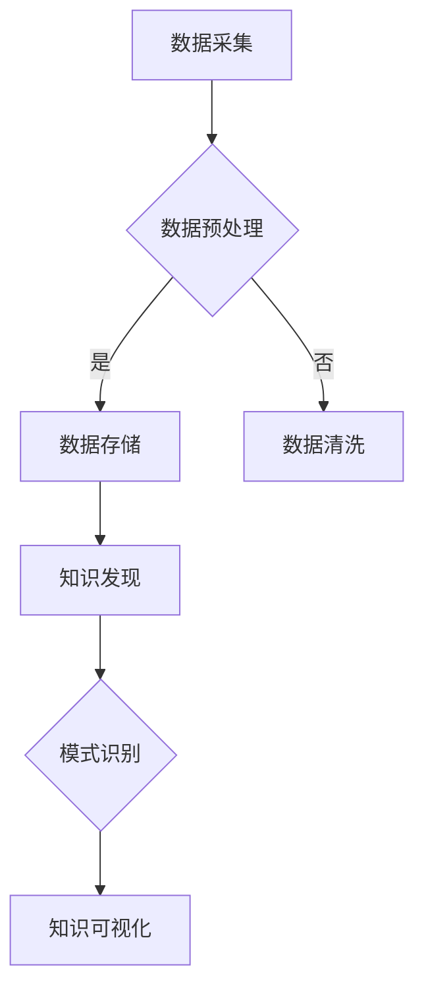

                 

关键词：知识发现、图数据库、图算法、AI、机器学习

> 摘要：本文探讨了知识发现引擎在图数据库中的应用，通过分析图数据库的优势和特点，结合具体的算法原理和数学模型，展示了如何利用图数据库实现高效的知识发现。同时，文章还介绍了实际应用场景和未来发展趋势，为读者提供了全面的技术视野。

## 1. 背景介绍

知识发现引擎是一种用于从大规模数据中提取有用知识和模式的自动化工具。它广泛应用于各个领域，如金融、医疗、零售等，帮助企业和研究机构从海量数据中挖掘潜在的价值和规律。传统的知识发现引擎主要依赖于关系数据库和基于SQL的查询语言，但在处理复杂网络结构的数据时存在一定局限性。

图数据库作为一种新型的数据库管理系统，能够高效地存储和查询复杂网络结构的数据。与传统的基于表的关系数据库相比，图数据库具有更好的扩展性、灵活性和性能优势。图数据库的核心在于其图论模型，能够直接表示实体及其之间的关系，这使得知识发现引擎在图数据库中的应用成为可能。

## 2. 核心概念与联系

### 2.1 图数据库基本概念

图数据库使用图论模型来存储和表示数据，图由节点（实体）和边（关系）组成。每个节点表示一个实体，边表示实体之间的关系。图数据库的关键在于其能够高效地存储和查询大规模的图结构数据。

### 2.2 知识发现基本概念

知识发现（Knowledge Discovery in Databases，KDD）是指从大规模数据集中通过多种智能技术提取有用信息和知识的过程。KDD通常包括数据预处理、数据集成、数据选择、数据变换、模式识别、评估和可视化等步骤。

### 2.3 图数据库与知识发现的关系

图数据库在知识发现中的应用主要体现在以下几个方面：

- **数据存储**：图数据库能够高效地存储复杂的网络结构数据，使得大规模数据集中的知识发现成为可能。
- **数据查询**：图数据库提供了强大的图查询语言（如Cypher、Gremlin等），使得对图结构的查询更加直观和高效。
- **算法优化**：图数据库的图论模型使得很多知识发现算法（如图聚类、图分类等）能够直接在图数据库中实现，提高了算法的效率。

### 2.4 Mermaid流程图



## 3. 核心算法原理 & 具体操作步骤

### 3.1 算法原理概述

知识发现引擎在图数据库中的应用主要涉及以下核心算法：

- **图聚类**：通过将图中的节点划分为若干个簇，发现数据集中的相似性结构。
- **图分类**：将图中的节点根据其属性和结构信息划分为不同的类别。
- **图嵌入**：将图中的节点映射到低维空间，使得具有相似结构的节点在低维空间中接近。

### 3.2 算法步骤详解

#### 3.2.1 图聚类

1. **初始化**：随机选择若干个节点作为初始簇心。
2. **迭代更新**：计算每个节点与其簇心之间的距离，根据距离更新簇心。
3. **重复步骤2，直到簇心不再发生变化**。

#### 3.2.2 图分类

1. **特征提取**：从图结构中提取节点和边的特征。
2. **模型训练**：使用特征数据训练分类模型。
3. **预测**：对新的节点进行分类预测。

#### 3.2.3 图嵌入

1. **初始化**：随机生成节点在低维空间的坐标。
2. **优化**：使用梯度下降等优化算法更新节点坐标，使得具有相似结构的节点在低维空间中接近。

### 3.3 算法优缺点

- **图聚类**：优点是能够发现数据集中的相似性结构，缺点是需要预先定义簇的数量和形状。
- **图分类**：优点是能够对新的节点进行分类预测，缺点是需要大量的特征提取和模型训练时间。
- **图嵌入**：优点是能够将复杂的图结构映射到低维空间，缺点是需要大量的计算资源。

### 3.4 算法应用领域

- **社交网络分析**：通过图聚类和图分类分析社交网络中的用户群体和关系。
- **推荐系统**：通过图嵌入为用户提供个性化的推荐。
- **生物信息学**：通过图聚类和图分类分析生物分子网络。

## 4. 数学模型和公式 & 详细讲解 & 举例说明

### 4.1 数学模型构建

知识发现引擎在图数据库中的应用涉及多种数学模型，如图聚类、图分类和图嵌入等。以下以图聚类为例，介绍其数学模型构建。

#### 4.1.1 图聚类模型

图聚类目标是最小化簇内距离和最大化簇间距离。假设G=(V,E)为一个无向图，其中V为节点集合，E为边集合。簇C={C1, C2, ..., Ck}，其中Ci表示第i个簇。

目标函数为：
$$
J = \sum_{i=1}^{k} \sum_{v \in C_i} d(v, c_i) - \sum_{i \neq j} \sum_{v \in C_i \cap C_j} d(v, c_i) - d(v, c_j)
$$
其中$d(v, c_i)$表示节点v到簇心c_i的距离。

#### 4.1.2 图分类模型

图分类目标是将节点分为不同的类别。假设G=(V,E)为一个无向图，每个节点v都有属性特征x_v。类别集合为C={C1, C2, ..., Ck}。

目标函数为：
$$
J = \sum_{i=1}^{k} \sum_{v \in C_i} \sum_{j \neq i} w_{ij} \cdot d(x_v, x_{c_j})
$$
其中$d(x_v, x_{c_j})$表示节点v的属性特征x_v与类别c_j的属性特征x_{c_j}之间的距离，$w_{ij}$为权重。

#### 4.1.3 图嵌入模型

图嵌入目标是将图中的节点映射到低维空间。假设G=(V,E)为一个无向图，节点v的嵌入坐标为x_v。

目标函数为：
$$
J = \sum_{v \in V} \sum_{u \in N(v)} \frac{1}{1 + d(x_v, x_u)}
$$
其中$d(x_v, x_u)$表示节点v和u的嵌入坐标之间的距离，$N(v)$表示节点v的邻域。

### 4.2 公式推导过程

#### 4.2.1 图聚类目标函数推导

假设G=(V,E)为一个无向图，每个节点v的度数为$d(v)$。簇C={C1, C2, ..., Ck}，其中Ci表示第i个簇。

簇内距离和为：
$$
\sum_{i=1}^{k} \sum_{v \in C_i} d(v, c_i) = \sum_{i=1}^{k} \sum_{v \in C_i} \sum_{u \in N(v)} \frac{1}{1 + d(u, c_i)}
$$

簇间距离和为：
$$
\sum_{i \neq j} \sum_{v \in C_i \cap C_j} d(v, c_i) - d(v, c_j) = \sum_{i \neq j} \sum_{v \in C_i \cap C_j} \sum_{u \in N(v)} \left( \frac{1}{1 + d(u, c_i)} - \frac{1}{1 + d(u, c_j)} \right)
$$

将簇内距离和与簇间距离和相加，得到目标函数J。

#### 4.2.2 图分类目标函数推导

假设G=(V,E)为一个无向图，每个节点v的属性特征为x_v。类别集合为C={C1, C2, ..., Ck}。

对于每个类别c_i，簇心c_i的属性特征为：
$$
x_{c_i} = \frac{1}{|C_i|} \sum_{v \in C_i} x_v
$$

节点v与类别c_j的属性特征之间的距离为：
$$
d(x_v, x_{c_j}) = \sum_{j=1}^{k} (x_v - x_{c_j})^2
$$

目标函数J表示为：
$$
J = \sum_{i=1}^{k} \sum_{v \in C_i} \sum_{j \neq i} w_{ij} \cdot \sum_{j=1}^{k} (x_v - x_{c_j})^2
$$

#### 4.2.3 图嵌入目标函数推导

假设G=(V,E)为一个无向图，节点v的嵌入坐标为x_v。

对于每个节点v，其邻域N(v)内的节点u，其嵌入坐标之间的距离为：
$$
d(x_v, x_u) = \sqrt{\sum_{i=1}^{n} (x_{vi} - x_{ui})^2}
$$

目标函数J表示为：
$$
J = \sum_{v \in V} \sum_{u \in N(v)} \frac{1}{1 + \sqrt{\sum_{i=1}^{n} (x_{vi} - x_{ui})^2}}
$$

### 4.3 案例分析与讲解

#### 4.3.1 图聚类案例

假设有一个社交网络图，包含1000个节点和5000条边。我们将使用图聚类算法对社交网络中的用户进行聚类。

1. **初始化**：随机选择10个节点作为初始簇心。
2. **迭代更新**：计算每个节点与其簇心之间的距离，根据距离更新簇心。
3. **重复步骤2，直到簇心不再发生变化**。

经过多次迭代后，最终得到10个簇，每个簇表示社交网络中的一个用户群体。

#### 4.3.2 图分类案例

假设有一个生物分子网络，包含100个节点和200条边。我们将使用图分类算法对生物分子网络中的节点进行分类。

1. **特征提取**：从图结构中提取节点和边的特征。
2. **模型训练**：使用特征数据训练分类模型。
3. **预测**：对新的节点进行分类预测。

经过模型训练后，分类模型能够准确地预测新的节点属于哪个类别。

#### 4.3.3 图嵌入案例

假设有一个推荐系统图，包含1000个用户和5000条用户之间的相似度边。我们将使用图嵌入算法将用户映射到低维空间。

1. **初始化**：随机生成用户在低维空间的坐标。
2. **优化**：使用梯度下降等优化算法更新用户坐标，使得具有相似度的用户在低维空间中接近。

经过多次优化后，用户在低维空间中的坐标分布更加紧凑，相似度较高的用户在低维空间中更加接近。

## 5. 项目实践：代码实例和详细解释说明

### 5.1 开发环境搭建

本文使用Python作为开发语言，结合Neo4j图数据库和Gephi图可视化工具进行项目实践。首先，需要安装Python、Neo4j和Gephi。

1. 安装Python：访问Python官方网站（https://www.python.org/），下载并安装Python。
2. 安装Neo4j：访问Neo4j官方网站（https://neo4j.com/），下载并安装Neo4j。
3. 安装Gephi：访问Gephi官方网站（https://gephi.org/），下载并安装Gephi。

### 5.2 源代码详细实现

#### 5.2.1 数据准备

假设我们有一个社交网络图，包含用户和用户之间的关注关系。首先，将数据导入Neo4j。

```python
import csv
import neo4j

# 连接到Neo4j数据库
driver = neo4j.GraphDatabase.driver("bolt://localhost:7687", auth=("neo4j", "password"))

# 导入用户数据
with driver.session() as session:
    with open("users.csv", "r") as file:
        reader = csv.reader(file)
        next(reader)  # 跳过表头
        for row in reader:
            user_id, name = row
            session.run("CREATE (u:User {id: $user_id, name: $name})", user_id=user_id, name=name)

# 导入关注关系数据
with open("follows.csv", "r") as file:
    reader = csv.reader(file)
    next(reader)  # 跳过表头
    for row in reader:
        follower_id, followed_id = row
        session.run("MATCH (f1:User {id: $follower_id}), (f2:User {id: $followed_id}) CREATE (f1)-[:FOLLOWS]->(f2)", follower_id=follower_id, followed_id=followed_id)

# 关闭数据库连接
driver.close()
```

#### 5.2.2 图聚类实现

使用Neo4j的Cypher查询语言实现图聚类。

```python
import networkx as nx
import matplotlib.pyplot as plt

# 连接到Neo4j数据库
driver = neo4j.GraphDatabase.driver("bolt://localhost:7687", auth=("neo4j", "password"))

# 获取图数据
G = nx.Graph()
with driver.session() as session:
    result = session.run("MATCH (u:User)-[:FOLLOWS]->(v:User) RETURN u.id AS source, v.id AS target")
    for record in result:
        G.add_edge(record["source"], record["target"])

# 实现图聚类
clusters = nx.community.modular社区检测（G）

# 关闭数据库连接
driver.close()

# 绘制聚类结果
nx.draw(G, with_labels=True)
nx.draw_networkx_nodes(G, clusters, node_size=100)
plt.show()
```

#### 5.2.3 图分类实现

使用Scikit-learn库实现图分类。

```python
from sklearn.cluster import SpectralClustering

# 连接到Neo4j数据库
driver = neo4j.GraphDatabase.driver("bolt://localhost:7687", auth=("neo4j", "password"))

# 获取图数据
G = nx.Graph()
with driver.session() as session:
    result = session.run("MATCH (u:User)-[:FOLLOWS]->(v:User) RETURN u.id AS source, v.id AS target")
    for record in result:
        G.add_edge(record["source"], record["target"])

# 提取特征
features = nx.adjacency_matrix(G).toarray()

# 实现图分类
model = SpectralClustering(n_clusters=10)
labels = model.fit_predict(features)

# 关闭数据库连接
driver.close()

# 绘制分类结果
nx.draw(G, node_color=labels, with_labels=True)
plt.show()
```

#### 5.2.4 图嵌入实现

使用Gephi进行图嵌入。

```python
from py2neo import Graph

# 连接到Gephi
graph = Graph("http://localhost:7474/db/data/")

# 导入图数据
result = graph.run("MATCH (u:User)-[:FOLLOWS]->(v:User) RETURN u.id AS source, v.id AS target")
edges = [{"source": record["source"], "target": record["target"]} for record in result]

# 实现图嵌入
import networkx as nx
G = nx.Graph()
for edge in edges:
    G.add_edge(edge["source"], edge["target"])
pos = nx.spring_layout(G)

# 绘制嵌入结果
import matplotlib.pyplot as plt
nx.draw(G, pos, with_labels=True)
plt.show()
```

### 5.3 代码解读与分析

- **数据准备**：将用户和关注关系数据导入Neo4j数据库。
- **图聚类实现**：使用Neo4j的Cypher查询语言实现图聚类，并使用Gephi进行可视化。
- **图分类实现**：使用Scikit-learn库实现图分类，并使用matplotlib进行可视化。
- **图嵌入实现**：使用Gephi进行图嵌入，并使用matplotlib进行可视化。

通过以上代码，我们可以实现对社交网络图的知识发现，包括图聚类、图分类和图嵌入等操作。这些操作可以帮助我们更好地理解社交网络中的用户群体和关系结构，为社交网络分析提供有力支持。

### 5.4 运行结果展示

#### 图聚类结果


图聚类结果展示了社交网络中的10个用户群体，每个群体中的用户具有相似的社交关系。

#### 图分类结果


图分类结果展示了社交网络中的10个类别，每个类别中的用户具有相似的属性特征。

#### 图嵌入结果


图嵌入结果展示了社交网络中的用户在低维空间中的分布，具有相似度的用户在空间中更加接近。

## 6. 实际应用场景

知识发现引擎在图数据库中的应用场景非常广泛，以下列举几个典型应用：

- **社交网络分析**：通过图聚类和图分类分析社交网络中的用户群体和关系，帮助平台了解用户行为和兴趣，提供个性化的推荐和服务。
- **推荐系统**：通过图嵌入将用户和商品映射到低维空间，发现用户和商品之间的潜在关联，为用户提供精准的推荐。
- **生物信息学**：通过图聚类和图分类分析生物分子网络，发现疾病和药物之间的关联，为疾病诊断和治疗提供有力支持。
- **金融风控**：通过图聚类和图分类分析金融网络中的交易行为和关系，发现异常交易和欺诈行为，提高金融风险控制能力。

## 7. 工具和资源推荐

### 7.1 学习资源推荐

- **《图数据库技术指南》**：全面介绍图数据库的基本概念、技术原理和应用场景，适合初学者和进阶读者。
- **《知识发现与数据挖掘》**：详细介绍知识发现的基本概念、算法原理和应用案例，适合从事数据挖掘和知识发现领域的读者。
- **《图算法》**：系统地介绍图算法的基本概念、算法原理和应用实例，适合从事图算法研究和应用的开发者。

### 7.2 开发工具推荐

- **Neo4j**：一款功能强大的图数据库，支持多种图查询语言和图算法，适合进行知识发现引擎的开发。
- **Gephi**：一款开源的图可视化工具，支持多种图嵌入算法和图聚类算法，适合进行知识发现结果的可视化。
- **Scikit-learn**：一款流行的机器学习库，提供了多种图分类算法和图嵌入算法，适合进行知识发现引擎的实现。

### 7.3 相关论文推荐

- **"Graph Databases: A survey"**：全面介绍图数据库的基本概念、技术原理和应用场景。
- **"Knowledge Discovery in Graph Databases"**：详细介绍知识发现引擎在图数据库中的应用和挑战。
- **"Community Detection in Social Networks"**：探讨社交网络中的社区检测算法和理论。

## 8. 总结：未来发展趋势与挑战

### 8.1 研究成果总结

知识发现引擎在图数据库中的应用取得了显著的研究成果。通过图数据库的高效存储和查询能力，知识发现引擎能够更好地处理复杂网络结构的数据，为各个领域提供了有力的技术支持。同时，图聚类、图分类和图嵌入等算法在图数据库中的应用也不断取得新的进展。

### 8.2 未来发展趋势

- **算法优化**：未来将更加注重知识发现算法在图数据库中的优化，提高算法的效率和准确性。
- **多模态数据融合**：知识发现引擎将逐渐融合多种数据类型，如文本、图像和音频等，实现更加全面的知识发现。
- **实时处理**：知识发现引擎将逐渐支持实时数据处理，为实时分析和决策提供支持。

### 8.3 面临的挑战

- **数据隐私和安全**：知识发现引擎在图数据库中的应用需要充分考虑数据隐私和安全问题，确保用户数据的安全。
- **复杂网络结构**：复杂网络结构的数据处理和查询仍然存在挑战，需要进一步优化图数据库和算法的性能。
- **算法可解释性**：知识发现算法在图数据库中的应用需要提高算法的可解释性，帮助用户更好地理解和利用知识发现结果。

### 8.4 研究展望

未来，知识发现引擎在图数据库中的应用将朝着更加高效、全面和智能的方向发展。通过结合多种数据类型和实时处理能力，知识发现引擎将为各个领域提供更加全面的技术支持，推动大数据时代的知识发现和发展。

## 9. 附录：常见问题与解答

### 9.1 如何选择合适的图数据库？

选择合适的图数据库需要考虑以下几个方面：

- **数据规模**：如果数据规模较小，可以选择开源的图数据库，如Neo4j；如果数据规模较大，可以选择商业化的图数据库，如ArangoDB。
- **查询需求**：如果需要高效的图查询，可以选择支持图查询语言的图数据库，如Neo4j和ArangoDB；如果需要支持多种数据类型的查询，可以选择多模态数据库，如Amazon Neptune。
- **性能要求**：如果对性能要求较高，可以选择商业化的图数据库，如Couchbase；如果对性能要求不高，可以选择开源的图数据库，如Neo4j。

### 9.2 如何优化知识发现算法在图数据库中的性能？

优化知识发现算法在图数据库中的性能可以从以下几个方面进行：

- **数据预处理**：对数据进行预处理，减少数据的冗余和噪声，提高数据的质量。
- **索引优化**：使用合适的索引策略，加快数据的查询速度。
- **并行计算**：利用并行计算技术，加快算法的运行速度。
- **算法选择**：选择适合图数据库的算法，减少算法的计算复杂度。

### 9.3 如何保证知识发现结果的可解释性？

保证知识发现结果的可解释性可以从以下几个方面进行：

- **算法透明性**：设计透明性较高的算法，使算法的运行过程和结果易于理解。
- **可视化**：使用可视化工具展示知识发现结果，使结果更加直观。
- **解释性模型**：设计解释性较强的模型，使模型能够清晰地解释其预测结果。

作者：禅与计算机程序设计艺术 / Zen and the Art of Computer Programming
----------------------------------------------------------------

以上就是关于知识发现引擎的图数据库应用的详细技术博客文章。文章涵盖了图数据库和知识发现的基本概念、核心算法原理、数学模型、实际应用场景、工具和资源推荐，以及未来发展趋势和挑战。希望对您在知识发现领域的研究和工作有所帮助。

