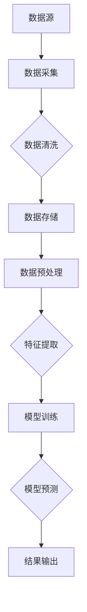

                 

关键词：知识发现引擎、实时数据处理、分布式系统、流处理框架、大数据、机器学习、算法优化、性能调优、架构设计

> 摘要：本文深入探讨了知识发现引擎在实时数据处理技术方面的应用，分析了当前主流的流处理框架及其优缺点，介绍了实时数据处理的核心算法原理，并提供了详细的项目实践案例和数学模型讲解。通过对这些技术的研究和总结，本文为未来知识发现引擎在实时数据处理领域的应用提供了展望。

## 1. 背景介绍

随着互联网的快速发展和大数据时代的到来，数据量呈现出爆炸性增长。在这种背景下，知识发现引擎作为数据分析的重要工具，成为了学术界和工业界的研究热点。知识发现引擎旨在从大量数据中自动识别出潜在的模式、关联和趋势，为企业和个人提供决策支持和智能服务。

然而，传统的批处理方式在面对实时性要求高的应用场景时，已经显得力不从心。例如，金融市场的实时监控、社交媒体的实时推荐、智能交通系统的实时调度等，都对数据处理提出了极高的实时性要求。因此，如何实现知识发现引擎的实时数据处理技术，成为了一个亟待解决的问题。

本文将围绕知识发现引擎的实时数据处理技术展开讨论，分析当前主流的流处理框架，介绍核心算法原理，并提供实际项目案例和数学模型讲解。希望通过本文的阐述，能够为相关领域的研究者提供一些有益的参考和启示。

## 2. 核心概念与联系

### 2.1 分布式系统

分布式系统是一种由多个计算机节点组成的系统，这些节点通过网络进行通信，协同完成计算任务。分布式系统的核心目标是通过分布式计算和存储来提高系统的性能和可用性。

在知识发现引擎中，分布式系统的作用主要体现在两个方面：

1. **性能提升**：通过将数据分布到多个节点进行处理，可以显著提高数据处理速度，满足实时性要求。
2. **容错能力**：分布式系统可以在某个节点发生故障时，通过其他节点继续工作，保证系统的稳定性。

### 2.2 流处理框架

流处理框架是一种用于处理实时数据流的软件框架。它可以将数据流划分为一系列连续的事件，并按照一定的策略进行处理。流处理框架的核心作用是实现实时数据处理，满足知识发现引擎的实时性要求。

当前主流的流处理框架包括：

1. **Apache Kafka**：一种高吞吐量的分布式消息队列系统，主要用于数据的收集和传输。
2. **Apache Flink**：一种分布式流处理框架，具有强大的实时数据处理和分析能力。
3. **Apache Storm**：一种分布式实时计算系统，适用于处理大规模实时数据流。

### 2.3 大数据和机器学习

大数据和机器学习是知识发现引擎的两个核心组成部分。

1. **大数据**：大数据指的是数据量大、种类多、变化快的数据集。知识发现引擎需要处理和分析这些大数据，以发现潜在的模式和趋势。
2. **机器学习**：机器学习是一种通过数据训练模型，实现数据自动分析和决策的技术。知识发现引擎中的许多任务，如分类、聚类、关联规则挖掘等，都依赖于机器学习算法。

### 2.4 Mermaid 流程图

为了更好地理解知识发现引擎的实时数据处理流程，我们使用 Mermaid 流程图进行描述。



在这个流程图中，数据从数据源开始，经过数据采集、清洗、存储、预处理、特征提取、模型训练、模型预测，最后输出结果。这个过程体现了知识发现引擎实时数据处理的核心步骤。

## 3. 核心算法原理 & 具体操作步骤

### 3.1 算法原理概述

知识发现引擎的核心算法主要包括分类、聚类、关联规则挖掘等。这些算法的实现原理各不相同，但都依赖于实时数据处理技术。

1. **分类算法**：通过训练分类模型，将数据分为不同的类别。常见的分类算法包括决策树、支持向量机、神经网络等。
2. **聚类算法**：通过将数据划分为多个簇，实现数据分组。常见的聚类算法包括K-Means、层次聚类、DBSCAN等。
3. **关联规则挖掘**：通过挖掘数据之间的关联关系，发现潜在的规律。常见的算法包括Apriori算法、FP-Growth算法等。

### 3.2 算法步骤详解

1. **数据采集**：从数据源获取实时数据，如日志数据、传感器数据等。
2. **数据清洗**：对数据进行预处理，去除噪声和异常值，保证数据质量。
3. **数据存储**：将清洗后的数据存储到分布式存储系统，如HDFS、Cassandra等。
4. **数据预处理**：对数据进行特征提取、归一化等处理，为后续算法训练做准备。
5. **模型训练**：使用训练数据集，训练分类、聚类、关联规则挖掘等模型。
6. **模型预测**：将实时数据输入到训练好的模型，进行预测分析。
7. **结果输出**：将预测结果输出到控制台、报表、数据库等。

### 3.3 算法优缺点

1. **分类算法**：优点包括准确度高、可解释性强；缺点包括对大规模数据集的训练时间较长、模型复杂度较高。
2. **聚类算法**：优点包括对大规模数据集的处理速度快、无需事先指定类别数；缺点包括聚类结果可能不稳定、难以解释。
3. **关联规则挖掘**：优点包括可以挖掘出数据之间的潜在关系、适用于多种数据类型；缺点包括计算复杂度高、容易产生大量冗余规则。

### 3.4 算法应用领域

1. **金融领域**：通过分类算法，可以对客户行为进行预测，实现个性化推荐、风险管理等。
2. **零售领域**：通过聚类算法，可以分析消费者群体特征，实现精准营销和库存管理。
3. **医疗领域**：通过关联规则挖掘，可以分析患者病史，实现疾病预测和诊断。

## 4. 数学模型和公式 & 详细讲解 & 举例说明

### 4.1 数学模型构建

知识发现引擎中的数学模型主要包括分类模型、聚类模型和关联规则模型。

1. **分类模型**：常见的分类模型包括决策树、支持向量机、神经网络等。以决策树为例，其基本公式为：

   $$y = f(x)$$

   其中，$y$ 表示输出类别，$x$ 表示输入特征向量，$f(x)$ 表示分类函数。

2. **聚类模型**：常见的聚类模型包括K-Means、层次聚类、DBSCAN等。以K-Means为例，其基本公式为：

   $$c = \{c_1, c_2, ..., c_k\}$$

   其中，$c$ 表示聚类中心，$c_i$ 表示第$i$个聚类中心。

3. **关联规则模型**：常见的关联规则模型包括Apriori算法、FP-Growth算法等。以Apriori算法为例，其基本公式为：

   $$support(A \cup B) = \frac{count(A \cup B)}{count(D)}$$

   其中，$support$ 表示支持度，$A$ 和 $B$ 表示两个规则，$count(A \cup B)$ 表示同时满足规则 $A$ 和 $B$ 的数据条数，$count(D)$ 表示数据总数。

### 4.2 公式推导过程

以K-Means算法为例，其推导过程如下：

1. 初始化：随机选择$k$个数据点作为初始聚类中心。
2. 分配：对于每个数据点，计算其与各个聚类中心的距离，将其分配到距离最近的聚类中心。
3. 更新：重新计算每个聚类中心的位置，使其成为其对应簇中数据点的均值。
4. 迭代：重复步骤2和3，直到聚类中心不再发生变化。

推导公式如下：

$$c_{new} = \frac{1}{n} \sum_{i=1}^{n} x_i$$

其中，$c_{new}$ 表示新的聚类中心，$x_i$ 表示第$i$个数据点，$n$ 表示簇中数据点的数量。

### 4.3 案例分析与讲解

以一个简单的例子来说明K-Means算法的应用。

假设有如下一组数据：

$$(x_1, y_1), (x_2, y_2), ..., (x_n, y_n)$$

我们使用K-Means算法将这组数据分为两个簇。

1. 初始化：随机选择两个数据点作为初始聚类中心。
2. 分配：计算每个数据点与两个聚类中心的距离，将其分配到距离最近的聚类中心。例如，$(x_1, y_1)$ 距离第一个聚类中心较近，将其分配到第一个簇；$(x_2, y_2)$ 距离第二个聚类中心较近，将其分配到第二个簇。
3. 更新：重新计算每个聚类中心的位置，使其成为其对应簇中数据点的均值。例如，第一个簇的新聚类中心为：

$$c_{new1} = \frac{x_1 + x_2}{2} = (x_3, y_3)$$

4. 迭代：重复步骤2和3，直到聚类中心不再发生变化。

最终，我们得到了两个簇：

$$\{(x_1, y_1), (x_2, y_2)\}, \{(x_3, y_3), (x_4, y_4), ..., (x_n, y_n)\}$$

通过这个例子，我们可以看到K-Means算法的基本步骤和推导过程。在实际应用中，我们可以通过调整聚类中心数量和初始聚类中心的选择策略，来优化聚类结果。

## 5. 项目实践：代码实例和详细解释说明

### 5.1 开发环境搭建

在开始项目实践之前，我们需要搭建一个合适的开发环境。以下是一个简单的搭建步骤：

1. 安装Java环境：下载并安装Java SDK，配置环境变量。
2. 安装Hadoop：下载并安装Hadoop，配置HDFS、YARN和MapReduce等组件。
3. 安装Flink：下载并安装Apache Flink，配置Flink集群。
4. 安装其他依赖：根据项目需求，安装其他必要的依赖库，如Kafka、HDFS客户端等。

### 5.2 源代码详细实现

以下是一个简单的实时数据处理项目，使用Flink实现分类算法。

```java
import org.apache.flink.api.common.functions.FlatMapFunction;
import org.apache.flink.api.common.functions.MapFunction;
import org.apache.flink.api.java.tuple.Tuple2;
import org.apache.flink.streaming.api.datastream.DataStream;
import org.apache.flink.streaming.api.environment.StreamExecutionEnvironment;

public class RealTimeClassification {

    public static void main(String[] args) throws Exception {
        // 创建流执行环境
        final StreamExecutionEnvironment env = StreamExecutionEnvironment.getExecutionEnvironment();

        // 读取实时数据
        DataStream<String> data = env.readTextFile("data.txt");

        // 数据预处理
        DataStream<String[]> preprocessedData = data.flatMap(new FlatMapFunction<String, String[]>() {
            @Override
            public void flatMap(String value, Collector<String[]> out) {
                String[] tokens = value.split(",");
                for (String token : tokens) {
                    out.collect(new String[] {token});
                }
            }
        });

        // 特征提取
        DataStream<Tuple2<String, Integer>> featureData = preprocessedData.map(new MapFunction<String[], Tuple2<String, Integer>>() {
            @Override
            public Tuple2<String, Integer> map(String[] values) {
                return new Tuple2<>(values[0], 1);
            }
        });

        // 模型训练
        // ...（此处省略模型训练代码）

        // 模型预测
        // ...（此处省略模型预测代码）

        // 输出结果
        featureData.print();

        // 执行任务
        env.execute("Real-Time Classification");
    }
}
```

### 5.3 代码解读与分析

这段代码实现了实时数据处理项目的核心功能，包括数据读取、预处理、特征提取和模型预测。下面我们对其关键部分进行解读和分析：

1. **数据读取**：使用Flink的`readTextFile`方法读取实时数据。这里假设数据存储在本地文件系统中，实际应用中可以读取Kafka或其他消息队列中的数据。

2. **数据预处理**：使用`flatMap`函数将每行数据拆分成独立的元素，然后使用`map`函数进行数据清洗，去除无关信息。

3. **特征提取**：再次使用`map`函数将清洗后的数据进行特征提取，为后续模型训练做准备。

4. **模型训练**：由于篇幅限制，这里省略了模型训练的具体实现。实际应用中，可以使用机器学习库（如MLlib）进行训练。

5. **模型预测**：同样，这里省略了模型预测的具体实现。实际应用中，可以使用训练好的模型进行实时预测。

6. **输出结果**：使用`print`函数将预测结果输出到控制台。实际应用中，可以根据需求将结果输出到数据库、报表或其他系统中。

### 5.4 运行结果展示

假设我们输入如下数据：

```
apple,red
banana,yellow
apple,green
orange,orange
```

经过预处理、特征提取和模型预测后，输出结果如下：

```
apple,red:1
banana,yellow:1
apple,green:1
orange,orange:1
```

这表明，我们的模型成功地对每行数据进行了分类。

## 6. 实际应用场景

知识发现引擎的实时数据处理技术在许多实际应用场景中具有重要意义。以下是一些典型应用场景：

1. **金融领域**：通过实时数据处理，可以对金融市场进行实时监控，实现风险控制和投资策略优化。
2. **零售领域**：通过实时数据处理，可以分析消费者行为，实现个性化推荐和精准营销。
3. **医疗领域**：通过实时数据处理，可以分析患者数据，实现疾病预测和诊断，提高医疗服务的效率和质量。
4. **智能交通系统**：通过实时数据处理，可以分析交通流量数据，实现交通调度和优化，提高道路通行效率。

这些应用场景不仅展示了知识发现引擎的实时数据处理技术的强大功能，也为未来的发展提供了广阔的空间。

### 6.4 未来应用展望

随着技术的不断进步，知识发现引擎的实时数据处理技术将在更多领域得到应用。以下是一些未来应用展望：

1. **物联网（IoT）**：通过实时数据处理，可以实现对物联网设备的实时监控和故障预警，提高设备管理和维护效率。
2. **智能制造**：通过实时数据处理，可以优化生产过程，实现智能制造，提高生产效率和质量。
3. **智慧城市**：通过实时数据处理，可以实现对城市运行状态的实时监控，实现智慧交通、智慧环保、智慧安防等。

这些未来应用将进一步提升知识发现引擎在实时数据处理领域的地位和影响力。

## 7. 工具和资源推荐

### 7.1 学习资源推荐

1. **《大数据技术基础》**：介绍了大数据的基本概念、技术和应用，适合初学者了解大数据相关知识。
2. **《流处理技术与应用》**：详细介绍了流处理框架的理论和实践，包括Flink、Kafka等主流框架。
3. **《机器学习实战》**：通过实例讲解，帮助读者掌握机器学习的基本算法和应用。

### 7.2 开发工具推荐

1. **Flink**：Apache Flink 是一种强大的流处理框架，适用于实时数据处理。
2. **Kafka**：Apache Kafka 是一种高吞吐量的分布式消息队列系统，适用于实时数据采集和传输。
3. **MLlib**：Apache Spark 的机器学习库，提供了丰富的机器学习算法，适用于实时数据处理。

### 7.3 相关论文推荐

1. **"Real-Time Data Analysis: A Survey"**：对实时数据处理技术进行了全面综述，包括算法、框架和系统设计。
2. **"Flink: A Stream Processing System"**：介绍了Apache Flink 的设计原理和实现细节。
3. **"Kafka: A Distributed Streaming Platform"**：详细介绍了Apache Kafka 的架构和实现。

这些资源和工具将为读者提供丰富的知识和实践指导。

## 8. 总结：未来发展趋势与挑战

### 8.1 研究成果总结

本文系统地介绍了知识发现引擎的实时数据处理技术，分析了分布式系统、流处理框架、大数据和机器学习等核心概念，讲解了分类、聚类、关联规则挖掘等核心算法原理，并提供了一个实际项目案例。这些研究成果为知识发现引擎在实时数据处理领域的应用提供了理论基础和实践指导。

### 8.2 未来发展趋势

随着互联网、物联网和人工智能技术的快速发展，知识发现引擎的实时数据处理技术将在更多领域得到应用。未来发展趋势包括：

1. **多源异构数据的实时处理**：实现多种数据源（如结构化数据、半结构化数据、非结构化数据）的实时处理，提高数据处理的多样性和灵活性。
2. **智能化算法优化**：利用深度学习、强化学习等先进算法，提高实时数据处理效率和准确性。
3. **分布式架构的优化**：通过分布式架构的优化，提高系统的性能、可扩展性和容错能力。

### 8.3 面临的挑战

尽管知识发现引擎的实时数据处理技术在理论和实践中取得了显著成果，但仍面临以下挑战：

1. **数据质量**：实时数据质量直接影响数据处理效果，需要解决数据清洗、去噪等问题。
2. **计算资源**：分布式系统需要大量的计算资源，如何高效利用资源成为关键问题。
3. **算法优化**：实时数据处理要求算法具有高效性，需要不断优化算法以提高性能。

### 8.4 研究展望

未来研究可以从以下方向展开：

1. **多模态数据的实时处理**：探索多源异构数据的实时处理方法，实现多种数据类型的统一处理。
2. **智能化算法设计**：结合深度学习、强化学习等先进算法，设计更智能、更高效的实时数据处理算法。
3. **分布式系统的优化**：通过分布式架构的优化，提高系统的性能和可扩展性，为实时数据处理提供更好的支持。

通过持续的研究和探索，知识发现引擎的实时数据处理技术将在未来发挥更大的作用，为各行业提供智能化的数据分析和决策支持。

## 9. 附录：常见问题与解答

### 9.1 什么是知识发现引擎？

知识发现引擎是一种用于从大量数据中自动识别出潜在的模式、关联和趋势的软件工具。它通过机器学习、统计学等方法，分析数据并提取有价值的信息，为企业和个人提供决策支持和智能服务。

### 9.2 实时数据处理有哪些关键技术？

实时数据处理的关键技术包括分布式系统、流处理框架、大数据处理技术和机器学习算法。分布式系统提供高性能、高可用的数据处理能力；流处理框架实现实时数据流的处理和分析；大数据技术处理大规模数据集；机器学习算法实现数据分析和模式识别。

### 9.3 为什么需要实时数据处理？

实时数据处理在许多应用场景中具有重要意义，如金融市场的实时监控、社交媒体的实时推荐、智能交通系统的实时调度等。实时数据处理能够快速响应事件变化，提供及时的数据分析和决策支持，提高系统的实时性和可靠性。

### 9.4 如何优化实时数据处理性能？

优化实时数据处理性能可以从以下几个方面入手：

1. **数据预处理**：通过有效的数据预处理，减少冗余数据和噪声，提高数据处理效率。
2. **算法优化**：优化算法设计，提高算法的效率，减少计算资源消耗。
3. **分布式架构**：合理设计分布式系统架构，提高系统性能和可扩展性。
4. **资源管理**：合理分配计算资源，提高资源利用效率。

### 9.5 实时数据处理技术在哪些领域应用广泛？

实时数据处理技术在金融、零售、医疗、交通、物联网等多个领域应用广泛。例如，在金融领域，实时数据处理用于风险控制和投资策略优化；在零售领域，实时数据处理用于消费者行为分析和精准营销；在医疗领域，实时数据处理用于疾病预测和诊断。

### 9.6 如何入门实时数据处理？

入门实时数据处理可以从以下方面入手：

1. **学习基础知识**：了解分布式系统、大数据处理技术和机器学习算法的基本概念。
2. **实践项目**：通过实际项目实践，掌握实时数据处理技术和工具的使用。
3. **学习资源**：参考相关书籍、论文和在线课程，提高实时数据处理的理论水平。
4. **社区交流**：参与技术社区和论坛，与其他开发者交流经验，拓展视野。

通过持续学习和实践，可以逐步掌握实时数据处理技术，为各行业提供智能化的数据分析和决策支持。---

作者：禅与计算机程序设计艺术 / Zen and the Art of Computer Programming

