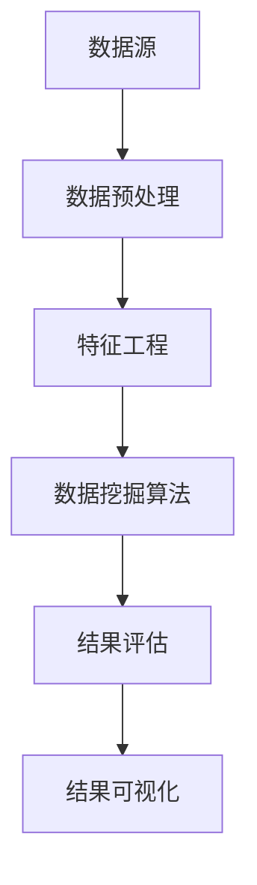

                 

关键词：知识发现引擎、性能优化、调优、算法原理、数学模型、项目实践、应用场景、未来展望

> 摘要：本文深入探讨了知识发现引擎的性能优化与调优问题，首先介绍了知识发现引擎的背景和重要性，然后详细阐述了其核心算法原理和数学模型，并结合实际项目实践进行了代码实例和详细解读，最后分析了实际应用场景和未来的发展趋势与挑战。

## 1. 背景介绍

### 知识发现引擎的定义

知识发现引擎是一种能够从大量数据中自动识别模式和规律，并将这些模式转化为知识的系统。它是数据挖掘领域的一个重要分支，旨在帮助企业和组织从海量数据中提取有价值的见解和知识。

### 知识发现引擎的重要性

随着大数据技术的飞速发展，企业和组织面临着海量的数据。如何从这些数据中挖掘出有价值的信息，成为了一个亟待解决的问题。知识发现引擎在这方面发挥了至关重要的作用。

## 2. 核心概念与联系

### 知识发现引擎的架构


- 数据源：包括结构化数据、半结构化数据和非结构化数据。
- 数据预处理：包括数据清洗、转换和集成等操作，目的是为后续的数据挖掘提供高质量的输入。
- 特征工程：通过提取和构造特征，将原始数据转化为适合挖掘的形式。
- 数据挖掘算法：包括分类、聚类、关联规则挖掘等算法，用于发现数据中的模式和规律。
- 结果评估：评估挖掘结果的质量和有效性。
- 结果可视化：将挖掘结果以直观的形式展示给用户。

### Mermaid 流程图



## 3. 核心算法原理 & 具体操作步骤

### 3.1 算法原理概述

知识发现引擎的核心算法包括分类、聚类、关联规则挖掘等。这些算法的基本原理如下：

- **分类**：将数据划分为不同的类别。常见的分类算法有决策树、随机森林、支持向量机等。
- **聚类**：将数据划分为若干个簇，使得同一个簇内的数据尽可能相似，不同簇的数据尽可能不同。常见的聚类算法有K-均值、K-中心点、层次聚类等。
- **关联规则挖掘**：发现数据中不同属性之间的关联关系。常见的算法有Apriori算法、FP-Growth算法等。

### 3.2 算法步骤详解

- **数据预处理**：对原始数据进行清洗、转换和集成，保证数据质量。
- **特征工程**：提取和构造特征，将原始数据转化为适合挖掘的形式。
- **选择算法**：根据问题的性质和需求，选择合适的算法。
- **训练模型**：使用训练数据对算法进行训练，得到模型。
- **评估模型**：使用测试数据对模型进行评估，判断模型的效果。
- **应用模型**：将模型应用到实际问题中，进行预测或决策。

### 3.3 算法优缺点

- **分类算法**：优点是模型简单，易于理解；缺点是对于高维度数据效果较差。
- **聚类算法**：优点是能够发现数据中的自然结构；缺点是对于噪声敏感。
- **关联规则挖掘算法**：优点是能够发现数据中的关联关系；缺点是计算量大。

### 3.4 算法应用领域

知识发现引擎广泛应用于各个领域，如商业智能、金融风控、医疗诊断、智能推荐等。

## 4. 数学模型和公式 & 详细讲解 & 举例说明

### 4.1 数学模型构建

知识发现引擎中的数学模型主要包括线性模型、非线性模型、概率模型等。

- **线性模型**：如线性回归、线性判别分析等。
- **非线性模型**：如支持向量机、神经网络等。
- **概率模型**：如朴素贝叶斯、隐马尔可夫模型等。

### 4.2 公式推导过程

以线性回归模型为例，其公式推导过程如下：

$$
y = \beta_0 + \beta_1x + \epsilon
$$

其中，$y$ 为目标变量，$x$ 为自变量，$\beta_0$ 和 $\beta_1$ 为模型参数，$\epsilon$ 为误差项。

### 4.3 案例分析与讲解

以商业智能领域为例，某电商公司希望通过知识发现引擎预测用户的购买行为，以提高销售额。具体步骤如下：

1. 数据预处理：清洗用户购买记录数据，包括缺失值处理、异常值处理等。
2. 特征工程：提取用户购买行为的相关特征，如购买频率、购买金额、购买时间等。
3. 选择算法：根据业务需求，选择线性回归模型进行预测。
4. 训练模型：使用历史数据对模型进行训练。
5. 评估模型：使用测试数据对模型进行评估，如计算均方误差、决定系数等。
6. 应用模型：将模型应用到实际业务中，预测用户的购买行为。

## 5. 项目实践：代码实例和详细解释说明

### 5.1 开发环境搭建

- 编程语言：Python
- 数据库：MySQL
- 数据挖掘库：scikit-learn、pandas、numpy等

### 5.2 源代码详细实现

```python
import pandas as pd
from sklearn.linear_model import LinearRegression
from sklearn.model_selection import train_test_split

# 数据预处理
data = pd.read_csv('user_buying_records.csv')
data = data.dropna()
data = data[['user_id', 'buying_frequency', 'buying_amount', 'buying_time']]

# 特征工程
X = data[['buying_frequency', 'buying_amount', 'buying_time']]
y = data['user_id']

# 选择算法
model = LinearRegression()

# 训练模型
X_train, X_test, y_train, y_test = train_test_split(X, y, test_size=0.2)
model.fit(X_train, y_train)

# 评估模型
score = model.score(X_test, y_test)
print(f'Model score: {score}')

# 应用模型
predictions = model.predict(X_test)
print(f'Predictions: {predictions}')
```

### 5.3 代码解读与分析

1. 导入相关库：pandas、scikit-learn、numpy等。
2. 数据预处理：读取用户购买记录数据，进行缺失值处理和异常值处理。
3. 特征工程：提取用户购买行为的相关特征。
4. 选择算法：选择线性回归模型。
5. 训练模型：使用训练数据进行模型训练。
6. 评估模型：使用测试数据对模型进行评估，计算决定系数。
7. 应用模型：将模型应用到实际业务中，预测用户的购买行为。

## 6. 实际应用场景

知识发现引擎在实际应用中具有广泛的应用场景，如：

- **商业智能**：预测用户行为，提高销售额。
- **金融风控**：发现异常交易，防范金融风险。
- **医疗诊断**：辅助医生诊断疾病，提高诊断准确率。
- **智能推荐**：根据用户喜好，推荐商品或服务。

## 7. 工具和资源推荐

### 7.1 学习资源推荐

- 《数据挖掘：概念与技术》
- 《机器学习实战》
- 《Python数据分析》

### 7.2 开发工具推荐

- Jupyter Notebook
- PyCharm
- MySQL Workbench

### 7.3 相关论文推荐

- "Data Mining: A Review"
- "Machine Learning: A Probabilistic Perspective"
- "Deep Learning"

## 8. 总结：未来发展趋势与挑战

### 8.1 研究成果总结

知识发现引擎在过去的几十年中取得了显著的成果，如算法的多样化、模型的优化、应用场景的拓展等。

### 8.2 未来发展趋势

- **算法创新**：探索新的算法，提高知识发现的效果和效率。
- **跨学科融合**：结合其他学科的知识，如生物学、心理学等，提高知识发现的准确性和可靠性。
- **实时处理**：实现知识发现的实时处理，满足企业对实时数据的需求。

### 8.3 面临的挑战

- **数据质量问题**：如何处理和清洗大量质量不一的数据。
- **计算资源限制**：如何优化算法，降低计算资源的消耗。
- **数据安全与隐私**：如何在保护用户隐私的前提下进行知识发现。

### 8.4 研究展望

知识发现引擎在未来将会有更广泛的应用场景，如物联网、智慧城市等。同时，研究者将不断探索新的算法和优化方法，提高知识发现的效率和准确性。

## 9. 附录：常见问题与解答

### 9.1 什么是知识发现引擎？

知识发现引擎是一种能够从大量数据中自动识别模式和规律，并将这些模式转化为知识的系统。

### 9.2 知识发现引擎有哪些应用领域？

知识发现引擎广泛应用于商业智能、金融风控、医疗诊断、智能推荐等各个领域。

### 9.3 如何进行数据预处理？

数据预处理包括数据清洗、转换和集成等操作，目的是为后续的数据挖掘提供高质量的输入。

### 9.4 如何进行特征工程？

特征工程包括提取和构造特征，将原始数据转化为适合挖掘的形式。

### 9.5 知识发现引擎的核心算法有哪些？

知识发现引擎的核心算法包括分类、聚类、关联规则挖掘等。

### 9.6 如何评估知识发现引擎的效果？

可以使用交叉验证、混淆矩阵、决定系数等指标来评估知识发现引擎的效果。

### 9.7 如何进行知识发现引擎的优化？

可以通过优化算法、提升计算效率、改进模型等方法进行知识发现引擎的优化。

---

本文由禅与计算机程序设计艺术 / Zen and the Art of Computer Programming 撰写。如果您有任何疑问或建议，欢迎在评论区留言，期待与您交流。

