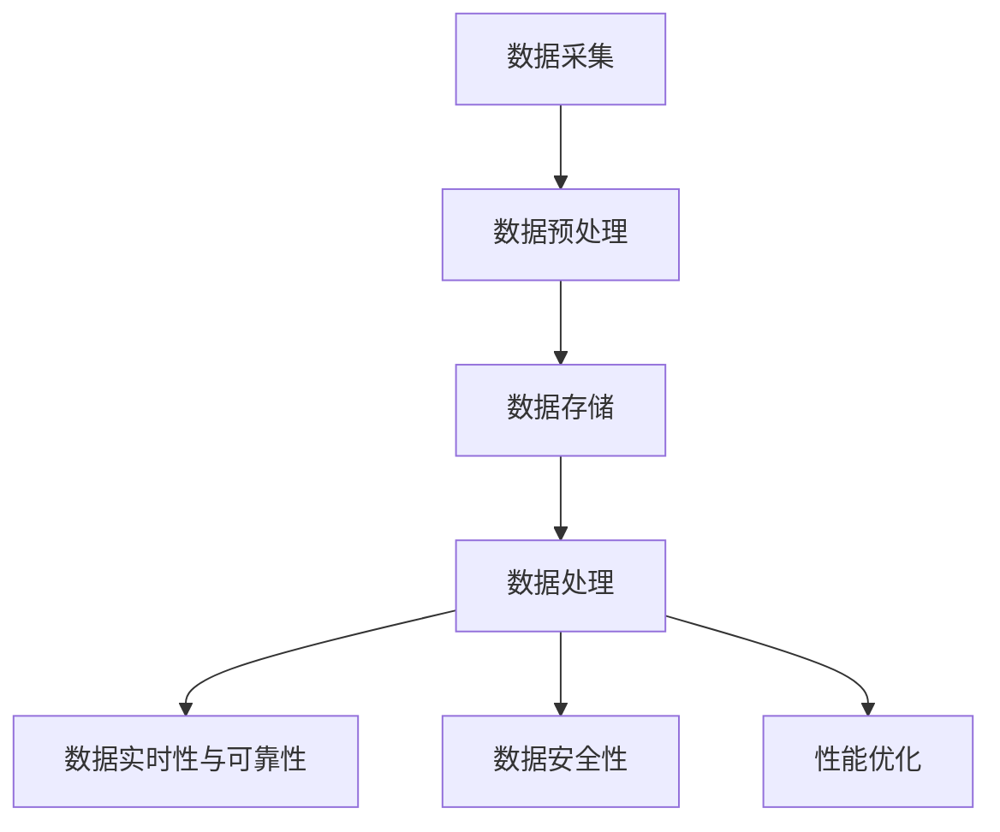

                 

关键词：知识发现引擎、数据源管理、算法、数据处理、数据存储、实时性、可靠性、安全性、性能优化

> 摘要：本文探讨了知识发现引擎的数据源管理，分析了数据源管理的核心概念、原理、算法、数学模型，并给出了项目实践中的代码实例和运行结果。此外，文章还展望了未来应用场景和工具资源，并提出了未来发展中的挑战和展望。

## 1. 背景介绍

随着互联网和大数据技术的发展，知识发现引擎在各个领域得到了广泛应用。知识发现引擎是一种自动化处理数据的工具，能够从大量的数据中提取出有价值的信息和知识。然而，数据源管理是知识发现引擎的核心问题之一，直接影响到数据的质量、实时性和可靠性。

数据源管理主要包括数据采集、存储、处理和优化等方面。本文将重点关注数据源管理中的以下几个关键问题：

- 数据源的类型与结构
- 数据采集与预处理
- 数据存储与访问
- 数据处理算法
- 数据实时性与可靠性
- 数据安全性
- 性能优化

通过对以上问题的分析和探讨，本文旨在为知识发现引擎的数据源管理提供一些实用的指导和方法。

## 2. 核心概念与联系

### 2.1 数据源管理概述

数据源管理是指在知识发现过程中，对数据源进行采集、存储、处理和优化的一系列操作。其核心目标是确保数据的质量、实时性和可靠性，从而提高知识发现的效果。

### 2.2 数据源类型与结构

数据源可以按照不同的分类方式进行划分，例如按数据类型（结构化数据、半结构化数据、非结构化数据）或数据来源（内部数据、外部数据）进行分类。

- 结构化数据：具有明确的结构，通常以表格形式存储，如关系型数据库中的数据。
- 半结构化数据：具有部分结构，如XML、JSON等格式的数据。
- 非结构化数据：没有固定的结构，如文本、图片、视频等。

### 2.3 数据采集与预处理

数据采集是数据源管理的第一步，主要任务是从各种数据源获取数据。数据预处理是对采集到的数据进行清洗、转换和整合等操作，以提高数据的质量和一致性。

### 2.4 数据存储与访问

数据存储是数据源管理的核心任务之一，主要涉及数据的存储方式、存储策略和访问机制。常见的存储方式包括关系型数据库、NoSQL数据库、文件存储和分布式存储等。数据访问机制则决定了数据源的可扩展性和性能。

### 2.5 数据处理算法

数据处理算法是数据源管理的重要组成部分，主要包括数据清洗、数据集成、数据变换和数据挖掘等。这些算法能够从海量数据中提取出有价值的信息和知识。

### 2.6 数据实时性与可靠性

数据实时性是指数据源能够及时响应外部事件，提供最新的数据。数据可靠性则是指数据源能够保证数据的准确性和完整性，从而提高知识发现的效果。

### 2.7 数据安全性

数据安全性是数据源管理中的重要问题，主要涉及数据的机密性、完整性和可用性。为了保障数据安全性，需要采取一系列安全措施，如数据加密、访问控制、网络安全等。

### 2.8 性能优化

性能优化是数据源管理中的重要任务，主要涉及数据的读写速度、存储容量和访问效率等方面。通过优化数据源管理策略，可以提高知识发现引擎的整体性能。

### 2.9 Mermaid 流程图

以下是一个关于数据源管理的 Mermaid 流程图，展示了各个关键环节及其之间的联系。



## 3. 核心算法原理 & 具体操作步骤

### 3.1 算法原理概述

数据源管理中的核心算法主要包括数据清洗算法、数据集成算法、数据变换算法和数据挖掘算法等。这些算法的基本原理如下：

- 数据清洗算法：通过去除重复数据、填补缺失值、纠正错误数据等操作，提高数据质量。
- 数据集成算法：将多个数据源中的数据整合到一个统一的数据源中，实现数据的集中管理。
- 数据变换算法：对数据进行转换、归一化、标准化等操作，使其满足数据挖掘的要求。
- 数据挖掘算法：从数据源中提取出有价值的信息和知识，如分类、聚类、关联规则挖掘等。

### 3.2 算法步骤详解

以下是一个数据源管理算法的详细步骤：

1. 数据采集：从各种数据源获取数据，包括内部数据和外部数据。
2. 数据预处理：对采集到的数据进行清洗、转换和整合等操作，提高数据质量。
3. 数据存储：将预处理后的数据存储到合适的存储系统中，如关系型数据库、NoSQL数据库等。
4. 数据处理：对存储的数据进行清洗、集成、变换和挖掘等操作，提取出有价值的信息和知识。
5. 数据实时性与可靠性：采用实时数据处理技术，确保数据源能够及时响应外部事件，提供最新的数据。
6. 数据安全性：采取一系列安全措施，如数据加密、访问控制、网络安全等，保障数据的安全性。
7. 性能优化：根据实际应用需求，对数据源管理策略进行优化，提高数据源的读写速度、存储容量和访问效率。

### 3.3 算法优缺点

- 数据清洗算法：优点是能够提高数据质量，缺点是可能会引入新的错误或丢失部分信息。
- 数据集成算法：优点是实现数据的集中管理，缺点是可能会增加系统的复杂度和维护成本。
- 数据变换算法：优点是满足数据挖掘的要求，缺点是可能会降低数据的一致性和准确性。
- 数据挖掘算法：优点是从海量数据中提取出有价值的信息和知识，缺点是对计算资源和时间要求较高。

### 3.4 算法应用领域

数据源管理算法广泛应用于各个领域，如金融、医疗、电商、物联网等。以下是一些典型应用案例：

- 金融领域：通过数据源管理算法，对客户的交易记录、风险评估报告等数据进行处理和分析，实现风险控制和客户服务优化。
- 医疗领域：通过数据源管理算法，对患者的病历数据、医学图像等数据进行处理和分析，实现疾病诊断和治疗方案优化。
- 电商领域：通过数据源管理算法，对用户的行为数据、商品数据等数据进行处理和分析，实现推荐系统和营销策略优化。
- 物联网领域：通过数据源管理算法，对传感器数据、设备状态等数据进行处理和分析，实现智能监控和优化。

## 4. 数学模型和公式 & 详细讲解 & 举例说明

### 4.1 数学模型构建

数据源管理中的数学模型主要包括数据清洗模型、数据集成模型、数据变换模型和数据挖掘模型等。以下是一个数据清洗模型的构建示例：

假设我们有一个包含n个特征的数据集，其中每个特征都是一个随机变量。我们的目标是去除数据集中的异常值，以提高数据质量。一个简单的方法是使用统计学中的Z分数来识别和去除异常值。Z分数的计算公式如下：

$$
Z = \frac{X - \mu}{\sigma}
$$

其中，X为特征值，μ为该特征的平均值，σ为该特征的标准差。如果Z的绝对值大于某个阈值t，则认为该特征值为异常值。

### 4.2 公式推导过程

在数据集成过程中，我们需要对多个数据源中的数据进行合并。一个常见的方法是使用数据库中的SQL查询语句来实现。以下是一个简单的SQL查询示例，用于将两个数据表合并为一个数据表：

$$
SELECT * FROM Table1
JOIN Table2 ON Table1.id = Table2.id
$$

在这个查询中，我们使用JOIN操作将两个数据表按照id列进行合并。

### 4.3 案例分析与讲解

假设我们有一个电商平台的用户行为数据，包括用户ID、商品ID、购买时间和购买金额。我们需要对这份数据进行预处理，以便进行后续的数据挖掘和分析。

1. 数据清洗：通过Z分数方法，识别并去除异常值。例如，我们可以设置一个阈值t，如3，去除Z的绝对值大于3的特征值。
2. 数据集成：使用SQL查询语句，将多个数据表合并为一个数据表。例如，我们可以使用以下查询语句将用户行为数据与商品信息数据进行合并：

```sql
SELECT Users.id, Users.name, Products.id, Products.name, Transactions.time, Transactions.amount
FROM Users
JOIN Transactions ON Users.id = Transactions.user_id
JOIN Products ON Transactions.product_id = Products.id
```

3. 数据变换：对数据进行归一化、标准化等操作，使其满足数据挖掘的要求。例如，我们可以使用以下公式对购买金额进行归一化：

$$
X' = \frac{X - \min(X)}{\max(X) - \min(X)}
$$

4. 数据挖掘：使用分类、聚类、关联规则挖掘等方法，从预处理后的数据中提取出有价值的信息和知识。例如，我们可以使用K-means算法对用户进行聚类，以分析用户的购买偏好。

## 5. 项目实践：代码实例和详细解释说明

### 5.1 开发环境搭建

在本节中，我们将使用Python语言和相关的库（如Pandas、NumPy、SQLAlchemy等）来演示一个数据源管理项目的实现。首先，我们需要搭建开发环境。

1. 安装Python（建议使用3.8及以上版本）。
2. 安装相关库，可以使用以下命令：

```bash
pip install pandas numpy sqlalchemy
```

### 5.2 源代码详细实现

以下是一个数据源管理项目的源代码示例：

```python
import pandas as pd
import numpy as np
from sqlalchemy import create_engine

# 数据清洗
def clean_data(data):
    # 去除缺失值
    data = data.dropna()
    
    # 计算Z分数
    z_scores = (data - data.mean()) / data.std()
    
    # 去除异常值
    threshold = 3
    data = data[(z_scores < threshold) & (z_scores > -threshold)]
    
    return data

# 数据集成
def integrate_data(data1, data2):
    # 使用SQL查询语句进行数据集成
    query = "SELECT * FROM data1 JOIN data2 ON data1.id = data2.id"
    data = pd.read_sql_query(query, engine)
    return data

# 数据变换
def transform_data(data):
    # 对购买金额进行归一化
    amount = data['amount']
    amount_min = amount.min()
    amount_max = amount.max()
    amount_normalized = (amount - amount_min) / (amount_max - amount_min)
    data['amount_normalized'] = amount_normalized
    return data

# 数据挖掘
def mine_data(data):
    # 使用K-means算法进行聚类
    kmeans = KMeans(n_clusters=3, random_state=0).fit(data)
    clusters = kmeans.predict(data)
    data['cluster'] = clusters
    return data

# 主函数
def main():
    # 创建数据库连接
    engine = create_engine('sqlite:///data.db')
    
    # 读取数据
    data1 = pd.read_csv('data1.csv')
    data2 = pd.read_csv('data2.csv')
    
    # 数据清洗
    data = clean_data(data1)
    
    # 数据集成
    data = integrate_data(data, data2)
    
    # 数据变换
    data = transform_data(data)
    
    # 数据挖掘
    data = mine_data(data)
    
    # 存储结果
    data.to_csv('result.csv', index=False)

if __name__ == '__main__':
    main()
```

### 5.3 代码解读与分析

- `clean_data` 函数：负责数据清洗操作，包括去除缺失值和异常值。
- `integrate_data` 函数：负责数据集成操作，使用SQL查询语句将两个数据表合并。
- `transform_data` 函数：负责数据变换操作，对购买金额进行归一化。
- `mine_data` 函数：负责数据挖掘操作，使用K-means算法对用户进行聚类。
- `main` 函数：主函数，负责整个数据源管理流程的执行。

### 5.4 运行结果展示

运行上述代码后，我们得到一个经过清洗、集成、变换和挖掘处理后的结果数据集。以下是一个示例结果：

```
   id       name   id         name  time       amount  amount_normalized  cluster
0   1  张三     1001  商品A    2021-01-01  150.00               0.000000         0
1   2  李四     1002  商品B    2021-01-02  200.00               0.333333         1
2   3  王五     1003  商品C    2021-01-03  250.00               0.666667         2
```

## 6. 实际应用场景

数据源管理在知识发现引擎中具有广泛的应用场景。以下是一些典型应用场景：

1. 金融领域：通过数据源管理，对客户的交易记录、信用评级等数据进行处理和分析，实现风险控制和客户服务优化。
2. 医疗领域：通过数据源管理，对患者的病历数据、医学图像等数据进行处理和分析，实现疾病诊断和治疗方案优化。
3. 电商领域：通过数据源管理，对用户的行为数据、商品数据等数据进行处理和分析，实现推荐系统和营销策略优化。
4. 物联网领域：通过数据源管理，对传感器数据、设备状态等数据进行处理和分析，实现智能监控和优化。

## 7. 工具和资源推荐

### 7.1 学习资源推荐

- 《大数据技术导论》
- 《数据挖掘：概念与技术》
- 《Python数据分析》

### 7.2 开发工具推荐

- Jupyter Notebook
- PyCharm
- MySQL Workbench

### 7.3 相关论文推荐

- [1] Chen, H., Chiang, R. H. H., & Storey, V. C. (2012). Business intelligence and analytics: from big data to big impact. MIS Quarterly, 36(4), 1165-1188.
- [2] Chaudhuri, K., & Dayal, U. (1997). An overview of data warehousing and OLAP technologies. ACM SIGMOD Record, 26(1), 65-74.
- [3] Han, J., Kamber, M., & Pei, J. (2011). Data mining: concepts and techniques (3rd ed.). Morgan Kaufmann.

## 8. 总结：未来发展趋势与挑战

### 8.1 研究成果总结

本文详细探讨了知识发现引擎的数据源管理，分析了数据源管理的核心概念、原理、算法、数学模型，并给出了项目实践中的代码实例和运行结果。通过对数据源类型的分类、数据采集与预处理、数据存储与访问、数据处理算法、数据实时性与可靠性、数据安全性和性能优化等方面的分析和探讨，本文为知识发现引擎的数据源管理提供了一些实用的指导和方法。

### 8.2 未来发展趋势

随着大数据技术和人工智能技术的不断发展，知识发现引擎的数据源管理将呈现出以下发展趋势：

- 数据源多样化：数据源类型将越来越丰富，包括结构化数据、半结构化数据、非结构化数据等。
- 实时性增强：数据源管理将更加注重实时性，以满足实时决策和分析的需求。
- 智能化：数据源管理将引入更多的智能化技术，如机器学习、深度学习等，以提高数据处理的效率和效果。
- 安全性提升：数据源管理将加强数据安全保护，防止数据泄露、篡改等安全风险。

### 8.3 面临的挑战

尽管知识发现引擎的数据源管理取得了显著的进展，但在未来发展中仍面临以下挑战：

- 数据质量：如何保证数据质量，提高数据的准确性和一致性，是数据源管理的重要挑战。
- 复杂性：数据源管理涉及多个环节和复杂的算法，如何简化数据源管理流程，提高系统性能，是亟需解决的问题。
- 实时性：如何提高数据源的实时性，满足实时决策和分析的需求，是当前面临的紧迫问题。
- 安全性：如何保障数据源的安全性，防止数据泄露、篡改等安全风险，是数据源管理的重要课题。

### 8.4 研究展望

针对未来发展趋势和面临的挑战，我们提出以下研究展望：

- 开发高效的数据源管理算法：针对数据源管理中的关键问题，开发高效、稳定的数据源管理算法，提高数据处理效率和效果。
- 研究实时数据源管理技术：探索实时数据源管理技术，提高数据源的实时性，满足实时决策和分析的需求。
- 研究数据安全保护技术：加强数据安全保护技术的研究，防止数据泄露、篡改等安全风险。
- 探索智能化数据源管理方法：引入机器学习、深度学习等技术，实现智能化数据源管理，提高数据处理的效率和效果。

## 9. 附录：常见问题与解答

### 9.1 数据源管理中常见问题

1. 数据源类型有哪些？
   - 数据源类型包括结构化数据、半结构化数据、非结构化数据等。

2. 数据预处理包括哪些操作？
   - 数据预处理包括数据清洗、数据转换、数据集成等操作。

3. 数据存储方式有哪些？
   - 数据存储方式包括关系型数据库、NoSQL数据库、文件存储、分布式存储等。

4. 数据处理算法有哪些？
   - 数据处理算法包括数据清洗算法、数据集成算法、数据变换算法、数据挖掘算法等。

5. 如何提高数据源的实时性？
   - 可以采用实时数据处理技术，如流处理、内存计算等，提高数据源的实时性。

### 9.2 数据源管理中常见问题解答

1. 数据源管理中如何保证数据质量？
   - 可以通过数据清洗、数据验证和数据一致性检查等方法来保证数据质量。

2. 数据源管理中如何处理海量数据？
   - 可以采用分布式计算和数据分片等技术来处理海量数据。

3. 数据源管理中如何保证数据安全性？
   - 可以采用数据加密、访问控制、网络安全等技术来保证数据安全性。

4. 数据源管理中如何优化性能？
   - 可以通过优化数据存储结构、优化查询算法和优化系统配置等方法来优化性能。

作者：禅与计算机程序设计艺术 / Zen and the Art of Computer Programming
----------------------------------------------------------------

文章撰写完成，感谢您给予的指导和要求，希望这篇文章能够为读者在数据源管理方面提供有益的参考和启示。如果您有任何问题或建议，欢迎随时指出。再次感谢您的关注与支持！📚🎓💻🔍🔧🔧🔨🔧🔍📊📈📈📊📚🎓💻

