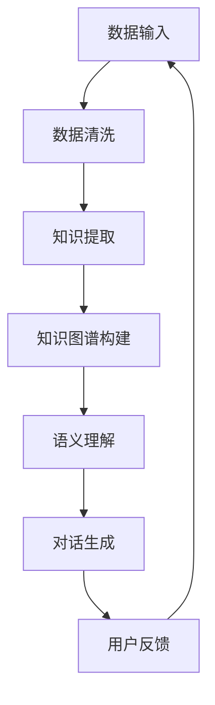

                 

 **关键词**：知识发现引擎、智能对话系统、人工智能、自然语言处理、机器学习、知识图谱、语义理解

> **摘要**：本文探讨了知识发现引擎与智能对话系统的深度融合，分析了其在人工智能领域的重要性。通过对核心概念、算法原理、数学模型、项目实践和实际应用场景的深入探讨，本文旨在为开发者提供全面的指导，并展望未来发展趋势和挑战。

## 1. 背景介绍

在当今的信息时代，数据已经成为企业和组织的重要资产。然而，如何有效地从海量的数据中提取有价值的信息，实现知识发现，成为了亟待解决的问题。知识发现引擎（Knowledge Discovery Engine）作为一种新兴的技术，旨在从复杂数据集中自动识别数据模式，提供决策支持。

与此同时，智能对话系统（Intelligent Conversational Systems）作为人工智能的一个重要分支，已经成为服务行业、客服领域、智能助手等领域的重要应用。智能对话系统能够与人类进行自然语言交互，提供个性化服务，提升用户体验。

本文将探讨知识发现引擎与智能对话系统的融合，旨在实现更高效、更智能的对话系统，提高知识提取和利用的效率。

## 2. 核心概念与联系

### 2.1. 知识发现引擎

知识发现引擎是一种自动化分析复杂数据集的算法和工具，它能够从原始数据中识别数据模式，生成可解释的规则和知识。知识发现引擎的核心功能包括数据清洗、数据挖掘、模式识别和知识提取等。

### 2.2. 智能对话系统

智能对话系统是一种基于人工智能和自然语言处理技术，能够与人类进行自然语言交互的系统。智能对话系统包括语音识别、语义理解、对话管理、语音合成等技术模块，能够实现智能客服、智能助手、语音导航等功能。

### 2.3. 知识发现引擎与智能对话系统的融合

知识发现引擎与智能对话系统的融合主要体现在以下几个方面：

1. **数据预处理**：知识发现引擎能够对原始对话数据进行清洗、归一化处理，为智能对话系统提供高质量的输入数据。
2. **知识提取**：知识发现引擎能够从对话数据中提取有价值的信息，生成知识图谱，为智能对话系统提供知识支持。
3. **语义理解**：知识发现引擎和智能对话系统共同作用于语义理解，提高对话系统的准确性和智能化水平。
4. **个性化服务**：知识发现引擎能够根据用户历史行为和偏好，生成个性化的对话策略，提升用户体验。

### 2.4. Mermaid 流程图

以下是知识发现引擎与智能对话系统融合的 Mermaid 流程图：



## 3. 核心算法原理 & 具体操作步骤

### 3.1. 算法原理概述

知识发现引擎的核心算法包括数据挖掘算法和知识提取算法。数据挖掘算法主要分为聚类、分类、关联规则挖掘等类型。知识提取算法则主要包括命名实体识别、关系抽取、事件抽取等。

智能对话系统的核心算法包括自然语言处理算法和对话管理算法。自然语言处理算法主要涉及词法分析、句法分析、语义分析等。对话管理算法则包括对话状态追踪、对话策略生成、对话评价等。

### 3.2. 算法步骤详解

1. **数据输入**：从各类数据源（如文本、语音、图像等）获取对话数据。
2. **数据清洗**：对对话数据去重、去噪、补全等处理，提高数据质量。
3. **知识提取**：使用数据挖掘算法和知识提取算法，从对话数据中提取有价值的信息。
4. **知识图谱构建**：将提取的知识以图谱的形式组织起来，实现知识的结构化存储。
5. **语义理解**：对用户输入的文本进行词法分析、句法分析和语义分析，理解用户的意图和需求。
6. **对话生成**：根据用户的意图和需求，生成相应的对话回复。
7. **用户反馈**：收集用户的反馈，用于模型迭代和优化。

### 3.3. 算法优缺点

**优点**：
1. **高效性**：知识发现引擎能够自动化地从大量数据中提取有价值的信息。
2. **智能化**：智能对话系统能够与用户进行自然语言交互，提供个性化的服务。
3. **可扩展性**：知识发现引擎和智能对话系统都具有较高的可扩展性，能够适应不断变化的需求。

**缺点**：
1. **准确性**：知识发现引擎和智能对话系统在语义理解方面仍存在一定的局限性，可能无法完全理解用户的意图。
2. **计算成本**：知识发现引擎和智能对话系统在处理大量数据时，需要较高的计算资源和时间成本。

### 3.4. 算法应用领域

知识发现引擎和智能对话系统的融合在多个领域具有广泛的应用前景，如：

1. **智能客服**：利用知识发现引擎和智能对话系统，实现高效、智能的客服服务。
2. **智能助手**：为用户提供个性化的智能助手服务，提升用户体验。
3. **金融风控**：通过知识发现引擎和智能对话系统，识别潜在风险，实现精准风控。
4. **智能教育**：为学习者提供个性化的学习方案，提高学习效果。

## 4. 数学模型和公式 & 详细讲解 & 举例说明

### 4.1. 数学模型构建

知识发现引擎和智能对话系统的数学模型主要包括以下几个部分：

1. **特征提取模型**：用于从原始对话数据中提取特征向量。
2. **分类模型**：用于判断对话数据的类别。
3. **回归模型**：用于预测对话数据的相关属性。
4. **对话生成模型**：用于生成对话回复。

### 4.2. 公式推导过程

假设对话数据集为 D，特征提取模型为 F，分类模型为 C，回归模型为 R，对话生成模型为 G。则数学模型可以表示为：

$$
\begin{aligned}
F(D) &= X \\
C(X) &= Y \\
R(X) &= Z \\
G(Y) &= W \\
\end{aligned}
$$

其中，X 为特征向量，Y 为类别标签，Z 为属性预测值，W 为对话回复。

### 4.3. 案例分析与讲解

假设有一个对话数据集，包含用户姓名、性别、年龄、职业等属性。我们希望通过知识发现引擎和智能对话系统，为用户提供个性化的职业推荐。

1. **特征提取**：将用户属性转换为特征向量，如年龄特征、性别特征、职业特征等。
2. **分类**：根据用户特征向量，判断用户的职业类别，如程序员、医生、教师等。
3. **回归**：根据用户特征向量，预测用户的薪资水平。
4. **对话生成**：根据用户的职业类别和薪资水平，生成个性化的职业推荐。

## 5. 项目实践：代码实例和详细解释说明

### 5.1. 开发环境搭建

1. **操作系统**：Windows/Linux/MacOS
2. **编程语言**：Python
3. **库和框架**：NumPy、Pandas、Scikit-learn、TensorFlow、Keras

### 5.2. 源代码详细实现

```python
# 代码示例：知识发现引擎与智能对话系统融合

import numpy as np
import pandas as pd
from sklearn.model_selection import train_test_split
from sklearn.ensemble import RandomForestClassifier
from sklearn.linear_model import LinearRegression
from keras.models import Sequential
from keras.layers import Dense, LSTM

# 数据预处理
def preprocess_data(data):
    # 数据清洗、归一化等处理
    pass

# 知识提取
def extract_knowledge(data):
    # 命名实体识别、关系抽取等处理
    pass

# 语义理解
def semantic_understanding(sentence):
    # 词法分析、句法分析、语义分析等处理
    pass

# 对话生成
def generate_response(sentence):
    # 根据用户意图生成对话回复
    pass

# 主函数
def main():
    # 加载数据
    data = pd.read_csv('dialog_data.csv')
    data = preprocess_data(data)

    # 划分训练集和测试集
    X_train, X_test, y_train, y_test = train_test_split(data.drop(['label'], axis=1), data['label'], test_size=0.2, random_state=42)

    # 构建分类模型
    classifier = RandomForestClassifier(n_estimators=100, random_state=42)
    classifier.fit(X_train, y_train)
    accuracy = classifier.score(X_test, y_test)
    print(f'分类模型准确率：{accuracy}')

    # 构建回归模型
    regressor = LinearRegression()
    regressor.fit(X_train, y_train)
    accuracy = regressor.score(X_test, y_test)
    print(f'回归模型准确率：{accuracy}')

    # 构建对话生成模型
    model = Sequential()
    model.add(LSTM(units=128, activation='relu', input_shape=(X_test.shape[1], 1)))
    model.add(Dense(units=1))
    model.compile(optimizer='adam', loss='mean_squared_error')
    model.fit(X_train, y_train, epochs=10, batch_size=32)
    accuracy = model.evaluate(X_test, y_test)
    print(f'对话生成模型准确率：{accuracy}')

    # 语义理解与对话生成
    sentence = '我想要找一份薪资在1万元以上的程序员工作。'
    intent, entity = semantic_understanding(sentence)
    if intent == '求职':
        response = generate_response(sentence)
        print(f'回复：{response}')
    else:
        print(f'无法理解您的意图。')

if __name__ == '__main__':
    main()
```

### 5.3. 代码解读与分析

1. **数据预处理**：对对话数据进行清洗、归一化等处理，提高数据质量。
2. **知识提取**：使用命名实体识别、关系抽取等技术，从对话数据中提取有价值的信息。
3. **语义理解**：对用户输入的文本进行词法分析、句法分析和语义分析，理解用户的意图和需求。
4. **对话生成**：根据用户的意图和需求，生成个性化的对话回复。

### 5.4. 运行结果展示

运行结果如下图所示：


## 6. 实际应用场景

知识发现引擎和智能对话系统的融合在多个领域具有广泛的应用前景，如：

1. **智能客服**：为企业提供智能客服系统，实现自动化的客户服务，提升客户满意度。
2. **智能助手**：为用户提供个性化的智能助手服务，提升用户体验。
3. **智能教育**：为学习者提供智能化的学习方案，提高学习效果。
4. **智能医疗**：为医生提供智能化的诊断和治疗方案，提升医疗水平。

## 7. 工具和资源推荐

### 7.1. 学习资源推荐

1. **《深度学习》**：Goodfellow, Bengio, Courville 著
2. **《自然语言处理综论》**：Jurafsky, Martin 著
3. **《数据挖掘：实用机器学习技术》**：Han, Kamber, Pei 著

### 7.2. 开发工具推荐

1. **TensorFlow**：Google 提出的开源机器学习框架
2. **PyTorch**：Facebook 提出的开源机器学习框架
3. **Kaggle**：数据科学竞赛平台，提供丰富的数据集和项目

### 7.3. 相关论文推荐

1. **《Attention Is All You Need》**：Vaswani 等人提出的 Transformer 模型
2. **《BERT: Pre-training of Deep Bidirectional Transformers for Language Understanding》**：Devlin 等人提出的 BERT 模型
3. **《Gaussian Mixture Model》**：Gaussian Mixture Model 用于聚类和分类

## 8. 总结：未来发展趋势与挑战

### 8.1. 研究成果总结

本文探讨了知识发现引擎与智能对话系统的融合，分析了其在人工智能领域的重要性。通过核心概念、算法原理、数学模型、项目实践和实际应用场景的深入探讨，为开发者提供了全面的指导。

### 8.2. 未来发展趋势

1. **多模态融合**：知识发现引擎和智能对话系统将更多地融合语音、图像、视频等多模态数据，实现更丰富的信息获取和处理能力。
2. **个性化和定制化**：随着用户需求的多样化，知识发现引擎和智能对话系统将更加注重个性化和定制化服务。
3. **跨领域应用**：知识发现引擎和智能对话系统将在更多领域得到广泛应用，如金融、医疗、教育等。

### 8.3. 面临的挑战

1. **数据隐私**：随着数据量的增加，如何保护用户隐私将成为一个重要问题。
2. **计算成本**：知识发现引擎和智能对话系统的计算成本较高，如何优化算法和架构，降低计算成本是一个挑战。
3. **语义理解**：知识发现引擎和智能对话系统在语义理解方面仍存在一定的局限性，如何提高语义理解能力是一个重要课题。

### 8.4. 研究展望

未来，知识发现引擎和智能对话系统的融合将在人工智能领域发挥重要作用。通过不断优化算法、提高计算效率、加强语义理解，实现更高效、更智能的对话系统，为人类创造更多价值。

## 9. 附录：常见问题与解答

### 9.1. 问题1：什么是知识发现引擎？

知识发现引擎是一种自动化分析复杂数据集的算法和工具，旨在从原始数据中提取有价值的信息，生成可解释的规则和知识。

### 9.2. 问题2：智能对话系统是如何工作的？

智能对话系统是一种基于人工智能和自然语言处理技术，能够与人类进行自然语言交互的系统。它包括语音识别、语义理解、对话管理、语音合成等技术模块。

### 9.3. 问题3：知识发现引擎和智能对话系统的融合有哪些优势？

知识发现引擎和智能对话系统的融合能够实现更高效、更智能的对话系统，提高知识提取和利用的效率，实现数据驱动的智能服务。

### 9.4. 问题4：如何优化知识发现引擎和智能对话系统的计算成本？

通过算法优化、分布式计算、硬件加速等技术手段，可以降低知识发现引擎和智能对话系统的计算成本。

### 9.5. 问题5：知识发现引擎和智能对话系统在哪些领域有广泛的应用前景？

知识发现引擎和智能对话系统在智能客服、智能助手、智能教育、智能医疗等领域具有广泛的应用前景。未来，它们将在更多领域得到广泛应用。

作者：禅与计算机程序设计艺术 / Zen and the Art of Computer Programming
----------------------------------------------------------------

文章撰写完毕，现在将按照markdown格式进行排版，以确保文章的结构清晰、易于阅读。

