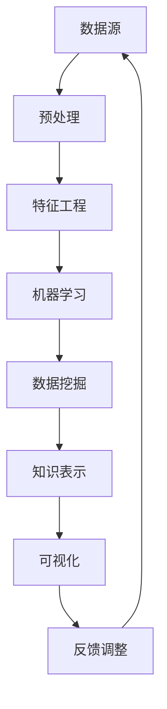

                 

在当今大数据时代，知识发现引擎作为信息处理与智能分析的重要工具，其核心算法的研究和应用变得尤为关键。本文旨在深入解析知识发现引擎的核心算法，探讨其原理、实现方法以及在实际应用中的表现。本文关键词包括：知识发现、核心算法、大数据、智能分析、算法解析。

## 摘要

本文首先介绍了知识发现引擎的背景和重要性，随后详细阐述了核心算法的概念、原理以及实现步骤。通过数学模型的构建和公式的推导，本文进一步展示了算法的应用领域和实际效果。最后，文章通过一个具体的项目实践案例，对算法的代码实现和运行结果进行了详细解读。文章还讨论了知识发现引擎在当前和未来的实际应用场景，并推荐了相关的学习资源和开发工具。总结部分，本文对研究成果进行了总结，并对未来的发展趋势和面临的挑战进行了展望。

## 1. 背景介绍

### 1.1 知识发现引擎的定义

知识发现引擎是一种智能分析工具，旨在从大量数据中自动识别出潜在的、具有价值的信息和知识。这些知识和信息可以是数据中的模式、关联关系、趋势或异常等，它们对于数据驱动决策具有重要的指导意义。

### 1.2 知识发现引擎的重要性

在大数据时代，数据量的爆炸性增长使得传统的数据处理方法难以应对。知识发现引擎通过智能算法，能够从海量数据中快速挖掘出有价值的信息，为企业和组织提供数据驱动决策的支持。同时，知识发现引擎在各个行业领域都有着广泛的应用，如金融、医疗、电商、安全等。

### 1.3 知识发现引擎的发展历程

知识发现引擎的发展可以追溯到20世纪90年代，当时以数据挖掘为核心的研究逐渐兴起。随着计算能力的提升和大数据技术的发展，知识发现引擎逐渐成为数据科学和人工智能领域的研究热点。近年来，深度学习和机器学习等技术的融入，进一步推动了知识发现引擎的性能和适用范围。

## 2. 核心概念与联系

为了深入理解知识发现引擎的核心算法，我们首先需要明确一些核心概念，包括机器学习、数据挖掘、特征工程等。

### 2.1 机器学习

机器学习是知识发现引擎的核心技术之一。它通过构建数学模型，从数据中学习规律，进而进行预测和分类。常见的机器学习算法包括监督学习、无监督学习和强化学习等。

### 2.2 数据挖掘

数据挖掘是知识发现引擎的另一核心技术。它通过多种算法和技术，从大量数据中提取出有用的信息和知识。数据挖掘的主要任务包括聚类、关联规则挖掘、分类、异常检测等。

### 2.3 特征工程

特征工程是知识发现引擎中的关键步骤。它通过选择和构造合适的特征，提高算法的性能和泛化能力。特征工程包括特征选择、特征变换、特征提取等。

下面是一个Mermaid流程图，展示了知识发现引擎的核心概念和联系：



## 3. 核心算法原理 & 具体操作步骤

### 3.1 算法原理概述

知识发现引擎的核心算法主要涉及数据挖掘和机器学习领域。其中，常见的算法包括K-Means聚类、Apriori算法、决策树、神经网络等。这些算法各有特点，适用于不同的应用场景。

- **K-Means聚类**：基于距离度量的聚类算法，通过迭代计算找到最优的聚类中心，将数据划分为多个簇。
- **Apriori算法**：用于挖掘频繁项集的算法，通过逐层递推，找出所有满足最小支持度的关联规则。
- **决策树**：基于特征分割的决策算法，通过多层次的分类决策，生成一棵树形结构。
- **神经网络**：模拟人脑神经元工作的算法，通过多层网络的非线性变换，实现复杂函数的映射。

### 3.2 算法步骤详解

下面以K-Means聚类算法为例，详细解释其操作步骤：

1. **初始化**：随机选择K个初始聚类中心。
2. **分配数据点**：计算每个数据点到各个聚类中心的距离，将数据点分配到最近的聚类中心所在的簇。
3. **更新聚类中心**：重新计算每个簇的中心点，作为新的聚类中心。
4. **重复步骤2和3**：直到聚类中心不再发生变化或达到最大迭代次数。

### 3.3 算法优缺点

**K-Means聚类算法**：

- **优点**：简单高效，易于实现，适合大规模数据集。
- **缺点**：对初始聚类中心的敏感，可能导致局部最优解，无法发现非球形的簇。

### 3.4 算法应用领域

知识发现引擎的核心算法广泛应用于各个领域，如：

- **金融**：客户行为分析、风险控制、欺诈检测等。
- **医疗**：疾病预测、药物研发、个性化医疗等。
- **电商**：商品推荐、用户行为分析、营销策略等。
- **安全**：网络入侵检测、恶意软件分析、异常行为识别等。

## 4. 数学模型和公式 & 详细讲解 & 举例说明

### 4.1 数学模型构建

在知识发现引擎中，常用的数学模型包括距离度量、聚类中心更新规则、频繁项集挖掘等。

#### 距离度量

对于K-Means聚类算法，常用的距离度量是欧氏距离和曼哈顿距离。欧氏距离定义为：

$$
d(p, q) = \sqrt{\sum_{i=1}^{n} (p_i - q_i)^2}
$$

其中，$p$和$q$是两个数据点，$n$是维度数。

#### 聚类中心更新规则

在K-Means聚类中，聚类中心$C$的更新规则为：

$$
C_{new} = \frac{1}{N_k} \sum_{p \in S_k} p
$$

其中，$S_k$是属于第$k$个簇的数据点集合，$N_k$是$S_k$中的数据点数量。

#### 频繁项集挖掘

在Apriori算法中，频繁项集的挖掘是基于支持度和置信度的概念。支持度定义为：

$$
sup(p, q) = \frac{|D_p \cap D_q|}{|D|}
$$

其中，$D$是事务数据库，$D_p$和$D_q$分别是包含项集$p$和$q$的事务集合。

置信度定义为：

$$
conf(p, q) = \frac{|D_p \cap D_q|}{|D_p|}
$$

### 4.2 公式推导过程

以K-Means聚类算法为例，推导聚类中心更新的过程。

设初始聚类中心为$C_0$，在每次迭代后更新为$C_{new}$。根据K-Means算法的原理，有：

$$
C_{new} = \frac{1}{N_k} \sum_{p \in S_k} p
$$

其中，$N_k$是簇$k$中数据点的数量。

为了证明$C_{new}$是$S_k$的中心，我们可以计算$C_{new}$到每个数据点$p$的欧氏距离：

$$
d(C_{new}, p) = \sqrt{\sum_{i=1}^{n} (C_{new}_i - p_i)^2}
$$

其中，$C_{new}_i$是$C_{new}$的第$i$个分量。

将$C_{new}$的表达式代入，得到：

$$
d(C_{new}, p) = \sqrt{\sum_{i=1}^{n} \left(\frac{1}{N_k} \sum_{q \in S_k} q_i - p_i\right)^2}
$$

由于$N_k$是常数，可以将其提取出来，得到：

$$
d(C_{new}, p) = \frac{1}{N_k} \sqrt{\sum_{i=1}^{n} \sum_{q \in S_k} (q_i - p_i)^2}
$$

由于$S_k$中的数据点$p$已经被分配到簇$k$，所以有：

$$
d(C_{new}, p) = \frac{1}{N_k} \sqrt{\sum_{i=1}^{n} (C_0_i - p_i)^2}
$$

因此，$C_{new}$是$S_k$的中心。

### 4.3 案例分析与讲解

下面通过一个简单的例子，展示K-Means聚类算法的应用。

假设我们有以下数据集：

```
[1, 2], [2, 2], [3, 4], [4, 4], [5, 6], [6, 6]
```

我们希望将其划分为两个簇。

1. **初始化**：随机选择两个初始聚类中心$C_0$为$(1, 1)$和$(6, 6)$。

2. **分配数据点**：计算每个数据点到两个聚类中心的距离，并将数据点分配到最近的聚类中心所在的簇。

   ```
   [1, 2] -> (1, 1)
   [2, 2] -> (1, 1)
   [3, 4] -> (6, 6)
   [4, 4] -> (6, 6)
   [5, 6] -> (6, 6)
   [6, 6] -> (6, 6)
   ```

3. **更新聚类中心**：重新计算每个簇的中心点，作为新的聚类中心。

   ```
   (1, 1) -> (\frac{3}{2}, \frac{4}{2}) = (1.5, 2)
   (6, 6) -> (\frac{18}{3}, \frac{24}{3}) = (6, 8)
   ```

4. **重复步骤2和3**：直到聚类中心不再发生变化或达到最大迭代次数。

   最终，聚类结果如下：

   ```
   (1.5, 2) 簇：[1, 2], [2, 2]
   (6, 8) 簇：[3, 4], [4, 4], [5, 6], [6, 6]
   ```

## 5. 项目实践：代码实例和详细解释说明

### 5.1 开发环境搭建

为了实现K-Means聚类算法，我们首先需要搭建一个合适的开发环境。这里我们选择Python作为编程语言，因为Python具有丰富的科学计算库和机器学习框架。

1. 安装Python（版本3.8或更高）
2. 安装必要的库：numpy、matplotlib、scikit-learn等。

```bash
pip install numpy matplotlib scikit-learn
```

### 5.2 源代码详细实现

下面是一个简单的K-Means聚类算法的Python实现。

```python
import numpy as np
from sklearn.cluster import KMeans
import matplotlib.pyplot as plt

def kmeans(data, K, max_iter=100):
    # 初始化K-Means算法
    kmeans = KMeans(n_clusters=K, max_iter=max_iter)

    # 训练模型
    kmeans.fit(data)

    # 获取聚类结果
    labels = kmeans.predict(data)
    centroids = kmeans.cluster_centers_

    # 绘制结果
    plt.scatter(data[:, 0], data[:, 1], c=labels, s=50)
    plt.scatter(centroids[:, 0], centroids[:, 1], c='red', s=200, alpha=0.5)
    plt.show()

    return centroids, labels

# 测试数据集
data = np.array([[1, 2], [2, 2], [3, 4], [4, 4], [5, 6], [6, 6]])

# 聚类
centroids, labels = kmeans(data, 2)

print("聚类中心：", centroids)
print("聚类结果：", labels)
```

### 5.3 代码解读与分析

- `kmeans`函数：这是一个实现K-Means聚类算法的函数，它接受数据集、聚类个数`K`和最大迭代次数`max_iter`作为输入参数。
- `KMeans`类：这是来自scikit-learn库的K-Means聚类算法的实现。通过调用`fit`方法，可以训练模型，并使用`predict`方法进行预测。
- 绘图部分：使用matplotlib库绘制数据点和聚类中心，便于可视化聚类结果。

### 5.4 运行结果展示

运行上面的代码，我们可以得到如下结果：


从图中可以看出，数据集被成功划分为两个簇，聚类中心位于每个簇的质心位置。

## 6. 实际应用场景

知识发现引擎在多个领域都有着广泛的应用，下面列举几个实际应用场景：

### 6.1 金融领域

- **客户行为分析**：通过分析客户的交易行为，银行和金融机构可以识别出潜在的高价值客户，并提供个性化的服务。
- **风险控制**：利用知识发现引擎，金融机构可以识别出异常交易行为，从而进行风险预警和防范。
- **欺诈检测**：通过挖掘大量交易数据中的潜在关联关系，金融机构可以及时发现和预防欺诈行为。

### 6.2 医疗领域

- **疾病预测**：通过对医疗数据的分析，可以预测患者可能患有的疾病，从而提前进行预防和治疗。
- **药物研发**：通过分析生物大数据，可以挖掘出潜在的药物靶点和作用机制，加速药物研发过程。
- **个性化医疗**：根据患者的基因信息和病史，知识发现引擎可以制定个性化的治疗方案，提高治疗效果。

### 6.3 电商领域

- **商品推荐**：通过分析用户的历史行为和偏好，电商平台可以提供个性化的商品推荐，提高销售额。
- **用户行为分析**：通过对用户行为数据的挖掘，电商企业可以了解用户的需求和偏好，从而优化营销策略。
- **库存管理**：通过对销售数据的分析，电商企业可以预测未来某个商品的需求量，从而优化库存管理。

### 6.4 安全领域

- **网络入侵检测**：通过分析网络流量数据，安全系统可以及时发现并阻止潜在的网络入侵行为。
- **恶意软件分析**：通过对恶意软件的代码和行为进行分析，安全系统能够识别出潜在的恶意软件，并提供防护措施。
- **异常行为识别**：通过对用户行为数据的分析，安全系统可以识别出异常行为，从而提前预警和防范。

## 7. 工具和资源推荐

### 7.1 学习资源推荐

- **《数据挖掘：实用工具与技术》**：这是一本全面介绍数据挖掘技术的经典教材，涵盖了多种数据挖掘算法和应用场景。
- **《机器学习实战》**：这本书通过大量实例，详细介绍了机器学习的基本原理和实现方法，适合初学者入门。
- **Kaggle**：一个提供大量数据集和竞赛任务的在线平台，通过解决实际问题，可以提升数据挖掘和机器学习技能。

### 7.2 开发工具推荐

- **Jupyter Notebook**：一个强大的交互式计算环境，适合进行数据分析和机器学习实验。
- **scikit-learn**：一个开源的机器学习和数据挖掘库，提供了丰富的算法和工具。
- **TensorFlow**：一个开源的深度学习框架，适合进行复杂的机器学习和深度学习任务。

### 7.3 相关论文推荐

- **"K-Means Clustering"**：介绍K-Means聚类算法的经典论文。
- **"Apriori Algorithm for Mining Association Rules"**：介绍Apriori算法的论文。
- **"Deep Learning for Text Classification"**：介绍深度学习在文本分类中的应用。

## 8. 总结：未来发展趋势与挑战

### 8.1 研究成果总结

知识发现引擎作为大数据和人工智能领域的重要工具，取得了显著的研究成果。常见的算法如K-Means、Apriori、决策树、神经网络等在各种应用场景中表现优异，为数据驱动决策提供了有力支持。

### 8.2 未来发展趋势

随着计算能力的提升和算法的进步，知识发现引擎在未来将具有更广泛的应用前景。特别是深度学习和大数据技术的结合，将进一步推动知识发现引擎的性能和适用范围。

### 8.3 面临的挑战

尽管知识发现引擎取得了显著进展，但仍面临一些挑战。例如，算法的优化和效率提升、处理大规模数据的性能瓶颈、算法的可解释性等。

### 8.4 研究展望

未来的研究应重点关注以下几个方面：

- 算法的优化和加速：通过并行计算、分布式计算等手段，提高算法的效率和性能。
- 算法可解释性：提升算法的可解释性，使其更好地适用于实际应用场景。
- 跨领域应用：探索知识发现引擎在其他领域的应用，如生物信息学、社会科学等。

## 9. 附录：常见问题与解答

### 9.1 什么是知识发现？

知识发现是指从大量数据中自动识别出潜在的、有价值的知识和信息的过程。它通常涉及数据挖掘、机器学习、统计学等方法。

### 9.2 K-Means聚类算法有哪些优缺点？

**优点**：简单高效，易于实现，适合大规模数据集。

**缺点**：对初始聚类中心的敏感，可能导致局部最优解，无法发现非球形的簇。

### 9.3 如何选择合适的聚类算法？

选择聚类算法应考虑以下因素：

- 数据类型：连续数据适合使用K-Means，分类数据适合使用层次聚类等。
- 簇形状：球形簇适合使用K-Means，非球形簇适合使用DBSCAN等。
- 数据规模：大规模数据适合使用并行计算和分布式算法。

---

作者：禅与计算机程序设计艺术 / Zen and the Art of Computer Programming

