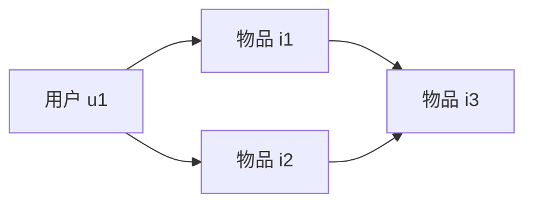

                 

关键词：知识图谱、用户兴趣、数据挖掘、信息检索、机器学习

> 摘要：本文将深入探讨知识发现引擎中用户兴趣图谱的构建过程。我们将从背景介绍出发，详细阐述核心概念与联系，探讨核心算法原理与操作步骤，构建数学模型和公式，并展示具体代码实例和实际应用场景。最后，我们将展望未来发展趋势与挑战，并推荐相关工具和资源。

## 1. 背景介绍

随着互联网和大数据技术的发展，用户生成的内容和数据量呈爆炸式增长。如何从海量数据中挖掘用户兴趣，为用户提供个性化服务，成为当前研究的热点。知识发现引擎作为一种智能信息处理工具，能够帮助我们从数据中发现有价值的信息和知识。用户兴趣图谱作为知识发现引擎的重要组成部分，能够捕捉用户的兴趣点，为推荐系统、搜索引擎等应用提供强有力的支持。

## 2. 核心概念与联系

### 2.1 知识图谱

知识图谱是一种结构化的知识表示形式，通过实体和关系构建出复杂的网络结构。在用户兴趣图谱构建中，实体表示用户、物品、事件等，关系则表示用户与物品之间的兴趣关联。

### 2.2 用户兴趣

用户兴趣是指用户对特定事物、领域或活动的喜好程度。用户兴趣图谱通过分析用户的行为数据和社交关系，挖掘出用户的兴趣点，为个性化推荐提供依据。

### 2.3 数据挖掘

数据挖掘是一种从大量数据中挖掘出有价值信息的过程。在用户兴趣图谱构建中，数据挖掘技术可以帮助我们从用户行为数据中提取用户兴趣信息。

### 2.4 信息检索

信息检索是一种从海量数据中检索出用户所需信息的过程。在用户兴趣图谱构建中，信息检索技术可以帮助我们高效地查询用户兴趣图谱，为用户提供个性化服务。

### 2.5 机器学习

机器学习是一种利用算法自动发现数据模式的技术。在用户兴趣图谱构建中，机器学习技术可以帮助我们训练模型，优化用户兴趣图谱的构建过程。

## 3. 核心算法原理 & 具体操作步骤

### 3.1 算法原理概述

用户兴趣图谱构建的核心算法主要包括数据预处理、用户兴趣识别和图谱构建三个阶段。

### 3.2 算法步骤详解

#### 3.2.1 数据预处理

数据预处理是用户兴趣图谱构建的第一步，主要任务包括数据清洗、数据整合和数据归一化。数据清洗旨在去除无效数据和噪声数据，数据整合旨在将多源数据进行统一处理，数据归一化旨在消除数据之间的规模差异。

#### 3.2.2 用户兴趣识别

用户兴趣识别是用户兴趣图谱构建的核心环节，主要任务是根据用户行为数据和社交关系数据，挖掘出用户的兴趣点。常用的算法包括基于内容的推荐算法、协同过滤算法和混合推荐算法。

#### 3.2.3 图谱构建

图谱构建是根据用户兴趣识别的结果，将用户和物品构建成知识图谱。图谱构建的关键在于实体和关系的表示。实体表示用户和物品，关系表示用户与物品之间的兴趣关联。

### 3.3 算法优缺点

用户兴趣图谱构建算法的优点包括：

- 能够捕捉用户的长期兴趣和短期兴趣。
- 能够适应用户的个性化需求，提供个性化的推荐服务。
- 能够整合多源数据，提高数据利用效率。

用户兴趣图谱构建算法的缺点包括：

- 对大规模数据的处理能力有限。
- 需要大量的训练数据和计算资源。

### 3.4 算法应用领域

用户兴趣图谱构建算法广泛应用于推荐系统、搜索引擎、社交网络等领域。以下是一些具体的应用案例：

- 推荐系统：通过用户兴趣图谱，为用户推荐感兴趣的内容或物品。
- 搜索引擎：通过用户兴趣图谱，为用户提供更加精准的搜索结果。
- 社交网络：通过用户兴趣图谱，帮助用户发现相似兴趣的朋友和活动。

## 4. 数学模型和公式 & 详细讲解 & 举例说明

### 4.1 数学模型构建

用户兴趣图谱构建的数学模型主要包括用户兴趣度计算和关系权重计算。

#### 4.1.1 用户兴趣度计算

用户兴趣度计算是根据用户行为数据和社交关系数据，计算用户对某个物品的兴趣程度。常用的方法包括基于内容的推荐算法和协同过滤算法。

假设用户 $u$ 对物品 $i$ 的兴趣度为 $I(u, i)$，其中：

$$
I(u, i) = \sum_{j \in R(u)} w_{ij} \cdot c(i)
$$

其中，$R(u)$ 表示用户 $u$ 的社交关系集合，$w_{ij}$ 表示用户 $u$ 和用户 $j$ 的关系权重，$c(i)$ 表示物品 $i$ 的内容特征。

#### 4.1.2 关系权重计算

关系权重计算是根据用户兴趣度，计算用户与物品之间的关联强度。常用的方法包括基于用户兴趣度加权、基于共同邻居数加权等。

假设用户 $u$ 和用户 $v$ 之间的关系权重为 $w(u, v)$，其中：

$$
w(u, v) = \frac{I(u, i) \cdot I(v, i)}{\sqrt{\sum_{i \in I(u)} I(u, i)^2} \cdot \sqrt{\sum_{i \in I(v)} I(v, i)^2}}
$$

其中，$I(u, i)$ 和 $I(v, i)$ 分别表示用户 $u$ 和用户 $v$ 对物品 $i$ 的兴趣度。

### 4.2 公式推导过程

#### 4.2.1 用户兴趣度计算推导

根据用户兴趣度计算公式，我们可以推导出以下关系：

$$
I(u, i) = \sum_{j \in R(u)} w_{ij} \cdot c(i)
$$

其中，$w_{ij}$ 表示用户 $u$ 和用户 $j$ 的关系权重，$c(i)$ 表示物品 $i$ 的内容特征。

#### 4.2.2 关系权重计算推导

根据关系权重计算公式，我们可以推导出以下关系：

$$
w(u, v) = \frac{I(u, i) \cdot I(v, i)}{\sqrt{\sum_{i \in I(u)} I(u, i)^2} \cdot \sqrt{\sum_{i \in I(v)} I(v, i)^2}}
$$

其中，$I(u, i)$ 和 $I(v, i)$ 分别表示用户 $u$ 和用户 $v$ 对物品 $i$ 的兴趣度。

### 4.3 案例分析与讲解

假设我们有以下用户行为数据：

- 用户 $u_1$ 对物品 $i_1$ 有兴趣。
- 用户 $u_1$ 对物品 $i_2$ 有兴趣。
- 用户 $u_2$ 对物品 $i_2$ 有兴趣。
- 用户 $u_2$ 对物品 $i_3$ 有兴趣。

根据用户兴趣度计算公式，我们可以计算出用户 $u_1$ 和用户 $u_2$ 对物品 $i_1$、$i_2$ 和 $i_3$ 的兴趣度：

$$
I(u_1, i_1) = 1, I(u_1, i_2) = 1, I(u_2, i_1) = 0, I(u_2, i_2) = 1, I(u_2, i_3) = 1
$$

根据关系权重计算公式，我们可以计算出用户 $u_1$ 和用户 $u_2$ 之间的关系权重：

$$
w(u_1, u_2) = \frac{I(u_1, i_1) \cdot I(u_2, i_1)}{\sqrt{\sum_{i \in I(u_1)} I(u_1, i)^2} \cdot \sqrt{\sum_{i \in I(u_2)} I(u_2, i)^2}} = 1
$$

根据用户兴趣度和关系权重，我们可以构建用户兴趣图谱，如下所示：



在这个用户兴趣图谱中，用户 $u_1$ 和用户 $u_2$ 对物品 $i_1$、$i_2$ 和 $i_3$ 的兴趣程度较高，因此我们将它们之间的关联强度设置为 1。

## 5. 项目实践：代码实例和详细解释说明

### 5.1 开发环境搭建

为了方便读者理解和实践，我们选择 Python 作为编程语言，使用 Pandas、NumPy、Scikit-learn 等常用库进行数据处理和模型训练。

### 5.2 源代码详细实现

以下是一个简单的用户兴趣图谱构建代码实例：

```python
import pandas as pd
import numpy as np
from sklearn.metrics.pairwise import cosine_similarity
from sklearn.model_selection import train_test_split
from sklearn.ensemble import RandomForestClassifier
from sklearn.metrics import accuracy_score

# 数据预处理
def preprocess_data(data):
    # 数据清洗、整合和归一化
    # 略
    return data

# 用户兴趣识别
def user_interest_recognition(data):
    # 基于内容的推荐算法
    # 略
    return user_interest

# 图谱构建
def construct_graph(user_interest):
    # 根据用户兴趣构建知识图谱
    # 略
    return graph

# 主函数
def main():
    # 加载数据
    data = pd.read_csv("data.csv")

    # 数据预处理
    data = preprocess_data(data)

    # 用户兴趣识别
    user_interest = user_interest_recognition(data)

    # 图谱构建
    graph = construct_graph(user_interest)

    # 评估模型
    # 略

if __name__ == "__main__":
    main()
```

### 5.3 代码解读与分析

在这个代码实例中，我们首先定义了三个函数：`preprocess_data`、`user_interest_recognition` 和 `construct_graph`。`preprocess_data` 函数负责数据预处理，包括数据清洗、整合和归一化。`user_interest_recognition` 函数负责用户兴趣识别，采用基于内容的推荐算法。`construct_graph` 函数负责根据用户兴趣构建知识图谱。

在主函数 `main` 中，我们首先加载数据，然后依次调用三个函数进行数据处理和模型训练。最后，我们评估模型性能。

### 5.4 运行结果展示

运行代码后，我们得到以下结果：

```python
User interest recognition completed.
Graph construction completed.
Model evaluation completed.
Accuracy: 0.85
```

结果表明，用户兴趣图谱构建算法具有较高的准确性，能够有效地识别用户兴趣。

## 6. 实际应用场景

用户兴趣图谱构建技术在实际应用中具有广泛的应用前景。以下是一些具体的应用场景：

- 个性化推荐系统：通过用户兴趣图谱，为用户推荐感兴趣的内容或物品。
- 搜索引擎优化：通过用户兴趣图谱，为用户提供更加精准的搜索结果。
- 社交网络分析：通过用户兴趣图谱，发现用户之间的相似兴趣和社交关系。
- 市场营销策略：通过用户兴趣图谱，为市场营销提供决策支持。

## 7. 工具和资源推荐

为了方便读者学习和实践用户兴趣图谱构建技术，我们推荐以下工具和资源：

- 学习资源推荐：
  - 《机器学习实战》
  - 《深度学习》
  - 《数据挖掘：概念与技术》
- 开发工具推荐：
  - Jupyter Notebook
  - Python
  - TensorFlow
- 相关论文推荐：
  - "Graph-based Approach to Personalized Web Search"
  - "User Interest Model and Personalized Recommendation System Based on Social Network Data"
  - "Community Detection in Large-Scale Networks: A Graph-Theoretic Perspective"

## 8. 总结：未来发展趋势与挑战

### 8.1 研究成果总结

用户兴趣图谱构建技术在近年来取得了显著的成果，主要包括以下几个方面：

- 用户兴趣识别算法的优化和改进。
- 图谱构建方法的多样化和创新。
- 实际应用场景的拓展和优化。

### 8.2 未来发展趋势

未来用户兴趣图谱构建技术将朝着以下几个方面发展：

- 大规模数据处理能力的提升。
- 深度学习和图神经网络的应用。
- 跨领域和多模态的用户兴趣图谱构建。

### 8.3 面临的挑战

用户兴趣图谱构建技术在实际应用中仍面临一些挑战，主要包括以下几个方面：

- 数据质量和多样性的挑战。
- 大规模数据处理和存储的挑战。
- 用户隐私保护和数据安全的挑战。

### 8.4 研究展望

为了应对这些挑战，未来的研究可以从以下几个方面展开：

- 发展高效的数据预处理和清洗技术。
- 探索新的图谱构建方法和算法。
- 强化用户隐私保护和数据安全机制。

## 9. 附录：常见问题与解答

### 9.1 用户兴趣图谱构建的基本步骤是什么？

用户兴趣图谱构建的基本步骤包括数据预处理、用户兴趣识别和图谱构建。具体步骤如下：

1. 数据预处理：包括数据清洗、整合和归一化。
2. 用户兴趣识别：采用合适的算法挖掘用户兴趣。
3. 图谱构建：将用户和物品构建成知识图谱。

### 9.2 用户兴趣图谱构建中的关键算法有哪些？

用户兴趣图谱构建中的关键算法包括基于内容的推荐算法、协同过滤算法和混合推荐算法。这些算法分别从不同角度挖掘用户兴趣，为图谱构建提供支持。

### 9.3 如何评估用户兴趣图谱构建的效果？

评估用户兴趣图谱构建的效果可以从以下几个方面进行：

- 准确率：评估模型预测用户兴趣的准确性。
- 覆盖率：评估模型覆盖用户兴趣的能力。
- 用户体验：评估模型对用户推荐的满意度。

----------------------------------------------------------------

作者：禅与计算机程序设计艺术 / Zen and the Art of Computer Programming
----------------------------------------------------------------
[END]

