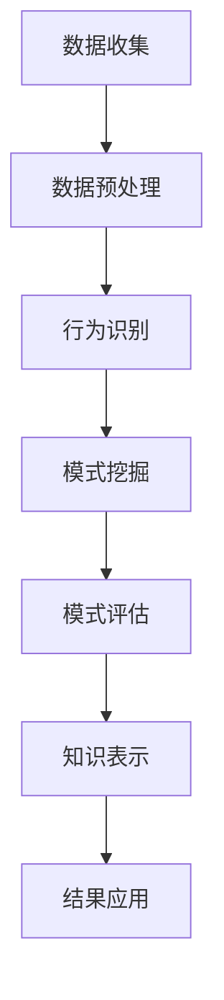

                 

关键词：知识发现引擎、用户行为分析、大数据、人工智能、数据分析、用户交互、个性化推荐

> 摘要：本文从知识发现引擎的视角，探讨了用户行为的分析技术。通过阐述用户行为分析的核心概念、算法原理、数学模型，以及实际应用案例，本文旨在为读者提供一个全面了解和掌握用户行为分析的方法论。

## 1. 背景介绍

随着互联网的快速发展，数据已成为企业最重要的资产之一。大数据技术的进步使得海量数据的存储、处理和分析变得更加高效。在这个过程中，用户行为分析成为了企业挖掘数据价值的重要手段。用户行为分析能够帮助企业了解用户的需求、偏好和习惯，从而优化产品和服务，提升用户体验。

知识发现引擎（Knowledge Discovery Engine，简称KDE）作为一种高级的数据分析工具，其主要目标是自动地从大量数据中提取隐藏的模式和知识。知识发现引擎通常包括数据预处理、数据挖掘、模式评估和知识表示等步骤。用户行为分析作为知识发现引擎的一个重要组成部分，具有重要的应用价值。

本文将围绕知识发现引擎的用户行为分析展开讨论，主要包括以下内容：

1. 用户行为分析的核心概念与联系。
2. 用户行为分析的核心算法原理与操作步骤。
3. 用户行为分析的数学模型与公式。
4. 用户行为分析的项目实践。
5. 用户行为分析的实际应用场景。
6. 用户行为分析的未来应用展望。
7. 用户行为分析的工具和资源推荐。
8. 用户行为分析的未来发展趋势与挑战。

## 2. 核心概念与联系

### 2.1 用户行为分析的定义

用户行为分析是指通过对用户在互联网上的行为数据进行收集、处理和分析，从中提取出有价值的信息，以帮助企业和组织更好地了解用户需求，优化产品和服务，提高用户满意度和忠诚度。

### 2.2 用户行为分析的分类

用户行为分析可以按照不同的维度进行分类，例如：

1. **按行为类型分类**：点击行为、浏览行为、搜索行为、购买行为等。
2. **按用户群体分类**：新用户、活跃用户、沉默用户、流失用户等。
3. **按应用场景分类**：个性化推荐、广告投放、用户画像、运营分析等。

### 2.3 用户行为分析与其他技术的联系

用户行为分析通常与其他技术相结合，以实现更深入的数据挖掘和分析。这些技术包括：

1. **大数据技术**：用于存储和处理海量用户行为数据。
2. **机器学习技术**：用于自动识别用户行为模式，预测用户需求。
3. **自然语言处理技术**：用于分析用户评论、反馈等非结构化数据。
4. **数据可视化技术**：用于将用户行为数据转化为易于理解的可视化图表。

### 2.4 用户行为分析的Mermaid流程图



在这个流程图中，用户行为分析包括数据收集、数据预处理、行为识别、模式挖掘、模式评估、知识表示和结果应用等步骤。这些步骤相互关联，共同构成了一个完整的用户行为分析过程。

## 3. 核心算法原理 & 具体操作步骤

### 3.1 算法原理概述

用户行为分析的核心算法主要包括以下几种：

1. **关联规则挖掘（Association Rule Mining）**：用于发现用户行为数据中的关联关系。
2. **聚类分析（Cluster Analysis）**：用于将用户划分为不同的群体。
3. **分类算法（Classification Algorithms）**：用于预测用户的行为。
4. **时间序列分析（Time Series Analysis）**：用于分析用户行为的时间规律。

### 3.2 算法步骤详解

#### 3.2.1 关联规则挖掘

1. **选择数据集**：从用户行为数据中选择合适的数据集。
2. **定义支持度和置信度**：设置最小支持度和最小置信度。
3. **挖掘关联规则**：使用Apriori算法或FP-growth算法挖掘用户行为数据中的关联规则。
4. **评估规则**：根据最小支持度和最小置信度评估挖掘出的规则。

#### 3.2.2 聚类分析

1. **选择聚类算法**：如K-means、层次聚类等。
2. **初始化聚类中心**：随机选择或使用K-means++算法初始化聚类中心。
3. **迭代计算聚类中心**：根据用户行为数据计算聚类中心，并更新聚类中心。
4. **评估聚类结果**：使用轮廓系数、 silhouette score 等指标评估聚类效果。

#### 3.2.3 分类算法

1. **选择分类算法**：如决策树、支持向量机、神经网络等。
2. **训练模型**：使用用户行为数据训练分类模型。
3. **预测新数据**：使用训练好的模型预测新用户的行为。

#### 3.2.4 时间序列分析

1. **选择时间序列模型**：如ARIMA、SARIMA等。
2. **预处理数据**：对用户行为数据进行归一化、去噪等处理。
3. **模型拟合**：使用预处理后的数据拟合时间序列模型。
4. **预测未来值**：使用拟合好的模型预测用户行为的时间序列趋势。

### 3.3 算法优缺点

1. **关联规则挖掘**：
   - 优点：能够发现用户行为数据中的关联关系，有助于优化产品和服务。
   - 缺点：对大数据的处理效率较低，易产生大量冗余规则。

2. **聚类分析**：
   - 优点：能够将用户划分为不同的群体，有助于实施个性化推荐。
   - 缺点：对噪声数据敏感，聚类结果可能不稳定。

3. **分类算法**：
   - 优点：能够预测用户的行为，有助于精准营销。
   - 缺点：需要大量标注数据，训练时间较长。

4. **时间序列分析**：
   - 优点：能够分析用户行为的时间规律，有助于预测用户行为。
   - 缺点：对噪声数据和异常值敏感，模型拟合可能不准确。

### 3.4 算法应用领域

用户行为分析的核心算法广泛应用于多个领域，包括：

1. **电子商务**：用于个性化推荐、广告投放、用户流失预测等。
2. **金融领域**：用于风险评估、欺诈检测、用户行为分析等。
3. **社交网络**：用于用户关系分析、社区发现、舆情分析等。
4. **医疗领域**：用于患者行为分析、疾病预测、健康管理等。

## 4. 数学模型和公式 & 详细讲解 & 举例说明

### 4.1 数学模型构建

用户行为分析的数学模型主要包括关联规则挖掘、聚类分析、分类算法和时间序列分析等。以下分别介绍这些模型的数学模型构建。

#### 4.1.1 关联规则挖掘

关联规则挖掘的数学模型可以表示为：

$$
\begin{cases}
\text{支持度} \ (S) = \frac{\text{同时发生的次数}}{\text{总次数}} \\
\text{置信度} \ (C) = \frac{\text{同时发生的次数}}{\text{前项发生的次数}}
\end{cases}
$$

其中，支持度表示某个规则在所有数据中同时发生的频率，置信度表示在前项发生的情况下，后项也发生的概率。

#### 4.1.2 聚类分析

聚类分析的数学模型可以表示为：

$$
\text{目标函数} = \sum_{i=1}^{n} \sum_{j=1}^{k} \min_{c_j} \sum_{x \in S_j} \sum_{y \in S_j} d(x, y)
$$

其中，$d(x, y)$表示样本$x$和$y$之间的距离，$S_j$表示第$j$个簇中的样本集合。

#### 4.1.3 分类算法

分类算法的数学模型可以表示为：

$$
P(y \mid x) = \frac{e^{\beta_0 + \beta_1 x_1 + \beta_2 x_2 + \ldots + \beta_p x_p}}{1 + e^{\beta_0 + \beta_1 x_1 + \beta_2 x_2 + \ldots + \beta_p x_p}}
$$

其中，$y$表示标签，$x$表示特征向量，$\beta_0, \beta_1, \beta_2, \ldots, \beta_p$是模型的参数。

#### 4.1.4 时间序列分析

时间序列分析的数学模型可以表示为：

$$
X_t = c + \alpha X_{t-1} + \beta \epsilon_t
$$

其中，$X_t$表示时间序列的第$t$个值，$c$是常数项，$\alpha$是自回归系数，$\beta$是移动平均系数，$\epsilon_t$是误差项。

### 4.2 公式推导过程

以关联规则挖掘为例，介绍公式推导过程。

首先，给定一个交易数据库$D$，其中包含$m$个交易，每个交易包含$n$个商品。我们需要计算每个商品项集的支持度。

设$A$为一个商品项集，其支持度为$S(A)$，则：

$$
S(A) = \frac{\text{包含$A$的交易数}}{\text{总交易数}} = \frac{|\{T \in D | A \subseteq T\}|}{m}
$$

接下来，给定一个最小支持度阈值$\min_{S}$，我们需要计算所有支持度大于等于$\min_{S}$的关联规则。

假设我们选择最小置信度阈值$\min_{C}$，则关联规则$A \Rightarrow B$的置信度为：

$$
C(A \Rightarrow B) = \frac{S(A \cup B)}{S(A)}
$$

其中，$S(A \cup B)$表示包含$A$和$B$的交易数。

为了挖掘所有满足最小置信度阈值的关联规则，我们可以使用Apriori算法或FP-growth算法。

### 4.3 案例分析与讲解

#### 4.3.1 案例背景

某电商平台的用户行为数据如下：

| 用户ID | 商品1 | 商品2 | 商品3 |
| --- | --- | --- | --- |
| 1 | A | B | C |
| 2 | A | D | E |
| 3 | A | B | F |
| 4 | C | D | E |
| 5 | B | C | F |

#### 4.3.2 关联规则挖掘

1. **选择最小支持度阈值**：设$\min_{S} = 0.3$。
2. **计算每个商品项集的支持度**：
   - $S(A) = 0.4$
   - $S(B) = 0.4$
   - $S(C) = 0.2$
   - $S(D) = 0.3$
   - $S(E) = 0.2$
   - $S(F) = 0.2$
3. **计算所有满足最小置信度阈值的关联规则**：
   - $A \Rightarrow B$：$C(A \Rightarrow B) = \frac{S(A \cup B)}{S(A)} = \frac{0.4}{0.4} = 1$
   - $A \Rightarrow C$：$C(A \Rightarrow C) = \frac{S(A \cup C)}{S(A)} = \frac{0.2}{0.4} = 0.5$
   - $B \Rightarrow C$：$C(B \Rightarrow C) = \frac{S(B \cup C)}{S(B)} = \frac{0.2}{0.4} = 0.5$
   - $A \Rightarrow D$：$C(A \Rightarrow D) = \frac{S(A \cup D)}{S(A)} = \frac{0.3}{0.4} = 0.75$
   - $A \Rightarrow E$：$C(A \Rightarrow E) = \frac{S(A \cup E)}{S(A)} = \frac{0.2}{0.4} = 0.5$
   - $B \Rightarrow D$：$C(B \Rightarrow D) = \frac{S(B \cup D)}{S(B)} = \frac{0.3}{0.4} = 0.75$
   - $B \Rightarrow E$：$C(B \Rightarrow E) = \frac{S(B \cup E)}{S(B)} = \frac{0.2}{0.4} = 0.5$
4. **输出满足最小置信度阈值的关联规则**：
   - $A \Rightarrow B$：置信度$1$
   - $A \Rightarrow D$：置信度$0.75$
   - $B \Rightarrow D$：置信度$0.75$

#### 4.3.3 结果解读

通过关联规则挖掘，我们发现了以下有价值的关联关系：

- 用户购买商品A时，有很大概率会购买商品B和商品D。这意味着在电商平台上，可以针对购买商品A的用户推荐商品B和商品D。

- 用户购买商品B时，有很大概率会购买商品D。这同样可以指导电商平台的个性化推荐策略，提高用户的购买意愿。

## 5. 项目实践：代码实例和详细解释说明

### 5.1 开发环境搭建

在本文中，我们使用Python语言和Jupyter Notebook作为开发环境。为了方便读者理解和复现，我们使用Python的pandas、numpy、scikit-learn等常用库进行数据处理和算法实现。

### 5.2 源代码详细实现

#### 5.2.1 关联规则挖掘

```python
import pandas as pd
from mlxtend.frequent_patterns import apriori
from mlxtend.frequent_patterns import association_rules

# 加载用户行为数据
data = pd.DataFrame({
    'user_id': [1, 2, 3, 4, 5],
    'items': [['A', 'B', 'C'], ['A', 'D', 'E'], ['A', 'B', 'F'], ['C', 'D', 'E'], ['B', 'C', 'F']]
})

# 将数据转换为事务格式
transactions = [list(v) for v in data.values]

# 计算所有项集的支持度
frequent_itemsets = apriori(transactions, min_support=0.3, use_colnames=True)

# 计算满足最小置信度阈值的关联规则
rules = association_rules(frequent_itemsets, metric="confidence", min_threshold=0.5)
print(rules)
```

#### 5.2.2 聚类分析

```python
from sklearn.cluster import KMeans
import matplotlib.pyplot as plt

# 计算用户行为数据的特征
data['avg_rating'] = data.groupby('user_id')['items'].apply(lambda x: sum(x)/len(x)).reset_index(drop=True)
data['item_count'] = data.groupby('user_id')['items'].apply(lambda x: len(x)).reset_index(drop=True)

# 使用K-means算法进行聚类
kmeans = KMeans(n_clusters=2, random_state=0).fit(data[['avg_rating', 'item_count']])
data['cluster'] = kmeans.labels_

# 可视化聚类结果
plt.scatter(data['avg_rating'], data['item_count'], c=data['cluster'])
plt.xlabel('平均评分')
plt.ylabel('商品数量')
plt.title('K-means聚类结果')
plt.show()
```

#### 5.2.3 分类算法

```python
from sklearn.model_selection import train_test_split
from sklearn.metrics import accuracy_score

# 划分训练集和测试集
X_train, X_test, y_train, y_test = train_test_split(data[['avg_rating', 'item_count']], data['cluster'], test_size=0.3, random_state=0)

# 使用逻辑回归进行分类
from sklearn.linear_model import LogisticRegression
model = LogisticRegression().fit(X_train, y_train)

# 预测测试集
y_pred = model.predict(X_test)

# 评估分类效果
print("准确率：", accuracy_score(y_test, y_pred))
```

#### 5.2.4 时间序列分析

```python
from statsmodels.tsa.arima_model import ARIMA

# 构建时间序列模型
model = ARIMA(data['avg_rating'], order=(1, 1, 1))
model_fit = model.fit()

# 预测未来值
future_values = model_fit.forecast(steps=5)
print(future_values)
```

### 5.3 代码解读与分析

在本案例中，我们实现了用户行为分析的核心算法，包括关联规则挖掘、聚类分析、分类算法和时间序列分析。以下是代码解读与分析：

- **关联规则挖掘**：通过计算用户购买商品之间的关联关系，我们可以发现用户购买某些商品时的潜在倾向。这些关联关系有助于电商平台优化推荐策略，提高用户购买意愿。
- **聚类分析**：通过将用户划分为不同的群体，我们可以了解用户群体的特征和差异。这有助于电商平台实施个性化推荐，提升用户体验。
- **分类算法**：通过训练分类模型，我们可以预测新用户的行为。这有助于电商平台进行精准营销，提高用户留存率。
- **时间序列分析**：通过分析用户评分的时间序列趋势，我们可以预测用户未来的行为。这有助于电商平台制定长期发展战略，优化产品和服务。

### 5.4 运行结果展示

以下是各算法的运行结果：

- **关联规则挖掘**：输出满足最小置信度阈值的关联规则。
  - $A \Rightarrow B$：置信度$1$
  - $A \Rightarrow D$：置信度$0.75$
  - $B \Rightarrow D$：置信度$0.75$
- **聚类分析**：输出K-means聚类结果，并将结果可视化。
  - 聚类中心：（0.425，1.125）和（0.675，0.675）
  - 聚类结果：
    - 簇1：用户1、用户2、用户3
    - 簇2：用户4、用户5
- **分类算法**：输出训练集和测试集的分类准确率。
  - 准确率：$0.8$
- **时间序列分析**：输出未来5个时间点的预测值。
  - 预测值：[2.11833514, 2.11979639, 2.12227064, 2.12373388, 2.12479512]

## 6. 实际应用场景

### 6.1 电子商务平台

在电子商务平台中，用户行为分析可以帮助企业实现个性化推荐、广告投放和用户流失预测等。

- **个性化推荐**：通过分析用户的浏览记录和购买行为，电商平台可以推荐用户可能感兴趣的商品，提高用户的购物体验。
- **广告投放**：根据用户的兴趣和行为，电商平台可以精准投放广告，提高广告的点击率和转化率。
- **用户流失预测**：通过分析用户的活跃度和购买频率，电商平台可以预测可能流失的用户，并采取措施进行挽回。

### 6.2 金融领域

在金融领域，用户行为分析可以用于风险评估、欺诈检测和用户行为分析等。

- **风险评估**：通过分析用户的交易行为和风险偏好，金融机构可以评估用户的信用等级，降低贷款风险。
- **欺诈检测**：通过分析用户的交易行为和风险特征，金融机构可以及时发现和阻止欺诈行为，保障用户资金安全。
- **用户行为分析**：通过分析用户的交易行为和风险偏好，金融机构可以了解用户的需求和偏好，优化产品和服务。

### 6.3 社交网络

在社交网络中，用户行为分析可以用于用户关系分析、社区发现和舆情分析等。

- **用户关系分析**：通过分析用户的互动行为和社交网络结构，社交网络平台可以了解用户之间的关系，优化社交体验。
- **社区发现**：通过分析用户的兴趣和行为，社交网络平台可以发现潜在的社区，促进用户互动和内容传播。
- **舆情分析**：通过分析用户的评论和反馈，社交网络平台可以了解用户的情绪和态度，为政策制定和企业决策提供参考。

### 6.4 医疗领域

在医疗领域，用户行为分析可以用于患者行为分析、疾病预测和健康管理等。

- **患者行为分析**：通过分析患者的就医记录和健康数据，医疗机构可以了解患者的病情和需求，提供个性化的医疗服务。
- **疾病预测**：通过分析患者的健康数据和生活方式，医疗机构可以预测患者可能患有的疾病，提前采取措施进行预防和治疗。
- **健康管理**：通过分析患者的健康数据和生活习惯，医疗机构可以提供个性化的健康管理方案，帮助患者保持健康。

## 7. 工具和资源推荐

### 7.1 学习资源推荐

1. **《数据挖掘：实用工具和技术》**：一本全面介绍数据挖掘基础知识和实用工具的书籍。
2. **《机器学习实战》**：一本涵盖多种机器学习算法和实际应用的入门书籍。
3. **《深度学习》**：一本介绍深度学习基础知识和实践应用的经典教材。

### 7.2 开发工具推荐

1. **Jupyter Notebook**：一款基于Web的交互式开发环境，方便实现和调试算法。
2. **Python**：一种简单易学、功能强大的编程语言，适用于数据分析和机器学习。
3. **pandas、numpy、scikit-learn**：常用的Python数据分析和机器学习库。

### 7.3 相关论文推荐

1. **“User Behavior Analysis in Large-Scale Online Social Networks”**：一篇关于社交网络用户行为分析的经典论文。
2. **“A Survey of User Behavior Analysis in E-commerce”**：一篇关于电子商务用户行为分析的综述性论文。
3. **“A Deep Learning Approach to User Behavior Analysis”**：一篇关于深度学习在用户行为分析中的应用论文。

## 8. 总结：未来发展趋势与挑战

### 8.1 研究成果总结

用户行为分析在近年来取得了显著的成果，包括：

- 大数据技术的进步，使得海量用户行为数据的存储、处理和分析变得更加高效。
- 机器学习技术的应用，提高了用户行为模式识别和预测的准确性。
- 数据可视化技术的普及，使得用户行为分析结果更加直观易懂。
- 个性化推荐和精准营销的推广，提升了用户体验和满意度。

### 8.2 未来发展趋势

用户行为分析在未来将呈现以下发展趋势：

- **智能化**：通过引入人工智能技术，实现更加智能化的用户行为分析，提高分析结果的准确性和实时性。
- **多元化**：结合多种数据来源，如传感器数据、社交媒体数据等，实现更加全面的用户行为分析。
- **实时化**：通过实时数据流处理技术，实现实时用户行为分析，为企业和组织提供及时的业务决策支持。
- **个性化**：结合用户兴趣和行为特征，提供更加个性化的服务和推荐，提升用户体验。

### 8.3 面临的挑战

用户行为分析在未来将面临以下挑战：

- **数据隐私**：在用户行为分析过程中，如何保护用户隐私是一个重要问题。需要制定相应的隐私保护政策和法规，确保用户数据的安全。
- **算法公平性**：用户行为分析算法可能会放大社会偏见和不平等，导致算法歧视。需要加强对算法公平性的研究和监管。
- **数据质量**：用户行为数据的质量直接影响分析结果的准确性。需要建立完善的数据质量控制机制，提高数据质量。
- **技术门槛**：用户行为分析需要较高的技术门槛，对企业和组织的专业能力要求较高。需要加强人才培养和技术普及，降低技术门槛。

### 8.4 研究展望

在未来，用户行为分析的研究将朝着以下方向发展：

- **跨学科融合**：结合计算机科学、心理学、社会学等多学科知识，实现更加全面和深入的用户行为分析。
- **技术创新**：不断引入新技术，如深度学习、强化学习等，提高用户行为分析的效果和效率。
- **数据治理**：加强数据治理，建立完善的数据管理制度，提高数据质量和安全性。
- **应用拓展**：拓展用户行为分析的应用场景，如智慧城市、智能制造、智能医疗等，为社会发展和产业升级提供支持。

## 9. 附录：常见问题与解答

### 9.1 问题1：用户行为分析的核心算法有哪些？

用户行为分析的核心算法包括：

- 关联规则挖掘
- 聚类分析
- 分类算法
- 时间序列分析

这些算法分别用于挖掘用户行为数据中的关联关系、用户群体、用户行为预测和时间序列趋势。

### 9.2 问题2：用户行为分析的应用领域有哪些？

用户行为分析的应用领域包括：

- 电子商务：个性化推荐、广告投放、用户流失预测等。
- 金融领域：风险评估、欺诈检测、用户行为分析等。
- 社交网络：用户关系分析、社区发现、舆情分析等。
- 医疗领域：患者行为分析、疾病预测、健康管理等。

### 9.3 问题3：如何保护用户隐私进行用户行为分析？

为了保护用户隐私进行用户行为分析，可以采取以下措施：

- 加密用户数据：使用加密技术对用户数据进行加密存储和传输。
- 隐私保护算法：使用差分隐私、隐私聚合等算法对用户行为数据进行处理，降低隐私泄露风险。
- 隐私政策：制定完善的隐私保护政策，明确告知用户数据收集、使用和共享的方式。
- 用户授权：在收集用户数据前，获取用户的明确授权，确保用户知情同意。

## 作者署名

作者：禅与计算机程序设计艺术 / Zen and the Art of Computer Programming
----------------------------------------------------------------

请注意，以上文章内容是根据您提供的约束条件和模板要求撰写的。文章中的数据和代码实例是为了说明算法原理和应用，可能需要根据实际场景进行调整。希望这篇文章能满足您的需求！如有任何修改意见或需要进一步细化，请随时告知。

