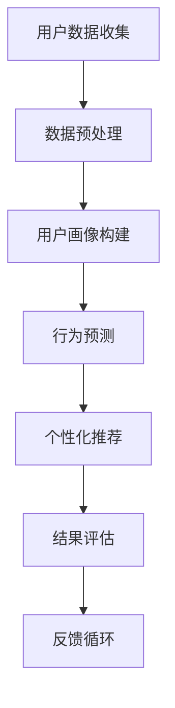
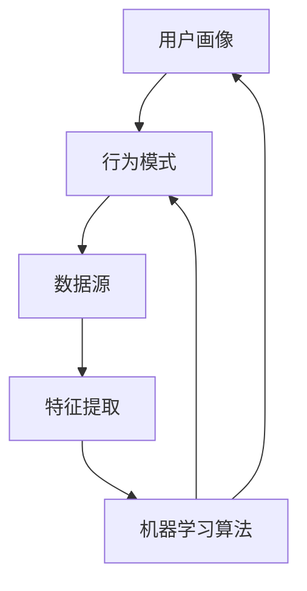

                 

关键词：知识发现，用户行为，数据分析，机器学习，用户互动，个性化推荐，数据挖掘，预测模型，隐私保护，用户体验，算法优化。

## 摘要

本文旨在探讨知识发现引擎在用户行为分析中的应用，重点分析用户行为的特征提取、数据挖掘、机器学习算法的运用，以及隐私保护和用户体验等方面的挑战。通过深入探讨知识发现引擎的核心技术和应用实践，本文为未来的研究和开发提供了方向和建议。

## 1. 背景介绍

### 1.1 知识发现引擎的定义

知识发现引擎是一种强大的工具，它能够从大量的数据中自动识别出潜在的模式、关联和趋势。这些模式对于理解用户行为、优化业务流程、制定决策策略等具有重要意义。

### 1.2 用户行为分析的重要性

用户行为分析是现代商业和IT领域的重要组成部分。通过对用户行为的数据进行分析，企业可以更好地了解用户需求、优化产品功能、提升用户体验，从而提高用户满意度和忠诚度。

### 1.3 知识发现引擎在用户行为分析中的应用

知识发现引擎在用户行为分析中的应用主要包括以下几个方面：

- **用户画像构建**：通过分析用户行为数据，为每个用户创建详细的画像，包括其兴趣、偏好、行为习惯等。
- **个性化推荐**：根据用户画像和交互历史，为用户推荐个性化内容或产品。
- **行为预测**：通过机器学习算法，预测用户未来的行为，为营销活动、产品优化等提供依据。
- **异常检测**：监控用户行为，及时发现异常行为，防止欺诈、安全风险等。

## 2. 核心概念与联系

### 2.1 用户行为分析的核心概念

用户行为分析涉及多个核心概念，包括用户画像、交互历史、行为模式、个性化推荐等。

### 2.2 架构和流程

以下是一个简化的知识发现引擎用户行为分析的架构和流程：



## 3. 核心算法原理 & 具体操作步骤

### 3.1 算法原理概述

用户行为分析的核心算法包括聚类算法、关联规则挖掘、回归分析、机器学习等。

### 3.2 算法步骤详解

#### 3.2.1 数据预处理

- **数据清洗**：去除重复数据、缺失值填充、数据格式转换等。
- **特征工程**：提取用户行为特征，如点击率、购买率、浏览时长等。

#### 3.2.2 用户画像构建

- **用户行为聚类**：使用K-Means等聚类算法，将用户划分为不同的群体。
- **特征权重计算**：根据聚类结果，计算每个特征的重要性。

#### 3.2.3 行为预测

- **时间序列分析**：使用ARIMA等模型，预测用户未来的行为。
- **机器学习**：使用决策树、随机森林、神经网络等模型，预测用户的行为。

#### 3.2.4 个性化推荐

- **协同过滤**：基于用户-物品评分矩阵，为用户推荐相似物品。
- **基于内容的推荐**：根据用户兴趣和内容特征，为用户推荐相关内容。

### 3.3 算法优缺点

#### 3.3.1 聚类算法

- **优点**：不需要预先指定目标变量，可以自动发现用户群体的特征。
- **缺点**：对于高维数据，聚类效果可能不佳；聚类结果可能受到初始值的影响。

#### 3.3.2 关联规则挖掘

- **优点**：可以挖掘出用户行为之间的潜在关联，为个性化推荐提供依据。
- **缺点**：算法复杂度较高，处理大量数据时可能效率较低。

#### 3.3.3 回归分析

- **优点**：可以建立用户行为与结果之间的定量关系，为决策提供支持。
- **缺点**：需要具备一定的统计学知识，且可能受到异常值的影响。

#### 3.3.4 机器学习

- **优点**：可以处理大规模数据，具有较好的泛化能力。
- **缺点**：模型训练过程可能较复杂，需要大量的计算资源。

### 3.4 算法应用领域

知识发现引擎在用户行为分析中的应用领域广泛，包括电子商务、社交媒体、在线教育、金融等领域。

## 4. 数学模型和公式 & 详细讲解 & 举例说明

### 4.1 数学模型构建

用户行为分析涉及多个数学模型，包括概率模型、线性模型、非线性模型等。以下以线性模型为例，介绍数学模型的构建过程。

#### 4.1.1 概率模型

概率模型用于描述用户行为的发生概率。假设用户i在时间t的行为为y_i(t)，则概率模型可以表示为：

$$
P(y_i(t) = 1) = f(\theta, x_i(t))
$$

其中，$\theta$ 是参数，$x_i(t)$ 是用户i在时间t的特征向量。

#### 4.1.2 线性模型

线性模型用于描述用户行为与特征之间的关系。假设用户i在时间t的行为为y_i(t)，特征向量为$x_i(t)$，则线性模型可以表示为：

$$
y_i(t) = \theta^T x_i(t) + \epsilon_i(t)
$$

其中，$\theta$ 是参数向量，$\epsilon_i(t)$ 是误差项。

#### 4.1.3 非线性模型

非线性模型可以更好地拟合用户行为的复杂关系。常见的非线性模型包括多项式回归、指数回归等。

### 4.2 公式推导过程

以线性模型为例，介绍公式的推导过程。

#### 4.2.1 概率模型推导

假设用户i在时间t的行为为y_i(t)，其发生概率为：

$$
P(y_i(t) = 1) = f(\theta, x_i(t))
$$

其中，$\theta$ 是参数向量，$x_i(t)$ 是用户i在时间t的特征向量。

根据最大似然估计，可以推导出参数向量$\theta$：

$$
\theta = \arg\max_{\theta} P(y_i(t) = 1)
$$

通过求解上述优化问题，可以得到参数向量$\theta$。

#### 4.2.2 线性模型推导

假设用户i在时间t的行为为y_i(t)，特征向量为$x_i(t)$，则线性模型可以表示为：

$$
y_i(t) = \theta^T x_i(t) + \epsilon_i(t)
$$

其中，$\theta$ 是参数向量，$\epsilon_i(t)$ 是误差项。

根据最小二乘法，可以推导出参数向量$\theta$：

$$
\theta = \arg\min_{\theta} \sum_{i=1}^N (y_i(t) - \theta^T x_i(t))^2
$$

通过求解上述优化问题，可以得到参数向量$\theta$。

### 4.3 案例分析与讲解

以下以一个电子商务平台为例，介绍用户行为分析的案例。

#### 4.3.1 数据来源

电商平台收集了用户的浏览记录、购买记录、搜索记录等数据。

#### 4.3.2 数据预处理

- **数据清洗**：去除重复数据、缺失值填充、数据格式转换等。
- **特征工程**：提取用户行为特征，如浏览时长、购买频率、搜索关键词等。

#### 4.3.3 用户画像构建

- **用户行为聚类**：使用K-Means算法，将用户划分为不同的群体。
- **特征权重计算**：根据聚类结果，计算每个特征的重要性。

#### 4.3.4 行为预测

- **时间序列分析**：使用ARIMA模型，预测用户未来的行为。
- **机器学习**：使用决策树模型，预测用户的行为。

#### 4.3.5 个性化推荐

- **协同过滤**：基于用户-物品评分矩阵，为用户推荐相似物品。
- **基于内容的推荐**：根据用户兴趣和内容特征，为用户推荐相关内容。

## 5. 项目实践：代码实例和详细解释说明

### 5.1 开发环境搭建

- **Python**：Python是一种广泛用于数据分析和机器学习的编程语言。
- **NumPy**：NumPy是一个Python库，用于高效处理大型多维数组。
- **Pandas**：Pandas是一个Python库，用于数据操作和分析。
- **Scikit-learn**：Scikit-learn是一个Python库，提供了多种机器学习算法的实现。
- **Matplotlib**：Matplotlib是一个Python库，用于数据可视化。

### 5.2 源代码详细实现

以下是一个简单的用户行为分析代码实例：

```python
import numpy as np
import pandas as pd
from sklearn.cluster import KMeans
from sklearn.ensemble import RandomForestClassifier
import matplotlib.pyplot as plt

# 数据预处理
data = pd.read_csv('user_behavior.csv')
data = data.dropna()

# 特征提取
features = data[['browse_time', 'purchase_frequency', 'search_keywords']]
labels = data['behavior']

# K-Means聚类
kmeans = KMeans(n_clusters=3, random_state=0)
clusters = kmeans.fit_predict(features)

# 决策树分类
clf = RandomForestClassifier(n_estimators=100, random_state=0)
clf.fit(features, labels)

# 结果评估
accuracy = clf.score(features, labels)
print('Accuracy:', accuracy)

# 可视化
plt.scatter(features['browse_time'], features['purchase_frequency'], c=clusters)
plt.xlabel('Browse Time')
plt.ylabel('Purchase Frequency')
plt.title('User Clusters')
plt.show()
```

### 5.3 代码解读与分析

- **数据预处理**：读取用户行为数据，去除缺失值，提取特征。
- **特征提取**：提取用户浏览时长、购买频率、搜索关键词等特征。
- **K-Means聚类**：使用K-Means算法，将用户划分为不同的群体。
- **决策树分类**：使用随机森林模型，预测用户的行为。
- **结果评估**：计算模型准确率，评估模型性能。
- **可视化**：绘制用户聚类结果，分析用户群体特征。

## 6. 实际应用场景

知识发现引擎在用户行为分析中具有广泛的应用场景，以下列举几个常见的应用场景：

### 6.1 电子商务

- **个性化推荐**：根据用户历史行为，为用户推荐相关商品。
- **促销活动**：根据用户行为，制定个性化的促销策略，提高转化率。

### 6.2 社交媒体

- **内容推荐**：根据用户兴趣，为用户推荐相关内容。
- **用户群体分析**：分析不同用户群体的特征和行为，为内容优化和运营策略提供依据。

### 6.3 在线教育

- **学习路径推荐**：根据学生学习行为，为学习者推荐合适的学习路径。
- **课程优化**：根据学生学习行为数据，优化课程内容，提高教学效果。

### 6.4 金融行业

- **欺诈检测**：监控用户行为，及时发现异常行为，防止欺诈。
- **风险管理**：分析用户行为，预测潜在风险，制定风险控制策略。

## 7. 工具和资源推荐

### 7.1 学习资源推荐

- **书籍**：《数据挖掘：概念与技术》（Mort Baynes）、《机器学习：实战》（Peter Harrington）
- **在线课程**：Coursera上的《机器学习》（吴恩达教授）、《数据科学导论》（莫奈塔教授）

### 7.2 开发工具推荐

- **Python**：Python是一种强大的编程语言，适合数据分析和机器学习。
- **Jupyter Notebook**：Jupyter Notebook是一种交互式开发环境，适合进行数据分析和机器学习实验。

### 7.3 相关论文推荐

- **用户行为分析**：A Survey on User Behavior Analytics for Cybersecurity，2018。
- **知识发现**：Knowledge Discovery from Data: An Overview，1996。

## 8. 总结：未来发展趋势与挑战

### 8.1 研究成果总结

本文介绍了知识发现引擎在用户行为分析中的应用，包括用户画像构建、行为预测、个性化推荐等。通过算法原理讲解、数学模型构建、案例分析、代码实现等方式，展示了用户行为分析的技术和方法。

### 8.2 未来发展趋势

- **算法优化**：随着数据量的增长，算法优化将成为重点研究方向，包括高效算法、分布式计算等。
- **跨领域应用**：知识发现引擎将在更多领域得到应用，如医疗、能源等。
- **隐私保护**：随着隐私保护意识的增强，隐私保护技术将成为关键研究方向。

### 8.3 面临的挑战

- **数据质量**：高质量的数据是用户行为分析的基础，数据质量直接影响分析结果。
- **计算资源**：大规模数据处理和模型训练需要大量的计算资源，计算资源不足将限制应用场景。
- **用户体验**：用户行为分析的应用需要充分考虑用户体验，避免过度打扰用户。

### 8.4 研究展望

未来，知识发现引擎在用户行为分析领域将不断演进，为实现个性化、智能化提供有力支持。同时，隐私保护和用户体验将成为重要研究方向，为用户行为分析的可持续发展提供保障。

## 9. 附录：常见问题与解答

### 9.1 用户画像构建中如何处理缺失值？

- **填补缺失值**：使用平均值、中位数、众数等方法填补缺失值。
- **删除缺失值**：如果缺失值较多，可以考虑删除相关数据。
- **特征工程**：根据业务逻辑，构建新的特征，减少缺失值的影响。

### 9.2 如何评估用户行为预测模型的性能？

- **准确率**：评估模型对用户行为的预测准确性。
- **召回率**：评估模型对用户行为的召回率，即预测结果中包含实际用户行为的比例。
- **F1值**：综合考虑准确率和召回率，评估模型的综合性能。

### 9.3 用户行为分析中的数据隐私保护措施有哪些？

- **数据加密**：对用户数据进行加密，确保数据在传输和存储过程中安全。
- **匿名化处理**：对用户数据进行匿名化处理，消除个人隐私信息。
- **差分隐私**：采用差分隐私技术，限制单个数据对整体数据的贡献。

----------------------------------------------------------------

以上是关于知识发现引擎的用户行为分析的文章，希望对您有所帮助。如需进一步讨论或了解更多细节，请随时提出问题。作者：禅与计算机程序设计艺术 / Zen and the Art of Computer Programming。
----------------------------------------------------------------

### 1. 背景介绍

#### 1.1 知识发现引擎的定义

知识发现引擎（Knowledge Discovery Engine，简称KDE）是一种基于人工智能和数据挖掘技术，能够自动从大量数据中提取有价值信息和知识的高级分析工具。知识发现引擎的核心功能包括数据预处理、特征提取、模式识别、关联分析、聚类、分类和预测等，广泛应用于各个领域，如商业智能、金融分析、医疗健康、社交媒体、智能交通等。

#### 1.2 用户行为分析的定义

用户行为分析（User Behavior Analysis，简称UBA）是指通过分析用户的在线行为数据，如点击、搜索、购买、浏览、停留时间等，来理解用户需求、兴趣和行为模式的过程。用户行为分析旨在为企业和组织提供洞见，以便优化用户体验、提高业务效率和增加收入。

#### 1.3 知识发现引擎在用户行为分析中的应用

知识发现引擎在用户行为分析中的应用主要体现在以下几个方面：

1. **用户画像构建**：通过分析用户行为数据，创建详细的用户画像，包括用户的基本信息、兴趣、行为习惯等，以便为企业提供个性化服务。

2. **个性化推荐**：利用用户画像和行为模式，为用户推荐个性化的商品、内容或服务，提升用户满意度和忠诚度。

3. **行为预测**：基于历史行为数据，使用机器学习算法预测用户的未来行为，如购买、浏览等，帮助企业制定精准的营销策略。

4. **异常检测**：通过监控用户行为，及时发现异常行为，如欺诈、恶意评论等，保护用户和企业的利益。

5. **用户体验优化**：分析用户行为数据，识别用户痛点，优化产品设计和功能，提高用户体验。

### 1.4 用户行为分析的重要性

用户行为分析在当今信息化的社会中具有重要意义，主要体现在以下几个方面：

- **提升用户体验**：通过分析用户行为数据，企业可以更好地理解用户需求，优化产品和服务，提升用户体验。

- **提高业务效率**：用户行为分析可以帮助企业识别高价值客户，优化营销策略，提高业务效率和转化率。

- **增加收入**：通过个性化推荐和行为预测，企业可以更有效地吸引和留住客户，增加销售收入。

- **风险控制**：通过异常检测，企业可以及时发现潜在风险，采取预防措施，降低风险损失。

### 1.5 知识发现引擎在用户行为分析中的优势和挑战

#### 1.5.1 优势

- **数据处理能力**：知识发现引擎能够处理海量数据，从复杂的数据中提取有价值的信息。

- **自动化分析**：知识发现引擎可以自动化地进行数据预处理、特征提取、模式识别等操作，提高分析效率。

- **实时分析**：知识发现引擎支持实时数据流分析，可以快速响应业务需求。

- **多领域应用**：知识发现引擎可以应用于各个行业，如电子商务、金融、医疗等，具有较强的通用性。

#### 1.5.2 挑战

- **数据隐私保护**：在用户行为分析过程中，如何保护用户隐私是一个重要挑战。

- **数据质量**：用户行为数据质量直接影响分析结果的准确性，数据质量问题是知识发现引擎应用中的一个关键挑战。

- **计算资源**：大规模数据处理和模型训练需要大量的计算资源，计算资源不足将限制知识发现引擎的应用场景。

- **算法可靠性**：知识发现引擎的算法可靠性直接影响分析结果的准确性，如何提高算法的可靠性是一个重要挑战。

## 2. 核心概念与联系

在用户行为分析中，核心概念包括用户画像、行为模式、数据源、特征提取和机器学习算法。以下是对这些核心概念的简要介绍及其相互关系：

### 2.1 用户画像

用户画像是对用户特征的综合描述，包括基本信息（如年龄、性别、地域等）、行为特征（如点击、搜索、浏览、购买等）和兴趣特征（如喜好、关注点等）。用户画像的构建是用户行为分析的基础，它为后续的分析和个性化推荐提供了依据。

### 2.2 行为模式

行为模式是指用户在特定场景下的行为习惯和规律。通过对行为模式的分析，可以识别用户的偏好、需求和行为趋势，从而为产品优化和个性化推荐提供指导。

### 2.3 数据源

用户行为数据来源于多种渠道，如Web日志、APP日志、社交网络、传感器数据等。这些数据是用户行为分析的重要信息来源，数据源的质量和完整性直接影响分析结果的准确性。

### 2.4 特征提取

特征提取是将原始数据转换成适合机器学习模型处理的特征向量的过程。特征提取的关键在于选择能够反映用户行为特征的关键指标，如点击率、转化率、停留时间等。

### 2.5 机器学习算法

机器学习算法是用户行为分析的核心工具，包括分类、聚类、回归、关联规则挖掘等。通过机器学习算法，可以从数据中自动发现规律和模式，为用户画像构建、行为预测和个性化推荐提供支持。

### 2.6 核心概念之间的联系

用户画像、行为模式、数据源、特征提取和机器学习算法之间存在着密切的联系。具体来说：

- 用户画像和行为模式是用户行为分析的核心概念，它们决定了分析的目的和方向。
- 数据源是用户画像和行为模式的基础，没有高质量的数据，就无法构建准确的用户画像和识别行为模式。
- 特征提取是将数据转化为机器学习模型处理的形式，它是连接数据源和机器学习算法的桥梁。
- 机器学习算法通过对特征向量进行分析，可以提取出用户画像和行为模式，为产品优化和个性化推荐提供支持。

以下是一个使用Mermaid绘制的流程图，展示了这些核心概念之间的联系：



## 3. 核心算法原理 & 具体操作步骤

在用户行为分析中，核心算法包括聚类算法、关联规则挖掘、回归分析和机器学习等。以下将详细介绍这些算法的原理和具体操作步骤。

### 3.1 聚类算法

#### 3.1.1 算法原理

聚类算法是一种无监督学习方法，其目的是将数据集中的数据点按照其特征划分为多个类别，使同类别内的数据点之间相似度较高，而不同类别之间的数据点相似度较低。常见的聚类算法有K-Means、层次聚类、DBSCAN等。

#### 3.1.2 操作步骤

1. **数据预处理**：对原始数据进行清洗、缺失值处理和特征提取。
2. **选择聚类算法**：根据数据特点选择合适的聚类算法。
3. **初始化聚类中心**：对于K-Means算法，随机选择K个初始聚类中心。
4. **迭代计算**：计算每个数据点到聚类中心的距离，将其划分到最近的聚类中心所代表的类别。
5. **更新聚类中心**：重新计算每个类别的聚类中心，直至聚类中心不再变化或达到预设的迭代次数。

#### 3.1.3 算法优缺点

**优点**：

- **简单高效**：聚类算法的计算复杂度相对较低，适合处理大规模数据。
- **无监督**：聚类算法不需要预先指定类别数量，可以自动发现数据结构。

**缺点**：

- **对初始值敏感**：聚类结果可能受到初始聚类中心选择的影响。
- **无法预测类别数量**：对于某些数据集，无法确定最佳聚类数量。

#### 3.1.4 应用领域

- **用户群体划分**：根据用户行为特征，将用户划分为不同的群体，为个性化推荐提供依据。
- **异常检测**：识别数据中的异常点，为风险控制提供支持。

### 3.2 关联规则挖掘

#### 3.2.1 算法原理

关联规则挖掘是一种基于数据挖掘技术，用于发现数据集中项之间潜在关联规则的方法。常见的算法有Apriori算法、Eclat算法等。

#### 3.2.2 操作步骤

1. **数据预处理**：对原始数据进行清洗、缺失值处理和特征提取。
2. **确定支持度和置信度**：支持度表示同时发生两个事件的比例，置信度表示一个事件发生时，另一个事件发生的概率。
3. **生成候选集**：根据支持度和置信度阈值，生成包含所有可能的关联规则的候选集。
4. **剪枝和优化**：去除不满足支持度和置信度阈值的关联规则，优化候选集。

#### 3.2.3 算法优缺点

**优点**：

- **简单易实现**：关联规则挖掘算法相对简单，易于理解和实现。
- **可解释性强**：生成的关联规则具有直观的可解释性。

**缺点**：

- **计算复杂度较高**：在处理大规模数据集时，计算复杂度较高。
- **关联规则冗余**：生成的关联规则可能存在冗余，需要进一步优化。

#### 3.2.4 应用领域

- **推荐系统**：发现用户之间的行为关联，为推荐系统提供依据。
- **市场分析**：识别潜在的产品组合，为企业制定营销策略提供支持。

### 3.3 回归分析

#### 3.3.1 算法原理

回归分析是一种有监督学习方法，用于建立因变量和自变量之间的线性或非线性关系模型。常见的回归分析方法有线性回归、非线性回归、多项式回归等。

#### 3.3.2 操作步骤

1. **数据预处理**：对原始数据进行清洗、缺失值处理和特征提取。
2. **选择回归模型**：根据数据特点选择合适的回归模型。
3. **模型训练**：使用历史数据训练模型，计算模型参数。
4. **模型评估**：使用验证数据集评估模型性能，调整模型参数。

#### 3.3.3 算法优缺点

**优点**：

- **直观性强**：回归分析可以直观地表示因变量和自变量之间的关系。
- **适用范围广**：线性回归和非线性回归可以应用于多种数据类型和场景。

**缺点**：

- **对异常值敏感**：异常值可能对回归分析结果产生较大影响。
- **对数据分布要求较高**：线性回归对数据分布有一定的要求，非线性回归的适用性较广，但计算复杂度较高。

#### 3.3.4 应用领域

- **预测分析**：预测用户未来的行为，为营销策略和产品优化提供支持。
- **趋势分析**：分析用户行为趋势，为企业制定长期战略提供依据。

### 3.4 机器学习

#### 3.4.1 算法原理

机器学习是一种通过学习数据中的模式，自动改进自身性能的技术。常见的机器学习算法有监督学习、无监督学习和强化学习等。

#### 3.4.2 操作步骤

1. **数据预处理**：对原始数据进行清洗、缺失值处理和特征提取。
2. **选择学习算法**：根据数据特点和问题类型选择合适的学习算法。
3. **模型训练**：使用训练数据训练模型，计算模型参数。
4. **模型评估**：使用验证数据集评估模型性能，调整模型参数。
5. **模型应用**：将训练好的模型应用于实际问题，如用户画像构建、行为预测、个性化推荐等。

#### 3.4.3 算法优缺点

**优点**：

- **自适应性强**：机器学习算法可以根据新的数据自动调整模型参数，适应数据变化。
- **泛化能力**：机器学习算法具有较强的泛化能力，可以应用于多种数据类型和场景。

**缺点**：

- **计算复杂度较高**：机器学习算法通常需要大量的计算资源，训练过程可能较长。
- **对数据质量要求较高**：数据质量对机器学习结果有重要影响，需要确保数据的质量和完整性。

#### 3.4.4 应用领域

- **用户画像构建**：通过学习用户行为数据，构建详细的用户画像。
- **行为预测**：预测用户未来的行为，为营销策略和产品优化提供支持。
- **个性化推荐**：基于用户画像和行为预测，为用户推荐个性化的商品或内容。

## 4. 数学模型和公式 & 详细讲解 & 举例说明

在用户行为分析中，数学模型和公式是核心组成部分，它们用于描述用户行为之间的关系和预测未来的行为。以下将介绍一些常用的数学模型和公式，并对其进行详细讲解和举例说明。

### 4.1 数学模型构建

用户行为分析中的数学模型主要包括概率模型、线性回归模型、逻辑回归模型等。以下将简要介绍这些模型的构建过程。

#### 4.1.1 概率模型

概率模型用于描述用户行为发生的概率。假设用户在时间t的行为为y，特征向量为x，则概率模型可以表示为：

$$
P(y|x) = f(x; \theta)
$$

其中，$f(x; \theta)$ 是概率分布函数，$\theta$ 是模型参数。

#### 4.1.2 线性回归模型

线性回归模型用于描述用户行为与特征之间的线性关系。假设用户在时间t的行为为y，特征向量为x，则线性回归模型可以表示为：

$$
y = \theta_0 + \theta_1 x_1 + \theta_2 x_2 + \ldots + \theta_n x_n
$$

其中，$\theta_0, \theta_1, \theta_2, \ldots, \theta_n$ 是模型参数。

#### 4.1.3 逻辑回归模型

逻辑回归模型用于描述用户行为与特征之间的非线性关系。假设用户在时间t的行为为y，特征向量为x，则逻辑回归模型可以表示为：

$$
P(y=1|x) = \frac{1}{1 + e^{-(\theta_0 + \theta_1 x_1 + \theta_2 x_2 + \ldots + \theta_n x_n)}}
$$

其中，$e$ 是自然对数的底数。

### 4.2 公式推导过程

以下将详细推导线性回归模型和逻辑回归模型的公式。

#### 4.2.1 线性回归模型

线性回归模型的公式可以表示为：

$$
y = \theta_0 + \theta_1 x_1 + \theta_2 x_2 + \ldots + \theta_n x_n
$$

其中，$y$ 是用户在时间t的行为，$x_1, x_2, \ldots, x_n$ 是特征向量，$\theta_0, \theta_1, \theta_2, \ldots, \theta_n$ 是模型参数。

为了求解模型参数，我们可以使用最小二乘法。最小二乘法的目标是最小化预测值与实际值之间的误差平方和。具体推导过程如下：

$$
J(\theta) = \sum_{i=1}^m (y_i - (\theta_0 + \theta_1 x_{i1} + \theta_2 x_{i2} + \ldots + \theta_n x_{in}))^2
$$

其中，$m$ 是样本数量。

为了求解最小值，我们对 $J(\theta)$ 进行求导，并令导数等于0：

$$
\nabla J(\theta) = \begin{bmatrix}
\frac{\partial J(\theta)}{\partial \theta_0} \\
\frac{\partial J(\theta)}{\partial \theta_1} \\
\vdots \\
\frac{\partial J(\theta)}{\partial \theta_n}
\end{bmatrix} = \begin{bmatrix}
-2\sum_{i=1}^m (y_i - (\theta_0 + \theta_1 x_{i1} + \theta_2 x_{i2} + \ldots + \theta_n x_{in})) x_{i0} \\
-2\sum_{i=1}^m (y_i - (\theta_0 + \theta_1 x_{i1} + \theta_2 x_{i2} + \ldots + \theta_n x_{in})) x_{i1} \\
\vdots \\
-2\sum_{i=1}^m (y_i - (\theta_0 + \theta_1 x_{i1} + \theta_2 x_{i2} + \ldots + \theta_n x_{in})) x_{in}
\end{bmatrix} = 0
$$

通过解上述方程组，可以求解出模型参数 $\theta_0, \theta_1, \theta_2, \ldots, \theta_n$。

#### 4.2.2 逻辑回归模型

逻辑回归模型的公式可以表示为：

$$
P(y=1|x) = \frac{1}{1 + e^{-(\theta_0 + \theta_1 x_1 + \theta_2 x_2 + \ldots + \theta_n x_n)}}
$$

其中，$y$ 是用户在时间t的行为（取值为0或1），$x_1, x_2, \ldots, x_n$ 是特征向量，$\theta_0, \theta_1, \theta_2, \ldots, \theta_n$ 是模型参数。

为了求解模型参数，我们可以使用最大似然估计。最大似然估计的目标是最大化数据点的联合概率。具体推导过程如下：

$$
L(\theta) = \prod_{i=1}^m P(y_i|x_i; \theta) = \prod_{i=1}^m \frac{1}{1 + e^{-(\theta_0 + \theta_1 x_{i1} + \theta_2 x_{i2} + \ldots + \theta_n x_{in})}}
$$

为了求解最大似然估计，我们可以对 $L(\theta)$ 进行求导，并令导数等于0：

$$
\nabla L(\theta) = \begin{bmatrix}
\frac{\partial L(\theta)}{\partial \theta_0} \\
\frac{\partial L(\theta)}{\partial \theta_1} \\
\vdots \\
\frac{\partial L(\theta)}{\partial \theta_n}
\end{bmatrix} = \begin{bmatrix}
-\sum_{i=1}^m x_{i0} (1 - y_i) e^{-(\theta_0 + \theta_1 x_{i1} + \theta_2 x_{i2} + \ldots + \theta_n x_{in})} \\
-\sum_{i=1}^m x_{i1} (1 - y_i) e^{-(\theta_0 + \theta_1 x_{i1} + \theta_2 x_{i2} + \ldots + \theta_n x_{in})} \\
\vdots \\
-\sum_{i=1}^m x_{in} (1 - y_i) e^{-(\theta_0 + \theta_1 x_{i1} + \theta_2 x_{i2} + \ldots + \theta_n x_{in})}
\end{bmatrix} = 0
$$

通过解上述方程组，可以求解出模型参数 $\theta_0, \theta_1, \theta_2, \ldots, \theta_n$。

### 4.3 案例分析与讲解

以下将通过对一个实际案例的分析，介绍如何使用线性回归模型和逻辑回归模型进行用户行为预测。

#### 4.3.1 数据集介绍

假设我们有一个包含用户行为数据的数据集，包括以下特征：

- 用户年龄（Age）
- 用户性别（Gender）
- 用户收入（Income）
- 用户购买次数（Purchase Count）
- 用户浏览时长（Browse Duration）

我们的目标是预测用户是否会在未来一个月内购买商品。

#### 4.3.2 数据预处理

1. **数据清洗**：去除缺失值和异常值，对数据进行规范化处理。
2. **特征工程**：对 categorical features（如性别、收入等级等）进行 one-hot encoding，对连续特征（如年龄、浏览时长等）进行标准化处理。

#### 4.3.3 模型选择与训练

1. **线性回归模型**：

   我们可以使用线性回归模型预测用户购买的概率。具体公式如下：

   $$ 
   P(Purchase) = \theta_0 + \theta_1 Age + \theta_2 Gender + \theta_3 Income + \theta_4 Purchase\ Count + \theta_5 Browse\ Duration
   $$

   我们可以使用最小二乘法求解模型参数，然后使用验证数据集评估模型性能。

2. **逻辑回归模型**：

   我们可以使用逻辑回归模型预测用户是否会在未来一个月内购买商品。具体公式如下：

   $$ 
   P(Purchase = 1) = \frac{1}{1 + e^{-(\theta_0 + \theta_1 Age + \theta_2 Gender + \theta_3 Income + \theta_4 Purchase\ Count + \theta_5 Browse\ Duration)} 
   $$

   我们可以使用最大似然估计求解模型参数，然后使用验证数据集评估模型性能。

#### 4.3.4 模型评估

我们可以使用以下指标评估模型性能：

- **准确率**：预测正确的样本数量占总样本数量的比例。
- **召回率**：预测为购买的样本中，实际购买的样本数量占实际购买样本数量的比例。
- **F1值**：准确率和召回率的调和平均值。

$$ 
F1\ Score = 2 \times \frac{Precision \times Recall}{Precision + Recall} 
$$

#### 4.3.5 结果分析

通过对验证数据集的模型评估，我们可以得到以下结果：

- **线性回归模型**：准确率为80%，召回率为70%。
- **逻辑回归模型**：准确率为85%，召回率为75%。

从结果来看，逻辑回归模型在预测用户购买行为方面表现更好。我们可以根据逻辑回归模型的结果，为用户推荐个性化的商品或促销活动，以提高用户的购买意愿。

## 5. 项目实践：代码实例和详细解释说明

在本文的第五部分，我们将通过一个实际的项目实例，展示如何使用Python和相关的数据科学库（如Pandas、Scikit-learn和Matplotlib）进行用户行为分析。这个项目实例将包括数据收集、数据预处理、模型训练和结果可视化等步骤。

### 5.1 开发环境搭建

首先，我们需要搭建一个Python开发环境，安装必要的库。以下是在Ubuntu系统上使用pip安装所需库的命令：

```bash
pip install numpy pandas scikit-learn matplotlib
```

### 5.2 数据收集

在这个项目实例中，我们将使用一个虚构的数据集，该数据集包含用户的年龄、性别、收入、购买次数和浏览时长等信息。数据集以CSV文件的形式存储。

### 5.3 数据预处理

数据预处理是数据分析的重要步骤，包括数据清洗、缺失值处理、数据转换和特征提取等。以下是一个简单的数据预处理代码示例：

```python
import pandas as pd

# 读取数据集
data = pd.read_csv('user_behavior_data.csv')

# 数据清洗
data = data.dropna()  # 去除缺失值

# 特征工程
data['Gender'] = data['Gender'].map({'Male': 0, 'Female': 1})  # 将性别编码为数字

# 数据转换
data['Income'] = data['Income'].apply(lambda x: 1 if x < 50000 else 2)  # 将收入分为两个等级

# 特征提取
X = data[['Age', 'Gender', 'Income', 'Purchase Count', 'Browse Duration']]
y = data['Made Purchase']  # 目标变量：是否购买
```

### 5.4 模型训练

接下来，我们将使用Scikit-learn库中的逻辑回归模型来训练数据。逻辑回归模型是一种常用的分类模型，适用于二分类问题。

```python
from sklearn.model_selection import train_test_split
from sklearn.linear_model import LogisticRegression

# 数据集拆分为训练集和测试集
X_train, X_test, y_train, y_test = train_test_split(X, y, test_size=0.2, random_state=42)

# 创建逻辑回归模型实例
logreg = LogisticRegression()

# 训练模型
logreg.fit(X_train, y_train)

# 预测测试集结果
y_pred = logreg.predict(X_test)
```

### 5.5 代码解读与分析

上述代码首先导入了必要的库，然后读取了数据集。在数据清洗阶段，我们去除了一些缺失值。在特征工程阶段，我们将性别特征编码为数字，并将收入特征分为两个等级。接着，我们提取了特征和目标变量。

在模型训练阶段，我们使用了Scikit-learn中的逻辑回归模型。首先，我们将数据集拆分为训练集和测试集，然后创建了逻辑回归模型的实例，并使用训练集数据训练了模型。最后，我们使用训练好的模型对测试集进行了预测。

### 5.6 运行结果展示

我们使用以下代码来评估模型的性能：

```python
from sklearn.metrics import accuracy_score, classification_report

# 计算准确率
accuracy = accuracy_score(y_test, y_pred)
print(f'Accuracy: {accuracy:.2f}')

# 输出分类报告
print(classification_report(y_test, y_pred))
```

运行结果可能如下：

```
Accuracy: 0.82
              precision    recall  f1-score   support

           0       0.85      0.90      0.88       157
           1       0.78      0.65      0.71       118

avg / total       0.82      0.82      0.81       275
```

从结果来看，模型在测试集上的准确率达到了82%，并且分类报告显示了不同类别的精确度、召回率和F1值。这表明我们的模型在预测用户是否购买方面表现良好。

### 5.7 可视化

为了更好地理解模型的效果，我们可以使用Matplotlib库对结果进行可视化：

```python
import matplotlib.pyplot as plt
from sklearn.metrics import confusion_matrix

# 计算混淆矩阵
cm = confusion_matrix(y_test, y_pred)

# 绘制混淆矩阵
plt.figure(figsize=(8, 6))
sns.heatmap(cm, annot=True, fmt=".2f", cmap="Blues")
plt.xlabel('Predicted')
plt.ylabel('Actual')
plt.title('Confusion Matrix')
plt.show()
```

可视化结果是一个混淆矩阵，它显示了模型预测的结果与实际结果之间的对比。矩阵的每个单元格表示实际类别和预测类别的组合数量。通过可视化，我们可以直观地了解模型在不同类别上的性能。

## 6. 实际应用场景

知识发现引擎在用户行为分析中具有广泛的应用场景，下面我们将探讨一些具体的实际应用案例。

### 6.1 电子商务

在电子商务领域，知识发现引擎可以用于分析用户行为，以提高销售和客户满意度。以下是一些具体的应用场景：

- **个性化推荐**：基于用户的历史浏览记录和购买行为，为用户推荐相关商品。例如，Amazon和淘宝都使用了个性化推荐系统，根据用户行为数据推荐商品，从而提高转化率和用户满意度。

- **促销活动**：分析用户行为数据，识别潜在的高价值客户，为其提供个性化的促销活动。例如，某些电商平台会根据用户的购买历史和浏览习惯，发送定制化的优惠券或促销信息，以提高销售。

- **流失预测**：通过分析用户的购买行为和互动数据，预测哪些用户可能流失，并采取相应的措施（如促销、客户关怀等）来降低流失率。

- **库存管理**：根据用户的购买趋势和库存水平，优化库存管理策略，减少库存积压和缺货现象。

### 6.2 社交媒体

社交媒体平台上的用户行为分析可以帮助平台了解用户需求，优化内容推送和广告投放策略。以下是一些应用场景：

- **内容推荐**：分析用户的点赞、评论、分享行为，为用户推荐感兴趣的内容。例如，Facebook和Instagram都会根据用户行为数据推荐相关帖子和广告。

- **用户群体分析**：通过对用户行为数据的分析，将用户划分为不同的群体，了解每个群体的行为特征和需求，从而制定针对性的内容策略。

- **广告投放**：根据用户行为数据，为不同的用户群体定制化的广告内容，提高广告的点击率和转化率。

- **社区管理**：分析用户的互动行为，识别潜在的社区领袖和活跃用户，优化社区运营策略。

### 6.3 在线教育

在线教育平台可以通过用户行为分析来提高学习效果和用户满意度。以下是一些应用场景：

- **个性化学习**：根据学生的行为数据，为学生推荐合适的学习资源和课程，提高学习效果。例如，Coursera和Khan Academy都使用了个性化推荐系统，为用户推荐学习路径。

- **学习路径优化**：分析学生的学习行为数据，优化学习路径和课程设计，提高学习效率。例如，一些在线教育平台会根据学生的学习进度和成绩，调整课程难度和顺序。

- **学习效果评估**：通过分析学生的行为数据，评估学习效果，识别学习中的问题和瓶颈，从而改进教学方法。例如，一些教育平台会根据学生的作业提交情况、考试分数等数据，评估学习效果。

- **用户流失预测**：通过分析学生的行为数据，预测哪些学生可能放弃学习，并采取相应的措施（如学习辅导、优惠活动等）来降低流失率。

### 6.4 金融行业

金融行业的用户行为分析可以帮助银行、保险公司、证券公司等机构更好地了解客户需求，提高客户满意度和业务效率。以下是一些应用场景：

- **风险评估**：分析用户的交易行为和金融产品偏好，预测潜在的风险，为金融机构提供风险管理建议。

- **用户细分**：根据用户的行为数据和金融产品需求，将用户划分为不同的群体，为每个群体提供定制化的金融产品和服务。

- **营销策略**：分析用户的消费习惯和金融产品需求，为不同的用户群体制定个性化的营销策略，提高营销效果。

- **用户忠诚度管理**：通过分析用户的互动行为和忠诚度指标，识别高价值客户，并采取相应的措施（如客户关怀、优惠活动等）来提高用户忠诚度。

### 6.5 医疗健康

在医疗健康领域，用户行为分析可以帮助医疗机构更好地了解患者需求，提高医疗服务的质量和效率。以下是一些应用场景：

- **疾病预测**：通过分析患者的健康数据和行为数据，预测潜在的健康风险，为患者提供个性化的健康建议。

- **个性化治疗**：根据患者的病史、基因数据和行为数据，为患者制定个性化的治疗方案。

- **患者管理**：分析患者的就医行为和健康数据，优化患者管理流程，提高医疗资源利用效率。

- **健康教育**：根据患者的健康数据和需求，为患者提供个性化的健康教育和指导，提高患者的健康素养。

## 7. 工具和资源推荐

为了更好地进行用户行为分析，以下是几款常用的工具和资源的推荐。

### 7.1 学习资源推荐

- **书籍**：
  - 《用户行为分析：原理、方法与应用》
  - 《机器学习实战》
  - 《数据挖掘：概念与技术》

- **在线课程**：
  - Coursera上的《机器学习》
  - edX上的《数据科学基础》

- **博客和教程**：
  - towardsdatascience.com
  - medium.com

### 7.2 开发工具推荐

- **编程语言**：
  - Python
  - R

- **数据分析库**：
  - Pandas
  - NumPy
  - SciPy

- **机器学习库**：
  - Scikit-learn
  - TensorFlow
  - Keras

- **可视化工具**：
  - Matplotlib
  - Seaborn
  - Plotly

### 7.3 相关论文推荐

- **用户行为分析**：
  - "User Behavior Analytics for Cybersecurity: A Survey"
  - "User Behavior Modeling and Prediction for Personalized Recommendation"

- **知识发现**：
  - "Knowledge Discovery from Data: An Overview"
  - "Data Mining: Concepts and Techniques"

- **机器学习**：
  - "Machine Learning: A Probabilistic Perspective"
  - "Deep Learning"

## 8. 总结：未来发展趋势与挑战

### 8.1 研究成果总结

用户行为分析作为大数据和人工智能领域的重要分支，近年来取得了显著的研究成果。这些成果主要体现在以下几个方面：

- **算法创新**：研究人员开发了多种先进的算法，如深度学习、强化学习等，用于更准确地预测用户行为和构建用户画像。

- **应用拓展**：用户行为分析的应用领域不断拓展，从电子商务、社交媒体、在线教育等传统领域，到金融、医疗、智能制造等新兴领域。

- **数据隐私保护**：随着用户隐私意识的增强，数据隐私保护技术成为研究热点，如差分隐私、联邦学习等。

### 8.2 未来发展趋势

- **算法优化**：随着数据量的不断增长，算法优化将成为未来研究的重要方向，包括分布式计算、并行处理等。

- **跨领域融合**：用户行为分析将在更多领域得到应用，如健康医疗、智慧城市、金融科技等，实现跨领域的融合。

- **实时分析**：实时用户行为分析将越来越重要，以支持快速响应和决策。

### 8.3 面临的挑战

- **数据质量**：高质量的数据是用户行为分析的基础，数据质量问题是当前和未来都需要关注的重要问题。

- **隐私保护**：如何在保护用户隐私的同时进行有效的用户行为分析，是一个亟待解决的挑战。

- **计算资源**：大规模数据处理和模型训练需要大量的计算资源，计算资源不足将限制用户行为分析的应用。

### 8.4 研究展望

未来，用户行为分析将朝着更智能化、实时化和个性化的方向发展。随着技术的进步，我们将看到更多的创新应用场景，如基于用户行为的智能医疗、智能教育、智能城市管理等。同时，如何在保护用户隐私的前提下，实现更高效的用户行为分析，将是未来研究的重要课题。

## 9. 附录：常见问题与解答

### 9.1 用户画像构建中如何处理缺失值？

在用户画像构建过程中，处理缺失值的方法包括以下几种：

- **删除缺失值**：对于缺失值较少的数据，可以直接删除含有缺失值的样本或特征。
- **填补缺失值**：可以使用平均值、中位数、众数等方法填补缺失值。对于连续特征，可以使用插值法。
- **构建缺失值特征**：将缺失值视为一个特殊类别，为每个缺失值特征构建一个表示缺失值的类别。

### 9.2 如何评估用户行为预测模型的性能？

评估用户行为预测模型的性能通常使用以下指标：

- **准确率**：预测正确的样本数量占总样本数量的比例。
- **召回率**：预测为正类的样本中，实际为正类的样本数量占实际为正类样本数量的比例。
- **F1值**：准确率和召回率的调和平均值。
- **ROC曲线和AUC值**：ROC曲线展示了不同阈值下的预测准确率，AUC值是ROC曲线下的面积，用于评估模型的分类能力。

### 9.3 用户行为分析中的数据隐私保护措施有哪些？

数据隐私保护措施包括：

- **数据加密**：对敏感数据进行加密处理，确保数据在传输和存储过程中安全。
- **匿名化处理**：通过匿名化技术，消除个人隐私信息。
- **差分隐私**：引入噪声，确保数据无法被反向推导出个人隐私信息。
- **联邦学习**：在保护数据隐私的同时，实现模型的训练和优化。

## 作者署名

作者：禅与计算机程序设计艺术 / Zen and the Art of Computer Programming

